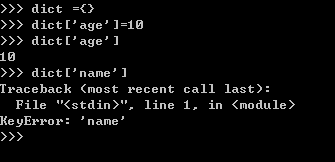

# 内置函数

2020年7月31日

---

## filter

**描述**

**filter()** 函数用于过滤序列，过滤掉不符合条件的元素，返回由符合条件元素组成的新列表。

该接收两个参数，第一个为函数，第二个为序列，序列的每个元素作为参数传递给函数进行判断，然后返回 True 或 False，最后将返回 True 的元素放到新列表中。

**语法**

以下是 filter() 方法的语法:

```
filter(function, iterable)
```

**参数**

- function -- 判断函数。
- iterable -- 可迭代对象。

**返回值**

返回列表。

------

**实例**

以下展示了使用 filter 函数的实例：

```
## 过滤出列表中的所有奇数：

#!/usr/bin/python 
# -*- coding: UTF-8 -*-  
def is_odd(n):    
		return n % 2 == 1  
		
newlist = filter(is_odd, [1, 2, 3, 4, 5, 6, 7, 8, 9, 10]) 
print(newlist)
```

输出结果 ：

```
[1, 3, 5, 7, 9]
```

```
## 过滤出1~100中平方根是整数的数：

#!/usr/bin/python 
# -*- coding: UTF-8 -*-  
import math 
def is_sqr(x):
		return math.sqrt(x) % 1 == 0  
		
newlist = filter(is_sqr, range(1, 101)) 
print(newlist)
```

输出结果 ：

```
[1, 4, 9, 16, 25, 36, 49, 64, 81, 100]
```


## defaultdict

**认识defaultdict：**

当我使用普通的字典时，用法一般是dict={},添加元素的只需要dict[element] =value即，调用的时候也是如此，dict[element] = xxx,但前提是element字典里，如果不在字典里就会报错，如：



这时defaultdict就能排上用场了，defaultdict的作用是在于，当字典里的key不存在但被查找时，返回的不是keyError而是一个默认值，这个默认值是什么呢，下面会说


**如何使用defaultdict**

defaultdict接受一个工厂函数作为参数，如下来构造：

```undefined
dict =defaultdict( factory_function)
```

这个factory_function可以是list、set、str等等，作用是当key不存在时，返回的是工厂函数的默认值，比如list对应[ ]，str对应的是空字符串，set对应set( )，int对应0，如下举例：

```dart
from collections import defaultdict

dict1 = defaultdict(int)
dict2 = defaultdict(set)
dict3 = defaultdict(str)
dict4 = defaultdict(list)
dict1[2] ='two'

print(dict1[1])
print(dict2[1])
print(dict3[1])
print(dict4[1])
```

输出：

```csharp
0
set()

[]
```

