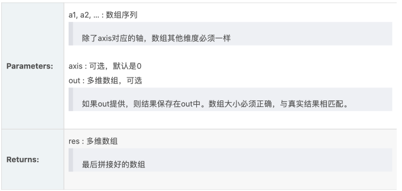

# numpy库数组拼接

2020年10月21日

---

concatenate功能：数组拼接

函数定义：

 `numpy.concatenate`((a1, a2, ...), axis=0, out=None)




官方示例：

```python
>>> a = np.array([[1, 2], [3, 4]])
>>> b = np.array([[5, 6]])
>>> np.concatenate((a, b), axis=0)
array([[1, 2],
       [3, 4],
       [5, 6]])
>>> np.concatenate((a, b.T), axis=1)
array([[1, 2, 5],
       [3, 4, 6]])


```

