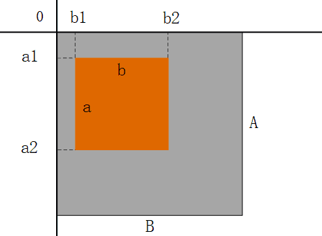
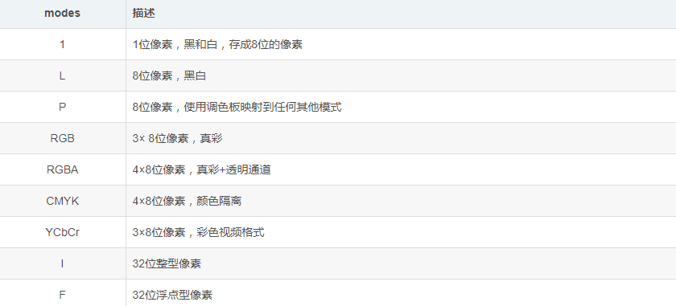
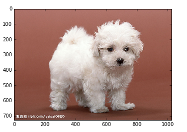
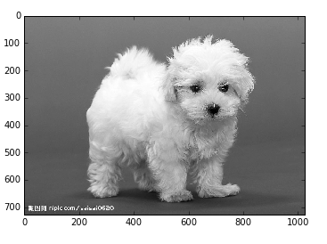
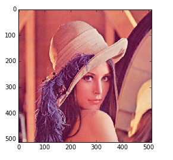
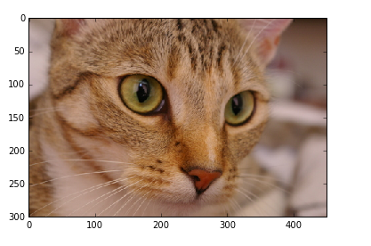
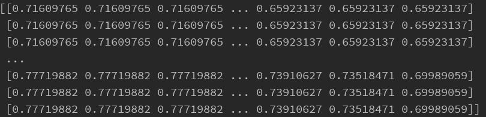
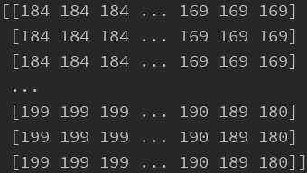

# Python读取图像的几种方法

2020年7月30日

---

如何对图像进行处理是深度学习图像处理的基础，我们常常需要对图像进行读取、保存、缩放、裁剪、旋转、颜色转换等基本操作。接下来讲解如何利用opencv、PIL、 scikit-image等进行图像处理，并比较它们之间微小的差异。


## 1. 简单介绍

### 1.1 方法一：PIL

利用PIL中的Image函数，这个函数读取出来不是array格式。  这时候需要用 np.asarray(im) 或者np.array（）函数，区别是 np.array() 是深拷贝，np.asarray() 是浅拷贝

- 图像类型：RGB
- 数据类型：Image
- 元素类型：uint8
- 通道格式：H,W,C

```python
from PIL import Image
import numpy as np

img = Image.open('image.jpg') #读取图片
img.show()  #展示图片
print(img_pil.mode)     #图像类型
print(img_pil.size)     #图像的宽高
img_arr = np.array(img)   #转为numpy形式，(H,W,C)
new_img = Image.fromarray(img_arr) #再转换为Image形式
new_img.save('newimage.jpg') #保存图片
gary = Image.open('image.jpg').convert('L')  #灰度图
r,g,b = img.split()  #通道的分离
img = Image.merge('RGB',(r,g,b))  #通道的合并
img_copy = img.copy()   #图像复制
img_resize = img.resize((w,h))   #resize
```

### 1.2 方法二：Matplotlib

利用matplotlib.pyplot as plt用于显示图片，matplotlib.image as mpimg 用于读取图片，并且读取出来就是array格式

- 图像类型：RGB
- 数据类型：numpy
- 元素类型：float
- 通道格式：H,W,C

```python
import matplotlib.pyplot as plt
import numpy as np 

img  = plt.imread('image.jpg') #读取图片
plt.imshow(img) 
plt.show()
plt.savefig('new_img.jpg')  #保存图片
img_r = img[:,:,0]   #灰度图
plt.imshow(img_r,cmap='Greys_r')  #显示灰度图
```

```python
import matplotlib.pyplot as plt
import matplotlib.image as mpimg
import numpy as np

I = mpimg.imread('./cc_1.png')
print I.shape
plt.imshow(I)
```

### 1.3 方法三：opencv-python

cv2.imread()读出来同样是array形式，但是如果是单通道的图，读出来的是三通道的

- 图像类型：BGR
- 数据类型：numpy
- 元素类型：uint8
- 通道格式：H,W,C

```python
import cv2
import numpy as np

img = cv2.imread('image.jpg')      #读取图片
cv2.imshow('the window name',img)  #显示图像
cv2.waitKey()                      
CV2.imwrite('new_image.jpg',img)   #保存图片
print(type(img))   #数据类型(numpy)
print(img.dtype)   #元素类型(uint8)
print(img.shape)  #通道格式(H,W,C)
print(img.size)   #像素点数
img = cv2.cvtColor(img,cv2.COLOR_BGR2RGB)  #BGR转RGB
gray = cv2.cvtColor(img,cv2.COLOR_BGR2GRAY)  #BGR转灰度图
gray = cv2.imread('image.jpg',cv2.IMREAD_GRAYSCALE)  #灰度图读取
image = cv2.resize(img,(100,200),interpolation=cv2.INTER_LINEAR) #resize
b,g,r = cv2.split(img)   #通道分离
merge_img = cv2.merge((b,g,r))   #通道合并
```

### 1.4 方法四：scipy

图像的存取我一般喜欢用scipy这个库里的东西，读出来是矩阵形式，并且按照（H，W，C）形式保存

```python
import matplotlib.pyplot as plt
from scipy import misc
import scipy

I = misc.imread('./cc_1.png')
scipy.misc.imsave('./save1.png', I)
plt.imshow(I)
plt.show()
```

### 1.5 方法五：skimage

- 图像类型：RGB
- 数据类型：numpy
- 元素类型：uint8(三原色)，float64(resize后或者灰度图，且为0~1)
- 通道格式：H,W,C

```python
import skimage
from skimage import io,transform

import numpy as np
image= io.imread('test.jpg',as_grey=False) #读取图片 False原图，True灰度图
print(type(img))   #数据类型(numpy)
print(img.dtype)   #元素类型(uint8)
print(img.shape)  #通道格式(H,W,C)
image = transform.resize(image,(h, w),order=1)　# order默认是1，双线性
```

```
from skimage import io,data
img=data.lena()
io.imshow(img)
```

### **1.6 Pytorch.ToTensor**

- 接受对象：PIL Image或者numpy.ndarray
- 接受格式：输入为H*W*C
- 处理过程：自己转换为C*H*W，再转为float后每个像素除以255

### **1.7 各种库之间的转换**

- Tensor转为numpy：`np.array(Tensor)`

- numpy转为Tensor：`torch.from_numpy(numpy.darray)`

- PIL.Image.Image换成numpy：`np.array(PIL.Image.Image)`

- numpy转成PIL.Image.Image：

  

  ```image
  注意：保证numpy.ndarray 转换成np.uint8，numpy.astype(np.uint8),像素值[0,255]；  
  灰度图像保证numpy.shape为(H,W)，不能出现channels 
  这里需要np.squeeze()。  
  彩色图象保证numpy.shape为(H,W,3)```
  ```

- PIL.Image.Image转换成Tensor：

  

  ```kotlin
  彩色图像
  img2=Image.open('1.tif').convert('RGB')
  import torchvision.transforms as  transforms
  trans=transforms.Compose([transforms.ToTensor()])
  a=trans(img2)
  a=np.array(a)
  maxi=a.max()
  a=a/maxi*255
  a=a.transpose(1,2,0).astype(np.uint8)
  b=Image.fromarray(a)
  b
  ```

- PIL.Image转换成OpenCV

  

  ```swift
  import cv2  
  from PIL import Image  
  import numpy  
    
  image = Image.open("1.jpg")  
  image.show()  
  img = cv2.cvtColor(np.array(image),cv2.COLOR_RGB2BGR)  
  cv2.imshow("OpenCV",img)  
  cv2.waitKey()  
  ```

注释：cv2写图像时，灰度图像shape可以为(H,W)或（H,W,1)。彩色图像（H,W,3）
要从numpy.ndarray得到PIL.Image.Image，灰度图的shape必须为(H,W)，彩色为(H,W,3)

## 2.PIL

### 2.1 读取图片

### 2.2 保存/显示

### 2.3 图片信息

### 2.4 操作图片

#### **更改图像形式**

使用PIL中的crop()方法可以从一幅图像中裁剪指定区域，该区域使用四元组来指定，四元组的的坐标依次是（b1,a1,b2,a2），通常一张图片的左上角为0。示意图如下：



如何对图像进行裁剪，具体代码如下：

```python
from PIL import Image
import matplotlib.pyplot as plt

img1 = Image.open("cat.jpg")
box = (200, 0, 500, 300)
print(img1)
img2 = img1.crop(box)
plt.imshow(img2)
plt.show()
```

#### **调整图片尺寸和旋转**

我们可以使用resize()来调整图片尺寸，该方法的参数是一个元组，用来指定图像的大小，代码如下：

```python
#把图片的尺寸改为400x400,tuple里面是图像的weight和height
Img2 = img1.resize((400,400))
```

要旋转一幅图像，可以使用逆时针方法表示角度，调用rotate()方法，代码如下：

```python
img2 = img1.rotate((45))
```

对图像旋转（旋转90度的整数倍）和翻转也可以用transpose，方法如下：

```python
#左右对换。
img2=img1.transpose(Image.FLIP_LEFT_RIGHT) 
#上下对换。
img2=img1.transpose(Image.FLIP_TOP_BOTTOM) 
#旋转 90 度角。注意只能旋转90度的整数倍
img2=img1.transpose(Image.ROTATE_90) 
```


#### **图像颜色变化**

PIL中可以使用convet()方法来实现图像一些颜色的变化，convert（）函数会根据传入参数的不同将图片变成不同的模式。在PIL中有9种模式，如下表所示：



下面我们以灰度图像为例，将目标图像转换成灰度图像，方法如下：

```python
img1 = img.convert('F')#将图片转化为32位浮点灰色图像
```

## 

## 3. skimage

### 3.1 读取图片

skimage提供了io模块，顾名思义，这个模块是用来图片输入输出操作的。为了方便练习，也提供一个data模块，里面嵌套了一些示例图片，我们可以直接使用。

引入skimage模块可用：

```
from skimage import io
```

**从外部读取图片并显示**

读取单张彩色rgb图片，使用`skimage.io.imread（fname）`函数,带一个参数，表示需要读取的文件路径。显示图片使用`skimage.io.imshow（arr）`函数，带一个参数，表示需要显示的arr数组（读取的图片以numpy数组形式计算）。

```
from skimage import io
img=io.imread('d:/dog.jpg')
io.imshow(img)
```



读取单张灰度图片，使用`skimage.io.imread（fname，as_grey=True）`函数，第一个参数为图片路径，第二个参数为as_grey, bool型值，默认为False

```
from skimage import io
img=io.imread('d:/dog.jpg',as_grey=True)
io.imshow(img)
```



**程序自带图片**

skimage程序自带了一些示例图片，如果我们不想从外部读取图片，就可以直接使用这些示例图片：

| **astronaut**    | 宇航员图片     | **coffee**               | 一杯咖啡图片 | **lena** | lena美女图片 |
| ---------------- | -------------- | ------------------------ | ------------ | -------- | ------------ |
| **camera**       | 拿相机的人图片 | **coins**                | 硬币图片     | **moon** | 月亮图片     |
| **checkerboard** | 棋盘图片       | **horse**                | 马图片       | **page** | 书页图片     |
| **chelsea**      | 小猫图片       | **hubble_deep_field**    | 星空图片     | **text** | 文字图片     |
| **clock**        | 时钟图片       | **immunohistochemistry** | 结肠图片     |          |              |

显示这些图片可用如下代码，不带任何参数

```
from skimage import io,data
img=data.lena()
io.imshow(img)
```




图片名对应的就是函数名，如camera图片对应的函数名为camera(). 这些示例图片存放在skimage的安装目录下面，路径名称为data_dir,我们可以将这个路径打印出来看看：

```
from skimage import data_dir
print(data_dir)
```

显示为： D:\Anaconda3\lib\site-packages\skimage\data

也就是说，下面两行读取图片的代码效果是一样的：

```
from skimage import data_dir,data,io
img1=data.lena()  #读取lean图片
img2=io.imread(data_dir+'/lena.png')  #读取lena图片
```

### 3.2 保存/显示

使用io模块的imsave（fname,arr）函数来实现。第一个参数表示保存的路径和名称，第二个参数表示需要保存的数组变量。

```
from skimage import io,data
img=data.chelsea()
io.imshow(img)
io.imsave('d:/cat.jpg',img)
```

保存图片的同时也起到了转换格式的作用。如果读取时图片格式为jpg图片，保存为png格式，则将图片从jpg图片转换为png图片并保存。

###  **3.3 图片信息**

```
from skimage import io,data
img=data.chelsea()
io.imshow(img)
print(type(img))  #显示类型
print(img.shape)  #显示尺寸
print(img.shape[0])  #图片宽度
print(img.shape[1])  #图片高度
print(img.shape[2])  #图片通道数
print(img.size)   #显示总像素个数
print(img.max())  #最大像素值
print(img.min())  #最小像素值
print(img.mean()) #像素平均值
```

结果输出：

<class 'numpy.ndarray'>
(300, 451, 3)
300
451
3
405900
231
0
115.305141661



### 3.4 操作图片

```python
#导入io模块
from skimage import io

#以彩色模式读取图片
img=io.imread('d:/picture/cat.jpg')

#以灰色图像模式读取图片
img=io.imread('d:/picture/cat.jpg',as_grey=True)

#将图片保存在c盘,picture文件夹下
io.imsave('c:/picture/cat.jpg')

#将图片的大小变为500x500
img1 = transform.resize(img, (500,500))

#缩小为原来图片大小的0.1
img2 = transform.rescale(img, 0.1) 

#缩小为原来图片行数一半，列数四分之一
img3 = transform.rescale(img, [0.5,0.25])

#放大为原来图片大小的2倍
img4 =transform.rescale(img, 2)

#旋转60度，不改变大小
img5 =transform.rotate(img, 60)

#旋转60度，同时改变大小
img6=transform.rotate(img, 60,resize=True) 

#将图片调暗，。如果gamma大于1，新图像比原图像暗，如果gamma<1，新图像比原图像亮
img7= exposure.adjust_gamma(img, 4) 

#将图片调亮
img8= exposure.adjust_gamma(img, 0.3)
```


## 4. Opencv

下面再使用skimage和opencv对图像进行基本操作，只附上具体实现代码和注释，效果和上面的其实没什么差别。

```\#导入opencv
import cv2

#读取图片返回的是numpy.array格式
#cv2.imread共两个参数，第一个参数为要读入的图片文件名，第二个参数为如何读取图片，包括
								cv2.IMREAD_COLOR：读入一副彩色图片；
								cv2.IMREAD_GRAYSCALE：以灰度模式读入图片；
								cv2.IMREAD_UNCHANGED：读入一幅图片，并包括其alpha通道。
img = cv2.imread('d:/picture/cat.jpg')

#获取图片属性
print(img.shape)#返回图片的长，宽和通道数

#保存图片，共两个参数，第一个为保存文件名，第二个为读入图片
cv2.imwrite('c:/picture/cat4.jpg',img)

#创建一个窗口显示图片，共两个参数，第一个参数表示窗口名字，可以创建多个窗口中，但是每个窗口不能重名；第二个参数是读入的图片。
cv2.imshow()

#键盘绑定函数，共一个参数，表示等待毫秒数，将等待特定的几毫秒，看键盘是否有输入，返回值为ASCII值。如果其参数为0，则表示无限期的等待键盘输入
cv2.waitKey()

#删除建立的全部窗口
cv2.destroyAllWindows()

#删除指定的窗口
cv2.destroyWindows()

#opencv中图像彩色空间变换函数cv2.cvtColor
cv2.cvtColor(input_image,fiag)
参数一： input_image表示将要变换色彩的图像ndarray对象 
参数二： 表示图像色彩空间变换的类型，以下介绍常用的两种： 
				· cv2.COLOR_BGR2GRAY： 表示将图像从BGR空间转化成灰度图，最常用 
				· cv2.COLOR_BGR2HSV： 表示将图像从RGB空间转换到HSV空间 
如果想查看参数flag的全部类型，请执行以下程序便可查阅，总共有274种空间转换类型：
import cv2
flags = [i for i in dir(cv2) if i.startswith('COLOR_')]
print(flags)
```


## 5. **比较细节差异**

### **5.1读取方式上的不同**

我们首先从读取图片开始，PIL用open方法来读取图片，但opencv、skimage都以imread()读取图片。

### **5.2读进来内容的差异**

opencv读进来的图片已经是一个numpy矩阵了，彩色图片维度是（高度，宽度，通道数）。数据类型是uint8；

**opencv对于读进来的图片的通道排列是BGR，而不是主流的RGB！谨记！**

opencV存储的格式：BGR


PIL读进来的图像是一个对象，而不是我们所熟知的numpy 矩阵

PIL储存的格式

针对PIL读进来的图像是一个对象，那么如何才能将读进来的图片转为矩阵呢，方法如下：

```python
from PIL import Image
import numpy as np

img1 = Image.open('d:/picture/cat.jpg')
arr = np.array(img1)
```

转换后的格式

skimage读取一张图像时也是以numpy array形式读入skimage的存储格式是RGB。

skimage的存储格式RGB

**skimage有一个巨大的不同是读取灰度图时其图像的矩阵的值被归一化了，注意注意！**

我们skimage先看读取灰度图的方式，代码如下：

```python
from skimage import io

img=io.imread('d:/picture/cat.jpg',as_grey=True)
```

读取的结果如下图所示，明显看到被归一化了!



我们再看opencv和PIL读取灰度图时会不会被归一化呢？代码和对比如下：

opencv读取灰度图

```python
import cv2

img=cv2.imread('d:/picture/cat.jpg',cv2.IMREAD_GRAYSCALE) #opencv读取灰度图格式
```




PIL读取灰度图

```python
from PIL import Image

import numpy as np

img1 = Image.open('d:/picture/cat.jpg').convert('L') #PIL读取灰度图格式

arr = np.array(img1)
```


从上面的对比可以看出skimage读取灰度图时的巨大不同就是其图像的矩阵的值被归一化了！！！