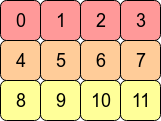
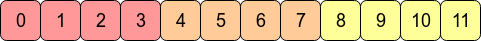
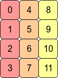
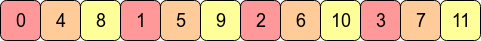

# Pytorch常见方法

2020年8月9日

---

## 1. torch.size

torch.size ()：查看当前Tensor的维度，用法也很简单：

终端进入Python环境

\>>>import torch
\>>>a = torch.Tensor([[1, 2, 3], [4, 5, 6]])
\>>>a.size()

(2, 3)


## 2. torch.clamp

> torch.clamp(input, min, max, out=None) → Tensor

将输入`input`张量每个元素的夹紧到区间 [min,max]，并返回结果到一个新张量。

操作定义如下：

```python
      | min, if x_i < min
y_i = | x_i, if min <= x_i <= max
      | max, if x_i > max
```

如果输入是FloatTensor or DoubleTensor类型，则参数`min` `max` 必须为实数，否则须为整数。【译注：似乎并非如此，无关输入类型，`min`， `max`取整数、实数皆可。】

参数：

- input (Tensor) – 输入张量
- min (Number) – 限制范围下限
- max (Number) – 限制范围上限
- out (Tensor, optional) – 输出张量

例子：

```python
>>> a = torch.randn(4)
>>> a
-1.4511
-0.6812
 0.3302
-1.7423

[torch.FloatTensor of size 4]

>>> torch.clamp(a, min=-0.5, max=0.5)
-0.5000
-0.5000
 0.3302
-0.5000

[torch.FloatTensor of size 4]
torch.clamp(input, *, min, out=None) → Tensor


a.clamp_(min=-0.5,max=0.5) #另一种实现方法
-0.5000
-0.5000
 0.3302
-0.5000
[torch.FloatTensor of size 4]
```

将输入`input`张量每个元素的限制到不小于`min` ，并返回结果到一个新张量。

如果输入是FloatTensor or DoubleTensor类型，则参数 `min` 必须为实数，否则须为整数。【译注：似乎并非如此，无关输入类型，`min`取整数、实数皆可。】

参数：

- input (Tensor) – 输入张量
- value (Number) – 限制范围下限
- out (Tensor, optional) – 输出张量

例子：

```python
>>> a = torch.randn(4)
>>> a

 1.3869
 0.3912
-0.8634
-0.5468
[torch.FloatTensor of size 4]

>>> torch.clamp(a, min=0.5)

 1.3869
 0.5000
 0.5000
 0.5000
[torch.FloatTensor of size 4]
torch.clamp(input, *, max, out=None) → Tensor
```

将输入`input`张量每个元素的限制到不大于`max` ，并返回结果到一个新张量。

如果输入是FloatTensor or DoubleTensor类型，则参数 `max` 必须为实数，否则须为整数。【译注：似乎并非如此，无关输入类型，`max`取整数、实数皆可。】

参数：

- input (Tensor) – 输入张量
- value (Number) – 限制范围上限
- out (Tensor, optional) – 输出张量

例子：

```python
>>> a = torch.randn(4)
>>> a

 1.3869
 0.3912
-0.8634
-0.5468
[torch.FloatTensor of size 4]

>>> torch.clamp(a, max=0.5)

 0.5000
 0.3912
-0.8634
-0.5468
[torch.FloatTensor of size 4]
```

## 3. torch.max()

> **形式：** torch.max(input) → Tensor
> 返回输入tensor中所有元素的最大值：

```python
a = torch.randn(1, 3)
>>0.4729 -0.2266 -0.2085
torch.max(a) #也可以写成a.max()
>>0.4729
```


> **形式：** torch.max(input, dim, keepdim=False, out=None) -> (Tensor, LongTensor)
> 按维度dim 返回最大值，并且返回索引。

`torch.max(a,0)`返回每一列中最大值的那个元素，且返回索引（返回最大元素在这一列的行索引）。返回的最大值和索引各是一个tensor，一起构成元组(Tensor, LongTensor)

```python
a = torch.randn(3,3)
>>
0.2252 -0.0901  0.5663
-0.4694  0.8073  1.3596
 0.1073 -0.7757 -0.8649
 
torch.max(a,0)
>>
(
 0.2252
 0.8073
 1.3596
[torch.FloatTensor of size 3]
, 
 0
 1
 1
[torch.LongTensor of size 3]
)
```

`torch.max(a,1)`返回每一行中最大值的那个元素，且返回其索引（返回最大元素在这一行的列索引）

```python
a = torch.randn(3,3)
>>
0.2252 -0.0901  0.5663
-0.4694  0.8073  1.3596
 0.1073 -0.7757 -0.8649
 
torch.max(a,1)
>>
(
 0.5663
 1.3596
 0.1073
[torch.FloatTensor of size 3]
, 
 2
 2
 0
[torch.LongTensor of size 3]
)
```

**拓展：**
`torch.max()[0]`， 只返回最大值的每个数
`troch.max()[1]`， 只返回最大值的每个索引
`torch.max()[1].data` 只返回variable中的数据部分（去掉Variable containing:）
`torch.max()[1].data.numpy()` 把数据转化成numpy ndarry
`torch.max()[1].data.numpy().squeeze()` 把数据条目中维度为1 的删除掉

## 4. torch.cat 

> `torch.cat`(*tensors*,*dim=0*,*out=None*)→ Tensor

对数据沿着某一维度进行拼接。cat后数据的总维数不变。
比如下面代码对两个2维tensor（分别为2\*3,1\*3）进行拼接，拼接完后变为3\*3还是2维的tensor。
代码如下：

```
import torch
torch.manual_seed(1)
x = torch.randn(2,3)
y = torch.randn(1,3)
print(x,y)
```

结果：

```
0.6614  0.2669  0.0617
 0.6213 -0.4519 -0.1661
[torch.FloatTensor of size 2x3]
 
-1.5228  0.3817 -1.0276
[torch.FloatTensor of size 1x3]
```

将两个tensor拼在一起：

```
torch.cat((x,y),0)
```

结果：

```
 0.6614  0.2669  0.0617
 0.6213 -0.4519 -0.1661
-1.5228  0.3817 -1.0276
[torch.FloatTensor of size 3x3]
```

更灵活的拼法：

```
torch.manual_seed(1)
x = torch.randn(2,3)
print(x)
print(torch.cat((x,x),0))
print(torch.cat((x,x),1))
```

结果

```
// x
0.6614  0.2669  0.0617
 0.6213 -0.4519 -0.1661
[torch.FloatTensor of size 2x3]

// torch.cat((x,x),0)
 0.6614  0.2669  0.0617
 0.6213 -0.4519 -0.1661
 0.6614  0.2669  0.0617
 0.6213 -0.4519 -0.1661
[torch.FloatTensor of size 4x3]

// torch.cat((x,x),1)
 0.6614  0.2669  0.0617  0.6614  0.2669  0.0617
 0.6213 -0.4519 -0.1661  0.6213 -0.4519 -0.1661
[torch.FloatTensor of size 2x6]
```

## 5. torch.stack

> `torch.stack`(*tensors*,*dim=0*,*out=None*)→ Tensor

而stack则会增加新的维度。
如对两个1\*2维的tensor在第0个维度上stack，则会变为2\*1\*2的tensor；在第1个维度上stack，则会变为1\*2\*2的tensor。
见代码：

```
a = torch.ones([1,2])
b = torch.ones([1,2])
c= torch.stack([a,b],0) // 第0个维度stack
```

输出：

```
tensor([[[1., 1.]],

        [[1., 1.]]])
[torch.FloatTensor of size 2x1x2]

c= torch.stack([a,b],1) // 第1个维度stack

```

输出：

```
tensor([[[1., 1.],
         [1., 1.]]])
[torch.FloatTensor of size 1x2x2]
```

## 6. transpose

两个维度互换

代码如下：

```
torch.manual_seed(1)
x = torch.randn(2,3)
print(x)
```

原来x的结果：

```
 0.6614  0.2669  0.0617
 0.6213 -0.4519 -0.1661
[torch.FloatTensor of size 2x3]
```

将x的维度互换

```
x.transpose(0,1)
```

结果

```
0.6614  0.6213
 0.2669 -0.4519
 0.0617 -0.1661
[torch.FloatTensor of size 3x2]
```

## 7. permute

多个维度互换，更灵活的transpose

permute是更灵活的transpose，可以灵活的对原数据的维度进行调换，而数据本身不变。
代码如下：

```
x = torch.randn(2,3,4)
print(x.size())
x_p = x.permute(1,0,2) # 将原来第1维变为0维，同理，0→1,2→2
print(x_p.size())
```

结果：

```
torch.Size([2, 3, 4])
torch.Size([3, 2, 4])
```

## 8. squeeze 和 unsqueeze

> torch.unsqueeze(input, dim, out=None)
>
> - **作用**：扩展维度
>
> 返回一个新的张量，对输入的既定位置插入维度 1
>
> - **注意：** 返回张量与输入张量共享内存，所以改变其中一个的内容会改变另一个。
>
> 如果dim为负，则将会被转化dim+input.dim()+1
>
> - **参数:**
> - `tensor (Tensor)` – 输入张量
> - `dim (int)` – 插入维度的索引
> - `out (Tensor, optional)` – 结果张量

> torch.squeeze(input, dim=None, out=None)
>
> - **作用**：降维
>
> 将输入张量形状中的1 去除并返回。 如果输入是形如(A×1×B×1×C×1×D)，那么输出形状就为： (A×B×C×D)
>
> 当给定dim时，那么挤压操作只在给定维度上。例如，输入形状为: (A×1×B), `squeeze(input, 0)` 将会保持张量不变，只有用 `squeeze(input, 1)`，形状会变成 (A×B)。
>
> - **注意**： 返回张量与输入张量共享内存，所以改变其中一个的内容会改变另一个。
> - **参数**:
> - `input (Tensor)` – 输入张量
> - `dim (int, optional)` – 如果给定，则input只会在给定维度挤压
> - `out (Tensor, optional)` – 输出张量
>
> **为何只去掉 1 呢？**
>
> **多维张量本质上就是一个变换，如果维度是 1 ，那么，1 仅仅起到扩充维度的作用，而没有其他用途，因而，在进行降维操作时，为了加快计算，是可以去掉这些 1 的维度。**


常用来增加或减少维度,如没有batch维度时，增加batch维度为1。

- squeeze(dim_n)压缩，减少dim_n维度 ，即去掉元素数量为1的dim_n维度。
- unsqueeze(dim_n)，增加dim_n维度，元素数量为1。

上代码：

```
# 定义张量
import torch

b = torch.Tensor(2,1)
b.shape
Out[28]: torch.Size([2, 1])

# 不加参数，去掉所有为元素个数为1的维度
b_ = b.squeeze()
b_.shape
Out[30]: torch.Size([2])

# 加上参数，去掉第一维的元素为1，不起作用，因为第一维有2个元素
b_ = b.squeeze(0)
b_.shape 
Out[32]: torch.Size([2, 1])

# 这样就可以了
b_ = b.squeeze(1)
b_.shape
Out[34]: torch.Size([2])

# 增加一个维度
b_ = b.unsqueeze(2)
b_.shape
Out[36]: torch.Size([2, 1, 1])
```

## 9.repeat()和expand()

> *torch.Tensor*是包含一种数据类型元素的多维矩阵。
>
> A *torch.Tensor* is a multi-dimensional matrix containing elements of a single data type.
>
> torch.Tensor有两个实例方法可以用来扩展某维的数据的尺寸，分别是***repeat()***和***expand()***：


> expand(*sizes) -> Tensor
> *sizes(torch.Size or int) - the desired expanded **size**
> Returns a new view of the self tensor with singleton dimensions expanded to a larger size.

返回当前张量在某维扩展更大后的张量。扩展（expand）张量**不会分配新的内存**，只是在存在的张量上创建一个新的视图（view），一个大小（size）等于1的维度扩展到更大的尺寸。

**tensor.expend()函数**

```
>>> import torch
>>> a=torch.tensor([[2],[3],[4]])
>>> print(a.size())
torch.Size([3, 1])
>>> a.expand(3,2)
tensor([[2, 2],
    [3, 3],
    [4, 4]])
>>> a
tensor([[2],
    [3],
    [4]])
    
import torch

>> x = torch.tensor([1, 2, 3])
>> x.expand(2, 3)
tensor([[1, 2, 3],
        [1, 2, 3]])
        
        
>> x = torch.randn(2, 1, 1, 4)
>> x.expand(-1, 2, 3, -1)
torch.Size([2, 2, 3, 4])
```

可以看出expand()函数括号里面为变形后的size大小，而且原来的tensor和tensor.expand()是不共享内存的。

**tensor.expand_as()函数**

```
>>> b=torch.tensor([[2,2],[3,3],[5,5]])
>>> print(b.size())
torch.Size([3, 2])
>>> a.expand_as(b)
tensor([[2, 2],
    [3, 3],
    [4, 4]])
>>> a
tensor([[2],
    [3],
    [4]])
```

可以看出，b和a.expand_as(b)的size是一样大的。且是不共享内存的。


**repeat()**

> repeat(*sizes) -> Tensor
> *size(torch.Size or int) - The **number of times** to repeat this tensor along each dimension.
> Repeats this tensor along the specified dimensions.

沿着特定的维度重复这个张量，和*expand()*不同的是，这个函数**拷贝**张量的数据。

例子：

```python3
import torch

>> x = torch.tensor([1, 2, 3])
>> x.repeat(3, 2)
tensor([[1, 2, 3, 1, 2, 3],
        [1, 2, 3, 1, 2, 3],
        [1, 2, 3, 1, 2, 3]])
```


```text
>> x2 = torch.randn(2, 3, 4)
>> x2.repeat(2, 1, 3).shape
torch.Tensor([4, 3, 12])
```


## 10. contiguous

本文讲解了pytorch中contiguous的含义、定义、实现，以及contiguous存在的原因，非contiguous时的解决办法。并对比了numpy中的contiguous。

------

**contiguous** 本身是形容词**，**表示连续的**，**关于 **contiguous，**PyTorch 提供了**`is_contiguous`、`contiguous`**(形容词动用)两个方法 ，分别用于判定Tensor是否是 **contiguous** 的，以及保证Tensor是**contiguous**的。

### PyTorch中的is_contiguous是什么含义？

**`is_contiguous`**直观的解释是**Tensor底层一维数组元素的存储顺序与Tensor按行优先一维展开的元素顺序是否一致**。

Tensor多维数组底层实现是使用一块连续内存的1维数组（[行优先顺序存储](https://link.zhihu.com/?target=http%3A//vra.github.io/2019/03/18/numpy-array-contiguous/)，下文描述），Tensor在元信息里保存了多维数组的形状，在访问元素时，通过多维度索引转化成1维数组相对于数组起始位置的偏移量即可找到对应的数据。某些Tensor操作（[如transpose、permute、narrow、expand](https://link.zhihu.com/?target=https%3A//stackoverflow.com/questions/48915810/pytorch-contiguous)）与原Tensor是共享内存中的数据，不会改变底层数组的存储，但原来在语义上相邻、内存里也相邻的元素在执行这样的操作后，在语义上相邻，但在内存不相邻，即不连续了（*is not contiguous*）。

如果想要变得连续使用`**contiguous**`方法，如果Tensor不是连续的，则会重新开辟一块内存空间保证数据是在内存中是连续的，如果Tensor是连续的，则`**contiguous**`无操作。

#### **行优先**

行是指多维数组一维展开的方式，对应的是列优先。C/C++中使用的是行优先方式（row major），Matlab、Fortran使用的是列优先方式（column major），PyTorch中Tensor底层实现是C，也是使用行优先顺序。举例说明如下：

```python3
>>> t = torch.arange(12).reshape(3,4)
>>> t
tensor([[ 0,  1,  2,  3],
        [ 4,  5,  6,  7],
        [ 8,  9, 10, 11]])
```

二维数组 t 如图1：



图1. 3X4矩阵行优先存储逻辑结构


数组 t 在内存中实际以一维数组形式存储，通过 **flatten** 方法查看 t 的一维展开形式，实际存储形式与一维展开一致，如图2，

```python3
>>> t.flatten()
tensor([ 0,  1,  2,  3,  4,  5,  6,  7,  8,  9, 10, 11])
```




图2. 3X4矩阵行优先存储物理结构


而列优先的存储逻辑结构如图3。



图3. 3X4矩阵列优先存储逻辑结构


使用列优先存储时，一维数组中元素顺序如图4：



图4. 3X4矩阵列优先存储物理结构


说明：图1、图2、图3、图4来自：[What is the difference between contiguous and non-contiguous arrays?](https://link.zhihu.com/?target=https%3A//stackoverflow.com/a/26999092)

图1、图2、图3、图4 中颜色相同的数据表示在同一行，不论是行优先顺序、或是列优先顺序，如果要访问矩阵中的下一个元素都是通过偏移来实现，这个偏移量称为**步长**(stride[[1\]](https://zhuanlan.zhihu.com/p/64551412#ref_1))。在行优先的存储方式下，访问行中相邻元素物理结构需要偏移1个位置，在列优先存储方式下偏移3个位置。

### 为什么需要 *contiguous* ？

**1. `torch.view`**等方法操作需要连续的Tensor。

transpose、permute 操作虽然没有修改底层一维数组，但是新建了一份Tensor元信息，并在新的元信息中的 重新指定 stride。**`torch.view`** 方法约定了不修改数组本身，只是使用新的形状查看数据。如果我们在 transpose、permute 操作后执行 view，Pytorch 会抛出以下错误：

```text
invalid argument 2: view size is not compatible with input tensor's size and stride (at least one dimension 
spans across two contiguous subspaces). Call .contiguous() before .view(). 
at /Users/soumith/b101_2/2019_02_08/wheel_build_dirs/wheel_3.6/pytorch/aten/src/TH/generic/THTensor.cpp:213
```

为什么 view 方法要求Tensor是连续的[[2\]](https://zhuanlan.zhihu.com/p/64551412#ref_2)？考虑以下操作，

```python3
>>>t = torch.arange(12).reshape(3,4)
>>>t
tensor([[ 0,  1,  2,  3],
        [ 4,  5,  6,  7],
        [ 8,  9, 10, 11]])
>>>t.stride()
(4, 1)
>>>t2 = t.transpose(0,1)
>>>t2
tensor([[ 0,  4,  8],
        [ 1,  5,  9],
        [ 2,  6, 10],
        [ 3,  7, 11]])
>>>t2.stride()
(1, 4)
>>>t.data_ptr() == t2.data_ptr() # 底层数据是同一个一维数组
True
>>>t.is_contiguous(),t2.is_contiguous() # t连续，t2不连续
(True, False)
```

t2 与 t 引用同一份底层数据 **`a`**，如下：

```text
[ 0,  1,  2,  3,  4,  5,  6,  7,  8,  9, 10, 11]
```

，两者仅是stride、shape不同。如果执行 t2.view(-1) ，期望返回以下数据 **`b`**（但实际会报错）：

```text
[ 0,  4,  8,  1,  5,  9,  2,  6, 10,  3,  7, 11]
```

在 **`a`** 的基础上使用一个新的 stride 无法直接得到 **`b`** ，需要先使用 t2 的 stride (1, 4) 转换到 t2 的结构，再基于 t2 的结构使用 stride (1,) 转换为形状为 (12,)的 **`b`** 。**但这不是view工作的方式**，**view 仅在底层数组上使用指定的形状进行变形**，即使 view 不报错，它返回的数据是：

```text
[ 0,  1,  2,  3,  4,  5,  6,  7,  8,  9, 10, 11]
```

这是不满足预期的。使用**`contiguous`**方法后返回新Tensor t3，重新开辟了一块内存，并使用照 t2 的按行优先一维展开的顺序存储底层数据。

```text
>>>t3 = t2.contiguous()
>>>t3
tensor([[ 0,  4,  8],
        [ 1,  5,  9],
        [ 2,  6, 10],
        [ 3,  7, 11]])
>>>t3.data_ptr() == t2.data_ptr() # 底层数据不是同一个一维数组
False
```

可以发现 t与t2 底层数据指针一致，t3 与 t2 底层数据指针不一致，说明确实重新开辟了内存空间。

### 为什么不在`view` 方法中默认调用`contiguous`方法?

因为历史上**`view`**方法已经约定了共享底层数据内存，返回的Tensor底层数据不会使用新的内存，如果在**`view`**中调用了**`contiguous`**方法，则可能在返回Tensor底层数据中使用了新的内存，这样打破了之前的约定，破坏了对之前的代码兼容性。为了解决用户使用便捷性问题，PyTorch在0.4版本以后提供了**`reshape`**方法，实现了类似于 **`tensor.contigous().view(\*args)`**的功能，如果不关心底层数据是否使用了新的内存，则使用**`reshape`**方法更方便。 [[3\]](https://zhuanlan.zhihu.com/p/64551412#ref_3)

**2.** 出于性能考虑

连续的Tensor，语义上相邻的元素，在内存中也是连续的，访问相邻元素是矩阵运算中经常用到的操作，语义和内存顺序的一致性是缓存友好的（[What is a “cache-friendly” code?](https://link.zhihu.com/?target=https%3A//stackoverflow.com/a/16699282)[[4\]](https://zhuanlan.zhihu.com/p/64551412#ref_4)），在内存中连续的数据可以（但不一定）被高速缓存预取，以提升CPU获取操作数据的速度。transpose、permute 后使用**` contiguous`** 方法则会重新开辟一块内存空间保证数据是在逻辑顺序和内存中是一致的，连续内存布局减少了CPU对对内存的请求次数（访问内存比访问寄存器慢100倍[[5\]](https://zhuanlan.zhihu.com/p/64551412#ref_5)），相当于空间换时间。

------

## PyTorch中张量是否连续的定义

对于任意的 *k* 维张量 *t* ,如果满足对于所有 *i*，第 *i* 维相邻元素间隔 = 第 *i*+1 维相邻元素间隔 与 第 *i*+1 维长度的乘积，则 *t* 是连续的。

![[公式]](https://www.zhihu.com/equation?tex=%5Cforall+i%3D0%2C+%5Cdots%2C+k-1+%28i%5Cnot%3Dk-1%29%2C+%5Cspace+stride%5Bi%5D%3Dstride%5Bi%2B1%5D%C3%97size%5Bi%2B1%5D) [[6\]](https://zhuanlan.zhihu.com/p/64551412#ref_6)

- 使用 ![[公式]](https://www.zhihu.com/equation?tex=stride%5Bi%5D) 表示第 *i* 维相邻元素之间间隔的位数，称为步长，可通过 [stride](https://link.zhihu.com/?target=https%3A//pytorch.org/docs/stable/tensors.html%23torch.Tensor.stride) 方法获得。
- 使用![[公式]](https://www.zhihu.com/equation?tex=size%5Bi%5D) 表示固定其他维度时，第 *i* 维元素数量。

### PyTorch中判读张量是否连续的实现

PyTorch中通过调用 **is_contiguous** 方法判断 tensor 是否连续，底层实现为 TH 库中[THTensor.isContiguous](https://link.zhihu.com/?target=https%3A//github.com/pytorch/pytorch/blob/a7f6b0ab4fa4e43a2fa7bcb53825277db88b55f0/torch/lib/TH/generic/THTensor.c%23L639-L654) 方法，为方便加上一些调试信息，翻译为 Python 代码如下：

```text
def isContiguous(tensor):
    """
    判断tensor是否连续    
    :param torch.Tensor tensor: 
    :return: bool
    """

    z = 1
    d = tensor.dim() - 1
    size = tensor.size()
    stride = tensor.stride()
    print("stride={} size={}".format(stride, size))
    while d >= 0:
        if size[d] != 1:
            if stride[d] == z:
                print("dim {} stride is {}, next stride should be {} x {}".format(d, stride[d], z, size[d]))
                z *= size[d]                
            else:
                print("dim {} is not contiguous. stride is {}, but expected {}".format(d, stride[d], z))
                return False
        d -= 1
    return True
```

判定上文中 t、t2 是否连续的输出如下：

```text
>>>isContiguous(t)
stride=(4, 1) size=torch.Size([3, 4])
dim 1 stride is 1, next stride should be 1 x 4
dim 0 stride is 4, next stride should be 4 x 3

True
>>>isContiguous(t2)
stride=(1, 4) size=torch.Size([4, 3])
dim 1 is not contiguous. stride is 4, but expected 1

False
```

从 **isContiguous** 实现可以看出，最后1维的 stride 必须为1（逻辑步长），这是合理的，最后1维即逻辑结构上最内层数组，其相邻元素间隔位数为1，按行优先顺序排列时，最内层数组相邻元素间隔应该为1。

## numpy中张量是否连续的定义

对于任意的 *N* 维张量 *t* ，如果满足第 *k* 维相邻元素间隔 = 第 *K*+1维 至 最后一维的长度的乘积，则 *t* 是连续的。

- 使用 ![[公式]](https://www.zhihu.com/equation?tex=s_%7Bk%7D%5E%7B%5Cmathrm%7Brow%7D%7D) 表示行优先模式下，第 ![[公式]](https://www.zhihu.com/equation?tex=k)维度相邻两个元素之间在内存中间隔的字节数，可通过 [strides](https://link.zhihu.com/?target=https%3A//docs.scipy.org/doc/numpy/reference/generated/numpy.ndarray.strides.html%23numpy.ndarray.strides) 属性获得。
- 使用 ![[公式]](https://www.zhihu.com/equation?tex=itemsize) 表示每个元素的字节数（根据数据类型而定，如PyTorch中 *int32* 类型是 4，*int64* 是8）。
- 使用 ![[公式]](https://www.zhihu.com/equation?tex=d_%7Bj%7D) 表示固定其他维度时，第 ![[公式]](https://www.zhihu.com/equation?tex=j) 维元素的个数，即 t.shape[j]。

![[公式]](https://www.zhihu.com/equation?tex=s_%7Bk%7D%5E%7B%5Cmathrm%7Brow%7D%7D%3D%5Ctext+%7B+itemsize+%7D+%5Cprod_%7Bj%3Dk%2B1%7D%5E%7BN-1%7D+d_%7Bj%7D) [[7\]](https://zhuanlan.zhihu.com/p/64551412#ref_7)

### PyTorch与numpy中contiguous定义的关系

PyTorch和numpy中对于contiguous的定义看起来有差异，本质上是一致的。

首先对于 stride的定义指的都是某维度下，相邻元素之间的间隔，PyTorch中的 stride 是间隔的位数（可看作逻辑步长），而numpy 中的 stride 是间隔的字节数（可看作物理步长），两种 stride 的换算关系为： ![[公式]](https://www.zhihu.com/equation?tex=stride_%7Bnumpy%7D+%3D+itemsize+%5Ccdot+stride_%7Bpytorch%7D+) 。

再看对于 stride 的计算公式，PyTorch 和 numpy 从不同角度给出了公式。PyTorch 给出的是一个递归式定义，描述了两个相邻维度 stride 与 size 之间的关系。numpy 给出的是直接定义，描述了 stride 与 shape 的关系。PyTorch中的 size 与 numpy 中的 shape 含义一致，都是指 tensor 的形状。 ![[公式]](https://www.zhihu.com/equation?tex=size%5Bi%2B1%5D) 、 ![[公式]](https://www.zhihu.com/equation?tex=shape%5Bj%5D) 都是指当固定其他维度时，该维度下元素的数量。

## 参考

1. [^](https://zhuanlan.zhihu.com/p/64551412#ref_1_0)访问相邻元素所需要跳过的位数或字节数 https://stackoverflow.com/questions/53097952/how-to-understand-numpy-strides-for-layman?answertab=active#tab-top
2. [^](https://zhuanlan.zhihu.com/p/64551412#ref_2_0)Munging PyTorch's tensor shape from (C, B, H) to (B, C*H) https://stackoverflow.com/a/53940813/11452297
3. [^](https://zhuanlan.zhihu.com/p/64551412#ref_3_0)view() after transpose() raises non contiguous error #764 https://github.com/pytorch/pytorch/issues/764#issuecomment-317845141
4. [^](https://zhuanlan.zhihu.com/p/64551412#ref_4_0)What is a “cache-friendly” code? https://stackoverflow.com/a/16699282
5. [^](https://zhuanlan.zhihu.com/p/64551412#ref_5_0)计算机缓存Cache以及Cache Line详解 https://zhuanlan.zhihu.com/p/37749443
6. [^](https://zhuanlan.zhihu.com/p/64551412#ref_6_0)Tensor.view方法对连续的描述 https://pytorch.org/docs/stable/tensors.html#torch.Tensor.view
7. [^](https://zhuanlan.zhihu.com/p/64551412#ref_7_0)行优先布局的stride https://docs.scipy.org/doc/numpy/reference/arrays.ndarray.html#internal-memory-layout-of-an-ndarray

编辑于 2019-05-05

[PyTorch](https://www.zhihu.com/topic/20075993)

[tensor](https://www.zhihu.com/topic/20091290)

[深度学习（Deep Learning）](https://www.zhihu.com/topic/19813032)

赞同 53335 条评论

分享

喜欢收藏