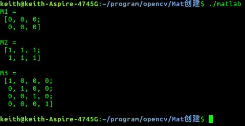
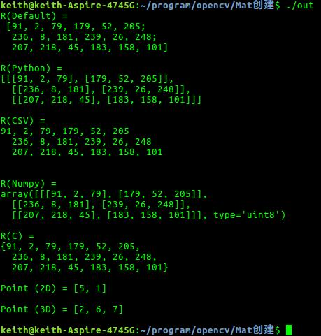
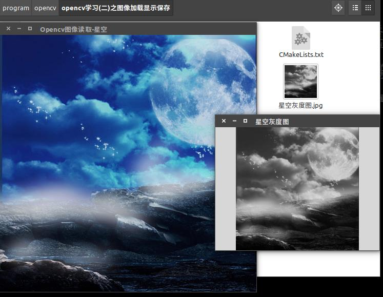
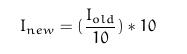
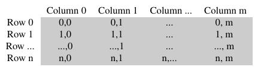
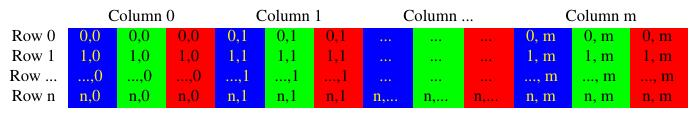
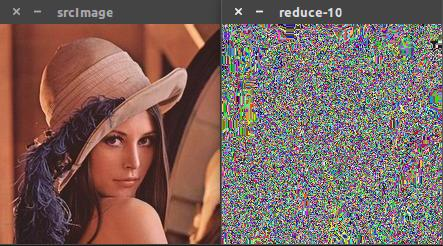
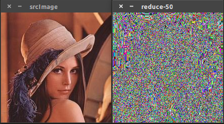
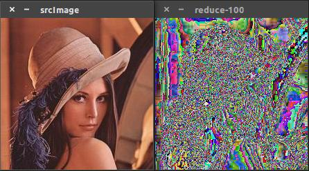

# OPENCV(C++)学习

2020年12月28日

> https://blog.csdn.net/keith_bb/article/list/2?t=1

## 1. Mat类

大概说一下opencv来源。opencv最初是Intel在俄罗斯的团队实现的，而在后期Intel对opencv的支持力度慢慢变小。在08年，美国一家机器人公司Willow Garage开始大力支持opencv，在得到支持后opencv更新速度明显加快，加入了很多新特性。在opencv1.x时代，数据类型为IplImage，在使用这种数据类型时，考虑内存管理称为众多开发者的噩梦。在进入到opencv2.x时代，一种新的数据类型Mat被定义，将开发者极大的解脱出来。所以在接下来的教程中，都会使用Mat类，而在看到IplImage类数据时也不要感到奇怪。 
Mat类有两种基本的数据结构组成，一种是**矩阵头**（包括矩阵尺寸、存储方法、存储路径等信息），另一个是指向包含像素值的**矩阵的指针**（矩阵维度取决于其存储方法）。矩阵头的尺寸是个常数，但是矩阵自身的尺寸根据图像不同而不同。Mat类的定义有很多行，下面列出来一些关键属性如下所示：

```
class CV_EXPORTS Mat
{
public:
    //......很多函数定义,在此省略
    ...
    /*flag参数包含许多关于矩阵的信息，如：
    Mat的标识
    数据是否连续
    深度
    通道数目
    */
    int flags;
    int dims;   //矩阵的维数，取值应该大于或等于2
    int rows,cols;  //矩阵的行列数
    uchar* data;    //指向数据的指针
    int* refcount;  //指向引用计数的指针，如果数据由用户分配则为NULL

    //......其他的一些函数
};
```

可以把Mat看作是一个通用的矩阵类，可以通过Mat中诸多的函数来创建和操作多维矩阵。有很多种方法可以创建一个Mat对象。

Mat类提供了一系列的构造函数，可以根据需求很方便的创建Mat对象，其部分构造方法如下：

```
Mat::Mat()      //无参数构造方法

/*创建行数为rows，列数为cols，类型为type的图像*/
Mat::Mat(int rows, int cols, int type)  

/*创建大小为size，类型为type的图像*/
Mat::Mat(Size size, int type)

/*创建行数为rows，列数为cols，类型为type的图像
并将所有元素初始化为s*/
Mat::Mat(int rows, int cols, int type, const Scalar& s)
ex:Mat(3,2,CV_8UC1, Scalar(0))  //三行两列所有元素为0的一个矩阵

/*创建大小为size，类型为type，初始元素为s*/
Mat::Mat(Size size, int type, const Scalar& s)

/*将m赋值给新创建的对象*/
Mat::Mat(const Mat& m)  //此处不会发生数据赋值，而是两个对象共用数据

/*创建行数为rows，列数为cols，类型为type的图像, 此构造函数不创建图像数据所需内存而是直接使用data所指内存图像的步长由step指定*/
Mat::Mat(int rows, int cols, int type, void* data, size_t step = AUTO_STEP)

Mat::Mat(Size size, int type, void* data, size_t step = AUTO_STEP)  //同上

/*创建新的图像为m数据的一部分，其具体的范围由rowRange和colRange指定
此构造函数也不进行图像数据的复制操作，与m共用数据*/
Mat::Mat(const Mat& m, const Range& rowRange, const Range& colRange)

/*创建新的矩阵为m的一部分，具体的范围由roi指定
此构造函数同样不进行数据的复制操作与m共用数据*/
Mat::Mat(const Mat& m, const Rect& roi)
```

在构造函数中很多都涉及到type，type可以是CV_8UC1, CV_8UC3, …，CV_64FC4等。这些type中的8U表示8位无符号整数(unsigned int), 16S表示16位有符号整数，64F表示64位浮点数即double类型,C表示channel表示图像通道，C后面的数字表示通道数。如C1表示单通道图像，C4表示4通道图像，以此类推。如果需要更多的通道数，需要使用宏CV_8UC(n)重定义，其中n是需要的通道数。如

```
Mat M(3, 2, CV_8UC(5));     //创建3行2列通道为5的图像
```

```

#include <iostream>
#include <opencv2/core.hpp>
#include <opencv2/highgui.hpp>

using namespace std;
using namespace cv;

int main()
{

    Mat M1(3,2,CV_8UC3,Scalar(0, 0, 255));
    cout << "M1 = " << endl << " "  << M1 << endl;

    Mat M2(Size(3, 2), CV_8UC3, Scalar(1,2,3));
    cout << "M2 = " << endl << " " << M2 << endl;

    Mat M3(M2);
    cout << "M3 = " << endl << " " << M3 << endl;

    Mat M4(M2, Range(1,2), Range(1,2));
    cout << "M4 = " << endl << " " << M4 << endl;

    waitKey(0);


    return 0;
}
```

运行结果如图所示： 

```
root@567059b7080d:~/tutorials/Demo/opencv_demo/t1/build# ./t1 
M1 = 
 [  0,   0, 255,   0,   0, 255;
   0,   0, 255,   0,   0, 255;
   0,   0, 255,   0,   0, 255]
M2 = 
 [  1,   2,   3,   1,   2,   3,   1,   2,   3;
   1,   2,   3,   1,   2,   3,   1,   2,   3]
M3 = 
 [  1,   2,   3,   1,   2,   3,   1,   2,   3;
   1,   2,   3,   1,   2,   3,   1,   2,   3]
M4 = 
 [  1,   2,   3]
```


也可以使用create()函数创建对象。如果create()函数指定的参数与图像之前的参数相同，则不进行实质的内存申请操作，如果参数不同，则减少原始数据内存的索引并重新申请内存。使用方法如下所示：

```
#include <iostream>
#include <opencv2/core.hpp>
#include <opencv2/highgui.hpp>

using namespace std;
using namespace cv;

int main()
{
    Mat M1;
    M1.create(4,4,CV_8UC(2));
    cout << "M1 = " << endl << " " << M1 << endl << endl;

    waitKey(0);

    return 0;
}
```

运行结果如下

```
root@567059b7080d:~/tutorials/Demo/opencv_demo/t1/build# ./t1 
M1 = 
 [  0,   0,   0,   0,   0,   0,   0,   0;
   0,   0,   0,   0,   0,   0,   0,   0;
   0,   0,   0,   0,   0,   0,   0,   0;
   0,   0,   0,   0,   0,   0,   0,   0]
```

**值得注意的是使用create()函数无法初始化Mat类。

opencv也可以使用Matlab的风格创建函数如：zeros(),ones()和eyes()。这些方法使得代码非常简洁，使用也非常方便。在使用这些函数时需要指定图像的大小和类型。

```
#include <iostream>
#include <opencv2/core.hpp>
#include <opencv2/highgui.hpp>

using namespace std;
using namespace cv;

int main()
{
    Mat M1 = Mat::zeros(2,3,CV_8UC1);
    cout << "M1 = " << endl << " " << M1 << endl << endl;

    Mat M2 = Mat::ones(2,3,CV_32F);
    cout << "M2 = " << endl << " " << M2 << endl << endl;

    Mat M3 = Mat::eye(4,4,CV_64F);
    cout << "M3 = " << endl << " " << M3 << endl << endl;

    waitKey(0);

    return 0;
}
```

运行结果如图所示：




在已有Mat类的基础上创建一个Mat类，即新创建的类是已有Mat类的某一行或某一列，可以使用clone()或copyTo()，这样的构造方式不是以数据共享方式存在。可以利用setTo()函数更改矩阵的值进行验证，方法如下：

```
#include <iostream>
#include <opencv2/core.hpp>
#include <opencv2/highgui.hpp>

using namespace std;
using namespace cv;

int main()
{

    Mat M1=(Mat_<double>(3,3) << 0,-1,0,-1,5,-1,0,-1,0);
    cout << "M1 = " << endl << " " << M1 << endl << endl;

    Mat M2 = M1;
    cout << "M2 = " << endl << " " << M2 << endl << endl;

    Mat RowClone = M1.row(0).clone();
    cout << "RowClone = " << endl << " " << RowClone << endl << endl;

    Mat ColClone = M1.col(1).clone();
    cout << "ColClone = " << endl << " " << ColClone << endl << endl;

    Mat copyToM;
    M1.row(1).copyTo(copyToM);
    cout << "copyToM = " << endl << " " << copyToM << endl << endl;

    //验证数据的共享方式

    RowClone.setTo(1);
    cout << "M1(更改RowClone的值) = "<< endl  << " " << M1 << endl << endl;

    ColClone.setTo(2);
    cout << "M1(更改ColClone的值) = "<< endl << " " << M1 << endl << endl;

    M2.setTo(1);
    cout << "M1(更改M2值) = " << endl << " " << M1 << endl << endl;

    waitKey(0);

    return 0;
}
```

程序中M4.row(0)就是指的M4的第一行,其它类似。必须值得注意的是：在本篇介绍中工较少了clone()、copyTo()、和”=”三种实现矩阵赋值的方式。其中”=”是使用重载的方式将矩阵值赋值给新的矩阵，而这种方式下，被赋值的矩阵和赋值矩阵之间共享空间，改变任何一个矩阵的值会影响到另外一个矩阵。而clone()和copyTo()两种方法在赋值后，两个矩阵的存储空间是独立的，不存在共享空间的情况。 
运行结果如下

```
root@567059b7080d:~/tutorials/Demo/opencv_demo/t1/build# ./t1 
M1 = 
 [0, -1, 0;
 -1, 5, -1;
 0, -1, 0]

M2 = 
 [0, -1, 0;
 -1, 5, -1;
 0, -1, 0]

RowClone = 
 [0, -1, 0]

ColClone = 
 [-1;
 5;
 -1]

copyToM = 
 [-1, 5, -1]

M1(更改RowClone的值) = 
 [0, -1, 0;
 -1, 5, -1;
 0, -1, 0]

M1(更改ColClone的值) = 
 [0, -1, 0;
 -1, 5, -1;
 0, -1, 0]

M1(更改M2值) = 
 [1, 1, 1;
 1, 1, 1;
 1, 1, 1]
```


opencv中还支持其他的格式化输入，

```
#include <iostream>
#include <opencv2/core.hpp>
#include <opencv2/highgui.hpp>

using namespace std;
using namespace cv;

int main()
{
    //使用函数randu()生成随机数,随机数范围为0-255
    Mat R = Mat(3, 2, CV_8UC3);
    randu(R, Scalar::all(0), Scalar::all(255));

    //以默认格式输出
    cout << "R(Default) = " << endl << " " << R << endl << endl;

    //以Python格式输出
    cout << "R(Python) = " << endl << format(R, "python") << endl << endl;

    //以CSV格式输出
    cout << "R(CSV) = " << endl << format(R, "csv") << endl << endl;

    //以Numpy格式输出
    cout << "R(Numpy) = " << endl << format(R, "numpy") << endl << endl;

    //以C语言的格式输出
    cout << "R(C) = " << endl << format(R, "C") << endl << endl;

    Point2f P2f(5,1);
    cout << "Point (2D) = " << P2f << endl << endl;

    Point3f P3f(2,6,7);
    cout << "Point (3D) = " << P3f << endl << endl;

    waitKey(0);


    return 0;
}
```

运行结果如图所示：



其中Point2f和Point3f都是opencv中常见的数据类型，在以后的学习中还会见到！


## 2. 图像的加载、显示、保存

在使用opencv对图像进行处理时，图像的加载就是要走出的第一步。

### **1.图像的加载之imread函数**

图像的加载在opencv中由”imread”函数来实现，在imread函数中可以加载想要进行处理的图像，imread函数支持多种图像格式。 

```
windows位图：bmp, dib 
JPEG文件:jpeg, jpg, jpe 
JPEG2000文件: jp2 
PNG图片: png 
便携文件格式： pbm, pgm, ppm 
光栅文件: sr, ras 
TIFF文件： tiff, tif. 
```

imread()函数原型如下：

```
CV_EXPORTS_W Mat imread( const String& filename, int flags = IMREAD_COLOR );
```

其参数如下含义： 

第一个参数：const String& filename是指图片的名称，如果图片不在工程目录下，则需要包含图片的路径，在输入路径时Windows环境下使用`\\`，而在Linux环境下使用`//`。同样在添加库文件时Windows环境下使用`\`如：`opencv\core\core.hpp`，而在Linux环境下使用`/`如`opencv2/core/core.hpp`，这是在使用opencv时Windows环境和Linux环境下的一点区别。

第二个参数：int 类型flags，是载入图像的表识，可指定加载图片的颜色类型。其默认加载类型为IMREAD_COLOR。查询其原型如下：

```
enum ImreadModes {
       IMREAD_UNCHANGED  = -1, //!< If set, return the loaded image as is (with alpha channel, otherwise it gets cropped).
       IMREAD_GRAYSCALE  = 0,  //!< If set, always convert image to the single channel grayscale image.
       IMREAD_COLOR      = 1,  //!< If set, always convert image to the 3 channel BGR color image.
       IMREAD_ANYDEPTH   = 2,  //!< If set, return 16-bit/32-bit image when the input has the corresponding depth, otherwise convert it to 8-bit.
       IMREAD_ANYCOLOR   = 4,  //!< If set, the image is read in any possible color format.
       IMREAD_LOAD_GDAL  = 8   //!< If set, use the gdal driver for loading the image.
     };12345678
```

根据其原型可以看出，flags是一个枚举类型。对各个参数简单解释一下： 

```
IMREAD_UNCHANGED:已经废除，不再使用 
IMREAD_GRAYSCALE=0:将加载的图像转换为单通道灰度图。 
IMREAD_COLOR=1:函数默认值，将图像转化为三通道BGR彩色图像 
IMREAD_ANYDEPTH=2:若载入图像深度为16位或32为就返回其对应深度，否则将图像转换为8位图像 
IMREAD_ANYCOLOR=4:保持图像原格式，可以读取任意可能的彩色格式 
IMREAD_LOAD_GDAL=8:使用文件格式驱动加载图像，在现阶段用处不多。 
```

在使用flags时可能会同时使用多种flags，如果发生冲突，函数将自动采用较小数字值对应的加载方式。如：IMREAD_COLOR | IMREAD_ANYCOLOR，则imread()函数将自动载入IMREAD_COLOR所对应的3通道彩色图。如果要载入图像原本的彩色格式和深度，则可以使用: IMREAD_ANYCOLOR | IMREAD_ANYDEPTH。 

也可以利用flags是int类型的变量输入其他值以达到加载特定图像格式的目的，但符合一下标准： 

```
flags > 0:返回一个三通道的彩色图像 
flags = 0: 返回灰度图像 
flags < 0: 返回包含Alpha通道的图像。 
```

图像在默认情况下不是从Alpha通道进来的，如果需要载入Alpha通道的话就取负值。

### **2.namedWindow函数**

创建一个窗口，原型如下：

```
CV_EXPORTS_W void namedWindow(const String& winname, int flags = WINDOW_AUTOSIZE);
```

第一个参数const String& winname：窗口名称 

第二个参数int flags：窗口属性


flags同样是一个枚举类型，其由如下参数：

```
enum { WINDOW_NORMAL     = 0x00000000, // the user can resize the window (no constraint) / also use to switch a fullscreen window to a normal size

       WINDOW_AUTOSIZE   = 0x00000001, // the user cannot resize the window, the size is constrainted by the image displayed

       WINDOW_OPENGL     = 0x00001000, // window with opengl support


       WINDOW_FREERATIO  = 0x00000100, // the image expends as much as it can (no ratio constraint)

       WINDOW_KEEPRATIO  = 0x00000000  // the ratio of the image is respected
     };1234567891011
```

对应解释如下： 

```
WINDOW_NORMAL:可以改变窗口大小（无限制），也可将一个满屏窗口转换成常用大小； 
WINDOW_AUTOSIZE：程序会根据呈现内容自动调整大小且不能手动更改窗口大小； 
WINDOW_OPENGL：创建支持OpenGL的窗口； 
WINDOW_FULLSCREEN：创建一个充满屏幕的窗口； 
WINDOW_FREETATIO：图像将尽可能展开; 
WINDOW_KEEPRATIO：图像比例受到约束。 
```

namedWindow()函数是通过指定的名字创建一个作为图像和进度条显示的窗口，如果有相同名称的窗口已经存在，则函数不会重复创建窗口，而是什么都不做。我们可以调用destroyWindows()或者destroyAllWindows()函数来关闭窗口并取消之前分配的与窗口相关的所有内存空间。

### **3.imshow()**

显示指定窗口，其函数原型如下：

```
CV_EXPORTS_W void imshow(const String& winname, InputArray mat);
```

第一个参数const String& winname:窗口名称，如果使用了namedWindow()函数创建窗口，则名字必须一致，如果没有使用namedWindow()函数，则可指定任意符合命名规则的名字。 

第二个参数InputArray mat:要输出的图像。 
imshow()在用于指定的窗口显示图像时，如果窗口用WINDOW_ATTOSIZE创建，那么显示图像原始大小。佛则将图像进行缩放以适合窗口。而imshow()函数缩放图像取决与图像深度： 

- 如果载入图像是8位无符号类型(8-bis unsigned)，就现实图像原本样子。 
- 如果图像是16位无符号类型(16-bist unsigned)或32位无整型(32-bit integer)，便使用像素值除以256.也就是说将像素值范围在[0,255x266]之间的元素映射到(0,255]范围内。 
- 如果载入图像是32位浮点型(32-bit floating-point)，像素值要乘以255.也就是说像素值范围在[0,1]映射到[0,255].

### 4.imwrite() 

将处理后的图像写入到相应的文件夹。其用法与imread()函数类似。原型如下：

```
CV_EXPORTS_W bool imwrite( const String& filename, InputArray img, const std::vector<int>& params = std::vector<int>());
```

可以看出imwrite()是一个BOOL型函数，档期写入成功返回TRUE，否则返回FALSE。 

第一个参数const String& filename:保存图像的文件名，一定要包含文件的后缀，如”lena.bmp” 

第二个参数const std::vector…:表示为特定保存格式的参数编码，在一般情况下不需要更改。如果需要更改的话，对于不同的图片格式，其对应的值由不同功能。如下： 

- JPEG：这个参数表示从0-100的图片质量(CV_IMWRITE_JPEG_QUALITY),默认值是95. 
- PNG: 这个参数表示压缩级别(CV_IMWRITE_PNG_COMPRESSION)，范围为0-9，数值越高说明压缩程度越大即尺寸更小，所花费的时间更长。默认值是3 
- PPM,PGM,PBM: 这个参数表示一个二进制标志(CV_IMWRITE_PXM_BINARY)，取值为0或1，而默认值为1。

实例代码如下：

```
#include <iostream>
#include <opencv2/core.hpp>
#include <opencv2/highgui.hpp>
#include <opencv2/imgproc.hpp>

using namespace std;
using namespace cv;

int main()
{
    Mat srcImage = imread(".//lena.jpg", IMREAD_COLOR);       //读取图像到srcImage，注意图像路径即后缀
    namedWindow("Opencv图像读取-lena", WINDOW_AUTOSIZE);  //创建一个名字为“Opencv图像读取-星空”的窗口，窗口属性为自适应
    imshow("Opencv图像读取-lena", srcImage);          //显示读入的图像，窗口名称与namedWindow中名字要一致


    Mat srcImageGray;                       //创建一个Mat类型用于存储将读取到的彩色图像转换为灰度图之后的图像
    cvtColor(srcImage, srcImageGray, CV_RGB2GRAY);      //使用函数CV_RGB2GRAY将彩色图像转换为灰度图
    namedWindow("星空灰度图", WINDOW_NORMAL);
    imshow("星空灰度图",srcImageGray);
    imwrite("星空灰度图.jpg",srcImageGray);          //将转换的灰度图以.bmp格式存储，默认路径为工程目录下


    waitKey(0);


    return 0;
}
```

运行结果如下图所示： 



PS:代码格式又乱了。。。。

## 3. 图像像素遍历（颜色空间缩减、查找表）

在图像处理中不可避免的要涉及到对图像像素的操作，这篇文章将介绍对图像像素的访问及遍历图像像素的方法。

### 1.颜色空间缩减及查找表

设想一种简单的C\C++类型的无符号字符型矩阵的存储结构，对于单通道图像而言，图像像素最多可以由256个像素值。如果图像是三通道图像，那么图像像素存储的颜色可以达到惊人的1600w。处理如此多的颜色类型对于算法的运算是一种沉重的负担。有时候我们可以找到一些既能够降低颜色数量但是并不会影响其处理结果的方法。通常我们缩减颜色空间。这就意味着我们用新输入的数值和更少的颜色来划分当前的颜色空间。 

例如我们可以将值在0-9范围内的像素值看做0，将值位于10-19范围内的像素值看做10等等。当我们用int类型的数值代替uchar(unsigned char-值位于0-255之间)类型得到的结果仍为char类型。这些数值只是char类型的值，所以求出来的小数要向下取整。公式可以总结如下： 

 

遍历整幅图像像素并应用上述公式就是一个简单的颜色空间缩减算法。对于较大的图像需要在执行操作可以前提前计算好其像素值存储到查找表中。查找变是一种简单的数组（可能是一维或多维），对于给定的输入变量给出最终的输出值。在进行图像处理时，像素取值范围在0-255之间其实就是一共有256种情况，所以将这些计算结果提前存储于查找表中，进行图像处理时，不需要重新计算像素值，可以直接从查找表调用。其优势在于只进行读取操作，不进行运算。 
结合上述公和查找表如下：

```
    int divideWith = 0;
    stringstream s;
    s << argv[2];
    s >> divideWith;
    if(!s || !divideWith)
    {
        cout << "输入的划分间隔无效." << endl;
        return -1;
    }
    uchar table[256];
    for(int i = 0;i < 256; ++i)
        table[i] = (uchar)(divideWith * (i * divideWith));123456789101112
```

程序中table[i]存放的是值为i的像素缩减空间的结果。例如i = 25,则table[i]=20.这样看来颜色空间缩减算法可分为两部分： 

（1）.遍历图像矩阵像素 

（2）.将上述公式应用于每个像素 

值得注意的是，此公式用到了乘法和除法，而这两种计算方式相对来讲比较费时，所以在设计像素缩减空间算法时，应尽量使用加减和赋值运算代替。

### ２．opencv计时函数

在上面分析中提到用乘除法会加大程序的耗时，那么怎么计算程序运行中的耗时呢？opencv中提供了两个简便的计时函数getTickCount()和getTickFrequency()。其中getTickCount()用来获取CPU时钟周期，getTickFrequency()函数用来获取CPU时钟频率。这样就能以秒为单位对程序运行进行耗时分析，其用法如下：


```
    double t = (double)getTickCount();
    //...
    //program...
    //...
    t = ((double)getTickCount()-t)/getTickFrequency();12345
```

### ３．图像矩阵在内存中的存储方式 

在[opencv学习(一)之Mat类中介绍Mat类](http://blog.csdn.net/keith_bb/article/details/52928389)的创建等内容，同时也应该能够了解到图像的数据结构为Mat类，是一种矩阵结构。图像矩阵大小取决于所用的颜色模型，更确切的来说是取决于图像所用通道数。如果是灰度图像，其矩阵结构如下图所示： 


 


对于多通道图像来说，矩阵的列会包含多个子列，其子列个数与通道数相等。RGB颜色模型矩阵如下图所示： 

 

在opencv中图像的RGB顺序如上图所示正好是反过来的，其排序为BGR。在很多情况下可以如果内存足够大可以实现连续存储。连续存储有助于提升图像扫描速度，可以使用isContinuous()来判断矩阵是否是连续存储。

当涉及到程序性能时，没有比C风格的操作符”[]”(指针)更高效了。测试代码如下：

```
#include <iostream>
#include <cstring>
#include <opencv2/core.hpp>
#include <opencv2/highgui.hpp>
#include <opencv2/imgproc.hpp>

using namespace std;
using namespace cv;

Mat& ScanImageAndReduce(Mat& I,const uchar* const table);

int main(int argc, char** argv)
{
    int divideWith = 0;

    Mat srcImage = imread("lena.jpg");

    //image is load sucessful?
    if(srcImage.data)
        cout << "Success" << endl;
    else
        return -1;

    imshow("srcImage",srcImage);

    cout << "input divideWith: ";
    cin >> divideWith;

    if(!divideWith)
    {
        cout << "输入的划分间隔无效." << endl;
        return -1;
    }
    uchar table[256];
    for(int i = 0;i < 256; ++i)
        table[i] = (uchar)(divideWith * (i * divideWith));

    ScanImageAndReduce(srcImage,table);
    waitKey(0);

    return 0;
}

Mat& ScanImageAndReduce(Mat& I, const uchar* const table)
{
    CV_Assert(I.depth() == CV_8U);

    //定义变量与原图像保持一致
    int channels = I.channels();
    int nRows = I.rows;
    int nCols = I.cols * channels;

    //判断矩阵是否是连续矩阵
    if(I.isContinuous())
    {
        nCols *= nRows;
        nRows = 1;
    }

    int i,j;
    uchar* p;
    for(i = 0; i < nRows; ++i)
    {
        p = I.ptr<uchar>(i);        //获取矩阵第i行的首地址
        for(j = 0; j < nCols; ++j)  //列循环进行处理
        {
            p[j] = table[p[j]];
        }
    }
    imshow("reduce-100",I);         //根据输入值对窗口名字进行更改

    return I;
}
```


当设置不同的结果时，其最终输出结果不同如下所示： 

 
 



