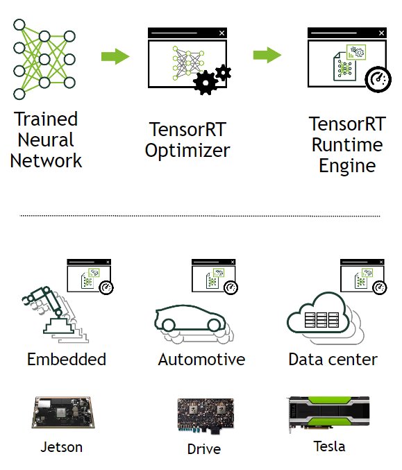
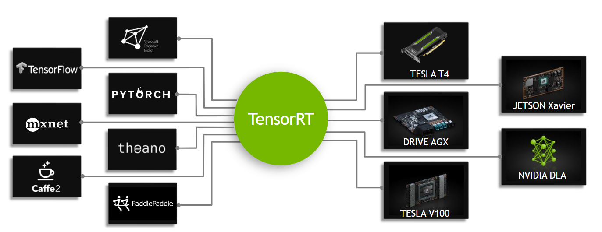
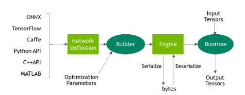
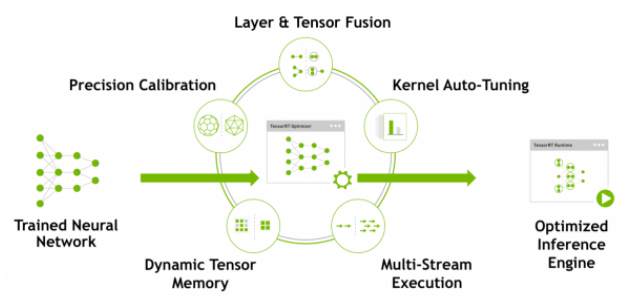

# TensorRT介绍

2020年7月29日

## 1.什么是TensorRT？

TensorRT源程序是一个能提高英伟达GPU（Griphics processing units）推理性能的C++库。它与TensorFlow、Caffe、PyTorch、MXNet等训练框架相辅相成。它更加关注在GPU上快速高效地运行一个已经存在的学习网络，这个学习网络的目标是生成一个结果（在许多地方也称为得分、检测、回归或推理的过程）。

一些训练框架类似于tensorflow已经集成了TensorRT，所以TensorRT能够被用来加速框架中的推理过程。作为一种选择，TensorRT可以用作用户应用程序中的库。它包含了很多解析器，这些解析器可以从Caffe、ONNX或者tensorflow中解析已经存在的模型，还可以用于以编程方式构建模型的c++和Python api。

​											图1：TensorRT是用于产品部署的高性能神经网络推理优化器和运行时引擎

TensorRT通过合并层和优化核选择来优化网络结构，以达到改善延迟、吞吐量、功率效率和内存消耗。如果应用程序指定，TensorRT还将优化网络以降低运行精度，进一步提高性能和减少内存需求。

下面的图展示了TensorRT被定义为部分高性能推理优化器和部分运行时引擎。它可以接收在这些流行框架上训练的神经网络，优化神经网络计算，生成一个轻量级运行时引擎（你唯一需要部署到你产品环境中的东西）。然后它还会最大化在这些GPU平台上的吞吐量、降低延迟、增强表现。

​																图2：TensorRT是一个可编码的推理加速器

TensorRT API包含了最通用的深度学习层的实现。关于层的更多信息，请参阅[TensorRT Layers](https://docs.nvidia.com/deeplearning/sdk/tensorrt-developer-guide/index.html#layers).你也可以使用[C++ Plugin API](https://docs.nvidia.com/deeplearning/sdk/tensorrt-api/c_api/classnvinfer1_1_1_i_plugin.html)或者[Python Plugin API](https://docs.nvidia.com/deeplearning/sdk/tensorrt-api/python_api/infer/Plugin/pyPlugin.html)来实现不常用或者最新的层，这些层暂时还不被TensorRT所支持。

### 1.1 TensorRT的优势

当神经网络被训练完成后，TensorRT可以压缩、优化这些网络，还可以部署成一个运行环境而不用承担整个框架的总开销。

TensorRT组合各个层，优化内核选择，还根据指定的精度（FP32、FP16或INT8）执行规范化和优化矩阵转换来改善延迟、吞吐量和效率。

对于深度学习推理，有5个用于衡量软件的关键指标**（记忆）**： 

- 吞吐量（Throuthput）： 指定时间区间内的输出量，通常用inference/second 或者samples/second来度量； 
- 效率（Efficiency）：单位功率的吞吐量，通常用performance/watt来度量；
- 延迟（Latency）：运行推理的时间，通常用ms度量；
- 精确度（Accuracy）：训练过的神经网络给出正确结果的能力；
- 内存占用（Memory usage）：主机和设备内存决定于所用的神经网络算法需要申请多少内存空间进行推理； 

使用TensorRT的可选方案包括：

- 使用训练框架本身进行推理；
- 写一个使用低层库和数学操作的专门用来执行特定网络的自定义应用程序；

使用训练框架执行推理很容易，但是在给定的额GPU上，与使用推理优化方案相比，性能会低很多。训练框架倾向于实现更加通用的代码，当优化时，优化往往集中在有效的训练上；
自定义程序编写可以获得更高的效率，但是对开发人员知识技能要求非常高，而且针对一个GPU的优化无法完全转移到另一个型号不同的GPU上，因而开发成本非常高；
而TensorRT通过将API与特定硬件细节的高级抽象结合来解决这些问题，可以提高吞吐量、降低延迟、并尽可能降低内存占用。

### 1.2 谁能够从TensorRT中获益？

TensorRT的目标用户是负责基于新的或现有的深度学习模型构建特征和应用程序，或将模型部署到生产环境中的工程师。这些部署可能部署到数据中心或云中的服务器、嵌入式设备、机器人或车辆中，或将在用户工作站上运行的应用程序软件中。

TensorRT已经成功地应用于各种场景，包括:

- Robots：公司销售的机器人使用TensorRT运行各种计算机视觉模型，在动态环境中自动引导无人机系统飞行；
- Autonomous Vehicles：TensorRT被用于为NVIDIA驱动产品的计算机视觉提供支持；
- Scientific and Technical Computing：一种流行的技术计算包嵌入TensorRT以支持神经网络模型的高吞吐量执行；
- Deep Learning Training and Deployment Frameworks：TensorRT在几个有名的深度学习框架比如[TensorFlow](https://www.nvidia.com/en-us/data-center/gpu-accelerated-applications/tensorflow/)和[MXNet](https://www.nvidia.com/en-us/data-center/gpu-accelerated-applications/mxnet/)中都被包含；
- Video Analytics：TensorRT被应用于英伟达的[DeepStream](https://developer.nvidia.com/deepstream-sdk)产品中，为复杂的视频分析提供解决方案；
- Automatic Speech Recognition：TensorRT用于小型桌面设备上的语音识别。该设备支持有限的词汇量，云计算中提供了更大的词汇量语音识别系统。

### 1.3 TensorRT适用于哪里？

通常情况下，开发和部署深度学习模型的工作流经历三个阶段：

- 阶段1：训练；
- 阶段2：提出部署方案；
- 阶段3：执行部署方案；

#### 阶段1：训练

在整个训练阶段，数据科学家和开发者根据他们想解决的问题选择精确的输入输出和损失函数。他们还将收集、管理、扩充、甚至可能标记培训、测试和验证数据集。他们会设计网络结构并且训练模型。在训练过程中，他们将监控学习过程，学习过程可能会提供反馈，从而使他们修正损失函数，获取或增加培训数据。在这个流程的最后，他们会验证模型表现并保存模型。训练和验证通常使用Titan或者Tesla datacenter GPU。在这一阶段通常不会用到TensorRT。

#### 阶段2：提出部署方案

在第二个阶段，数据科学家和开发人员将从训练过的模型开始，并使用这个训练过的模型创建和验证部署解决方案。把这个阶段分解成几个步骤，如下：

1.考虑神经网络是如何在它所处的大系统中工作的，并设计和实现一个合适的解决方案，可能包含神经网络的系统的范围非常广泛。例如：

- 交通工具中的自动驾驶系统；
- 公共场所或公司校园的视频安全系统；
- 消费者设备的语音接口；
- 工业生产线自动化质量保证系统；
- 提供产品推荐的在线零售系统；
- 提供娱乐过滤器的消费者web服务；

决定好你的优先级，考虑到可以实现的不同系统的多样性，在设计和实现部署体系结构时可能需要考虑很多事情：

- 你有一个单独的网络还是许多网络？例如，你是否基于一个单一的网络（人脸识别）开发一个特征或系统？你的系统会不会由混合的、附加的或者不同的模型组成？也许是提供最终用户可能提供的集合模型的更通用的工具?
- 你使用什么设备或者计算工具来运行网络？是CPU/GPU还是其他，或者二者结合？是不是只有一种类型的GPU？是否需要设计一个应用程序可以运行在不同种类的GPU上？
- 数据怎样加载到模型？什么是数据管道？数据是来自相机、传感器还是一系列的文件？
- 需要怎样的延迟和吞吐量？
- 你能把很多需求进行批处理吗？
- 你需要单个网络的多个实例来实现所需的总体系统吞吐量和延迟吗?
- 你会如何处理网络输出？
- 需要哪些后处理步骤？

TensorRT提供了一个快速、模块化、紧凑、健壮、可靠的推理引擎，可以支持部署体系结构中的推理需求。

2.数据科学家和开发者定义完推理解决方案的结构，也就是决定了他们的优先级之后，接下来他们使用TensorRT从已保存的模型中创建一个推理引擎。根据所使用的培训框架和网络体系结构，有许多方法可以做到这一点。通常来说，这意味着你需要拿到训练过的神经网络并且使用ONNX解析器、Caffe解析器或者TensorFlow/UFF解析器将原格式解析为TensorRT支持的格式。如下图： 

​																					**图三：ONNX 工作流 V1**

3.当网络被解析以后，你就需要考虑优化选项——batch size，workspace size，mixed precision。选择并指定这些选项作为TensorRT构建步骤的一部分，在该步骤中，您将实际构建基于网络的优化推理引擎。本指南的后续部分提供了关于工作流这一部分的详细说明和大量示例，将您的模型解析为TensorRT并选择优化参数，如图4所示：
 									
										图四：TensorRT优化训练过的神经网络模型，以生成可部署的运行时推理引擎。

4.当你已经使用TensorRT创建好一个推理引擎之后，你会想验证一下推理结果和训练中的结果是否一致。如果你选择了FP32或FP16，那么结果应该非常接近。如果你选择了INT8，那么在训练中获得的准确率和推理准确率之间可能会有一个小的差距。

5.以序列化格式写出推理引擎，这也称为计划文件。

#### 阶段三：执行部署方案

TensorRT库链接到部署的应用程序，该应用程序在需要推理结果时调用库。为了初始化推理引擎，应用程序首先要将模型从计划文件反序列化为推理引擎。

TensorRT通常情况下是异步使用的，所以，当输入数据到达时，程序调用enqueue函数并传入输入缓冲区和输出缓冲区的指针地址。

### 1.4 TensorRT是如何工作的？

为了优化推理引擎，TensorRT会接收你的网络定义，执行包括特定平台优化在内的优化然后生成推理引擎，这个过程称为构建阶段。构建阶段可能需要相当长的时间，尤其是在嵌入式平台上运行的时候。因此，典型的应用程序将构建一次引擎，然后将其序列化为计划文件供以后使用。

NOTE:生成的计划文件不能跨平台或TensorRT版本移植。计划是特定于它们所构建的精确GPU模型的(除了平台和TensorRT版本之外)，如果您想在不同的GPU上运行它们，则必须针对特定的GPU重新制定计划。

构建阶段对层图执行以下优化:

- 消除输出未被使用的层；
- 融合convolution，bias和ReLU operations；
- 聚合具有足够相似参数和相同源张量的operations，例如在GoogleNet v5中初始模块中的1*1卷积；
- 通过非拷贝方式将层输出定向到正确的最终地址来合并连接层；

如有必要，构建过程也可以改变权重的精度。当生成8-bit整数精度的网络时，TensorRT使用一个叫做calibration的进程来决定中间激活的动态范围，并因此确定用于量化的适当缩放因子。 

另外，构建阶段还在虚拟数据上运行层，以便从其内核目录中选择最快的层，并在适当的情况下执行权重预格式化和内存优化。

### 1.5 TensorRT核心API

TensorRT让开发者们能够import/calibrate/generate and deploy optimized networks。网络结构能直接通过Caffe导入，也可以通过uff或ONNX等格式从其他框架导入。 

TensorRT核心库中的**关键接口**是：

- 网络定义（Network Definition）：网络定义接口提供了应用程序指定网络定义的方法。可以指定输入输出张量，可以添加层，还有用于配置每种支持的层类型的接口。除了层类型（例如卷积层或循环层）之外，插件层类型还可以使应用程序实现TensorRT本身并不支持的功能。 
- 生成器（Builder）：生成器接口允许通过网络定义建立优化引擎。它允许应用程序指定最大批次大小、工作空间大小、最低可接受精度级别、自动调整的校准迭代次数，以及用于INT8量化的接口。
- 引擎（Engine)：引擎接口允许应用程序执行推理，支持同步和异步支持、分析、枚举和查询绑定缓冲区信息，即引擎输入和输出。单个引擎可以具有多个执行上下文，允许一组训练参数用于同时执行多个批次。

同时，TensorRT还提供解析器，用于导入经过训练的网络来创建网络定义：

- Caffe Parser：此解析器可用于解析在BVLV Caffe或NVCaffe中创建的Caffe网络；
- Uff Parser：此解析器用于UFF格式的解析网络；
- ONNX Parser：此解析器可用于解析ONNX模型；

## 参考

> [TensorRT_Document](http://blog.ijunyu.top/2019/02/27/TensorRT-Document/)

