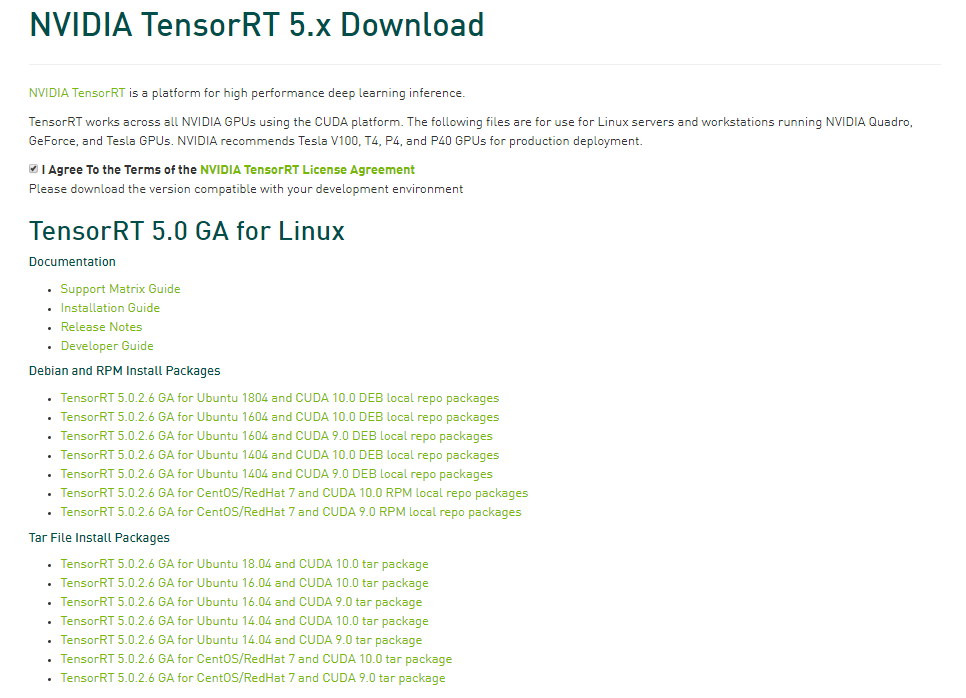

# TensorRT5安装
## 一、安装CUDA、CUDnn
[链接](https://github.com/fusimeng/ParallelComputing/blob/master/notes/cudainstall.md)   
## 二、安装TensorRT
### 1.下载     
去官网下载：https://developer.nvidia.com/nvidia-tensorrt-download   
   
```
$sudo tar -xzvf TensorRT-5.0.2.6.Ubuntu-16.04.4.x86_64-gnu.cuda-9.0.cudnn7.3.tar.gz
```
### 2.添加环境变量: 
```
$ vim ~/.bashrc
export LD_LIBRARY_PATH=$LD_LIBRARY_PATH:/usr/local/TensorRT-5.0/lib 
```
### 3.安装Python TensorRT
```
$ cd ~/TensorRT-5.0/python
# if Python 2.7
$ sudo pip2 install tensorrt-4.0.0.3-cp27-cp27mu-linux_x86_64.whl
# if Python 3.5
$ sudo pip3 install tensorrt-4.0.0.3-cp35-cp35mu-linux_x86_64.whl
```
如果像我一样，使用Python 3.6，且无法安装Python 3.5，将whl文件名改为如下即可，否则会无法安装。
tensorrt-4.0.0.3-cp36-cp36mu-linux_x86_64.whl
注意：一定要使用sudo安装，否则安装成功后bin文件不在/usr/local/bin目录下。而如果使用sudo安装则可能会在安装过程中出现如下错误：
```
x86_64-linux-gnu-gcc -pthread -fwrapv -Wall -O3 -DNDEBUG -fno-strict-aliasing -Wdate-time -D_FORTIFY_SOURCE=2 -g -fdebug-prefix-map=/build/python3.6-nbjU53/python3.6-3.6.5=. -fstack-protector-strong -Wformat -Werror=format-security -fPIC -DBOOST_PYTHON_SOURCE=1 -DHAVE_CURAND=1 -DPYGPU_PACKAGE=pycuda -DBOOST_THREAD_DONT_USE_CHRONO=1 -DPYGPU_PYCUDA=1 -DBOOST_MULTI_INDEX_DISABLE_SERIALIZATION=1 -DBOOST_THREAD_BUILD_DLL=1 -Dboost=pycudaboost -DBOOST_ALL_NO_LIB=1 -Isrc/cpp -Ibpl-subset/bpl_subset -I/usr/lib/python3.6/dist-packages/numpy/core/include -I/usr/include/python3.6 -c src/cpp/cuda.cpp -o build/temp.linux-x86_64-3.6/src/cpp/cuda.o
    In file included from src/cpp/cuda.cpp:1:0:
    src/cpp/cuda.hpp:14:10: fatal error: cuda.h: No such file or directory
     #include <cuda.h>
              ^~~~~~~~
    compilation terminated.
    error: command 'x86_64-linux-gnu-gcc' failed with exit status 1
    
    ----------------------------------------
Command "/usr/bin/python -u -c "import setuptools, tokenize;__file__='/tmp/pip-build-xpowxF/pycuda/setup.py';f=getattr(tokenize, 'open', open)(__file__);code=f.read().replace('\r\n', '\n');f.close();exec(compile(code, __file__, 'exec'))" install --record /tmp/pip-jUVvJV-record/install-record.txt --single-version-externally-managed --compile" failed with error code 1 in /tmp/pip-build-xpowxF/pycuda/
```
简而言之就是找不到cuda.h头文件，这是由于sudo安装使用的是root环境，需要在~/.bashrc文件中添加：export PATH=/usr/local/cuda-9.0/bin:$PATH 环境变量，并source ~/.bashrc。
### 3.简单验证
如果可以which到tensorrt，证明安装成功
```
which tensorrt
/usr/local/bin/tensorrt
```
但是，我的并没有显示这个，可能因为我的安装到了Requirement already satisfied (use --upgrade to upgrade): numpy>=1.11.0 in /usr/local/lib/python3.5/dist-packages (from uff==0.5.5)，并没有在/usr/bin下
### 4.安装UFF（针对tensorflow框架）
```
$ cd ~/TensorRT-4.0.0.3/uff
# if Python 2.7
$ sudo pip2 install uff-0.3.0rc0-py2.py3-none-any.whl
# if Python 3
$ sudo pip3 install uff-0.3.0rc0-py2.py3-none-any.whl
```
如果可以which到convert-to-uff，证明安装成功。
```
$ which convert-to-uff
/usr/local/bin/convert-to-uff
```
### 5.测试TensorRT安装成功否
使用samples测试TensorRT是否安装成功
```
$ cd ~/TensorRT-4.0.0.3/samples
$ make
```
如果出现如下错误：
```
重叠
dpkg-query: no packages found matching cuda-toolkit-*
../Makefile.config:6: CUDA_INSTALL_DIR variable is not specified, using /usr/local/cuda- by default, use CUDA_INSTALL_DIR=<cuda_directory> to change.
../Makefile.config:9: CUDNN_INSTALL_DIR variable is not specified, using  by default, use CUDNN_INSTALL_DIR=<cudnn_directory> to change.
dpkg-query: no packages found matching cuda-toolkit-*
dpkg-query: no packages found matching cuda-toolkit-*
dpkg-query: no packages found matching cuda-toolkit-*
dpkg-query: no packages found matching cuda-toolkit-*
Compiling: sampleMNIST.cpp
sampleMNIST.cpp:9:10: fatal error: cuda_runtime_api.h: No such file or directory
 #include <cuda_runtime_api.h>
          ^~~~~~~~~~~~~~~~~~~~
compilation terminated.
../Makefile.config:177: recipe for target '../../bin/dchobj/sampleMNIST.o' failed
make: *** [../../bin/dchobj/sampleMNIST.o] Error 
```
可能由于CUDA路径没有找到，需要在make后添加，以指定路径
```
$ sudo make clean #清理make后产生的文件
$ meke CUDA_INSTALL_DIR=/usr/local/cuda
```
生成的bin文件在~/TensorRT-4.0.0.3/bin目录下，直接执行即可：
```
$ cd ~/TensorRT-4.0.0.3/bin
$ ./sample_mnist
```
```
---------------------------
@@@@@@@@@@@@@@@@@@@@@@@@@@@@
@@@@@@@@@@@@@@@@@@@@@@@@@@@@
@@@@@@@@@@@@@@@@@@@@@@@@@@@@
@@@@@@@@@@@@@@@@@@@@@@@@@@@@
@@@@@@@@@@@*.  .*@@@@@@@@@@@
@@@@@@@@@@*.     +@@@@@@@@@@
@@@@@@@@@@. :#+   %@@@@@@@@@
@@@@@@@@@@.:@@@+  +@@@@@@@@@
@@@@@@@@@@.:@@@@: +@@@@@@@@@
@@@@@@@@@@=%@@@@: +@@@@@@@@@
@@@@@@@@@@@@@@@@# +@@@@@@@@@
@@@@@@@@@@@@@@@@* +@@@@@@@@@
@@@@@@@@@@@@@@@@: +@@@@@@@@@
@@@@@@@@@@@@@@@@: +@@@@@@@@@
@@@@@@@@@@@@@@@* .@@@@@@@@@@
@@@@@@@@@@%**%@. *@@@@@@@@@@
@@@@@@@@%+.  .: .@@@@@@@@@@@
@@@@@@@@=  ..   :@@@@@@@@@@@
@@@@@@@@: *@@:  :@@@@@@@@@@@
@@@@@@@%  %@*    *@@@@@@@@@@
@@@@@@@%  ++  ++ .%@@@@@@@@@
@@@@@@@@-    +@@- +@@@@@@@@@
@@@@@@@@=  :*@@@# .%@@@@@@@@
@@@@@@@@@+*@@@@@%.  %@@@@@@@
@@@@@@@@@@@@@@@@@@@@@@@@@@@@
@@@@@@@@@@@@@@@@@@@@@@@@@@@@
@@@@@@@@@@@@@@@@@@@@@@@@@@@@
@@@@@@@@@@@@@@@@@@@@@@@@@@@@

0: 
1: 
2: **********
3: 
4: 
5: 
6: 
7: 
8: 
9: 
```
# Reference
[1] [官网安装手册](https://docs.nvidia.com/deeplearning/sdk/tensorrt-install-guide/index.html)