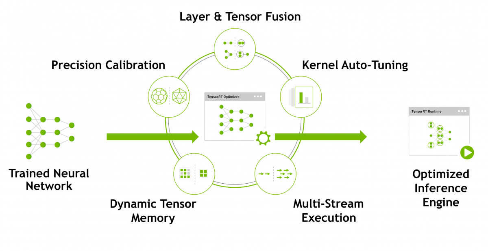
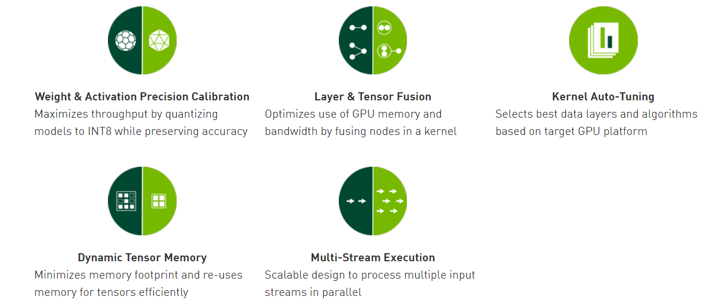
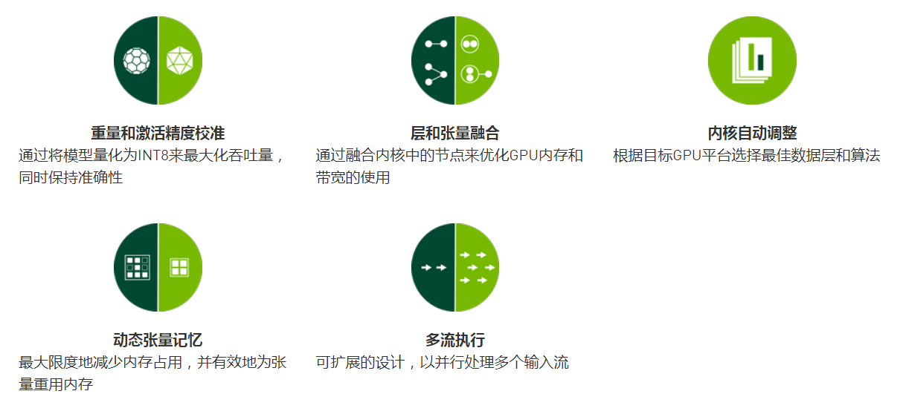
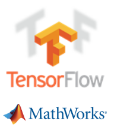
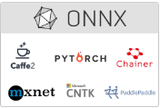

# TensorRT介绍
**可编程推理加速器**     
NVIDIA TensorRT™是一个高性能深度学习推理平台。它包括深度学习推理优化器和在运行时可为深度学习推理应用程序提供低延迟和高吞吐量(It includes a deep learning inference optimizer and runtime that delivers low latency and high-throughput for deep learning inference applications.)。在推理期间，基于TensorRT的应用程序比仅CPU平台的执行速度快40倍。使用TensorRT，您可以优化在所有主要框架中培训的神经网络模型，以高准确率校准低精度，最后部署到超大规模数据中心，嵌入式或汽车产品平台。(With TensorRT, you can optimize neural network models trained in all major frameworks, calibrate for lower precision with high accuracy, and finally deploy to hyperscale data centers, embedded, or automotive product platforms.)

TensorRT构建于NVIDIA的并行编程模型CUDA之上，使您能够利用CUDA-X AI中的库，开发工具和技术，为人工智能，自动机器，高性能计算和图形优化所有深度学习框架的推理。

TensorRT为深度学习推理应用的生产部署提供INT8和FP16优化，例如视频流，语音识别，推荐和自然语言处理。降低精度推断可显着减少应用程序延迟，这是许多实时服务，自动和嵌入式应用程序的要求。

您可以将训练有素的模型从每个深度学习框架导入TensorRT。应用优化后，TensorRT选择特定于平台的内核，以最大限度地提高数据中心，Jetson嵌入式平台和NVIDIA DRIVE自动驾驶平台中Tesla GPU的性能。

为了在数据中心生产中使用AI模型，TensorRT推理服务器是一种容器化微服务，可最大化GPU利用率，并在节点上同时运行来自不同框架的多个模型。它利用Docker和Kubernetes无缝集成到DevOps架构中。

使用TensorRT，开发人员可以专注于创建新颖的AI驱动的应用程序，而不是用于推理部署的性能调整。

## TensorRT优化和性能
   
   
## 与主要框架集成
       

