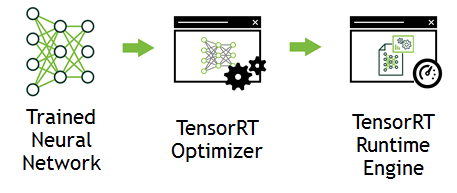
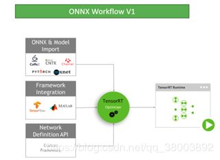

# TensorRT5介绍及Pytorch转TensorRT5代码示例
## 1 TensorRT简介
TensorRT的核心是一个c++库，它促进了对NVIDIA图形处理单元(gpu)的高性能计算。它与TensorFlow，Pytorch等框架相辅相成。他可以快速高效的运行一个已经训练好的神经网络，并生成结果。它包括用于从Caffe、ONNX或TensorFlow导入现有模型的解析器，以及用于以编程方式构建模型的c++和Python api。TensorRT在所有支持的平台上提供c++实现，在x86上提供Python实现。

## 2 TensorRT的好处
训练神经网络之后，TensorRT使网络能够被压缩、优化并作为运行时部署，而不需要框架的开销。TensorRT结合了多个层，优化内核选择，并根据指定的精度(FP32、FP16或INT8)执行规范化和转换，以优化矩阵计算，从而提高延迟、吞吐量和效率。TensorRT通过将API与特定硬件细节的高级抽象以及专门针对高吞吐量、低延迟和低设备内存占用计算而开发和优化的实现相结合来解决这些问题。
注：1080TI支持fp32和int8精度的运算，而最新出的RTX2080TI系列则支持fp16。

## 3 TensorRT的使用说明
（1）TensorRT一般不用于训练阶段的任何部分。   
（2）需要使用ONNX解析器、Caffe解析器或TensorFlow/UFF解析器将保存的神经网络从其保存的格式解析为TensorRT。（网络可以直接从Caffe导入，也可以通过UFF或ONNX格式从其他框架导入。）TensorRT 5.0.0附带的ONNX解析器支持ONNX IR(中间表示)版本0.0.3和opset版本7。   
   
(3）考虑优化选项——批大小、工作区大小和混合精度。这些选项被选择并指定TensorRT构建步骤的一部分，在此步骤中，根据网络实际构建一个优化的计算引擎。    
(4）验证结果，选择FP32 或 FP16结果应该更准确，INT8效果应该会差一点    
(5）以串行格式写出计算引擎，称为计划文件   
(6）要初始化推理引擎，应用程序首先将模型从计划文件反序列化为推理引擎。   
（7）TensorRT通常异步使用，因此，当输入数据到达时，程序调用一个execute_async函数，其中包含输入缓冲区、输出缓冲区，TensorRT应该将结果放入其中的缓冲区。（用pycuda操作缓冲区）    

注：生成的计划文件不能跨平台或TensorRT版本移植。并且针对特定的GPU。   
## 4 TensorRT的使用步骤：（假设以及有一个训练好的模型）
（1） 根据模型创建TensorRT网络定义  
（2） 调用TensorRT构建器从网络创建优化的运行引擎   
（3） 序列化和反序列化引擎，以便在运行时快速创建引擎   
（4） 为引擎提供数据以执行计算   

## 5 TensorRT版本说明
TensorRT有C++和Python两个版本。TensorRT在所有支持的平台上提供C++实现，在x86上提供Python实现。两个版本在功能上相近，Python版本可能更简单，因为有很多第三方库可以帮助做数据处理，C++版本安全性更高。   

## 6 TensorRT环境安装
这个可以通过NVIDIA官网教程完成安装，或者很多博文有很详细记录在这里不多说。   

## 7 Pytorch转TensorRT5示例代码
因为网上资料较少，仅有的代码也都是TensorRT4的而TensorRT5对API改变比较大，简化了开发过程，所以这里把一个基于TensorRT4的示例代码改了一下，供大家参考。
```
import tensorrt as trt
import pycuda.driver as cuda
import pycuda.autoinit
import numpy as np
from matplotlib.pyplot import imshow  # to show test case
import torch
import torch.nn as nn
import torch.nn.functional as F
import torch.optim as optim
from torchvision import datasets, transforms
from torch.autograd import Variable

BATCH_SIZE = 64
TEST_BATCH_SIZE = 1000
EPOCHS = 3
LEARNING_RATE = 0.001
SGD_MOMENTUM = 0.5
SEED = 1
LOG_INTERVAL = 10
torch.cuda.manual_seed(SEED)

# 加载MNIST数据集
kwargs = {'num_workers': 1, 'pin_memory': True}
train_loader = torch.utils.data.DataLoader(
    datasets.MNIST('/tmp/mnist/data', train=True, download=True,
                   transform=transforms.Compose([
                       transforms.ToTensor(),
                       transforms.Normalize((0.1307,), (0.3081,))
                   ])),
    batch_size=BATCH_SIZE,
    shuffle=True,
    **kwargs)

test_loader = torch.utils.data.DataLoader(
    datasets.MNIST('/tmp/mnist/data', train=False,
                   transform=transforms.Compose([
                       transforms.ToTensor(),
                       transforms.Normalize((0.1307,), (0.3081,))
                   ])),
    batch_size=TEST_BATCH_SIZE,
    shuffle=True,
    **kwargs)


# 神经网络结构
class Net(nn.Module):
    def __init__(self):
        super(Net, self).__init__()
        self.conv1 = nn.Conv2d(1, 20, kernel_size=5)
        self.conv2 = nn.Conv2d(20, 50, kernel_size=5)
        self.conv2_drop = nn.Dropout2d()
        self.fc1 = nn.Linear(800, 500)
        self.fc2 = nn.Linear(500, 10)

    def forward(self, x):
        x = F.max_pool2d(self.conv1(x), kernel_size=2, stride=2)
        x = F.max_pool2d(self.conv2(x), kernel_size=2, stride=2)
        x = x.view(-1, 800)
        x = F.relu(self.fc1(x))
        x = self.fc2(x)
        return F.log_softmax(x)


model = Net()
# 利用GPU训练
model.cuda()
optimizer = optim.SGD(model.parameters(), lr=LEARNING_RATE, momentum=SGD_MOMENTUM)

# 训练神经网络
def train(epoch):
    model.train()
    for batch, (data, target) in enumerate(train_loader):
        data, target = data.cuda(), target.cuda()
        data, target = Variable(data), Variable(target)
        optimizer.zero_grad()
        output = model(data)
        loss = F.nll_loss(output, target)
        loss.backward()
        optimizer.step()
        # if batch % LOG_INTERVAL == 0:
        # print('Train Epoch: {} [{}/{} ({:.0f}%)]\tLoss: {:.6f}'
        #      .format(epoch,
        #              batch * len(data),
        #              len(train_loader.dataset),
        #              100. * batch / len(train_loader),
        #              loss.data[0]))

# 测试正确率
def test(epoch):
    model.eval()
    test_loss = 0
    correct = 0
    for data, target in test_loader:
        data, target = data.cuda(), target.cuda()
        data, target = Variable(data, volatile=True), Variable(target)
        output = model(data)
        test_loss += F.nll_loss(output, target).item()
        pred = output.data.max(1)[1]
        correct += pred.eq(target.data).cpu().sum()
    test_loss /= len(test_loader)
    print('\nTest set: Average loss: {:.4f}, Accuracy: {}/{} ({:.0f}%)\n'
          .format(test_loss,
                  correct,
                  len(test_loader.dataset),
                  100. * correct / len(test_loader.dataset)))

# 训练三世代
for e in range(EPOCHS):
    train(e + 1)
    test(e + 1)

from time import time

# 计算开始时间
Start = time()

# 读取训练好的模型的
weights = model.state_dict()

# 打印日志
G_LOGGER = trt.Logger(trt.Logger.WARNING)

# 创建Builder
builder = trt.Builder(G_LOGGER)

# 根据模型创建TensorRT的网络结构
network = builder.create_network()

# Name for the input layer, data type, tuple for dimension
data = network.add_input("data", trt.float32, (1, 28, 28))
assert (data)

# -------------
conv1_w = weights['conv1.weight'].cpu().numpy().reshape(-1)
conv1_b = weights['conv1.bias'].cpu().numpy().reshape(-1)
conv1 = network.add_convolution(data, 20, (5, 5), conv1_w, conv1_b)
assert (conv1)
conv1.stride = (1, 1)

# -------------
pool1 = network.add_pooling(conv1.get_output(0), trt.PoolingType.MAX, (2, 2))
assert (pool1)
pool1.stride = (2, 2)

# -------------
conv2_w = weights['conv2.weight'].cpu().numpy().reshape(-1)
conv2_b = weights['conv2.bias'].cpu().numpy().reshape(-1)
conv2 = network.add_convolution(pool1.get_output(0), 50, (5, 5), conv2_w, conv2_b)
assert (conv2)
conv2.stride = (1, 1)

# -------------
pool2 = network.add_pooling(conv2.get_output(0), trt.PoolingType.MAX, (2, 2))
assert (pool2)
pool2.stride = (2, 2)

# -------------
fc1_w = weights['fc1.weight'].cpu().numpy().reshape(-1)
fc1_b = weights['fc1.bias'].cpu().numpy().reshape(-1)
fc1 = network.add_fully_connected(pool2.get_output(0), 500, fc1_w, fc1_b)
assert (fc1)

# -------------
relu1 = network.add_activation(fc1.get_output(0), trt.ActivationType.RELU)
assert (relu1)

# -------------
fc2_w = weights['fc2.weight'].cpu().numpy().reshape(-1)
fc2_b = weights['fc2.bias'].cpu().numpy().reshape(-1)
fc2 = network.add_fully_connected(relu1.get_output(0), 10, fc2_w, fc2_b)
assert (fc2)

fc2.get_output(0).name = "prob"
network.mark_output(fc2.get_output(0))
builder.max_batch_size = 100
builder.max_workspace_size = 1 << 20

# 创建引擎
engine = builder.build_cuda_engine(network)
del network
del builder

runtime = trt.Runtime(G_LOGGER)

# 读取测试集
img, target = next(iter(test_loader))
img = img.numpy()
target = target.numpy()

# print("Test Case: " + str(target))
img = img.ravel()

context = engine.create_execution_context()
output = np.empty((100, 10), dtype=np.float32)

# 分配内存
d_input = cuda.mem_alloc(1 * img.size * img.dtype.itemsize)
d_output = cuda.mem_alloc(1 * output.size * output.dtype.itemsize)
bindings = [int(d_input), int(d_output)]

# pycuda操作缓冲区
stream = cuda.Stream()
# 将输入数据放入device
cuda.memcpy_htod_async(d_input, img, stream)
# 执行模型
context.execute_async(100, bindings, stream.handle, None)
# 将预测结果从从缓冲区取出
cuda.memcpy_dtoh_async(output, d_output, stream)
# 线程同步
stream.synchronize()

print(len(np.argmax(output, axis=1)))

print("Test Case: " + str(target))
print("Prediction: " + str(np.argmax(output, axis=1)))
print("tensorrt time:", time() - Start)

# 保存计划文件
with open("lianzheng.engine", "wb") as f:
    f.write(engine.serialize())

# 反序列化引擎
with open("lianzheng.engine", "rb") as f, trt.Runtime(G_LOGGER) as runtime:
    engine = runtime.deserialize_cuda_engine(f.read())
del context
del engine
del runtime

```
