# 原理
## 一、TensorRT+P4 的性能
NVIDIA TESLA P4采用的是完整版本的GP104核心，也就是GTX 1080和GTX 1070所使用的核心。CUDA数目为完整的2560个核心，频率只有810-1063MHz,单精度浮点性能5.5TFlops，INT8 22TOPS。搭载的是GDDR5显存，功率只有50-75W，采用被动散热。最重要的是Tesla P4可以为超大型数据中心提供强有力的性能支持，一块Tesla P4相当于13台普通CPU服务器。      

TensorRT+P4具有良好的性能，具体性能如下：
* 最高效的推理平台。
* 数据中心扩展的最高性能推理平台。
* 实时响应推理平台。
## 二、TensorRT的优化
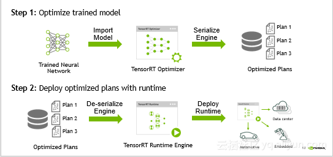   

TensorRT的部署分为两个部分，两部分的计算流程图的具体解释如下：

* 优化训练好的模型并生成计算流图。   
优化训练模型就是将优化的文件存储到计算机上，首先将训练神经网络优化生成最优的TensorRT控制器，其次是将TensorRT控制器进行串行化引擎，最后得出最优化的方案。
* 使用TensorRT Runtime部署计算流图。   
首先将优化方案去掉串行化引擎，其次是得出运行时的引擎，最后将其部署并运行到云上。               

若想要TensorRT部署流程很自然还需要解决许多问题，例如TensorRT训练出的网络模型需要支持什么样的框架、TensorRT支持的网络结构是什么样的、TensorRT优化器需要做哪些优化、TensorRT优化好的计算流图可以运行在什么设备上等问题。

## 三、TensorRT的图像优化
TensorRT在获得网络计算流图后会针对计算流图进行优化，这部分优化不会改变图中最底层的计算内容，而是会重构计算图来获得更快、更高效的执行方式，即计算不变优化计算方法。
TensorRT的优化可以分为三个层次的优化，分别是垂直层融合、水平层融合以及消除级联层，三个层次的具体介绍如下：  
### 垂直层融合
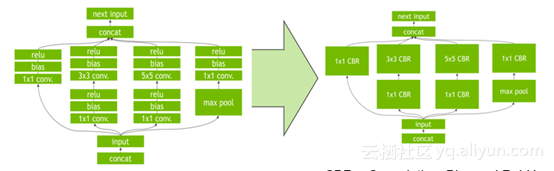   
如上图所示，通过垂直层融合相同顺序的操作来减少Kernel Launch的消耗以及避免层与层之间的显存读写操作。Concolution、Bias和ReLU层融合成一个Kernel，Kernel称之为CBR，即CBR = Convolution+Bias+ReLU。
### 水平层融合
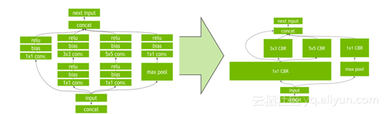   
如上图超宽的1x1 CBR所示，TensorRT去挖掘输入数据层，数据层具有filter大小相同、weights不同的特点，此时需要通过水平层融合的优化方法使得这些层使用同一个Kernel来提高效率
### 消除级联层
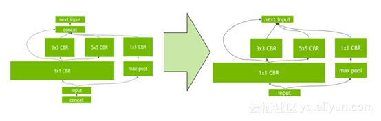   
消除级联层指消除没有必要的层，例如concatenation层等，从而减少不必要的工作量以及运行时间，有效的提高了效率。   

通过垂直层融合、水平层融合以及消除级联层三个层次的优化，TensorRT可以获得更小、更快、更高效的计算流图，优化过的TensorRT具有更少层网络结构以及Kernel Launch次数。总而言之，TensorRT可以有效的优化网络结构、减少网络层数，从而带来性能的提升。   
### NVIDIA TENSORRT    
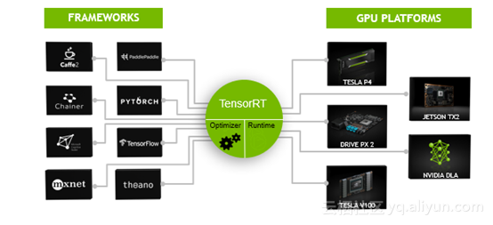   
NVIDIA TENSORRT的可编程推理加速器可分为四个部分，分别是输入网络框架、输入接口方式、输出支持系统平台以及输出支持系统平台。每个部分又有许多选择性，例如，TensorRT支持常见的深度学习输入网络框架有Caffe、Chainer、CNTK、MXnet、PaddlePaddle、Pytorch、TensorFlow、Theano等，TensorRT支持的模型输入接口方式有C++ API、Python API、NvCaffeParser, NvUffParser、NvONNx Parser等，TensorRT支持的输出支持系统平台有Linux x86、Linux aarch64、Android aarch64、QNX aarch64等，TensorRT支持的输出硬件平台有Tesla P4/V100、自动驾驶、嵌入式平台的DrivePX、TX1/TX2等。   
## 四、量化的方法
量化可以分为饱和和非饱和两种方法，具体讲解如下：    
### 饱和量化方法
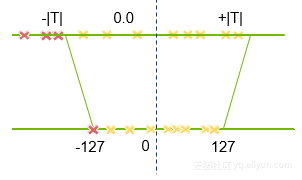   
上图讲的是饱和的量化方法，根据所选的量化方法以及量化的整体流程，对于量化最关键的是如何实现饱和方法中的阈值T的选择，这个选择流程被称之为校准。    

首先选择一个阈值T，并将阈值T范围内的FP32值映射至INT8，T阈值范围外的使用-127或128。对于此方法来说，weights无法提升准确度，而activations能有效提升准确度。这就是较为复杂的饱和方法。   
### 非饱和方法
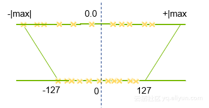   
上图为非饱和的量化方法，对weights和activations使用线性量化，即找到其中绝对值最大的值，然后将这个范围映射回INT8。此方法转化后会带来很大的准确度损失，因此对于weights和activations分别采用了不同的量化方法，这就是简单的非饱和的方法。
## 五、TensorRT 部署方法
完成TensorRT优化后可以得到一个Runtime inference engine，这个文件可以被系列化保存至硬盘中，而这个保存的序列化文件称之为Plan（流图），之所以称之为流图，是因为它不仅保存了计算时所需的网络weights也保存了Kernel执行的调度流程。TensorRT提供了write_engine_to_file()函数以来保存流图，在获得了流图之后就可以使用TensorRT部署应用。   

为了进一步的简化部署流程，TensorRT提供了TensorRT Lite API，它是高度抽象的接口会自动处理大量的、重复的通用任务，例如创建一个Logger、反序列化流图并生成Runtime inference engine、处理输入的数据等。
## 六、NGC+TRT+Aliyun的快速部署
GPU加速计算正在解决世界上一些最复杂的问题，但是GPU自身的使用也会有一定的复杂度。

### 复杂软件面临的挑战
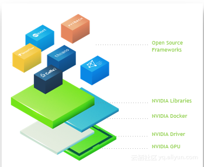   
复杂软件面临的重大挑战有三个方面，具体如下：
* DIY GPU加速的AI和HPC部署对构建，测试和维护来说是复杂且耗时的。
* 社区开发软件框架的速度非常快。
* 需要高水平的专业知识来管理驱动程序，库，框架依赖关系。

### 跨平台深度学习
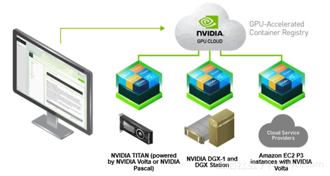   

深度学习容器是自包含和可移植的，可以在任何地方运行，即可以使用完全相同的环境在桌面、数据中心或云中构建、培训和部署。例如，在家里TITAN V的环境中工作、使用NVIDIA DGX-1进行大规模的测试等，就可以做到这一点。若想要简化工作量，可以立即使用阿里云GPU计算实例和NGC，可以围绕每项工作使用正确的计算大小来移动工作，最终访问混合云以进行深入学习。
### 虚拟机与容器的比较
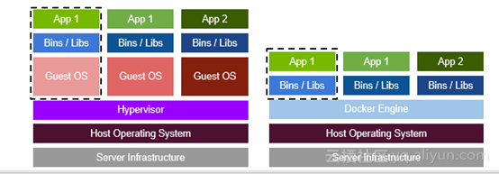   

虚拟机需要占用大量的内存和耗费大量的时间。由于虚拟机是独立的，它具有自己的操作系统、自己的应用程序以及自己的资源，因此需要占用大量的内存空间。 有时候，开发人员需要快速地测试不同版本的应用程序，这就需要IT Ops团队部署一台或多台机器，因此耗费大量的时间。    

而容器不包含任何操作系统，因此占用物理主机上的虚拟机资源更少。容器只是共享主机操作系统，包括内核和库，所以它们不需要启动完整的操作系统。   

由此可以得出，容器相对于虚拟机而言更优。特别地，容器的启动时间更快，一个容器化的应用程序通常在几秒钟内开始，而虚拟机可能需要几分钟的时间。
### NVIDIA容器
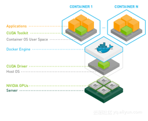   
Docker容器是硬件不可知的，并且与平台无关。然而，NVIDIA GPU是需要NVIDIA驱动程序的专用硬件。由于Docker本身不支持容器内的NVIDIA GPU，因此使用NVIDIA-Docker可以使镜像不受NVIDIA驱动程序的影响。在目标机器上启动容器时，需安装GPU所需的字符设备和驱动程序文件，这使得Docker镜像便于移植。