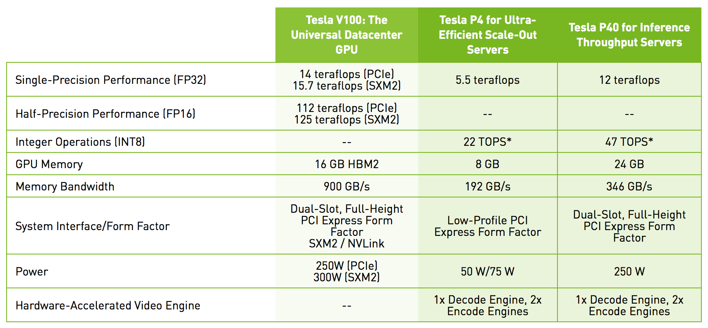
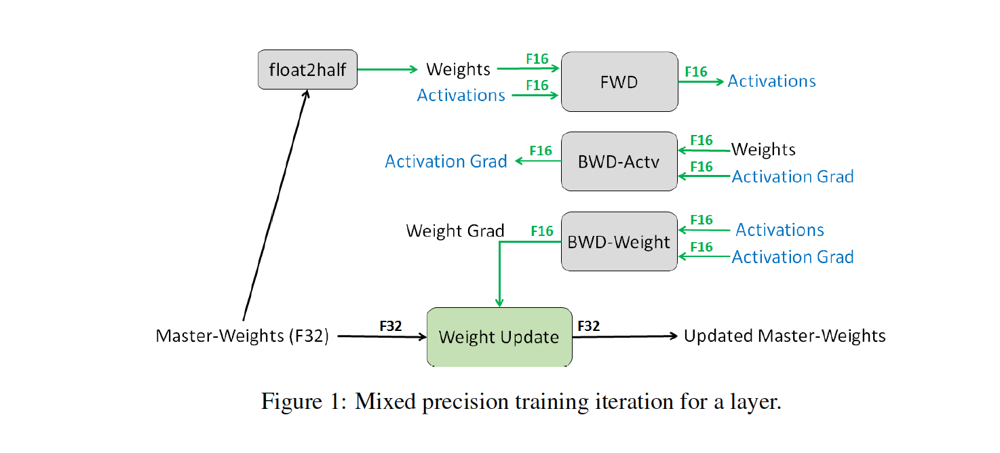
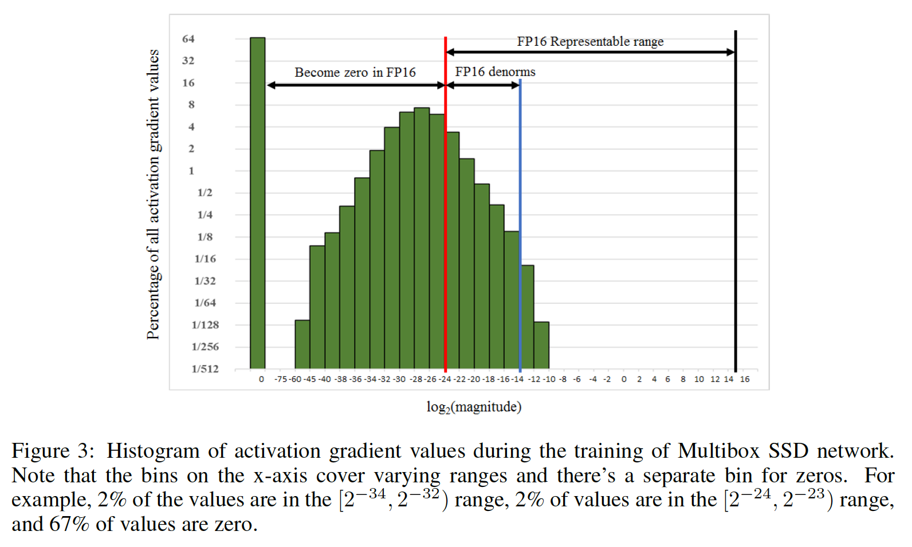
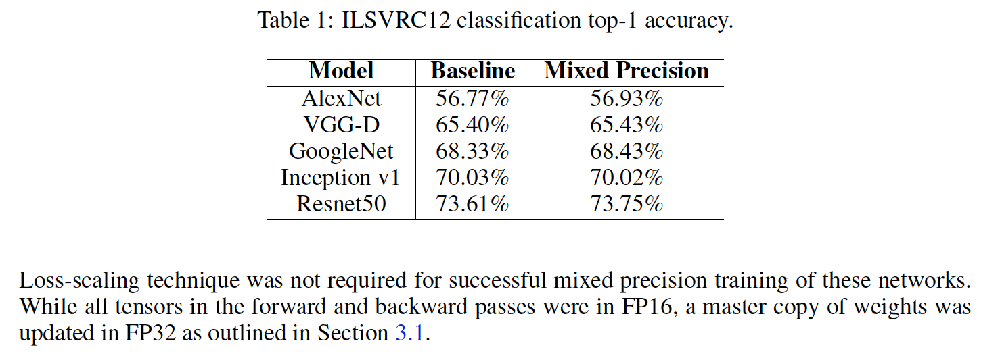
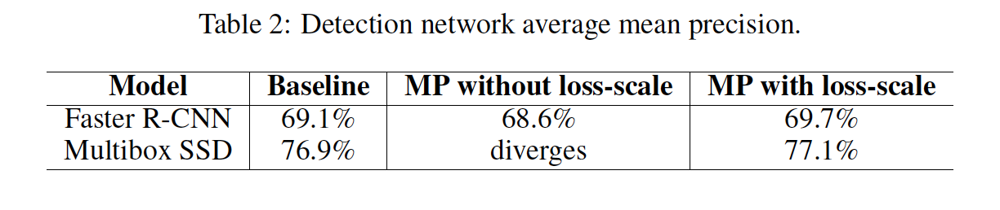
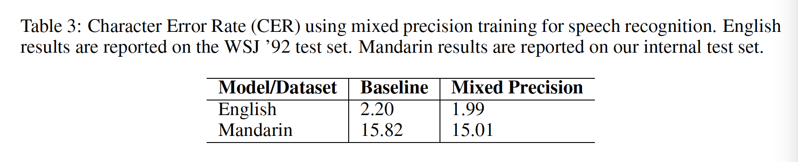
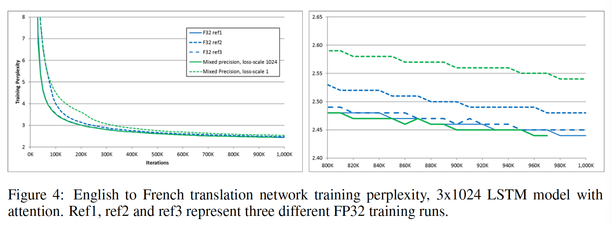
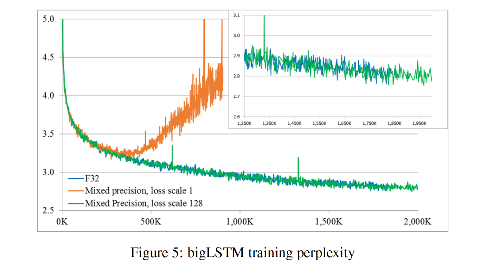

# 混合精度训练

## 一、论文概述
Paper：[🔗](../res/1710.03740.pdf)   
nvidia的Pascal和Volta系列显卡除了支持标准的单精度计算外，也支持了低精度的计算，比如最新的Tesla V100硬件支持了FP16的计算加速，P4和P40支持INT8的计算加速，而且低精度计算的峰值要远高于单精浮点的计算峰值。   
   
为了加速训练过程以及减少显存开销，baidu Research和nvidia在这篇论文中合作提出了一种FP16和FP32混合精度训练的方法，并且在CNN分类和检测、语音识别和语言模型任务上进行了验证，实验过程中使用的GPU就是Tesla V100。

训练过程中每层的权重都存成FP32格式（Mater-Weights），每次训练时都会将FP32的权重降精度至FP16（ a master copy），前向输出和后向梯度都使用FP16进行计算，更新时将FP16的梯度累加到FP32的Mater-Weight上。

   
## 二、混合精度的必要性
由于FP16所能表示的subnormal最小正数是（Half-precision floating-point format），也就是说在区间的数（或者说指数位小于-24的数）使用FP16表示时都会变成0。在一个普通话识别的模型训练中，有将近5%的权重梯度的指数位小于-24，如果更新时也用FP16计算，那么这些数在乘以学习率后都将变成0，从而对最终模型效果产生负面影响，使用混合精度训练的方式可以避免这种问题。   

## 三、Loss scaling
混合精度训练可以解决权重更新量很小的问题，但无法解决梯度本身很小的问题。在一些网络中（比如SSD），梯度大部分都在FP16的表示范围之外，因此需要将梯度平移到FP16的表示范围内 。

   
平移实际上就是对梯度值乘以一个系数（等于2^n，n为平移的位数），但另一种简单高效的方法是直接在前向时就将loss乘以scale，这样在后向传导时所有的梯度都会被乘以相同的scale。权重更新时需要将移位后的梯度除以scale后，再更新到权重上。

论文中提到他们在实验过程中使用的scale是8~32K，最终取得了与FP32一致的收敛结果。对于scale的选择，论文没有统一的方法，只是提到scale并没有下界，只要选择的scale不会在后向计算时导致溢出就行。

## 四、实验结果
* 图像分类   
   
* 物体检测   
   
* 语音识别    
   
* 机器翻译   
   
* 语言模型      
   

## 五、TensorFlow实现
下面的代码主要参考：https://github.com/tensorflow/models/tree/master/official/resnet

### 1.将输入转为FP16精度
```
inputs = tf.cast(inputs, tf.float16)
```
### 2.使用custom_getter构建模型实现FP32 master copy

下面即是一个模型的样例代码。

forward为模型的前向传播计算过程，我们使用一个_model_variable_scope来管理Variable上下文环境。 TensorFlow中的Vairable即网络中的参数。

_model_variable_scope函数返回一个tf.variable_scope。 它是TensorFlow提供的定义Variables创建过程的上下文管理器，官方文档在这里。 第一个参数用于定义scope名称，所有在该上下文环境内创建的Variable均会加上该名称作为前缀。 custom_getter参数用于指定Variable获取函数。

_custom_dtype_getter即我们设定的Variable获取函数。 在variable_scope中，默认的获取函数为tf.get_variable。 如果我们指定了custom_getter参数，那么tf.get_variable将调用我们设定的函数，而不是直接获取Variable。 custom_getter所指定的函数应当与tf.get_variable参数列表相同，除了它多出了一个getter参数。 该参数即为默认的tf.get_variable函数。 在该函数中，我们规定了如果要获取的Variable类型为tf.float16，那么我们首先获取其32位的master copy，再将其转换为16位返回。 其他类型的Variable则直接调用getter返回。
```
class Model(object):

    def __init__(self, ..., dtype=tf.float16):
        self.dtype = dtype
        ...

    def _custom_dtype_getter(self, getter, name, shape=None, dtype=self.dtype,
                               *args, **kwargs):
        if dtype is tf.float16:
            var = getter(name, shape, tf.float32, *args, **kwargs)
            return tf.cast(var, dtype=dtype, name=name + '_cast')
        else:
            return getter(name, shape, dtype, *args, **kwargs)

    def _model_variable_scope(self):
        return tf.variable_scope('scope_name',
                                    custom_getter=_self._custom_dtype_getter)

    def forward(self, inputs, ...):
        with self._model_variable_scope():
            ...
            return outputs
```
### 3.放大loss，缩小gradient 过程比较简单，
在使用optimizer计算梯度的时候将loss乘上loss_scale， 梯度计算完成后再将各个Variables的梯度缩小相应的倍数即可。 需要注意的地方在于loss计算过程最好是在FP32精度下进行，否则某些中间结果可能会超出FP16精度的范围， 如计算l2 loss的时候，对Variable值进行累加时和可能会上溢。
```
def model_function(features, labels, mode, params):
    model = Model(dtype=tf.float16)
    logits = model.forward(features)

    # 结果转为32位再计算loss, 否则可能上溢
    cross_entropy = tf.losses.softmax_cross_entropy(labels,
                                                    tf.cast(logits, tf.float32))
    l2_loss = tf.nn.l2_loss(tf.cast(trainable_variables, tf.float32))
    total_loss = cross_entropy + l2_weight * l2_loss

    if mode == tf.estimator.ModeKeys.TRAIN:
        global_step = tf.train.get_or_create_globa_step()
        optimizer = tf.train.SomeOptimizer(...)
        scaled_grad_vars = optimizer.compute_gradients(total_loss * loss_scale) 
        unscaled_grad_vars = [(grad  / loss_scale, var) in scaled_grad_vars
                                for grad, var in scaled_grad_vars]
        train_op = optimizer.apply_gradients(unscaled_grad_vars, global_step)

        return train_op
```
## 六、PyTorch
NVIDIA为PyTorch编写了一个用于混合精度训练的库apex， 安装好该库之后可以很方便的使用混合精度加速训练。

下面的代码主要参考：https://github.com/NVIDIA/apex/tree/master/examples/imagenet。

### 1.将输入转为FP16精度
```
inputs = inputs.half()    
```
### 2.将模型转为FP16精度

对于PyTorch中继承自torch.nn.Module的模型，直接调用器half()函数即可将其转为FP16精度。 但是需要注意的是，BN层需在FP32精度下进行计算。 若模型中包含BN层，需将其转回FP32。
```
def BN_convert_float(module):
    if isinstance(module, torch.nn.modules.batchnorm._BatchNorm):
        module.float()
    for child in module.children():
        BN_convert_float(child)
    return module

model = build_model()
model = BN_convert_float(model.half())
```
### 3.使用FP16_Optimizer装饰优化器

apex库提供的FP16_Optimizer可以帮助用户实现FP32 master copy功能。
```
from apex.fp16_utils import FP16_Optimizer

optimizer = torch.optim.SomeOptimizer(model.parameters(), ...)
optimizer = FP16_Optimizer(optimizer,
                            static_loss_scale=loss_scale)
```
在优化过程中，将loss.backward()替换为optimizer.backward(loss)即可实现loss放大与梯度缩小。
```
while training:
    loss = ...

    optimizer.zero_grad()
    if fp16_mode:
        optimizer.backward(loss)
    else:
        loss.backward()
    optimizer.step()
```


----
## Reference   
[1] https://hjchen2.github.io/2018/02/03/%E6%B7%B7%E5%90%88%E7%B2%BE%E5%BA%A6%E8%AE%AD%E7%BB%83/   
[2] http://kevinlt.top/2018/09/14/mixed_precision_training/   
[3] https://developer.nvidia.com/deep-learning-examples   
