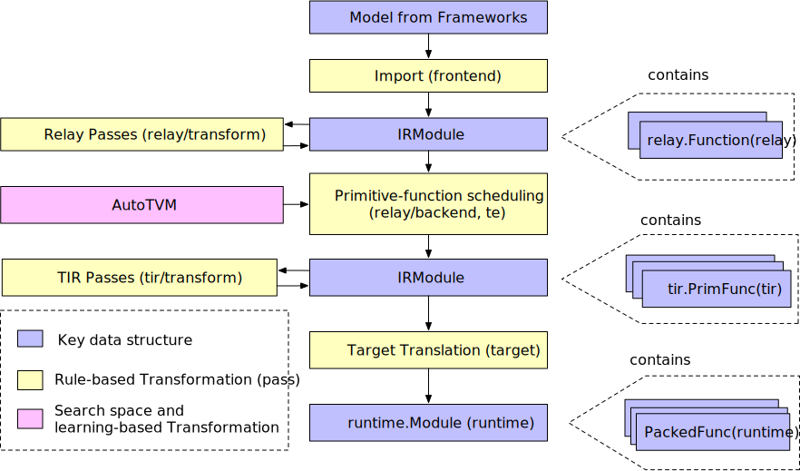
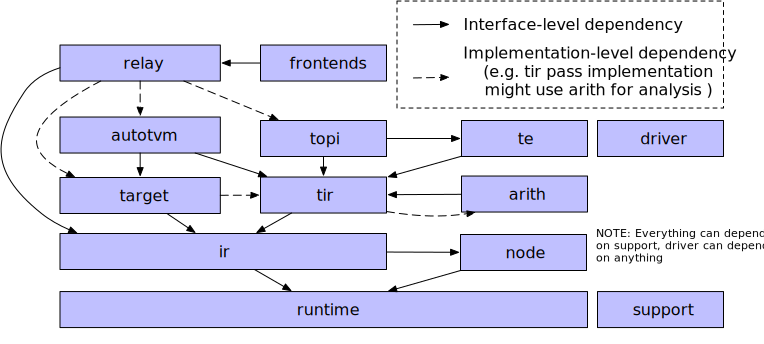

# Design and Architecture[🔗](https://tvm.apache.org/docs/dev/index.html#example-compilation-flow)（TVM架构和设计）

2020年12月16日

---

This document is intended for developers who want to understand the architecture of TVM and/or actively develop on the project. This page is organized as follows:

本文档适用于希望了解TVM体系结构和/或在项目上进行积极开发的开发人员。该页面的组织如下：


- The [Example Compilation Flow](https://tvm.apache.org/docs/dev/index.html#example-compilation-flow) gives an overview of the steps that TVM takes to turn a high level description of a model into a deployable module. To get started, please read this section first.
- 示例编译流程  概述了TVM将模型的高级概念转换为可部署模块的步骤。首先，请先阅读本节。
- The [Logical Architecture Components](https://tvm.apache.org/docs/dev/index.html#logical-architecture-components) section describes the logical components. The sections after are specific guides focused on each logical component, organized by the component’s name.
- 逻辑架构组件部分 描述逻辑组件。针对每个逻辑组件，按组件的名称进行组织。
- Feel free to also checkout the [Developer How-To Guide](https://tvm.apache.org/docs/dev/how_to.html#dev-how-to) for useful development tips.
- 也可以随时查看开发人员如何指导有用的开发技巧


This guide provides a few complementary views of the architecture. First, we review a single end-to-end compilation flow and discuss the key data structures and the transformations. This runtime-based view focuses on the interactions of each components when running the compiler. Then we will review the logical modules of the codebase and their relationship. This part provides a static overarching view of the design.

本指南提供了一些体系结构的补充视图。首先，我们回顾一个端到端的编译流程，并讨论关键的数据结构和转换（key data structures and the transformations）。这个基于运行时的视图（runtime-based view）着重于运行编译器时每个组件的交互。然后，我们将回顾代码库的逻辑模块及其关系。这部分提供了设计的静态总体视图。

## 1. Example Compilation Flow（编译流程示例）

In this guide, we will study an example compilation flow in the compiler. The figure below shows the flow. At a high-level, it contains several steps:

在本指南中，我们将研究编译器中的示例编译流程。下图显示了流程。从高层次上讲，它包含几个步骤：

- Import: The frontend component ingests a model into an IRModule, which contains a collection of functions that internally represent the model.
- 导入：前端组件将模型提取到IRModule中，该模块包含内部表示模型的函数的集合。


- Transformation: The compiler transforms an IRModule to another functionally equivalent or approximately equivalent(e.g. in the case of quantization) IRModule. Many of the transformatons are target (backend) independent. We also allow target to affect the configuration of the transformation pipeline.
- 转换：编译器将IRModule转换为另一个功能上等效或近似等效的（例如，在量化的情况下）IRModule。许多转换都是独立于目标（后端）的。我们还允许目标影响转换管道的配置。


- Target Translation: The compiler translates(codegen) the IRModule to an executable format specified by the target. The target translation result is encapsulated as a runtime.Module that can be exported, loaded, and executed on the target runtime environment.
- 目标翻译：编译器将IRModule转换（代码生成）为目标指定的可执行格式。目标翻译结果被封装为一个runtime.Module，module可以导出，加载和执行对目标运行时环境。


- Runtime Execution: the user loads back a runtime.Module and runs the compiled functions in the supported runtime environment.

- 运行时执行：用户负载背了runtime.Module在支持的运行环境和运行编译功能。



### 1.1 Key data structures(关键数据结构)

One of the best ways to design and understand a complex system is to identify the key data structures and APIs that manipulate (transform) these data structures. Once we identified the key data structures, we can then breakdown a system into logical components that either define a collection of key data structures or transformations among the data structures.

设计和理解复杂系统的最佳方法之一就是识别关键数据结构和操作（转换）这些数据结构的API。一旦确定了关键数据结构，我们便可以将系统分解为逻辑组件，这些逻辑组件可以定义关键数据结构的集合或数据结构之间的转换。


**IRModule** is the primary data structure used across the entire stack. An IRModule (intermediate representation module) contains a collection of functions. Currently, we support two primary variants of functions.

**IRModule**是整个堆栈中使用的主要数据结构。IRModule（中间表示模块）包含函数的集合。当前，我们支持两种主要的功能变体。


- **relay::Function** is a high-level functional program representation. A relay.Function usually corresponds to an end-to-end model. You can view a relay.Function as a computational graph with additional support for control-flow, recursion, and complex data structures.
- **relay :: Function**是高级功能程序表示。A relay. Function通常对应于端到端模型。您可以将relay function作为计算图来查看，并额外支持控制流，递归和复杂的数据结构。


- **tir::PrimFunc** is a low-level program representation that contains elements including loop-nest choices, multi-dimensional load/store, threading, and vector/tensor instructions. It is usually used to represent an operator program that executes a (possibly-fused) layer in a model.
- **tir :: PrimFunc**是一个低级程序表示，其中包含一些元素，包括循环嵌套选择，**多维加**载/存储，线程和向量/张量指令。它通常用于表示执行模型中（可能是融合的）层的操作员程序。


During the compilation, a relay function may be lowered to multiple tir::PrimFunc functions and a top-level function that calls into those tir::PrimFunc functions.

在编译期间，可以将中继函数降低为多个tir :: PrimFunc函数和一个调用这些tir :: PrimFunc函数的顶级函数。

### 1.2 Transformations(转变)

Now that we have covered the key data structures, let us talk about the transformations. Each transformation could serve one of the following purposes:

既然我们已经涵盖了关键数据结构，那么让我们来谈谈转换。每个转换可以满足以下目的之一：


- optimization: transform a program to an equivalent, possibly more optimized version.
- 优化：将程序转换为等效的，可能更优化的版本。


- lowering: transform a program to a lower-level representation that is closer to the target.

- 降低：将程序转换为更接近目标的较低层表示。


**relay/transform** contains a collection of passes that optimize the model. The optimizations include common program optimizations such as constant folding and dead-code elimination, and tensor-computation specific passes such as layout transformation and scaling factor folding.

**中继/转换**包含优化模型的遍集合。这些优化包括常见的程序优化，例如恒定折叠和死代码消除，以及张量计算特定的遍历（例如布局转换和缩放因子折叠）。


Near the end of the relay optimization pipeline, we will run a pass(FuseOps) to break the end-to-end function(e.g. MobileNet) into sub-function(e.g. conv2d-relu) segments. We call these segments of functions. This process helps us to divide the original problem into two sub-problems:

在中继优化管道的末端附近，我们将运行pass（FuseOps）将端到端功能（例如MobileNet）划分为子功能（例如conv2d-relu）段。我们称这些功能为段。此过程可帮助我们将原始问题分为两个子问题：


- Compilation and optimization for each sub-function.
- 每个子功能的编译和优化。


- Overall execution structure: we need to do a sequence of calls into the generated sub-functions to execute the whole model.
- 总体执行结构：我们需要对所生成的子函数进行一系列调用，以执行整个模型。


We use the low-level tir phase to compile and optimize each sub-functions. For specific targets, we may also directly go to the target translation phase and use external code generators.

我们使用低级的Tir阶段来编译和优化每个子功能。对于特定目标，我们也可以直接进入目标翻译阶段并使用外部代码生成器。


There are a few different ways(in relay/backend) to handle the calls into the overall execution problem. For simple models with known shapes and no control flow, we can lower to a graph runtime that stores the execution structure in a graph. We also support a virtual machine backend for dynamic executions. Finally, we plan to support ahead of time compilation that compiles the high-level execution structure into the executable and generated primitive functions. All of these execution modes are encapsulated by a unified **runtime.Module** interface, which we will discuss in the latter part of the guide.

有几种不同的方法（在中继/后端）来处理对整个执行问题的调用。对于具有已知形状且无控制流的简单模型，我们可以降低到将执行结构存储在图中的图运行时。我们还支持虚拟机后端进行动态执行。最后，我们计划支持提前编译，该编译将高级执行结构编译为可执行文件和生成的原始函数。所有这些执行模式都由统一的**runtime.Module** 接口封装 ，我们将在本指南的后面部分中进行讨论。


**tir/transform** contains transformation passes for TIR level functions. Many tir passes serve the purpose of lowering. For example, there are passes to flatten multi-dimensional access to one-dimensional pointer access, to expand the intrinsics into target-specific ones, and to decorate the function entry to meet the runtime calling convention. Of course, there are also optimizations passes, such as access index simplification and dead code elimination.

**tir / transform**包含用于TIR级别功能的转换过程。许多Tir通行证的目的是降低。例如，可以通过多种途径将多维访问展平到一维指针访问，将内在函数扩展为特定于目标的内在函数，并修饰函数条目以满足运行时调用约定。当然，也有一些优化过程，例如简化访问索引和消除无效代码。


Many low-level optimizations can be handled in the target phase by the LLVM, CUDA C, and other target compilers. As a result, we leave low-level optimizations such as register allocation to the downstream compilers and only focus on optimizations that are not covered by them.

LLVM，CUDA C和其他目标编译器可以在目标阶段处理许多低级优化。结果，我们将低级优化（例如寄存器分配）留给了下游编译器，而只专注于它们未涵盖的优化。

### 1.3 Search-space and Learning-based Transformations（搜索空间和基于学习的转换）

The transformation passes we described so far are deterministic and rule-based. One design goal of the TVM stack is to support high-performance code optimizations for different hardware platforms. To do so, we will need to investigate as many optimizations choices as possible, including but not limited to, multi-dimensional tensor access, loop tiling behavior, special accelerator memory hierarchy, and threading.

到目前为止，我们描述的转换过程是确定性的且基于规则的。TVM堆栈的一个设计目标是支持针对不同硬件平台的高性能代码优化。为此，我们将需要研究尽可能多的优化选择，包括但不限于多维张量访问，循环切片行为，特殊的加速器内存层次结构和线程化。


It is hard to define a heuristic to make all of the choices. Instead, we will take a search and learning-based approach. We first define a collection of actions we can take to transform a program. Example actions include loop transformations, inlining, vectorization. We call these actions **scheduling primitives**. The collection of scheduling primitives defines a search space of possible optimizations we can make to a program. The system then searches over different possible scheduling sequence to pick the best scheduling combination. The search procedure is usually guided by a machine learning algorithm.

很难定义做出所有选择的试探法。相反，我们将采用基于搜索和学习的方法。我们首先定义可以用来转换程序的动作的集合。示例动作包括循环转换，内联，向量化。我们称这些动作为**调度原语**。调度原语的集合定义了我们可以对程序进行的可能优化的搜索空间。然后，系统搜索不同的可能调度序列以选择最佳调度组合。搜索过程通常以机器学习算法为指导。


We can record the best schedule sequence for an (possibly-fused) operator once the search is completed. The compiler can then just lookup the best schedule sequence and apply it to the program. Notably, this schedule application phase is **exactly like** the rule-based transformations, enabling us to share the same interface convention with tradition passes.

搜索完成后，我们可以为（可能是融合的）操作员记录最佳调度顺序。然后，编译器可以仅查找最佳调度序列，并将其应用于程序。值得注意的是，此计划应用程序阶段**完全类似于**基于规则的转换，使我们能够与传统流程共享相同的接口约定。


We use search based optimizations to handle the initial tir function generation problem. This part of the module is called AutoTVM(auto_scheduler). We expect to expand the learning-based transformations to more areas as we continue to develop the TVM stack.

我们使用基于搜索的优化来处理最初的Tir函数生成问题。模块的此部分称为AutoTVM（auto_scheduler）。随着我们继续开发TVM堆栈，我们希望将基于学习的转换扩展到更多领域。

### 1.4 Target Translation（目标翻译）

The target translation phase transforms an IRModule to the corresponding target executable format. For backends such as x86 and ARM, we use the LLVM IRBuilder to build in-memory LLVM IR. We can also generate source-level languages such as CUDA C and OpenCL. Finally, we support direct translations of a Relay function (sub-graph) to specific targets via external code generators. It is important that the final code generation phase is as lightweight as possible. Vast majority of transformations and lowering should be performed before the target translation phase.

目标转换阶段将IRModule转换为相应的目标可执行格式。对于x86和ARM等后端，我们使用LLVM IRBuilder来构建内存中的LLVM IR。我们还可以生成诸如CUDA C和OpenCL之类的源代码级语言。最后，我们支持通过外部代码生成器将Relay函数（子图）直接转换为特定目标。重要的是，最终代码生成阶段应尽可能轻巧。绝大部分的转换和降低都应在目标翻译阶段之前进行。


We also provide a Target structure to specify the compilation target. The transformations before the target translation phase can also be affected by the target — for example, a target’s vector length would change the vectorization behavior.

我们还提供了一个Target结构来指定编译目标。目标翻译阶段之前的转换也可能受到目标的影响-例如，目标的向量长度会改变向量化行为。

### 1.5 Runtime Execution（运行时执行）

The main goal of TVM’s runtime is to provide a minimal API for loading and executing the compiled artifact in a language of their choice, including Python, C++, Rust, Go, Java, and JavaScript. The code snippet below shows such an example in Python:

TVM运行时的主要目标是提供一个最小的API，以使用他们选择的语言（包括Python，C ++，Rust，Go，Java和JavaScript）加载和执行已编译的工件。下面的代码片段显示了Python中的这样一个示例：


```python
import tvm
# Example runtime execution program in python, with type annotated
mod: tvm.runtime.Module = tvm.runtime.load_module("compiled_artifact.so")
arr: tvm.runtime.NDArray = tvm.nd.array([1, 2, 3], ctx=tvm.gpu(0))
fun: tvm.runtime.PackedFunc = mod["addone"]
fun(a)
print(a.asnumpy())
```

[`tvm.runtime.Module`](https://tvm.apache.org/docs/api/python/runtime.html#tvm.runtime.Module) encapsulates the result of compilation. A runtime.Module contains a GetFunction method to obtain PackedFuncs by name.

[`tvm.runtime.Module`](https://tvm.apache.org/docs/api/python/runtime.html#tvm.runtime.Module)封装编译结果。runtime.Module包含一个GetFunction方法，用于按名称获取PackedFuncs。


[`tvm.runtime.PackedFunc`](https://tvm.apache.org/docs/api/python/runtime.html#tvm.runtime.PackedFunc) is a type-erased function interface for both the generated functions. A runtime.PackedFunc can take arguments and return values with the following types: POD types(int, float), string, runtime.PackedFunc, runtime.Module, runtime.NDArray, and other sub-classes of runtime.Object.

[`tvm.runtime.PackedFunc`](https://tvm.apache.org/docs/api/python/runtime.html#tvm.runtime.PackedFunc)是两个生成的函数的类型擦除的函数接口。runtime.PackedFunc可以采用以下类型的参数并返回值：POD类型（int，float），字符串，runtime.PackedFunc，runtime.Module，runtime.NDArray以及runtime.Object的其他子类。


[`tvm.runtime.Module`](https://tvm.apache.org/docs/api/python/runtime.html#tvm.runtime.Module) and [`tvm.runtime.PackedFunc`](https://tvm.apache.org/docs/api/python/runtime.html#tvm.runtime.PackedFunc) are powerful mechanisms to modularize the runtime. For example, to get the above addone function on CUDA, we can use LLVM to generate the host-side code to compute the launching parameters(e.g. size of the thread groups) and then call into another PackedFunc from a CUDAModule that is backed by the CUDA driver API. The same mechanism can be used for OpenCL kernels.

[`tvm.runtime.Module`](https://tvm.apache.org/docs/api/python/runtime.html#tvm.runtime.Module)并且[`tvm.runtime.PackedFunc`](https://tvm.apache.org/docs/api/python/runtime.html#tvm.runtime.PackedFunc)是将运行时模块化的强大机制。例如，要在CUDA上获得上述addone函数，我们可以使用LLVM生成主机端代码以计算启动参数（例如线程组的大小），然后从CUDAModule调用另一个由PackedFunc支持的PackedFunc。 CUDA驱动程序API。相同的机制可用于OpenCL内核。


The above example only deals with a simple addone function. The code snippet below gives an example of an end-to-end model execution using the same interface:

上面的示例仅处理简单的addone函数。下面的代码段给出了使用同一接口执行端到端模型的示例：

```python
import tvm
# Example runtime execution program in python, with types annotated
factory: tvm.runtime.Module = tvm.runtime.load_module("resnet18.so")
# Create a stateful graph execution module for resnet18 on gpu(0)
gmod: tvm.runtime.Module = factory["resnet18"](tvm.gpu(0))
data: tvm.runtime.NDArray = get_input_data()
# set input
gmod["set_input"](0, data)
# execute the model
gmod["run"]()
# get the output
result = gmod["get_output"](0).asnumpy()
```

The main take away is that runtime.Module and runtime.PackedFunc are sufficient to encapsulate both operator level programs (such as addone), as well as the end-to-end models.

主要优点是runtime.Module和runtime.PackedFunc足以封装操作员级程序（例如addone）以及端到端模型。

### 1.6 Summary and Discussions(总结与讨论)

In summary, the key data structures in the compilation flows are:

总之，编译流程中的关键数据结构为：

- IRModule: contains relay.Function and tir.PrimFunc
- runtime.Module: contains runtime.PackedFunc


Most parts of the compilation are transformations among the key data structures.

编译的大部分内容是关键数据结构之间的转换。

- relay/transform and tir/transform are determinstic rule-based transformations。relay / transform和tir / transform是基于规则的确定性转换
- auto_scheduler and autotvm contains the search-based transformations。auto_scheduler和autotvm包含基于搜索的转换


Finally, the compilation flow example is only a typical use-case of the TVM stack. We expose these key data structures and transformations to python and C++ APIs. As a result, you can use TVM just like the way you use numpy, except that the data structure of interest changes from the numpy.ndarray to tvm.IRModule. Here are some example use-cases:

最后，编译流程示例只是TVM堆栈的典型用例。我们将这些关键数据结构和转换公开给python和C ++ API。因此，除了感兴趣的数据结构从numpy.ndarray更改为tvm.IRModule之外，您可以像使用numpy一样使用TVM。以下是一些用例示例：

- Directly construct IRModule using the python API. 使用python API直接构造IRModule。
- Compose a custom set of transformations(e.g. customize quantization).  组成一组自定义的转换（例如，自定义量化）。
- Manipulate the IR directly using TVM’s python API. 使用TVM的python API直接操作IR。


## 2. Logical Architecture Components（逻辑架构组件）



TVM Architecture Diagram

TVM体系结构图


The above figure shows the major logical components in the project. Please read the following sections for information about the components and their relations.

上图显示了项目中的主要逻辑组件。请阅读以下各节，以获取有关组件及其关系的信息。

### 2.1 tvm/support

The support module contains the most common utilities for the infrastructure, such as generic arena allocator, socket, and logging.

支持模块包含最常用的基础设施实用程序，例如通用竞技场分配器，套接字和日志记录。

### 2.2 tvm/runtime

The runtime serves as the foundation of the TVM stack. It provides the mechanism to load and execute compiled artifacts. The runtime defines a stable standard set of C APIs to interface with frontend languages such as Python and Rust.

运行是TVM堆栈的基础。它提供了加载和执行已编译工件的机制。runtime定义了一组稳定的标准C API，以与诸如Python和Rust的前端语言进行接口。


runtime::Object is one of the primary data structures in TVM runtime besides the runtime::PackedFunc. It is a reference-counted base class with a type index to support runtime type checking and downcasting. The object system allows the developer to introduce new data structures to the runtime, such as Array, Map, and new IR data structures.

除了runtime :: PackedFunc之外，runtime :: Object是TVM运行时中的主要数据结构之一。它是带有类型索引的引用计数基类，以支持运行时类型检查和向下转换。对象系统允许开发人员向运行时引入新的数据结构，例如数组，映射和新的IR数据结构。


Besides deployment use-cases, the compiler itself also makes heavy use of TVM’s runtime mechanism. All of the IR data structures are subclasses of runtime::Object, as a result, they can be directly accessed and manipulated from the Python frontend. We use the PackedFunc mechanism to expose various APIs to the frontend.

除了部署用例之外，编译器本身还大量使用TVM的运行时机制。所有的IR数据结构都是runtime :: Object的子类，因此，可以从Python前端直接访问和操作它们。我们使用PackedFunc机制将各种API公开给前端。


Runtime support for different hardware backends are defined in subdirectories of runtime(e.g. runtime/opencl). These hardware-specific runtime modules define APIs for device memory allocation and device function serialization.

在运行时的子目录中定义了对不同硬件后端的运行时支持（例如runtime / opencl）。这些特定于硬件的运行时模块定义了用于设备内存分配和设备功能序列化的API。


runtime/rpc implements an RPC support for PackedFunc. We can use the RPC mechanism to send a cross-compiled library to a remote device and benchmark the execution performance. The rpc infrastructure enables data collection from a wide range of hardware backends for learning-based optimizations.

runtime / rpc为PackedFunc实现RPC支持。我们可以使用RPC机制将交叉编译的库发送到远程设备，并对执行性能进行基准测试。rpc基础结构支持从广泛的硬件后端收集数据，以进行基于学习的优化。

- [TVM Runtime System](https://tvm.apache.org/docs/dev/runtime.html)
- [Debugger](https://tvm.apache.org/docs/dev/debugger.html)
- [Putting the VM in TVM: The Relay Virtual Machine](https://tvm.apache.org/docs/dev/virtual_machine.html)
- [Introduction to Module Serialization](https://tvm.apache.org/docs/dev/introduction_to_module_serialization.html)


### 2.3 tvm/node

The node module adds additional features on top of the runtime::Object for IR data structures. The main features include reflection, serialization, structural equivalence, and hashing.

节点模块在runtime :: Object的基础上为IR数据结构添加了其他功能。主要功能包括反射，序列化，结构等效和散列。


Thanks to the node module, we can directly access any field of the TVM’s IRNode by their name in Python.

由于使用了节点模块，我们可以通过它们在Python中的名称直接访问TVM的IRNode的任何字段。

```
x = tvm.tir.Var("x", "int32")
y = tvm.tir.Add(x, x)
# a and b are fields of a tir.Add node
# we can directly use the field name to access the IR structures
assert y.a == x
```

We can also serialize arbitrary IR node into a JSON format, and load them back. The ability to save/store, and inspect an IR node provides a foundation for making the compiler more accessible.

我们还可以将任意IR节点序列化为JSON格式，然后将其加载回。保存/存储和检查IR节点的能力为使编译器更易于访问提供了基础。

### 2.4 tvm/ir

The tvm/ir folder contains the unified data structure and interfaces across for all IR function variants. The components in tvm/ir are shared by tvm/relay and tvm/tir, notable ones include

在TVM / IR文件夹包含跨所有IR功能变异体的统一的数据结构和接口。tvm / ir中的组件由tvm / relay和tvm / tir共享，值得注意的包括

- IRModule
- Type
- PassContext and Pass
- Op

Different variants of functions(e.g. relay.Function and tir.PrimFunc) can co-exist in an IRModule. While these variants may not have the same content representation, they use the same data structure to represent types. As a consequence, we use the same data structure to represent function (type) signatures of these variants. The unified type system allows one function variant to call another function once we clearly define the calling convention. This opens doors for future cross-function-variant optimizations.

Functions的不同变体（例如relay.Function和tir.PrimFunc）可以共存于IRModule中。尽管这些变体可能不具有相同的内容表示，但是它们使用相同的数据结构来表示类型。因此，我们使用相同的数据结构来表示这些变量的功能（类型）签名。一旦我们明确定义了调用约定，统一类型系统就允许一个函数变体调用另一个函数。这为将来的跨功能变量优化打开了大门。


We also provide a unified PassContext for configuring the pass behavior, and common composite passes to execute a pass pipeline. The following code snippet gives an example of PassContext configuration.

我们还提供了一个统一的PassContext用于配置传递行为，并提供了通用的复合传递来执行传递管道。以下代码段给出了PassContext配置的示例。


```
# configure the behavior of the tir.UnrollLoop pass
with tvm.transform.PassContext(config={"tir.UnrollLoop": { "auto_max_step": 10 }}):
    # code affected by the pass context
```

Op is the common class to represent all system-defined primitive operator/intrinsics. Developers can register new Ops as well as their additional attributes(e.g. whether the Op is elementwise) to the system.

Op是表示所有系统定义的原始运算符/内部函数的通用类。开发人员可以向系统注册新的Ops以及它们的其他属性（例如Op是否是元素化的）。


- [Pass Infrastructure](https://tvm.apache.org/docs/dev/pass_infra.html)

### 2.5 tvm/target

The target module contains all the code generators that translate an IRModule to a target runtime.Module. It also provides a common Targetclass that describes the target.

目标模块包含将IRModule转换为目标runtime.Module的所有代码生成器。它还提供了描述目标的通用Target类。


The compilation pipeline can be customized according to the target by querying the attribute information in the target and builtin information registered to each target id(cuda, opencl).

通过查询目标中的属性信息和注册到每个目标id（cuda，opencl）的内置信息，可以根据目标定制编译管道。

### 2.6 tvm/tir

TIR contains the definition of the low-level program representations. We use tir::PrimFunc to represent functions that can be transformed by TIR passes. Besides the IR data structures, the tir module also defines a set of builtin intrinsics and their attributes via the common Op registry, as well as transformation passes in tir/transform.

TIR包含低级程序表示的定义。我们使用tir :: PrimFunc表示可以通过TIR传递转换的函数。除IR数据结构外，tir模块还通过公共Op注册表以及tir / transform中的转换传递定义了一组内置的内在函数及其属性。

### 2.7 tvm/arith

This module is closely tied to the TIR. One of the key problems in the low-level code generation is the analysis of the indices’ arithmetic properties — the positiveness, variable bound, and the integer set that describes the iterator space. arith module provides a collection of tools that do (primarily integer) analysis. A TIR pass can use these analyses to simplify and optimize the code.

此模块与TIR紧密相关。低级代码生成中的关键问题之一是分析索引的算术属性-正性，变量边界以及描述迭代器空间的整数集。arith模块提供了一组进行（主要是整数）分析的工具。TIR通行证可以使用这些分析来简化和优化代码。

### 2.8 tvm/te

The name te stands for “tensor expression”. This is a domain-specific language module that allows us to construct tir::PrimFunc variants quickly by writing tensor expressions. Importantly, a tensor expression itself is not a self-contained function that can be stored into IRModule. Instead, it is a fragment of IR that we can stitch together to build an IRModule.

te代表“张量表达式”。这是一个特定领域的语言模块，允许我们通过编写张量表达式来快速构建tir :: PrimFunc变体。重要的是，张量表达式本身不是可以存储到IRModule中的自包含函数。相反，它是IR的一个片段，我们可以将其拼接在一起以构建IRModule。


te/schedule provides a collection of scheduling primitives to control the function being generated. In the future, we might bring some of these scheduling components to the a tir::PrimFunc itself.

te / schedule提供了一组调度原语，以控制所生成的功能。将来，我们可能会将其中的一些调度组件引入tir :: PrimFunc本身。

- [InferBound Pass](https://tvm.apache.org/docs/dev/inferbound.html)
- [Hybrid Frontend Developer Guide](https://tvm.apache.org/docs/dev/hybrid_script.html)

### 2.9 tvm/topi

While possible to construct operators directly via TIR or tensor expressions (TE) for each use case it is tedious to do so. topi (Tensor operator inventory) provides a set of pre-defined operators (in TE or TIR) defined by numpy and found in common deep learning workloads. We also provide a collection of common schedule templates to obtain performant implementations across different target platforms.

尽管可以针对每个用例直接通过TIR或张量表达式（TE）构造运算符，但这样做很麻烦。 topi（张量运算符清单）提供了一组预定义的运算符（在TE或TIR中），由numpy定义并在常见的深度学习工作负载中找到。我们还提供了一组公共时间表模板，以在不同目标平台上获得高性能的实现。

### 2.10 tvm/relay

Relay is the high-level functional IR used to represent full models. Various optimizations are defined in relay.transform. The Relay compiler defines multiple dialects, and each dialect is designed to support specific styles of optimization. Notable ones include QNN(for importing pre-quantized models), VM(for lowering to dynamic virtual machine), memory(for memory optimization).

继电器是用于表示完整模型的高级功能性IR。在relay.transform中定义了各种优化。Relay编译器定义了多种方言，每种方言旨在支持特定的优化样式。值得注意的是QNN（用于导入预量化模型），VM（用于降级为动态虚拟机），内存（用于内存优化）。

- [Introduction to Relay IR](https://tvm.apache.org/docs/dev/relay_intro.html)
- [Relay Operator Strategy](https://tvm.apache.org/docs/dev/relay_op_strategy.html)
- [Convert Layout Pass](https://tvm.apache.org/docs/dev/convert_layout.html)

### 2.11 tvm/autotvm

AutoTVM and AutoScheduler are both components which automate search based program optimization. This is rapidly evolving and primarily consists of:

AutoTVM和AutoScheduler都是自动进行基于搜索的程序优化的组件。这是迅速发展的，主要包括：

- Cost models and feature extraction.成本模型和特征提取。
- A record format for storing program benchmark results for cost model construction.一种记录格式，用于存储计划基准结果以进行成本模型构建。
- A set of search policies over program transformations.一组有关程序转换的搜索策略。

Automated program optimization is still an active research field. As a result, we have attempted to modularize the design so that researchers may quickly modify a component or apply their own algorithms via the Python bindings, and customize the search and plugin their algorithms from the Python binding.

自动化程序优化仍然是活跃的研究领域。结果，我们试图对设计进行模块化，以便研究人员可以通过Python绑定快速修改组件或应用自己的算法，并自定义搜索并从Python绑定中插入其算法。

- [Benchmark Performance Log Format](https://tvm.apache.org/docs/dev/benchmark.html)

### 2.12 Frontends

Frontends ingest models from different frameworks into the TVM stack. [`tvm.relay.frontend`](https://tvm.apache.org/docs/api/python/relay/frontend.html#module-tvm.relay.frontend) is the namespace for model ingestion APIs.

前端将来自不同框架的模型吸收到TVM堆栈中。 [`tvm.relay.frontend`](https://tvm.apache.org/docs/api/python/relay/frontend.html#module-tvm.relay.frontend)是模型提取API的名称空间。

- [TensorFlow Frontend](https://tvm.apache.org/docs/dev/frontend/tensorflow.html)

## Security

- [Security Guide](https://tvm.apache.org/docs/dev/security.html)