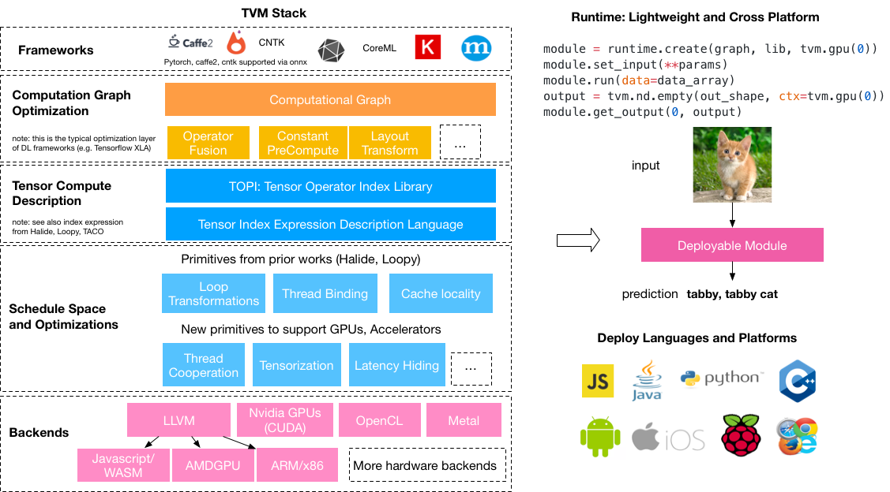
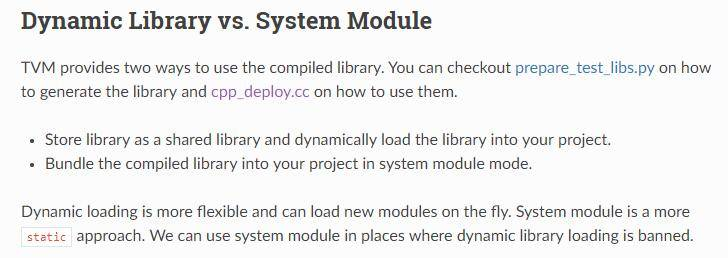

# 利用TVM完成C++端的部署

 2020年12月16日

[参考-1](https://oldpan.me/archives/the-first-step-towards-tvm-2)|[参考-2](http://whitelok.github.io/2019/06/25/tvm-tutorials-lesson-1/)


----


## 1. 前言

在上一篇文章中[一步一步解读神经网络编译器TVM(一)——一个简单的例子](https://oldpan.me/archives/the-first-step-towards-tvm-1)，我们简单介绍了什么是**TVM**以及如何利用**Relay IR**去编译网络权重然后并运行起来。





上述文章中的例子很简单，但是实际中我们更需要的是利用TVM去部署我们的应用么，最简单直接的就是在嵌入式系统中运行起我们的神经网络模型。例如树莓派。这才是最重要的是不是？所以嘛，在深入TVM之前还是要走一遍基本的实践流程的，也唯有实践流程才能让我们更好地理解TVM到底可以做什么。

所以嘛，在这篇文章中，主要介绍如果将自己的神经网络使用TVM编译，并且导出动态链接库文件，最后部署在树莓派端(PC端)，并且运行起来。

## 2. 环境搭建

环境搭建？有什么好讲的？

废话咯，你需要先把TVM的环境搭建出来才可以用啊，在上一篇文章中已经说过了，另外官方的安装教程最为详细，这里还是多建议看看官方的文档，很详细很具体重点把握的也很好。

但是还是要强调两点：

- 需要安装LLVM，因为这篇文章所讲的主要运行环境是CPU(树莓派的GPU暂时不用，内存有点小)，所以LLVM是必须的
- 安装交叉编译器:

### 2.1 Cross Compiler

交叉编译器是什么，就是我可以在PC平台上编译生成可以直接在树莓派上运行的可执行文件。而在TVM中，我们需要利用交叉编译器在PC端编译模型并且优化，然后生成适用于树莓派(arm构架)使用的动态链接库。

有这个动态链接库，我们就可以直接调用树莓派端的TVM运行时环境去调用这个动态链接库，从而执行神经网络的前向操作了。

那么怎么安装呢？这里我们需要安装叫做`/usr/bin/arm-linux-gnueabihf-g++`的交叉编译器，在Ubuntu系统中，我们直接`sudo apt-get install g++-arm-linux-gnueabihf`即可，注意名称不能错，我们需要的是hf(Hard-float)版本。

安装完后，执行`/usr/bin/arm-linux-gnueabihf-g++ -v`命令就可以看到输出信息:

```powershell
root@0e8554287189:~# /usr/bin/arm-linux-gnueabihf-g++ -v
Using built-in specs.
COLLECT_GCC=/usr/bin/arm-linux-gnueabihf-g++
COLLECT_LTO_WRAPPER=/usr/lib/gcc-cross/arm-linux-gnueabihf/7/lto-wrapper
Target: arm-linux-gnueabihf
Configured with: ../src/configure -v --with-pkgversion='Ubuntu/Linaro 7.5.0-3ubuntu1~18.04' --with-bugurl=file:///usr/share/doc/gcc-7/README.Bugs --enable-languages=c,ada,c++,go,d,fortran,objc,obj-c++ --prefix=/usr --with-gcc-major-version-only --program-suffix=-7 --enable-shared --enable-linker-build-id --libexecdir=/usr/lib --without-included-gettext --enable-threads=posix --libdir=/usr/lib --enable-nls --with-sysroot=/ --enable-clocale=gnu --enable-libstdcxx-debug --enable-libstdcxx-time=yes --with-default-libstdcxx-abi=new --enable-gnu-unique-object --disable-libitm --disable-libquadmath --disable-libquadmath-support --enable-plugin --enable-default-pie --with-system-zlib --with-target-system-zlib --enable-multiarch --enable-multilib --disable-sjlj-exceptions --with-arch=armv7-a --with-fpu=vfpv3-d16 --with-float=hard --with-mode=thumb --disable-werror --enable-multilib --enable-checking=release --build=x86_64-linux-gnu --host=x86_64-linux-gnu --target=arm-linux-gnueabihf --program-prefix=arm-linux-gnueabihf- --includedir=/usr/arm-linux-gnueabihf/include
Thread model: posix
gcc version 7.5.0 (Ubuntu/Linaro 7.5.0-3ubuntu1~18.04)
```

### 2.2 树莓派环境搭建

因为我们是在PC端利用TVM编译神经网络的，所以在树莓派端我们只需要编译TVM的运行时环境即可(TVM可以分为两个部分，一部分为编译时，另一个为运行时，两者可以拆开)。

这里附上官方的命令，注意树莓派端也需要安装llvm，树莓派端的llvm可以在llvm官方找到已经编译好的压缩包，解压后添加环境变量即可：

```powershell
git clone --recursive https://github.com/dmlc/tvm
cd tvm
mkdir build
cp cmake/config.cmake build   # 这里修改config.cmake使其支持llvm
cd build
cmake ..
make runtime
```

在树莓派上编译TVM的运行时并不需要花很久的时间。

## 3. 完成部署

环境搭建好之后，就让我们开始吧~

首先我们依然**需要一个自己的测试模型**，在这里我使用之前训练好的，然后利用Pytorch导出ONNX模型出来。具体的导出步骤可以看我之前的这两篇文章，下述两篇文章中使用的模型与本篇文章使用的是同一个模型。


### 3.1 测试模型

拿到模型后，我们首先测试模型是否可以正确工作，同上一篇介绍TVM的文章类似，我们利用TVM的PYTHON前端去读取我们的.onnx模型，然后将其编译并运行，最后利用测试图像测试其是否可以正确工作，其中核心代码如下：

```python
# onnx to tvm , or test onnx model
import onnx
import time
import tvm
import numpy as np
import tvm.relay as relay
from PIL import Image

onnx_model = onnx.load('./mobilenetv2.onnx')  # 导入模型

mean = [123., 117., 104.]                   # 在ImageNet上训练数据集的mean和std
std = [58.395, 57.12, 57.375]


def transform_image(image):                # 定义转化函数，将PIL格式的图像转化为格式维度的numpy格式数组
    image = image - np.array(mean)
    image /= np.array(std)
    image = np.array(image).transpose((2, 0, 1))
    image = image[np.newaxis, :].astype('float32')
    return image

img = Image.open('./plane.png').resize((224, 224)) # 这里我们将图像resize为特定大小
x = transform_image(img)
# saving demo image, 存储个二进制文件
x.astype("float32").tofile("./plane.bin")
x.shape

target = 'llvm'

input_name = "input.1"  # 注意这里为之前导出onnx模型中的模型的输入id，这里为0
shape_dict = {input_name: x.shape}
# 利用Relay中的onnx前端读取我们导出的onnx模型
sym, params = relay.frontend.from_onnx(onnx_model, shape_dict)


with relay.build_config(opt_level=3):
    intrp = relay.build_module.create_executor('graph', sym, tvm.cpu(0), target)
# with tvm.transform.PassContext(opt_level=3):
#      intrp = relay.build_module.create_executor("graph", sym, tvm.cpu(0), target)

        
dtype = 'float32'
# func = intrp.evaluate(sym)
func = intrp.evaluate()

output = func(tvm.nd.array(x.astype(dtype)), **params).asnumpy()
print(output.argmax())
```

我这个模型输出的结果为三个手势的输出值大小(顺序分别为布、剪刀、石头)，上述的代码打印出来的值为0，意味着可以正确识别`paper.jpg`输入的图像。说明这个转化过程是没有问题的。

### 3.2 导出动态链接库

上面这个步骤只是将.onnx模型利用TVM读取并且预测出来，如果我们需要部署的话我们就需要导出整个模型的动态链接库，至于为什么是动态链接库，其实TVM是有多种的导出模式的(也可以导出静态库)，但是这里不细说了：



总之我们的目标就是导出**so动态链接库**，这个链接库中包括了我们神经网络所需要的一切推断功能。

那么怎么导出呢？其实官方已经有很详细的[导出说明](https://docs.tvm.ai/tutorials/frontend/deploy_model_on_rasp.html#tutorial-deploy-model-on-rasp)。我这里不进行赘述了，仅仅展示核心的代码加以注释即可。

请看以下的代码：

```python
import onnx
import time
import tvm
import numpy as np
import tvm.relay as relay
from PIL import Image

#开始同样是读取.onnx模型
onnx_model = onnx.load('./mobilenetv2.onnx')  # 导入模型

# 以下的图片读取仅仅是为了测试
mean = [123., 117., 104.]                   # 在ImageNet上训练数据集的mean和std
std = [58.395, 57.12, 57.375]

def transform_image(image):                # 定义转化函数，将PIL格式的图像转化为格式维度的numpy格式数组
    image = image - np.array(mean)
    image /= np.array(std)
    image = np.array(image).transpose((2, 0, 1))
    image = image[np.newaxis, :].astype('float32')
    return image

img = Image.open('./plane.png').resize((224, 224)) # 这里我们将图像resize为特定大小
x = transform_image(img)


# 这里首先在PC的CPU上进行测试 所以使用LLVM进行导出
target = tvm.target.create('llvm') # x86
# target = tvm.target.arm_cpu("rasp3b") # raspi
# target = 'llvm'


input_name = "input.1"  # 注意这里为之前导出onnx模型中的模型的输入id，这里为0
shape_dict = {input_name: x.shape}
# 利用Relay中的onnx前端读取我们导出的onnx模型
sym, params = relay.frontend.from_onnx(onnx_model, shape_dict)

# 这里利用TVM构建出优化后模型的信息
with relay.build_config(opt_level=2):
    graph, lib, params = relay.build_module.build(sym, target, params=params)
    

    
dtype = 'float32'
from tvm.contrib import graph_runtime

# 下面的函数导出我们需要的动态链接库 地址可以自己定义
print("Output model files")
libpath = "./mobilenet.so"
lib.export_library(libpath)

# 下面的函数导出我们神经网络的结构，使用json文件保存
graph_json_path = "./mobilenet.json"
with open(graph_json_path, 'w') as fo:
    fo.write(graph)

# 下面的函数中我们导出神经网络模型的权重参数
param_path = "./mobilenet.params"
with open(param_path, 'wb') as fo:
    fo.write(relay.save_param_dict(params))
# -------------至此导出模型阶段已经结束--------


# 接下来我们加载导出的模型去测试导出的模型是否可以正常工作
loaded_json = open(graph_json_path).read()
loaded_lib = tvm.runtime.load_module(libpath)
loaded_params = bytearray(open(param_path, "rb").read())

# 这里执行的平台为CPU
ctx = tvm.cpu()

module = graph_runtime.create(loaded_json, loaded_lib, ctx)
module.load_params(loaded_params)
module.set_input("input.1", x)
module.run()
out_deploy = module.get_output(0).asnumpy()
print(type(out_deploy))
print(out_deploy.argmax())
# print(out_deploy)
```

上述的代码输出404，因为输入的图像是`plane.jpg`,所以输出的三个数字第一个数字最大，没有毛病。

执行完代码之后我们就可以得到需要的三个文件

- [mobilenet.so](http://mobilenet.so/)
- mobilenet.json
- mobilenet.params

得到三个文件之后，接下来我们利用TVM的C++端读取并运行起来。

### 在PC端利用TVM部署C++模型

如何利用TVM的C++端去部署，官方也有比较详细的[文档](https://docs.tvm.ai/deploy/nnvm.html)，这里我们利用TVM和OpenCV读取一张图片，并且使用之前导出的动态链接库去运行神经网络对这张图片进行推断。

我们需要的头文件为：

```cpp
#include <cstdio>
#include <dlpack/dlpack.h>
#include <opencv4/opencv2/opencv.hpp>
#include <tvm/runtime/module.h>
#include <tvm/runtime/registry.h>
#include <tvm/runtime/packed_func.h>
#include <fstream>
```

其实这里我们只需要TVM的运行时，另外dlpack是存放张量的一个结构。其中OpenCV用于读取图片，而`fstream`则用于读取json和参数信息：

```cpp
tvm::runtime::Module mod_dylib =
    tvm::runtime::Module::LoadFromFile("../files/mobilenet.so");

std::ifstream json_in("../files/mobilenet.json", std::ios::in);
std::string json_data((std::istreambuf_iterator<char>(json_in)), std::istreambuf_iterator<char>());
json_in.close();

// parameters in binary
std::ifstream params_in("../files/mobilenet.params", std::ios::binary);
std::string params_data((std::istreambuf_iterator<char>(params_in)), std::istreambuf_iterator<char>());
params_in.close();

TVMByteArray params_arr;
params_arr.data = params_data.c_str();
params_arr.size = params_data.length();
```

在读取完信息之后，我们要利用之前读取的信息，构建TVM中的运行图(Graph_runtime)：

```cpp
int dtype_code = kDLFloat;
int dtype_bits = 32;
int dtype_lanes = 1;
int device_type = kDLCPU;
int device_id = 0;

tvm::runtime::Module mod = (*tvm::runtime::Registry::Get("tvm.graph_runtime.create"))
        (json_data, mod_dylib, device_type, device_id);
```

然后利用TVM中函数建立一个输入的张量类型并且为它分配空间：

```cpp
DLTensor *x;
int in_ndim = 4;
int64_t in_shape[4] = {1, 3, 128, 128};
TVMArrayAlloc(in_shape, in_ndim, dtype_code, dtype_bits, dtype_lanes, device_type, device_id, &x);
```

其中`DLTensor`是个灵活的结构，可以包容各种类型的张量，而在创建了这个张量后，我们需要将OpenCV中读取的图像信息传入到这个张量结构中：

```cpp
// 这里依然读取了papar.png这张图
image = cv::imread("/home/prototype/CLionProjects/tvm-cpp/data/paper.png");

cv::cvtColor(image, frame, cv::COLOR_BGR2RGB);
cv::resize(frame, input,  cv::Size(128,128));

float data[128 * 128 * 3];
// 在这个函数中 将OpenCV中的图像数据转化为CHW的形式 
Mat_to_CHW(data, input);
```

需要注意的是，因为OpenCV中的图像数据的保存顺序是(128,128,3)，所以这里我们需要将其调整过来，其中`Mat_to_CHW`函数的具体内容是:

```cpp
void Mat_to_CHW(float *data, cv::Mat &frame)
{
    assert(data && !frame.empty());
    unsigned int volChl = 128 * 128;

    for(int c = 0; c < 3; ++c)
    {
        for (unsigned j = 0; j < volChl; ++j)
            data[c*volChl + j] = static_cast<float>(float(frame.data[j * 3 + c]) / 255.0);
    }

}
```

当然别忘了除以255.0因为在Pytorch中所有的权重信息的范围都是0-1。

在将OpenCV中的图像数据转化后，我们将转化后的图像数据拷贝到之前的张量类型中:

```cpp
// x为之前的张量类型 data为之前开辟的浮点型空间
memcpy(x->data, &data, 3 * 128 * 128 * sizeof(float));
```

然后我们设置运行图的输入(x)和输出(y):

```cpp
// get the function from the module(set input data)
tvm::runtime::PackedFunc set_input = mod.GetFunction("set_input");
set_input("0", x);

// get the function from the module(load patameters)
tvm::runtime::PackedFunc load_params = mod.GetFunction("load_params");
load_params(params_arr);

DLTensor* y;
int out_ndim = 2;
int64_t out_shape[2] = {1, 3,};
TVMArrayAlloc(out_shape, out_ndim, dtype_code, dtype_bits, dtype_lanes, device_type, device_id, &y);

// get the function from the module(run it)
tvm::runtime::PackedFunc run = mod.GetFunction("run");

// get the function from the module(get output data)
tvm::runtime::PackedFunc get_output = mod.GetFunction("get_output");
```

此刻我们就可以运行了：

```cpp
run();
get_output(0, y);

// 将输出的信息打印出来
auto result = static_cast<float*>(y->data);
for (int i = 0; i < 3; i++)
    cout<<result[i]<<endl;
```

最后的输出信息是

```powershell
13.8204
-7.31387
-6.8253
```

可以看到，成功识别出了布这张图片，到底为止在C++端的部署就完毕了。

### 在树莓派上的部署

在树莓派上的部署其实也是很简单的，与上述步骤中不同的地方是我们需要设置`target`为树莓派专用:

```python
target = tvm.target.arm_cpu('rasp3b')
```

我们点进去其实可以发现`rasp3b`对应着`-target=armv7l-linux-gnueabihf`：

```python
trans_table = {
    "pixel2":    ["-model=snapdragon835", "-target=arm64-linux-android -mattr=+neon"],
    "mate10":    ["-model=kirin970", "-target=arm64-linux-android -mattr=+neon"],
    "mate10pro": ["-model=kirin970", "-target=arm64-linux-android -mattr=+neon"],
    "p20":       ["-model=kirin970", "-target=arm64-linux-android -mattr=+neon"],
    "p20pro":    ["-model=kirin970", "-target=arm64-linux-android -mattr=+neon"],
    "rasp3b":    ["-model=bcm2837", "-target=armv7l-linux-gnueabihf -mattr=+neon"],
    "rk3399":    ["-model=rk3399", "-target=aarch64-linux-gnu -mattr=+neon"],
    "pynq":      ["-model=pynq", "-target=armv7a-linux-eabi -mattr=+neon"],
    "ultra96":   ["-model=ultra96", "-target=aarch64-linux-gnu -mattr=+neon"],
}
```

还有一点改动的是，我们在导出.so的时候需要加入`cc="/usr/bin/arm-linux-gnueabihf-g++"`，此时的`/usr/bin/arm-linux-gnueabihf-g++`为之前下载的交叉编译器。

```python
path_lib = '../tvm/deploy_lib.so'
lib.export_library(path_lib, cc="/usr/bin/arm-linux-gnueabihf-g++")
```

这时我们就可以导出来树莓派需要的几个文件，之后我们将这几个文件移到树莓派中，随后利用上面说到的C++部署代码去部署就可以了。

## 4. 大家关心的问题

看到这里想必大家应该还有很多疑惑，限于篇幅(写的有点累呀)，这里讲几个比较重点的东西：

### 速度

这里可以毫不犹豫地说，对于我这个模型来说，速度提升很明显。在PC端部署中，使用TVM部署的手势检测模型的运行速度是libtorch中的5倍左右，精度还没有测试，但是在我用摄像头进行演示过程中并没有发现明显的区别。当然还需要进一步的测试，就不在这里多说了。

哦对了，在树莓派中，这个模型还没有达到实时(53ms)，但是无论对TVM还是对我来说，依然还有很大的优化空间，实时只是时间关系。

### 层的支持程度

当然因为TVM还处于开发阶段，有一些层时不支持的，上文中的`mobilenetv2-128_S.onnx`模型一开始使用Relay IR前端读取的时候提示，TVM中没有`flatten`层的支持，而`mobilenetv2-128_S.onnx`中有一个flatten层，所以提示报错。

但是这个是问题吗？只要我们仔细看看TVM的源码，熟悉熟悉结构，就可以自己加层了，但其实flatten的操作函数在TVM中已经存在了，只是ONNX的前端接口没有展示出来，onnx前端展示的是`batch_flatten`这个函数，其实`batch_flatten`就是`flatten`的特殊版，于是简单修改源码，重新编译一下就可以成功读取自己的模型了。

# 5. 后记

限于时间关系，就暂时说到这里，之后会根据自己的时间发布一些TVM的文章，TVM相关的中文文章太少了，自己就干脆贡献一点吧。不过真的很感谢TVM的工作，真的很强~

