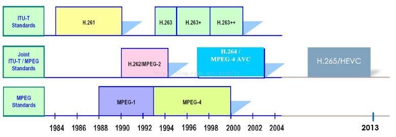
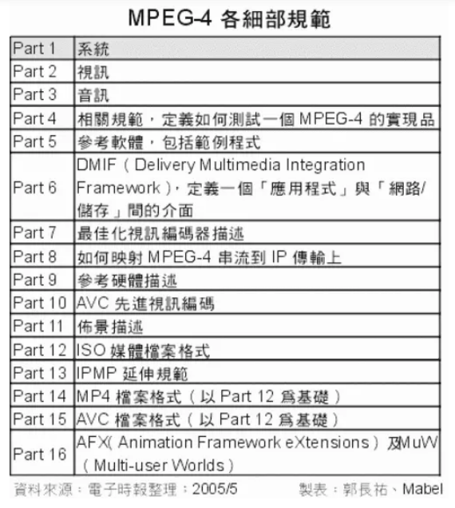

# 发展史
   
### 1、MPEG-4  
MPEG-4于1999年初正式成为国际标准。它是一个适用于低传输速率应用的方案。与MPEG1和MPEG2相比，MPEG4更加注重多媒体系统的交互性和灵活性。MPEG-4（同时也是ISO/IEC 14496）的制订并非只有动态视频的编解码而已，其中还包括诸多的环节与项目，真正与视频直接且密切相关的，其实就是MPEG-4 Part 2（也称为MPEG-4 Visual）的部分，其余还有用于传送时的整合架构规范、文件格式、软件规范、相关定义等。
  
### 2、目前主流占优势的H.264  
H.264 是由ITU-T 的VCEG（视频编码专家组）和ISO/IEC 的MPEG（活动图像编码专家组）联合组建的联合视频组（JVT：joint video team）提出的一个新的数字视频编码标准，它既是ITU-T 的H.264，又是ISO/IEC 的MPEG-4 的第10 部分。而国内业界通常所说的MPEG-4 是MPEG-4 的第2 部分。即：H.264=MPEG-4（第十部分，也叫ISO/IEC 14496-10）=MPEG-4 AVC.因此，**不论是MPEG-4 AVC、MPEG-4 Part 10，还是ISO/IEC 14496-10，都是指H.264**。H.264也是MPEG-4的一部分。H.264标准从1998 年1 月份开始草案征集，到2003 年7 月，整套H.264 （ISO/IEC 14496-10）规范定稿。2005年1 月，MPEG 组织正式发布了H.264 验证报告，从各个方面论证了H.264 的可用性以及各种工具集的效果，从标准的角度，印证H.264 的成熟性。  
  
H.264关于该技术的视频编码方案，现在正式命名为ITU-T H.264或“JVT/AVC草案”。H.264/MPEG-4 AVC作为MPEG-4标准的扩展（MPEG-4 Part 10），充分利用了现有MPEG-4标准中的各个环节。H.264/MPEG-4 AVC就在现有MPEG-4 Advanced Simple Profile的基础之上进行发展的。它即保留了以往压缩技术的优点和精华又具有其他压缩技术无法比拟的许多优点。
### 3、既生瑜何生亮？  
其实通过上面的讨论我们也看到了H.264跟MPEG-4（part2）都是为了互联网而生，而且有许多共同的特点，那么既生MPEG-4？何生 H.264？有了MPEG-4（第二部分）为什么还要H.264，岂不是多此一举？两者到底有多大的区别呢？为何需要再订制出MPEG-4 Part 10呢？直接沿用MPEG-4 Part 2难道不行？  
  
虽然MPEG-4已针对Internet传送而设计，提供比MPEG-2更高的视频压缩效率，更灵活与弹性变化的播放取样率，但就视频会议而言总希望有更进一步的压缩，所以才需要出现了H.264。  
  
首先就是上文提到的H.264对于带宽的要求低，在带宽比较吃紧的情况下一样可以正常的工作，只相当于MPEG-4第二部分的2/3，不要小看这些，这些就可以决定你看视频是否流畅。更具体地说，H.264力求在40kbps～300kbps的有限带宽下尽可能得到流畅、清晰的表现。那么到底压缩了更小的H.264能够有更高的压缩率，播放效果是不是大打折扣呢？播放效果与MPEG-2、MPEG-4近乎相同嘛？是的，其实视频的质量我们看不出多大的差别，之所以出现这种现象答案在于H.264采用了更复杂的编码算法，当然对于解码也提出了更高的要求。以前之所以未采用更复杂的算法，是考虑到解码（播放）端的运算能力不足，就会导致播放不流畅，失去视频娱乐观赏的意义，但如今不同，无论桌面电脑、移动终端的性能都突飞猛进，即便运用更复杂的压缩编码都可以实时解码、流畅地播放，这正是MEPG-4、H.264能够流行的一项先决条件。但是其实这些都不是关键，目前的宽带已经完全满足了mpeg-4第二部分的使用，但是为什么还要H.264呢？就是因为授权的问题。关于这个问 题，H.264不仅压缩算法比以往的MPEG-4更优异，带宽耗用更低，还有一项最诱人的特点：授权费用比较合理，因为H.264晚于MPEG-4问世， 且两者定位接近，既然如此，H.264只好在授权费上降低定位，期盼以较宽厚的授权方式争取被采用，而这正是对了运营商的胃口，当初许多运营商对 MPEG-4的授权深表反感，之后也都热烈拥护H.264。
### 4、巨头微软力推的VC-1

VC-1是软件巨头微软力推的一种视频编码的格式，但是它的发展并不是很顺利，可以说是历经坎坷。直到2006年初，活动图像和电视工程师协会(SMPTE)才正式颁布了由微软提出并开发的VC-1视频编码标准。
### 5、总结  
**目前的视频发展中，可以说老的视频格式并没有死去，而是正当年。而新的视频由于适应了网络时代的发展，前途光明**。  目前的MPEG-2的视频在蓝光时代一样是得到了重用，MPEG-2不是MPEG -1的简单升级，MPEG-2在系统和传送方面作了更加详细的规定和进一步的完善。MPEG-2特别适用于广播级的数字电视的编码和传送，被认定为SDTV和HDTV的编码标准。DVD影碟就是采用MPEG-2压缩标准。而H.264虽然收费问题仍让人不满，但是由于普及的面大，加上其算法上面的领先，在短时间内不会让别人追上。而MPEG-4{2}由于目前网络速度的发展，加上费用的下降甚至于以后的费用可能为零来竞争，也很有发展前途。而google与微软自己力推的WMV以及WebM都有着巨头强大的实力作为后盾。特别是WMV这几年已经在日常中比较常见了，而WebM由于开源加上免费的优点，再加上其最大的视频网站YOutobe作为后盾，加上许多厂家的力捧，很有希望在以后后来居上。
