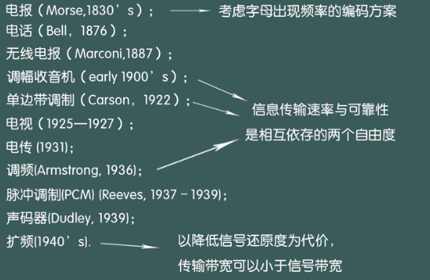

# 绪论
## 一、信息的概念
### 1、信息是什么？
* 信息就是人为赋予事物的意义并且这种意义能被人为解读。   
* 信息、能量和物质的关系？
## 二、信息论产生背景
### 1、人类通信技术的发展
* 古代：人类通信技术的发展（文字等）
* 近现代：1952年前的通信技术
    * 19世纪初，Morse电码发明
    * 1839年，英国开始商业运营
    * 电缆的普及和电话的诞生（单对单，问题：链路复杂，电话线太多）
    * 交换、复用技术的产生
* 近代：近代技术的发展及其影响
    * 1927年，NBC开播两套无线节目
    * 1939年，电视广播开始
    * 1946年，宾夕法尼亚第一台电子计算机
    * 1957年，苏联发射人造卫星Sputnik
    * 1969年，ARPANET开始运营（互联网的前身）
    * 1977年，旅行者从木星发回信号
    * 1981年，蜂窝电话商用/手机（沙特阿拉伯）
    * 1991年，World wide web发明
### 2、信息论诞生的技术准备
* 电报（Morse，1830‘s）
* 电话（Bell，1876）
* 无线电报（Marconi，1887）
* 调幅收音机（early 1900’s）
* 单边带调制（Carsoon， 1922）
* 电视（1925-1927）
* 电传（1931）
* 调频（Armstrong，1936）
* 脉冲调制（PCM）（Reeves，1937-1939）
* 声码器（Dudley，1939）
* 扩频（1940‘s）
    
### 3、信息论的基础性贡献
在1948年前，人们对于通信系统的工作方式有着模糊的、经验主义的认识   
* 直观的感受：“传输速率越高、错误率越高”   
#### 信息论给出了信息量的定义

#### 信息论给出了通信系统的模型
### 4、香农与信息论
