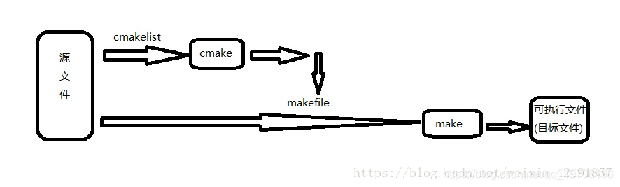

# GCC、G++、Make、CMake

⌚️:2020年11月30日

📚参考

- [原文地址-1](https://zhuanlan.zhihu.com/p/100050970)
- [原文地址-2](https://zhuanlan.zhihu.com/p/111585277)

- [WHAT IS THE DIFFERENCE BETWEEN GCC AND G++](https://link.zhihu.com/?target=https%3A//links.jianshu.com/go%3Fto%3Dhttps%3A%2F%2Fwww.freelancinggig.com%2Fblog%2F2017%2F11%2F10%2Fdifference-gcc-g%2F)

---

## 一、 编译器GCC与G++的区别

> GCC:GNU Compiler Collection(GUN 编译器集合)，它可以编译C、C++、JAV、Fortran、Pascal、Object-C等语言。
>
> gcc是GCC中的GUN C Compiler（C 编译器）
>
> g++是GCC中的GUN C++ Compiler（C++编译器）

由于编译器是可以更换的，所以gcc不仅仅可以编译C文件，所以，更准确的说法是：gcc调用了C compiler，而g++调用了C++ compiler

### **1. GNU Compiler Collection**(**GCC**)

GNU编译器集合(GCC)是用于编程的编译器集合，如c++、C、Objective-C、Java和Fortran。GCC版本是通过一个通过命令行操作的自由软件基础来实现的。GCC开发是由Richard Stallman作为GNU项目的一部分进行的。

对于每一种编程语言，GCC 包含其独立的程序。在GCC中，所有语言都有一个共同的内部结构，该结构由一个特定于语言的前端组成，该前端解析程序并生成一个抽象语法树和后端。

GCC也包含了ANSI C编译器里的所有特性。这个编译器允许多个级别的源代码错误检查，这些检查通常由其他工具提供。它还对结果对象代码和调试信息执行许多类型的优化。

GCC是许多操作系统的主要编译器。由于GCC是自由可获得的软件，因此许多的软件也是基于GCC。上述的这类软件主要包括用C创建并通过GCC编译的软件。

在众多的国家中，GCC由一个多样化的团体来维护，而变化则由一个委员会来管理。这一原则为大家提供了优秀的编译器，可以在某些体系结构和各种环境下工作。GCC还增加了更多的语言、优化、目标，并提高了调试周期的速度。

GCC有各种各样的体系结构指令集，广泛用作开发自由软件和专有软件的工具。它也可用于嵌入式系统，并适用于各种平台。

GCC有许多拓展GCC编译器的插件。通过插件，开发人员可以在Gimple表示层上添加、替换或删除中间端传递操作系统。GCC的Python插件从编译器内部调用任意的Python脚本。MELT插件允许高级Lisp语言扩展GCC。

对于C语言的编译，GCC编译器使用以下命令:

```bash
gcc program.c -o targetFile
```

这里program.c是C源文件名，其中 targetFile 是执行的目标文件 (二进制文件)。


### **2. GNU C++ Compiler(G++)**

GNU提供了C++的优化编译器，也就是众所周知的G++。它可以在各种处理器上运行，大家可以在Emacs下找到完整的文档。与GCC一样，G++包含独立的程序。通过这个编译器，所有的语言都使用通用的内部结构，该结构由特定于语言的前端组成，前端解析程序并创建抽象语法树和后端。

G++主要用于编译C++编程语言。它是不同操作系统(如Linux、BSD和MAC OS x)中的主编译器。它是免费提供的软件，支持许多用c++编程语言创建并使用g++编译的自由软件。

如果您想编译C++文件，那么您将需要使用包含C++代码的文件名的G++编译器。如果您的文件不包含任何错误，那么它将成为可执行文件。

g++是强大的编译器，为您提供了许多可能的选项。G++浏览文档部分，并从命令提示符中查看您的g++版本附带的文档

### 3. gcc和g++的主要区别

1. 对于 *.c和*.cpp文件，gcc分别当做c和cpp文件编译（c和cpp的语法强度是不一样的）
2. 对于 *.c和*.cpp文件，g++则统一当做cpp文件编译
3. 使用g++编译文件时，**g++会自动链接标准库STL，而gcc不会自动链接STL**
4. gcc在编译C文件时，可使用的预定义宏是比较少的
5. gcc在编译cpp文件时/g++在编译c文件和cpp文件时（这时候gcc和g++调用的都是cpp文件的编译器），会加入一些额外的宏。
6. 在用gcc编译c++文件时，为了能够使用STL，需要加参数 –lstdc++ ，但这并不代表 gcc –lstdc++ 和 g++等价，它们的区别不仅仅是这个。

## 二、 GCC、Make、CMake、Makefile、CMakelists

简而言之，GCC是一个编译套件，我们可以通过gcc/g++来编译C/C++的目标项目，但是当一个项目比较复杂的时候，直接编译就会很麻烦，因此就出现了makefile，makefile就是包含一堆编译命令的文件，使用Make工具就可以读取并执行Makefile文件中的编译指令，从而快速进行项目编译，提升工作效率，但是makefile又需要我们自己编写，项目小还好说，项目庞大的时候，我们需要去每个文件夹下编写不同的Makefile，工作量实在大。因此，又出现了CMakelists，CMakelists可以通过更简单的写法来生成对应的Makefile文件，然后通过CMake工具“读取”并执行CMakelists.txt文件中的语句，来生成对应的Makefile。然后我们就可以通过Make工具来“执行”Makefile了。

相当于现在我们只要编写CMakelists.txt，就会自动生成Makefile文件。不同平台的Makefile文件不一样，通过CMake，达到一个可以快速跨平台编译的效果。



### 1. gcc

gcc是GNU Compiler Collection（就是GNU编译器套件），也可以简单认为是编译器，它可以编译很多种编程语言（括C、C++、Objective-C、Fortran、Java等等）。

当你的程序只有一个源文件时，直接就可以用gcc命令编译它。但是当你的程序包含很多个源文件时，用gcc命令逐个去编译时，你就很容易混乱而且工作量大，**所以出现了make工具**。

### 2. make

make工具可以看成是一个智能的批处理工具，它本身并没有编译和链接的功能，而是用类似于批处理的方式—通过调用makefile文件中用户指定的命令来进行编译和链接的。

makefile是什么？简单的说就像一首歌的乐谱，make工具就像指挥家，指挥家根据乐谱指挥整个乐团怎么样演奏，make工具就根据makefile中的命令进行编译和链接的。

makefile命令中就包含了调用gcc（也可以是别的编译器）去编译某个源文件的命令。

makefile在一些简单的工程完全可以人工手下，但是当工程非常大的时候，手写makefile也是非常麻烦的，如果换了个平台makefile又要重新修改。**这时候就出现了Cmake这个工具**，

### 3. cmake

cmake就可以更加简单的生成makefile文件给上面那个make用。当然cmake还有其他功能，就是可以跨平台生成对应平台能用的makefile，你不用再自己去修改了。

可是cmake根据什么生成makefile呢？它又要根据一个叫CMakeLists.txt文件（学名：组态档）去生成makefile。

到最后CMakeLists.txt文件谁写啊？亲，是你自己手写的。

当然如果你用IDE，类似VS这些一般它都能帮你弄好了，你只需要按一下那个三角形

