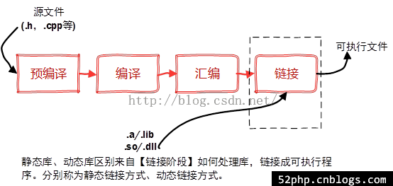
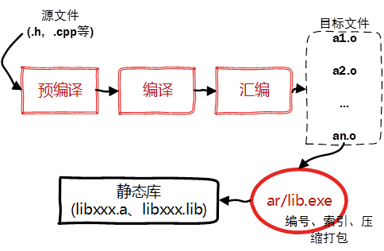
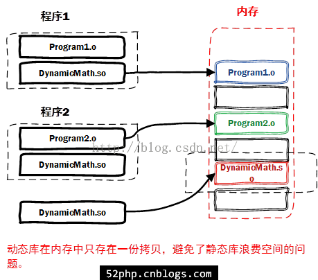

# C++静态库与动态库

⌚️:2020年11月30日

📚参考

- [原文1](https://juejin.cn/post/6844904002438561805) 
- [2](https://www.cnblogs.com/52php/p/5681711.html)
- [linux和windows如何添加静态和动态库](https://www.runoob.com/w3cnote/cpp-static-library-and-dynamic-library.html)

---


在日常开发中，其实大部分时间我们都会和第三方库或系统库打交道。在 Android 开发音视频开发领域，一般会用到 FFmepg、OpenCV、OpenGL 等等开源库, 我们一般都会编译成动态库共我们程序使用。对于类 unix 系统，静态库为 .a， 动态库为 .so。而 windows 系统静态库为 .lib， 动态库为.dll。

平时我们写程序都必须 include 很多头文件，因为可以避免重复造轮子，软件大厦可不是单靠一个人就能完成的。但是你是否知道引用的那些头文件中的函数是怎么被执行的呢？这就要牵扯到链接库了！库有两种，一种是 静态链接库，一种是 动态链接库，不管是哪一种库，要使用它们，都要在程序中包含相应的 include 头文件。我们先来回顾一下程序编译的过程。如下图：





我们结合gcc指令来看一下每个阶段生成的文件：

```
gcc -c helloWorld.c
```

生成一个helloWorld.o文件，该文件是将源文件编译成的汇编文件，在链接之前，该文件不是可执行文件。而

```
gcc -o helloWorld helloWorld.c
```

生成的是一个helloWorld的执行文件，格式为ELF（与windows不一样）。该文件为链接后的可执行文件。

## 1. 静态链接库

回顾程序编译的四个步骤：

> 预编译 -> 编译 -> 汇编 -> 链接

之所以成为【静态库】，是因为在链接阶段，会将汇编生成的目标文件.o与引用到的库一起链接打包到可执行文件中。因此对应的链接方式称为静态链接。

试想一下，静态库与汇编生成的目标文件一起链接为可执行文件，那么静态库必定跟.o文件格式相似。其实一个静态库可以简单看成是**一组目标文件（****.o/.obj****文件）的集合**，即很多目标文件经过压缩打包后形成的一个文件。静态库特点总结：

\- 静态库对函数库的链接是放在编译时期完成的。

\- 程序在运行时与函数库再无瓜葛，移植方便。

\- 浪费空间和资源，因为所有相关的目标文件与牵涉到的函数库被链接合成一个可执行文件。


什么是静态链接呢？即在链接阶段，将源文件中用到的库函数与汇编生成的目标文件.o合并生成可执行文件。该可执行文件可能会比较大。这种链接方式的好处是：方便程序移植，因为可执行程序与库函数再无关系，放在如何环境当中都可以执行。

缺点是：文件太大，一个全静态方式生成的简单print文件都有857K。而动态链接生成的一样的可执行文件却只要8.４Ｋ。

文件内容很简单，就是一个printf("hello world!\n");

因为包含库文件stdio，所以静态编译出的文件很大。如果你想尝试的话，可以这样编译：

```
gcc -static -o print print.c
```

在linux中，静态库为lib*.a，动态库为lib*.so。




下面我们来写一个库文件，然后生成一个静态库，然后尝试着调用一下它。一个简单的add函数，头文件为

```
root@node01:~/test/link/addlib# ls
add.cpp  add.h
```


`root@node01:~/test/link/addlib# cat add.h `

```c
#ifdef _ADD_H
#define _ADD_H

#include<iostream>

int add(int a, int b);

#endif
```


`root@node01:~/test/link/addlib# cat add.cpp `

```c
#include "add.h"

int add(int a, int b){
	return a+b;
}
```


 `root@node01:~/test/link/addlib# g++ -c add.cpp `

```
root@node01:~/test/link/addlib# ls
add.cpp  add.h  add.o
```


然后用ar命令进一步生成库libadd.a：

`ar -crv libadd.a  add.o`

这样就生成了一个静态链接库libadd.a。

```
root@node01:~/test/link/addlib# ar -crv libadd.a  add.o
a - add.o
root@node01:~/test/link/addlib# ls
add.cpp  add.h  add.o  libadd.a
```


下面我们来写一个测试文件：

`test.cpp`

```
#include <iostream>
#include "./addlib/add.h"
using namespace std;
 
int main()
{
    int number1 = 10;
    int number2 = 90;
    cout << "the result is " << add(number1, number2) << endl;
    return 0;
}
```

```
root@node01:~/test/link# ls
addlib  test.cpp
root@node01:~/test/link/addlib# ls
add.cpp  add.h  add.o  libadd.a

```

因为我的目录结构是add.cpp, addlib（文件夹），在addlib中是头文件和静态库，所以include用相对路径找到头文件add.h。

下面我们编译一下该文件：

```
g++ -o test test.cpp -L./addlib -ladd
```

－Ｌ是指定加载库文件的路径

－ｌ是指定加载的库文件。


运行

```
root@node01:~/test/link# ./test 
the result is 100

```


## 2.动态链接库

使用动态库的原因，正式因为静态库很耗费内存空间，并且静态库更新简直是灾难，如果库源码发生变动，那么静态库将不得不重新生成。

动态库特点如下：

- 延迟加载一些库函数，既用到才加载
- 动态库可以同时被多个程序共享，节省内存

通过上面的介绍发现静态库，容易使用和理解，也达到了代码复用的目的，那为什么还需要动态库呢？

### 2.1.为什么还需要动态库？

为什么需要动态库，其实也是静态库的特点导致。

\- 空间浪费是静态库的一个问题。


\- 另一个问题是静态库对程序的更新、部署和发布页会带来麻烦。如果静态库liba.lib更新了，所以使用它的应用程序都需要重新编译、发布给用户（对于玩家来说，可能是一个很小的改动，却导致整个程序重新下载，**全量更新**）。

动态库在程序编译时并不会被连接到目标代码中，而是在程序运行是才被载入。**不同的应用程序如果调用相同的库，那么在内存里只需要有一份该共享库的实例**，规避了空间浪费问题。动态库在程序运行是才被载入，也解决了静态库对程序的更新、部署和发布页会带来麻烦。用户只需要更新动态库即可，**增量更新**。



动态库特点总结：

\- 动态库把对一些库函数的链接载入推迟到程序运行的时期。

\- 可以实现进程之间的资源共享。（因此动态库也称为共享库）

\- 将一些程序升级变得简单。

\- 甚至可以真正做到链接载入完全由程序员在程序代码中控制（**显示调用**）。

Window与Linux执行文件格式不同，在创建动态库的时候有一些差异。

\- 在Windows系统下的执行文件格式是PE格式，动态库需要一个**DllMain函数做出初始化的入口，通常在导出函数的声明时需要有_declspec(dllexport)****关键字**。

\- Linux下gcc编译的执行文件默认是ELF格式，**不需要初始化入口，亦不需要函数做特别的声明，**编写比较方便。

与创建静态库不同的是，不需要打包工具（ar、lib.exe），直接使用编译器即可创建动态库。


### 2.2.Linux下创建与使用动态库

#### 2.2.1.linux动态库的命名规则

动态链接库的名字形式为 libxxx.so，前缀是lib，后缀名为".so"。

\- 针对于实际库文件，每个共享库都有个特殊的名字"soname"。在程序启动后，程序通过这个名字来告诉动态加载器该载入哪个共享库。

\- 在文件系统中，soname仅是一个链接到实际动态库的链接。对于动态库而言，每个库实际上都有另一个名字给编译器来用。它是一个指向实际库镜像文件的链接文件（lib+soname+.so）。

#### 2.2.2.创建动态库（.so）

\- 首先，生成目标文件，此时要加编译器选项-fpic

```
root@node01:~/test/dynamic_lib/addlib# ls
add.cpp  add.h
root@node01:~/test/dynamic_lib/addlib# g++ -fPIC -c add.cpp 
root@node01:~/test/dynamic_lib/addlib# ls
add.cpp  add.h  add.o
```

-fPIC 创建与地址无关的编译程序（pic，position independent code），是为了能够在多个应用程序间共享。

\- 然后，生成动态库，此时要加链接器选项-shared

```
root@node01:~/test/dynamic_lib/addlib# g++ -shared -o libadd.so add.o
root@node01:~/test/dynamic_lib/addlib# ls
add.cpp  add.h  add.o  libadd.so
```

-shared指定生成动态链接库。

其实上面两个步骤可以合并为一个命令：

```
g++ -fPIC -shared -o libadd.so add.cpp
```

#### 2.2.3.使用动态库

编写使用动态库的测试代码：

下面我们用动态链接的方式编译test.cpp，输入：

```
g++ -o test test.cpp -L./addlib -ladd
```

该命令和刚刚静态链接一样。注意-l后面接的是lib与so中间的库名称。

我们执行一下：

```
root@node01:~/test/dynamic_lib# ls
addlib  test  test.cpp
root@node01:~/test/dynamic_lib# ./test 
./test: error while loading shared libraries: libadd.so: cannot open shared object file: No such file or directory
```

发现不行，因为执行程序找不到libadd.so。

```
root@node01:~/test/dynamic_lib# ldd test
	linux-vdso.so.1 =>  (0x00007ffe2f9eb000)
	libadd.so => not found
	libstdc++.so.6 => /usr/lib/x86_64-linux-gnu/libstdc++.so.6 (0x00007f4255c9c000)
	libc.so.6 => /lib/x86_64-linux-gnu/libc.so.6 (0x00007f42558d2000)
	libm.so.6 => /lib/x86_64-linux-gnu/libm.so.6 (0x00007f42555c9000)
	/lib64/ld-linux-x86-64.so.2 (0x00007f425601e000)
	libgcc_s.so.1 => /lib/x86_64-linux-gnu/libgcc_s.so.1 (0x00007f42553b3000)

```

可以看到test执行程序用到的 libadd.so 没有找到。。。


原因是在 /etc/ld.so.conf 文件中设置了动态链接库了寻找路径。

那么，在执行的时候是如何定位共享库文件的呢？

1)    当系统加载可执行代码时候，能够知道其所依赖的库的名字，但是还需要知道绝对路径。此时就需要系统动态载入器(dynamic linker/loader)。

2)    对于elf格式的可执行程序，是由ld-linux.so*来完成的，它先后搜索elf文件的 DT_RPATH段—环境变量LD_LIBRARY_PATH—/etc/ld.so.cache文件列表—/lib/,/usr/lib 目录找到库文件后将其载入内存。

如何让系统能够找到它：

\- 如果安装在/lib或者/usr/lib下，那么ld默认能够找到，无需其他操作。

\- 如果安装在其他目录，需要将其添加到/etc/ld.so.cache文件中，步骤如下：

-- 编辑/etc/ld.so.conf文件，加入库文件所在目录的路径

-- 运行ldconfig ，该命令会重建/etc/ld.so.cache文件

##### 方法1

`root@node01:~/test/dynamic_lib# vim /etc/ld.so.conf`

```
include /etc/ld.so.conf.d/*.conf
/root/test/dynamic_lib/addlib                                       
```

可以看到有很多路径设置文件，在 ld.so.conf.d 中，我们在下面添加一下我们 libadd.so 的路径。

然后再执行一下 ldconfig 命令。

这下就可以成功执行test文件了。

```
root@node01:~/test/dynamic_lib# ldconfig
root@node01:~/test/dynamic_lib# ./test 
the result is 100
root@node01:~/test/dynamic_lib# 
```


注意一下，有人说为什么我程序中 extern int number;可以直接编译不需要什么静态链接库，动态链接库。那是因为你在链接时已经将number变量定义的目标文件.o和源文件进行了链接，如：gcc -o main main.o test.o。如果你只是单纯的用 main.o 进行链接，是生成不了可执行目标文件的，如：gcc -o main main.ｃ会报告未定义的number引用。

 

综上说述，静态和动态链接库的选择要视情况而定。一般比较推荐动态链接方式，因为可以很好的节约内存，而且方便以后的库文件升级。

##### 方法2

我们将创建的动态库复制到/usr/lib下面，然后运行测试程序。

```
root@node01:~/test/dynamic_lib# cp addlib/libadd.so /usr/lib
root@node01:~/test/dynamic_lib# ./test 
the result is 100
```


## 3.**有什么区别**

到这里我们大致了解了静态库和动态库的区别了，静态库被使用目标代码最终和可执行文件在一起（它只会有自己用到的），而动态库与它相反，它的目标代码在运行时或者加载时链接。正是由于这个区别，会导致下面所介绍的这些区别。

##### **可执行文件大小不一样**

从前面也可以观察到，静态链接的可执行文件要比动态链接的可执行文件要大得多，因为它将需要用到的代码从二进制文件中“拷贝”了一份，而动态库仅仅是复制了一些重定位和符号表信息。

##### **占用磁盘大小不一样**

如果有多个可执行文件，那么静态库中的同一个函数的代码就会被复制多份，而动态库只有一份，因此使用静态库占用的磁盘空间相对比动态库要大。

##### **扩展性与兼容性不一样**

如果静态库中某个函数的实现变了，那么可执行文件必须重新编译，而对于动态链接生成的可执行文件，只需要更新动态库本身即可，不需要重新编译可执行文件。正因如此，使用动态库的程序方便升级和部署。

##### **依赖不一样**

静态链接的可执行文件不需要依赖其他的内容即可运行，而动态链接的可执行文件必须依赖动态库的存在。所以如果你在安装一些软件的时候，提示某个动态库不存在的时候也就不奇怪了。

即便如此，系统中一班存在一些大量公用的库，所以使用动态库并不会有什么问题。

##### **复杂性不一样**

相对来讲，动态库的处理要比静态库要复杂，例如，如何在运行时确定地址？多个进程如何共享一个动态库？当然，作为调用者我们不需要关注。另外动态库版本的管理也是一项技术活。这也不在本文的讨论范围。

##### **加载速度不一样**

由于静态库在链接时就和可执行文件在一块了，而动态库在加载或者运行时才链接，因此，对于同样的程序，静态链接的要比动态链接加载更快。所以选择静态库还是动态库是空间和时间的考量。但是通常来说，牺牲这点性能来换取程序在空间上的节省和部署的灵活性时值得的。再加上**局部性原理**，牺牲的性能并不多。

##### **总结**

静态库和动态库具体是何如链接的已经超出了本文的介绍范围，本文仅简单介绍了一些静态库和动态库的区别，另外文中提到的在其他的linux系统，也指的是同样处理器架构的系统。但是了解这些基本信息，就能够帮助我们解决很多编译问题了。更多内容可自己阅读装载，链接方面的书籍。后面的文章也会介绍更多相关信息。

## 4. g++(gcc)编译选项


- -shared ：指定生成动态链接库。
- -static ：指定生成静态链接库。
- -fPIC ：表示编译为位置独立的代码，用于编译共享库。目标文件需要创建成位置无关码，念上就是在可执行程序装载它们的时候，它们可以放在可执行程序的内存里的任何地方。
- -L. ：表示要连接的库所在的目录。
- -l：指定链接时需要的动态库。编译器查找动态连接库时有隐含的命名规则，即在给出的名字前面加上lib，后面加上.a/.so来确定库的名称。
- -Wall ：生成所有警告信息。
- -ggdb ：此选项将尽可能的生成gdb的可以使用的调试信息。
- -g ：编译器在编译的时候产生调试信息。
- -c ：只激活预处理、编译和汇编,也就是把程序做成目标文件(.o文件)。
- -Wl,options ：把参数(options)传递给链接器ld。如果options中间有逗号,就将options分成多个选项，然后传递给链接程序。

