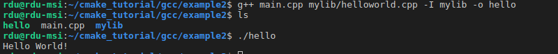

# 实用Make与CMake教程

⌚️:2020年11月30日

📚参考

- [机器人C/C++编程Step 0：实用Make与CMake教程(一)](https://zhuanlan.zhihu.com/p/99270344)
- [机器人C/C++编程Step 0：实用Make与CMake教程(二)](https://zhuanlan.zhihu.com/p/100075245)

---

相信很多刚开始接触开源C/C++机器人项目的朋友在尝试编译、运行代码的时候都会遇到这个问题：为什么我下载的代码编译不了？更具体一点的问题还可能有：Make和Makefile是怎么用的？CMake又是什么？Make和CMake有什么关系？如何编写或修改CMakeLists.txt？有这样疑问的同学往往是习惯了在Visual Studio、Eclipse或者KeilI、IAR这类IDE里建立工程和编译代码，点一点“下一步”，在图形界面下很轻松的就能把代码工程配置搞定。但是流行的开源机器人项目大多使用开源gcc/clang工具链，利用Make或者更常见的CMake管理依赖、编译代码。不把这些build相关的问题搞清楚，不管是学习开源飞控px4还是机器人操作系统ROS，再或者各种SLAM库，都很难做到得心应手，甚至很多同学花了大量的时间也难以解决所有的编译错误，还没开始算法的学习兴趣就已经被消磨掉大半。这篇文章的目的就是帮助你理解C/C++编译的基本流程，掌握CMake的的基本用法。虽然在实际项目中大概率你依然会遇到编译相关的问题，但是希望读了本篇文章之后你能够有更清晰的思路去百度或Google寻找解决方法。

## 1. **C/C++程序编译的基本元素和流程**

在IDE中管理工程，基本工作流程大致是：新建工程 ->（IDE根据新建工程过程中的选择自动生成配置文件）-> 进入main函数或者库的编写 -> 选择Build编译代码 -> 选择Run运行代码。虽然不同的IDE具体操作细节会有不同，但是共同点是IDE会帮助你完成很多配置工作，使用IDE的目的也正是让用户可以只关注编写代码。实际上不管用什么IDE或者用什么编译工具，从源代码到可执行文件生成的流程都是类似的，只是IDE帮你隐藏了更多细节帮你处理好了很多配置罢了，而使用开源工具链以及CMake需要你了解到更多细节。我们接下来用gcc和一些很简单的C++程序为例说明C/C++程序的基本编译流程。

### **1.1 示例程序1:** 

```cpp
// hello_world.cpp
#include <iostream>

int main(int argc, char *argv[])
{
    std::cout << "Hello World!" << std::endl;
    return 0;
}
```

**g++的基本使用**

我们可以直接调用g++编译、链接出可执行文件hello（以下在命令行中执行的内容都以\$开头标示，实际操作的时候不需要输入​\$）

```bash
$ g++ helloworld.cpp -o hello 
```

命令的执行过程和效果如下截图所示


很可能你在学习C/C++编程的初期也接触过这种直接调用gcc/g++的用法，但是实际项目中我们几乎不会遇到这种单源文件同时只调用了标准C/C++库的程序，所以我们稍微扩展一下

### **1.2 示例程序2:** 

```cpp
// helloworld.hpp
#ifndef HELLOWORLD_HPP
#define HELLOWORLD_HPP

void PrintHelloWorld();

#endif /* HELLOWORLD_HPP */
```


```c++
// helloworld.cpp
#include "helloworld.hpp"
#include <iostream>

void PrintHelloWorld()
{
    std::cout << "Hello World!" << std::endl;
}
```


```c++
// main.cpp
#include "helloworld.hpp"

int main(int argc, char* argv[])
{
    PrintHelloWorld();
    return 0;
}
```

这个例子里我们把“Hello World”的打印函数封装在一个模块里，这样不管在什么地方想要打印“Hello World”只需要引用头文件然后调用PrintHelloWorld函数就可以了。我们可以用类似的方式编译以上代码。

```bash
$ g++ helloworld.cpp main.cpp -o hello 
```


这个示例程序依然很简单，但是只要稍稍改一下源文件的组织方式，你就能遇到平时最常见的几类编译问题了。

原本我们把三个源文件hello_world.hpp、hello_world.cpp和main.cpp都放在同一个目录下，现在为了代码组织更清晰，我们把hello_world.hpp和hello_world.cpp放在文件夹里，新的代码组织结构如下

```text
- example2     
  - mylib         
    - helloworld.hpp         
    - helloworld.cpp     
  - main.cpp   
```

相信类似的代码组织结构你肯定不陌生，稍微大一点的项目为了方便管理以及分工合作，我们常常会把功能划分为不同的模块然后再组织到一起成为一个完成的应用程序。

#### **1.2.1 错误类型1: 找不到头文件**

再次调用g++编译代码，你会看到下面的问题


这一行里的**“xxxxxxxxx: No such file or directory"** 是不是看着很熟悉？正如错误提示所述，这类问题是因为g++没有找到源码中包含的头文件。该怎么解决呢？答案是在**调用g++的时候使用"-I" （大写的i）来指定额外的头文件引用目录**。在本例中就是加上"-I mylib"，指定的路径既可以是相对于当前触发g++所在的目录也可以是绝对路径。




#### **1.2.2 错误类型2: undefined reference**

第二类问题是库调用的问题。如果mylib里的东西是我已经整理好的功能模块（或者别人提供给我的库），我该怎么编译调用了这个库的main.cpp呢？

我们首先编译把helloworld.cpp编译为一个静态库

```text
$ cd example2/mylib 
$ g++ -c helloworld.cpp 
$ ar rvs libmylib.a helloworld.o 
```

这样在编译main.cpp的时候我们只需要使用这个静态库libmylib.a就可以了。值得注意的一点是gcc工具链在调用库的时候会默认库的名字以lib开头，如果我们生成mylib.a而不是libmylib.a的话后面在调用库的时候链接器很可能会找不到这个库。

我们先尝试以下方式调用g++：

```text
$ g++ main.cpp -I mylib -o hello 
```


是不是看到了很眼熟的**"xxxxxxxxx: undefined reference to 'xxxxxxxxx'"**？而且你可以看到是“ld”链接器返回的错误，它的意思就是gcc工具链在尝试把main.cpp编译链接成可执行文件的过程中没有找到PrintHelloWorld函数的具体定义。显然我们需要告诉g++为了生成可执行文件hello它还需要静态库mylib.a：

```text
$ g++ main.cpp -Lmylib -Imylib -lmylib -o hello 
```


这样代码就可以正常的编译和运行了。

#### **1.2.3 错误类型3: 找不到库文件**

最后除了通过指定"-lmylib"告诉g++去调用libmylib.a，你会注意到我们还使用了"-Lmylib"来指定libmylib.a所在的目录，否则你会遇到下面这种错误：


相信你也曾经遇到过类似这种**"/usr/bin/ld: cannot find -lxxxxxx"**提示吧。遇到这种问题现在你就知道虽然你告诉了g++去调用mylib，但是ld并没有在系统默认路径下找到库文件libmylib.a，你还需要告诉g++额外的路径去搜索这个文件。

至此我们可以稍微总结一下通过以上例子得到的一些结论：

- 编译一个完整的C/C++可执行程序需要的基本元素：头文件.h/.hpp/.hxx，源文件.c/cpp/.cxx，库文件.a/.o/.lib/.dll
- （如果是编译单片机程序，你可能还会遇到汇编源文件.s，链接脚本.ld，这个会在以后的文章详细介绍）
- 编译工具链的基本工作流程：（预处理，在此不详细展开）-> 编译器把源文件编译为.o文件 -> 链接器把.o文件以及外部依赖库一起链接为可执行文件。在这个过程中头文件会被用来查找变量或函数的声明，而源文件则用来提供具体的变量或函数定义。
- 为了成功的编译出最终的可执行文件，用户需要告诉工具链它所需要的头文件/源文件/库文件都有哪些（上面所说的基本元素）以及这些元素所在的位置。

## 2. Make简明教程

从上面仅三个文件的示例程序，你可能就已经能够感觉到直接调用gcc/g++完成代码的构建（build）在稍具规模的项目中会多么繁琐。除了指定头文件目录，库文件的位置和名称，很常见的你还会遇到需要增加特殊的宏定义做条件编译（通过“-D<XYZ>“）等配置。一旦项目包含的模块多了，还会需要指定好模块间的依赖关系：先编译哪个模块后编译哪个模块？否则在多线程编译的时候很可能会遇到所有需要的东西都有但是编译依然报错（如库A依赖库B，但是在编译/链接库A的时候库B还没有被创建出来，正确的顺序应该先编译库B再尝试编译库A）。**Make工具的出现就是为了简化这个问题**: gcc/g++的调用由make来执行，而makefile作为配置文件来指导make应该怎么指定正确的参数给gcc/g++以完成编译目标。

简单的讲，makefile里面定义了一系列的规则，按照这些规则指定的流程，gcc/g++一步步的生成中间文件，以完成最终文件的编译、链接，每一条规则由以下格式描述：

```make
target: [dependency]     
    command 

目标文件: [依赖项]     
    生成目标需要执行的命令    
```

注意其中命令一行必需由Tab开头，而不是任意个数的空格开头。一般来说target是构建过程中所涉及到的中间文件或者最终目标文件。如果某个目标不对应具体的文件（如只是为了执行某个命令），则可以用.PHONY来标示。还是以示例2中的代码为例，我们可以写出来如下的Makefile

```shell
# 指定编译器
CC = g++
AR = ar
RM = rm

# 想要生成的目标可执行文件
TARGET = hello

# 构建目标所需要的规则
all: $(TARGET)

$(TARGET): libmylib.a
	$(CC) main.cpp -Imylib -Lmylib -lmylib -o $(TARGET)

libmylib.a: 
	$(CC) -c mylib/helloworld.cpp
	$(AR) rvs mylib/libmylib.a helloworld.o

# 虚拟目标
.PHONY: clean
clean:
	$(RM) *.o mylib/*.a $(TARGET)
```

第3、4、5、8行定义了几个变量，Makefile中的变量可以通过$(变量名)来获得变量的值。第10到18行则制定了构建项目过程中涉及到的目标文件。第21-23行是定义了Linux下的删除命令，以删除编译过程生成的所有中间文件、库文件和可执行文件。

执行make命令而不指定想要生成的目标的话，make会默认尝试生成Makefile中定义的第一个目标，在此例子中我们定义的第一个target是all，所以以下两个命令是一致的

```text
$ make 
```

以及

```text
$ make all 
```

你可以通过make <target>的方式触发生成指定的目标，例如make libmylib.a仅仅会触发第16-18行定义的规则，结果是生成libmylib.a。

我们可以看到第11行目标all仅仅需要\$(TARGET)已经存在，而不需要执行额外的命令，所以为了构建all目标make会先触发第13-14行定义的​\$(TARGET)规则。而​\$(TARGET)规则的先决条件是libmylib.a已经生成了，所以在执行 \$(TARGET)所对应的命令之前make又会先去执行第16-18行定义的libmylib.a规则。这样函数调用式的描述起来看可能有些混乱，我们按照make all实际触发命令的顺序来重新表达一下：

```text
#1. 构建libmylib.a目标
    $(CC) -c mylib/helloworld.cpp
    $(AR) rvs mylib/libmylib.a helloworld.o
#2. 此时$(TARGET)的先决条件达到，继续执行
    $(CC) main.cpp -Imylib -Lmylib -lmylib -o $(TARGET)
#3. 此时all的先决条件达到，不需要执行任何命令=>完成目标    
```

可以看到实际执行命令的顺序“行2->行3->行5跟我们直接调用g++时是一样的，但是make会按照我们定义的规则自动处理依赖关系，我们告诉make去生成目标all，make会自动找出为了生成all都需要执行哪些步骤。

我们稍微做一个总结：

- 在我们的源代码数量很少的情况下直接调用gcc/g++最方便
- 代码数量增多以至于编译一次代码需要指定很长的参数并多次调用gcc/g++的时候使用Makefile编写编译规则，使用make来触发编译会更方便

值得一提的是，Make工具允许makefile包含子makefile，这样在大型的项目中可以给每个模块单独的写一个子makefile，这样的层次结构可以使主makefile更简洁，相互间的依赖关系更清晰。

高级的makefile使用推荐学习一下crazyflie飞控项目：https://github.com/bitcraze/crazyflie-firmware


本文仅提供了Make的简明教程，这是因为代码工程复杂到一定程度后就算是makefile的编写也会变得越来越繁琐，makefile中定义的变量的scope，目标之间的依赖关系也会开始变得不那么清晰，尤其在需要使用外部依赖库同时工程又需要跨电脑、跨平台的时候，make的问题会更加凸显。这是为什么CMake这类工具会产生。在本文的第二部分会详细介绍这些问题，以及CMake怎么能够简化复杂、跨平台工程的构建，怎样在实际工程中使用CMake。

在程序只有一两个源文件构成的时候，可以直接调用编译器并传入正确的参数完成编译、链接过程。但是随着项目规模的增大，这种方式会越来越显繁琐和低效。使用Make工具，通过在makefile中定义编译的规则来完成同样的过程可以大大提高程序编译的自动化程度，提高工作效率。上一节仅给出了一个最基本的makefile编写例程，感兴趣的同学可以去网上找一找更详细的文档来更全面的学习makefile的写法，例如：

- [https://seisman.github.io/how-to-write-makefile/index.html](https://link.zhihu.com/?target=https%3A//seisman.github.io/how-to-write-makefile/index.html)

实践过程中，makefile往往不需要每次开始新的项目都重头写起，可以利用开源项目的makefile作为模板，然后根据项目的具体要求修改makefile中相关的配置即可。

接下来的第二部分我们主要介绍CMake的使用。

## 3.**从Make到CMake**

值得一提的是makefile中的规则依然很底层，从第一部分的例子可以看出来使用gcc/g++直接编译程序所涉及到的命令依然会以几乎相同的形式出现在makefile中，make工具不过是把编译的过程像“文件批处理”一样给流程化了。如果你曾经尝试在linux下从源码编译、安装过应用程序的话，往往你会发现过程并不是直接make一下这么简单，最常见的安装流程可能有以下两种：

```bash
$ ./configure
$ make
$ sudo make install
```

或者

```bash
$ mkdir build && cd build
$ cmake ..
$ make
$ sudo make install
```

CMake默认使用的generator就是生成makefile。可以看到你还可以使用CMake生成Eclipse这类IDE的工程，如果在Windows平台下你还可以生成Visual Studio的Solution，这样你只要打开Visual Studio，导入自动生成的solution就可以build工程了。小结一下，CMake/Make在编译过程中分别起到的作用：

```text
1. CMake根据用户编写的CMakeLists.txt自动生成makefile
2. Make按照makefile中的规则触发gcc/g++/ld等工具
3. gcc工具链完成实际的编译链接工作
```

可能这样的描述并不能直观的反映出来使用CMake的必要性，CMake以及CMakeLists.txt的使用到底抽象和简化了什么过程呢？可能最重要的一点就是：

- CMake可以根据用户配置的目标依据当前系统的环境自动生成编译所需的**变量（如头文件/源文件/库文件所在的位置）**并利用这些变量完成**编译规则**的自动生成

下面使用具体的例子来展示如何使用CMake同时直观的展示它如何build过程 (CMakeLists.txt的写法较为灵活，本文尽可能的使用现代CMake的推荐使用方法来编写CMakeLists.txt，你可能会在较老的教程里看到不一样的用法)。我们使用如下代码组织结构作为基本框架：

```text
projet_folder
    - build
    - src
        - app
            - image_app.cpp
            - cvimage_app.cpp
            - CMakeLists.txt
        - image
           - include
               - image
                   - image.hpp
           - src
               - image_utils.hpp
               - image_utils.cpp
               - image.cpp
           - CMakeLists.tx
    - CMakeLists.txt    
```

为了展示CMake的功能，本次用到的例子要比第一部分里用到的稍微复杂一些，所以就不全部贴在文章里了，具体的代码可以在以下github repo中查看

- [https://github.com/rxdu/cmake_tutorial](https://link.zhihu.com/?target=https%3A//github.com/rxdu/cmake_tutorial)

在本例中我们的目标如下：

1. 生成名为image的静态库（image文件夹），库的功能是使用OpenCV显示图片
2. 生成image_app和cvimage_app两个可执行文件（app文件夹），分别调用image库中的两个图片显示函数

CMake允许把项目模块的源文件划分到不同的文件夹内自成一体，每个文件夹可以有自己的CMakeLists.txt来定义该模块内的编译目标，所以本示例项目内你能看到三个CMakeLists.txt，其中两个分别放在src/app和src/image文件夹内，对应上面说的两个编译目标。放在项目根目录下的CMakeLists.txt负责项目的一些全局配置，同时利用cmake的add_subdirectory()命令把app和image两个模块引用进来。

首先我们来看一下项目根目录下的CMakeLists.txt

```cmake
cmake_minimum_required(VERSION 3.0.0)
project(cmake_template)

## Set compiler to use c++ 11 features
set(CMAKE_CXX_STANDARD 11)
set(CMAKE_CXX_STANDARD_REQUIRED ON)

## Put all binary files into /bin and libraries into /lib
set(EXECUTABLE_OUTPUT_PATH ${CMAKE_BINARY_DIR}/bin)
set(LIBRARY_OUTPUT_PATH ${CMAKE_BINARY_DIR}/lib)
set(ARCHIVE_OUTPUT_DIRECTORY ${CMAKE_BINARY_DIR}/lib)

## Optional features
# tests
option(BUILD_TESTS "Choose whether to build test code" FALSE)

## Add source directories
add_subdirectory(src/app)
add_subdirectory(src/image)

if(BUILD_TESTS)
add_subdirectory(unit_tests)
endif()
```

这个CMakeLists.txt首先定义了项目名称及cmake的最低版本。之所以对cmake版本有要求是因为随着版本的演进，cmake会支持越来越多的功能/命令或对现有功能做进一步的完善，现代的CMake用法一般要求CMake的版本在3.0.0以后。接下来我们告诉CMake我们要使用C++11标准来编译我们的C++代码。如前文所述，CMake本身并不直接生成最终的可执行文件或库，而是会生成类似于makefile的中间配置文件（除了makefile也可以是IDE的工程配置），然后再由make或者IDE去调用编译器完成编译工作，所以为了隔离开自动生成的中间文件及我们的代码文件，一般会进行out-of-source build，也就是在源文件src文件夹以外单独建立一个build文件夹，“set(EXECUTABLE_OUTPUT_PATH ${CMAKE_BINARY_DIR}/bin)“及之后的两行命令就是指定cmake把生成的可执行文件放在build/bin目录内，库文件放在build/lib内，这样在项目结构复杂的时候依然能很容易找到编译的结果文件。CMake的option命令允许你定义一个开关变量，以根据需求决定项目是否包含某些模块，本例中使用BUILD_TESTS选项来决定是否编译单元测试。为了简化例子，我没有实际加入unit_tests模块及单元测试代码，所以默认把该选项设为FALSE。最后该CMakeLists.txt使用add_subdirectory()把src文件夹下的app和image两个模块加入工程。

接下来我们重点介绍一下image模块，一个复杂的项目往往是由多个类似的功能模块组成，他们提供某一类特定的功能，然后一起组合成具备完整功能的可执行文件。

```text
- image
    - include
        - image
            - image.hpp
    - src
        - image_utils.hpp
        - image_utils.cpp
        - image.cpp
```

大体来看该模块由include文件夹和src文件夹组成，其中模块image对外的函数接口通过include/image目录下的image.hpp暴露，image_utils.hpp和image_utils.cpp仅在模块内部使用，它们和image.cpp一起被放置在src目录下。可能你会奇怪为什么不把所有的头文件都放在include下面呢？为什么include下面又嵌套了一层image目录呢？是不是多此一举呢？我们来看一看该模块的CMakeLists.txt你就明白为什么这样组织一个模块的源文件：

```cmake
# Dependency libraries
find_package(OpenCV REQUIRED)

message(STATUS "OpenCV_LIBS: ${OpenCV_LIBS}")
message(STATUS "OpenCV_INCLUDE_DIRS: ${OpenCV_INCLUDE_DIRS}")

# Add libraries
set(IMAGE_SRC
    src/image.cpp
    src/image_utils.cpp
)
add_library(image STATIC ${IMAGE_SRC})
target_link_libraries(image ${OpenCV_LIBS})
target_include_directories(image PUBLIC
    $<BUILD_INTERFACE:${CMAKE_CURRENT_SOURCE_DIR}/include>
    $<BUILD_INTERFACE:${OpenCV_INCLUDE_DIRS}>
    PRIVATE src)
```

在cmake中我们使用add_library()命令来指定一个库文件目标，你可以指定一个库为STATIC类型的静态库或SHARED类型的动态库，如果你编写了一个header-only的模块，你还可以把该模块声明为一个INTERFACE类型的库。${IMAGE_SRC}则是通过IMAGE_SRC变量指定image库由哪些源文件构成。我们提到过image模块使用了OpenCV库来实现图片的读取和显示，OpenCV是一个很流行的第三方Computer Vision库，我们在该模块的最开头使用了find_package(OpenCV REQUIRED)命令告诉CMake去默认路径下搜索OpenCV库相关的配置文件，如果系统中安装并正确的配置这个OpenCV，则CMake应该能够找到它，并自动定义变量OpenCV_LIBS来保存OpenCV的库文件信息，OpenCV_INCLUDE_DIRS来保存OpenCV的头文件信息。你可以使用message()命令来输出显示这两个变量的内容，值得一提的是CMake中对变量值的引用使用{}，而makefile中使用()。在build目录下运行命令（以下命令中的..是告诉CMake去上一级目录查找项目的根CMakeLists.txt配置文件，也就是上面贴出来的CMakeLists.txt，..在Linux命令行中代表上一级目录）

```bash
$ cmake ..
```

你可以看到如下输出片段：


这说明CMake在/usr目录下找到了OpenCV库，它包含了opencv_calib3d等库文件，头文件所在的目录为"/usr/include/;/usr/include/opencv"。可以想象，如果你使用makefile来生成image模块，你就需要自己手动指定OpenCV库的安装路径、库文件以及头文件所在的目录。如果另一位用户把OpenCV安装在了/usr/local目录下呢？这种情况下就必须更新makefile否则编译器会找不到OpenCV相关的文件。而使用CMake这个查找并生成名称和路径变量的过程被自动完成了。当一个项目有很多外部依赖项，同时项目有可能在不同的电脑、甚至不同的操作系统下编译时，CMake可以极大的简化我们的配置工作，我们不再需要手动的编写针对不同平台的makefile或者IDE配置，而只需要CMake我们需要使用什么依赖库，以及哪个目标需要这个库即可。（当然find_package也不能保证查找到所有的第三方库，至于怎么处理这种情况会涉及到更复杂一些的CMake配置，我们不在本文详述，后面会给出参考链接给感兴趣的同学进一步学习）。回到CMakeLists.txt，我们使用add_library()命令声明了image静态库，接下来我们使用target_link_libraries()来告诉CMake模块image需要依赖OpenCV库，使用target_include_directories()高数CMake在build image的过程中它会需要${OpenCV_INCLUDE_DIRS}说对应的路径查找需要的OpenCV头文件。除了OpenCV的文件夹路径，编译image还需要本模块内的include目录以及src目录下的头文件。其中PUBLIC表示它之后说指定的目录对于依赖image的模块来说也是可见的，而PRIVATE则标示该目录下的头文件仅对本image模块可见。例如app文件夹内的两个可执行文件，因为他们都依赖image模块，所以include文件夹对于它们来说都是可见的，这样在引用头文件的时候就可以这样

```cpp
#include "image/image.hpp"
```

这也就解释了为什么我们在组织模块头文件的时候会在include目录下多加一层image目录，这样的好处就是如果我们需要某个模块的头文件，只需要以“image/xxxx.h”的方式引用就可以了，相比于直接使用#include "image.hpp"，这种方式能够更清晰的展示头文件所属的模块。之所以把OpenCV的头文件路径也设置为PUBLIC是因为image.hpp里引用了OpenCV的头文件#include <opencv2/opencv.hpp>，如果不把OpenCV的路径设置为PUBLIC，虽然image模块可以成功编译，但是对于依赖image模块的其他目标就会出现找不到头文件的编译错误。

好了，我们最后再简单的看一下app文件夹下的CMakeLists.txt

```cmake
# Add executables
add_executable(image_app image_app.cpp)
target_link_libraries(image_app image)

add_executable(cvimage_app cvimage_app.cpp)
target_link_libraries(cvimage_app image)
```

这个模块的CMakeLists.txt很简单，我们只解释一下第一个，在这里我们使用add_executable()命令声明image_app可执行文件，这个可执行文件需要image_app.cpp源文件，同时它依赖image库。

如果运行“cmake .."命令没有错误的话，说明CMake正确完成了配置文件的生成，我们可以使用make来完成编译

```bash
$ make -j8
```

这里-j8是指定使用CPU八线程完成编译工作，可以根据实际的CPU来指定具体的数值。编译完成后你就可以看到build/bin目录下的可执行文件以及build/lib下的image库文件。


对于CMake的使用我再做一个简单的总结：

- 我们使用CMakeLists.txt来配置工程的编译目标以及依赖关系，cmake会根据CMakeLists.txt来生成makefile
- 在CMakeLists.txt中可以使用add_library()来指定我们想要编译的库，使用add_executable()来指定我们想要编译的可执行文件（带有main函数的程序）
- target_link_libraries()命令可以指定目标所依赖的库文件，target_include_directories()可以用来指定目标所需要的头文件查找路径
- 以上文说示的结构组织模块源码，可以较好的隔离开模块对内和对外的部分，在外部引用的时候使用类似于#include "image/image.hpp"的方式也可以很清晰的展示头文件所属的模块
- 使用CMake可以很方便的管理需要跨电脑、跨平台，同时依赖较多外部库的项目

希望读完本文你能对C/C++程序的编译过程有一个较为清晰的认识，同时能够以本文提供的CMake例子作为模板开始配置自己的CMake工程。

如果你还想要进一步学习CMake更多的配置细节，推荐参考以下教程：

- [https://cliutils.gitlab.io/modern-cmake/](https://link.zhihu.com/?target=https%3A//cliutils.gitlab.io/modern-cmake/)
- [https://pabloariasal.github.io/2018/02/19/its-time-to-do-cmake-right/](https://link.zhihu.com/?target=https%3A//pabloariasal.github.io/2018/02/19/its-time-to-do-cmake-right/)
- [https://rix0r.nl/blog/2015/08/13/cmake-guide/](https://link.zhihu.com/?target=https%3A//rix0r.nl/blog/2015/08/13/cmake-guide/)
