# C++11并发与多线程

⌚️:2021年10月28日

📚参考


---

## 1. 并发基本概念及实现，进程、线程基本概念

**一 并发基本概念及实现，进程、线程基本概念**

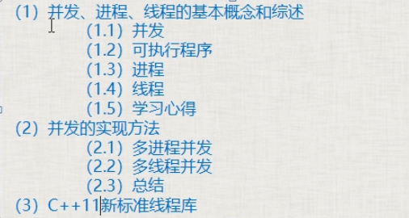


### **一、并发、进程、线程的基本概念和综述**

并发，线程，进程要求必须掌握

#### *1.1 并发*

- 两个或者更多的任务（独立的活动）同时发生（进行）：一个程序同时执行多个独立的任务；
- 以往计算机，单核cpu（中央处理器）：某一个时刻只能执行一个任务，由操作系统调度，每秒钟进行多次所谓的“任务切换”。并发的假象（不是真正的并发），切换（上下文切换）时要保存变量的状态、执行进度等，存在时间开销；
- 随着硬件发展，出现了多处理器计算机：用于服务器和高性能计算领域。台式机：在一块芯片上有多核（一个CPU内有多个运算核心，对于操作系统来说，每个核心都是作为单独的CPU对待的）：双核，4核，8核，10核（自己的笔记本是4核8线程的）。能够实现真正的并行执行多个任务（硬件并发）
- 使用并发的原因：主要就是同时可以干多个事，提高性能

#### *1.2 可执行程序*

- 磁盘上的一个文件，windows下，扩展名为.exe；linux下，ls -la，rwx（可读可写可执行）

#### *1.3 进程*

- 运行一个可执行程序，在windows下，可双击；在linux下，./文件名
- 进行，一个可执行程序运行起来了，就叫创建了一个进程。进程就是运行起来的可执行程序。

#### *1.4 线程*

①

- a)每个进程（执行起来的可执行程序），都有唯一的一个主线程
- b)当执行可执行程序时，产生一个进程后，这个主线程就随着这个进程默默启动起来了
- ctrl+F5运行这个程序的时候，实际上是进程的主线程来执行（调用）这个main函数中的代码
- 线程：用来执行代码的。线程这个东西，可以理解为一条代码的执行通路

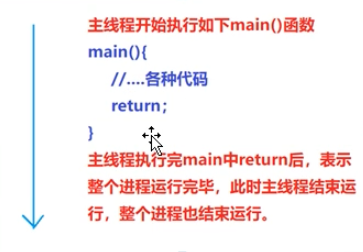

②

- 除了主线程之外，可以通过写代码来创建其他线程，其他线程走的是别的道路，甚至区不同的地方
- 每创建一个新线程，就可以在同一时刻，多干一个不同的事（多走一条不同的代码执行路径）

③

- 多线程（并发）
- 线程并不是越多越好，每个线程，都需要一个独立的堆栈空间（大约1M），线程之间的切换要保存很多中间状态，切换也会耗费本该属于程序运行的时间

必须使用多线程的案例
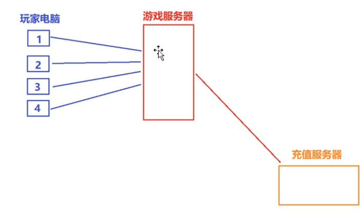
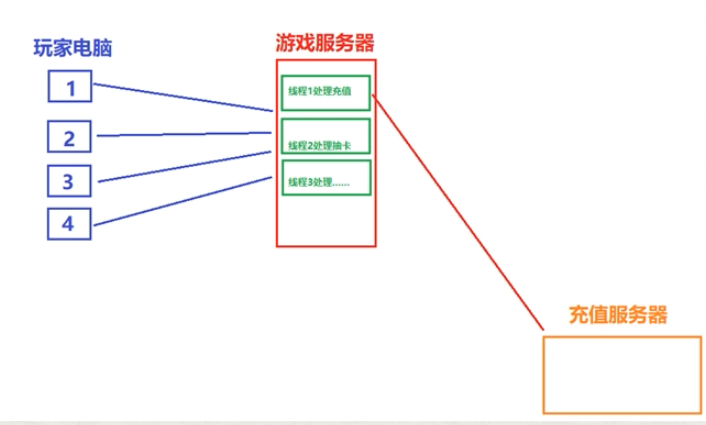

#### *1.5 学习心得*

- 开发多线程程序：一个是实力的体现，一个是商用的必须需求
- 线程开发有一定难度
- C++线程会设计很多新概念
- 网络方向：网络通讯、网络服务器，多线程是绝对绕不开的

### **二、并发的实现方法**

实现并发的手段：
a）通过多个进程实现并发
b）在单独的进程中，写代码创建除了主线程之外的其他线程来实现并发

#### *2.1 多进程并发*

- 比如账号服务器一个进程，游戏服务器一个进程。
- 服务器进程之间存在通信（同一个电脑上：管道，文件，消息队列，共享内存）；（不同电脑上：socket通信技术）

#### *2.2 多线程并发*

- 线程：感觉像是轻量级的进程。每个进程有自己独立的运行路径，但一个进程中的所有线程共享地址空间（共享内存），全局变量、全局内存、全局引用都可以在线程之间传递，所以多线程开销远远小于多进程
- 多进程并发核多线程并发可以混合使用，但建议优先考虑多线程技术
- 本课程中只讲多线程并发技术

### **三、C++11新标准线程库**

#### *以往*

- windows：CreateThread(), _beginthread(),_beginthreadexe()创建线程；linux：pthread_create()创建线程；不能跨平台
- 临界区，互斥量
- POSIX thread(pthread):跨平台，但要做一番配置，也不方便

#### *C++11*

- 从C++11新标准，C++语言本身增加对多线程的支持，意味着可移植性（跨平台），这大大减少开发人员的工作量

# 2. 线程启动、结束，创建线程多法、join，detach

**第二节 线程启动、结束，创建线程多法、join，detach**

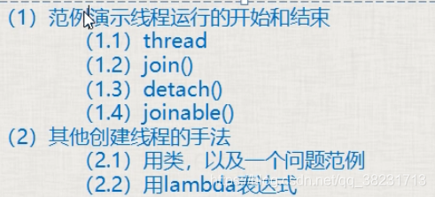

### **一、范例演示线程运行的开始**

- 程序运行起来，生成一个进程，该进程所属的主线程开始自动运行；当主线程从main（）函数返回，则整个进程执行完毕
- 主线程从main（）开始执行，那么我们自己创建的线程，也需要从一个函数开始运行（初始函数），一旦这个函数运行完毕，线程也结束运行
- 整个进程是否执行完毕的标志是：主线程是否执行完，如果主线程执行完毕了，就代表整个进程执行完毕了，此时如果其他子线程还没有执行完，也会被强行终止【此条有例外，以后会解释】


创建一个线程：

- 包含头文件thread
- 写初始函数
- 在main中创建thread


必须要明白：有两个线程在跑，相当于整个程序中有两条线在同时走，即使一条被阻塞，另一条也能运行

	#include <iostream>
	#include <thread>
	using namespace std;
	
	void myPrint()
	{
		cout << "我的线程开始运行" << endl;
		//-------------
		//-------------
		cout << "我的线程运行完毕" << endl;
		return;
	}
	
	int main()
	{
		//(1)创建了线程，线程执行起点（入口）是myPrint；(2)执行线程
		thread myThread(myPrint);
	    //(2)阻塞主线程并等待myPrint执行完，当myPrint执行完毕，join()就执行完毕，主线程继续往下执行
	    //join意为汇合，子线程和主线程回合. 阻塞主线程，让主线程等待子线程
	    myThread.join();
	
	    //设置断点可看到主线程等待子线程的过程
	    //F11逐语句，就是每次执行一行语句，如果碰到函数调用，它就会进入到函数里面
	    //F10逐过程，碰到函数时，不进入函数，把函数调用当成一条语句执行
	
	    //(3)传统多线程程序中，主线程要等待子线程执行完毕，然后自己才能向下执行
	    //detach:分离，主线程不再与子线程汇合，不再等待子线程
	    //detach后，子线程和主线程失去关联，驻留在后台，由C++运行时库接管
	    //myThread.detach();
	    // 为什么引入detach():我们创建了很多子线程，让主线程逐个等待子线程，这种标称方法不太好，所以引入了detach。但是最好还要join。
	
	    //(4)joinable()判断是否可以成功使用join()或者detach()
	    //如果返回true，证明可以调用join()或者detach()
	    //如果返回false，证明调用过join()或者detach()，join()和detach()都不能再调用了
	    if (myThread.joinable())
	    {
	        cout << "可以调用可以调用join()或者detach()" << endl;
	    }
	    else
	    {
	        cout << "不能调用可以调用join()或者detach()" << endl;
	    }
	
	    cout << "Hello World!" << endl;
	    return 0;
	}


重要补充：

线程类参数是一个可调用对象。

一组可执行的语句称为可调用对象，c++中的可调用对象可以是函数、函数指针、lambda表达式、bind创建的对象或者重载了函数调用运算符的类对象。

### 二、其他创建线程的方法

①创建一个类，并编写圆括号重载函数，初始化一个该类的对象，把该对象作为线程入口地址

```
class Ta
{
public:
	void operator()() //不能带参数
	{
		cout << "我的线程开始运行" << endl;
		//-------------
		//-------------
		cout << "我的线程运行完毕" << endl;
	}
};

//main函数里的：
	Ta ta;
	thread myThread(ta);
	myThread.join();
```


②lambda表达式创建线程

```
//main函数中
auto lambdaThread = [] {
		cout << "我的线程开始执行了" << endl;
		//-------------
		//-------------
		cout << "我的线程开始执行了" << endl;
	};

	thread myThread(lambdaThread);
	myThread.join();

```

③把某个类中的某个函数作为线程的入口地址

```
class Data_
{
public:
    void GetMsg(){}
    void SaveMsh(){}
};
//main函数里
    Data_ s;
    //第一个&意思是取址，第二个&意思是引用，相当于std::ref(s)
    //thread oneobj(&Data_::SaveMsh,s)传值也是可以的
    //在其他的构造函数中&obj是不会代表引用的，会被当成取地址
    //调用方式：对象成员函数地址，类实例，[成员函数参数]
	//第二个参数可以传递对象s，也可以传递引用std::ref(s)或&s
	//传递s，会调用拷贝构造函数在子线程中生成一个新的对象
	//传递&，子线程中还是用的原来的对象，所以就不能detach，因为主线程运行完毕会把该对象释放掉
    thread oneobj(&Data_::SaveMsh,&s);
    thread twoobj(&Data_::GetMsg,&s);
    oneobj.join();
    twoobj.join();

```

#  3. 线程传参详解，detach()大坑，成员函数做线程函数

**第三节 线程传参详解，detach()大坑，成员函数做线程函数**

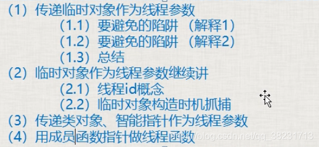

### **一、传递临时对象作为线程参数**

#### *1.1要避免的陷阱1：*

```
#include <iostream>
#include <thread>
using namespace std;

void myPrint(const int &i, char* pmybuf)
{
	//如果线程从主线程detach了
	//i不是mvar真正的引用，实际上值传递，即使主线程运行完毕了，子线程用i仍然是安全的，但仍不推荐传递引用
	//推荐改为const int i
	cout << i << endl;
	//pmybuf还是指向原来的字符串，所以这么写是不安全的
	cout << pmybuf << endl;
}

int main()
{
	int mvar = 1;
	int& mvary = mvar;
	char mybuf[] = "this is a test";
	thread myThread(myPrint, mvar, mybuf);//第一个参数是函数名，后两个参数是函数的参数
	myThread.join();
	//myThread.detach();
	
	cout << "Hello World!" << endl;
}

```

debug时可以查看地址，观察两个量是否时同一个。

#### *1.2要避免的陷阱2：*

```
#include <iostream>
#include <thread>
#include <string>
using namespace std;

void myPrint(const int i, const string& pmybuf)
{
	cout << i << endl;
	cout << pmybuf << endl;
}

int main()
{
	int mvar = 1;
	int& mvary = mvar;
	char mybuf[] = "this is a test";
	//如果detach了，这样仍然是不安全的
	//因为存在主线程运行完了，mybuf被回收了，系统采用mybuf隐式类型转换成string
	//推荐先创建一个临时对象thread myThread(myPrint, mvar, string(mybuf));就绝对安全了。。。。
	thread myThread(myPrint, mvar, mybuf);
	myThread.join();
	//myThread.detach();

	cout << "Hello World!" << endl;
}

```

#### *1.3总结*

- 如果传递int这种简单类型，推荐使用值传递，不要用引用
- 如果传递类对象，避免使用隐式类型转换，全部都是创建线程这一行就创建出临时对象，然后在函数参数里，用引用来接，否则还会创建出一个对象
- 终极结论：建议不使用detach


> 使用detach时。
>
> 
>
> 如果线程的调用函数不用引用，则会调用三次构造函数。（1次构造、2次拷贝构造）
>
> 使用引用的话，构造使用两次
>
> 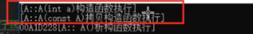
>
> 

### 二、临时对象作为线程参数继续讲

#### 2.1线程id概念

id是个数字，每个线程（不管是主线程还是子线程）实际上都对应着一个数字，而且每个线程对应的这个数字都不一样
线程id可以用C++标准库里的函数来获取。std::this_thread::get_id()来获取

- 使用值传递

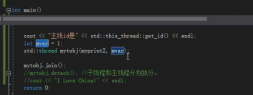

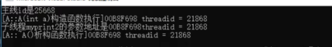

在子线程中构造


- 使用临时量

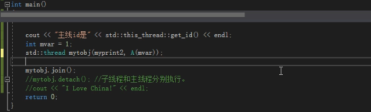

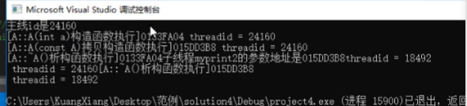


对比

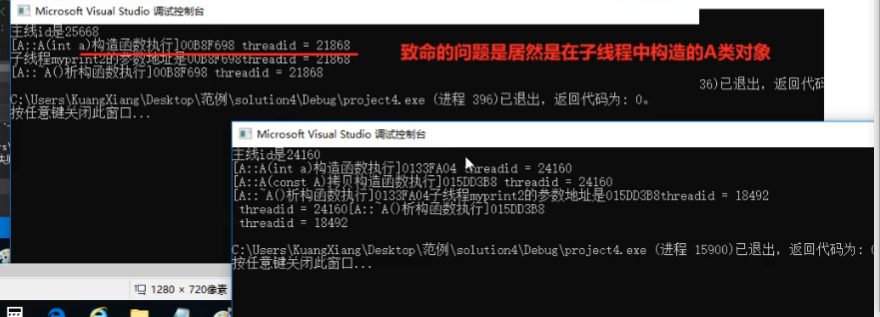


### 三、传递类对象、智能指针作为线程参数

#### 3.1

```
#include <iostream>
#include <thread>
using namespace std;

class A {
public:
	mutable int m_i; //m_i即使实在const中也可以被修改
	A(int i) :m_i(i) {}
};

void myPrint(const A& pmybuf)
{
	pmybuf.m_i = 199;
	cout << "子线程myPrint的参数地址是" << &pmybuf << "thread = " << std::this_thread::get_id() << endl;
}

int main()
{
	A myObj(10);
	//myPrint(const A& pmybuf)中引用不能去掉，如果去掉会多创建一个对象
	//const也不能去掉，去掉会出错
	//即使是传递的const引用，但在子线程中还是会调用拷贝构造函数构造一个新的对象，
	//所以在子线程中修改m_i的值不会影响到主线程
	//如果希望子线程中修改m_i的值影响到主线程，可以用thread myThread(myPrint, std::ref(myObj));
	//这样const就是真的引用了，myPrint定义中的const就可以去掉了，类A定义中的mutable也可以去掉了
	thread myThread(myPrint, myObj);
	myThread.join();
	//myThread.detach();

	cout << "Hello World!" << endl;
}

```

#### 3.2

```
#include <iostream>
#include <thread>
#include <memory>
using namespace std;

void myPrint(unique_ptr<int> ptn)
{
	cout << "thread = " << std::this_thread::get_id() << endl;
}

int main()
{
	unique_ptr<int> up(new int(10));
	//独占式指针只能通过std::move()才可以传递给另一个指针
	//传递后up就指向空，新的ptn指向原来的内存
	//所以这时就不能用detach了，因为如果主线程先执行完，ptn指向的对象就被释放了
	thread myThread(myPrint, std::move(up));
	myThread.join();
	//myThread.detach();

	return 0;
}
```

### **四、用成员函数指针做线程函数**

放在了2.2

## 4. 创建多个线程、数据共享问题分析、案例代码

**第四节 创建多个线程、数据共享问题分析、案例代码**


### **一、创建和等待多个线程**

```
void TextThread()
{
     cout << "我是线程" << this_thread::get_id() << endl;
     /*  …  */
     cout << "线程" << this_thread::get_id() << "执行结束" << endl; 
}
 //main函数里     vector threadagg;
     for (int i = 0; i < 10; ++i)
     {
         threadagg.push_back(thread(TextThread));
     }
     for (int i = 0; i < 10; ++i)
     {
         threadagg[i].join();
     }

```

- 把thread对象放入到容器中管理，看起来像个thread对象数组，对一次创建大量的线程并对大量线程进行管理有好处
- 多个线程执行顺序是乱的，跟操作系统内部对线程的运行调度机制有关

### **二：数据共享问题分析**

*2.1 只读的数据*

- 是安全稳定的

*2.2 有读有写*

- 若不加处理，就会出错
- 最简单的防止崩溃方法：读的时候不能写，写的时候不能读。
- 写的动作分10小步，由于任务切换，导致各种诡异的事情发生（最可能的还是崩溃）

# 5. 互斥量概念、用法、死锁演示及解决详解

## 第五节 互斥量概念、用法、死锁演示及解决详解

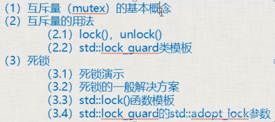

### 一、互斥量（mutex）的基本概念

互斥量就是个类对象，可以理解为一把锁，多个线程尝试用lock()成员函数来加锁，只有一个线程能锁定成功，如果没有锁成功，那么流程将卡在lock()这里不断尝试去锁定。

互斥量使用要小心，保护数据不多也不少，少了达不到效果，多了影响效率。

### 二、互斥量的用法

包含#include <mutex>头文件

#### 2.1 lock()，unlock()

步骤：1.lock()，2.操作共享数据，3.unlock()。

lock()和unlock()要成对使用

#### 2.2 lock_guard类模板

lock_guard<mutex> sbguard(myMutex);取代lock()和unlock()

lock_guard构造函数执行了mutex::lock();

在作用域结束时，调用析构函数，执行mutex::unlock()

### 三、死锁

#### 3.1 死锁演示

死锁至少有两个互斥量mutex1，mutex2。

a.线程A执行时，这个线程先锁mutex1，并且锁成功了，然后去锁mutex2的时候，出现了上下文切换。

b.线程B执行，这个线程先锁mutex2，因为mutex2没有被锁，即mutex2可以被锁成功，然后线程B要去锁mutex1.

c.此时，死锁产生了，A锁着mutex1，需要锁mutex2，B锁着mutex2，需要锁mutex1，两个线程没办法继续运行下去。。。

#### 3.2 死锁的一般解决方案：

只要保证多个互斥量上锁的顺序一样就不会造成死锁。

#### 3.3 std::lock()函数模板

std::lock(mutex1,mutex2……); 一次锁定多个互斥量（一般这种情况很少），用于处理多个互斥量。
如果互斥量中一个没锁住，它就等着，等所有互斥量都锁住，才能继续执行。如果有一个没锁住，就会把已经锁住的释放掉（要么互斥量都锁住，要么都没锁住，防止死锁）

#### 3.4 std::lock_guard的std::adopt_lock参数

std::lock_guardstd::mutex my_guard(my_mutex,std::adopt_lock);
加入adopt_lock后，在调用lock_guard的构造函数时，不再进行lock();
adopt_guard为结构体对象，起一个标记作用，表示这个互斥量已经lock()，不需要在lock()。

```
#include <iostream>
#include <thread>
#include <list>
#include <mutex>
using namespace std;

class A{
public:
	void inMsgRecvQueue()
	{
		for (int i = 0; i < 100000; ++i)
		{
			cout << "插插插插插插插插插插插插插插插插插插插插入一个元素" << i << endl;
			{
				//lock_guard<mutex> sbguard(myMutex1, adopt_lock);
				lock(myMutex1, myMutex2);
				//myMutex2.lock();
				//myMutex1.lock();
				msgRecvQueue.push_back(i);
				myMutex1.unlock();
				myMutex2.unlock();
			}
		}
	}
	bool outMsgLULProc()
	{
		myMutex1.lock();
		myMutex2.lock();
		if (!msgRecvQueue.empty())
		{
			cout << "删删删删删删删删删删删删删删删删删删删删删删删除元素" << msgRecvQueue.front() << endl;
			msgRecvQueue.pop_front();
			myMutex2.unlock();
			myMutex1.unlock();
			return true;
		}
		myMutex2.unlock();
		myMutex1.unlock();
		return false;
	}

	void outMsgRecvQueue()
	{
		for (int i = 0; i < 100000; ++i)
		{
			if (outMsgLULProc())
			{

			}
			else
			{
				cout << "空空空空空空空空空空空空空空空空空空空空空空空空空空数组为空" << endl;
			}
		}
	}
private:
	list<int> msgRecvQueue;
	mutex myMutex1;
	mutex myMutex2;
};

int main()
{
	A myobja;
	mutex myMutex;
	thread myOutMsgObj(&A::outMsgRecvQueue, &myobja);
	thread myInMsgObj(&A::inMsgRecvQueue, &myobja);
	myOutMsgObj.join();
	myInMsgObj.join();
	return 0;
}

```

# 6. unique_lock（类模板）详解

**第六节 unique_lock（类模板）详解**

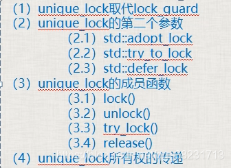

### 1.unique_lock取代lock_guard

unique_lock比lock_guard灵活很多（多出来很多用法），效率差一点。

unique_lock<mutex> myUniLock(myMutex);

### 2.unique_lock的第二个参数

#### 2.1 std::adopt_lock：

表示这个互斥量已经被lock()，即不需要在构造函数中lock这个互斥量了。

前提：必须提前lock

lock_guard中也可以用这个参数

`my_mutex1.lock()`

`std::lock_guard<std::mutex> sbguard1(my_mutex1, std::adopt_lock)`

#### 2.2 std::try_to_lock：

尝试用mutex的lock()去锁定这个mutex，但如果没有锁定成功，会立即返回，不会阻塞在那里；
使用try_to_lock的原因是防止其他的线程锁定mutex太长时间，导致本线程一直阻塞在lock这个地方

前提：不能提前lock();

owns_locks()方法判断是否拿到锁，如拿到返回true

```
// my_mutex1.lock()  不能提前lock
std::lock_guard<std::mutex> sbguard1(my_mutex1, std::try_to_lock)
if(sbguard1.owns_lock()){
//拿到了锁，可以操作共享数据
}
else{
// 没有拿到锁干些别的事
}
```


#### 2.3 std::defer_lock：

如果没有第二个参数就对mutex进行加锁，加上defer_lock是始化了一个没有加锁的mutex
不给它加锁的目的是以后可以调用unique_lock的一些方法

前提：不能提前lock


### 3.unique_lock的成员函数（前三个与std::defer_lock联合使用）

#### 3.1 lock()：加锁。

```
unique_lock<mutex> myUniLock(myMutex， defer_lock);
myUniLock.lock();

```

不用自己unlock();

#### *3.2 unlock()：解锁。*

```
unique_lock<mutex> myUniLock(myMutex， defer_lock);
myUniLock.lock();
//处理一些共享代码
myUniLock.unlock(); // 临时处理非共享代码
//处理一些非共享代码
myUniLock.lock();
//处理一些共享代码

```

因为一些非共享代码要处理，可以暂时先unlock()，用其他线程把它们处理了，处理完后再lock()。

#### 3.3 try_lock()：尝试给互斥量加锁

如果拿不到锁，返回false，否则返回true。

```
if(sbguard1.try_lock()==true){

}else{

}
```


#### 3.4 release()：

`unique_lock<mutex> myUniLock(myMutex);`

相当于把myMutex和myUniLock绑定在了一起，release()就是解除绑定，返回它所管理的mutex对象的指针，并释放所有权

`mutex* ptx = myUniLock.release();`

所有权由ptx接管，如果原来mutex对象处理加锁状态，就需要ptx在以后进行解锁了。
lock的代码段越少，执行越快，整个程序的运行效率越高。

a.锁住的代码少，叫做粒度细，执行效率高；

b.锁住的代码多，叫做粒度粗，执行效率低；


### 4.unique_lock所有权的传递

unique_lock<mutex> myUniLock(myMutex);把myMutex和myUniLock绑定在了一起，也就是myUniLock拥有myMutex的所有权

1. #### 使用move转移

myUniLock拥有myMutex的所有权，myUniLock可以把自己对myMutex的所有权转移，但是不能复制。
unique_lock<mutex> myUniLock2(std::move(myUniLock));
现在myUniLock2拥有myMutex的所有权。
2. #### 在函数中return一个临时变量，即可以实现转移

  ```
  unique_lock<mutex> aFunction()
  {
      unique_lock<mutex> myUniLock(myMutex);
      //移动构造函数那里讲从函数返回一个局部的unique_lock对象是可以的
      //返回这种局部对象会导致系统生成临时的unique_lock对象，并调用unique_lock的移动构造函数
      return myUniLock;
  }
  // 然后就可以在外层调用，在sbguard具有对myMutex的所有权
  std::unique_lock<std::mutex> sbguard = aFunction();
  
  ```


# 7. 单例设计模式共享数据分析、解决，call_once

### 1.设计模式

程序灵活，维护起来可能方便，用设计模式理念写出来的代码很晦涩，但是别人接管、阅读代码都会很痛苦

老外应付特别大的项目时，把项目的开发经验、模块划分经验，总结整理成设计模式

中国零几年设计模式刚开始火时，总喜欢拿一个设计模式往上套，导致一个小小的项目总要加几个设计模式，本末倒置

设计模式有其独特的优点，要活学活用，不要深陷其中，生搬硬套

### 2.单例设计模式：

整个项目中，有某个或者某些特殊的类，只能创建一个属于该类的对象。

单例类：只能生成一个对象。


### 3.单例设计模式共享数据分析、解决

面临问题：需要在自己创建的线程中来创建单例类的对象，这种线程可能不止一个。我们可能面临GetInstance()这种成员函数需要互斥。

可以在加锁前判断m_instance是否为空，否则每次调用Singleton::getInstance()都要加锁，十分影响效率。

```
#include <iostream>	
#include <mutex>
using namespace	std;

mutex myMutex;
//懒汉模式
class Singleton
{
public:
	static Singleton * getInstance() {
         //双重锁定 提高效率
		if (instance == NULL) {
			lock_guard<mutex> myLockGua(myMutex);
			if (instance == NULL) {
				instance = new Singleton;
			}
		}
		return instance;
	}
private:
	Singleton() {}
	static Singleton *instance;
};
Singleton * Singleton::instance = NULL;

//饿汉模式
class Singleton2 {
public:
	static Singleton2* getInstance() {
		return instance;
	}
private:
	Singleton2() {}
	static Singleton2 * instance;
};
Singleton2 * Singleton2::instance = new Singleton2;

int main(void)
{
	Singleton * singer = Singleton::getInstance();
	Singleton * singer2 = Singleton::getInstance();
	if (singer == singer2)
		cout << "二者是同一个实例" << endl;
	else
		cout << "二者不是同一个实例" << endl;

	cout << "----------		以下 是 饿汉式	------------" << endl;
	Singleton2 * singer3 = Singleton2::getInstance();
	Singleton2 * singer4 = Singleton2::getInstance();
	if (singer3 == singer4)
		cout << "二者是同一个实例" << endl;
	else
		cout << "二者不是同一个实例" << endl;

	return 0;
}

```


如果觉得在单例模式new了一个对象，而没有自己delete掉，这样不合理。可以增加一个类中类CGarhuishou，new一个单例类时创建一个静态的CGarhuishou对象，这样在程序结束时会调用CGarhuishou的析构函数，释放掉new出来的单例对象。

```
class Singelton
{
public:
	static Singleton * getInstance() {
        if (instance == NULL) {
		    static CGarhuishou huishou;
		    instance = new Singelton;
        }
        return instance;
	}
	class CGarhuishou {
	public:
		~CGarhuishou()
		{
			if (Singleton::instance)
			{
				delete Singleton::instance;
				Singleton::instance = NULL;
			}
		}
	};
private:
	Singleton() {}
	static Singleton *instance;
};
Singleton * Singleton::instance = NULL;

```


### 4.std::call_once()：

函数模板，该函数的第一个参数为标记，第二个参数是一个函数名（如a()）。
功能：能够保证函数a()只被调用一次。具备互斥量的能力，而且比互斥量消耗的资源更少，更高效。
call_once()需要与一个标记结合使用，这个标记为std::once_flag；其实once_flag是一个结构，call_once()就是通过标记来决定函数是否执行，调用成功后，就把标记设置为一种已调用状态。

多个线程同时执行时，一个线程会等待另一个线程先执行。

```
once_flag g_flag;
class Singleton
{
public:
    static void CreateInstance()//call_once保证其只被调用一次
    {
        instance = new Singleton;
    }
    //两个线程同时执行到这里，其中一个线程要等另外一个线程执行完毕
	static Singleton * getInstance() {
         call_once(g_flag, CreateInstance);
         return instance;
	}
private:
	Singleton() {}
	static Singleton *instance;
};
Singleton * Singleton::instance = NULL;

```