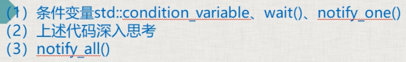
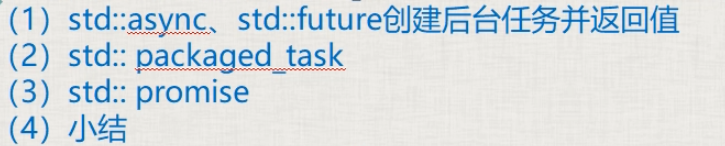
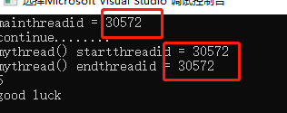
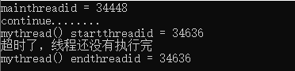
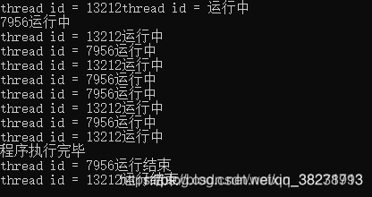
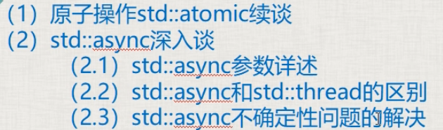
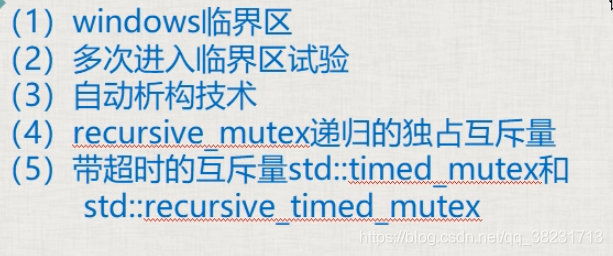
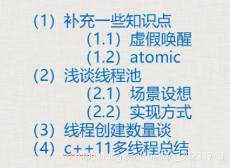

# C++11并发与多线程

⌚️:2021年10月28日

📚参考


---

## 1. 并发基本概念及实现，进程、线程基本概念


### **一、并发、进程、线程的基本概念和综述**

并发，线程，进程要求必须掌握

#### *1.1 并发*

- 两个或者更多的任务（独立的活动）同时发生（进行）：一个程序同时执行多个独立的任务；
- 以往计算机，单核cpu（中央处理器）：某一个时刻只能执行一个任务，由操作系统调度，每秒钟进行多次所谓的“任务切换”。并发的假象（不是真正的并发），切换（上下文切换）时要保存变量的状态、执行进度等，存在时间开销；
- 随着硬件发展，出现了多处理器计算机：用于服务器和高性能计算领域。台式机：在一块芯片上有多核（一个CPU内有多个运算核心，对于操作系统来说，每个核心都是作为单独的CPU对待的）：双核，4核，8核，10核（自己的笔记本是4核8线程的）。能够实现真正的并行执行多个任务（硬件并发）
- 使用并发的原因：主要就是同时可以干多个事，提高性能

#### *1.2 可执行程序*

- 磁盘上的一个文件，windows下，扩展名为.exe；linux下，ls -la，rwx（可读可写可执行）

#### *1.3 进程*

- 运行一个可执行程序，在windows下，可双击；在linux下，./文件名
- 进行，一个可执行程序运行起来了，就叫创建了一个进程。进程就是运行起来的可执行程序。

#### *1.4 线程*

①

- a)每个进程（执行起来的可执行程序），都有唯一的一个主线程
- b)当执行可执行程序时，产生一个进程后，这个主线程就随着这个进程默默启动起来了
- ctrl+F5运行这个程序的时候，实际上是进程的主线程来执行（调用）这个main函数中的代码
- 线程：用来执行代码的。线程这个东西，可以理解为一条代码的执行通路


②

- 除了主线程之外，可以通过写代码来创建其他线程，其他线程走的是别的道路，甚至区不同的地方
- 每创建一个新线程，就可以在同一时刻，多干一个不同的事（多走一条不同的代码执行路径）

③

- 多线程（并发）
- 线程并不是越多越好，每个线程，都需要一个独立的堆栈空间（大约1M），线程之间的切换要保存很多中间状态，切换也会耗费本该属于程序运行的时间

必须使用多线程的案例


#### *1.5 学习心得*

- 开发多线程程序：一个是实力的体现，一个是商用的必须需求
- 线程开发有一定难度
- C++线程会设计很多新概念
- 网络方向：网络通讯、网络服务器，多线程是绝对绕不开的

### **二、并发的实现方法**

实现并发的手段：
a）通过多个进程实现并发
b）在单独的进程中，写代码创建除了主线程之外的其他线程来实现并发

#### *2.1 多进程并发*

- 比如账号服务器一个进程，游戏服务器一个进程。
- 服务器进程之间存在通信（同一个电脑上：管道，文件，消息队列，共享内存）；（不同电脑上：socket通信技术）

#### *2.2 多线程并发*

- 线程：感觉像是轻量级的进程。每个进程有自己独立的运行路径，但一个进程中的所有线程共享地址空间（共享内存），全局变量、全局内存、全局引用都可以在线程之间传递，所以多线程开销远远小于多进程
- 多进程并发核多线程并发可以混合使用，但建议优先考虑多线程技术
- 本课程中只讲多线程并发技术

### **三、C++11新标准线程库**

#### *以往*

- windows：CreateThread(), _beginthread(),_beginthreadexe()创建线程；linux：pthread_create()创建线程；不能跨平台
- 临界区，互斥量
- POSIX thread(pthread):跨平台，但要做一番配置，也不方便

#### *C++11*

- 从C++11新标准，C++语言本身增加对多线程的支持，意味着可移植性（跨平台），这大大减少开发人员的工作量

## 2. 线程启动、结束，创建线程多法、join，detach


### **一、范例演示线程运行的开始**

- 程序运行起来，生成一个进程，该进程所属的主线程开始自动运行；当主线程从main（）函数返回，则整个进程执行完毕
- 主线程从main（）开始执行，那么我们自己创建的线程，也需要从一个函数开始运行（初始函数），一旦这个函数运行完毕，线程也结束运行
- 整个进程是否执行完毕的标志是：主线程是否执行完，如果主线程执行完毕了，就代表整个进程执行完毕了，此时如果其他子线程还没有执行完，也会被强行终止【此条有例外，以后会解释】


创建一个线程：

- 包含头文件thread
- 写初始函数
- 在main中创建thread


必须要明白：有两个线程在跑，相当于整个程序中有两条线在同时走，即使一条被阻塞，另一条也能运行

	#include <iostream>
	#include <thread>
	using namespace std;
	
	void myPrint()
	{
		cout << "我的线程开始运行" << endl;
		//-------------
		//-------------
		cout << "我的线程运行完毕" << endl;
		return;
	}
	
	int main()
	{
		//(1)创建了线程，线程执行起点（入口）是myPrint；(2)执行线程
		thread myThread(myPrint);
	    //(2)阻塞主线程并等待myPrint执行完，当myPrint执行完毕，join()就执行完毕，主线程继续往下执行
	    //join意为汇合，子线程和主线程回合. 阻塞主线程，让主线程等待子线程
	    myThread.join();
	
	    //设置断点可看到主线程等待子线程的过程
	    //F11逐语句，就是每次执行一行语句，如果碰到函数调用，它就会进入到函数里面
	    //F10逐过程，碰到函数时，不进入函数，把函数调用当成一条语句执行
	
	    //(3)传统多线程程序中，主线程要等待子线程执行完毕，然后自己才能向下执行
	    //detach:分离，主线程不再与子线程汇合，不再等待子线程
	    //detach后，子线程和主线程失去关联，驻留在后台，由C++运行时库接管
	    //myThread.detach();
	    // 为什么引入detach():我们创建了很多子线程，让主线程逐个等待子线程，这种标称方法不太好，所以引入了detach。但是最好还要join。
	
	    //(4)joinable()判断是否可以成功使用join()或者detach()
	    //如果返回true，证明可以调用join()或者detach()
	    //如果返回false，证明调用过join()或者detach()，join()和detach()都不能再调用了
	    if (myThread.joinable())
	    {
	        cout << "可以调用可以调用join()或者detach()" << endl;
	    }
	    else
	    {
	        cout << "不能调用可以调用join()或者detach()" << endl;
	    }
	
	    cout << "Hello World!" << endl;
	    return 0;
	}


重要补充：

线程类参数是一个可调用对象。

一组可执行的语句称为可调用对象，c++中的可调用对象可以是函数、函数指针、lambda表达式、bind创建的对象或者重载了函数调用运算符的类对象。

### 二、其他创建线程的方法

①创建一个类，并编写圆括号重载函数，初始化一个该类的对象，把该对象作为线程入口地址

```
class Ta
{
public:
	void operator()() //不能带参数
	{
		cout << "我的线程开始运行" << endl;
		//-------------
		//-------------
		cout << "我的线程运行完毕" << endl;
	}
};

//main函数里的：
	Ta ta;
	thread myThread(ta);
	myThread.join();
```


②lambda表达式创建线程

```
//main函数中
auto lambdaThread = [] {
		cout << "我的线程开始执行了" << endl;
		//-------------
		//-------------
		cout << "我的线程开始执行了" << endl;
	};

	thread myThread(lambdaThread);
	myThread.join();

```

③把某个类中的某个函数作为线程的入口地址

```
class Data_
{
public:
    void GetMsg(){}
    void SaveMsh(){}
};
//main函数里
    Data_ s;
    //第一个&意思是取址，第二个&意思是引用，相当于std::ref(s)
    //thread oneobj(&Data_::SaveMsh,s)传值也是可以的
    //在其他的构造函数中&obj是不会代表引用的，会被当成取地址
    //调用方式：对象成员函数地址，类实例，[成员函数参数]
	//第二个参数可以传递对象s，也可以传递引用std::ref(s)或&s
	//传递s，会调用拷贝构造函数在子线程中生成一个新的对象
	//传递&，子线程中还是用的原来的对象，所以就不能detach，因为主线程运行完毕会把该对象释放掉
    thread oneobj(&Data_::SaveMsh,&s);
    thread twoobj(&Data_::GetMsg,&s);
    oneobj.join();
    twoobj.join();

```

##  3. 线程传参详解，detach()大坑，成员函数做线程函数


### **一、传递临时对象作为线程参数**

#### *1.1要避免的陷阱1：*

```
#include <iostream>
#include <thread>
using namespace std;

void myPrint(const int &i, char* pmybuf)
{
	//如果线程从主线程detach了
	//i不是mvar真正的引用，实际上值传递，即使主线程运行完毕了，子线程用i仍然是安全的，但仍不推荐传递引用
	//推荐改为const int i
	cout << i << endl;
	//pmybuf还是指向原来的字符串，所以这么写是不安全的
	cout << pmybuf << endl;
}

int main()
{
	int mvar = 1;
	int& mvary = mvar;
	char mybuf[] = "this is a test";
	thread myThread(myPrint, mvar, mybuf);//第一个参数是函数名，后两个参数是函数的参数
	myThread.join();
	//myThread.detach();
	
	cout << "Hello World!" << endl;
}

```

debug时可以查看地址，观察两个量是否时同一个。

#### *1.2要避免的陷阱2：*

```
#include <iostream>
#include <thread>
#include <string>
using namespace std;

void myPrint(const int i, const string& pmybuf)
{
	cout << i << endl;
	cout << pmybuf << endl;
}

int main()
{
	int mvar = 1;
	int& mvary = mvar;
	char mybuf[] = "this is a test";
	//如果detach了，这样仍然是不安全的
	//因为存在主线程运行完了，mybuf被回收了，系统采用mybuf隐式类型转换成string
	//推荐先创建一个临时对象thread myThread(myPrint, mvar, string(mybuf));就绝对安全了。。。。
	thread myThread(myPrint, mvar, mybuf);
	myThread.join();
	//myThread.detach();

	cout << "Hello World!" << endl;
}

```

#### *1.3总结*

- 如果传递int这种简单类型，推荐使用值传递，不要用引用
- 如果传递类对象，避免使用隐式类型转换，全部都是创建线程这一行就创建出临时对象，然后在函数参数里，用引用来接，否则还会创建出一个对象
- 终极结论：建议不使用detach


> 使用detach时。
>
> 
>
> 如果线程的调用函数不用引用，则会调用三次构造函数。（1次构造、2次拷贝构造）
>
> 使用引用的话，构造使用两次
>
> 
>
> 

### 二、临时对象作为线程参数继续讲

#### 2.1线程id概念

id是个数字，每个线程（不管是主线程还是子线程）实际上都对应着一个数字，而且每个线程对应的这个数字都不一样
线程id可以用C++标准库里的函数来获取。std::this_thread::get_id()来获取

- 使用值传递


在子线程中构造


- 使用临时量


对比


### 三、传递类对象、智能指针作为线程参数

#### 3.1

```
#include <iostream>
#include <thread>
using namespace std;

class A {
public:
	mutable int m_i; //m_i即使实在const中也可以被修改
	A(int i) :m_i(i) {}
};

void myPrint(const A& pmybuf)
{
	pmybuf.m_i = 199;
	cout << "子线程myPrint的参数地址是" << &pmybuf << "thread = " << std::this_thread::get_id() << endl;
}

int main()
{
	A myObj(10);
	//myPrint(const A& pmybuf)中引用不能去掉，如果去掉会多创建一个对象
	//const也不能去掉，去掉会出错
	//即使是传递的const引用，但在子线程中还是会调用拷贝构造函数构造一个新的对象，
	//所以在子线程中修改m_i的值不会影响到主线程
	//如果希望子线程中修改m_i的值影响到主线程，可以用thread myThread(myPrint, std::ref(myObj));
	//这样const就是真的引用了，myPrint定义中的const就可以去掉了，类A定义中的mutable也可以去掉了
	thread myThread(myPrint, myObj);
	myThread.join();
	//myThread.detach();

	cout << "Hello World!" << endl;
}

```

#### 3.2

```
#include <iostream>
#include <thread>
#include <memory>
using namespace std;

void myPrint(unique_ptr<int> ptn)
{
	cout << "thread = " << std::this_thread::get_id() << endl;
}

int main()
{
	unique_ptr<int> up(new int(10));
	//独占式指针只能通过std::move()才可以传递给另一个指针
	//传递后up就指向空，新的ptn指向原来的内存
	//所以这时就不能用detach了，因为如果主线程先执行完，ptn指向的对象就被释放了
	thread myThread(myPrint, std::move(up));
	myThread.join();
	//myThread.detach();

	return 0;
}
```

### **四、用成员函数指针做线程函数**

放在了2.2

## 4. 创建多个线程、数据共享问题分析、案例代码


### **一、创建和等待多个线程**

```
void TextThread()
{
     cout << "我是线程" << this_thread::get_id() << endl;
     /*  …  */
     cout << "线程" << this_thread::get_id() << "执行结束" << endl; 
}
 //main函数里     vector threadagg;
     for (int i = 0; i < 10; ++i)
     {
         threadagg.push_back(thread(TextThread));
     }
     for (int i = 0; i < 10; ++i)
     {
         threadagg[i].join();
     }

```

- 把thread对象放入到容器中管理，看起来像个thread对象数组，对一次创建大量的线程并对大量线程进行管理有好处
- 多个线程执行顺序是乱的，跟操作系统内部对线程的运行调度机制有关

### **二：数据共享问题分析**

*2.1 只读的数据*

- 是安全稳定的

*2.2 有读有写*

- 若不加处理，就会出错
- 最简单的防止崩溃方法：读的时候不能写，写的时候不能读。
- 写的动作分10小步，由于任务切换，导致各种诡异的事情发生（最可能的还是崩溃）

## 5. 互斥量概念、用法、死锁演示及解决详解


### 一、互斥量（mutex）的基本概念

互斥量就是个类对象，可以理解为一把锁，多个线程尝试用lock()成员函数来加锁，只有一个线程能锁定成功，如果没有锁成功，那么流程将卡在lock()这里不断尝试去锁定。

互斥量使用要小心，保护数据不多也不少，少了达不到效果，多了影响效率。

### 二、互斥量的用法

包含#include <mutex>头文件

##### 2.1 lock()，unlock()

步骤：1.lock()，2.操作共享数据，3.unlock()。

lock()和unlock()要成对使用

##### 2.2 lock_guard类模板

lock_guard<mutex> sbguard(myMutex);取代lock()和unlock()

lock_guard构造函数执行了mutex::lock();

在作用域结束时，调用析构函数，执行mutex::unlock()

### 三、死锁

##### 3.1 死锁演示

死锁至少有两个互斥量mutex1，mutex2。

a.线程A执行时，这个线程先锁mutex1，并且锁成功了，然后去锁mutex2的时候，出现了上下文切换。

b.线程B执行，这个线程先锁mutex2，因为mutex2没有被锁，即mutex2可以被锁成功，然后线程B要去锁mutex1.

c.此时，死锁产生了，A锁着mutex1，需要锁mutex2，B锁着mutex2，需要锁mutex1，两个线程没办法继续运行下去。。。

##### 3.2 死锁的一般解决方案：

只要保证多个互斥量上锁的顺序一样就不会造成死锁。

##### 3.3 std::lock()函数模板

std::lock(mutex1,mutex2……); 一次锁定多个互斥量（一般这种情况很少），用于处理多个互斥量。
如果互斥量中一个没锁住，它就等着，等所有互斥量都锁住，才能继续执行。如果有一个没锁住，就会把已经锁住的释放掉（要么互斥量都锁住，要么都没锁住，防止死锁）

##### 3.4 std::lock_guard的std::adopt_lock参数

`std::lock_guard<std::mutex> my_guard(my_mutex,std::adopt_lock);`
加入adopt_lock后，在调用lock_guard的构造函数时，不再进行lock();
adopt_guard为结构体对象，起一个标记作用，表示这个互斥量已经lock()，不需要在lock()。

```
#include <iostream>
#include <thread>
#include <list>
#include <mutex>
using namespace std;

class A{
public:
	void inMsgRecvQueue()
	{
		for (int i = 0; i < 100000; ++i)
		{
			cout << "插插插插插插插插插插插插插插插插插插插插入一个元素" << i << endl;
			{
				//lock_guard<mutex> sbguard(myMutex1, adopt_lock);
				lock(myMutex1, myMutex2);
				//myMutex2.lock();
				//myMutex1.lock();
				msgRecvQueue.push_back(i);
				myMutex1.unlock();
				myMutex2.unlock();
			}
		}
	}
	bool outMsgLULProc()
	{
		myMutex1.lock();
		myMutex2.lock();
		if (!msgRecvQueue.empty())
		{
			cout << "删删删删删删删删删删删删删删删删删删删删删删删除元素" << msgRecvQueue.front() << endl;
			msgRecvQueue.pop_front();
			myMutex2.unlock();
			myMutex1.unlock();
			return true;
		}
		myMutex2.unlock();
		myMutex1.unlock();
		return false;
	}

	void outMsgRecvQueue()
	{
		for (int i = 0; i < 100000; ++i)
		{
			if (outMsgLULProc())
			{

			}
			else
			{
				cout << "空空空空空空空空空空空空空空空空空空空空空空空空空空数组为空" << endl;
			}
		}
	}
private:
	list<int> msgRecvQueue;
	mutex myMutex1;
	mutex myMutex2;
};

int main()
{
	A myobja;
	mutex myMutex;
	thread myOutMsgObj(&A::outMsgRecvQueue, &myobja);
	thread myInMsgObj(&A::inMsgRecvQueue, &myobja);
	myOutMsgObj.join();
	myInMsgObj.join();
	return 0;
}

```

## 6. unique_lock（类模板）详解


#### 1.unique_lock取代lock_guard

unique_lock比lock_guard灵活很多（多出来很多用法），效率差一点。

unique_lock<mutex> myUniLock(myMutex);

#### 2.unique_lock的第二个参数

##### 2.1 std::adopt_lock：

表示这个互斥量已经被lock()，即不需要在构造函数中lock这个互斥量了。

前提：必须提前lock

lock_guard中也可以用这个参数

`my_mutex1.lock()`

`std::lock_guard<std::mutex> sbguard1(my_mutex1, std::adopt_lock)`

##### 2.2 std::try_to_lock：

尝试用mutex的lock()去锁定这个mutex，但如果没有锁定成功，会立即返回，不会阻塞在那里；
使用try_to_lock的原因是防止其他的线程锁定mutex太长时间，导致本线程一直阻塞在lock这个地方

前提：不能提前lock();

owns_locks()方法判断是否拿到锁，如拿到返回true

```
// my_mutex1.lock()  不能提前lock
std::lock_guard<std::mutex> sbguard1(my_mutex1, std::try_to_lock)
if(sbguard1.owns_lock()){
//拿到了锁，可以操作共享数据
}
else{
// 没有拿到锁干些别的事
}
```

##### 2.3 std::defer_lock：

如果没有第二个参数就对mutex进行加锁，加上defer_lock是始化了一个没有加锁的mutex
不给它加锁的目的是以后可以调用unique_lock的一些方法

前提：不能提前lock


#### 3.unique_lock的成员函数（前三个与std::defer_lock联合使用）

##### 3.1 lock()：加锁。

```
unique_lock<mutex> myUniLock(myMutex， defer_lock);
myUniLock.lock();

```

不用自己unlock();

##### *3.2 unlock()：解锁。*

```
unique_lock<mutex> myUniLock(myMutex， defer_lock);
myUniLock.lock();
//处理一些共享代码
myUniLock.unlock(); // 临时处理非共享代码
//处理一些非共享代码
myUniLock.lock();
//处理一些共享代码

```

因为一些非共享代码要处理，可以暂时先unlock()，用其他线程把它们处理了，处理完后再lock()。

##### 3.3 try_lock()：尝试给互斥量加锁

如果拿不到锁，返回false，否则返回true。

```
if(sbguard1.try_lock()==true){

}else{

}
```


##### 3.4 release()：

`unique_lock<mutex> myUniLock(myMutex);`

相当于把myMutex和myUniLock绑定在了一起，release()就是解除绑定，返回它所管理的mutex对象的指针，并释放所有权

`mutex* ptx = myUniLock.release();`

所有权由ptx接管，如果原来mutex对象处理加锁状态，就需要ptx在以后进行解锁了。
lock的代码段越少，执行越快，整个程序的运行效率越高。

a.锁住的代码少，叫做粒度细，执行效率高；

b.锁住的代码多，叫做粒度粗，执行效率低；


#### 4.unique_lock所有权的传递

unique_lock<mutex> myUniLock(myMutex);把myMutex和myUniLock绑定在了一起，也就是myUniLock拥有myMutex的所有权

1. ##### 使用move转移

myUniLock拥有myMutex的所有权，myUniLock可以把自己对myMutex的所有权转移，但是不能复制。
unique_lock<mutex> myUniLock2(std::move(myUniLock));
现在myUniLock2拥有myMutex的所有权。
2. ##### 在函数中return一个临时变量，即可以实现转移

  ```
  unique_lock<mutex> aFunction()
  {
      unique_lock<mutex> myUniLock(myMutex);
      //移动构造函数那里讲从函数返回一个局部的unique_lock对象是可以的
      //返回这种局部对象会导致系统生成临时的unique_lock对象，并调用unique_lock的移动构造函数
      return myUniLock;
  }
  // 然后就可以在外层调用，在sbguard具有对myMutex的所有权
  std::unique_lock<std::mutex> sbguard = aFunction();
  
  ```


## 7. 单例设计模式共享数据分析、解决，call_once

### 1.设计模式

程序灵活，维护起来可能方便，用设计模式理念写出来的代码很晦涩，但是别人接管、阅读代码都会很痛苦

老外应付特别大的项目时，把项目的开发经验、模块划分经验，总结整理成设计模式

中国零几年设计模式刚开始火时，总喜欢拿一个设计模式往上套，导致一个小小的项目总要加几个设计模式，本末倒置

设计模式有其独特的优点，要活学活用，不要深陷其中，生搬硬套

### 2.单例设计模式：

整个项目中，有某个或者某些特殊的类，只能创建一个属于该类的对象。

单例类：只能生成一个对象。


### 3.单例设计模式共享数据分析、解决

面临问题：需要在自己创建的线程中来创建单例类的对象，这种线程可能不止一个。我们可能面临GetInstance()这种成员函数需要互斥。

可以在加锁前判断m_instance是否为空，否则每次调用Singleton::getInstance()都要加锁，十分影响效率。

```
#include <iostream>	
#include <mutex>
using namespace	std;

mutex myMutex;
//懒汉模式
class Singleton
{
public:
	static Singleton * getInstance() {
         //双重锁定 提高效率
		if (instance == NULL) {
			lock_guard<mutex> myLockGua(myMutex);
			if (instance == NULL) {
				instance = new Singleton;
			}
		}
		return instance;
	}
private:
	Singleton() {}
	static Singleton *instance;
};
Singleton * Singleton::instance = NULL;

//饿汉模式
class Singleton2 {
public:
	static Singleton2* getInstance() {
		return instance;
	}
private:
	Singleton2() {}
	static Singleton2 * instance;
};
Singleton2 * Singleton2::instance = new Singleton2;

int main(void)
{
	Singleton * singer = Singleton::getInstance();
	Singleton * singer2 = Singleton::getInstance();
	if (singer == singer2)
		cout << "二者是同一个实例" << endl;
	else
		cout << "二者不是同一个实例" << endl;

	cout << "----------		以下 是 饿汉式	------------" << endl;
	Singleton2 * singer3 = Singleton2::getInstance();
	Singleton2 * singer4 = Singleton2::getInstance();
	if (singer3 == singer4)
		cout << "二者是同一个实例" << endl;
	else
		cout << "二者不是同一个实例" << endl;

	return 0;
}

```


如果觉得在单例模式new了一个对象，而没有自己delete掉，这样不合理。可以增加一个类中类CGarhuishou，new一个单例类时创建一个静态的CGarhuishou对象，这样在程序结束时会调用CGarhuishou的析构函数，释放掉new出来的单例对象。

```
class Singelton
{
public:
	static Singleton * getInstance() {
        if (instance == NULL) {
		    static CGarhuishou huishou;
		    instance = new Singelton;
        }
        return instance;
	}
	class CGarhuishou {
	public:
		~CGarhuishou()
		{
			if (Singleton::instance)
			{
				delete Singleton::instance;
				Singleton::instance = NULL;
			}
		}
	};
private:
	Singleton() {}
	static Singleton *instance;
};
Singleton * Singleton::instance = NULL;

```


### 4.std::call_once()：

函数模板，该函数的第一个参数为标记，第二个参数是一个函数名（如a()）。
功能：能够保证函数a()只被调用一次。具备互斥量的能力，而且比互斥量消耗的资源更少，更高效。
call_once()需要与一个标记结合使用，这个标记为std::once_flag；其实once_flag是一个结构，call_once()就是通过标记来决定函数是否执行，调用成功后，就把标记设置为一种已调用状态。

多个线程同时执行时，一个线程会等待另一个线程先执行。

```
once_flag g_flag;
class Singleton
{
public:
    static void CreateInstance()//call_once保证其只被调用一次
    {
        instance = new Singleton;
    }
    //两个线程同时执行到这里，其中一个线程要等另外一个线程执行完毕
	static Singleton * getInstance() {
         call_once(g_flag, CreateInstance);
         return instance;
	}
private:
	Singleton() {}
	static Singleton *instance;
};
Singleton * Singleton::instance = NULL;

```

## 8. condition_variable、wait、notify_one、notify_all



### **一、条件变量condition_variable、wait、notify_one、notify_all**

std::condition_variable实际上是一个类，是一个和条件相关的类，说白了就是等待一个条件达成。

```
std::mutex mymutex1;
std::unique_lock<std::mutex> sbguard1(mymutex1);
std::condition_variable condition;
condition.wait(sbguard1, [this] {if (!msgRecvQueue.empty())
                                    return true;
                                return false;
                                });
 
condition.wait(sbguard1);

```

wait()用来等一个东西

如果第二个参数的lambda表达式返回值是false，那么wait()将解锁互斥量，并阻塞到本行
如果第二个参数的lambda表达式返回值是true，那么wait()直接返回并继续执行。

阻塞到什么时候为止呢？阻塞到其他某个线程调用notify_one()成员函数为止；

如果没有第二个参数，那么效果跟第二个参数lambda表达式返回false效果一样

wait()将解锁互斥量，并阻塞到本行，阻塞到其他某个线程调用notify_one()成员函数为止。

当其他线程用notify_one()将本线程wait()唤醒后，这个wait恢复后

1、wait()不断尝试获取互斥量锁，如果获取不到那么流程就卡在wait()这里等待获取，如果获取到了，那么wait()就继续执行，获取到了锁

2.1、如果wait有第二个参数就判断这个lambda表达式。

a)如果表达式为false，那wait又对互斥量解锁，然后又休眠，等待再次被notify_one()唤醒
b)如果lambda表达式为true，则wait返回，流程可以继续执行（此时互斥量已被锁住）。
2.2、如果wait没有第二个参数，则wait返回，流程走下去。

流程只要走到了wait()下面则互斥量一定被锁住了。

```
#include <thread>
#include <iostream>
#include <list>
#include <mutex>
using namespace std;
 
class A {
public:
    void inMsgRecvQueue() {
        for (int i = 0; i < 100000; ++i) 
        {
            cout << "inMsgRecvQueue插入一个元素" << i << endl;

            std::unique_lock<std::mutex> sbguard1(mymutex1);
            msgRecvQueue.push_back(i); 
            //尝试把wait()线程唤醒,执行完这行，
            //那么outMsgRecvQueue()里的wait就会被唤醒
            //只有当另外一个线程正在执行wait()时notify_one()才会起效，否则没有作用
            condition.notify_one();
        }
	}
 
	void outMsgRecvQueue() {
        int command = 0;
        while (true) {
            std::unique_lock<std::mutex> sbguard2(mymutex1);
            // wait()用来等一个东西
            // 如果第二个参数的lambda表达式返回值是false，那么wait()将解锁互斥量，并阻塞到本行
            // 阻塞到什么时候为止呢？阻塞到其他某个线程调用notify_one()成员函数为止；
            //当 wait() 被 notify_one() 激活时，会先执行它的 条件判断表达式 是否为 true，
            //如果为true才会继续往下执行
            condition.wait(sbguard2, [this] {
                if (!msgRecvQueue.empty())
                    return true;
                return false;});
            command = msgRecvQueue.front();
            msgRecvQueue.pop_front();
            //因为unique_lock的灵活性，我们可以随时unlock，以免锁住太长时间
            sbguard2.unlock(); 
            cout << "outMsgRecvQueue()执行，取出第一个元素" << endl;
        }
	}
 
private:
	std::list<int> msgRecvQueue;
	std::mutex mymutex1;
	std::condition_variable condition;
};

int main() {
	A myobja;
	std::thread myoutobj(&A::outMsgRecvQueue, &myobja);
	std::thread myinobj(&A::inMsgRecvQueue, &myobja);
	myinobj.join();
	myoutobj.join();
}

```

### 二、深入思考

上面的代码可能导致出现一种情况：
因为outMsgRecvQueue()与inMsgRecvQueue()并不是一对一执行的，所以当程序循环执行很多次以后，可能在msgRecvQueue 中已经有了很多消息，但是，outMsgRecvQueue还是被唤醒一次只处理一条数据。这时可以考虑把outMsgRecvQueue多执行几次，或者对inMsgRecvQueue进行限流。

### 三、notify_all()

notify_one()：通知一个线程的wait()

notify_all()：通知所有线程的wait()


## 9. async、future、packaged_task、promise



**本节内容需要包含头文件#include <future>**

### 一、std::async、std::future创建后台任务并返回值

std::async是一个函数模板，用来启动一个异步任务，启动起来一个异步任务之后，它返回一个std::future对象，这个对象是个类模板。

什么叫“启动一个异步任务”？就是自动创建一个线程，并开始 执行对应的线程入口函数，它返回一个std::future对象，这个std::future对象中就含有线程入口函数所返回的结果，我们可以通过调用future对象的成员函数get()来获取结果。

“future”将来的意思，也有人称呼std::future提供了一种访问异步操作结果的机制，就是说这个结果你可能没办法马上拿到，但是在不久的将来，这个线程执行完毕的时候，你就能够拿到结果了，所以，大家这么理解：future中保存着一个值，这个值是在将来的某个时刻能够拿到。

std::future对象的get()成员函数会等待线程执行结束并返回结果，拿不到结果它就会一直等待，感觉有点像join()。但是，它是可以获取结果的。

std::future对象的wait()成员函数，用于等待线程返回，本身并不返回结果，这个效果和 std::thread 的join()更像。

```
#include <iostream>
#include <future>
using namespace std;
class A {
public:
	int mythread(int mypar) {
		cout << mypar << endl;
		return mypar;
	}
};
 
 
int mythread() {
	cout << "mythread() start" << "threadid = " << std::this_thread::get_id() << endl;
	std::chrono::milliseconds dura(5000); // 5s
	std::this_thread::sleep_for(dura);
	cout << "mythread() end" << "threadid = " << std::this_thread::get_id() << endl;
	return 5;
}
 
 
int main() {
	A a;
	int tmp = 12;
	cout << "main" << "threadid = " << std::this_thread::get_id() << endl;
	std::future<int> result1 = std::async(mythread);
	cout << "continue........" << endl;
	cout << result1.get() << endl; //卡在这里等待mythread()执行完毕，拿到结果
	
	//类成员函数
	std::future<int> result2 = std::async(&A::mythread, &a, tmp); //第二个参数是对象引用才能保证线程里执行的是同一个对象
	cout << result2.get() << endl;
   //或者result2.wait();// 只能等待，不能返回值
	cout << "good luck" << endl;
	return 0;
}

```

我们通过向std::async()传递一个参数，该参数是std::launch类型（枚举类型），来达到一些特殊的目的：

#### 1、std::lunch::deferred：

（defer推迟，延期）表示线程入口函数的调用会被延迟，一直到std::future的wait()或者get()函数被调用时（由主线程调用）才会执行；如果wait()或者get()没有被调用，则不会执行。
实际上根本就没有创建新线程。std::launch::deferred意思时延迟调用，并没有创建新线程，是在主线程中调用的线程入口函数。

```
#include <iostream>
#include <future>
using namespace std;
 
int mythread() {
	cout << "mythread() start" << "threadid = " << std::this_thread::get_id() << endl;
	std::chrono::milliseconds dura(5000);
	std::this_thread::sleep_for(dura);
	cout << "mythread() end" << "threadid = " << std::this_thread::get_id() << endl;
	return 5;
}
 
 
int main() {
	cout << "main" << "threadid = " << std::this_thread::get_id() << endl;
	std::future<int> result1 = std::async(std::launch::deferred ,mythread);
	cout << "continue........" << endl;
	cout << result1.get() << endl; //卡在这里等待mythread()执行完毕，拿到结果
	cout << "good luck" << endl;
	return 0;
}

```



永远都会先打印出continue…，然后才会打印出mythread() start和mythread() end等信息。

#### *2、std::launch::async，在调用async函数的时候就开始创建新线程。*

```
int main() {
	cout << "main" << "threadid = " << std::this_thread::get_id() << endl;
	std::future<int> result1 = std::async(std::launch::async ,mythread);
	cout << "continue........" << endl;
	cout << result1.get() << endl; 
	cout << "good luck" << endl;
	return 0;
}

```

### **二、std::packaged_task：打包任务，把任务包装起来。**

类模板，它的模板参数是各种可调用对象，通过packaged_task把各种可调用对象包装起来，方便将来作为线程入口函数来调用。

```
#include <thread>
#include <iostream>
#include <future>
using namespace std;
 
int mythread(int mypar) {
	cout << mypar << endl;
	cout << "mythread() start" << "threadid = " << std::this_thread::get_id() << endl;
	std::chrono::milliseconds dura(5000);
	std::this_thread::sleep_for(dura);
	cout << "mythread() end" << "threadid = " << std::this_thread::get_id() << endl;
	return 5;
}
 
int main() {
	cout << "main" << "threadid = " << std::this_thread::get_id() << endl;
	//我们把函数mythread通过packaged_task包装起来
    //参数是一个int，返回值类型是int
    std::packaged_task<int(int)> mypt(mythread);
	std::thread t1(std::ref(mypt), 1);
	t1.join();
	std::future<int> result = mypt.get_future(); 
	//std::future对象里包含有线程入口函数的返回结果，这里result保存mythread返回的结果。
	cout << result.get() << endl;
   
	return 0;
}

```

*可调用对象可由函数换成lambda表达式*

```
int main() {
	cout << "main" << "threadid = " << std::this_thread::get_id() << endl;
	std::packaged_task<int(int)> mypt([](int mypar) {
		cout << mypar << endl;
		cout << "mythread() start" << "threadid = " << std::this_thread::get_id() << endl;
		std::chrono::milliseconds dura(5000);
		std::this_thread::sleep_for(dura);
		cout << "mythread() end" << "threadid = " << std::this_thread::get_id() << endl;
		return 5;
	}); 
	
	std::thread t1(std::ref(mypt), 1);
	t1.join();
	std::future<int> result = mypt.get_future(); 
	//std::future对象里包含有线程入口函数的返回结果，这里result保存mythread返回的结果。
	
	cout << result.get() << endl;
 
	cout << "good luck" << endl;
	return 0;
}

```

packaged_task包装起来的可调用对象还可以直接调用，从这个角度来讲，packaged_task对象也是一个可调用对象
*lambda的直接调用*

```
int main() {
	cout << "main" << "threadid = " << std::this_thread::get_id() << endl;
	std::packaged_task<int(int)> mypt([](int mypar) {
		cout << mypar << endl;
		cout << "mythread() start" << "threadid = " << std::this_thread::get_id() << endl;
		std::chrono::milliseconds dura(5000);
		std::this_thread::sleep_for(dura);
		cout << "mythread() end" << "threadid = " << std::this_thread::get_id() << endl;
		return 5;
	}); 
 
	mypt(1);
	std::future<int> result = mypt.get_future();
	cout << result.get() << endl;
}

```

### 三、*std::promise，类模板*

我们能够在某个线程中给它赋值，然后我们可以在其他线程中，把这个值取出来

```
#include <thread>
#include <iostream>
#include <future>
using namespace std;
 
void mythread(std::promise<int> &tmp, int clac) {
	cout << "mythread() start" << "threadid = " << std::this_thread::get_id() << endl;
	std::chrono::milliseconds dura(5000);
	std::this_thread::sleep_for(dura);
	cout << "mythread() end" << "threadid = " << std::this_thread::get_id() << endl;
	int result = clac;
	tmp.set_value(result); //结果保存到了tmp这个对象中
	return;
}
 
vector<std::packaged_task<int(int)>> task_vec;
 
int main() {
	std::promise<int> myprom;
	std::thread t1(mythread, std::ref(myprom), 180);
	t1.join(); //在这里线程已经执行完了
	std::future<int> fu1 = myprom.get_future(); //promise和future绑定，用于获取线程返回值
	auto result = fu1.get();
	cout << "result = " << result << endl;
}

```

总结：通过promise保存一个值，在将来某个时刻我们通过把一个future绑定到这个promise上，来得到绑定的值

注意：使用thread时，必须 join() 或者 detach() 否则程序会报异常

小结：

我们学习这些东西的目的并不是，要把他们都用到实际开发中。

相反，如果我们能够用最少的东西写出一个稳定的，高效的多线程程序，更值得赞赏。

我们为了成长必须阅读一些高手写的代码，从而实现自己代码的积累；


## 10. future其他成员函数、shared_future、atomic


### 一、std::future 的成员函数

1、std::future_status status = result.wait_for(std::chrono::seconds(几秒));
卡住当前流程，等待std::async()的异步任务运行一段时间，然后返回其状态std::future_status。如果std::async()的参数是std::launch::deferred（延迟执行），则不会卡住主流程。
std::future_status是枚举类型，表示异步任务的执行状态。类型的取值有
std::future_status::timeout
std::future_status::ready
std::future_status::deferred

```
#include <iostream>
#include <future>
using namespace std;
 
int mythread() {
	cout << "mythread() start" << "threadid = " << std::this_thread::get_id() << endl;
	std::chrono::milliseconds dura(5000);
	std::this_thread::sleep_for(dura);
	cout << "mythread() end" << "threadid = " << std::this_thread::get_id() << endl;
	return 5;
}

int main() {
	cout << "main" << "threadid = " << std::this_thread::get_id() << endl;
	std::future<int> result = std::async(mythread);
	cout << "continue........" << endl;
	//cout << result1.get() << endl; //卡在这里等待mythread()执行完毕，拿到结果
	//等待1秒
    std::future_status status = result.wait_for(std::chrono::seconds(1));
	if (status == std::future_status::timeout) {
		//超时：表示线程还没有执行完
		cout << "超时了，线程还没有执行完" << endl;
	}
	//类成员函数
	return 0;
}

```



```
#include <iostream>
#include <future>
using namespace std;
 
int mythread() {
	cout << "mythread() start" << "threadid = " << std::this_thread::get_id() << endl;
	//std::chrono::milliseconds dura(5000);
	//std::this_thread::sleep_for(dura);
	cout << "mythread() end" << "threadid = " << std::this_thread::get_id() << endl;
	return 5;
}
 
int main() {
	cout << "main" << "threadid = " << std::this_thread::get_id() << endl;
	std::future<int> result = std::async(std::launch::deferred, mythread);
	//std::future<int> result = std::async(mythread);
	cout << "continue........" << endl;
	//cout << result1.get() << endl; //卡在这里等待mythread()执行完毕，拿到结果
	std::future_status status = result.wait_for(std::chrono::seconds(6));
	if (status == std::future_status::timeout) {
		//超时：表示线程还没有执行完
		cout << "超时了，线程还没有执行完" << endl;
	}
	else if (status == std::future_status::ready) {
		//表示线程成功返回
		cout << "线程执行成功，返回" << endl;
		cout << result.get() << endl;
	}
	else if (status == std::future_status::deferred) {
		//如果设置 std::future<int> result = std::async(std::launch::deferred, mythread);，则本条件成立
		cout << "线程延迟执行" << endl;
		cout << result.get() << endl;
	}
 
	cout << "good luck" << endl;
	return 0;
}

```

get()只能使用一次，比如如果

```
auto a = result.get();
cout << result.get() << endl;

```

就会报告异常
因为get()函数的设计是一个移动语义，相当于将result中的值移动到了a中，再次get就报告了异常。

### 二、std::shared_future：也是个类模板

std::future的 get() 成员函数是转移数据

std::shared_future 的 get()成员函数是复制数据

```
#include <thread>
#include <iostream>
#include <future>
using namespace std;
 
int mythread() {
	cout << "mythread() start" << "threadid = " << std::this_thread::get_id() << endl;
	std::chrono::milliseconds dura(5000);
	std::this_thread::sleep_for(dura);
	cout << "mythread() end" << "threadid = " << std::this_thread::get_id() << endl;
	return 5;
}

int main() {
	cout << "main" << "threadid = " << std::this_thread::get_id() << endl;
	std::packaged_task<int()> mypt(mythread);
	std::thread t1(std::ref(mypt));
	std::future<int> result = mypt.get_future();
	
	bool ifcanget = result.valid(); //判断future中的值是不是一个有效值
	std::shared_future<int> result_s(result.share()); //执行完毕后result_s里有值，而result里空了
	//std::shared_future<int> result_s(std::move(result));
    //通过get_future返回值直接构造一个shared_future对象
    //std::shared_future<int> result_s(mypt.get_future());
    t1.join();
	
	auto myresult1 = result_s.get();
	auto myresult2 = result_s.get();
 
	cout << "good luck" << endl;
	return 0;
}

```

### 三、std::atomic原子操作

#### 3.1 原子操作概念引出范例：

互斥量：多线程编程中 用于保护共享数据：先锁住， 操作共享数据， 解锁。

有两个线程，对一个变量进行操作，一个线程读这个变量的值，一个线程往这个变量中写值。

即使是一个简单变量的读取和写入操作，如果不加锁，也有可能会导致读写值混乱（一条C语句会被拆成3、4条汇编语句来执行，所以仍然有可能混乱）

```
#include <iostream>
#include <thread>
using namespace std;
int g_count = 0;
 
void mythread1() {
	for (int i = 0; i < 1000000; i++) {
		g_count++;
	}
}
 
int main() {
	std::thread t1(mythread1);
	std::thread t2(mythread1);
	t1.join();
	t2.join();
	cout << "正常情况下结果应该是200 0000次，实际是" << g_count << endl;
}

```


使用mutex解决这个问题

```
#include <iostream>
#include <thread>
#include <mutex>
using namespace std;
int g_count = 0;
std::mutex mymutex;

void mythread1() {
	for (int i = 0; i < 1000000; i++) {
		std::unique_lock<std::mutex> u1(mymutex);
		g_count++;
	}
}
 
 
int main() {
	std::thread t1(mythread1);
	std::thread t2(mythread1);
	t1.join();
	t2.join();
	cout << "正常情况下结果应该是200 0000次，实际是" << g_count << endl;
}

```


#### 3.2 基本的std::atomic用法范例

大家可以把原子操作理解成一种：不需要用到互斥量加锁（无锁）技术的多线程并发编程方式。

原子操作：在多线程中不会被打断的程序执行片段。

从效率上来说，原子操作要比互斥量的方式效率要高。

互斥量的加锁一般是针对一个代码段，而原子操作针对的一般都是一个变量。

原子操作，一般都是指“不可分割的操作”；也就是说这种操作状态要么是完成的，要么是没完成的，不可能出现半完成状态。

std::atomic来代表原子操作，是个类模板。其实std::atomic是用来封装某个类型的值的

需要添加#include <atomic>头文件

范例：

```
#include <iostream>
#include <thread>
#include <atomic>
using namespace std;
std::atomic<int> g_count = 0; //封装了一个类型为int的 对象（值）

void mythread1() {
	for (int i = 0; i < 1000000; i++) {
		g_count++;
	}
}
 
int main() {
	std::thread t1(mythread1);
	std::thread t2(mythread1);
	t1.join();
	t2.join();
	cout << "正常情况下结果应该是200 0000次，实际是" << g_count << endl;
}

```


```
#include <iostream>
#include <thread>
#include <atomic>
using namespace std;
std::atomic<bool> g_ifEnd = false; //封装了一个类型为bool的 对象（值）
 
void mythread() {
	std::chrono::milliseconds dura(1000);
	while (g_ifEnd == false) {
		cout << "thread id = " << std::this_thread::get_id() << "运行中" << endl;
		std::this_thread::sleep_for(dura);
	}
	cout << "thread id = " << std::this_thread::get_id() << "运行结束" << endl;
}
 
int main() {
	std::thread t1(mythread);
	std::thread t2(mythread);
	std::chrono::milliseconds dura(5000);
	std::this_thread::sleep_for(dura);
	g_ifEnd = true;
	cout << "程序执行完毕" << endl;
	t1.join();
	t2.join();
}

```



**总结：**
1、原子操作一般用于计数或者统计（如累计发送多少个数据包，累计接收到了多少个数据包），多个线程一起统计，这种情况如果不使用原子操作会导致统计发生混乱。

2、写商业代码时，如果不确定结果的影响，最好自己先写一小段代码调试。或者不要使用。

## 11. std::atomic续谈、std::async深入谈



### **一、std::atomic续谈**

```
#include <iostream>
#include <thread>
#include <atomic>
using namespace std;
std::atomic<int> g_count = 0; //封装了一个类型为int的 对象（值）
 
void mythread1() {
	for (int i = 0; i < 1000000; i++) {
		 //虽然g_count使用了原子操作模板，但是这种写法既读又写，
		 //会导致计数错误
         g_count = g_count + 1;
	}
}

int main() {
	std::thread t1(mythread1);
	std::thread t2(mythread1);
	t1.join();
	t2.join();
	cout << "正常情况下结果应该是200 0000次，实际是" << g_count << endl;
}

```


一般atomic原子操作，针对`++，--，+=，-=，&=，|=，^=`是支持的，其他操作不一定支持。

### 二、std::async深入理解

#### 2.1 std::async参数详述，async 用来创建一个异步任务

延迟调用参数 std::launch::deferred【延迟调用】，std::launch::async【强制创建一个线程】

std::async()我们一般不叫创建线程（他能够创建线程），我们一般叫它创建一个异步任务。

std::async和std::thread最明显的不同，就是 async **有时候**并不创建新线程。只会从当前线程作为进入口 ，可以使用std::this_thread::get_id()查看。

①如果用std::launch::deferred 来调用async？

延迟到调用 get() 或者 wait() 时执行，如果不调用就不会执行

②如果用std::launch::async来调用async？

强制这个异步任务在新线程上执行，这意味着，系统必须要创建出新线程来运行入口函数。

③如果同时用 std::launch::async | std::launch::deferred

这里这个 | 意味着async的行为可能是 std::launch::async 创建新线程立即执行， 也可能是 std::launch::deferred 没有创建新线程并且延迟到调用get()执行，由系统根据实际情况来决定采取哪种方案

④不带额外参数 std::async(mythread)，只给async 一个入口函数名，此时的系统给的默认值是 std::launch::async | std::launch::deferred 和 ③ 一样，有系统自行决定异步还是同步运行。

#### 2.2 std::async和std::thread()区别：

std::thread()如果系统资源紧张可能出现创建线程失败的情况，如果创建线程失败那么程序就可能崩溃，而且不容易拿到函数返回值（不是拿不到）
std::async()创建异步任务。可能创建线程也可能不创建线程，并且容易拿到线程入口函数的返回值；

由于系统资源限制：
①如果用std::thread创建的线程太多，则可能创建失败，系统报告异常，崩溃。

②如果用std::async，一般就不会报异常，因为如果系统资源紧张，无法创建新线程的时候，async不加额外参数的调用方式就不会创建新线程。而是在后续调用get()请求结果时执行在这个调用get()的线程上。

如果你强制async一定要创建新线程就要使用 std::launch::async 标记。承受的代价是，系统资源紧张时可能崩溃。

③根据经验，一个程序中线程数量 不宜超过100~200 。

#### 2.3 async不确定性问题的解决

不加额外参数的async调用时让系统自行决定，是否创建新线程。

std::future<int> result = std::async(mythread);
问题焦点在于这个写法，任务到底有没有被推迟执行。

通过wait_for返回状态来判断：

```
std::future_status status = result.wait_for(0s);
if(status == std::future_status::deferred){
	// 线程被延迟执行了（系统资源紧张，它用了采用std::launch::deferred策略了）
	std::cout<<result.get()<<endl;//这个时候才去调用了mythread();
}
else if (status == std::future_status::ready){
    // 任务没有被推迟，已经开始运行了，线程被创建了
    // 线程返回成功
    cout<< "线程成功执行完毕返回"<<endl;
    cout<< result.get() <<endl;
}
else{
		
	...
}

----------------------------------------------------------

std::future_status status = result.wait_for(std::chrono::seconds(6));
//std::future_status status = result.wait_for(6s);
	if (status == std::future_status::timeout) {
		//超时：表示线程还没有执行完
		cout << "超时了，线程还没有执行完" << endl;
	}
	else if (status == std::future_status::ready) {
		//表示线程成功放回
		cout << "线程执行成功，返回" << endl;
		cout << result.get() << endl;
	}
	else if (status == std::future_status::deferred) {
		cout << "线程延迟执行" << endl;
		cout << result.get() << endl;
	}

```


## 12. windows临界区、其他各种mutex互斥量



### 一和二、windows临界区

Windows临界区，同一个线程是可以重复进入的，但是进入的次数与离开的次数必须相等。
C++互斥量则不允许同一个线程重复加锁。

windows临界区是在windows编程中的内容，了解一下即可，效果几乎可以等同于c++11的mutex
包含#include <windows.h>
windows中的临界区同mutex一样，可以保护一个代码段。但windows的临界区可以进入多次，离开多次，但是进入的次数与离开的次数必须相等，不会引起程序报异常出错。

```
#include <iostream>
#include <thread>
#include <list>
#include <mutex>
#include <Windows.h>

#define __WINDOWSJQ_

using namespace std;

class A
{
public:
	// 把收到的消息传入队列
	void inMsgRecvQueue()
	{
		for (size_t i = 0; i < 1000; ++i)
		{
			cout << "收到消息，并放入队列 " << i << endl;

#ifdef  __WINDOWSJQ_
			EnterCriticalSection(&my_winsec);	//	进入临界区
			//EnterCriticalSection(&my_winsec);	//	可以再次进入临界区,程序不会出错
			msgRecvQueue.push_back(i);
			LeaveCriticalSection(&my_winsec);	//	离开临界区
			//LeaveCriticalSection(&my_winsec);	//	如果进入两次，必须离开两次不会报错
#elif
			my_mutex.lock();
			msgRecvQueue.push_back(i);
			my_mutex.unlock();
#endif //  __WINDOWSJQ_
		}

		cout << "消息入队结束" << endl;
	}

	// 从队列中取出消息
	void outMsgRecvQueue()
	{
		for (size_t i = 0; i < 1000; ++i)
		{
#ifdef  __WINDOWSJQ_
			EnterCriticalSection(&my_winsec);	//	进入临界区
			if (!msgRecvQueue.empty())
			{
				// 队列不为空
				int num = msgRecvQueue.front();
				cout << "从消息队列中取出 " << num << endl;
				msgRecvQueue.pop_front();
			}
			else
			{
				// 消息队列为空
				cout << "消息队列为空 " << endl;
			}
			LeaveCriticalSection(&my_winsec);	//	离开临界区
#elif
			my_mutex.lock();
			if (!msgRecvQueue.empty())
			{
				// 队列不为空
				int num = msgRecvQueue.front();
				cout << "从消息队列中取出 " << num << endl;
				msgRecvQueue.pop_front();
				my_mutex.unlock();
			}
			else
			{
				// 消息队列为空
				cout << "消息队列为空 " << endl;
				my_mutex.unlock();
			}
#endif //  __WINDOWSJQ_
		}

		cout << "消息出队结束" << endl;
	}

	A()
	{
#ifdef __WINDOWSJQ_
		InitializeCriticalSection(&my_winsec);	//	用临界区之前要初始化
#endif // __WINDOWSJQ_

	}

private:
	list<int> msgRecvQueue;
	mutex my_mutex;

#ifdef __WINDOWSJQ_
	CRITICAL_SECTION my_winsec;	//	windows中的临界区，非常类似C++11中的mutex
#endif // __WINDOWSJQ_

};

int main()
{
	A myobj;
	thread	myInMsgObj(&A::inMsgRecvQueue, &myobj);
	thread	myOutMsgObj(&A::outMsgRecvQueue, &myobj);
	myInMsgObj.join();
	myOutMsgObj.join();

	getchar();
	return 0;
}

```

### **三、自动析构技术**

C++：lock_guard防止忘了释放信号量，自动释放
windows：可以写个类自动释放临界区：

```
class CWinLock {
public:
    CWinLock(CRITICAL_SECTION *pCritmp)
    {
        my_winsec =pCritmp;
        EnterCriticalSection(my_winsec);
    }
    ~CWinLock()
    {
        LeaveCriticalSection(my_winsec)
    };
private:
    CRITICAL_SECTION *my_winsec;
};

```

上述这种类RAII类（Resource Acquisition is initialization），即资源获取及初始化。容器，智能指针属于这种类。

### 四、递归独占互斥量 std::recursive_mutex

std::mutex 独占式互斥量

std::recursive_mutex：允许在同一个线程中同一个互斥量多次被 lock() ，（但是递归加锁的次数是有限制的，太多可能会报异常），效率要比mutex低。

如果你真的用了 recursive_mutex 要考虑代码是否有优化空间，如果能调用一次 lock()就不要调用多次。

### 五、带超时的互斥量 std::timed_mutex 和 std::recursive_timed_mutex

#### 5.1 std::timed_mutex：是待超时的独占互斥量

- try_lock_for()：

等待一段时间，如果拿到了锁，或者超时了未拿到锁，就继续执行（有选择执行）如下：

```
std::chrono::milliseconds timeout(100);
if (my_mymutex.try_lock_for(timeout)){
    //......拿到锁返回ture
}
else{
    std::chrono::milliseconds sleeptime(100);
    std::this_thread::sleep_for(sleeptime);
}

```

- try_lock_until()：

参数是一个未来的时间点，在这个未来的时间没到的时间内，如果拿到了锁头，流程就走下来，如果时间到了没拿到锁，流程也可以走下来。

```
std::chrono::milliseconds timeout(100);
if (my_mymutex.try_lock_until(chrono::steady_clock::now() + timeout)){
    //......拿到锁返回ture
}
else{
    std::chrono::milliseconds sleeptime(100);
    std::this_thread::sleep_for(sleeptime);
}

```

两者的区别就是一个参数是时间段，一个参数是时间点

#### *5.2 std::recursive_timed_mutex：是待超时的递归独占互斥量*

## 13. 补充知识、线程池浅谈、数量谈、总结



### 一、补充一些知识点

#### 1.1 虚假唤醒：

notify_one或者notify_all唤醒wait()后，实际有些线程可能不满足唤醒的条件，就会造成虚假唤醒，可以在wait中再次进行判断解决虚假唤醒。
解决：wait中要有第二个参数（lambda），并且这个lambda中要正确判断所处理的公共数据是否存在。

#### 2.2 atomic：

```
std::atomic<int> atm = 0;
 
cout << atm << endl;

```

这里只有读取atm是原子操作，但是整个这一行代码 cout << atm << endl; 并不是原子操作，导致最终显示在屏幕上的值是一个“曾经值”。

```
std::atomic<int> atm = 0;
 
auto atm2 = atm; //不可以

```

这种拷贝初始化不可以，会报错。

```
atomic<int> atm2(atm.load());

```

load()：以原子方式读atomic对象的值。

```
atm2.store(12);

```

原子操作实质上是：不允许在进行原子对象操作时进行CPU的上下文切换。

### 二、浅谈线程池：

场景设想：服务器程序， 每来一个客户端，就创建一个新线程为这个客户提供服务。

问题：

1、2万个玩家，不可能给每个玩家创建一个新线程，此程序写法在这种场景下不通。

2、程序稳定性问题：编写代码中，“时不时地突然”创建一个线程，这种写法，一般情况下不会出错，但是不稳定的；

线程池：把一堆线程弄到一起，统一管理。这种统一管理调度，循环利用的方式，就叫做线程池。

实现方式：程序启动时，一次性创建好一定数量的线程。这种方式让人更放心，觉得程序代码更稳定。

### 三、线程创建数量谈：

1、线程创建的数量极限的问题

一般来讲，2000个线程基本就是极限；再创建就会崩溃。

2、线程创建数量建议

a、采用某些计数开发程序提供的建议，遵照建议和指示来确保程序高效执行。

b、创建多线程完成业务；考虑可能被阻塞的线程数量，创建多余最大被阻塞线程数量的线程，如100个线程被阻塞再充值业务，开110个线程就是很合适的

c、线程创建数量尽量不要超过500个，尽量控制在200个之内；


### 四、C++11多线程总结

