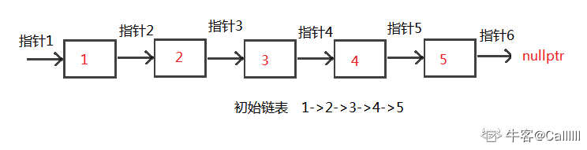
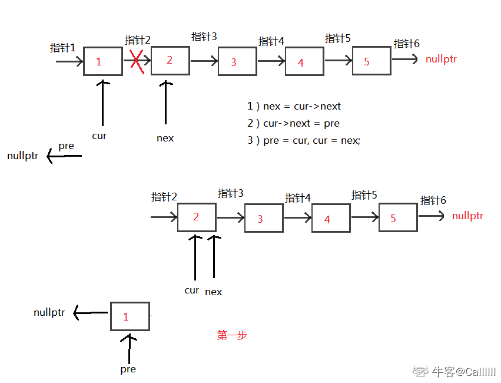
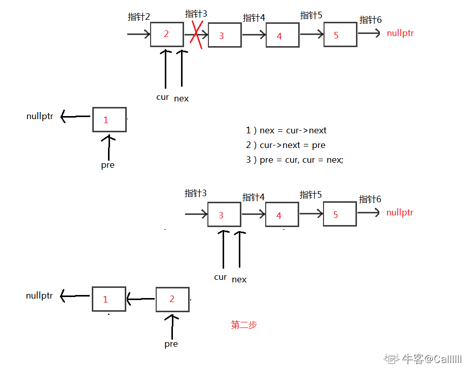
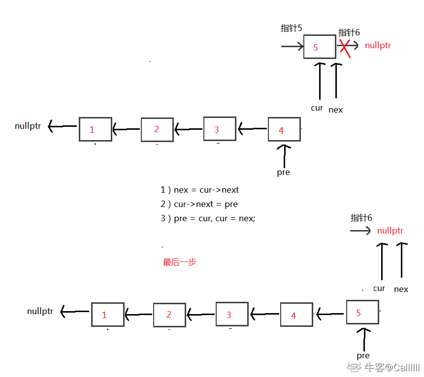
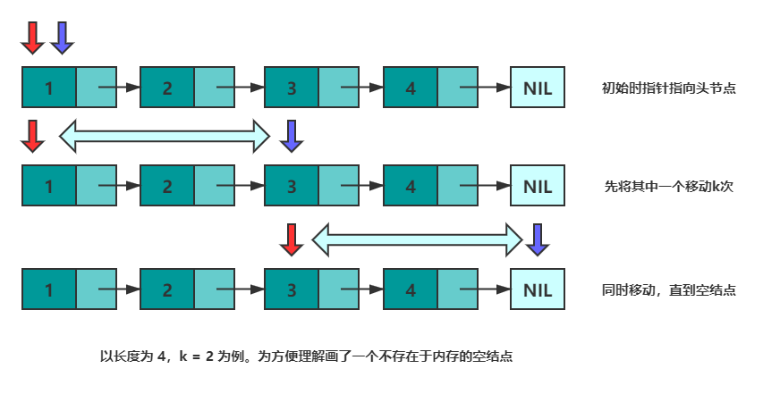
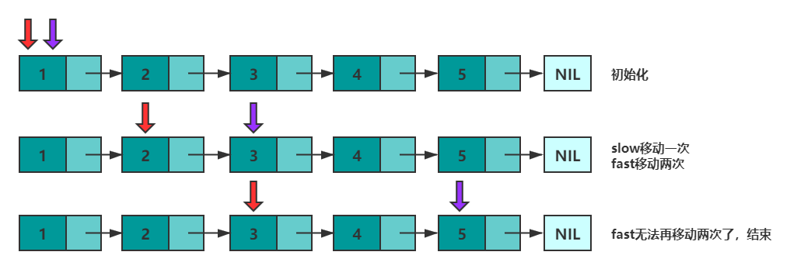
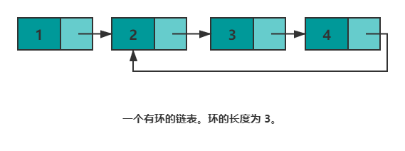
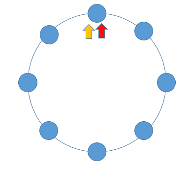

# 链表

⌚️:2020年11月30日

📚参考

---


## 1. 反转链表

题目：输入一个链表，反转链表后，输出新链表的表头

示例1

输入

```
{1,2,3}
```

返回值

```
{3,2,1}
```


### 方法一：构造链表

如果此类型的题出现在笔试中，如果内存要求不高，可以采用如下方法：
可以先用一个vector将单链表的指针都存起来，然后再构造链表。
此方法简单易懂，代码好些。

**代码：**

```
class Solution {
public:
    ListNode* ReverseList(ListNode* pHead) {
        if (!pHead) return nullptr;
        vector<ListNode*> v;
        while (pHead) {
            v.push_back(pHead);
            pHead = pHead->next;
        }
        reverse(v.begin(), v.end()); // 反转vector，也可以逆向遍历
        ListNode *head = v[0];
        ListNode *cur = head;
        for (int i=1; i<v.size(); ++i) { // 构造链表
            cur->next = v[i]; // 当前节点的下一个指针指向下一个节点
            cur = cur->next; // 当前节点后移
        }
        cur->next = nullptr; // 切记最后一个节点的下一个指针指向nullptr
        return head;
    }
};


```

时间复杂度：O(n)
空间复杂度：O(n), 用了一个vector来存单链表

### 方法二：正规解法

但是面试的时候，上一种解法当然不行。此题想考察的是：如何调整链表指针，来达到反转链表的目的。
初始化：3个指针

1）pre指针指向已经反转好的链表的最后一个节点，最开始没有反转，所以指向nullptr

2）cur指针指向待反转链表的第一个节点，最开始第一个节点待反转，所以指向head

3）nex指针指向待反转链表的第二个节点，目的是保存链表，因为cur改变指向后，后面的链表则失效了，所以需要保存

接下来，循环执行以下三个操作

1）nex = cur->next, 保存作用

2）cur->next = pre 未反转链表的第一个节点的下个指针指向已反转链表的最后一个节点

3）pre = cur， cur = nex; 指针后移，操作下一个未反转链表的第一个节点

循环条件，当然是cur != nullptr

循环结束后，cur当然为nullptr，所以返回pre，即为反转后的头结点

这里以1->2->3->4->5 举例：













中间都是重复步骤，省略了。。。

------

**代码**

```
class Solution {
public:
    ListNode* ReverseList(ListNode* pHead) {
        ListNode *pre = nullptr;
        ListNode *cur = pHead;
        ListNode *nex = nullptr; // 这里可以指向nullptr，循环里面要重新指向
        while (cur) {
            nex = cur->next;
            cur->next = pre;
            pre = cur;
            cur = nex;
        }
        return pre;
    }
};
```

时间复杂度：O(n), 遍历一次链表
空间复杂度：O(1)


## 2. 相爱相杀好基友——数组与链表

**无法高效获取长度，无法根据偏移快速访问元素**，是链表的两个劣势。然而面试的时候经常碰见诸如**获取倒数第k个元素，获取中间位置的元素，判断链表是否存在环，判断环的长度等和长度与位置有关**的问题。这些问题都可以通过灵活运用双指针来解决。


Tips：双指针并不是固定的公式，而是一种思维方式~

### 1. 获取倒数第k个元素

先来看"倒数第k个元素的问题"。设有两个指针 p 和 q，初始时均指向头结点。首先，先让 p 沿着 next 移动 k 次。此时，p 指向第 k+1个结点，q 指向头节点，两个指针的距离为 k 。然后，同时移动 p 和 q，直到 p 指向空，此时 q 即指向倒数第 k 个结点。可以参考下图来理解：



```c
class Solution {
public:
    ListNode* getKthFromEnd(ListNode* head, int k) {
        ListNode *p = head, *q = head; //初始化
        while(k--) {   //将 p指针移动 k 次
            p = p->next;
        }
        while(p != nullptr) {//同时移动，直到 p == nullptr
            p = p->next;
            q = q->next;
        }
        return q;
    }
};
```


### 2. 获取中间元素的问题

获取中间元素的问题。设有两个指针 fast 和 slow，初始时指向头节点。每次移动时，fast向后走两次，slow向后走一次，直到 fast 无法向后走两次。这使得在每轮移动之后。fast 和 slow 的距离就会增加一。设链表有 n 个元素，那么最多移动 n/2 轮。当 n 为奇数时，slow 恰好指向中间结点，当 n 为 偶数时，slow 恰好指向中间两个结点的靠前一个(可以考虑下如何使其指向后一个结点呢？)。




下述代码实现了 n 为**偶数**时慢指针指向**靠后结点**。

```c
class Solution {
public:
    ListNode* middleNode(ListNode* head) {
        ListNode *p = head, *q = head;
        while(q != nullptr && q->next != nullptr) {
            p = p->next;
            q = q->next->next;
        }
        return p;
    } 
};
```

### 3. 判断链表是否存在环

是否存在环的问题。如果将尾结点的 next 指针指向其他任意一个结点，那么链表就存在了一个环。



上一部分中，总结快慢指针的特性 —— 每轮移动之后两者的距离会加一。下面会继续用该特性解决环的问题。

当一个链表有环时，快慢指针都会陷入环中进行无限次移动，然后变成了追及问题。想象一下在操场跑步的场景，只要一直跑下去，快的总会追上慢的。当两个指针都进入环后，每轮移动使得慢指针到快指针的距离增加一，同时快指针到慢指针的距离也减少一，只要一直移动下去，快指针总会追上慢指针。




根据上述表述得出，如果一个链表存在环，那么快慢指针必然会相遇。实现代码如下：

```c
class Solution {
public:
    bool hasCycle(ListNode *head) {
        ListNode *slow = head;
        ListNode *fast = head;
        while(fast != nullptr) {
            fast = fast->next;
            if(fast != nullptr) {
                fast = fast->next;
            }
            if(fast == slow) {
                return true;
            }
            slow = slow->next;
        }
        return nullptr;
    }
};
```

## 3.合并链表

将两个有序的链表合并为一个新链表，要求新的链表是通过拼接两个链表的节点来生成的，且合并后新链表依然有序。

```
示例1
输入

复制
{1},{2}
返回值

复制
{1,2}
示例2
输入

复制
{2},{1}
返回值

复制
{1,2}
```


```c
/**
 * struct ListNode {
 *	int val;
 *	struct ListNode *next;
 * };
 */

class Solution {
public:
    /**
     * 
     * @param l1 ListNode类 
     * @param l2 ListNode类 
     * @return ListNode类
     */
    ListNode* mergeTwoLists(ListNode* l1, ListNode* l2) {
        if(l1 == nullptr){
            return l2;
        } else if (l2 == nullptr) {
            return l1;
        }
        ListNode* ll1 = l1;
        ListNode* ll2 = l2;
        ListNode* res = nullptr;
        if(ll1->val < ll2->val){
            res = ll1;
            ll1 = ll1->next;
        } else {
            res = ll2;
            ll2 = ll2->next;
        }
        ListNode* head = res;
        while(ll1!=nullptr && ll2 != nullptr){
            if(ll1->val < ll2->val){
                res->next = ll1;
                ll1 = ll1->next;
            } else {
                res->next = ll2;
                ll2 = ll2->next;
            }
            res = res->next;
        }
        if(ll1 != nullptr){
            res->next = ll1;
        } else if (ll2 != nullptr) {
            res->next = ll2;
        }
        return head;
        // write code here
    }
};
```

