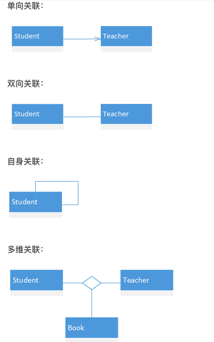
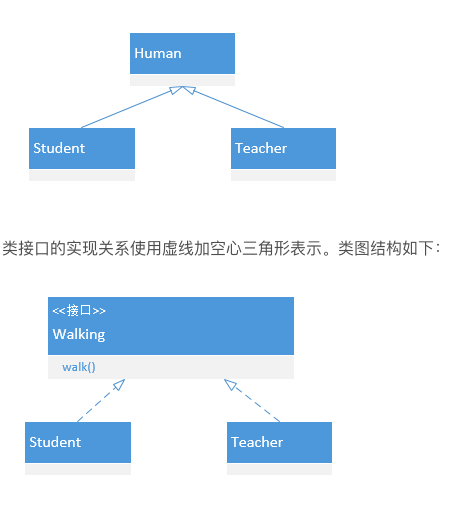

# 认识 UML 类关系——依赖、关联、聚合、组合、泛化

⌚️:2021年07月30日

📚参考

---

在学习面向对象设计时，类关系涉及依赖、关联、聚合、组合和泛化这五种关系，耦合度依次递增。关于耦合度，可以简单地理解为当一个类发生变更时，对其他类造成的影响程度，影响越小则耦合度越弱，影响越大耦合度越强。
下面根据个人理解，尝试讲解这五种类关系。

## 1.依赖（Dependency）

依赖关系使用虚线加箭头表示，如下图所示：


学生在学习生活中经常使用电脑，于是对电脑产生了依赖。依赖关系是五种关系中耦合最小的一种关系。类A要完成某个功能引用了类B，则类A依赖类B。依赖在代码中主要体现为类A的某个成员函数的返回值、形参、局部变量或静态方法的调用，则表示类A引用了类B。以Student类和Computer类为例，用C++语言编码如下：

```
class Computer {
public:
	static void start(){
		cout<<"电脑正在启动"<<endl;
	} 
};
class Student {
public:
	//返回值构成依赖
	Computer& program();
	//形参构成依赖
	void program(Computer&);
	void playGame() {
		//局部变量构成依赖
		Computer* computer=new Computer;
		...
		//静态方法调用构成依赖
		Computer::star();
	}
};

```

## 2.关联（Association）

关联关系使用实线加箭头表示，类之间的关系比依赖要强。学生与老师是关联的，学生可以不用电脑，但是学生不能没有老师。如下图所示：


关联与依赖的对比：
相似之处：
关联暗示了依赖，二者都用来表示无法用聚合和组合表示的关系。

**区别**：
（1）发生依赖关系的两个类都不会增加属性。其中的一个类作为另一个类的方法的参数或者返回值，或者是某个方法的变量而已。

发生关联关系的两个类，类A成为类B的属性，而属性是一种更为紧密的耦合，更为长久的持有关系。 在代码中的表现如下：

```
class Teacher;
class Student {
public:
	Teacher teacher;  //成员变量
	void study();
}	

```

（2）从关系的生命周期来看，依赖关系是仅当类的方法被调用时而产生，伴随着方法的结束而结束。关联关系当类实例化的时候产生，当类对象销毁的时候关系结束。相比依赖，关联关系的生存期更长。

关联关系有单向关联、双向关联、自身关联、多维关联等等。其中后三个可以不加箭头。



## 3.聚合（Aggregation）

聚合关系使用实线加空心菱形表示。聚合用来表示集体与个体之间的关联关系。例如班级与学生之间存在聚合关系，类图表示如下：


聚合关系在代码上与关联关系表现一致，类Student将成为类Classes的成员变量。代码如下：

```
class Student;
class Classes {
public:
    Student* student; 
	Classes(Student* stu):student(stu) {}
};

```

## 4.组合（复合，Composition）

复合关系使用实线加实心菱形表示。组合又叫复合，用来表示个体与组成部分之间的关联关系。例如学生与心脏之间存在复合关系，类图表示如下：


组合关系在代码上与关联关系表现一致，类Heart将成为类Student的成员变量。代码如下：

```
class Heart;
class Student {
public:
    Heart* heart; 
	Student() {
		heart=new Heart;
	}
	~Student() {
		delete heart;
	}
};

```

聚合与组合的对比：
（1）聚合关系没有组合紧密。
学生不会因为班级的解散而无法存在，聚合关系的类具有不同的生命周期；而学生如果没有心脏将无法存活，组合关系的类具有相同的生命周期。

这个从构造函数可以看出。聚合类的构造函数中包含另一个类的实例作为参数，因为构造函数中传递另一个类的实例，因此学生可以脱离班级体独立存在。组合类的构造函数包含另一个类的实例化。因为在构造函数中进行实例化，因此两者紧密耦合在一起，同生同灭，学生不能脱离心脏而存在。

（2）信息的封装性不同。
在聚合关系中，客户端可以同时了解Classes类和Student类，因为他们是独立的。

在组合关系中，客户端只认识Student类，根本不知道Heart类的存在，因为心脏类被严密地封装在学生类中。

理解聚合与复合的区别，主要在于聚合的成员可独立，复合的成员必须依赖于整体才有意义。

## 5.泛化（Generalization）

泛化是学术名称，通俗来讲，泛化指的是类与类之间的继承关系和类与接口之间的实现关系。

继承关系使用直线加空心三角形表示。类图结构如下：



## 6.小结

依赖、关联、聚合、组合与泛化代表类与类之间的耦合度依次递增。依赖关系实际上是一种比较弱的关联，聚合是一种比较强的关联，组合是一种更强的关联，泛化则是一种最强的关联，所以笼统的来区分的话，实际上这五种关系都是关联关系。

依赖关系比较好区分，它是耦合度最弱的一种，在编码中表现为类成员函数的局部变量、形参、返回值或对静态方法的调用。关联、聚合与组合在编码形式上都以类成员变量的形式来表示，所以只给出一段代码我们很难判断出是关联、聚合还是组合关系，我们需要从上下文语境中来判别。关联表示类之间存在联系，不存在集体与个体、个体与组成部分之间的关系。聚合表示类之间存在集体与个体的关系。组合表示个体与组成部分之间的关系。

依赖、关联、聚合与组合是逻辑上的关联，泛化是物理上的关联。物理上的关联指的是类体的耦合，所以类间耦合性最强。
