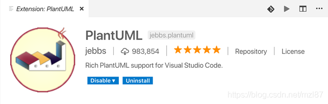
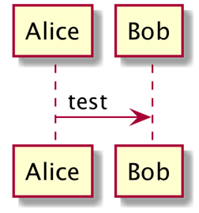
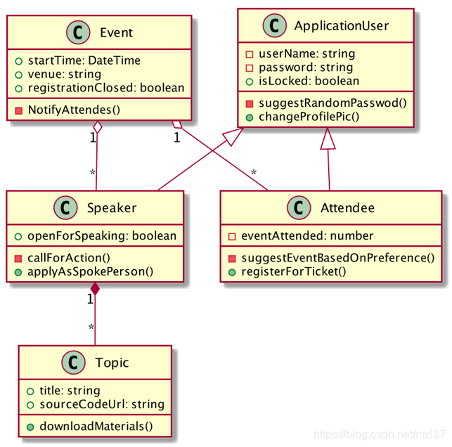
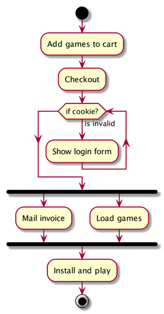
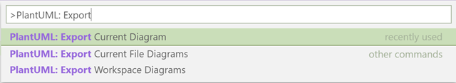

# VS Code + UMLPlant

⌚️:2021年07月30日

📚参考

- [Plant主页](https://plantuml.com/zh/)
- 

---

## 1. 介绍

UML代表统一建模语言。它是一种通用建模语言，用于标准化可视化软件系统体系结构的方法。它是由[格雷迪Booch](https://en.wikipedia.org/wiki/Grady_Booch)、[伊瓦尔·雅各布森](https://en.wikipedia.org/wiki/Ivar_Jacobson)和[詹姆斯·鲁博](https://en.wikipedia.org/wiki/James_Rumbaugh)在1994-1995年在[Rational软件](https://en.wikipedia.org/wiki/Rational_Software)公司开发。1997年晚些时候，该标准被采纳为行业标准。

UML是一种用广泛接受的图形符号表达软件组件设计的方法。在使用任何文本编程语言开始编写模型本身之前，拥有图形模型通常很好。稍后，该模型也可用于文档目的。UML的用处可以通过以下现实场景来描述：当我们加入新开发人员时，我们不希望他们阅读每一行代码并猜测它的全部内容; 我们想给他们一个整个系统的概述。同样，当我们希望他们处理某个功能时，我们不希望他们只是口头上的简要介绍; 我们希望它们具有所需特征的蓝图，因此使用UML图。

按照上面提到的方法可以缓解很多关于系统的麻烦和误解。在这个过程中，设计缺陷通常也会被捕获。

UML最初是在白板上的草图，具有最少量的细节，以便与团队成员进行设计讨论。在最终确定决策时，将相关草图放在更复杂的工具上，最终结果将作为程序员使用的蓝图。

## 2. 基本的UML类型

根据您的使用情况，有许多UML图可供选择。但是，它们被分类为**结构**和**行为** UML图集。

结构图反映了系统的结构，而行为图描述了系统在某些操作下的反应。总共有14个UML图表; 有些很重要，有些则不那么重要。它们如下......

### 2.1 结构UML图

- [类图](http://plantuml.com/class-diagram)
- [对象图](http://plantuml.com/object-diagram)
- [组件图](http://plantuml.com/component-diagram)
- [部署图](http://plantuml.com/deployment-diagram)
- 包图
- 复合结构图
- 部署图

### 2.2 行为UML图

- [用例图](http://plantuml.com/use-case-diagram)
- [活动图](http://plantuml.com/activity-diagram-beta)
- [序列图](http://plantuml.com/sequence-diagram)
- [状态图](http://plantuml.com/state-diagram)
- 通讯图
- [时序图](http://plantuml.com/timing-diagram)
- 交互概述图

### 2.3 ...

我们只会编写几个不同的代码。跟着你，你将通过编码图表找出我的意思。

## 3. 可用的建模工具

对于建模，简单的笔和纸可以做到这一点。但是，对于持久的文档和频繁的编辑目的，您可能希望寻找更多的专业级工具。工具的选择可以是桌面，在线或只是IDE（集成开发环境）插件的形式。有些人可能会要求您每月/每年订阅，而有些则是免费软件。一些众所周知的工具如下：

| ***\*产品\****                                               | ***\*平台\**** | ***\*定价模型\**** |
| ------------------------------------------------------------ | -------------- | ------------------ |
| [***\*Microsoft Visio\****](https://support.office.com/en-us/article/install-visio-f98f21e3-aa02-4827-9167-ddab5b025710) | 桌面/在线      | 共享软件           |
| [***\*draw.io\****](http://draw.io/)                         | 线上           | 免费软件           |
| [***\*LicidChart\****](https://www.lucidchart.com/)          | 线上           | 共享软件/免费软件  |
| [***\*PlantUML\****](http://plantuml.com/)***\*，\*******\*[\*\*Eclipse UML2\*\*](https://www.eclipse.org/modeling/mdt/downloads/?project=uml2tools)\**** | IDE插件/扩展   | 免费软件           |

## 4. PlantUML的救援

虽然Visio和[draw.io](http://draw.io/)看起来都是不错的选择，但是在免费试用期后需要几美元，而另一个需要持续的互联网连接。这就是为什么PlantUML听起来很棒，如果你刚开始并努力做了一个决定。

PlantUML承担了一些图表绘制的工作，有些不同。与从工具箱中拖放不同形状并连接它们不同，您可以根据伪编程语言表达图表。这种语言很容易理解，并且不需要花费太多时间来学习。

## 5. Visual Studio Code集成

PlantUML支持各种IDE集成。所有支持的IDE都列在PlantUML官方网站上，http://plantuml.com/running。

我们选择VS Code，因为它最近很热，而且没有停止它的迹象。在VS Code上安装PlantUML扩展之前，请确保您具有以下先决条件：

- [Java](https://www.java.com/en/download/)
- [GraphViz](https://www.graphviz.org/download/)

对于Windows用户，如果您有Chocolatey（Windows的包管理器），则可以使用以下命令简化安装过程：

```bash
choco install plantuml
```

您可以从“***\*扩展\*******\*”\****选项卡中搜索并安装PlantUML扩展。它可以在Visual Studio市场中使用。您也可以通过在Windows上按***\*Ctrl + Shift + P\****或在Mac上按***\*Command + Shift + P\****来使用VS Code命令面板，然后键入：

```bash
ext install plantuml
```



## 6. 编写少数模型

如前所述，在PlantUML中，我们使用伪编程语言来生成图表。此代码文件可以具有以下文件扩展名之一：

***\** .wsd\**** ***\*，\*******\** .pu\**** ***\*，\*******\** .puml\**** ***\*，\*******\** .plantuml\**** ***\*，\*******\** .iuml\****

要进行测试运行，请创建包含任何上述扩展名的文件并粘贴以下代码：

```bash
@startuml


scale 3


Alice -> Bob : test


@enduml
```

按***\*Alt + D\****或***\*Option + D\****可预览生成的图表。



**图2 在VS代码中使用PlantUML进行测试运行**

### 类图

类图表示系统中的对象以及它们之间的各种关系。这是您在设计系统时遇到的最常见的UML图。类包含的属性仅是字段、属性和操作，而这些属性只是简单的方法。属性和操作都有自己的可访问修饰符（可见性），用运算符表示，如（+， - ，〜，＃），例如+ field1表示类中有一个字段是public。

管理训练营的类图可能具有以下体系结构：



***\**图\**\******\**3\**\******\**：训练营管理的类图\**\***

相应的PlantUML伪代码如下：

```bash
@startuml


scale 2


class Event {


    +startTime: DateTime


    +venue: string


    +registrationClosed: boolean


    -notifyAttendes()


}


 


class ApplicationUser {


    -userName: string


    -password: string


    +isLocked: boolean


    -suggestRandomPasswod()


    +changeProfilePic()


}


 


class Speaker {


    +openForSpeaking: boolean


    -callForAction()


    +applyAsSpokePerson()


}


 


class Topic {


    +title: string


    +sourceCodeUrl: string


    +downloadMaterials()


}


 


class Attendee {


    -eventAttended: number


    -suggestEventBasedOnPreference()


    +registerForTicket()


}


 


ApplicationUser <|-- Speaker


ApplicationUser <|-- Attendee


Speaker "1" *-- "*" Topic


Event "1" o-- "*" Speaker


Event "1" o-- "*" Attendee


@enduml
```

图中的一些符号值得一提。它们以更表格的方式描述。

| ***\*图形符号\**** | ***\*PlantUML\*******\*表示法\**** | ***\*含义\**** |
| ------------------ | ---------------------------------- | -------------- |
| 空箭头             | <\|—                               | 泛化/继承      |
| 填充菱形箭头       | *—                                 | 组成           |
| 空菱形箭头         | o—                                 | 聚合           |

### 活动图

活动图广泛用于描述业务流程和工作流程。它看起来类似于流程图。但是，它们支持顺序和并行行为。

活动图可以在垂直泳道中组织，也可以不组织。泳通道表示一个或多个参与者参与工作流程。在活动图中，完整的黑色圆圈表示过程的开始，而内部带有黑点的空心圆圈表示结束。多边形通常是决策阶段。水平条表示并行发生两个或多个动作。

在线游戏购买系统的活动图可以具有以下处理流程：



***\**图\**\******\**4\**\******\**：在线游戏购买过程的活动图\**\***

相应的PlantUML伪代码如下：

```bash
@startuml


scale 2


start


:Add games to cart;


:Checkout;


:Check cookie;


while (if cookie?) is (is invalid)


:Show login form;


endwhile


fork


:Mail invoice;


fork again


:Load games;


end fork


:Install and play;


stop


@enduml
```

### 导出文档

PlantUML支持将图表导出为不同的文件格式。以下是一些受支持的类型：

***\** .png\*******\*，\*******\** .svg\*******\*，\*******\** eps\*******\*，\*******\** .pdf\*******\*，\*******\** vdx\*******\*，\*******\**\*******\*。\*******\*xmi\*******\*，\*******\** scmi\*******\*，\*******\** html\*******\*，\*******\** .txt\*******\*，\*******\** .utxt\*******\*，\*******\** .latex\****



***\**图\**\******\**5\**\******\**：使用\**\******\**PlantUML\**\******\**从\**\******\**VS\**\******\**代码导出图表\**\***

默认导出位置设置为桌面。但是，下面的VS Code用户设置将确保伪代码和图表都与源代码目录一起存在于名为“docs”的文件夹中。

```bash
"plantuml.diagramsRoot": "docs/diagrams/src",


"plantuml.exportOutDir": "docs/diagrams/out"
```

您将获得如下导出结果：

```bash
Project Folder/  


    docs/        


       diagrams/            


           src/                


               architecture_overview.wsd            


           out/                


               architecture_overview.png
```

## 7. 结论

本文几乎没有涉及UML的内容。对UML的讨论很广泛，需要一些时间来学习。从顶层只讨论了几个图表，而重点更多地放在PlantUML而不是UML本身。建议进一步阅读以更好地理解UML的细节。以下书籍可以帮助您启动和运行：

- [学习UML 2.0：UML的实用介绍](https://www.amazon.com/_/dp/0596009828?tag=oreilly20-20)
- [UML Distilled：标准对象建模语言简介（第3版）](https://www.amazon.com/UML-Distilled-Standard-Modeling-Language/dp/0321193687)

 