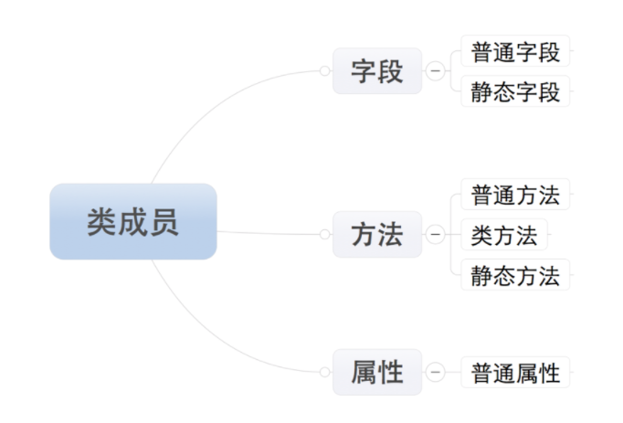

# 详解类class的方法：实例方法、类方法、静态方法

⌚️:2020年11月30日

📚参考

---

## 1. 概念

##### 类的成员

python中类的成员可以分为三大类：字段、方法和属性




##### 类的方法

包括：普通方法、静态方法和类方法，三种方法在内存中都归属于类，区别在于调用方式不同

- 普通方法：由对象调用；至少一个self参数；执行普通方法时，自动将调用该方法的对象赋值给self；
- 类方法：由类调用； 至少一个cls参数；执行类方法时，自动将调用该方法的类复制给cls；
- 静态方法：由类调用；无默认参数；

三者相同点：对于所有的方法而言，均属于类（非对象）中，所以，在内存中也只保存一份
三者不同点：方法调用者不同、调用方法时自动传入的参数不同

**普通方法是最常见的方法，大家都比较熟悉。本文要讨论的是类方法和静态方法**


**在一个类中，可能出现三种方法，实例方法、静态方法和类方法，下面来看看三种方法的不同：**

**1、实例方法**

- 实例方法的**第一个参数必须是”self”**，实例方法只能通过类实例进行调用，这时候**“self”就代表这个类实例本身**。**通过”self”可以直接访问实例的属性**。

```
class person(object):
    tall = 180
    hobbies = []
    def __init__(self, name, age,weight):
        self.name = name
        self.age = age
        self.weight = weight
    def infoma(self):
        print('%s is %s weights %s'%(self.name,self.age,self.weight))


Bruce = person("Bruce", 25,180)
Bruce.infoma()
```

输出：

```
Bruce is 25 weights 1801
```

**2、类方法**

- 类方法**以cls作为第一个参数**，**cls表示类本身**，定义时**使用@classmethod装饰器**。通过cls可以访问类的相关属性。

```
class person(object):

    tall = 180
    hobbies = []
    def __init__(self, name, age,weight):
        self.name = name
        self.age = age
        self.weight = weight
    @classmethod     #类的装饰器
    def infoma(cls):   #cls表示类本身，使用类参数cls
        print(cls.__name__)
        print(dir(cls))
#cls表示类本身
#person.infoma()  直接调用类的装饰器函数，通过cls可以访问类的相关属性
Bruce = person("Bruce", 25,180)   #也可以通过两步骤来实现，第一步实例化person，第二步调用装饰器
Bruce.infoma() 
```

代码的输出为，从这段代码可以看到，**类方法可以通过类名访问，也可以通过实例访问**：

```
person
['__class__', '__delattr__', '__dict__', '__dir__', '__doc__', '__eq__', '__format__', '__ge__', '__getattribute__', '__gt__', '__hash__', '__init__', '__le__', '__lt__', '__module__', '__ne__', '__new__', '__reduce__', '__reduce_ex__', '__repr__', '__setattr__', '__sizeof__', '__str__', '__subclasshook__', '__weakref__', 'hobbies', 'infoma', 'tall']
person
['__class__', '__delattr__', '__dict__', '__dir__', '__doc__', '__eq__', '__format__', '__ge__', '__getattribute__', '__gt__', '__hash__', '__init__', '__le__', '__lt__', '__module__', '__ne__', '__new__', '__reduce__', '__reduce_ex__', '__repr__', '__setattr__', '__sizeof__', '__str__', '__subclasshook__', '__weakref__', 'hobbies', 'infoma', 'tall']1234
```

**3、静态方法**

- 与实例方法和类方法不同，静态方法没有参数限制，既不需要实例参数，也不需要类参数，定义的时候使用@staticmethod装饰器。
- 同类方法一样，静态法可以通过类名访问，也可以通过实例访问。

```
class person(object):

    tall = 180
    hobbies = []
    def __init__(self, name, age,weight):
        self.name = name
        self.age = age
        self.weight = weight
    @staticmethod    #静态方法装饰器
    def infoma():     #没有参数限制，既不要实例参数，也不用类参数
        print(person.tall)
        print(person.hobbies)
#person.infoma()   #静态法可以通过类名访问
Bruce = person("Bruce", 25,180)   #通过实例访问
Bruce.infoma()
```

**这三种方法的主要区别在于参数，实例方法被绑定到一个实例，只能通过实例进行调用；但是对于静态方法和类方法，可以通过类名和实例两种方式进行调用。**


## 2. 定义和调用

##### 定义

```python
class Foo():
    def __init__(self, name):
        self.name = name
    
    def bar(self):
        """
        定义普通方法：至少需要一个参数self
        """
        print('Hello,{}'.format(self.name))

    @classmethod
    def class_foo(cls, x):
        """
        定义类方法：至少需要一个cls参数
        """
        print('Executing class_foo({}， {})'.format(cls, x))

    @staticmethod
    def static_foo(x):
        """
        定义静态方法：无默认参数
        """
        print('Executing static_foo({})'.format(x))
```

在定义上静态方法staticmethod和类方法classmethod需要分别使用装饰器@staticmethod、@classmethod

##### 调用

*普通方法*在调用之前需要先对类进行实例化。调用方法：**实例名.方法名()**


```bash
In [2]: foo = Foo('bar')

In [3]: foo.bar()
Hello,bar
```

*类方法*可直接使用**类名.方法名()**调用。调用方法：**类名.方法名()**或者**实例名.方法名()**


```kotlin
In [4]: foo.class_foo(1)
Executing class_foo(<class '__main__.Foo'>， 1)

In [5]: Foo.class_foo(1)
Executing class_foo(<class '__main__.Foo'>， 1)
```

*静态方法*的也可直接使用**类名.方法名()**调用。调用方法：**类名.方法名()**或者**实例名.方法名()**


```css
In [6]: foo.static_foo(1)Executing static_foo(1)In [7]: Foo.static_foo(1)Executing static_foo(1)
```

## 3. 两者的不同

##### @classmethod

如果我们想创建一个在类中（而不是在实例中）运行的方法，我们可以这样做：


```python
def iget_no_of_instance(ins_obj):    return ins_obj.__class__.no_inst class Kls(object):    no_inst = 0     def __init__(self):    Kls.no_inst = Kls.no_inst + 1 ik1 = Kls()ik2 = Kls()print iget_no_of_instance(ik1)
```

在Python2.2以后可以使用@classmethod装饰器来创建类方法.


```python
class Kls(object):    no_inst = 0     def __init__(self):        Kls.no_inst = Kls.no_inst + 1     @classmethod    def get_no_of_instance(cls_obj):        return cls_obj.no_inst ik1 = Kls()ik2 = Kls() print ik1.get_no_of_instance()print Kls.get_no_of_instance()
```

使用@classmethod的好处是：无论我们是从类中还是从实例中调用方法，都会将**类**传给第一个参数。

##### @staticmethod

我们经常需要用到一些和类有关的功能，但又无需类或实例参与——例如如设置环境变量，改变另外一个类的属性等。在这些情况下，我们也可以直接使用函数，但这样做的话会将相关的代码块分开，导致后期的维护问题。
简单的例子如下：


```ruby
def checkind():    return (IND == 'ON') class Kls(object):     def __init__(self,data):        self.data = data     def do_reset(self):        if checkind():            print('Reset done for:', self.data)         def set_db(self):        if checkind():            self.db = 'new db connection'            print('DB connection made for:',self.data)
```

得到的输出：


```bash
Reset done for: 12DB connection made for: 12
```

如果我们使用@staticmethod，我们可以将所有代码放在同一个代码块里：


```ruby
IND = 'ON' class Kls(object):    def __init__(self, data):        self.data = data     @staticmethod    def checkind():        return (IND == 'ON')     def do_reset(self):        if self.checkind():            print('Reset done for:', self.data)     def set_db(self):        if self.checkind():            self.db = 'New db connection'        print('DB connection made for: ', self.data) ik1 = Kls(12)ik1.do_reset()ik1.set_db()
```

输出：


```bash
Reset done for: 12DB connection made for: 12
```


