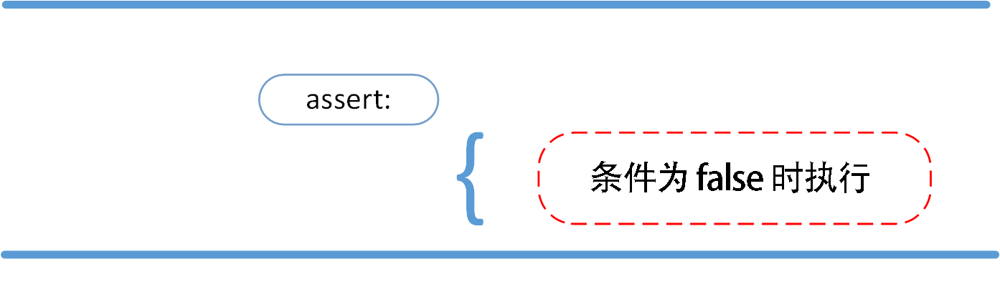
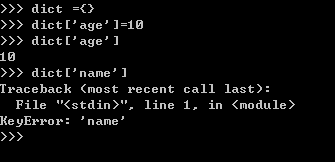
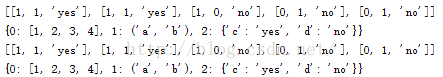

# Python中函数们

⌚️:2020年11月30日

📚参考

---


## 1. 查看变量的类型，内存地址，所占字节的大小

**查看变量的类型**

```python
#利用内置type()函数
>>> nfc=["Packers","49"]
>>> afc=["Ravens","48"]
>>> combine=zip(nfc,afc)
>>> type(combine)
<class 'zip'>
```

**查看变量的内存地址**

```
#利用内置函数id(),是以十进制显示
>>> id(nfc)
2646554913160
>>> id(afc)
2646554913544
```

**查看变量所占字节的大小**

```
>>> import sys
>>> print(sys.getsizeof(combine))
64
>>> print(sys.getsizeof(nfc))
80
>>> print(sys.getsizeof(afc))
80
```

## 2. Python 字符串前面加u,r,b,f的含义

2020年7月30日

---

**1、字符串前加 u**

例：u"我是含有中文字符组成的字符串。"

作用：

后面字符串以 Unicode 格式 进行编码，一般用在中文字符串前面，防止因为源码储存格式问题，导致再次使用时出现乱码。

 

**2、字符串前加 r**

例：r"\n\n\n\n”　　# 表示一个普通生字符串 \n\n\n\n，而不表示换行了。

作用：

去掉反斜杠的转移机制。

（特殊字符：即那些，反斜杠加上对应字母，表示对应的特殊含义的，比如最常见的”\n”表示换行，”\t”表示Tab等。 ）

应用：

常用于正则表达式，对应着re模块。

 

**3、字符串前加 b**

例: response = b'<h1>Hello World!</h1>'   # b' ' 表示这是一个 bytes 对象

作用：

b" "前缀表示：后面字符串是bytes 类型。

用处：

网络编程中，服务器和浏览器只认bytes 类型数据。

如：*send 函数的参数和 recv 函数的返回值都是 bytes 类型*

附：

在 Python3 中，bytes 和 str 的互相转换方式是
str.encode('utf-8')
bytes.decode('utf-8')


**4、字符串前加 f**

import time
t0 = time.time()
time.sleep(1)
name = 'processing'

`*# 以 **f**开头表示在字符串内支持大括号内的python 表达式*`
print(f'{name} done in {time.time() - t0:.2f} s') 

**输出：**
processing done in 1.00 s

 python split()与strip()的区别


## 3. split()

Python **split()** 通过指定分隔符对字符串进行切片，如果参数 num 有指定值，则分隔 num+1 个子字符串

**1.1 split() 方法语法：**

```
str.split(str="", num=string.count(str))
```

**参数解释：**

- str -- 分隔符，默认为所有的空字符，包括空格、换行(\n)、制表符(\t)等。
- num -- 分割次数。默认为 -1, 即分隔所有。

**返回值：**

返回分割后的字符串列表。


1.2 举例：

```python
#!/usr/bin/python
# -*- coding: UTF-8 -*-


str = "Line1-abcdef \nLine2-abc \nLine4-abcd";
print str.split( );       # 以空格为分隔符，包含 \n
print str.split(' ', 1 ); # 以空格为分隔符，分隔成两个
```

输出结果为：

```python
['Line1-abcdef', 'Line2-abc', 'Line4-abcd']
['Line1-abcdef', '\nLine2-abc \nLine4-abcd']
```

以 # 号为分隔符，指定第二个参数为 1，返回两个参数列表。

```python
#!/usr/bin/python
# -*- coding: UTF-8 -*-


txt = "Google#Runoob#Taobao#Facebook"
# 第二个参数为 1，返回两个参数列表
x = txt.split("#", 1)
print x
```

输出结果为

```
['Google', 'Runoob#Taobao#Facebook']
```

## 4. strip()

Python strip() 方法用于移除字符串头尾指定的字符（默认为空格或换行符）或字符序列。

**注意：**该方法只能删除开头或是结尾的字符，不能删除中间部分的字符。

**2.1 strip()方法语法：**

```python
str.strip([chars])
```

**参数：**

- chars -- 移除字符串头尾指定的字符序列。

**返回值：**

返回移除字符串头尾指定的字符生成的新字符串。

**举例：**

```python
#!/usr/bin/python
# -*- coding: UTF-8 -*-


str = "00000003210Runoob01230000000"; 
print str.strip( '0' );  # 去除首尾字符 0

str2 = "   Runoob      ";   # 去除首尾空格
print str2.strip();
```

输出结果为

```python
3210Runoob0123
Runoob
```

从结果上看，可以注意到中间部分的字符并未删除。

以下例子演示了只要头尾包含有指定字符序列中的字符就删除：

```python
#!/usr/bin/python# -*- coding: UTF-8 -*-str = "123abcrunoob321"print (str.strip( '12' ))  # 字符序列为 12
```

输出结果为:

```python
3abcrunoob3
```

## 5. glob()函数的作用和用法

glob是python自己带的一个文件操作相关模块，用它可以查找符合自己目的的文件，类似于Windows下的文件搜索，支持通配符操作，*,?,[]这三个通配符，*代表0个或多个字符，?代表一个字符，[]匹配指定范围内的字符，如[0-9]匹配数字。两个主要方法如下。

**1. glob方法：**

glob模块的主要方法就是glob,该方法返回所有匹配的文件路径**列表**（list）；该方法需要一个参数用来指定匹配的路径字符串（字符串可以为绝对路径也可以为相对路径），其返回的文件名只包括当前目录里的文件名，不包括子文件夹里的文件。

比如：

```
glob.glob(r’c:*.txt’)
```

我这里就是获得C盘下的所有txt文件

```
glob.glob(r’E:\pic**.jpg’)
```

获得指定目录下的所有jpg文件

使用**相对路径**：

glob.glob(r’../*.py’)

**2. iglob方法：**

获取一个**迭代器**（ iterator ）对象，使用它可以逐个获取匹配的文件路径名。与glob.glob()的区别是：glob.glob同时获取所有的匹配路径，而 glob.iglob一次只获取一个匹配路径。下面是一个简单的例子：

**#父目录中所有的.py文件**

```
f = glob.iglob(r'../*.py')
print f
<generator object iglob at 0x00B9FF80>

for py in f:
    print py
```

f是一个迭代器对象，通过遍历，可以输出所有满足条件的*.py文件

官方说明：

```
glob.glob(pathname)

Return a possibly-empty list of path names that match pathname, which must be a string containing a path specification. pathname can be either absolute (like /usr/src/Python-1.5/Makefile) or relative (like http://www.cnblogs.com/Tools/*/*.gif), and can contain shell-style wildcards. Broken symlinks are included in the results (as in the shell).


glob.iglob(pathname)

Return an iterator which yields the same values as glob() without actually storing them all simultaneously.

New in version 2.5.
```

For example, consider a directory containing only the following files: 1.gif, 2.txt, andcard.gif. glob() will produce the following results. Notice how any leading components of the path are preserved.

```
>>> import glob
>>> glob.glob('./[0-9].*')
['./1.gif', './2.txt']

>>> glob.glob('*.gif')
['1.gif', 'card.gif']

>>> glob.glob('?.gif')
['1.gif']
```

## 6. easydict的简单使用

写在前面：当遇到一个陌生的python第三方库时，可以去pypi这个主页查看描述以迅速入门！
或者

```python
import time
dir（time）
```


easydict的作用：**可以使得以属性的方式去访问字典的值**！

```python
>>> from easydict import EasyDict as edict
>>> d = edict({'foo':3, 'bar':{'x':1, 'y':2}})
>>> d.foo
3
>>> d.bar.x
1
>>> d = edict(foo=3)
>>> d.foo
3
```

解析json目录时很有用

```python
>>> from easydict import EasyDict as edict
>>> from simplejson import loads
>>> j = """{
"Buffer": 12,
"List1": [
    {"type" : "point", "coordinates" : [100.1,54.9] },
    {"type" : "point", "coordinates" : [109.4,65.1] },
    {"type" : "point", "coordinates" : [115.2,80.2] },
    {"type" : "point", "coordinates" : [150.9,97.8] }
]
}"""

>>> d = edict(loads(j))
>>> d.Buffer
12
>>> d.List1[0].coordinates[1]
54.9
```

也可以这样用

```html
>>> d = EasyDict()
>>> d.foo = 3
>>> d.foo
3
>>> d = EasyDict(log=False)
>>> d.debug = True
>>> d.items()
[('debug', True), ('log', False)]
```


```html
>>> class Flower(EasyDict):
...     power = 1
...

>>> f = Flower({'height': 12})
>>> f.power
1
>>> f['power']
1
```

## 7. dir()和vars()的区别

dir():默认打印当前模块的所有属性，如果传一个对象参数则打印当前对象的属性

vars():默认打印当前模块的所有属性，如果传一个对象参数则打印当前对象的属性


vars():函数以字典形式返回参数中每个成员的当前值，如果vars函数没有带参数,那么它会返回包含当前局部命名空间中所有成员的当前值的一个字典。

\>>> help(vars)
Help on built-in function vars in module __builtin__:
vars(...)
  vars([object]) -> dictionary 
  Without arguments, equivalent to locals().
  With an argument, equivalent to object.__dict__.

**dir()和vars()的区别就是：dir()只打印属性，vars()则打印属性与属性的值。**


```python
a='abcdefg'
class B():
    c='djfj'
 
print dir()
print vars()
print dir(B)
print vars(B)
```

结果：
['B', '__builtins__', '__doc__', '__file__', '__name__', '__package__', 'a']
{'a': 'abcdefg', 'B': <class __main__.B at 0x02A2DD88>, '__builtins__': <module '__builtin__' (built-in)>, '__file__': 'E:\\workspace\\python day03\\main\\test.py', '__package__': None, '__name__': '__main__', '__doc__': None}
['__doc__', '__module__', 'c']
{'__module__': '__main__', 'c': 'djfj', '__doc__': None}


```python
>>> class C(object):
	    f=2
 
	
>>> dir(C)
['__class__', '__delattr__', '__dict__', '__doc__', '__format__', '__getattribute__', '__hash__', '__init__', '__module__', '__new__', '__reduce__', '__reduce_ex__', '__repr__', '__setattr__', '__sizeof__', '__str__', '__subclasshook__', '__weakref__', 'f']
>>> vars(C)
dict_proxy({'__dict__': <attribute '__dict__' of 'C' objects>, '__module__': '__main__', '__weakref__': <attribute '__weakref__' of 'C' objects>, '__doc__': None, 'f': 2})
>>> C.__dict__
dict_proxy({'__dict__': <attribute '__dict__' of 'C' objects>, '__module__': '__main__', '__weakref__': <attribute '__weakref__' of 'C' objects>, '__doc__': None, 'f': 2})
>>> c=C()
>>> dir(c)
['__class__', '__delattr__', '__dict__', '__doc__', '__format__', '__getattribute__', '__hash__', '__init__', '__module__', '__new__', '__reduce__', '__reduce_ex__', '__repr__', '__setattr__', '__sizeof__', '__str__', '__subclasshook__', '__weakref__', 'f']
>>> vars(c)
{}
>>> c.__dict__
{}
>>> 


```

## 8. Python3 assert（断言）

Python assert（断言）用于判断一个表达式，在表达式条件为 false 的时候触发异常。

断言可以在条件不满足程序运行的情况下直接返回错误，而不必等待程序运行后出现崩溃的情况，例如我们的代码只能在 Linux 系统下运行，可以先判断当前系统是否符合条件。



语法格式如下：

```
assert expression
```

等价于：

```
if not expression:
    raise AssertionError
```

assert 后面也可以紧跟参数:

```
assert expression [, arguments]
```

等价于：

```
if not expression:
    raise AssertionError(arguments)
```

以下为 assert 使用实例：

\>>> **assert** True   # 条件为 true 正常执行
\>>> **assert** False   # 条件为 false 触发异常
Traceback (most recent call last):
 File "<stdin>", line 1, **in** <module>
AssertionError
\>>> **assert** 1\=\=1   # 条件为 true 正常执行
\>>> **assert** 1\==2   # 条件为 false 触发异常
Traceback (most recent call last):
 File "<stdin>", line 1, **in** <module>
AssertionError

\>>> **assert** 1==2, '1 不等于 2'
Traceback (most recent call last):
 File "<stdin>", line 1, **in** <module>
AssertionError: 1 不等于 2
\>>> 

以下实例判断当前系统是否为 Linux，如果不满足条件则直接触发异常，不必执行接下来的代码：

**实例**

**import** sys
**assert** ('linux' **in** sys.platform), "该代码只能在 Linux 下执行"

\# 接下来要执行的代码

## 9. filter

**描述**

**filter()** 函数用于过滤序列，过滤掉不符合条件的元素，返回由符合条件元素组成的新列表。

该接收两个参数，第一个为函数，第二个为序列，序列的每个元素作为参数传递给函数进行判断，然后返回 True 或 False，最后将返回 True 的元素放到新列表中。

**语法**

以下是 filter() 方法的语法:

```
filter(function, iterable)
```

**参数**

- function -- 判断函数。
- iterable -- 可迭代对象。

**返回值**

返回列表。

------

**实例**

以下展示了使用 filter 函数的实例：

```
## 过滤出列表中的所有奇数：

#!/usr/bin/python 
# -*- coding: UTF-8 -*-  
def is_odd(n):    
		return n % 2 == 1  
		
newlist = filter(is_odd, [1, 2, 3, 4, 5, 6, 7, 8, 9, 10]) 
print(newlist)
```

输出结果 ：

```
[1, 3, 5, 7, 9]
```

```
## 过滤出1~100中平方根是整数的数：

#!/usr/bin/python 
# -*- coding: UTF-8 -*-  
import math 
def is_sqr(x):
		return math.sqrt(x) % 1 == 0  
		
newlist = filter(is_sqr, range(1, 101)) 
print(newlist)
```

输出结果 ：

```
[1, 4, 9, 16, 25, 36, 49, 64, 81, 100]
```


## 10. defaultdict

**认识defaultdict：**

当我使用普通的字典时，用法一般是dict={},添加元素的只需要dict[element] =value即，调用的时候也是如此，dict[element] = xxx,但前提是element字典里，如果不在字典里就会报错，如：



这时defaultdict就能排上用场了，defaultdict的作用是在于，当字典里的key不存在但被查找时，返回的不是keyError而是一个默认值，这个默认值是什么呢，下面会说


**如何使用defaultdict**

defaultdict接受一个工厂函数作为参数，如下来构造：

```undefined
dict =defaultdict( factory_function)
```

这个factory_function可以是list、set、str等等，作用是当key不存在时，返回的是工厂函数的默认值，比如list对应[ ]，str对应的是空字符串，set对应set( )，int对应0，如下举例：

```dart
from collections import defaultdict

dict1 = defaultdict(int)
dict2 = defaultdict(set)
dict3 = defaultdict(str)
dict4 = defaultdict(list)
dict1[2] ='two'

print(dict1[1])
print(dict2[1])
print(dict3[1])
print(dict4[1])
```

输出：

```csharp
0
set()

[]
```

## 11. python之platform模块

python中，platform模块给我们提供了很多方法去获取操作系统的信息 如：

```python
import platform
platform.platform() #获取操作系统名称及版本号，'Windows-7-6.1.7601-SP1'
platform.version() #获取操作系统版本号，'6.1.7601'
platform.architecture() #获取操作系统的位数，('32bit', 'WindowsPE')
platform.machine() #计算机类型，'x86'
platform.node() #计算机的网络名称，'hongjie-PC'
platform.processor() #计算机处理器信息，'x86 Family 16 Model 6 Stepping 3, AuthenticAMD'
platform.uname() #包含上面所有的信息汇总，uname_result(system='Windows', node='hongjie-PC', release='7', version='6.1.7601', machine='x86', processor='x86 Family 16 Model 6 Stepping 3, AuthenticAMD')
```

还可以获得计算机中python的一些信息：

```python
import platform
platform.python_build()
platform.python_compiler()
platform.python_branch()
platform.python_implementation()
platform.python_revision()
platform.python_version()
platform.python_version_tuple()
#global var
#是否显示日志信息
SHOW_LOG = True

def get_platform():
'''获取操作系统名称及版本号'''
	return platform.platform()

def get_version():
'''获取操作系统版本号'''
	return platform.version()

def get_architecture():
'''获取操作系统的位数'''
	return platform.architecture()

def get_machine():
'''计算机类型'''
	return platform.machine()

def get_node():
'''计算机的网络名称'''
	return platform.node()

def get_processor():
'''计算机处理器信息'''
	return platform.processor()

def get_system():
'''获取操作系统类型'''
	return platform.system()

def get_uname():
'''汇总信息'''
	return platform.uname()

def get_python_build():
''' the Python build number and date as strings'''
	return platform.python_build()

def get_python_compiler():
'''Returns a string identifying the compiler used for compiling Python'''
	return platform.python_compiler()

def get_python_branch():
'''Returns a string identifying the Python implementation SCM branch'''
	return platform.python_branch()

def get_python_implementation():
'''Returns a string identifying the Python implementation. Possible return values are: ‘CPython’, ‘IronPython’, ‘Jython’, ‘PyPy’.'''
	return platform.python_implementation()

def get_python_version():
'''Returns the Python version as string 'major.minor.patchlevel''''
	return platform.python_version()

def get_python_revision():
'''Returns a string identifying the Python implementation SCM revision.'''
	return platform.python_revision()

def get_python_version_tuple():
'''Returns the Python version as tuple (major, minor, patchlevel) of strings'''
	return platform.python_version_tuple()

def show_python_all_info():
'''打印python的全部信息'''
	print('The Python build number and date as strings : [{}]'.format(get_python_build()))
	print('Returns a string identifying the compiler used for compiling Python : [{}]'.format(get_python_compiler()))
	print('Returns a string identifying the Python implementation SCM branch : [{}]'.format(get_python_branch()))
	print('Returns a string identifying the Python implementation : [{}]'.format(get_python_implementation()))
	print('The version of Python ： [{}]'.format(get_python_version()))
	print('Python implementation SCM revision : [{}]'.format(get_python_revision()))
	print('Python version as tuple : [{}]'.format(get_python_version_tuple()))
	
def show_python_info():
'''只打印python的信息，没有解释部分'''
	print(get_python_build())
	print(get_python_compiler())
	print(get_python_branch())
	print(get_python_implementation())
	print(get_python_version())
	print(get_python_revision())
	print(get_python_version_tuple())

def show_os_all_info():
'''打印os的全部信息'''
print('获取操作系统名称及版本号 : [{}]'.format(get_platform()))
print('获取操作系统版本号 : [{}]'.format(get_version()))
print('获取操作系统的位数 : [{}]'.format(get_architecture()))
print('计算机类型 : [{}]'.format(get_machine()))
print('计算机的网络名称 : [{}]'.format(get_node()))
print('计算机处理器信息 : [{}]'.format(get_processor()))
print('获取操作系统类型 : [{}]'.format(get_system()))
print('汇总信息 : [{}]'.format(get_uname()))
def show_os_info():
'''只打印os的信息，没有解释部分'''
	print(get_platform())
	print(get_version())
	print(get_architecture())
	print(get_machine())
	print(get_node())
	print(get_processor())
	print(get_system())
	print(get_uname())

def test():
		print('操作系统信息:')
if SHOW_LOG:
	show_os_all_info()
else:
	show_os_info()
print('#' * 50)
print('计算机中的python信息：')
if SHOW_LOG:
	show_python_all_info()
else:
	show_python_info()

def init():
global SHOW_LOG
SHOW_LOG = True

def main():
	init()
	test()
if __name__ == '__main__':
	main()
```

## 12. Pickle

在机器学习中，我们常常需要把训练好的模型存储起来，这样在进行决策时直接将模型读出，而不需要重新训练模型，这样就大大节约了时间。Python提供的pickle模块就很好地解决了这个问题，它可以序列化对象并保存到磁盘中，并在需要的时候读取出来，任何对象都可以执行序列化操作。


Pickle模块中最常用的函数为：

#### （1）pickle.dump(obj, file, [,protocol])

​    函数的功能：将obj对象序列化存入已经打开的file中。

​    参数讲解：

- obj：想要序列化的obj对象。
- file:文件名称。
- protocol：序列化使用的协议。如果该项省略，则默认为0。如果为负值或HIGHEST_PROTOCOL，则使用最高的协议版本。

#### （2）pickle.load(file)

​    函数的功能：将file中的对象序列化读出。

​    参数讲解：

- file：文件名称。

#### （3）pickle.dumps(obj[, protocol])

​    函数的功能：将obj对象序列化为string形式，而不是存入文件中。

​    参数讲解：

- obj：想要序列化的obj对象。
- protocal：如果该项省略，则默认为0。如果为负值或HIGHEST_PROTOCOL，则使用最高的协议版本。

#### （4）pickle.loads(string)

​    函数的功能：从string中读出序列化前的obj对象。

​    参数讲解：

- string：文件名称。

  【注】 dump() 与 load() 相比 dumps() 和 loads() 还有另一种能力**：**dump()函数能一个接着一个地将几个对象序列化存储到同一个文件中，随后调用load()来以同样的顺序反序列化读出这些对象。

####    【代码示例】

   pickleExample.py

```python
#coding:utf-8
__author__ = 'MsLili'

#pickle模块主要函数的应用举例

import pickle


dataList = [[1, 1, 'yes'],
            [1, 1, 'yes'],
            [1, 0, 'no'],
            [0, 1, 'no'],
            [0, 1, 'no']]

dataDic = { 0: [1, 2, 3, 4],
            1: ('a', 'b'),
            2: {'c':'yes','d':'no'}}

#使用dump()将数据序列化到文件中
fw = open('dataFile.txt','wb')

# Pickle the list using the highest protocol available.
pickle.dump(dataList, fw, -1)

# Pickle dictionary using protocol 0.
pickle.dump(dataDic, fw)

fw.close()

#使用load()将数据从文件中序列化读出
fr = open('dataFile.txt','rb')
data1 = pickle.load(fr)
print(data1)

data2 = pickle.load(fr)
print(data2)
fr.close()

#使用dumps()和loads()举例
p = pickle.dumps(dataList)
print( pickle.loads(p) )

p = pickle.dumps(dataDic)
print( pickle.loads(p) )
```


  结果为：




## 13. tqdm

2020年7月31日

---

**一、简介**

tqdm是Python中专门用于进度条美化的模块，通过在非while的循环体内嵌入tqdm，可以得到一个能更好展现程序运行过程的提示进度条，本文就将针对tqdm的基本用法进行介绍。

**二、基本用法**

**tqdm**:

tqdm中的tqdm()是实现进度条美化的基本方法，在for循环体中用tqdm()包裹指定的迭代器或range()即可，下面是两个简单的例子：

```javascript
from tqdm import tqdm
import time

text = ""
for char in tqdm(["a", "b", "c", "d"]):
    time.sleep(0.25)
    text = text + char
    
print(text)
```

```
100%|████████████████████████████████████████████████████████████████| 4/4 [00:01<00:00,  3.99it/s]
abcd

```


传入range()：

```javascript
for it in tqdm(range(10)):
    time.sleep(0.5)
```

```
100%|████████████████████████████████████████████████████████████████| 4/4 [00:01<00:00,  3.99it/s]
```


**trange**：

作为tqdm(range())的简洁替代，如下例：

```javascript
from tqdm import trange

for i in trange(100):
    time.sleep(0.01)
```

```
100%|████████████████████████████████████████████████████████████████| 4/4 [00:01<00:00,  3.99it/s]
```


 也可以使用一些较为高级的写法使得代码更简练，如下面两种写法，得到的效果相同：

```javascript
'''method 1'''
with tqdm(total=100) as pbar:
    for i in range(10):
        time.sleep(0.1)
        pbar.update(10)

'''method 2'''
pbar = tqdm(total=100)
for i in range(10):
    time.sleep(0.1)
    pbar.update(10)
pbar.close()
```

```
100%|████████████████████████████████████████████████████████████████| 4/4 [00:01<00:00,  3.99it/s]
```


**结合jupyter notebook**：

tqdm针对jupyter notebook添加了专门的进度条美化方法，使用tqdm_notebook()方法，下面是一个简单的例子：

```javascript
from tqdm import tqdm_notebookimport timefor i in tqdm_notebook(range(100),desc='demo：'):    time.sleep(0.01)
```

```
100%|████████████████████████████████████████████████████████████████| 4/4 [00:01<00:00,  3.99it/s]
```

## 14. python chain.from_iterable()


该函数chain.from_iterable()属于终止迭代器类别。此函数以单个iterable作为参数，并且输入iterable的所有元素也应该是可迭代的，并且他返回包含输入iterable的所有元素的展品的iterable

`chain.from_iterable(iterable)`

范例1

```
from itertools import chain
from_iterable = chain.from_iterable(['geeks', 'for', 'fafa'])
print(list(from_iterable))
#打印结果
['g', 'e', 'e', 'k', 's', 'f', 'o', 'r', 'f', 'a', 'f', 'a']
```


范例2

```
from itertools import chain
from_iterable = chain.from_iterable(['geeks', 'for', 'fafa', ['w', 'i', 'n', 's']])
print(list(from_iterable))
#打印结果
['g', 'e', 'e', 'k', 's', 'f', 'o', 'r', 'f', 'a', 'f', 'a', 'w', 'i', 'n', 's']
```

## 15. 使用@property

**1. 学习装饰器**

看深度之眼的教程

**2. 使用@property**

在绑定属性时，如果我们直接把属性暴露出去，虽然写起来很简单，但是，没办法检查参数，导致可以把成绩随便改：

```
s = Student()
s.score = 9999
```

这显然不合逻辑。为了限制score的范围，可以通过一个`set_score()`方法来设置成绩，再通过一个`get_score()`来获取成绩，这样，在`set_score()`方法里，就可以检查参数：

```
class Student(object):

    def get_score(self):
         return self._score

    def set_score(self, value):
        if not isinstance(value, int):
            raise ValueError('score must be an integer!')
        if value < 0 or value > 100:
            raise ValueError('score must between 0 ~ 100!')
        self._score = value
```

现在，对任意的Student实例进行操作，就不能随心所欲地设置score了：

```
>>> s = Student()
>>> s.set_score(60) # ok!
>>> s.get_score()
60
>>> s.set_score(9999)
Traceback (most recent call last):
  ...
ValueError: score must between 0 ~ 100!
```

但是，上面的调用方法又略显复杂，没有直接用属性这么直接简单。

有没有既能检查参数，又可以用类似属性这样简单的方式来访问类的变量呢？对于追求完美的Python程序员来说，这是必须要做到的！

还记得装饰器（decorator）可以给函数动态加上功能吗？对于类的方法，装饰器一样起作用。Python内置的`@property`装饰器就是负责把一个方法变成属性调用的：

```
class Student(object):

    @property
    def score(self):
        return self._score

    @score.setter
    def score(self, value):
        if not isinstance(value, int):
            raise ValueError('score must be an integer!')
        if value < 0 or value > 100:
            raise ValueError('score must between 0 ~ 100!')
        self._score = value
```

`@property`的实现比较复杂，我们先考察如何使用。把一个getter方法变成属性，只需要加上`@property`就可以了，此时，`@property`本身又创建了另一个装饰器`@score.setter`，负责把一个setter方法变成属性赋值，于是，我们就拥有一个可控的属性操作：

```
>>> s = Student()
>>> s.score = 60 # OK，实际转化为s.set_score(60)
>>> s.score # OK，实际转化为s.get_score()
60
>>> s.score = 9999
Traceback (most recent call last):
  ...
ValueError: score must between 0 ~ 100!
```

注意到这个神奇的`@property`，我们在对实例属性操作的时候，就知道该属性很可能不是直接暴露的，而是通过getter和setter方法来实现的。

还可以定义只读属性，只定义getter方法，不定义setter方法就是一个只读属性：

```
class Student(object):

    @property
    def birth(self):
        return self._birth

    @birth.setter
    def birth(self, value):
        self._birth = value

    @property
    def age(self):
        return 2015 - self._birth
```

上面的`birth`是可读写属性，而`age`就是一个*只读*属性，因为`age`可以根据`birth`和当前时间计算出来。

**小结**

`@property`广泛应用在类的定义中，可以让调用者写出简短的代码，同时保证对参数进行必要的检查，这样，程序运行时就减少了出错的可能性。

