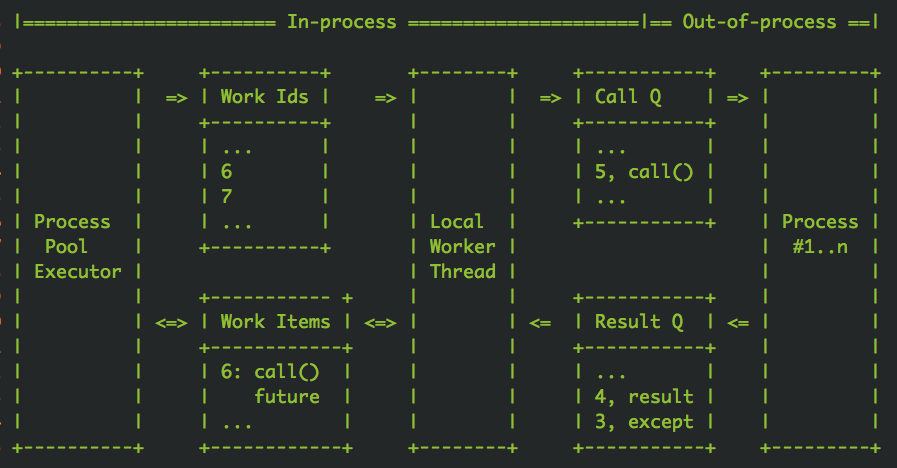

# Python广为使用的并发处理库futures使用入门与内部原理

⌚️:2020年11月30日

📚参考

---

在使用Python处理任务时，限于单线程处理能力有限，需要将任务并行化，分散到多个线程或者是多个进程去执行。

concurrent.futures就是这样一种库，它可以让用户可以非常方便的将任务并行化。这个名字有点长，后面我直接使用词汇concurrent来代替concurrent.futures。


concurrent提供了两种并发模型，一个是多线程ThreadPoolExecutor，一个是多进程ProcessPoolExecutor。对于IO密集型任务宜使用多线程模型。对于计算密集型任务应该使用多进程模型。

为什么要这样选择呢？是因为Python GIL的存在让Python虚拟机在进行运算时无法有效利用多核心。对于纯计算任务，它永远最多只能榨干单个CPU核心。如果要突破这个瓶颈，就必须fork出多个子进程来分担计算任务。而对于IO密集型任务，CPU使用率往往是极低的，使用多线程虽然会加倍CPU使用率，但是还远远到不了饱和(100%)的地步，在单核心可以应付整体计算的前提下，自然是应该选择资源占用少的模式，也就是多线程模式。

接下来我们分别尝试一下两种模式来进行并行计算。

## 1. 多线程


多线程模式适合IO密集型运算，这里我要使用sleep来模拟一下慢速的IO任务。同时为了方便编写命令行程序，这里使用Google fire开源库来简化命令行参数处理。

```
# coding: utf8
# t.py

import time
import fire
import threading
from concurrent.futures import ThreadPoolExecutor, wait


# 分割子任务
def each_task(index):
    time.sleep(1)  # 睡1s，模拟IO
    print "thread %s square %d" % (threading.current_thread().ident, index)
    return index * index  # 返回结果


def run(thread_num, task_num):
    # 实例化线程池，thread_num个线程
    executor = ThreadPoolExecutor(thread_num)
    start = time.time()
    fs = []  # future列表
    for i in range(task_num):
        fs.append(executor.submit(each_task, i))  # 提交任务
    wait(fs)  # 等待计算结束
    end = time.time()
    duration = end - start
    s = sum([f.result() for f in fs])  # 求和
    print "total result=%s cost: %.2fs" % (s, duration)
    executor.shutdown()  # 销毁线程池


if __name__ == '__main__':
    fire.Fire(run)
```

运行`python t.py 2 10`，也就是2个线程跑10个任务，观察输出

```
thread 123145422131200 square 0
thread 123145426337792 square 1
thread 123145426337792 square 2
thread 123145422131200 square 3
thread 123145426337792 square 4
thread 123145422131200 square 5
thread 123145426337792 square 6
thread 123145422131200 square 7
thread 123145426337792 square 8
thread 123145422131200 square 9
total result=285 cost: 5.02s
```

我们看到计算总共花费了大概5s，总共sleep了10s由两个线程分担，所以是5s。读者也许会问，为什么输出乱了，这是因为print操作不是原子的，它是两个连续的write操作合成的，第一个write输出内容，第二个write输出换行符，write操作本身是原子的，但是在多线程环境下，这两个write操作会交错执行，所以输出就不整齐了。如果将代码稍作修改，将print改成单个write操作，输出就整齐了(关于write是否绝对原子性还需要进一步深入讨论)

```
# 分割子任务
def each_task(index):
    time.sleep(1)  # 睡1s，模拟IO
    import sys
    sys.stdout.write("thread %s square %d\n" % (threading.current_thread().ident, index))
    return index * index  # 返回结果
```

我们再跑一下`python t.py 2 10`，观察输出

```
thread 123145438244864 square 0
thread 123145442451456 square 1
thread 123145442451456 square 2
thread 123145438244864 square 3
thread 123145438244864 square 4
thread 123145442451456 square 5
thread 123145438244864 square 6
thread 123145442451456 square 7
thread 123145442451456 square 9
thread 123145438244864 square 8
total result=285 cost: 5.02s
```

接下来，我们改变参数，扩大到10个线程，看看所有任务总共需要多久完成

```
> python t.py 10 10
thread 123145327464448 square 0
thread 123145335877632 square 2
thread 123145331671040 square 1
thread 123145344290816 square 4
thread 123145340084224 square 3
thread 123145348497408 square 5
thread 123145352704000 square 6
thread 123145356910592 square 7
thread 123145365323776 square 9
thread 123145361117184 square 8
total result=285 cost: 1.01s
```

可以看到1s中就完成了所有的任务。这就是多线程的魅力，可以将多个IO操作并行化，减少整体处理时间。

## 2. 多进程


相比多线程适合处理IO密集型任务，多进程适合计算密集型。接下来我们要模拟一下计算密集型任务。我的个人电脑有2个核心，正好可以体验多核心计算的优势。

那这个密集型计算任务怎么模拟呢，我们可以使用圆周率计算公式。


通过扩大级数的长度n，就可以无限逼近圆周率。当n特别大时，计算会比较缓慢，这时候CPU就会一直处于繁忙状态，这正是我们所期望的。

好，下面开写多进程并行计算代码

```
# coding: utf8
# p.py

import os
import sys
import math
import time
import fire
from concurrent.futures import ProcessPoolExecutor, wait


# 分割子任务
def each_task(n):
    # 按公式计算圆周率
    s = 0.0
    for i in range(n):
        s += 1.0/(i+1)/(i+1)
    pi = math.sqrt(6*s)
    # os.getpid可以获得子进程号
    sys.stdout.write("process %s n=%d pi=%s\n" % (os.getpid(), n, pi))
    return pi


def run(process_num, *ns):  # 输入多个n值，分成多个子任务来计算结果
    # 实例化进程池，process_num个进程
    executor = ProcessPoolExecutor(process_num)
    start = time.time()
    fs = []  # future列表
    for n in ns:
        fs.append(executor.submit(each_task, int(n)))  # 提交任务
    wait(fs)  # 等待计算结束
    end = time.time()
    duration = end - start
    print "total cost: %.2fs" % duration
    executor.shutdown()  # 销毁进程池


if __name__ == '__main__':
    fire.Fire(run)
```

通过代码可以看出多进程模式在代码的编写上和多线程没有多大差异，仅仅是换了一个类名，其它都一摸一样。这也是concurrent库的魅力所在，将多线程和多进程模型抽象出了一样的使用接口。

接下来我们运行一下`python p.py 1 5000000 5001000 5002000 5003000`，总共计算4次pi，只用一个进程。观察输出

```
process 96354 n=5000000 pi=3.1415924626
process 96354 n=5001000 pi=3.14159246264
process 96354 n=5002000 pi=3.14159246268
process 96354 n=5003000 pi=3.14159246272
total cost: 9.45s
```

可以看出来随着n的增大，结果越来越逼近圆周率，因为只用了一个进程，所以任务是串行执行，总共花了大约9.5s。

接下来再增加一个进程，观察输出

```
> python p.py 2 5000000 5001000 5002000 5003000
process 96529 n=5001000 pi=3.14159246264
process 96530 n=5000000 pi=3.1415924626
process 96529 n=5002000 pi=3.14159246268
process 96530 n=5003000 pi=3.14159246272
total cost: 4.98s
```

从耗时上看缩短了接近1半，说明多进程确实起到了计算并行化的效果。此刻如果使用top命令观察进程的CPU使用率，这两个进程的CPU使用率都占到了接近100%。

如果我们再增加2个进程，是不是还能继续压缩计算时间呢

```
> python p.py 4 5000000 5001000 5002000 5003000
process 96864 n=5002000 pi=3.14159246268
process 96862 n=5000000 pi=3.1415924626
process 96863 n=5001000 pi=3.14159246264
process 96865 n=5003000 pi=3.14159246272
total cost: 4.86s
```

看来耗时不能继续节约了，因为只有2个计算核心，2个进程已经足以榨干它们了，即使再多加进程也只有2个计算核心可用。

## 3. 深入原理

concurrent用的时候非常简单，但是内部实现并不是很好理解。在深入分析内部的结构之前，我们需要先理解一下Future这个对象。在前面的例子中，executor提交(submit)任务后都会返回一个Future对象，它表示一个结果的坑，在任务刚刚提交时，这个坑是空的，一旦子线程运行任务结束，就会将运行的结果塞到这个坑里，主线程就可以通过Future对象获得这个结果。简单一点说，Future对象是主线程和子线程通信的媒介。


Future对象的内部逻辑简单一点可以使用下面的代码进行表示

```
class Future(object):

    def __init__(self):
        self._condition = threading.Condition()  # 条件变量
        self._result = None
    
    def result(self, timeout=None):
        self._condition.wait(timeout)
        return self._result
        
    def set_result(self, result):
        self._result = result
        self._condition.notify_all()
```

主线程将任务塞进线程池后得到了这个Future对象，它内部的_result还是空的。如果主线程调用result()方法获取结果，就会阻塞在条件变量上。如果子线程计算任务完成了就会立即调用set_result()方法将结果填充进future对象，并唤醒阻塞在条件变量上的线程，也就是主线程。这时主线程立即醒过来并正常返回结果。

## 4. 线程池内部结构

主线程和子线程交互分为两部分，第一部分是主线程如何将任务传递给子线程，第二部分是子线程如何将结果传递给主线程。第二部分已经讲过了是通过Future对象来完成的。那第一部分是怎么做到的呢？


如上图所示，秘密就在于这个队列，主线程是通过队列将任务传递给多个子线程的。一旦主线程将任务塞进任务队列，子线程们就会开始争抢，最终只有一个线程能抢到这个任务，并立即进行执行，执行完后将结果放进Future对象就完成了这个任务的完整执行过程。

## 5. 线程池的缺点

concurrent的线程池有个重大的设计问题，那就是任务队列是无界的。如果队列的生产者任务生产的太快，而线程池消费太慢处理不过来，任务就会堆积。如果堆积一直持续下去，内存就会持续增长直到OOM，任务队列里堆积的所有任务全部彻底丢失。用户使用时一定要注意这点，并做好适当的控制。

## 6. 进程池内部结构

进程池内部结构复杂，连concurent库的作者自己也觉得特别复杂，所以在代码里专门画了一张ascii图来讲解模型内部结构





我觉得作者的这张图还不够好懂，所以也单独画了一张图，请读者们仔细结合上面两张图，一起来过一边完整的任务处理过程。

1. 主线程将任务塞进TaskQueue(普通内存队列)，拿到Future对象
2. 唯一的管理线程从TaskQueue获取任务，塞进CallQueue(分布式跨进程队列)
3. 子进程从CallQueue中争抢任务进行处理
4. 子进程将处理结果塞进ResultQueue(分布式跨进程队列)
5. 管理线程从ResultQueue中获取结果，塞进Future对象
6. 主线程从Future对象中拿到结果

这个复杂的流程中涉及到3个队列，还有中间附加的管理线程。那为什么作者要设计的这么复杂，这样的设计有什么好处？

首先，我们看这张图的左半边，它和线程池的处理流程没有太多区别，区别仅仅是管理线程只有一个，而线程池的子线程会有多个。这样设计可以使得多进程模型和多线程模型的使用方法保持一致，这就是为什么两个模型使用起来没有任何区别的原因所在——通过中间的管理线程隐藏了背后的多进程交互逻辑。

然后我们再看这张图的右半边，管理线程通过两个队列来和子进程们进行交互，这两个队列都是跨进程队列(multiprocessing.Queue)。CallQueue是单生产者多消费者，ResultQueue是多生产者单消费者。

CallQueue是个有界队列，它的上限在代码里写死了为「子进程数+1」。如果子进程们处理不过来，CallQueue就会变满，管理线程就会停止往里面塞数据。但是这里也遭遇了和线程池一样的问题，TaskQueue是无界队列，它的内容可不管消费者是否在持续(管理线程)消费，TaskQueue会无限制的持续生长，于是最终也会会导致OOM。

## 7. 跨进程队列

进程池模型中的跨进程队列是用multiprocessing.Queue实现的。那这个跨进程队列内部细节是怎样的，它又是用什么高科技来实现的呢

笔者仔细阅读了multiprocessing.Queue的源码发现，它使用无名套接字sockerpair来完成的跨进程通信，socketpair和socket的区别就在于socketpair不需要端口，不需要走网络协议栈，通过内核的套接字读写缓冲区直接进行跨进程通信。


当父进程要传递任务给子进程时，先使用pickle将任务对象进行序列化成字节数组，然后将字节数组通过socketpair的写描述符写入内核的buffer中。子进程接下来就可以从buffer中读取到字节数组，然后再使用pickle对字节数组进行反序列化来得到任务对象，这样总算可以执行任务了。同样子进程将结果传递给父进程走的也是一样的流程，只不过这里的socketpair是ResultQueue内部创建的无名套接字。

multiprocessing.Queue是支持双工通信，数据流向可以是父到子，也可以是子到父，只不过在concurrent的进程池实现中只用到了单工通信。CallQueue是从父到子，ResultQueue是从子到父。

## 8. 总结

concurrent.futures框架非常好用，虽然内部实现机制异常复杂，读者也无需完全理解内部细节就可以直接使用了。但是需要特别注意的是不管是线程池还是进程池其内部的任务队列都是无界的，一定要避免消费者处理不及时内存持续攀升的情况发生。

