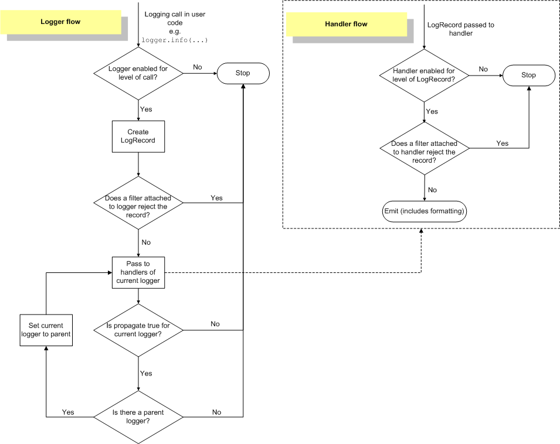

# Python logging 模块详解

⌚️:2020年11月30日

📚参考

---

> This module defines functions and classes which implement a flexible event logging system for applications and libraries.

Python logging 模块定义了为应用程序和库实现灵活的事件日志记录的函数和类。

程序开发过程中，很多程序都有记录日志的需求，并且日志包含的信息有正常的程序访问日志还可能有错误、警告等信息输出，Python 的 logging 模块提供了标准的日志接口，可以通过它存储各种格式的日志,日志记录提供了一组便利功能，用于简单的日志记录用法。

- 使用 Python Logging 模块的主要好处是所有 Python 模块都可以参与日志记录
- Logging 模块提供了大量具有灵活性的功能

**日志记录函数以它们用来跟踪的事件的级别或严重性命名。下面描述了标准级别及其适用性（从高到低的顺序）：**

| 日志等级(level) | 描述                                                         |
| :-------------- | :----------------------------------------------------------- |
| DEBUG           | 最详细的日志信息，典型应用场景是 问题诊断                    |
| INFO            | 信息详细程度仅次于DEBUG，通常只记录关键节点信息，用于确认一切都是按照我们预期的那样进行工作 |
| WARNING         | 当某些不期望的事情发生时记录的信息（如，磁盘可用空间较低），但是此时应用程序还是正常运行的 |
| ERROR           | 由于一个更严重的问题导致某些功能不能正常运行时记录的信息     |
| CRITICAL        | 当发生严重错误，导致应用程序不能继续运行时记录的信息         |

**日志级别等级排序**：critical > error > warning > info > debug

**级别越高打印的日志越少，反之亦然，即**

- debug : 打印全部的日志( notset 等同于 debug )
- info : 打印 info, warning, error, critical 级别的日志
- warning : 打印 warning, error, critical 级别的日志
- error : 打印 error, critical 级别的日志
- critical : 打印 critical 级别

## 一、 Logging 模块日志记录方式

Logging 模块提供了两种日志记录方式：

- 一种方式是使用 Logging 提供的模块级别的函数
- 另一种方式是使用 Logging 日志系统的四大组件记录

### 1、Logging 定义的模块级别函数

| 函数                                   | 说明                                 |
| :------------------------------------- | :----------------------------------- |
| logging.debug(msg, *args, **kwargs)    | 创建一条严重级别为DEBUG的日志记录    |
| logging.info(msg, *args, **kwargs)     | 创建一条严重级别为INFO的日志记录     |
| logging.warning(msg, *args, **kwargs)  | 创建一条严重级别为WARNING的日志记录  |
| logging.error(msg, *args, **kwargs)    | 创建一条严重级别为ERROR的日志记录    |
| logging.critical(msg, *args, **kwargs) | 创建一条严重级别为CRITICAL的日志记录 |
| logging.log(level, *args, **kwargs)    | 创建一条严重级别为level的日志记录    |
| logging.basicConfig(**kwargs)          | 对root logger进行一次性配置          |

简单打印日志：

```
import logging

#　打印日志级别
def test_logging():
    logging.debug('Python debug')
    logging.info('Python info')
    logging.warning('Python warning')
    logging.error('Python Error')
    logging.critical('Python critical')

test_logging()
```

输出结果：

```
WARNING:root:Python warning
ERROR:root:Python Error
CRITICAL:root:Python critical
```

当指定一个日志级别之后，会记录大于或等于这个日志级别的日志信息，小于的将会被丢弃， ==默认情况下日志打印只显示大于等于 WARNING 级别的日志。==

#### 1.1 设置日志显示级别

通过 logging.basicConfig() 可以设置 root 的日志级别，和日志输出格式。

**logging.basicConfig() 关键字参数**：

| 关键字   | 描述                                                         |
| :------- | :----------------------------------------------------------- |
| filename | 创建一个 FileHandler，使用指定的文件名，而不是使用 StreamHandler。 |
| filemode | 如果指明了文件名，指明打开文件的模式（如果没有指明 filemode，默认为 ‘a’）。 |
| format   | handler 使用指明的格式化字符串。                             |
| datefmt  | handler 使用指明的格式化字符串。                             |
| level    | 指明根 logger 的级别。                                       |
| stream   | 使用指明的流来初始化 StreamHandler。该参数与 ‘filename’ 不兼容，如果两个都有，’stream’ 被忽略。 |

**format 格式**

| 格式           | 描述                   |
| :------------- | :--------------------- |
| %(levelno)s    | 打印日志级别的数值     |
| %(levelname)s  | 打印日志级别名称       |
| %(pathname)s   | 打印当前执行程序的路径 |
| %(filename)s   | 打印当前执行程序名称   |
| %(funcName)s   | 打印日志的当前函数     |
| %(lineno)d     | 打印日志的当前行号     |
| %(asctime)s    | 打印日志的时间         |
| %(thread)d     | 打印线程 ID            |
| %(threadName)s | 打印线程名称           |
| %(process)d    | 打印进程 ID            |
| %(message)s    | 打印日志信息           |

**注意**：Logging.basicConfig() 需要在开头就设置，在中间设置并无作用

**实例**

```
import logging

#　打印日志级别
def test():
    logging.basicConfig(level=logging.DEBUG)
    logging.debug('Python debug')
    logging.info('Python info')
    logging.warning('Python warning')
    logging.error('Python Error')
    logging.critical('Python critical')
    logging.log(2,'test')
test()
```

输出：

```
DEBUG:root:Python debug
INFO:root:Python info
WARNING:root:Python warning
ERROR:root:Python Error
CRITICAL:root:Python critical
```

#### 1.2 将日志信息记录到文件

```
# 日志信息记录到文件
logging.basicConfig(filename='F:/example.log', level=logging.DEBUG)
logging.debug('This message should go to the log file')
logging.info('So should this')
logging.warning('And this, too')
```

在相应的路径下会有 example.log 日志文件，内容如下：

```
DEBUG:root:This message should go to the log file
INFO:root:So should this
WARNING:root:And this, too
```

#### 1.3 多个模块记录日志信息

如果程序包含多个模块，则用以下实例来显示日志信息： 实例中有两个模块，一个模块通过导入另一个模块的方式用日志显示另一个模块的信息：

**myapp.py 模块**

```
import logging
import mylib
def main():
    logging.basicConfig(filename='myapp.log',level=logging.DEBUG)
    logging.info('Started')
    mylib.do_something()
    logging.info('Finished')

if __name__ == '__main__':
    main()
```

**mylib.py 模块**

```
import logging

def do_something():
    logging.info('Doing something')
```

执行 myapp.py 模块会打印相应日志，在文件 myapp.log 中显示信息如下：

```
INFO:root:StartedINFO:root:Doing somethingINFO:root:Finishe
```

#### 1.4 显示信息的日期及更改显示消息格式

**显示消息日期**

```
import logging# 显示消息时间logging.basicConfig(format='%(asctime)s %(message)s')logging.warning('is when this event was logged.')logging.basicConfig(format='%(asctime)s %(message)s', datefmt='%m/%d/%Y %I:%M:%S %p')logging.warning('is when this event was logged.')
```

结果：

```
2019-10-16 18:57:45,988 is when this event was logged.2019-10-16 18:57:45,988 is when this event was logged.
```

**更改显示消息格式**

```
import logging#　更改显示消息的格式logging.basicConfig(format='%(levelname)s:%(message)s',level=logging.DEBUG)logging.debug('Python message format Debug')logging.info('Python message format Info')logging.warning('Python message format Warning')
```

结果：

```
DEBUG:Python message format DebugINFO:Python message format InfoWARNING:Python message format Warning
```

==注意==：显示结果只显示级别和具体信息，之前显示的 “根” 已经消失，重新定义的格式修改了默认输出方式。

### 2、logging 模块四大组件

| 组件名称 | 对应类名  | 功能描述                                                     |
| :------- | :-------- | :----------------------------------------------------------- |
| 日志器   | Logger    | 暴露函数给应用程序，基于日志记录器和过滤器级别决定哪些日志有效 |
| 处理器   | Handler   | 将 logger 创建的日志记录发送到合适的目的输出                 |
| 过滤器   | Filter    | 提供了更细粒度的控制工具来决定输出哪条日志记录，丢弃哪条日志记录 |
| 格式器   | Formatter | 决定日志记录的最终输出格式                                   |

#### 2.1 日志器- Logger

Logger 持有日志记录器的方法，日志记录器不直接实例化，而是通过模块级函数 logger.getlogger (name) 来实例化,使用相同的名称多次调用 getLogger() 总是会返回对相同 Logger 对象的引用。

- 应用程序代码能直接调用日志接口。
- Logger最常用的操作有两类：配置和发送日志消息。
- 初始化 logger = logging.getLogger(“endlesscode”)，获取 logger 对象，getLogger() 方法后面最好加上所要日志记录的模块名字，配置文件和打印日志格式中的 %(name)s 对应的是这里的模块名字，如果不指定name则返回root对象。
- logger.setLevel(logging.DEBUG)，Logging 中有 NOTSET < DEBUG < INFO < WARNING < ERROR < CRITICAL这几种级别，日志会记录设置级别以上的日志
- 多次使用相同的name调用 getLogger 方法返回同一个 looger 对象；

Logger是一个树形层级结构，在使用接口 debug，info，warn，error，critical 之前必须创建 Logger 实例：

```
创建方法: logger = logging.getLogger(logger_name)
```

创建Logger实例后，可以使用以下方法进行日志级别设置，增加处理器 Handler：

- logger.setLevel(logging.ERROR) # 设置日志级别为 ERROR，即只有日志级别大于等于 ERROR 的日志才会输出
- logger.addHandler(handler_name) # 为 Logger 实例增加一个处理器
- logger.removeHandler(handler_name) # 为 Logger 实例删除一个处理器

#### 2.2 处理器- Handler

Handler 处理器类型有很多种，比较常用的有三个，StreamHandler，FileHandler，NullHandler

**StreamHandler**

```
创建方法：sh = logging.StreamHandler(stream=None)
```

创建 StreamHandler 之后，可以通过使用以下方法设置日志级别，设置格式化器 Formatter，增加或删除过滤器 Filter：

```
ch.setLevel(logging.WARN) # 指定日志级别，低于WARN级别的日志将被忽略ch.setFormatter(formatter_name) # 设置一个格式化器formatterch.addFilter(filter_name) # 增加一个过滤器，可以增加多个 ch.removeFilter(filter_name) # 删除一个过滤器
```

#### 2.3 过滤器- Filter

Handlers 和 Loggers 可以使用 Filters 来完成比级别更复杂的过滤。 Filter 基类只允许特定 Logger 层次以下的事件。 例如用 ‘A.B’ 初始化的 Filter 允许Logger ‘A.B’, ‘A.B.C’, ‘A.B.C.D’, ‘A.B.D’ 等记录的事件，logger‘A.BB’, ‘B.A.B’ 等就不行。 如果用空字符串来初始化，所有的事件都接受。

```
创建方法: filter = logging.Filter(name='')
```

#### 2.4 格式器- Formatter

使用Formatter对象设置日志信息最后的规则、结构和内容，默认的时间格式为%Y-%m-%d %H:%M:%S。

```
创建方法: formatter = logging.Formatter(fmt=None, datefmt=None)
```

其中，fmt 是消息的格式化字符串，datefmt 是日期字符串。如果不指明 fmt，将使用 ‘%(message)s’ 。如果不指明 datefmt，将使用 ISO8601 日期格式。

#### 2.5 组件之间的关联关系

- 日志器（logger）需要通过处理器（handler）将日志信息输出到目标位置，不同的处理器（handler）可以将日志输出到不同的位置；
- 日志器（logger）可以设置多个处理器（handler）将同一条日志记录输出到不同的位置；
- 每个处理器（handler）都可以设置自己的过滤器（filter）实现日志过滤，从而只保留感兴趣的日志；
- 每个处理器（handler）都可以设置自己的格式器（formatter）实现同一条日志以不同的格式输出到不同的地方。

简明了说就是：日志器（logger）是入口，真正干活儿的是处理器（handler），处理器（handler）还可以通过过滤器（filter）和格式器（formatter）对要输出的日志内容做过滤和格式化等处理操作。

- Logger 可以包含一个或多个 Handler 和 Filter
- Logger 与 Handler 或 Fitler 是一对多的关系
- 一个 Logger 实例可以新增多 个 Handler，一个 Handler 可以新增多个格式化器或多个过滤器，而且日志级别将会继承。

## 二、Logging 日志工作流程

### 1、Logging 模块使用过程

```
1）第一次导入 logging 模块或使用 reload 函数重新导入 logging 模块，logging 模块中的代码将被执行，这个过程中将产生 logging 日志系统的默认配置。2）自定义配置(可选),logging标准模块支持三种配置方式: dictConfig，fileConfig，listen。其中，dictConfig 是通过一个字典进行配置 Logger，Handler，Filter，Formatter；fileConfig 则是通过一个文件进行配置；而 listen 则监听一个网络端口，通过接收网络数据来进行配置。当然，除了以上集体化配置外，也可以直接调用 Logger，Handler 等对象中的方法在代码中来显式配置。   3）使用 logging 模块的全局作用域中的 getLogger 函数来得到一个 Logger 对象实例(其参数即是一个字符串，表示 Logger 对象实例的名字，即通过该名字来得到相应的 Logger 对象实例)。4）使用 Logger 对象中的 debug，info，error，warn，critical 等方法记录日志信息。
```

### 2、Logging 模块处理流程



流程描述：

1. 判断日志的等级是否大于 Logger 对象的等级，如果大于，则往下执行，否则，流程结束。
2. 产生日志：第一步，判断是否有异常，如果有，则添加异常信息。 第二步，处理日志记录方法(如 debug，info 等)中的占位符，即一般的字符串格式化处理。
3. 使用注册到 Logger 对象中的 Filters 进行过滤。如果有多个过滤器，则依次过滤；只要有一个过滤器返回假，则过滤结束，且该日志信息将丢弃，不再处理，而处理流程也至此结束。否则，处理流程往下执行。
4. 在当前 Logger 对象中查找 Handlers，如果找不到任何 Handler，则往上到该 Logger 对象的父 Logger 中查找；如果找到一个或多个 Handler，则依次用 Handler 来处理日志信息。但在每个 Handler 处理日志信息过程中，会首先判断日志信息的等级是否大于该 Handler 的等级，如果大于，则往下执行(由 Logger 对象进入 Handler 对象中)，否则，处理流程结束。
5. 执行 Handler 对象中的 filter 方法，该方法会依次执行注册到该 Handler 对象中的 Filter。如果有一个 Filter 判断该日志信息为假，则此后的所有 Filter 都不再执行，而直接将该日志信息丢弃，处理流程结束。
6. 使用 Formatter 类格式化最终的输出结果。 注：Formatter 同上述第 2 步的字符串格式化不同，它会添加额外的信息，比如日志产生的时间，产生日志的源代码所在的源文件的路径等等。
7. 真正地输出日志信息(到网络，文件，终端，邮件等)。至于输出到哪个目的地，由 Handler 的种类来决定。

## 三、配置日志

程序员可以通过三种方式配置日志记录：

```
1、使用配置方法的 Python 代码显式创建记录器，处理程序和格式化程序。2、创建日志记录配置文件并使用该 fileConfig() 功能读取它。3、创建配置信息字典并将其传递给 dictConfig()函数。
```

下面使用 Python 代码配置一个非常简单的记录器，一个控制台处理程序和一个简单的格式化程序：

**logging.conf 配置文件**：

```
[loggers]keys=root,simpleExample[handlers]keys=consoleHandler[formatters]keys=simpleFormatter[logger_root]level=DEBUGhandlers=consoleHandler[logger_simpleExample]level=DEBUGhandlers=consoleHandlerqualname=simpleExamplepropagate=0[handler_consoleHandler]class=StreamHandlerlevel=DEBUGformatter=simpleFormatterargs=(sys.stdout,)[formatter_simpleFormatter]format=%(asctime)s - %(name)s - %(levelname)s - %(message)sdatefmt=
```

**config_logging.py 配置器**：

```
import logging# create loggerlogger = logging.getLogger('simple_example')logger.setLevel(logging.DEBUG)# create console handler and set level to debugch = logging.StreamHandler()ch.setLevel(logging.DEBUG)# create formatterformatter = logging.Formatter('%(asctime)s - %(name)s - %(levelname)s - %(message)s')# add formatter to chch.setFormatter(formatter)# add ch to loggerlogger.addHandler(ch)# 'application' codelogger.debug('debug message')logger.info('info message')logger.warning('warn message')logger.error('error message')logger.critical('critical message')
```

**recorder 记录器**：

```
import loggingimport logging.configlogging.config.fileConfig('logging.conf')# create loggerlogger = logging.getLogger('simpleExample')# 'application' codelogger.debug('debug message')logger.info('info message')logger.warning('warn message')logger.error('error message')logger.critical('critical message')
```

运行结果：

```
2019-10-16 19:45:34,440 - simple_example - DEBUG - debug message2019-10-16 19:45:34,440 - simple_example - INFO - info message2019-10-16 19:45:34,440 - simple_example - WARNING - warn message2019-10-16 19:45:34,440 - simple_example - ERROR - error message2019-10-16 19:45:34,441 - simple_example - CRITICAL - critical message
```

