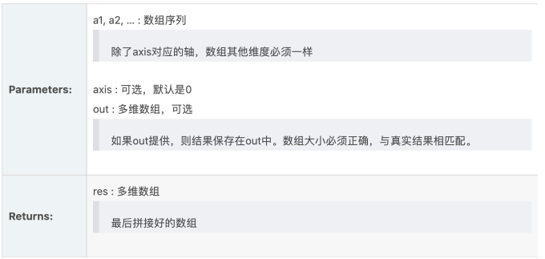
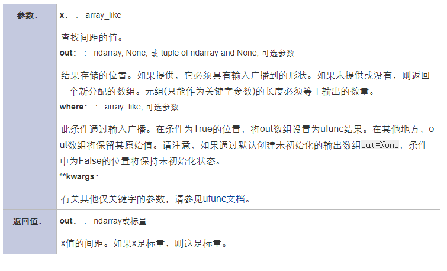

# Numpy的函数们

⌚️:2020年11月30日

📚参考

---

## 1. argmax

假定现在有一个数组a = [3, 1, 2, 4, 6, 1]现在要算数组a中最大数的索引是多少.这个问题对于刚学编程的同学就能解决.最直接的思路,先假定第0个数最大,然后拿这个和后面的数比,找到大的就更新索引.代码如下

```
a = [3, 1, 2, 4, 6, 1]
maxindex = 0
i = 0
for tmp in a:
    if tmp > a[maxindex]:
        maxindex = i
    i += 1
print(maxindex)
```

这个问题虽然简单.但是可以帮助我们理解argmax.

**解释**

还是从一维数组出发.看下面的例子.

```python
import numpy as np
a = np.array([3, 1, 2, 4, 6, 1])
print(np.argmax(a))
# output
4
```

argmax返回的是最大数的索引.argmax有一个参数axis,默认是0,表示第几维的最大值.看二维的情况.

```
import numpy as np
a = np.array([[1, 5, 5, 2],
              [9, 6, 2, 8],
              [3, 7, 9, 1]])
print(np.argmax(a, axis=0)) # [1 2 2 1]

print(np.argmax(a, axis=1)) # [1 0 2]
```

为了描述方便,a就表示这个二维数组.np.argmax(a, axis=0)的含义是a\[0\]\[j\],a\[1\]\[j\],a\[2\]\[j\]中最大值的索引.从a\[0\]\[j\]开始,最大值索引最初为(0,0,0,0),拿a\[0\]\[j\]和a\[1\]\[j\]作比较,9大于1,6大于5,8大于2,所以最大值索引由(0,0,0,0)更新为(1,1,0,1),再和a\[2\]\[j\]作比较,7大于6,9大于5所以更新为(1,2,2,1).再分析下面的输出.

```
import numpy as np
a = np.array([[1, 5, 5, 2],
              [9, 6, 2, 8],
              [3, 7, 9, 1]])
print(np.argmax(a, axis=1))
```

np.argmax(a, axis=1)的含义是a\[i\]\[0\],a\[i\]\[1\],a\[i\]\[2\],a\[i\]\[3\]中最大值的索引.从a\[i\]\[0\]开始,a\[i\]\[0\]对应的索引为(0,0,0),先假定它就是最大值索引(思路和上节简单例子完全一致)拿a\[i\]\[0\]和a\[i\]\[1\]作比较,5大于1,7大于3所以最大值索引由(0,0,0)更新为(1,0,1),再和a\[i\]\[2\]作比较,9大于7,更新为(1,0,2),再和a\[i\]\[3\]作比较,不用更新,最终值为(1,0,2)
再看三维的情况.

```
import numpy as np
a = np.array([
              [
                  [1, 5, 5, 2],
                  [9, -6, 2, 8],
                  [-3, 7, -9, 1]
              ],

              [
                  [-1, 5, -5, 2],
                  [9, 6, 2, 8],
                  [3, 7, 9, 1]
              ]
            ])
print(np.argmax(a, axis=0))

# output 
[[0 0 0 0]
 [0 1 0 0]
 [1 0 1 0]]
```

np.argmax(a, axis=0)的含义是a\[0\]\[j\]\[k\],a\[1]\[j\]\[k] (j=0,1,2,k=0,1,2,3)中最大值的索引.从a\[0]\[j\][k]开始,a\[0]\[j]\[k]对应的索引为((0,0,0,0),(0,0,0,0),(0,0,0,0)),拿a\[0]\[j\][k]和a\[1]\[j]\[k]对应项作比较6大于-6,3大于-3,9大于-9,所以更新这几个位置的索引,将((0,0,0,0),(0,0,0,0),(0,0,0,0))更新为((0,0,0,0),(0,1,0,0),(1,0,1,0)). 再看axis=1的情况.

```
import numpy as np
a = np.array([
              [
                  [1, 5, 5, 2],
                  [9, -6, 2, 8],
                  [-3, 7, -9, 1]
              ],

              [
                  [-1, 5, -5, 2],
                  [9, 6, 2, 8],
                  [3, 7, 9, 1]
              ]
            ])
print(np.argmax(a, axis=1))
# output
[[1 2 0 1]
 [1 2 2 1]]
```

np.argmax(a, axis=1)的含义是a\[i]\[0]\[k],a\[i]\[1]\[k] (i=0,1,k=0,1,2,3)中最大值的索引.从a\[i]\[0\][k]开始,a\[i\]\[0]\[k]对应的索引为((0,0,0,0),(0,0,0,0)),拿a\[i]\[0\]\[k]和a\[i\]\[1\][k]对应项作比较,9大于1,8大于2,9大于-1,6大于5,2大于-5,8大于2,所以更新这几个位置的索引,将((0,0,0,0),(0,0,0,0))更新为((1,0,0,1),(1,1,1,1)),现在最大值对应的数组为((9,5,5,8),(9,6,2,8)).再拿((9,5,5,8),(9,6,2,8))和a\[i\]\[2\]\[k]对应项从比较,7大于5,7大于6,9大于2.更新这几个位置的索引.将((1,0,0,1),(1,1,1,1))更新为((1,2,0,1),(1,2,2,1)).axis=2的情况也是类似的.


## 2. np.prod

```
numpy.prod(a, axis=None, dtype=None, out=None, keepdims=<class 'numpy._globals._NoValue'>)
```

返回给定轴上的数组元素的乘积。

```
print(np.prod([[1, 2], [3, 4]], axis=0))	# [3 8]
print(np.prod([[1, 2], [3, 4]], axis=1))  # [ 2 12]
```


## 3. **numpy.where()** 

### 1. np.where(condition, x, y)

满足条件(condition)，输出x，不满足输出y。 ——将condition转为True和False的矩阵，然后在x和y中筛选


如果是一维数组，相当于`[xv if c else yv for (c,xv,yv) in zip(condition,x,y)]`

```python
>>> aa = np.arange(10)
>>> np.where(aa,1,-1)
array([-1,  1,  1,  1,  1,  1,  1,  1,  1,  1])  # 0为False，所以第一个输出-1
>>> np.where(aa > 5,1,-1)
array([-1, -1, -1, -1, -1, -1,  1,  1,  1,  1])

>>> np.where([[True,False], [True,True]],    # 官网上的例子
			 [[1,2], [3,4]],
             [[9,8], [7,6]])
array([[1, 8],
	   [3, 4]])
```

上面这个例子的条件为`[[True,False], [True,False]]`，分别对应最后输出结果的四个值。第一个值从`[1,9]`中选，因为条件为True，所以是选1。第二个值从`[2,8]`中选，因为条件为False，所以选8，后面以此类推。类似的问题可以再看个例子：

```python
>>> a = 10
>>> np.where([[a > 5,a < 5], [a == 10,a == 7]],
             [["chosen","not chosen"], ["chosen","not chosen"]],
             [["not chosen","chosen"], ["not chosen","chosen"]])

array([['chosen', 'chosen'],
       ['chosen', 'chosen']], dtype='<U10')
```

### 2. np.where(condition)

只有条件 (condition)，没有x和y，则输出满足条件 (即非0) 元素的坐标 (等价于[numpy.nonzero](https://docs.scipy.org/doc/numpy/reference/generated/numpy.nonzero.html#numpy.nonzero))。这里的坐标以tuple的形式给出，通常原数组有多少维，输出的tuple中就包含几个数组，分别对应符合条件元素的各维坐标。

```python
>>> a = np.array([2,4,6,8,10])
>>> np.where(a > 5)				# 返回索引
(array([2, 3, 4]),)   
>>> a[np.where(a > 5)]  			# 等价于 a[a>5]
array([ 6,  8, 10])

>>> np.where([[0, 1], [1, 0]])
(array([0, 1]), array([1, 0]))
```

上面这个例子条件中`[[0,1],[1,0]]`的真值为两个1，各自的第一维坐标为`[0,1]`，第二维坐标为`[1,0]` 。


下面看个复杂点的例子：

```python
>>> a = np.arange(27).reshape(3,3,3)
>>> a
array([[[ 0,  1,  2],
        [ 3,  4,  5],
        [ 6,  7,  8]],

       [[ 9, 10, 11],
        [12, 13, 14],
        [15, 16, 17]],

       [[18, 19, 20],
        [21, 22, 23],
        [24, 25, 26]]])

>>> np.where(a > 5)
(array([0, 0, 0, 1, 1, 1, 1, 1, 1, 1, 1, 1, 2, 2, 2, 2, 2, 2, 2, 2, 2]),
 array([2, 2, 2, 0, 0, 0, 1, 1, 1, 2, 2, 2, 0, 0, 0, 1, 1, 1, 2, 2, 2]),
 array([0, 1, 2, 0, 1, 2, 0, 1, 2, 0, 1, 2, 0, 1, 2, 0, 1, 2, 0, 1, 2]))


# 符合条件的元素为
	   [ 6,  7,  8]],

      [[ 9, 10, 11],
       [12, 13, 14],
       [15, 16, 17]],

      [[18, 19, 20],
       [21, 22, 23],
       [24, 25, 26]]]
```

所以np.where会输出每个元素的对应的坐标，因为原数组有三维，所以tuple中有三个数组。

## 4. clip

numpy.clip(a, a_min, a_max, out=None)[source]

其中a是一个数组，后面两个参数分别表示最小和最大值，怎么用呢，老规矩，我们看代码：

```
import numpy as np
x=np.array([1,2,3,5,6,7,8,9])
np.clip(x,3,8)
Out[88]:
array([3, 3, 3, 5, 6, 7, 8, 8])
```

也就是说clip这个函数将将数组中的元素限制在a_min, a_max之间，大于a_max的就使得它等于 a_max，小于a_min,的就使得它等于a_min。

```
x=np.array([[1,2,3,5,6,7,8,9],[1,2,3,5,6,7,8,9]])
np.clip(x,3,8)

Out[90]:
array([[3, 3, 3, 5, 6, 7, 8, 8],
       [3, 3, 3, 5, 6, 7, 8, 8]])
```

高维数组也是一样的

## 5. numpy排序

（sort、argsort、lexsort、partition、sorted）

python的numpy中涉及了几种简单的排序方法，在此简单介绍，以便后续使用。

------

### numpy.sort

**以下是官网上给出的该方法的简介：**

```
numpy.sort(a, axis=1, kind='quicksort', order=None)
Parameters:	a : array_like
				Array to be sorted.
			axis : int or None, optional
				Axis along which to sort. If None, the array is flattened 
				before sorting. The default is 1, which sorts along the last
				 axis.
			kind : {‘quicksort’, ‘mergesort’, ‘heapsort’}, optional
				Sorting algorithm. Default is ‘quicksort’.
			order : str or list of str, optional
				When a is an array with fields defined, this argument
				specifies which fields to compare first, second, etc. A 
				single field can be specified as a string, and not all 
				fields need be specified, but unspecified fields will still 
				be used, in the order in which they come up in the dtype, to 
				break ties.
Returns:	sorted_array : ndarray
			Array of the same type and shape as a.
```

*a*：所需排序的数组

axis：数组排序时的基准，axis=0，按列排列；axis=1，按行排列

kind：数组排序时使用的方法，其中：kind='quicksort'  为快排；kind=′mergesort′为混排；kind=′heapsort′为堆排；

order：一个字符串或列表，可以设置按照某个属性进行排序


**举例说明**

参数axis

```
import numpy as np
>>> list1 = [[4,3,2],[2,1,4]]
>>> array=np.array(list1) 
>>> array
array([[4, 3, 2],
       [2, 1, 4]])
>>> array.sort(axis=1)   
>>> array
array([[2, 3, 4],
       [1, 2, 4]])
# axis=1,说明是按照行进行排序，也就是说，每一行上的元素实现了递增，
# 如[4, 3, 2]变为了[2, 3, 4]，[2, 1, 4]变为了[1, 2, 4]
>>> array.sort(axis=0)
>>>> array
array([[1, 2, 4],
       [2, 3, 4]])
# axis=0,说明是按照列进行排序，也就是说，每一列上的元素实现了递增，
# 如[2, 1]变为了[1, 2]，[3, 2]变为了[2, 3]
>>>np.sort(array, axis=None)
array([1, 2, 2, 3, 4, 4])
# 当axis=None，将所有元素统一排序
```

参数order

```
import numpy as np
>>> dtype = [('Name', 'S10'), ('Height', float), ('Age', int)]
>>> values = [('Li', 1.8, 41), ('Wang', 1.9, 38),('Duan', 1.7, 38)]
>>> a = np.array(values, dtype=dtype)
>>> np.sort(a, order='Height')  # 按照属性Height进行排序,此时参数为字符串                      
array([('Duan', 1.7, 38), ('Li', 1.8, 41),('Wang', 1.9, 38)],
      dtype=[('Name', '|S10'), ('Height', '<f8'), ('Age', '<i4')])
>>> np.sort(a, order=['Age', 'Height']) 
# 先按照属性Age排序,如果Age相等，再按照Height排序，此时参数为列表        
array([('Duan', 1.7, 38), ('Wang', 1.9, 38),('Li', 1.8, 41)],
      dtype=[('Name', '|S10'), ('Height', '<f8'), ('Age', '<i4')])
```

------

### numpy.argsort

```
numpy.argsort(a, axis=1, kind='quicksort', order=None)
Parameters:	a : array_like
				Array to sort.
			axis : int or None, optional
				Axis along which to sort. The default is 1 (the last axis).
				If None, the flattened array is used.
			kind : {‘quicksort’, ‘mergesort’, ‘heapsort’}, optional
				Sorting algorithm.
			order : str or list of str, optional
				When a is an array with fields defined, this argument
				specifies which fields to compare first, second, etc. A
				single field can be specified as a string, and not all fields
				need be specified, but unspecified fields will still be used,
				in the order in which they come up in the dtype, to break
				ties.
Returns:	index_array : ndarray, int
				Array of indices that sort a along the specified axis. If a
				is one-dimensional, a[index_array] yields a sorted a.

```

*a*：所需排序的数组

axis：数组排序时的基准，axis=0，按列排列；axis=1，按行排列

kind：数组排序时使用的方法，其中：kind='quicksort'  为快排；kind=′mergesort′为混排；kind=′heapsort′为堆排；

order：一个字符串或列表，可以设置按照某个属性进行排序


**举例说明**

参数axis

```
>>>list1=[4,2,5,7,3]
>>>a=np.array(list1)
>>>a
array([4, 2, 5, 7, 3])
>>>b=np.argsort(a)
>>>b
array([1, 4, 0, 2, 3], dtype=int64)
# 列表b的元素表示的是原列表a中的元素的索引，5各元素的索引分别为0-4
# 返回的结果可以这样解读：
# 	b[0]=1，表示原列表a的最小元素的索引为1，即原列表a中的第2个元素为最小值
#	b[1]=4，表示原列表a的第二小元素的索引为4，即原列表a中的第5个元素为第二小元素
#	...
#	b[4]=3，表示原列表a中的最大元素的索引为3，即原列表a中的第4个元素为最大值

>>>list2=[[3, 2],[5, 7]]
>>>c=np.array(list2)
>>>c
array([[3, 2],[5, 7]])
>>>np.argsort(c, axis=1)
array([[1, 0],[0, 1]],dtype=int64)
# axis=1，表明按照行进行排序，即是对[3, 2]进行排序，所以得到索引为[1, 0],其他同理
>>>np.argsort(c, axis=0)
array([[0, 1],[0, 1]],dtype=int64)
# axis=0，表明按照列进行排序，即是对[3, 5]进行排序，所以得到索引为[0, 1],其他同理
```

参数order

```
>>> x = np.array([(1, 0), (0, 1)], dtype=[('x', '<i4'), ('y', '<i4')])
>>> x
array([(1, 0), (0, 1)], dtype=[('x', '<i4'), ('y', '<i4')])
>>> np.argsort(x, order=('x','y'))
# 先按照x进行比较，再按照y进行比较，即是先比较1与0
array([1, 0])
>>> np.argsort(x, order=('y','x'))
# 先按照y进行比较，再按照x进行比较，即是先比较0与1
array([0, 1])
```

### numpy.lexsort

```
numpy.argsort(a, axis=-1, kind='quicksort', order=None)
Parameters:		a : array_like
					Array to sort.
				axis : int or None, optional
					Axis along which to sort. The default is -1 (the last
					axis). If None, the flattened array is used.
				kind : {‘quicksort’, ‘mergesort’, ‘heapsort’}, optional
					Sorting algorithm.
				order : str or list of str, optional
					When a is an array with fields defined, this argument
					specifies which fields to compare first, second, etc. A
					single field can be specified as a string, and not all 
					fields need be specified, but unspecified fields will 
					still be used, in the order in which they come up in the 
					dtype, to break ties.
Returns:		index_array : ndarray, int
					Array of indices that sort a along the specified axis. If
					a is one-dimensional, a[index_array] yields a sorted a
```

*a*：所需排序的数组

axis：数组排序时的基准，axis=0，按列排列；axis=1，按行排列

kind：数组排序时使用的方法，其中：kind='quicksort'  为快排；kind=′mergesort′为混排；kind=′heapsort′为堆排；

order：一个字符串或列表，可以设置按照某个属性进行排序

**举例说明**

```
>>> a=[1,5,1,4,3,4,4]
>>> b=[9,4,0,4,0,2,1]
>>> np.lexsort((b,a))
# b在前，a在后，即是先按照a的元素进行比较
# 如a中的最小值为两个1，其索引分别为0,2，再计较b中相应索引上的值，即9,0
# 对应的最小应是：1,0，而其对应的索引为2，所以排序后返回的结果第一个值为索引2
# 下一个最小应是：1,9，而其对应的索引为0，所以排序后返回的结果第一个值为索引0
# 以此类推...
array([2, 0, 4, 6, 5, 3, 1], dtype=int64)
>>> np.lexsort((a,b))
# a在前，b在后，即是先按照b的元素进行比较
# 如b中的最小值为两个0，其索引分别为0,4，再计较a中相应索引上的值，即1,3
# 对应的最小应是：0,1，而其对应的索引为2，所以排序后返回的结果第一个值为索引2
# 下一个最小应是：0,3，而其对应的索引为4，所以排序后返回的结果第一个值为索引4
# 以此类推...
array([2, 4, 6, 5, 3, 1, 0], dtype=int64)
>>> c=[[1,5,1,4,3,4,4],[9,4,0,4,0,2,1]]
>>> c
[[1, 5, 1, 4, 3, 4, 4], [9, 4, 0, 4, 0, 2, 1]]
>>> np.lexsort(c)
# 此种情况与先b后a的情况一致
array([2, 4, 6, 5, 3, 1, 0], dtype=int64)
```

------

### ndarry.sort

基本与numpy.sort一致，不再介绍，详情参考：[SciPy.org](https://docs.scipy.org/doc/numpy/reference/generated/numpy.ndarray.sort.html#numpy.ndarray.sort)

------

### numpy.searchsorted

```
numpy.searchsorted(a, v, side='left', sorter=None)
Parameters:		a : 1-D array_like
					Input array. If sorter is None, then it must be sorted in
					ascending order, otherwise sorter must be an array of
					indices that sort it.
				v : array_like
					Values to insert into a.
				side : {‘left’, ‘right’}, optional
					If ‘left’, the index of the first suitable location found
					is given. If ‘right’, return the last such index. If 
					there is no suitable index, return either 0 or N (where N 
					is the length of a).
				sorter : 1-D array_like, optional
					Optional array of integer indices that sort array a into
					ascending order. They are typically the result of 
					argsort.
Returns:		indices : array of ints
					Array of insertion points with the same shape as v
```

*a*：所需排序的数组

*v*：待查询索引的元素值

side:查询索引时的方向，其中：

kind='left'为从左至右；k i n d = ′ r i g h t ′ 为从右至左

sorder：一个字符串或列表，可以设置按照某个属性进行排序

**举例说明**

```
>>> list3=[1,2,3,4,5]
>>> np.searchsorted(list3,2)
1
# 如若要在list3中插入元素2，则应当将其插在原列表索引为1的地方，即是插在元素1的后面
>>> np.searchsorted(list3,[-5,7,4,9])
array([0, 5, 3, 5], dtype=int64)
# 如若要在list3中插入元素-5，则应当将其插在原列表索引为0的地方，即是插在元素1的前面
# 其他以此类推...

```

------

### numpy.partition(与此对应的还有argpartition)

```
numpy.partition(a, kth, axis=-1, kind='introselect', order=None)
Parameters:		a : array_like
					Array to be sorted.
				kth : int or sequence of ints
					Element index to partition by. The k-th value of the
					element will be in its final sorted position and all 
					smaller elements will be moved before it and all equal or 
					greater elements behind it. The order all elements in the 
					partitions is undefined. If provided with a sequence of 
					k-th it will partition all elements indexed by k-th of 
					them into their sorted position at once.
				axis : int or None, optional
					Axis along which to sort. If None, the array is flattened
					before sorting. The default is -1, which sorts along the 
					last axis.
				kind : {‘introselect’}, optional
					Selection algorithm. Default is ‘introselect’.
				order : str or list of str, optional
					When a is an array with fields defined, this argument
					specifies which fields to compare first, second, etc. A 
					single field can be specified as a string. Not all fields 
					need be specified, but unspecified fields will still be 
					used, in the order in which they come up in the dtype, to 
					break ties.
Returns:		partitioned_array : ndarray
					Array of the same type and shape as a
```

**举例说明**

```
>>>list=[3,4,5,2,1]
>>>np.partition(list,3)
array([2, 1, 3, 4, 5])
# 以排序后的第3个数，即3进行分区，分区后的结果即是：
# 小于3的元素2,1位于3的前面，大于等于3的元素4,5位于3的后面
```

------

### sorted()

```
sorted(iterable[, cmp[, key[, reverse]]])
sorted() 函数对所有可迭代的对象进行排序操作。
	sort 与 sorted 区别：
	sort 是应用在 list 上的方法，sorted 可以对所有可迭代的对象进行排序操作。
	list 的 sort 方法返回的是对已经存在的列表进行操作，而内建函数 sorted 方法返回的是一个
	新的 list，而不是在原来的基础上进行的操作。
# sorted()可以利用参数reverse=True进行反向排序
>>>list=[3,4,2,6,1]
>>>sorted(list)
[1, 2, 3, 4, 6]
>>>sorted(list, reverse=True)
[6, 4, 3, 2, 1]
```

## 6. numpy库数组拼接concatenate

concatenate功能：数组拼接

函数定义：

 `numpy.concatenate`((a1, a2, ...), axis=0, out=None)




官方示例：

```python
>>> a = np.array([[1, 2], [3, 4]])
>>> b = np.array([[5, 6]])
>>> np.concatenate((a, b), axis=0)
array([[1, 2],
       [3, 4],
       [5, 6]])
>>> np.concatenate((a, b.T), axis=1)
array([[1, 2, 5],
       [3, 4, 6]])


```

## 7. ravel()、flatten()、squeeze()

numpy中的ravel()、flatten()、squeeze()都有将多维数组转换为一维数组的功能，区别： 

- ravel()：如果没有必要，不会产生源数据的副本
- flatten()：返回源数据的副本 
- squeeze()：只能对维数为1的维度降维

另外，reshape(-1)也可以“拉平”多维数组

```
arr = np.arange(12).reshape(3, 4)

arr
```

```
array([[ 0,  1,  2,  3],
       [ 4,  5,  6,  7],
       [ 8,  9, 10, 11]])
```


```
arr.ravel()
```

```
array([ 0,  1,  2,  3,  4,  5,  6,  7,  8,  9, 10, 11])
```


```
arr.flatten()
```

```
array([ 0,  1,  2,  3,  4,  5,  6,  7,  8,  9, 10, 11])
```


```
arr1 = np.arange(3).reshape(3, 1)
arr1
```

```
array([[0],
       [1],
       [2]])
```


```
np.squeeze(arr1)
```

```
array([0, 1, 2])
```


```
arr.reshape(-1)
```

```
array([ 0,  1,  2,  3,  4,  5,  6,  7,  8,  9, 10, 11])
```

## 8. 计算中位数 numpy.median

numpy模块下的median作用为：
计算沿指定轴的中位数
返回数组元素的中位数

其函数接口为：

```
median(a, 
       axis=None, 
       out=None,
       overwrite_input=False, 
       keepdims=False)
```

其中各参数为：
a：输入的数组；
axis：计算哪个轴上的中位数，比如输入是二维数组，那么axis=0对应行，axis=1对应列，如果对于二维数组不指定长度，将拉伸为一唯计算中位数；
out：用于放置求取中位数后的数组。 它必须具有与预期输出相同的形状和缓冲区长度；
overwrite_input :一个bool型的参数，默认为Flase。如果为True那么将直接在数组内存中计算，这意味着计算之后原数组没办法保存，但是好处在于节省内存资源，Flase则相反；
keepdims：一个bool型的参数，默认为Flase。如果为True那么求取中位数的那个轴将保留在结果中；

```
>>> a = np.array([[10, 7, 4], [3, 2, 1]])
>>> a
array([[10,  7,  4],
       [ 3,  2,  1]])
       
       
>>> np.median(a)
# 1，2，3，4，7，10 
# (3+4)/2 = 3.5
3.5


>>> np.median(a, axis=0)
#(10+3)/2 = 6.5
#(7+2)/2 = 4.5
#(4+1)/2 = 2.5 
array([ 6.5,  4.5,  2.5])


>>> np.median(a, axis=1)
#奇数个数中位数
array([ 7.,  2.])


>>> m = np.median(a, axis=0)
>>> out = np.zeros_like(m)
>>> np.median(a, axis=0, out=m)
array([ 6.5,  4.5,  2.5])

>>> m
array([ 6.5,  4.5,  2.5])
>>> b = a.copy()
>>> np.median(b, axis=1, overwrite_input=True)
array([ 7.,  2.])

>>> assert not np.all(a==b)
>>> b = a.copy()
>>> np.median(b, axis=None, overwrite_input=True)
3.5
```

## 9. numpy中np.c\_和np.r\_


\#例子

```
import numpy as np
a = np.array([1, 2, 3])
b = np.array([4, 5, 6])
c = np.c_[a,b]

print(np.r_[a,b])
print(c)
print(np.c_[c,a])

```


np.r\_是按列连接两个矩阵，就是把两矩阵上下相加，要求列数相等，类似于pandas中的concat()。

np.c\_是按行连接两个矩阵，就是把两矩阵左右相加，要求行数相等，类似于pandas中的merge()。


结果：

```
[1 2 3 4 5 6]

[[1 4]
 [2 5]
 [3 6]]
 
[[1 4 1]
 [2 5 2]
 [3 6 3]]
```

在numpy中，一个列表虽然是横着表示的，但它是列向量。


----------------------------------------------------------------2019-07-10---------------------------------------------

还是有人说我写反了。。。

原文例子是一维向量，你要把它看成列向量，不是行向量，所以你们都说我写反了。现在换成2x3的向量，就清楚了。


```
import numpy as np
a = np.array([[1, 2, 3],[4,5,6]])
b = np.array([[0, 0, 0],[1,1,1]])
print("-------------------a------------------")
print(a)
print("-------------------b------------------")
print(b)
print("-------------------np.r_[a,b]--------------------")
print(np.r_[a,b])
print("--------------------np.c_[a,b]-------------------")
print(np.c_[a,b])

```

输出如下：

```
-------------------a------------------
[[1 2 3]
[4 5 6]]
-------------------b------------------
[[0 0 0]
[1 1 1]]
-------------------np.r_[a,b]--------------------行方向操作
[[1 2 3]
[4 5 6]
[0 0 0]
[1 1 1]]
--------------------np.c_[a,b]-------------------列方向操作
[[1 2 3 0 0 0]
[4 5 6 1 1 1]]
```


```
																		
																		列方向
					------------------------------------------------------------>													
				|													
				|														
				|														
				|														
				|														
				|														
行方向		|
				|
				|
				|
				|
				|
				|
				|
				|
				|
				|
				|
				|
			 \/
			 
			 
列方向垂直于列；
行方向垂直于行；
```

## 10. Python/Numpy判断数组是否相等

Numpy判断数组是否相等一般是判断两个数组是否完全相等

> (array1 == array2) 返回两个矩阵中对应元素是否相等的逻辑值
> (array1 == array2).all()当两个矩阵所有对应元素相等，返回一个逻辑值True
> (array1 == array2).any()当两个矩阵所有任何一个对应元素相等，返回一个逻辑值True


可以用np.any()，np.all()，来判断一个矩阵中是否有0元素或一个矩阵是否是零矩阵

```
a2
array([[0, 2, 3, 4],
 [2, 3, 4, 5],
 [3, 4, 5, 6],
 [4, 5, 6, 7]])
#判断矩阵中是否有0元素
np.any(a2 == 0)
True
#判断是否是0矩阵
np.all(a2 == 0)
False
```


## 11. np.spacing

https://vimsky.com/zh-tw/examples/detail/python-method-numpy.spacing.html

**用法：**

```
numpy.spacing(x, /, out=None, *, where=True, casting='same_kind', order='K', dtype=None, subok=True[, signature, extobj]) = <ufunc 'spacing'>
```

返回x与最接近的相邻数字之间的距离。



**注意：**

可以将其视为EPS的概括：`spacing(np.float64(1)) == np.finfo(np.float64).eps`，并且之间不应有任何可代表的数字`x + spacing(x)`和x代表任何有限x。

\+ -inf和NaN的间隔为NaN。

**例子：**

```
>>> np.spacing(1) == np.finfo(np.float64).eps
True
```

