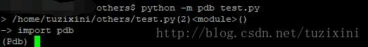
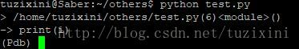
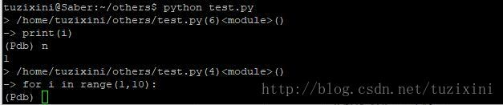
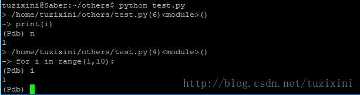
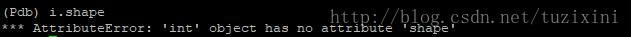

# pdb用法-Python 命令行调试工具

⌚️:2020年11月30日

📚参考

---


写代码(bug)的过程中调试时不可缺少的一个环节,今天学习了Python的命令行调试工具-pdb,本篇博客为学习记录. 
pdb是Python自带的一个库,所以不需要另外的安装即可直接使用.

## 1. 进入pdb调试模式的两种方法

### 1.1 直接在命令行参数指定使用pdb模块启动Python文件

```shell
python -m pdb test.py
```

程序将进入调试界面 




### 1.2 在程序代码中设置断点

首先需要在程序中使用如下语句导入pdb模块:

```python
import pdb
```

然后再在需要设置断点的地方放置如下断点设置代码:

```python
pdb.set_trace()
```

然后在命令行中正常运行程序,程序会在设置断点的位置自动停下进入pdb调试模式. 
例如运行如下程序代码:

```python
#/usr/bin/python
import pdb

for i in range(1,10):
    pdb.set_trace()
    print(i)
```





发现程序停在了指定位置(这里是第6行),并且进入了调试模式.

### 2. 调试程序的方法

进入调试程序后可以使用相应的命令进行指定的操作. 
这里介绍几个常用的命令:可以使用命令全称也可以使用缩写

### 2.1 使用pdb的命令

next(缩写:n),向下执行一步, 


 

比如我这里还是刚才那个程序,输入n回车之后,程序执行了进入断点处的下一句代码(也就是print(i)) 
更多的命令请看->4.命令附录

### 2.2 直接输入变量名称

还可以直接输入变量的名称查看变量的值 



### 2.3 使用类的方法查看变量/类的信息(输入表达式)

像数组这种还可以使用类似 i.shape 这样的输入直接调用相关方法,这个拓展就很广了,大家可以自由发挥 

 

当然我这里的i是个int肯定是无法查看shape的,但是可以看见pdb会详细给出相应的报错提示信息,还是很好用的.

### 2.4 更多的命令以及详细用法

| 命令     | 缩写   | 说明                                         |
| -------- | ------ | -------------------------------------------- |
| break    | b      | 设置断点                                     |
| continue | cont/c | 继续执行至下一个断点                         |
| next     | n      | 执行下一行,如果下一行是子程序,不会进入子程序 |
| step     | s      | 执行下一行,如果下一行是子程序,会进如子程序   |
| where    | bt/w   | 打印堆栈轨迹                                 |
| enable   | -      | 启用禁用的断点                               |
| disable  | -      | 禁用启用的断点                               |
| pp/p     | -      | 打印变量或表达式                             |
| list     | l      | 根据参数值打印源码                           |
| up       | u      | 移动到上一层堆栈                             |
| down     | d      | 移动到下一层堆栈                             |
| restart  | run    | 重新开始调试                                 |
| args     | a      | 打印函数参数                                 |
| clear    | cl     | 清楚所有断点                                 |
| return   | r      | 执行到当前函数结束                           |
| quit     | q      | 结束调试,退出当前程序                        |

注:**需要注意n和s两个命令的区别**,restart和run这里写作缩写,其实这两个命令可以看成是同一个命令.

这里只列出了部分比较常用的命令,更多的命令以及详细的解释请参考Python官方文档: 
https://docs.python.org/3/library/pdb.html 
(**可以在页面最上方选择Python版本,但是好像基本命令都是一致的,这里我没有详细对比.**)