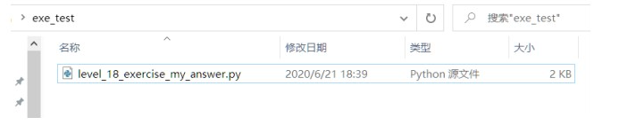
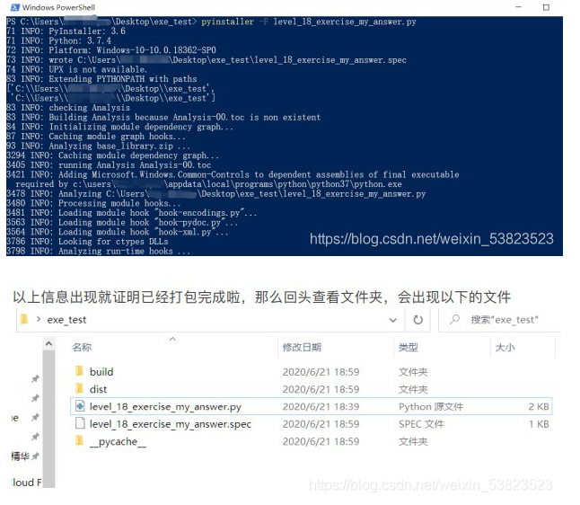

# Python代码封装

⌚️:2020年11月30日

📚参考

- http://blog.sina.com.cn/s/blog_7fa9bb7d0102vi9a.html
- [很详细的解释](https://www.cnblogs.com/dcpeng/p/12324703.html)

---


## 一、exe(windows的可执行程序)

### 1. 无参数

用专门的模块，把python文件件打包成exe格式文件！这个模块的名字叫：pyinstaller 不能拼错哦。py是python的py，installer是安装器的意思。

安装这个模块的方法：在cmd命令窗口中输入`pip install pyinstaller`

注意哈：exe是windows的程序，不适⽤于MacOS系统。

新建一个文件夹，把写好的python文件放进去，下图：我以level_18_excerise_my_answer.py
这个文件为例



然后点击空白处，按住shift+鼠标右击，点击“在此处打开命令行窗口”，在cmd命令中输入

“pyinstaller -F level_18_exercise_my_answer.py”

（pyinstaller -F 是固定的命令，后面是相应的⽂件名！）

在回车之后，则会出现以下画面，一大串不用理它，等它运行完就好啦

（可能你的命令行和我的长得不一样，没关系！都能用）



而封装好的exe程序就在dist文件夹中，如图所示：


倘若你的windows是正版的话就会出现代码里print的内容，如果不是正版的将会出现没有dll文件支持，那么就需要进行正版的系统安装了。

### 2. 带参数

解决方案：使用bat文件与os.system()函数。

假设我们要运行的temp.exe文件，有四个需要传入的参数p1，p2。


在python文件里run.py：

```
import sys

arg1 = sys.argv[1]
arg2 = sys.argv[2]
print(arg1)
print(arg2)

平时运行python XX.py arg1 arg2
打包完成后运行XX.exe arg1 arg2
打包完成后运行后并获得print输出
output=os.popen(‘path\XX.exe arg1 arg2’).read()

2.一般打包都是使用pyinstaller -F -w xxx.py，传入参数之后没有任何提示和print
换成pyinstaller -F xxx.py即可
```

可利用该代码段编写批处理.exe的程序