# Python 的 分装wheel

⌚️:2021年08月05日

📚参考

- https://zhuanlan.zhihu.com/p/276461821

---

## 一、Python的Setup.py

### 1. 为什么需要对项目分发打包？

平常我们习惯了使用 pip 来安装一些第三方模块，这个安装过程之所以简单，是因为模块开发者为我们默默地为我们做了所有繁杂的工作，而这个过程就是 `打包`。

打包，就是将你的源代码进一步封装，并且将所有的项目部署工作都事先安排好，这样使用者拿到后即装即用，不用再操心如何部署的问题（如果你不想对照着一堆部署文档手工操作的话）。

不管你是在工作中，还是业余准备自己写一个可以上传到 PyPI 的项目，你都要学会如何打包你的项目。

Python 发展了这么些年了，项目打包工具也已经很成熟了。他们都有哪些呢？

你可能听过 `disutils`、 `distutils` 、`distutils2`、`setuptools`等等，好像很熟悉，却又很陌生，他们都是什么关系呢？

### 2. 包分发的始祖：distutils

`distutils` 是 Python 的一个标准库，从命名上很容易看出它是一个分发（distribute）工具（utlis），它是 Python 官方开发的一个分发打包工具，所有后续的打包工具，全部都是基于它进行开发的。


`distutils` 的精髓在于编写 setup.py，它是模块分发与安装的指导文件。

那么如何编写 setup.py 呢？这里面的内容非常多，我会在后面进行详细的解析，请你耐心往下看。

你有可能没写过 setup.py ，但你绝对使用过 setup.py 来做一些事情，比如下面这条命令，我们经常用它来进行模块的安装。

```text
$ python setup.py install
```

这样的安装方法是通过源码安装，与之对应的是通过二进制软件包的安装，同样我也会在后面进行介绍。

### 3. 分发工具升级：setuptools

`setuptools` 是 distutils 增强版，不包括在标准库中。其扩展了很多功能，能够帮助开发者更好的创建和分发 Python 包。大部分 Python 用户都会使用更先进的 setuptools 模块。

**distribute**，或许你在其他地方也见过它，这里也提一下。

distribute 是 setuptools 有一个分支版本，分支的原因可能是有一部分开发者认为 setuptools 开发太慢了。但现在，distribute 又合并回了 setuptools 中。因此，我们可以认为它们是同一个东西。

还有一个大包分发工具是 **distutils2**，其试图尝试充分利用distutils，detuptools 和 distribute 并成为 Python 标准库中的标准工具。但该计划并没有达到预期的目的，且已经是一个废弃的项目。

因此，setuptools 是一个优秀的，可靠的 Python 包安装与分发工具。

那么如何在一个干净的环境中安装 setuptools 呢？

主要有两种方法：

- 源码安装：在 [https://pypi.org/project/setuptools/#files](https://link.zhihu.com/?target=https%3A//pypi.org/project/setuptools/%23files) 中下载 zip 包 解压执行 `python setup.py install` 安装
- 通过引导程序安装：下载引导程序，它可以用来下载或者更新最新版本的 setuptools

```text
$ wget http://peak.telecommunity.com/dist/ez_setup.py

# 安装
$ python ez_setup.py

# 更新，以下两种任选
$ python ez_setup.py –U setuptools
$ pip install -U setuptools
```


### 4. easy_install 使用指南

当你安装完 setuptools 后，就拥有了一个叫做 `easy_install` 的第三方管理工具，这也是它区分于 distutils 的一大改进。

这里简单介绍一下它的用法，虽然它已经用得非常少了。

先是包的安装

```text
# 通过包名，从PyPI寻找最新版本，自动下载、编译、安装
$ easy_install pkg_name

# 通过包名从指定下载页寻找链接来安装或升级包
$ easy_install -f http://pythonpaste.org/package_index.html 

# 指定线上的包地址安装
$ easy_install http://example.com/path/to/MyPackage-1.2.3.tgz

# 从本地的 .egg 文件安装
$ easy_install xxx.egg

# 在安装时你可以添加额外的参数
指定安装目录：--install-dir=DIR, -d DIR
指定用户安装：--user
```


再者是包的升级

```text
# 从 pypi 中搜索并升级包
$ easy_install --upgrade pkg_name

# 指定版本进行升级
$ easy_install "SomePackage==2.0"
```


最后是包的删除

```text
$ easy_install -m pkg_name
```


需要注意的是，这样的删除，仅是在 easy-install.pth 文件中删除，使其不能在 python 中使用 这个模块，但实际的包还在你的电脑中，若要删除彻底，需要你手动删除相关的 .egg 及 其他文件。

默认情况下，easy_install 只会从 pypi 上下载相关软件包，由于这个源在国外，下载包的速度并不理想，使用过pip的朋友自然会想，easy_install 是否能指定源进行安装呢？

答案是，可以的。

编辑配置文件 `/root/.pydistutils.cfg`

```text
[easy_install]
index-url=http://mirrors.aliyun.com/pypi/simple/
find-links=http://mirrors.aliyun.com/pypi/simple/
```


以上仅介绍了 easy_install 的一些常用的方法，想要了解更多，你可以点击官方文档：[https://setuptools.readthedocs.io/en/latest/easy_install.html](https://link.zhihu.com/?target=https%3A//setuptools.readthedocs.io/en/latest/easy_install.html)

总结一句：setuptools 是官方提供的一个专业用于包分发的工具，若只从安装的角度来看，它的功能确实简单。它更大的意义是对包的分发很有用，定制化程序非常高，我们现在也还在用它进行版本包的发布。

### 5. 源码包与二进制包什么区别？


Python 包的分发可以分为两种：

#### 1、以源码包的方式发布


源码包安装的过程，是先解压，再编译，最后才安装，所以它是跨平台的，由于每次安装都要进行编译，相对二进包安装方式来说安装速度较慢。

源码包的本质是一个压缩包，其常见的格式有：

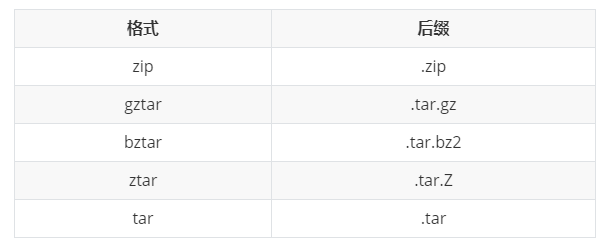


#### 2、以二进制包形式发布

二进制包的安装过程省去了编译的过程，直接进行解压安装，所以安装速度较源码包来说更快。

由于不同平台的编译出来的包无法通用，所以在发布时，需事先编译好多个平台的包。

二进制包的常见格式有：


### 6. eggs 与 wheels 有什么区别？

Egg 格式是由 setuptools 在 2004 年引入，而 Wheel 格式是由 PEP427 在 2012 年定义。Wheel 的出现是为了替代 Egg，它的本质是一个zip包，其现在被认为是 Python 的二进制包的标准格式。


以下是 Wheel 和 Egg 的主要区别：

- Wheel 有一个官方的 PEP427 来定义，而 Egg 没有 PEP 定义
- Wheel 是一种分发格式，即打包格式。而 Egg 既是一种分发格式，也是一种运行时安装的格式，并且是可以被直接 import
- Wheel 文件不会包含 .pyc 文件
- Wheel 使用和 PEP376 兼容的 .dist-info 目录，而 Egg 使用 .egg-info 目录
- Wheel 有着更丰富的命名规则。
- Wheel 是有版本的。每个 Wheel 文件都包含 wheel 规范的版本和打包的实现
- Wheel 在内部被 sysconfig path type 管理，因此转向其他格式也更容易

wheel 包可以通过 pip 来安装，只不过需要先安装 wheel 模块，然后再使用 pip 的命令。

```text
$ pip install wheel
$ pip wheel --wheel-dir=/local/wheels pkg
```


### 7. 超详细讲解 setup.py 的编写？

打包分发最关键的一步是编写 `setup.py` 文件。

以下是一个 setup.py 简单的使用示例

```text
from setuptools import setup, find_packages

setup(
    name="mytest",
    version="1.0",
    author="wangbm",
    author_email="wongbingming@163.com",
    description="Learn to Pack Python Module  -->公众号：Python编程时光",

    # 项目主页
    url="http://iswbm.com/", 

    # 你要安装的包，通过 setuptools.find_packages 找到当前目录下有哪些包
    packages=find_packages()
)
```


接下来，我将慢慢扩充这个setup函数，增加更多的参数，以便你能理解setup函数能做哪些事情。

#### **程序分类信息**

`classifiers` 参数说明包的分类信息。所有支持的分类列表见：[https://pypi.org/pypi?:action=list_classifiers](https://pypi.org/pypi?:action=list_classifiers)


示例：

```text
from setuptools import setup, find_packages

setup(
    classifiers = [
        # 发展时期,常见的如下
        #   3 - Alpha
        #   4 - Beta
        #   5 - Production/Stable
        'Development Status :: 3 - Alpha',

        # 开发的目标用户
        'Intended Audience :: Developers',

        # 属于什么类型
        'Topic :: Software Development :: Build Tools',

        # 许可证信息
        'License :: OSI Approved :: MIT License',

        # 目标 Python 版本
        'Programming Language :: Python :: 2',
        'Programming Language :: Python :: 2.7',
        'Programming Language :: Python :: 3',
        'Programming Language :: Python :: 3.3',
        'Programming Language :: Python :: 3.4',
        'Programming Language :: Python :: 3.5',
    ]
)
```


#### **关于文件的分发**

```text
from setuptools import setup, find_packages


setup(
    name="mytest",
    version="1.0",
    author="wangbm",
    author_email="wongbingming@163.com",
    description="Learn to Pack Python Module",
    url="http://iswbm.com/", 
    packages=find_packages(),

    # 安装过程中，需要安装的静态文件，如配置文件、service文件、图片等
    data_files=[
        ('', ['conf/*.conf']),
        ('/usr/lib/systemd/system/', ['bin/*.service']),
               ],

    # 希望被打包的文件
    package_data={
        '':['*.txt'],
        'bandwidth_reporter':['*.txt']
               },
    # 不打包某些文件
    exclude_package_data={
        'bandwidth_reporter':['*.txt']
               }
)
```


除了以上的参数配置之外，还可以使用一个叫做 `MANIFEST.in` 的文件，来控制文件的分发。

如下这是一个 `MANIFEST.in` 的样例：

```text
include *.txt
recursive-include examples *.txt *.py
prune examples/sample?/build
```

这些配置，规定了如下几点


- 所有根目录下的以 txt 为后缀名的文件，都会分发
- 根目录下的 examples 目录 和 txt、py文件都会分发
- 路径匹配上 examples/sample?/build 不会分发

`MANIFEST.in` 需要放在和 setup.py 同级的顶级目录下，setuptools 会自动读取该文件。

#### **关于依赖包下载安装**

```text
from setuptools import setup, find_packages


setup(
    ...

    # 表明当前模块依赖哪些包，若环境中没有，则会从pypi中下载安装
    install_requires=['docutils>=0.3'],

    # setup.py 本身要依赖的包，这通常是为一些setuptools的插件准备的配置
    # 这里列出的包，不会自动安装。
    setup_requires=['pbr'],

    # 仅在测试时需要使用的依赖，在正常发布的代码中是没有用的。
    # 在执行python setup.py test时，可以自动安装这三个库，确保测试的正常运行。
    tests_require=[
        'pytest>=3.3.1',
        'pytest-cov>=2.5.1',
    ],

    # 用于安装setup_requires或tests_require里的软件包
    # 这些信息会写入egg的 metadata 信息中
    dependency_links=[
        "http://example2.com/p/foobar-1.0.tar.gz",
    ],

    # install_requires 在安装模块时会自动安装依赖包
    # 而 extras_require 不会，这里仅表示该模块会依赖这些包
    # 但是这些包通常不会使用到，只有当你深度使用模块时，才会用到，这里需要你手动安装
    extras_require={
        'PDF':  ["ReportLab>=1.2", "RXP"],
        'reST': ["docutils>=0.3"],
    }
)
```


关于 `install_requires`， 有以下五种常用的表示方法：


1. `'argparse'`，只包含包名。 这种形式只检查包的存在性，不检查版本。 方便，但不利于控制风险。
2. `'setuptools==38.2.4'`，指定版本。 这种形式把风险降到了最低，确保了开发、测试与部署的版本一致，不会出现意外。 缺点是不利于更新，每次更新都需要改动代码。
3. `'docutils >= 0.3'`，这是比较常用的形式。 当对某个库比较信任时，这种形式可以自动保持版本为最新。
4. `'Django >= 1.11, != 1.11.1, <= 2'`，这是比较复杂的形式。 如这个例子，保证了Django的大版本在1.11和2之间，也即1.11.x；并且，排除了已知有问题的版本1.11.1（仅举例）。 对于一些大型、复杂的库，这种形式是最合适的。
5. `'requests[security, socks] >= 2.18.4'`，这是包含了额外的可选依赖的形式。 正常安装requests会自动安装它的`install_requires`中指定的依赖，而不会安装`security`和`socks`这两组依赖。 这两组依赖是定义在它的`extras_require`中。 这种形式，用在深度使用某些库时。


#### **关于安装环境的限制**

有些库并不是在所以的 Python 版本中都适用的，若一个库安装在一个未兼容的 Python 环境中，理论上不应该在使用时才报错，而应该在安装过程就使其失败，提示禁止安装。

这样的功能，可以使用 `python_requires` 来实现。

```text
setup(
    ...
    python_requires='>=2.7, <=3',
)
```


#### **生成可执行文件的分发**

```text
from setuptools import setup, find_packages


setup(
    name="mytest",
    version="1.0",
    author="wangbm",
    author_email="wongbingming@163.com",
    description="Learn to Pack Python Module",
    url="http://iswbm.com/", 
    packages=find_packages(),

    # 用来支持自动生成脚本，安装后会自动生成 /usr/bin/foo 的可执行文件
    # 该文件入口指向 foo/main.py 的main 函数
    entry_points={
        'console_scripts': [
            'foo = foo.main:main'
        ]
    },

    # 将 bin/foo.sh 和 bar.py 脚本，生成到系统 PATH中
    # 执行 python setup.py install 后
    # 会生成 如 /usr/bin/foo.sh 和 如 /usr/bin/bar.py
    scripts=['bin/foo.sh', 'bar.py']
)
```


上面的 scripts 里有的脚本中有 `sh` 和 `py` 后缀，那么安装后，setuptools 会原封不动的移动到 /usr/bin 中，并添加可执行权限。

若你想对这些文件再作一些更改，比如去掉多余的后缀，可以这样做

```text
from setuptools.command.install_scripts import install_scripts

class InstallScripts(install_scripts):

    def run(self):
        setuptools.command.install_scripts.install_scripts.run(self)

        # Rename some script files
        for script in self.get_outputs():
            if basename.endswith(".py") or basename.endswith(".sh"):
                dest = script[:-3]
            else:
                continue
            print("moving %s to %s" % (script, dest))
            shutil.move(script, dest)

setup(
    ...
    scripts=['bin/foo.sh', 'bar.py'],

    cmdclass={
        "install_scripts": InstallScripts
    }
)
```


#### **ext_modules**

`ext_modules` 参数用于构建 C 和 C++ 扩展扩展包。其是 Extension 实例的列表，每一个 Extension 实例描述了一个独立的扩展模块，扩展模块可以设置扩展包名，头文件、源文件、链接库及其路径、宏定义和编辑参数等。如：

```text
setup(
    # other arguments here...
    ext_modules=[
        Extension('foo',
                  glob(path.join(here, 'src', '*.c')),
                  libraries = [ 'rt' ],
                  include_dirs=[numpy.get_include()])
    ]
)
```


详细了解可参考：[https://docs.python.org/3.6/distutils/setupscript.html#preprocessor-options](https://docs.python.org/3.6/distutils/setupscript.html#preprocessor-options)


#### **指定release**

setup.py 里只能指定 version，而不能指定 release，如果你需要变更版本号，可以使用 `--release` 参数进行指定

```text
python setup.py bdist_rpm --release=20200617
```

#### setup参数总结

setup.py 的参数非常多，能够不借助文档写好一个setup.py好像没那么简单。为了备忘，我整理了 setup 函数常用的一些参数：

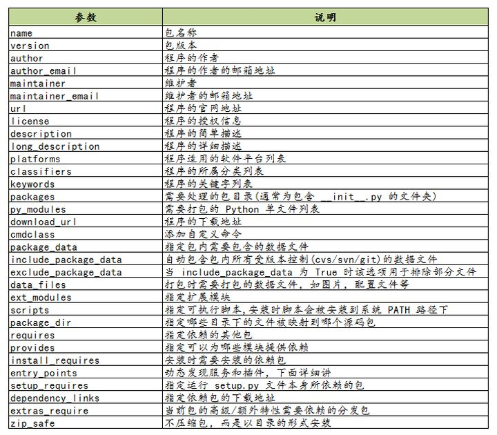

更多参数可见：[https://setuptools.readthedocs.io/en/latest/setuptools.html](https://setuptools.readthedocs.io/en/latest/setuptools.html)


### 8. 打包辅助神器PBR 是什么？

`pbr` 是 setuptools 的辅助工具，最初是为 OpenStack 开发([https://launchpad.net/pbr)，基于`d2to1`。](https://link.zhihu.com/?target=https%3A//launchpad.net/pbr)

`pbr` 会读取和过滤setup.cfg中的数据，然后将解析后的数据提供给 `setup.py` 作为参数。包含如下功能：

1. 从git中获取Version、AUTHORS and ChangeLog信息
2. Sphinx Autodoc。pbr 会扫描project，找到所有模块，生成stub files
3. Requirements。pbr会读取requirements.txt，生成setup函数需要的`install_requires/tests_require/dependency_links`

这里需要注意，在 `requirements.txt` 文件的头部可以使用：`--index https://pypi.python.org/simple/`，这一行把一个抽象的依赖声明如 requests==1.2.0 转变为一个具体的依赖声明 requests 1.2.0 from pypi.python.org/simple/

#### long_description

从README.rst, README.txt or README file中生成`long_description`参数

使用pbr很简单：

```text
from setuptools import setup

setup(
    setup_requires=['pbr'],
    pbr=True,
)
```

使用pbr时，setup.cfg中有一些配置。在[files]中，有三个key：
`packages`:指定需要包含的包，行为类似于setuptools.find_packages
`namespace_packages`:指定namespace packages
`data_files`: 指定目的目录和源文件路径，一个示例：

```text
[files]
data_files =
    etc/pbr = etc/pbr/*
    etc/neutron =
        etc/api-paste.ini
        etc/dhcp-agent.ini
    etc/init.d = neutron.init
```

`[entry_points]` 段跟 setuptools 的方式相同。

到此，我讲了三种编写使用 setup.py 的方法

- 使用命令行参数指定，一个一个将参数传递进去（极不推荐）
- 在 setup.py 中的setup函数中指定（推荐使用）
- 使用 pbr ，在 setup.cfg 中指定（易于管理，更推荐）

### 9. 如何使用 setup.py 构建包

#### 1、构建源码发布包。

用于发布一个 Python 模块或项目，将源码打包成 tar.gz （用于 Linux 环境中）或者 zip 压缩包（用于 Windows 环境中）

```text
$ python setup.py sdist
```

那这种包如何安装呢

答案是，使用下一节即将介绍的 `setuptools` 中提供的 `easy_install` 工具。

```text
$ easy_install xxx.tar.gz
```

使用 sdist 将根据当前平台创建默认格式的存档。在类 Unix 平台上，将创建后缀后为 `.tar.gz` 的 gzip 压缩的tar文件分发包，而在Windows上为 ZIP 文件。

当然，你也可以通过指定你要的发布包格式来打破这个默认行为

```text
$ python setup.py sdist --formats=gztar,zip
```

你可以指定的格式有哪些呢？

创建一个压缩的tarball和一个zip文件。可用格式为：

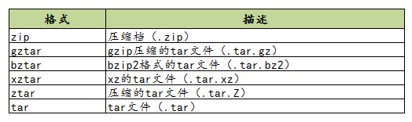


对以上的格式，有几点需要注意一下：

- 在版本3.5中才添加了对 `xztar` 格式的支持
- zip 格式需要你事先已安装相应的模块：zip程序或zipfile模块（已成为Python的标准库）
- ztar 格式正在弃用，请尽量不要使用

另外，如果您希望归档文件的所有文件归root拥有，可以这样指定

```text
python setup.py sdist --owner=root --group=root
```

#### 2、构建二进制分发包。

在windows中我们习惯了双击 exe 进行软件的安装，Python 模块的安装也同样支持 打包成 exe 这样的二进制软件包。

```text
$ python setup.py bdist_wininst
```

而在 Linux 中，大家也习惯了使用 rpm 来安装包，对此你可以使用这条命令实现 rpm 包的构建

```text
$ python setup.py bdist_rpm
```

若你喜欢使用 easy_install 或者 pip 来安装离线包。你可以将其打包成 egg 包

```text
$ python setup.py bdist_egg
```


若你的项目，需要安装多个平台下，既有 Windows 也有 Linux，按照上面的方法，多种格式我们要执行多次命令，为了方便，你可以一步到位，执行如下这条命令，即可生成多个格式的进制

```text
$ python setup.py bdist
```


### 10. 如何使用 setup.py 安装包


正常情况下，我们都是通过以上构建的源码包或者二进制包进行模块的安装。

但在编写 setup.py 的过程中，可能不能一步到位，需要多次调试，这时候如何测试自己写的 setup.py 文件是可用的呢？

这时候你可以使用这条命令，它会将你的模块安装至系统全局环境中

```text
$ python setup.py install
```

如若你的项目还处于开发阶段，频繁的安装模块，也是一个麻烦事。

这时候你可以使用这条命令安装，该方法不会真正的安装包，而是在系统环境中创建一个软链接指向包实际所在目录。这边在修改包之后不用再安装就能生效，便于调试。

```text
$ python setup.py develop
```

> #### ubuntu下查看用pip安装的包的位置以及dist-packages和site-packages区别
>
> 问题一：
>
> 可先用pip list命令显示已安装包的信息（包名与版本号） 
>
> 再用pip show package_name命令能显示该安装的包的相关信息，其中包括它的安装路径。实际上包通常被安装在python安装目录下的lib\site-packages目录下
>
> 问题二：
>
> python安装第三方包的安装路径，dist-packages和site-packages区别
>
> ​            
>
> 简单来说
> 如果是系统自带的python，会使用dist-packages目录；
> 如果你手动安装python，它会直接使用目录site-packages。
> 这允许你让两个安装隔离开来。
> dist-packages：系统自带的python
> site-packages：自己安装的python

### 11. 如何发布包到 PyPi？

通过上面的学习，你一定已经学会了如何打包自己的项目，若你觉得自己开发的模块非常不错，想要 share 给其他人使用，你可以将其上传到 PyPi （Python Package Index）上，它是 Python 官方维护的第三方包仓库，用于统一存储和管理开发者发布的 Python 包。

如果要发布自己的包，需要先到 pypi 上注册账号。然后创建 `~/.pypirc` 文件，此文件中配置 PyPI 访问地址和账号。如的.pypirc文件内容请根据自己的账号来修改。

典型的 .pypirc 文件

```text
[distutils]
index-servers = pypi

[pypi]
username:xxx
password:xxx
```


然后使用这条命令进行信息注册，完成后，你可以在 PyPi 上看到项目信息。

```text
$ python setup.py register
```

注册完了后，你还要上传源码包，别人才使用下载安装

```text
$ python setup.py upload
```

或者也可以使用 `twine` 工具注册上传，它是一个专门用于与 pypi 进行交互的工具，详情可以参考官网：[https://www.ctolib.com/twine.html，这里不详细讲了。](https://link.zhihu.com/?target=https%3A//www.ctolib.com/twine.html%EF%BC%8C%E8%BF%99%E9%87%8C%E4%B8%8D%E8%AF%A6%E7%BB%86%E8%AE%B2%E4%BA%86%E3%80%82)

## 二、分装wheel & 并发布到网上的具体过程

打包python module 到PYPI 上

最近心血來潮覺得打包至pypi 上的模組很有趣，於是嘗試了約半天時間完成模組上傳動作，並測試api結果，途中遇到幾個問題，在這一一解釋清楚，讓需要的讀者可以節省一些時間。

打包流程:

1. 準備一個要上傳的code with python (同一目錄下需要有__init__.py file)
2. 註冊pypi/pypitest account .
3. install setuptools , wheel .
4. 設定 setup.py .
5. write License file.
6. write readme.md .
7. 執行python setup.py sdist.
8. 上傳打包好的tar.gz 至 pypitest 上.
9. 使用pip install 安裝 剛剛上傳之pypitest package .
10. 測試成功後，正式上傳pypi上

以上流程在網路上中文資訊較少，在此分享給大家

### 1 準備一個要上傳的code with python

第一步當然就是要有root code ,架構大概如下:


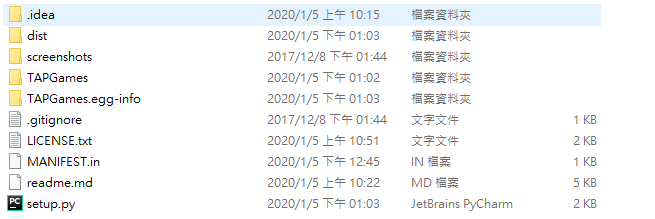

檔案目錄下架構

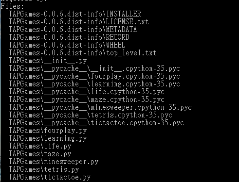

使用pip show 看的package 架構

```
#在這介紹如何看package 目錄結構pip show -f package_name
```

這裡的package_name = TAPGames

可以看到目錄code都放置於TAPGames folder 下，且須有__init__.py file

- __init__.py 必須要存在是讓程式知道這個目錄是模組，裡面可空白可寫程式，我這package 的__init__.py 是空白file.

### 2 註冊pypi/pyputest 帳戶

\1. pypi提供一個上傳測試用server，叫testpypi.

目的在於官方提供測試平台，讓需要upload package的先在這裡測試，避免再正式平台上修修改改的，讓release package 都確保是正確的。

[TestPyPI · The Python Package IndexThe Python Package Index (PyPI) is a repository of software for the Python programming language. PyPI helps you find…test.pypi.org](https://test.pypi.org/)

請先註冊帳號，等等測試用會需要

\2. pypi正是平台如下:

[PyPI · The Python Package IndexThe Python Package Index (PyPI) is a repository of software for the Python programming language. PyPI helps you find…pypi.org](https://pypi.org/)

請先註冊帳號，測試完後release 至pypi.org 會用到。

### 3 install setuptools , wheel .

這裡需要安裝打包必須要有的packages，基本上anaconda都會包含在裡面，只是需要升級

```
python -m pip install --user --upgrade twine
```

在官方給出的doc都有詳細解說，這篇只是把流程再走一遍!

https://packaging.python.org/guides/distributing-packages-using-setuptools/

### 4 設定 setup.py

到了需要設定setup 裡的資訊，這裡要讓程式知道模組裡面的metadata，

```
import setuptools# readme.md = github readme.md, 這裡可接受markdown寫法
# 如果沒有的話，需要自己打出介紹此專案的檔案，再讓程式知道with open("README.md", "r") as fh:
    long_description = fh.read()

setuptools.setup(
    name="example-pkg-YOUR-USERNAME-HERE", # 
    version="0.0.1",
    author="Example Author",
    author_email="author@example.com",
    description="A small example package",
    long_description=long_description,
    long_description_content_type="text/markdown",
    url="https://github.com/pypa/sampleproject",
    packages=setuptools.find_packages(),
    classifiers=[
        "Programming Language :: Python :: 3",
        "License :: OSI Approved :: MIT License",
        "Operating System :: OS Independent",
    ],
    python_requires='>=3.6',
)
```

- name = 此專案的名子(不推薦名子含有'-' or '_')
- version = 此發布的版次，命名規則可參考 https://www.python.org/dev/peps/pep-0440/
- author = 此專案作者
- author_email = 此專案作者信箱
- description = 短述此專案介紹


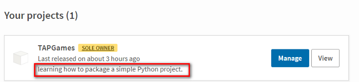

紅色框位置=description

- long_description = readme.md → pypi上此專案的介紹

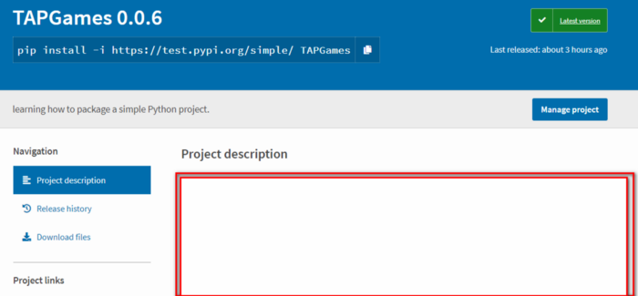

紅色區塊是show readme的地方

- long_description_content_type = 'text/markdown' →讓程式知道這是markdown格式，其他格式請參考官方給出的doc
- url = 此project 的網站，大多會以github為主。
- packages= setuptools.find_packages() → 這會讓setuptools自己去找(猜)進入點，如果讀者自己的專案有專門的Main進入點，這裡就要指向腳本，畢竟程式不一定會知道專案的進入點
- classifiers = 分類項目 參考: https://pypi.org/classifiers/


classifiers 會放置網站左下方，是區分此專案在哪個分類裡面

- python_requires = '≥3.6' ，表示此專案需要大於等於python 3.6
- 這裡需要額外的介紹此參數include_package_data=True，這裡指說True，則會需要MANIFEST.in 這個file，此檔案裡面寫說此packages還需要額外的那些file，例:

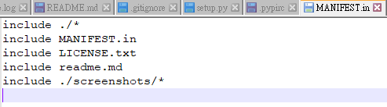

MANIFEST.in 的範例，詳細內容請參閱google

- 當然還有更多細節可以設定，請參閱: https://packaging.python.org/tutorials/packaging-projects/

### 5 write license

這是3rd 需要的文件，以保護自己避免觸法。

簡單的去選擇需要的License:https://choosealicense.com/

請copy and write txt至當前目錄下

### 6 write Readme.md

如果有使用過github ，就會知道readme試做啥的，可以略過此節。

沒使用過的 github ，則要先學習markdown語法 : https://ithelp.ithome.com.tw/articles/10203758

並且先去註冊github，利用readme練習markdown語法。

### 7 執行sdist

使用下列語法，能夠使setuptools套件自動去讀取setup.py裡相關參數，並產生tar.gz file

```
python setup.py sdist
```

程式完成後，會產生dist 資料夾，並產生tar.gz，是不是這裡很熟悉，這就是pypi 上 project 裡安裝的tar.gz，哪wheel呢?

```
python setup.py sdist bdist_wheel 
```

bdist_wheel 這參數則是呼叫並建立 wheel file ，資料位置如下:

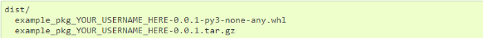

### 8 上傳打包好的tar.gz 至 pypitest 上.

要到了上傳到測試伺服器的時候，這裡前提條件要有pypitest account ，如果沒有的話請先去辦，不然會出現此error:

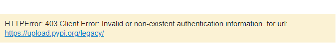

在上傳之前會經過account確認，有兩個方式做:

1. 手動輸入，每次上傳都必須通過帳戶認證(官方推薦)
2. create .pypirc file 並放置主目錄下( $HOME/.pypirc) →並不是專案的主目錄，而是系統的主目錄下，檔案內容參考如下:

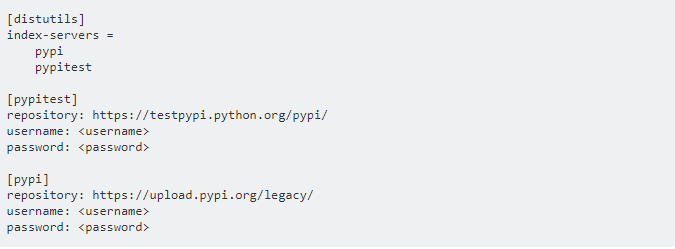

.pypirc file 就是告訴伺服器你的Account 不用每次都做帳號密碼的輸入，但這個官方說不是很安全。

以上都了解，接下來打指令

```
python -m twine upload --repository-url https://test.pypi.org/legacy/ dist/*
```

twine套件會把dist/*上傳至https://test.pypi.org/legacy/ 這個伺服器，沒有error出現，程式就會跑出一個web address，圖如下:

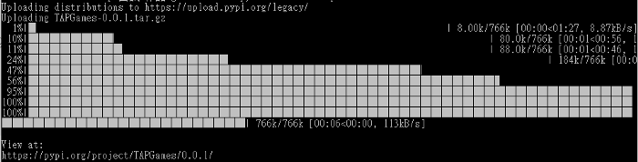

這時候請去pypitest 的網站，會看到your projects 有上傳，這時候整個完成度80%。

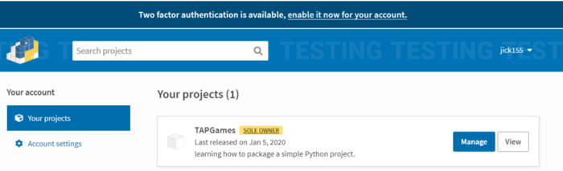

### 9你使用pip install 安裝 剛剛上傳之pypitest package .

網站會告訴你如何安裝測試伺服器上的package

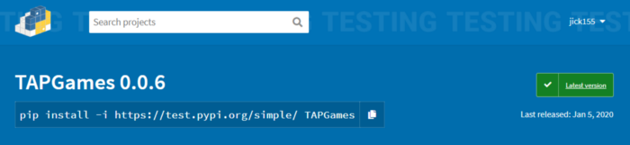

但這裡測試萬無一失後，會進入到上傳正式伺服器上。

如何測試?，請安裝完後自行測試是否可正常import並使用。

### 10 測試成功後，正式上傳pypi上

這裡的上傳指令只是把url 刪掉

```
python -m twine upload --repository-url https://test.pypi.org/legacy/ dist/*
```

變成

```
python -m twine upload dist/*
```

開發者把 default設置為正式伺服器:

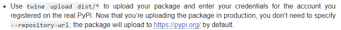

上傳成功後會在 https://pypi.org/ 看見your project and Down.

### * Problem Center

這裡記錄我在嘗試路上遇到的錯誤:

1. ValueError: pypitest not found in .pypirc

Ans:這代表主目錄下並無pypirc file ,主目錄指cmd 開啟預設的位置。


\2. error: Upload failed (400): The description failed to render in the default format of reStructuredText. See https://pypi.org/help/#description-content-type for more information.

Ans: Readme 有未支援的symbols。

過程:這裡說我的readme 格式不符，但官方有說支援markdown格式，於是我找了Readme 內容是否哪裡有不支援→找到怪怪的符號.fix and Down.

\3. HTTPError: 403 Client Error: Invalid or non-existent authentication information. for url: https://test.pypi.org/legacy/

Ans : 帳戶認證失敗。

\4. OpenSSL.SSL.SysCallError: (10054, ‘WSAECONNRESET’)

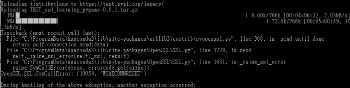

Ans : 重來一次即可。

\5. HTTPError: 400 Client Error: This filename has already been used, use a different version. See https://test.pypi.org/help/#file-name-reuse for url: https://test.pypi.org/legacy/

Ans : 指上傳版本已存在，請進版or delete 伺服器上的project，因這裡是測試伺服器，所以進版並不會上到正式伺服器上。


<iframe src="https://accounts.google.com/gsi/iframe/select?client_id=216296035834-k1k6qe060s2tp2a2jam4ljdcms00sttg.apps.googleusercontent.com&amp;ux_mode=popup&amp;ui_mode=card&amp;as=%2BBAdL86ptkKlKAqdMpOm%2Fg&amp;channel_id=dc493afe249c4e30a3eb4a8e6786e33d0ca18e13998aec270b00fe577156ccb6&amp;origin=https%3A%2F%2Fmedium.com" title="“使用 Google 帐号登录”对话框" style="box-sizing: inherit; border: none; width: 391px; height: 185px; overflow: hidden;"></iframe>