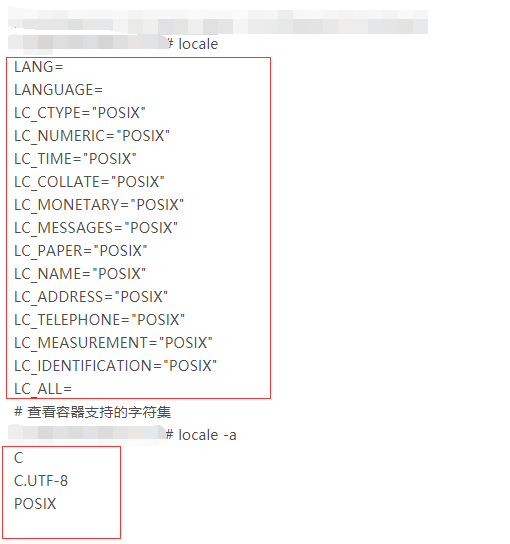
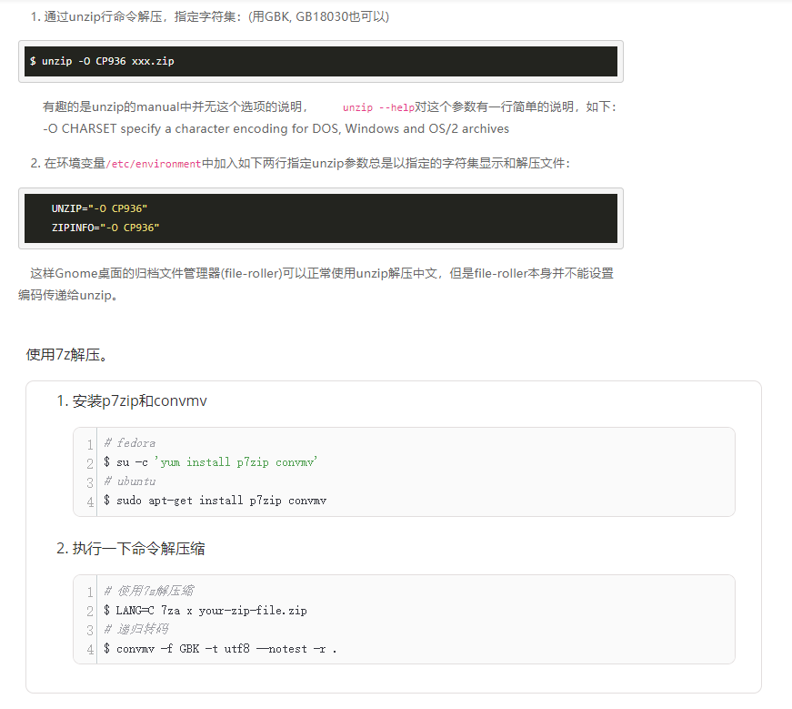

# 中文乱码问题

⌚️:2021年08月13日

📚参考

- https://blog.csdn.net/michaelwoshi/article/details/105180900
- https://www.cnblogs.com/lsdb/p/12470739.html

---

## 1.解决docker 容器中中文乱码问题

一个后端服务容器中解压zip包，释放出带文件名带中文的文件，中文显示被?代替，初步推断是服务基础镜像系统字符集出现问题。

 

进入容器中端界面，手动创建带中文的文件，果不其然，中文显示被?代替了！

 

进入容器 查看字符集

```
#  docker exec -it  <container_id>  /bin/bash

# locale

# locale  -a
```



从输出可以看到，系统使用的是POSIX字符集，POSIX字符集是不支持中文的，而UTF-8是支持中文的 只要把系统中的环境 LANG 改为”UTF-8”格式即可解决问题。

 

在容器中临时测试

`export  LANG="en_US.UTF-8"`

手动touch一个带中文的文件，显示正常。

 

永久设置需在Dockerfile中设置环境字符集环境变量

`ENV  LANG="en_US.UTF-8"`

创建文件的的文件名中文显示问题解决了，程序解压zip包，释放出带文件名带中文的文件名显示乱码问题依然存在。

查阅知道得知，原zip格式并没有指定编码格式，Windows下生成的zip文件中的编码是**GBK/GB2312**等，因此，导致这些zip文件在Linux下解压时出现乱码问题，因为Linux下的默认**编码是UTF-8**。

zip这种档案格式1993年出现以来，直到2006年 6.3版才支持Unicode（UTF-8）文件名。虽然zip标准里说在此之前只支持IBM CP437编码，但如果那样的话，在zip档案中只能出现拉丁字母和少量的其它字符。事实上，各种zip软件在创建档案时使用当前系统的字符集来编码文件名，这样的档案文件在使用同样字符集的系统里可被正常解压，但在别的系统里解压就容易出现文件名乱码问题。

如果能在创建zip文件的时候明确要求软件使用Unicode文件名，就能保证支持zip 6.3标准的软件总能正确地解码档案中的文件名。在我找到的资料里，7-zip从2008年开始支持Unicode文件名，并提供了3种模式，其中-mcu选项会让7-zip在遇到非ASCII字符时便启用UTF-8文件名编码，其命令行使用方法如下：

`#7z  a  -mcu  X.zip    FILE_NAME`

7zFM的“创建压缩包”对话框左下角有一个名叫“参数”的文本框，在里面可以填写创建压缩包时想要使用的参数，但必须省略“-m”，也就是说，如需指定“-mcu”，则要在该文本框里填写“cu”。


一般来说， 解决方式：




第一条命令用于解压缩，而LANG=C表示以US-ASCII这样的编码输出文件名，如果没有这个语言设置，它同样会输出乱码，只不过是UTF8格式的乱码(convmv会忽略这样的乱码)。

第二条命令是将GBK编码的文件名转化为UTF8编码，-r表示递归访问目录，即对当前目录中所有文件进行转换。

 

不管Windows还是linux，都可以压缩成7z格式，因为这种压缩有自己的编码，不会乱，但是使用7zip，需要引入新的软件包，我们一般选择指定解压字符编码。


## 2. Python3报错UnicodeEncodeError，与容器无关

### 一、背景说明

最开始不愿意使用Python，一大原因是因为Python2默认使用ASCII编码处理中文可以说是一件痛苦的事情。仅从更换默认编码一项变换，就可以说Python3和Python2不算同一门语言。

Python3更换为默认使用Unicode（utf-8）编码，一直使用下来再没有遇到编码问题带来的困挠，似乎编码问题在Python3时代就该完全消失的。但这两天遇到了一个问题。

在调用一个库时，出现了一个异常报错类似如UnicodeEncodeError: 'ascii' codec can't encode characters in position 0-1: ordinal not in range(128)，几经排查之下发现只要该库返回结果包含中文，我这边使用print()打印该结果时就会出现该异常。

 

### 二、原因分析

#### 2.1 数据要经过编码才能传输

我们知道数据在网络上传输时，需要先编码；平时我们可能并不注意，但现在要明确，编码的原因不在于网络而在于传输。

print()相当于把字符串从内存传输到了tty上，所以print()是需要encode()动作的；平时我们print()时一般都不需要encode()，只是因为当print()检测到传来的参数是不是byte类型时自动进行了编码。

 

#### 2.2 print()使用何种编码

Python3默认使用的是utf-8，这可以通过sys.getdefaultencoding()进行确认。但这只是默认，当系统配置了LC_ALL、LC_CTYPE、LANG等环境变量时（三者优先级从高到低），Python3采用这些变量配置的编码；如果这些变量配置的是utf-8那Python3用的就还是utf-8，但如果不是utf-8那Python3所用的也就不是utf-8了。

当前使用的编码可通过sys.getfilesystemencoding()获取。

 

### 三、场景复现

为简单起见，我们这里直接以打印一个中文字符串作为演示，示例代码如下（我这里保存成test_encode.py）：

```
import sys

class TestEncode():
    def __int__(self):
        pass

    def main_logic(self):
        # 打印语言默认编码
        print(f"defaultencoding--{sys.getdefaultencoding()}")
        # 打印系统配置的编码
        print(f"filesystemencoding--{sys.getfilesystemencoding()}")

        # 最后尝试打印中文
        print("中文")

if __name__ == "__main__":
    obj = TestEncode()
    obj.main_logic()
```

shell依次执行如下命令：

```
# 查看当前编码情况
locale
# 确认在utf-8情况下打印中文无误
python3 test_encode.py

# 设置LC_TYPE，C代表ASCII
export LC_CTYPE="C"
# 查看当前编码情况
locale
# 再次运行，确认系统编码已改变，并出现编码错误
python3 test_encode.py
```

最终结果如下，在系统编码配置为utf-8时打印正常，在系统编码改为C（即ASCII）后打印报编码异常（不过我在root用户环境修改编码一直不成功，不懂我电脑有点问题还是什么原因）：


 

### 四、解决办法

方法一：设置系统所用编码为utf-8

既然问题是系统语言编码所致，那我们在运行前把LC_ALL等环境变量改为utf-8即可；实现的方式有多种，最简单的就是在运行前export。

```
export LC_ALL="en_US.utf8"
```

方法二：使用PYTHONIOENCODING

```
PYTHONIOENCODING=utf-8 python test_encode.py
```

方法三：先编好码再交给print()（不实用？）

其实回顾我们第二大节的分析，之后以需要找系统的编码是因为print()收到未经编码的内容，所以更直接的处理办法是我们先编好码再交给print()就好了。（不过交给print时是byte类型，最后print输出的也是byte类型？）

```
print("中文".encode(encoding="utf-8"))
```

方法四：直接在Python中重新设置标准输出编码

这种方法直接在Python代码中改，是与Python最契合的做法，脚本文件形式时特别推荐

```
import sys
import codecs

sys.stdout = codecs.getwriter("utf-8")(sys.stdout.detach())
print("中文")
```