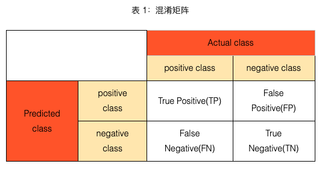

# mAP

⌚️: 2021年4月1日

📚参考

-  [视频](https://www.bilibili.com/video/av583749910/)
- [原文地址](https://www.cnblogs.com/makefile/p/metrics-mAP.html)
- https://blog.csdn.net/laizi_laizi/article/details/103887550

---

准确率、精确率（查准率）、召回率（查全率）、F1值、ROC曲线的AUC值、mAP都可以作为评价一个机器学习模型好坏的指标（evaluation metrics），而这些评价指标直接或间接都与混淆矩阵有关，前四者可以从混淆矩阵中直接计算得到，ROC、mAP和混淆矩阵联系密切，所以在了解这些评价指标之前，先知道什么是混淆矩阵很有必要，也方便记忆。

## 0. 混淆矩阵

　　混淆矩阵（**confusion matrix**）又称为可能性表格或是错误矩阵。它是一种特定的矩阵用来呈现算法性能的可视化效果，通常是监督学习（非监督学习，通常用匹配矩阵：**matching matrix**）。其每一列代表预测值，每一行代表的是实际的类别。这个名字来源于它可以非常容易的表明多个类别是否有混淆（也就是一个**class**被预测成另一个**class**）, 对于一个二分类问题，我们可以得到如表 1所示的的混淆矩阵（confusion matrix）：

表 1 所示的混淆矩阵中，行表示数据在模型上的预测类别（predicted class/predicted condition），列表示数据的真实类别（actual class/true condition）。在看混淆矩阵时，要分清样本的真实类别和预测类别，有些地方的行列表示可能和这里不一致。[在sklearn中，二分类问题下的混淆矩阵需要分别将表 1 中的predicted class和Actual class对调，将横纵坐标的positive class和negative class都分别对调，再重新计算混淆矩阵。](http://scikit-learn.org/stable/modules/generated/sklearn.metrics.confusion_matrix.html)

通过混淆矩阵，我们可以很直观地看清一个模型在各个类别（positive和negative）上分类的情况。

表 2：TP、FP、FN、TN

| 英文 | 解释                                                         |
| ---- | ------------------------------------------------------------ |
| TP   | 真实类别为positive，模型预测的类别也为positive               |
| FP   | 预测为positive，但真实类别为negative，真实类别和预测类别不一致 |
| FN   | 预测为negative，但真实类别为positive，真实类别和预测类别不一致 |
| TN   | 真实类别为negative，模型预测的类别也为negative               |

TP、FP、TN、FN，**第二个字母表示样本被预测的类别，第一个字母表示样本的预测类别与真实类别是否一致**。 

TP（True Positives）意思就是被分为了正样本，而且分对了。

TN（True Negatives）意思就是被分为了负样本，而且分对了。

FP（Fasle Positives）意思就是被分为了正样本，但是分错了（事实上这个样本是负样本）。

FN（Fasle Negatives）意思就是被分为了负样本，但是分错了（事实上这个样本是正样本）。

在mAP计算过程中主要用到了， TP，FP，FN这三个概念。

## 1. Recall和Precision

精确率（查准率）和召回率（查全率）

positive class的精确率（precision）计算公式如下：

$$
precision = \frac{TP}{TP+FP} = \frac{TP}{预测为Positive的样本}
$$

positive class的召回率（recall）计算公式如下：

$$
recall = \frac{TP}{TP+FN} = \frac{TP}{真实为Positive的样本}
$$

 准确率（accuracy）计算公式如下所示：

准确率表示预测正确的样本（TP和TN）在所有样本（all data）中占的比例。在数据集不平衡时，准确率将不能很好地表示模型的性能。可能会存在准确率很高，而少数类样本全分错的情况，此时应选择其它模型评价指标。 

### 1.1 两类

**用一个具体例子说明**：

假设我们在数据集上训练了一个识别猫咪的模型，测试集包含40个样本，其中猫咪20张，另外20张为小狗。测试结果显示为猫咪的共16张图片，其中确实为猫咪的共14张，也就是有4张猫咪没有被模型检测出来，而且在检测结果中有2张为误检。因为猫咪更为可爱，我们更关注猫咪的检测情况，所以这里将猫咪认为是正类。那么对于狗来说，剩下的24张是狗，其18张真的是狗，另外6张是猫。

我们给出混淆矩阵：

| -     | Positive | Negative | All  |
| ----- | -------- | -------- | ---- |
| True  | TP:14    | TN:18    | 32   |
| False | FP:2     | FN:6     | 8    |
| All   | 16       | 24       | 40   |

所以可以知道:

accuracy = （TP + TN）/all = 32/40

### 1.2 多类

**再举个例子**（多分类Precision和Recall）

给出例子：

| class       | 实际属于类别1 | 实际属于类别2 | 实际属于类别3 |
| ----------- | ------------- | ------------- | ------------- |
| 预测为类别1 | 30            | 20            | 10            |
| 预测为类别2 | 50            | 60            | 10            |
| 预测为类别3 | 20            | 20            | 80            |

我们选择计算类别1，其他类似
类别1的TP:30
类别1的FP:20+10=30
类别1的FN:50+20=70
类别1的TN:60+10+20+80=170
所以类别1的:

### 1.3 为什么要引入recall和precision？

recall和precision是模型性能的两个不同维度的度量。

在图像分类任务中，虽然很多时候考察的是accuracy，比如ImageNet的评价标准。但具体到单个类别，如果recall比较高，但precision较低，比如大部分汽车都被识别出来了，但把很多卡车也误识别为汽车，这时候对应一个原因。如果recall较低，precision较高，比如检测出来的飞机结果很准确，但是有很多的飞机没有被识别出来，这时候又有一个原因。

recal度量的是【查全率】，所有的正样本是不是都被检测出来了。比如在肿瘤预测场景中，要求模型有更高的recall，不能放过每一个肿瘤。

precision度量的是【查准率】，在所有检测出来的正样本中是不是实际都是正样本。比如在垃圾邮件判断场景中，要求有更高的precision，确保放到回收站的都是垃圾邮件。

一般情况下模型不够理想，准确率高、召回率低，或者召回率低、准确率高。如果做疾病监测、反垃圾，则是保准确率的条件下，提升召回率。如果是做搜索，那就是保证召回的情况下提升准确率。

#### 单指标的局限性

在目标检测算法里面有一个非常重要的概念是置信度，如果执行度设置的高的话，预测的结果和实际情况就很符合，如果设置执行度低的话，就会有很多误检测。

假设一副图里面共有3个正样本，目标检测对这幅图的预测结果有10个，其中3个实际上是正样本，7个实际上是负样本。对应置信度如下。

引出AP的概念

### 1.4 F1、Fβ

`F1 score` 通常我们使用precision和recall两个指标来衡量模型的好坏,但是同时要权衡这两个量,影响我们做决策的速度.可以使用F1 score来组合这两个量(又称F score,F measure,名称F没有什么意义):

在β=1时，Fβ就是F1值，此时Fβ认为精确率和召回率一样重要；当β>1时，Fβ认为召回率更重要；当0<β<1时，Fβ认为精确率更重要。除了F1值之外，常用的还有F2和F0.5。

## 2.ROC曲线及其AUC值

> 实际中，用PR曲线会更多，用ROC曲线会比较少。

ROC 曲线下的面积,面积越大,分类效果越好. ROC横轴为假正率(FP,false positive),纵轴为真正率(TP,true positive)。 通过给分类器设置不同的置信度阈值得到多组（FP,TP）数据绘制成ROC 曲线。AUC全称为Area Under Curve，表示一条曲线下面的面积，ROC曲线的AUC值可以用来对模型进行评价。ROC曲线如图 1 所示：

*

 图 1：ROC曲线（注：图片摘自https://en.wikipedia.org/wiki/Receiver_operating_characteristic）

ROC曲线的纵坐标True Positive Rate（TPR）在数值上就等于positive class的recall，记作recall_𝑝𝑜𝑠𝑖𝑡𝑖𝑣𝑒，横坐标False Positive Rate（FPR）在数值上等于(1 - negative class的recall)，记作(1 - recall_𝑛𝑒𝑔𝑎𝑡𝑖𝑣𝑒)如下所示：

$$
TPR = \frac{TP}{TP+FN}=recall_{positive}
$$

$$
FPR = \frac{FP}{FP+TN}=\frac{FP + TN -TN}{FP + TN} = 1- \frac{TN}{FP+TN}=1-recall_{negative}
$$

通过对分类阈值θ（默认0.5）从大到小或者从小到大依次取值，我们可以得到很多组TPR和FPR的值，将其在图像中依次画出就可以得到一条ROC曲线，阈值θ取值范围为\[0,1\]。

ROC曲线在图像上越接近左上角(0,1)模型越好，即ROC曲线下面与横轴和直线FPR = 1围成的面积（AUC值）越大越好。直观上理解，纵坐标TPR就是recall_𝑝𝑜𝑠𝑖𝑡𝑖𝑣𝑒值，横坐标FPR就是(1 - recall_𝑛𝑒𝑔𝑎𝑡𝑖𝑣𝑒)，前者越大越好，后者整体越小越好，在图像上表示就是曲线越接近左上角(0,1)坐标越好。

图 １展示了３个模型的ROC曲线，要知道哪个模型更好，则需要计算每条曲线的AUC值，一般认为AUC值越大越好。AUC值由定义通过计算ROC曲线、横轴和直线FPR = 1三者围成的面积即可得到。

**AUC 的含义**

AUC值是一个概率值，当你随机挑选一个正样本以及一个负样本，当前的分类算法根据计算得到的Score值将这个正样本排在负样本前面的概率就是AUC值。当然，AUC值越大，当前的分类算法越有可能将正样本排在负样本前面，即能够更好的分类。

**为什么使用ROC曲线？**

评价标准已有很多，为什么还要使用ROC和AUC呢？因为ROC曲线有个很好的特性：当测试集中的正负样本的分布变化的时候，ROC曲线能够保持不变。在实际的数据集中经常会出现类不平衡（class imbalance）现象，即负样本比正样本多很多（或者相反），而且测试数据中的正负样本的分布也可能随着时间变化。

- `loss_bbox` 预测边框和真实边框的坐标之间的差别,如采用smooth L1 loss计算.
- `mAP` 对于每一类计算平均精度(AP,average precision),然后计算所有类的均值。mAP 综合考量了P、R，解决P，R的单点值局限性。PR曲线与ROC曲线类似，曲线下面积越大越好，因此我们定义PR曲线下面积为：

当然,这种积分只是一种理想的计算方式, 实际中可采用 Approximated Average precision: $\sum^{N}_{k} = P(k)\Delta r(k)$. 表示当识别出k张图片(或目标)时准确率与召回率的变化量(从k-1变化到k)的乘积累加和.

另一种度量性能的标准：Interpolated Average Precision。这一新的算法不再使用P(k)，而是使用：

使用Interpolated Average Precision算出的Average Precision值明显要比Approximated Average Precision的方法算出的要高。

很多文献都是用Interpolated Average Precision 作为度量方法，并且直接称算出的值为Average Precision 。PASCAL Visual Objects Challenge从2007年开始就是用这一度量制度，他们认为这一方法能有效地减少Precision-recall 曲线中的抖动。

## 3. PR曲线

从上面的学习我们知道，P和R都是越高越好，但是一般情况下这两者是互相矛盾的。例如极端情况下，我们值检测出一个正例，且这个结果检测是正确的，那么P就是100%，但是还有很多没有检测出来导致Recall很低。 

算法对样本进行分类时，都会有置信度，即表示该样本是正样本的概率，比如99%的概率认为样本Ａ是正例，１％的概率认为样本B是正例。通过选择合适的阈值，比如50%，对样本进行划分，概率大于50%的就认为是正例，小于50%的就是负例。

通过置信度就可以对所有样本进行排序，再逐个样本的选择阈值，在该样本之前的都属于正例，该样本之后的都属于负例。每一个样本作为划分阈值时，都可以计算对应的precision和recall，那么就可以以此绘制曲线。那很多书上、博客上给出的P-R曲线，都长这样。

> 当然，这种曲线是有可能的。但是仔细琢磨就会发现一些规律和一些问题。
>
> 根据逐个样本作为阈值划分点的方法，可以推敲出，recall值是递增的（但并非严格递增），随着划分点左移，正例被判别为正例的越来越多，不会减少。而精确率precision并非递减，二是有可能振荡的，虽然正例被判为正例的变多，但负例被判为正例的也变多了，因此precision会振荡，但整体趋势是下降。
>
> 另外P-R曲线肯定会经过（0,0）点，比如讲所有的样本全部判为负例，则TP=0，那么P=R=0，因此会经过（0,0）点，但随着阈值点左移，precision初始很接近1，recall很接近0，因此有可能从（0,0）上升的线和坐标重合，不易区分。如果最前面几个点都是负例，那么曲线会从（0,0）点开始逐渐上升。
>
> 曲线最终不会到（1,0）点。很多P-R曲线的终点看着都是（1,0）点，这可能是因为负例远远多于正例。
>
> 最后一个点表示所有的样本都被判为正例，因此FN=0，所以recall = TP/(TP + FN) = 1, 而FP = 所有的负例样本数，因此precision = TP/(TP+FP) = 正例的占所有样本的比例，故除非负例数很多，否则precision不会为0.
>
> 因此，较合理的P-R曲线应该是（曲线一开始被从（0，0）拉升到（0,1），并且前面的都预测对了，全是正例，因此precision一直是1,）
>
> 另外，如果有个划分点可以把正负样本完全区分开，那么P-R曲线就是整个1*1的面积。
>
> 总之，P-R曲线应该是从（0,0）开始画的一条曲线，切割1*1的正方形，得到一块区域。

## 4. **AP值**

Average Precision，即 平均精确度 。

如何衡量一个模型的性能，单纯用 precision 和 recall 都不科学。于是人们想到，为何不把 PR曲线下的面积 当做衡量尺度呢？于是就有了 AP值 这一概念。这里的 average，等于是对 precision 进行 取平均 。

上图是一个类的AP值，

### 参考Github

这个是用来绘制mAP曲线的：https://github.com/Cartucho/mAP

这个是用来获取绘制mAP曲线所需的txt的：https://github.com/bubbliiiing/count-mAP-txt

### 4.1 mAP是什么

Mean Average Precision，即 平均AP值 。

**多标签图像分类任务**中图片的标签不止一个，因此评价不能用普通单标签图像分类的标准，即mean accuracy，该任务采用的是和信息检索中类似的方法—mAP（mean Average Precision），虽然其字面意思和mean accuracy看起来差不多，但是计算方法要繁琐得多。

### 4.2 计算过程

> 方式1 
>
> 接下来说说AP的计算，此处参考的是PASCAL VOC challenge 的计算方法。首先设定一组阈值，[0, 0.1, 0.2, …, 1]。然后对于recall大于每一个阈值（比如recall>0.3），我们都会得到一个对应的最大precision。这样，我们就计算出了11个precision。AP即为这11个precision的平均值。这种方法英文叫做11-point interpolated average precision(差值平均精度)。具体流程为：
>
> 1. 对于类别C，首先将算法输出的所有C类别的预测框，按置信度排序；
> 2. 设定不同的k值，选择top k个预测框，计算FP和TP，使得 recall 分别等于0，0.1，0.2，0.3，0.4，0.5，0.6，0.7，0.8，0.9，1.0；
>    计算Precision；
> 3. 将得到的11个Precision取平均，即得到AP；
>    **AP是针对单一类别的，mAP是将所有类别的AP求和，再取平均：
>    mAP = 所有类别的AP之和 / 类别的总个数**

> 方法2
>
> PASCAL VOC challenge 自2010年后换了另一种计算方法,提高了计算的精度,能更好地区分低准确率的方法。新的计算方法假设这N个样本中有M个正例，那么我们会得到M个recall值,对于每个recall值r，我们可以计算出对应（r' > r）的最大precision，然后对这M个precision值取平均即得到最后的AP值。参考`voc2012/devkit_doc`.
> 改进后曲线单调递减:
>
> 
>
> PR-curv2
>
> 改进后的 mAP 值通常比 VOC07 的方法得到的 mAP 高一些（一般5%以内）， 但也存在变低的情况。因为计算的是曲线下的面积，有时也写作`ap_auc`。可参考下文的代码进行理解。
>
> AP衡量的是学出来的模型在每个类别上的好坏，mAP是取所有类别AP的平均值，衡量的是在所有类别上的平均好坏程度。
>
> 
>
> 在 MSCOCO 竞赛中𝐴𝑃50或者`AP@0.5`指的是当设置IoU为0.5时的平均准确率。AP75 是严格模式的测量. $𝐴𝑃^{small},AP^{medium},AP^{large}$分别对应面积 $ 𝑎𝑟𝑒𝑎<32^2,32^2<𝑎𝑟𝑒𝑎<96^2,𝑎𝑟𝑒𝑎>96^2$的目标分别测试的值.
>
> `mAP@[.5:.95]`是在不同 IoU (从 0.5 到 0.95, 步长0.05) 设置下的平均值,又可写作`mmAP`或 AP, 参考[cocoeval.py](https://github.com/cocodataset/cocoapi/blob/master/PythonAPI/pycocotools/cocoeval.py).

#### 4.2.1 **保存所有样本的confidence score**

首先用训练好的模型得到所有测试样本的confidence score，每一类（如car）的confidence score保存到一个文件中（如comp1_cls_test_car.txt）。假设共有20个测试样本，每个的id，confidence score和ground truth label如下： 

#### 4.2.2 **对confidence score进行排序**

#### 4.2.3 **计算precision和recall**

上面我们一共有20个测试样本，如果把这20个样本放在一起，按照混淆矩阵给出的把他们分成4类，就可以得到下面的示意图：

其中，圆圈内（真正 + 假正）是我们模型预测为正的元素，比如对测试样本在训练好的car模型上分类（如果是car，输出label = 1，反之=0），现在假设我们想得到top-5的结果，也就是说圆圈内一共有5个数据，即排序好的表的前面5个：

好了，上表就是我们预测为正的元素啦，他的准确率是多少？

P=TP/（TP+FP）=2/（2+3）=2/5=40%

召回率是多少呢？在这里请注意我们的所有测试样本一共有多少个car（也就是label=1有几条数据），在下表中很容易找到**6条记录**，那我们预测出来的结果找到几个car呢？上面的top-5中我们只找到了**2个car**。 

也就是说，召回率为：

R=TP/（TP+FN）=2/（2+4）=2/6=30%

实际多类别分类任务中，我们通常不满足只通过top-5来衡量一个模型的好坏，而是需要知道从top-1到top-N（N是所有测试样本个数，本文中为20）对应的precision和recall。显然随着我们选定的样本越来也多，recall一定会越来越高，而precision整体上会呈下降趋势。把recall当成横坐标，precision当成纵坐标，即可得到常用的precision-recall曲线。这个例子的precision-recall曲线如下：

#### 4.2.4 **计算AP**

接下来说说AP的计算，此处参考的是PASCAL VOC CHALLENGE的计算方法。首先设定一组阈值，[0, 0.1, 0.2, …, 1]。然后对于recall大于每一个阈值（比如recall>0.3），我们都会得到一个对应的最大precision。这样，我们就计算出了11个precision。AP即为这11个precision的平均值。这种方法英文叫做11-point interpolated average precision。

当然PASCAL VOC CHALLENGE自2010年后就换了另一种计算方法。新的计算方法假设这N个样本中有M个正例，那么我们会得到M个recall值（1/M, 2/M, …, M/M）,对于每个recall值r，我们可以计算出对应（r’ > r）的最大precision，然后对这M个precision值取平均即得到最后的AP值。计算方法如下： 

 
注：这里倒数第二列，top-6的Max Precision应该为3/6（而不是4/7），上面图片有点问题。

（1 + 1 + 0.5 + 0.571 + 0.454 + 0.375）/ 6 = 

AP衡量的是学出来的模型在给定类别上的好坏，而mAP衡量的是学出的模型在所有类别上的好坏，得到AP后mAP的计算就变得很简单了，就是取所有AP的平均值。

> **目标检测中mAP的具体计算**
>
> - TP: IoU>0.5的检测框数量（同一Ground Truth只计算一次）
> - FP: IoU<=0.5的检测框，或者是检测到同一个GT的多余检测框的数量
> - FN: 没有检测到的GT的数量
