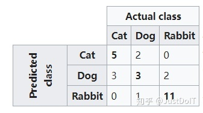

# 语义分割之评价指标

⌚️: 2021年4月1日

📚参考

----

摘录自[https://arxiv.org/abs/1704.06857](https://link.zhihu.com/?target=https%3A//arxiv.org/abs/1704.06857)

> 本文将介绍语义分割的三大评价指标，分别是执行时间、内存占用以及准确度，其中本文着重介绍准确度并给出相应的python实现

**1、执行时间（execution time）**

**2、内存占用（memory footprint）**

**3、准确度（accuracy）**


假定一定有k+1类（包括k个目标类和1个背景类）， ![[公式]](https://www.zhihu.com/equation?tex=p_%7Bij%7D) 表示本属于i类却预测为j类的像素点总数，具体地， ![[公式]](https://www.zhihu.com/equation?tex=p_%7Bii%7D) 表示true postives， ![[公式]](https://www.zhihu.com/equation?tex=p_%7Bij%7D) 表示false positives， ![[公式]](https://www.zhihu.com/equation?tex=p_%7Bji%7D) 表示false negatives

### **Pixel Accuracy (PA)**

分类正确的像素点数和所有的像素点数的比例

![[公式]](https://www.zhihu.com/equation?tex=PA+%3D+%5Cfrac%7B%5Csum_%7Bi%3D0%7D%5E%7Bk%7D%7Bp_%7Bii%7D%7D%7D%7B%5Csum_%7Bi%3D0%7D%5E%7Bk%7D%7B%5Csum_%7Bj%3D0%7D%5E%7Bk%7D%7Bp_%7Bij%7D%7D%7D%7D)

### **Mean Pixel Accuracy (MPA)**

计算每一类分类正确的像素点数和该类的所有像素点数的比例然后求平均

![[公式]](https://www.zhihu.com/equation?tex=MPA+%3D+%5Cfrac%7B1%7D%7Bk%2B1%7D%5Csum_%7Bi%3D0%7D%5E%7Bk%7D%7B%5Cfrac%7Bp_%7Bii%7D%7D%7B%5Csum_%7Bj%3D0%7D%5E%7Bk%7D%7Bp_%7Bij%7D%7D%7D%7D)

### **Mean Intersection over Union (MIoU)**

计算每一类的IoU然后求平均。一类的IoU计算方式如下，例如i=1， ![[公式]](https://www.zhihu.com/equation?tex=p_%7B11%7D) 表示true positives，即本属于1类且预测也为1类， ![[公式]](https://www.zhihu.com/equation?tex=%5Csum_%7Bj%3D0%7D%5E%7Bk%7D%7Bp_%7B1j%7D%7D)表示本属于1类却预测为其他类的像素点数（注意，这里包含了 ![[公式]](https://www.zhihu.com/equation?tex=p_%7B11%7D) ）， ![[公式]](https://www.zhihu.com/equation?tex=%5Csum_%7Bj%3D0%7D%5E%7Bk%7D%7Bp_%7Bj1%7D%7D) 表示本属于其他类却预测为1类的像素点数（注意，这里也包含了 ![[公式]](https://www.zhihu.com/equation?tex=p_%7B11%7D) ），在分母处 ![[公式]](https://www.zhihu.com/equation?tex=p_%7B11%7D) 计算了两次所以要减去一个![[公式]](https://www.zhihu.com/equation?tex=p_%7B11%7D)

![[公式]](https://www.zhihu.com/equation?tex=MIoU+%3D+%5Cfrac%7B1%7D%7Bk%2B1%7D%5Csum_%7Bi%3D0%7D%5E%7Bk%7D%7B%5Cfrac%7Bp_%7Bii%7D%7D%7B%5Csum_%7Bj%3D0%7D%5E%7Bk%7D%7Bp_%7Bij%7D%7D+%2B+%5Csum_%7Bj%3D0%7D%5E%7Bk%7D%7Bp_%7Bji%7D%7D+-+p_%7Bii%7D%7D%7D)

### **Frequency Weighted Intersection over Union (FWIoU)**

可以理解为根据每一类出现的频率对各个类的IoU进行加权求和

![[公式]](https://www.zhihu.com/equation?tex=FWIoU+%3D+%5Cfrac%7B1%7D%7B%5Csum_%7Bi%3D0%7D%5E%7Bk%7D%7B%5Csum_%7Bj%3D0%7D%5E%7Bk%7D%7Bp_%7Bij%7D%7D%7D%7D%5Csum_%7Bi%3D0%7D%5E%7Bk%7D%7B%5Cfrac%7Bp_%7Bii%7D%5Csum_%7Bj%3D0%7D%5E%7Bk%7D%7Bp_%7Bij%7D%7D%7D%7B%5Csum_%7Bj%3D0%7D%5E%7Bk%7D%7Bp_%7Bij%7D%7D+%2B+%5Csum_%7Bj%3D0%7D%5E%7Bk%7D%7Bp_%7Bji%7D%7D+-+p_%7Bii%7D%7D%7D)


### **评价指标python实现**

（摘录自[https://github.com/jfzhang95/pytorch-deeplab-xception/blob/master/utils/metrics.py](https://link.zhihu.com/?target=https%3A//github.com/jfzhang95/pytorch-deeplab-xception/blob/master/utils/metrics.py)）

这里用到了混淆矩阵（confusion matrix [https://en.wikipedia.org/wiki/Confusion_matrix](https://link.zhihu.com/?target=https%3A//en.wikipedia.org/wiki/Confusion_matrix)）



```python3
import numpy as np


class Evaluator(object):
    def __init__(self, num_class):
        self.num_class = num_class
        self.confusion_matrix = np.zeros((self.num_class,)*2)

    def Pixel_Accuracy(self):
        Acc = np.diag(self.confusion_matrix).sum() / self.confusion_matrix.sum()
        return Acc

    def Pixel_Accuracy_Class(self):
        Acc = np.diag(self.confusion_matrix) / self.confusion_matrix.sum(axis=1)
        Acc = np.nanmean(Acc)
        return Acc

    def Mean_Intersection_over_Union(self):
        MIoU = np.diag(self.confusion_matrix) / (
                    np.sum(self.confusion_matrix, axis=1) + np.sum(self.confusion_matrix, axis=0) -
                    np.diag(self.confusion_matrix))
        MIoU = np.nanmean(MIoU)
        return MIoU

    def Frequency_Weighted_Intersection_over_Union(self):
        freq = np.sum(self.confusion_matrix, axis=1) / np.sum(self.confusion_matrix)
        iu = np.diag(self.confusion_matrix) / (
                    np.sum(self.confusion_matrix, axis=1) + np.sum(self.confusion_matrix, axis=0) -
                    np.diag(self.confusion_matrix))

        FWIoU = (freq[freq > 0] * iu[freq > 0]).sum()
        return FWIoU

    def _generate_matrix(self, gt_image, pre_image):
        mask = (gt_image >= 0) & (gt_image < self.num_class)
        label = self.num_class * gt_image[mask].astype('int') + pre_image[mask]
        count = np.bincount(label, minlength=self.num_class**2)
        confusion_matrix = count.reshape(self.num_class, self.num_class)
        return confusion_matrix

    def add_batch(self, gt_image, pre_image):
        assert gt_image.shape == pre_image.shape
        self.confusion_matrix += self._generate_matrix(gt_image, pre_image)

    def reset(self):
        self.confusion_matrix = np.zeros((self.num_class,) * 2)
```


