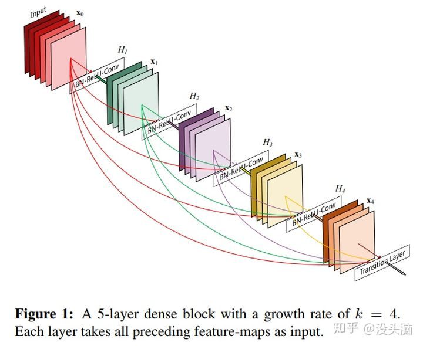
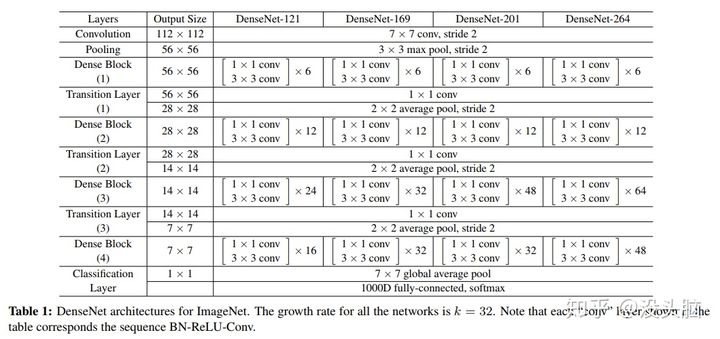

#  DenseNet

⌚️: 2021-07-21

📚参考

- 论文链接：[Densely Connected Convolutional Networks](https://link.zhihu.com/?target=https%3A//arxiv.org/pdf/1608.06993.pdf)，发表时间：2016.08

2016 年,DenseNet 横空出世,在当年也引起过热议。与 ResNet、Inception Net 不同，DenseNet 即没从网络的深度入手，也没从网络的宽度入手，而是对每层的 FeatureMap 进行特征复用，以此**缓解梯度消失问题，加强网络中特征的传递，有效对特征进行复用，并在提高网络的表现效果的同时减少了网络的参数量**！

在论文中，作者提出了一种网络结构：Dense Block（如下图所示）。在 Dense Block 中，每层卷积层的输入为在该 Block 中之前所有卷积层所输出的 FeatureMap 的 concation 结果 （此处与 ResNet 不同，ResNet 中将结果进行 add ）。作者在文中指出，ResNet 成功的关键点在于：‘they create short paths from early layers to later laters’；作者认为自己之所以提出的 Dense Block 这样的结果，就是为了保证层与层之间的信息能最大程度的保存。

**网络结构：**

- DenseNet 与其他 CNN 类似，同样保留着 down-sampling layers 的设计，网络中包含四个 Dense Block 和四个 Transition Layer，分别处理不同 Size 的 FeatureMap / 对 FeatureMap 进行 Pooling 操作。
- 根据 [Identity Mappings in Deep Residual Networks](https://link.zhihu.com/?target=https%3A//arxiv.org/pdf/1603.05027v3.pdf)，作者在 Dense Block 中将 BN 和 ReLU 设置在卷积层前面。由于 Dense Block 的特征复用操作，越后面的卷积层，其输入的 Channel 越大。故作者在 DenseNet 中引用了 Bottleneck Layer，即：BN-ReLU-Conv(1×1)-BN-ReLU-Conv(3×3)，以此避免计算量的快速增长。（文中记使用 Bottleneck Layer 的 DesnseNet 为 DenseNet-B）
- 作者还尝试在 Transition Layer 中对 FeatureMap 的 Channel 数量进行缩减，设输入的 FeatureMap 的 Channel 数为 m， ![[公式]](https://www.zhihu.com/equation?tex=%5Ctheta) 为压缩因子，则输出的 FeatureMap 的 Channel 数为 ![[公式]](https://www.zhihu.com/equation?tex=%5Clfloor+%5Ctheta+m+%5Crfloor) 。（实验中，作者设置 ![[公式]](https://www.zhihu.com/equation?tex=%5Ctheta) 为0.5;，并记使用 Bottleneck Layer 以及设置 Transition Layer 的 ![[公式]](https://www.zhihu.com/equation?tex=%5Ctheta+%3C+1) 的 DesnseNet 为 DenseNet-BC）
- 为保持特征复用的实现（即同意 DenseNet 中的所有 FeatureMap 大小一致），作者令 Dense Block 中的卷积层的卷积核大小为 3 × 3，padding 为 1，且采用 zero-padding。

**PS:** PyTorch 中的 [TORCHVISION.MODELS](https://link.zhihu.com/?target=https%3A//pytorch.org/docs/stable/torchvision/models.html) 提供基于 ImageNet 训练好的 DenseNet-121/DenseNet-161/DenseNet-169/DenseNet-201 模型，分别将其加载到显存中占了 1115/1201/1135/1153 MiB（训练与测试所占显存大小依赖于实验设置，故不做讨论）。

