# EfficientNet

⌚️: 2021-07-21

📚参考

- [EfficientNet: Rethinking Model Scaling for Convolutional Neural Networks](https://paperswithcode.com/paper/efficientnet-rethinking-model-scaling-for)
- [论文翻译](https://hellozhaozheng.github.io/z_post/%E8%AE%A1%E7%AE%97%E6%9C%BA%E8%A7%86%E8%A7%89-EfficientNet-ICML2019/)

- 原论文名称：EfficientNet: Rethinking Model Scaling for Convolutional Neural Networks
- 原论文提供代码：https://github.com/tensorflow/tpu/tree/master/models/official/efficientnet
- 自己使用Pytorch实现的代码： https://github.com/WZMIAOMIAO/deep-learning-for-image-processing
- 不想看文章的可以看下我在bilibili上录制的视频：https://www.bilibili.com/video/BV1XK4y1U7PX

---

## 前言

在之前的一些手工设计网络中(AlexNet，VGG，ResNet等等)经常有人问，为什么输入图像分辨率要固定为224，为什么卷积的个数要设置为这个值，为什么网络的深度设为这么深？这些问题你要问设计作者的话，估计回复就四个字——**工程经验**。而这篇论文主要是用NAS（Neural Architecture Search）技术来搜索网络的图像输入分辨率r，网络的深度 depth以及channel的宽度 width三个参数的合理化配置。在之前的一些论文中，基本都是通过改变上述3个参数中的一个来提升网络的性能，而这篇论文就是同时来探索这三个参数的影响。在论文中提到，本文提出的EfficientNet-B7在Imagenet top-1上达到了当年最高准确率84.3%，与之前准确率最高的GPipe相比，参数数量（Params）仅为其1/8.4，推理速度提升了6.1倍（看上去又快又轻量，但个人实际使用起来发现很吃显存）。下图是EfficientNet与其他网络的对比（注意，参数数量少并不意味推理速度就快）。

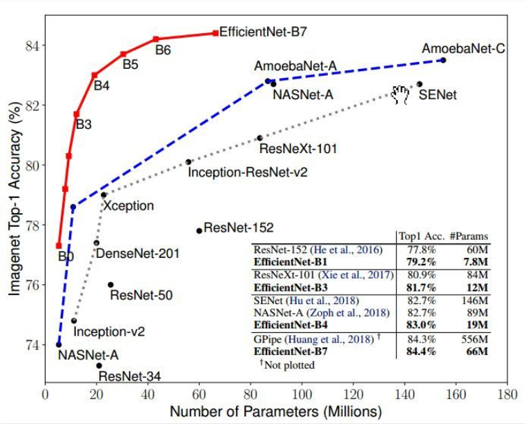

## 论文思想

在之前的一些论文中，有的会通过增加网络的width即增加卷积核的个数（增加特征矩阵的channels）来提升网络的性能如图(b)所示，有的会通过增加网络的深度即使用更多的层结构来提升网络的性能如图(c)所示，有的会通过增加输入网络的分辨率来提升网络的性能如图(d)所示。而在本篇论文中会同时增加网络的width、网络的深度以及输入网络的分辨率来提升网络的性能如图(e)所示：

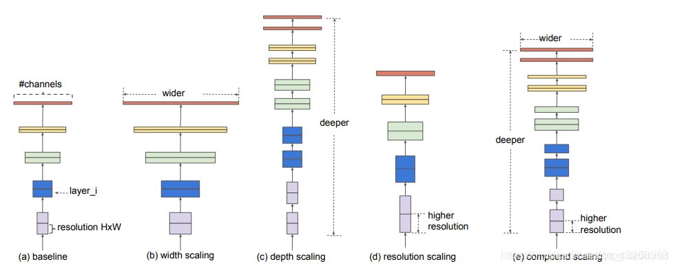

- 根据以往的经验，增加网络的深度depth能够得到更加丰富、复杂的特征并且能够很好的应用到其它任务中。但网络的深度过深会面临梯度消失，训练困难的问题。The intuition is that deeper ConvNet can capture richer and more complex features, and generalize well on new tasks. However, deeper networks are also more difficult to train due to the vanishing gradient problem
- 增加网络的width能够获得更高细粒度的特征并且也更容易训练，但对于width很大而深度较浅的网络往往很难学习到更深层次的特征。wider networks tend to be able to capture more fine-grained features and are easier to train. However, extremely wide but shallow networks tend to have difficulties in capturing higher level features.

- 增加输入网络的图像分辨率能够潜在得获得更高细粒度的特征模板，但对于非常高的输入分辨率，准确率的增益也会减小。并且大分辨率图像会增加计算量。With higher resolution input images, ConvNets can potentially capture more fine-grained patterns. but the accuracy gain diminishes for very high resolutions.

下图展示了在基准EfficientNetB-0上分别增加width、depth以及resolution后得到的统计结果。通过下图可以看出大概在Accuracy达到80%时就趋于饱和了。

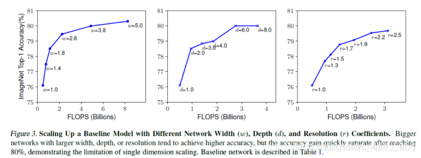

接着作者又做了一个实验，采用不同的d , r组合，然后不断改变网络的width就得到了如下图所示的4条曲线，通过分析可以发现在相同的FLOPs下，同时增加d和r 的效果最好。

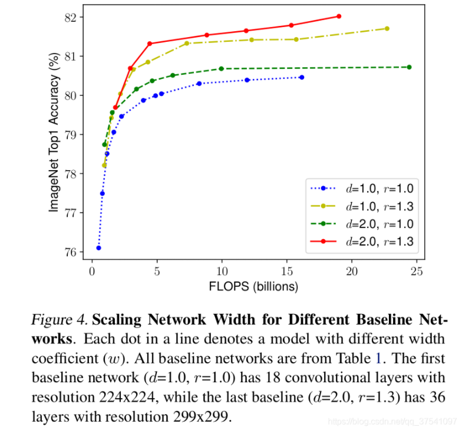

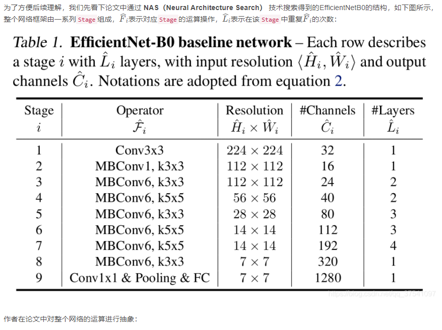

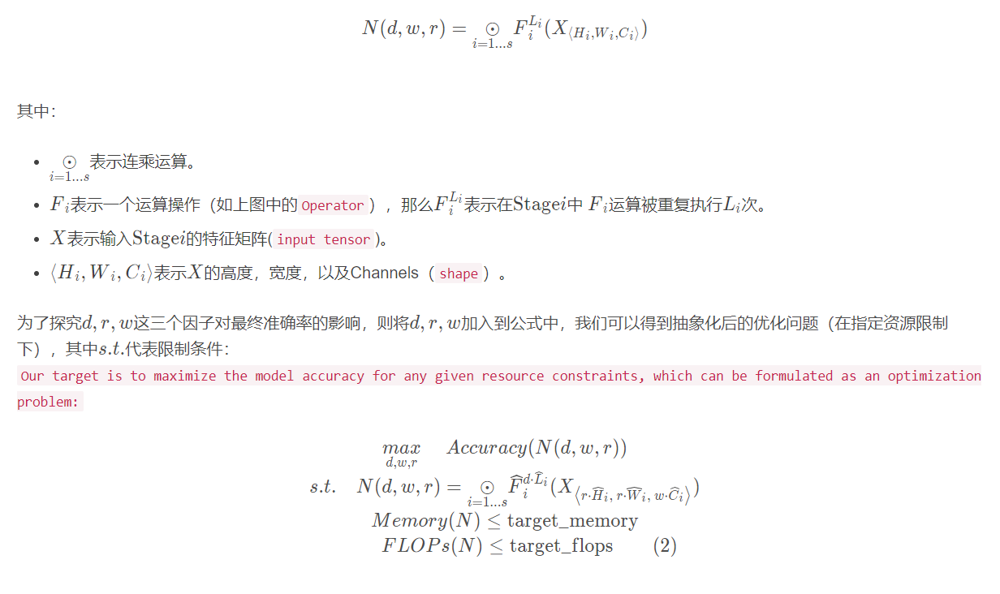

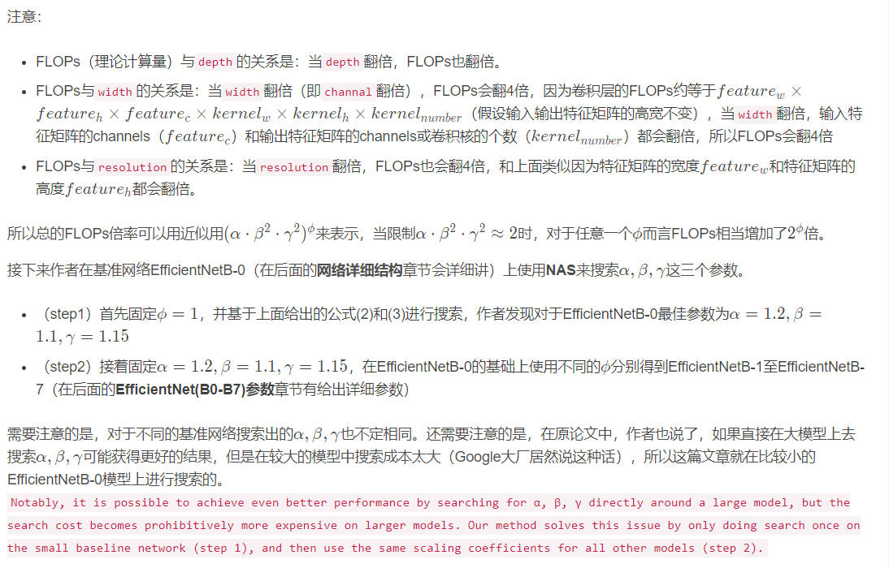

## 网络详细结构

下表为EfficientNet-B0的网络框架（B1-B7就是在B0的基础上修改Resolution，Channels以及Layers），可以看出网络总共分成了9个Stage，第一个Stage就是一个卷积核大小为3x3步距为2的普通卷积层（包含BN和激活函数Swish），Stage2～Stage8都是在重复堆叠MBConv结构（最后一列的Layers表示该Stage重复MBConv结构多少次），而Stage9由一个普通的1x1的卷积层（包含BN和激活函数Swish）一个平均池化层和一个全连接层组成。表格中每个MBConv后会跟一个数字1或6，这里的1或6就是倍率因子n即MBConv中第一个1x1的卷积层会将输入特征矩阵的channels扩充为n倍，其中k3x3或k5x5表示MBConv中Depthwise Conv所采用的卷积核大小。Channels表示通过该Stage后输出特征矩阵的Channels。

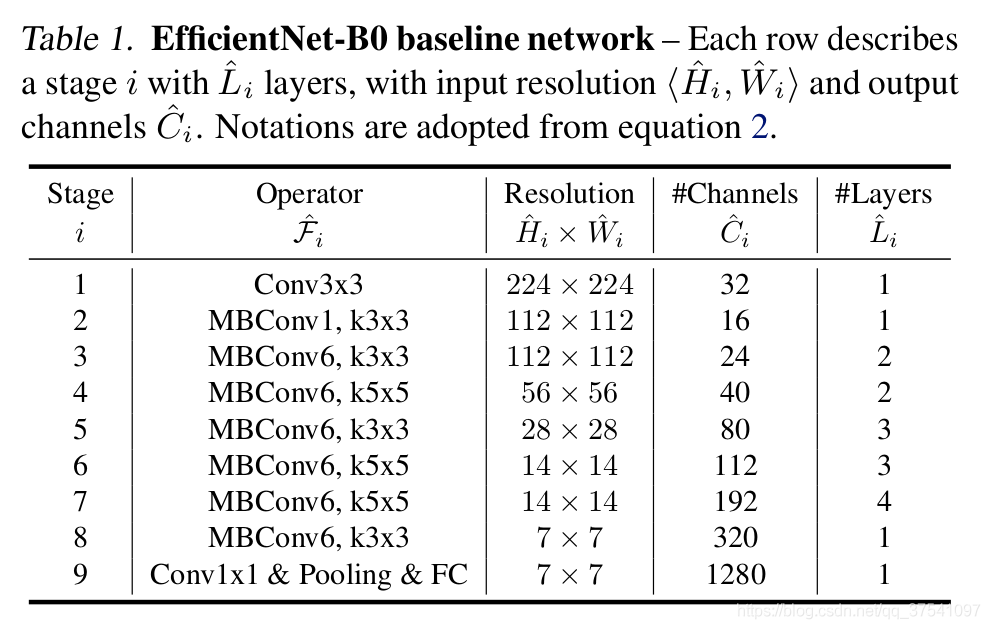

## MBConv结构

MBConv其实就是MobileNetV3网络中的InvertedResidualBlock，但也有些许区别。一个是采用的激活函数不一样（EfficientNet的MBConv中使用的都是Swish激活函数），另一个是在每个MBConv中都加入了SE（Squeeze-and-Excitation）模块。下图是我自己绘制的MBConv结构。

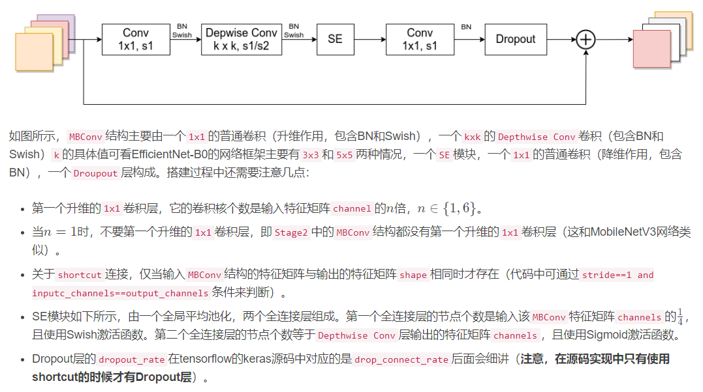

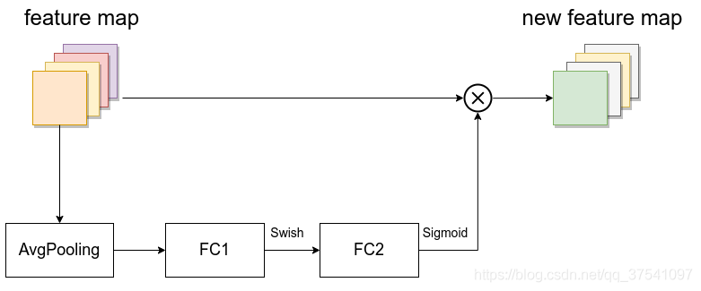

## EfficientNet(B0-B7)参数

还是先给出EfficientNetB0的网络结构，方便后面理解。

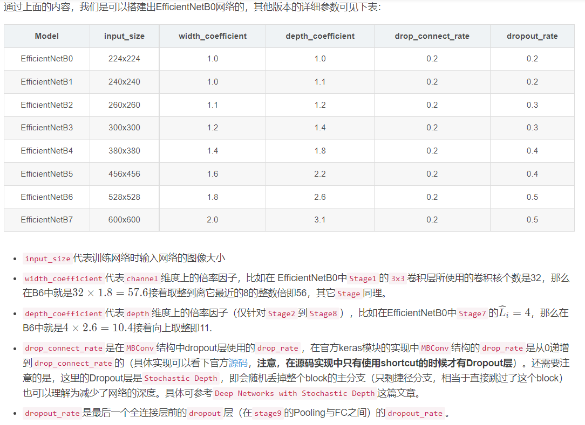

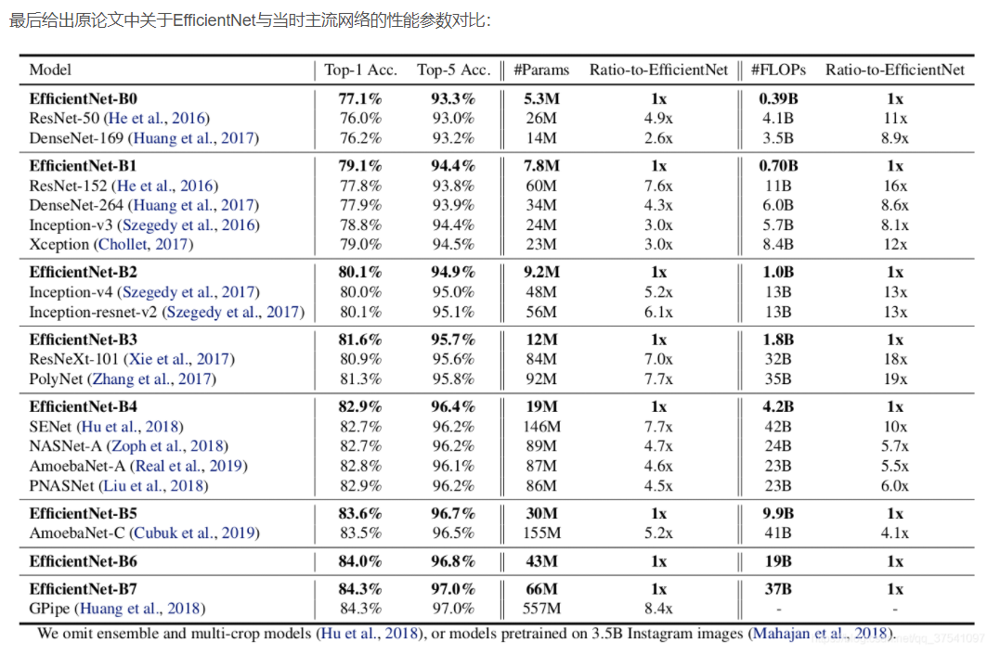