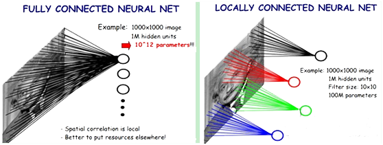
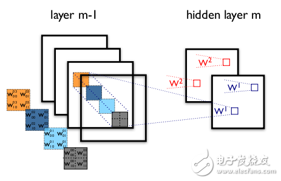
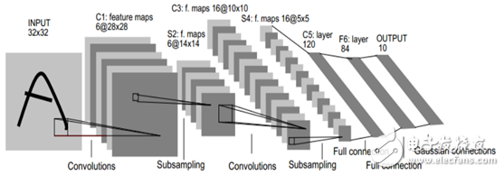
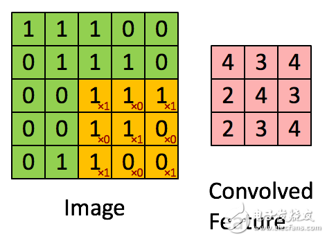
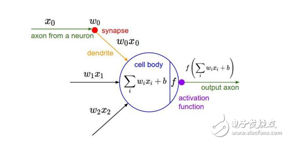
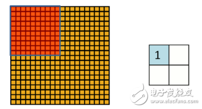
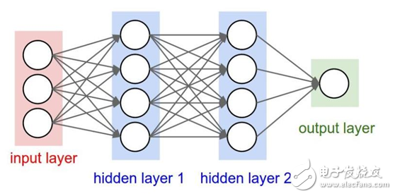
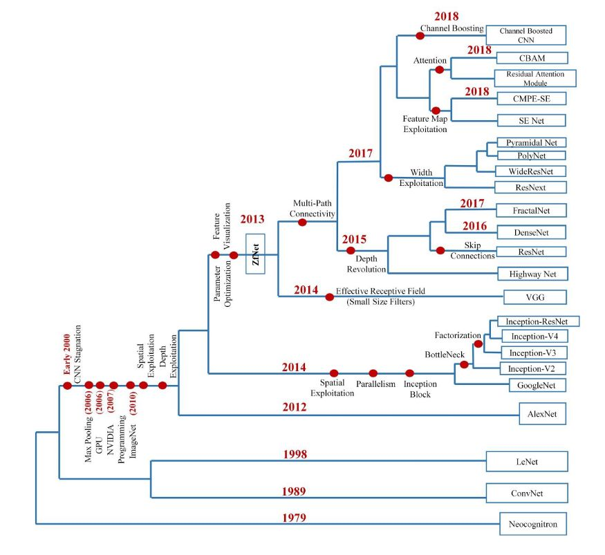

# CNN 概论  

⌚️: 2021-07-21

📚参考

---

## 一、概述   

### 1、CNN概念  

在机器学习中，卷积神经网络CNN（Convolutional Neural Network）是一种前馈神经网络，它的人工神经元可以响应一部分覆盖范围内的周围单元，可以应用于**语音识别、图像处理和图像识别**等领域。

### 2、CNN引入意义 

在全连接神经网络中（下面左图），每相邻两层之间的每个神经元之间都是有边相连的。当输入层的特征维度变得很高时，这时全连接网络需要训练的参数就会增大很多，计算速度就会变得很慢。
而在卷积神经网络CNN中（下面右图），卷积层的神经元只与前一层的部分神经元节点相连，即它的神经元间的连接是非全连接的，且同一层中某些神经元之间的连接的权重w和偏移b是共享的，这样大量地减少了需要训练参数的数量。  

    

### 3、CNN核心思想   

CNN模型限制参数了个数并挖掘了局部结构。主要用来识别位移、缩放及其他形式扭曲不变性的二维图形。**局部感受视野，权值共享以及时间或空间亚采样**这三种思想结合起来，获得了某种程度的位移、尺度、形变不变性。通过“卷积核”作为中介。同一个卷积核在所有图像内是共享的，图像通过卷积操作后仍然保留原先的位置关系。   
   

### 4、CNN实质  

CNN在本质上是一种输入到输出的映射，它能够学习大量的输入与输出之间的映射关系，而不需要任何输入和输出之间的精确的数学表达式，只要用已知的模式对卷积网络加以训练，网络就具有输入输出对之间的映射能力。卷积网络执行的是有导师训练，所以其样本集是由形如：（输入向量，理想输出向量）的向量对构成的。所有这些向量对，都应该是来源于网络即将模拟的系统的实际“运行”结果。它们可以是从实际运行系统中采集来的。在开始训练前，所有的权都应该用一些不同的小随机数进行初始化。“小随机数”用来保证网络不会因权值过大而进入饱和状态而导致训练失败；“不同”用来保证网络可以正常地学习。

### 5、CNN基本结构

卷积神经网络CNN的结构一般包含下面几层：  
  
1） 输入层：用于数据的输入。  
2） 卷积层：卷积层是卷积核在上一级输入层上通过逐一滑动窗口计算而得，卷积核中的每一个参数都相当于传统神经网络中的权值参数，与对应的局部像素相连接，将卷积核的各个参数与对应的局部像素值相乘之和，得到卷积层上的结果。一般地，使用卷积核进行特征提取和特征映射。   
   
**特征提取**：每个神经元的输入与前一层的局部接受域相连，并提取该局部的特征。一旦该局部特征被提取后，它与其它特征间的位置关系也随之确定下来；  
**特征映射**：网络的每个计算层由多个特征映射组成，每个特征映射是一个平面，平面上所有神经元的权值相等。特征映射结构采用影响函数核小的sigmoid函数作为卷积网络的激活函数，使得特征映射具有位移不变性。此外，由于一个映射面上的神经元共享权值，因而减少了网络自由参数的个数。  
卷积神经网络中的每一个卷积层都紧跟着一个用来求局部平均与二次提取的计算层，这种特有的两次特征提取结构减小了特征分辨率。   
3） 激励层：由于卷积也是一种线性运算，因此需要增加非线性映射。使用的激励函数一般为ReLu函数：f（x）＝max（x，0）。  
   
4） 池化层：进行下采样，对特征图稀疏处理，减少数据运算量。通过卷积层获得了图像的特征之后，理论上可以直接使用这些特征训练分类器（如softmax），但这样做将面临巨大的计算量挑战，且容易产生过拟合现象。为了进一步降低网络训练参数及模型的过拟合程度，需要对卷积层进行池化／采样（Pooling）处理。池化／采样的方式通常有以下两种：a）Max－Pooling： 选择Pooling窗口中的最大值作为采样值；b）Mean－Pooling： 将Pooling窗口中的所有值相加取平均，以平均值作为采样值。  
  
5） 全连接层：CNN尾部进行重新拟合，减少特征信息的损失。  
   
6) 输出层：用于最后输出结果。  

### 6、CNN训练过程

* 1）向前传播阶段：  
  a）从样本集中取一个样本（X，Yp），将X输入网络；
  b）计算相应的实际输出Op。  
  在本阶段，信息从输入层经过逐级的变换，传送到输出层。这个过程也是网络在完成训练后正常运行时执行的过程。在此过程中，网络执行的是计算，实际上就是输入与每层的权值矩阵相点乘，得到最后的输出结果：  
  Op＝Fn（…（F2（F1（XpW（1））W（2））…）W（n））  
* 2）向后传播阶段：  
  a）计算实际输出Op与相应的理想输出Yp的差；  
  b）按极小化误差的方法反向传播调整权矩阵。  

### 7、CNN优点  

1） 输入图像和网络的拓扑结构能很好的吻合；  
2） 尽管使用较少参数，仍然有出色性能；  
3） 避免了显式的特征抽取，而隐式地从训练数据中进行学习；  
4） 特征提取和模式分类同时进行，并同时在训练中产生，网络可以并行学习；  
5） 权值共享减少网络的训练参数，降低了网络结构的复杂性，适用性更强；  
6） 无需手动选取特征，训练好权重，即得特征，分类效果好；  
7） 可以直接输入网络，避免了特征提取和分类过程中数据重建的复杂度。    

### 8、CNN缺点

1） 需要调整参数；  
2） 需要大样本量，训练最好要GPU；  
3） 物理含义不明确，神经网络本身就是一种难以解释的 “黑箱模型”。    

### 9、CNN应用场景：

应用场景包括机器学习、语音识别、文档分析、语言检测和图像识别等领域。
特别强调的是：CNN在图像处理和图像识别领域取得了很大的成功，在国际标准的ImageNet数据集上，许多成功的模型都是基于CNN的。CNN相较于传统的图像处理算法的好处之一在于：避免了对图像复杂的前期预处理过程，可以直接输入原始图像。   

卷积神经网络CNN是近年发展起来，并引起广泛重视的一种高效识别方法。卷积神经网络以其局部权值共享的特殊结构在模式识别方面有着独特的优越性，其布局更接近于实际的生物神经网络，权值共享降低了网络的复杂性，特别是多维输入向量的图像可以直接输入网络这一特点避免了特征提取和分类过程中数据重建的复杂度。CNN算法在人工智能之机器学习、语音识别、文档分析、语言检测和图像识别等领域等领域有着广泛应用。   

## 二、CNN结构演化  

20世纪60年代，Hubel和Wiesel在研究猫脑皮层中用于局部敏感和方向选择的神经元时发现其独特的网络结构可以有效地降低反馈神经网络的复杂性，继而提出了卷积神经网络CNN。   

1980年，K．Fukushima提出的新识别机是卷积神经网络的第一个实现网络。随后，更多的科研工作者对该网络进行了改进。其中，具有代表性的研究成果是Alexander和Taylor提出的“改进认知机”，该方法综合了各种改进方法的优点并避免了耗时的误差反向传播。   

AlexNet后神经网络如雨后春笋一般地出现，网络结构从纵向加深到横向增强卷积模块功能，网络功能从图片分类到实例分割，神经网络越来越复杂，越来越强大。   

20世纪60年代至今，CNN发展如下图。

