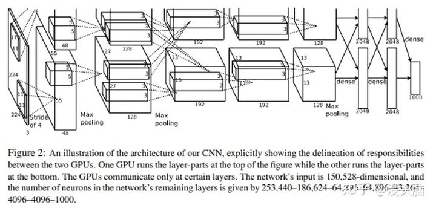

# LeNet, AlexNet, VGG

⌚️: 2021-07-21

📚参考

---

## 1 LeNet

> 论文链接：[Gradient-based learning applied to document recognition](https://link.zhihu.com/?target=http%3A//202.116.81.74/cache/7/03/yann.lecun.com/b1a1c4acb57f1b447bfe36e103910875/lecun-01a.pdf), 发表时间：1998 年

以现在的眼光来看，LeNet 绝对是一个小网络，也没什么特点。但是，**LeNet 是 CNN 网络结构的开山鼻祖，第一次定义了 CNN 网络结构**。

**LeNet 的特点如下所示：**

- 定义了卷积神经网络（Convolutional Neural Network, CNN）的基本框架：卷积层 + 池化层（Pooling Layer） + 全连接层
- 定义了卷积层（Convolution Layer），与全连接层相比，卷积层的不同之处有两点：**局部连接（引进“感受野”这一概念）、权值共享（减少参数数量）**
- 利用池化层进行下采样（Downsampooling），从而减少计算量
- 用 Tanh 作为非线性激活函数（现在看到的都是改进过的 LeNet 了，用 ReLU 代替 Tanh。相较于 Sigmoid，Tanh 以原点对称（zero-centered），收敛速度会快。关于其解释，请看：[谈谈激活函数以零为中心的问题](https://link.zhihu.com/?target=https%3A//liam.page/2018/04/17/zero-centered-active-function/)）

**PS:** 关于全连接层，作者 Yann LeCun 曾在推特上指出：直接将特征图（Featuremap）展开输入到全连接层，会导致 CNN 仅适用于指定尺度的图像上。LeCun 认为 CNN 应该尽可能适用与各种尺度的图像上，这一点也得到许多人的认同。对于分类（Classification）问题，利用全局平均池化（Global Average Pooling, GAP）操作代替特征图的拉伸，这样 CNN 便可以处理各种尺度的图像了。而对于语义分割（Semantic Segmentation）问题，[Fully Convolutional Networks for Semantic Segmentation](https://link.zhihu.com/?target=https%3A//people.eecs.berkeley.edu/~jonlong/long_shelhamer_fcn.pdf) 已经提出了一个完全没有全连接层的全卷积网络了，可以在这个问题上处理任意大小的图像。

**PPS:** 一般来说，卷积和池化的核的宽与高相等。

卷积计算公式： ![[公式]](https://www.zhihu.com/equation?tex=Size_%7Bout%7D+%3D+%28Size_%7Bin%7D+-+Kernel_%7BPooling%7D%2B2%2APadding%29%2FStride+%2B+1) 。

池化计算公式： ![[公式]](https://www.zhihu.com/equation?tex=Size_%7Bout%7D+%3D+%28Size_%7Bin%7D+-+Kernel_%7BPooling%7D%29%2FStride+%2B+1) 。

## 2  AlexNet

> 论文链接：[ImageNet Classification with Deep Convolutional Neural Networks](https://link.zhihu.com/?target=https%3A//papers.nips.cc/paper/4824-imagenet-classification-with-deep-convolutional-neural-networks.pdf), 发表时间：2012 年

2012 年，Krizhevsky 与 Hinton 推出了 AlexNet，并在当年的 ILSVRC（ImageNet Large-Scale Visual Recognition Challenge）中以超过第二名10.9个百分点的绝对优势一举夺冠，引起了许多学者对深度学习的研究，可以算是深度学习的热潮的起始标志吧。

当时的算力不如现在这样强劲，AlexNet 用的 GTX 580 也只有 3GB 的显存（这也导致其设计出双 GPU 框架，现在的许多深度学习框架都有这样的能力，不过当时只能通过手动编写底层代码，工作量可想而知），却完成了在 ImageNet 上的巨大突破，这在当时是非常轰动的，变相证明了深度学习的能力。

由于算力的不断进步，AlexNet 在许多任务显得太"小"了，很少见到它的身影。所以我认为相较于 AlexNet 的框架，作者所做的一些其他改进更有值得研究的地方。

**AlexNet 的特点如下所示：**

- 采用双 GPU 网络结构，从而可以设计出更“大”、更“深”的网络（相较于当时的算力来说）
- 采用 ReLU 代替 Tanh，稍微解决梯度消失问题（Gradient Vanishing Problem），加快网络收敛速度。（关于常见激活函数的比较，可以看这篇：[常用激活函数的比较 - 徐小贱民的文章 - 知乎](https://zhuanlan.zhihu.com/p/32610035)）
- 提出局部相应归一化（LRN, Local Response Normalization），据作者所言，该操作能减少指标 Top-1/Top-5 Error Rate 1.4%/1.2%。（我个人不喜欢 LRN，因为我觉得它的超参数太多了，不具备很好的泛化能力。关于 Normalization 的发展历程可以看这篇：[[笔记/] 神经网络中 Normalization 的发展历程](https://link.zhihu.com/?target=https%3A//blog.csdn.net/Code_Mart/article/details/92715180)）
- 令 Pooling 操作中的 stride 小于池化核的大小，从而使相邻的池化区域存在重叠部分，这一操作称为 Overlapping Pooling。据作者所言，这一操作能减少指标 Top-1/Top-5 Error Rate 0.4%/0.3%，并且减少过拟合现象。
- 对训练数据进行随机裁剪（Random Crop），将训练图像由 256 × 256 裁剪为 224 × 224，并做随机的镜像翻转（Horizontal Reflection）。并在测试时，从图像的四个角以及中心进行裁剪，并进行镜像翻转，这样可以得到 10 个 Patch，将这些 Patch 的结果进行平均，从而得到最终预测结果。（之前在一个人脸识别比赛中，我师兄用这样的操作直接提高了４~5个点，算是一种简单的集成操作吧）
- 对训练图像做 PCA（主成分分析），利用服从 (0,0.1) 的高斯分布的随机变量对主成分进行扰动。作者指出，这一操作能减少指标 Top-1 Error Rate 1%。
- 利用 Dropout 避免网络过拟合。（我觉得这也算是集成操作的一种，因为随着模型的复杂度的提高，弱分类器也会越来越大，纯粹由弱分类器进行 Ensemble 应该不实际。最近谷歌对 Dropout 的专利貌似申请下来了，据说相关文档详细到可以作为 Dropout 的使用指南。）

**PS:** PyTorch 中的 [TorchVision代码](https://pytorch.org/vision/stable/_modules/torchvision/models/alexnet.html#alexnet)提供基于 ImageNet 训练好的 AlexNet 模型，将其加载到显存中占了 1191 MiB（训练与测试所占显存大小依赖于实验设置，故不做讨论）。

## 3 VGG

> 论文链接：[Very Deep Convolutional Networks for Large-Scale Image Recognition](https://link.zhihu.com/?target=https%3A//arxiv.org/pdf/1409.1556.pdf), 发表时间：2014.09
>
> **有了block的概念**

2014 年，Simonyan 和 Zisserman 提出了 VGG 系列模型（包括VGG-11/VGG-13/VGG-16/VGG-19），并在当年的 ImageNet Challenge 上作为分类任务第二名、定位（Localization）任务第一名的基础网络出现。对于当时而言，VGG 属于很”深“的网络，已经达到 19 层的深度（虽然同年的 GooLeNet 有22层），这是一个不小的突破，因为理论上神经网络模型的拟合能力应该是随着模型”大小“不断增加的。

虽然 VGG 的出现时间比较早，而且隔年又出现了 ResNet 这样现象级的网络模型，但是至今仍经常出现在论文中（虽然往往作为比较对象出现）。此外，VGG 的一些设置至今都在使用，所以，有必要了解一下 VGG 的网络结构。

**网络结构：**

VGG 其实跟 AlexNet 有一定的相似之处，都是由五个卷积层与激活函数叠加的部分和三个全连接层组成，但是不同的是，VGG加“深”了前面由五个卷积层与激活函数叠加的部分，使得每部分并不是一个卷积层加一个激活函数组成，而是多个这样的组合组成一部分（有人习惯称这个为 Conv Layer Group），每个部分之间进行池化操作。

此外，VGG 与当时其他卷积神经网络不同，不采用感受野大的卷积核（如：7 × 7，5 × 5），反而采用感受野小的卷积核（3 × 3）。关于这样做的好处，作者指出有如下两点：**减少网络参数量**；由于参数量被大幅减小，于是可以用多个感受野小的卷积层替换掉之前一个感受野大的卷积层，从而**增加网络的非线性表达能力**。

从 VGG-16 开始，VGG 引进卷积核大小为 1 × 1 的卷积层（最早应该在 [Network In Network](https://link.zhihu.com/?target=https%3A//arxiv.org/pdf/1312.4400.pdf) 提到），使得在不影响特征图大小的情况下，增加网络的非线性表达能力。

由上图可以看出，VGG 每个“大”部分计算得到的特征图大小应该是固定的，以输入大小为 (224,244,3) 的图像举例，所计算得到的特征图大小分别为 (112,112,64)，(56,56,128)，(28,28,256)，(14,14,512)，(7,7,512)。（VGG 的最后三层全连接层太大了，尤其是第一层，大小达到了 (25088,4096) ）

**其他细节：**

- 作者提到曾使用 LRN，但是并没有任何效果提升，反而还使得内存使用和计算时间增加。
- 在训练过程中，作者为避免随机初始化对训练带来负面影响，于是利用小的网络参数初始化大的网络参数（比如用以训练好的 VGG-11 去初始化部分 VGG-13 的网络参数）。
- 对训练图像进行预处理时，先做宽高等比缩放（原文用的词是 isotropically rescaled，即同质化缩放），使其最短边长度达到 S，接着再做随机裁剪。其中，关于 S 的设置，作者提出了两种训练方案：Single-Scale Training，Multi-Scale Training。

**PS:** PyTorch 中的 [TORCHVISION.MODELS](https://pytorch.org/vision/stable/_modules/torchvision/models/vgg.html#vgg11) 提供基于 ImageNet 训练好的 VGG-11/VGG-13/VGG-16/VGG-19 模型，以及对应使用 Batch Normalization 的版本，分别将其加载到显存中占了 1467/1477/1501/1527 MiB（训练与测试所占显存大小依赖于实验设置，故不做讨论）。

