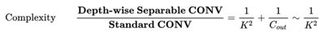

# MobileNet

⌚️: 2021-07-21

📚参考

- v1:[MobileNets: Efficient Convolutional Neural Networks for Mobile Vision Applications](https://paperswithcode.com/paper/mobilenets-efficient-convolutional-neural)
- v2:[MobileNetV2: Inverted Residuals and Linear Bottlenecks](https://paperswithcode.com/paper/mobilenetv2-inverted-residuals-and-linear)
- v3:[Searching for MobileNetV3](https://paperswithcode.com/paper/searching-for-mobilenetv3)
- [深度学习论文翻译解析（十七）：MobileNets: Efficient Convolutional Neural Networks for Mobile Vision Applications](https://www.cnblogs.com/wj-1314/p/14318311.html)
- [深度学习论文翻译解析（十八）：MobileNetV2: Inverted Residuals and Linear Bottlenecks](https://www.cnblogs.com/wj-1314/p/14077776.html)
- [深度学习论文翻译解析（十九）：Searching for MobileNetV3](https://www.cnblogs.com/wj-1314/p/12108424.html)
- 代码见torchvision
- [MobileNet(V1,V2,V3)网络结构详解与模型的搭建](https://blog.csdn.net/binlin199012/article/details/107155719)
- [卷积神经网络学习笔记——轻量化网络MobileNet系列（V1，V2，V3）](https://www.cnblogs.com/wj-1314/p/10494911.html)

---

卷积神经网络CNN已经普遍应用在计算机视觉领域，并且已经取得了不错的效果，图1为近年来CNN在ImageNet竞赛的表现，可以看到为了追求分类准确度，模型深度越来越深，模型复杂度也越来越高，如深度残差网络（ResNet）其层数已经多达152层。

 然而，在某些真实的应用场景如移动或者嵌入式设备，如此大而复杂的模型时难以被应用的。首先是模型过于庞大，面临着内存不足的问题，其次这些场景要求低延迟，或者说响应速度要快，想象一下自动驾驶汽车的行人检测系统如果速度很慢会发生什么可怕的事情。所以，研究小而高效的CNN模型在这些场景至关重要，至少目前是这样，尽管未来硬件也会越来越快。

目前的研究总结来看分为两个方向：

- 一是对训练好的复杂模型进行压缩得到小模型；
- 二是直接设计小模型并进行训练。

不管如何，其目标在保持模型性能（accuracy）的前提下降低模型大小（parameters size），同时提升模型速度（speed, low latency）。本文的主角MobileNet属于后者，其是Google最近提出的一种小巧而高效的CNN模型，其在accuracy和latency之间做了折中。

MobileNet 需要尽可能维持其中发展较快的计算机视觉和深度学习领域与移动环境局限性之间的平衡。因此，谷歌一直在定期对 MobileNets 架构进行更新，其中也加入了一些有关深度学习领域最新的想法。

## 1，深度可分离卷积（Depthwise separable convolution）

　　自从2017年由谷歌公司提出，MobileNet可谓是轻量级网络中的 Inception，经历了一代又一代的更新，成为了学习轻量级网络的必经之路。其实介绍 MobileNet V1只有一句话：**MobileNet V1就是把VGG中的标准卷积层换成深度可分离卷积就可以了**。那么这个深度可分离卷积是什么？

　　MobileNet的基本单元是深度级可分离卷积（depthwise separable convolution——DSC），其实这种结构之前已经被使用在Inception模型中。根据史料记载，可追溯到2012年的论文[Simplifying ConvNets for Fast Learning](https://link.zhihu.com/?target=https%3A//www.researchgate.net/profile/Christophe_Garcia2/publication/230867026_Simplifying_ConvNets_for_Fast_Learning/links/54ae96f60cf29661a3d39931.pdf)，作者提出了可分离卷积的概念（下图（a））：

 　Laurent Sifre博士2013年在谷歌实习期间，将可分离卷积拓展到了深度（depth），并且在他的博士论文[Rigid-motion scattering for image classification](https://link.zhihu.com/?target=http%3A//www.cmapx.polytechnique.fr/~sifre/research/phd_sifre.pdf)中有详细的描写，感兴趣的同学可以去看看论文。

　　可分离卷积主要有两种类型：**空间可分离卷积和深度可分离卷积**。

### 1.1  空间可分离（略讲）

　　顾名思义，空间可分离就是将一个大的卷积核变成两个小的卷积核，比如将一个`3*3`的核分成一个`3*1 `和一个` 1*3 `的核：

 　由于空间可分离卷积不在 Mobilenet的范围内，就不说了。

### 1.2  深度可分离卷积

 　深度级可分离卷积其实是一种可分解卷积操作（factorized convolutions）。其可以分解为两个更小的操作：depthwise  convolution 和 pointwise convolution。

 　下面先学习标准的卷积操作：

 　输入一个`12*12*3`的一个输入特征图，经过` 5*5*3`的卷积核得到一个`8*8*1`的输出特征图。如果我们此时有256个特征图，我们将会得到一个`8*8*256`的输出特征图。

　　可以看此图，更清晰（盗图地址：https://zhuanlan.zhihu.com/p/29119239）

 

 

　　以上就是标准卷积做的活，那么深度卷积和逐点卷积呢？

#### 1.2.1  深度卷积

 　与标准卷积网络不一样的是，我们将卷积核拆分成单通道形式，在不改变输入特征图像的深度的情况下，对每一通道进行卷积操作，这样就得到了和输入特征图通道数一致的输出特征图。如上图，输入`12*12*3 `的特征图，经过`5*5*1*3`的深度卷积之后，得到了8*8*3的输出特征图。输入和输出的维度是不变的3，这样就会有一个问题，通道数太少，特征图的维度太少，能获得足够的有效信息吗?

#### 1.2.2  逐点卷积

　　逐点卷积就是1*1卷积，主要作用就是对特征图进行升维和降维，如下图：

 　在深度卷积的过程中，我们得到了`8*8*3`的输出特征图，我们用256个`1*1*3`的卷积核对输入特征图进行卷积操作，输出的特征图和标准的卷积操作一样都是`8*8*256`了。

　　标准卷积与深度可分离卷积的过程对比如下：

### 3，为什么要深度可分离卷积？

　　简单来说，如果有一个方法能够让你用更少的参数，更少的运算，但是能达到差不多的结果，你会使用吗？

　　深度可分离卷积就是这样的一个方法，我们首先来计算一下标准卷积的参数量和计算量（只考虑MAdd）：

　　这里我们假设其输入为`Dk*Dk*M `的 feature map，这里Dk为输入 feature mpa的长，宽（简单考虑假设长宽相同），M则为input channels 数目；N为output channels数目。这样一个典型的conv结构的 kernel 通常为` Dk*Dk*M*N`。

#### 3.1  标准卷积的参数量

　　卷积核的尺寸是Dk*Dk*M，一共有N个，所以标准卷积的参数量是：

#### 3.2  标准卷积的计算量

　　卷积核的尺寸是`Dk*Dk*M`，一共有N个，每一个都要进行Dw*Dh次运算，所以标准卷积的计算量是：

 　标准卷积算完了，下面我们来计算深度可分离卷积的参数量和计算量：

　　首先，Depthwise与Pointwise都是 conv操作，尤其是Pointwise更是典型的`1*1 conv`操作。Depthwise conv则是一种一个 input channel对应一个 conv filter进行卷积的操作，显然它输出的 output channels数目与 input channels数目也会相等。Pointwise conv 在Depthwise conv操作之后进行，它使用` 1*1 `的conv来将之前的 IC（input channels)个 feature maps进行融合，整理最终输出 OC（output channels）个特征的 feature maps。

#### 3.3  深度可分离卷积的参数量

　　深度可分离卷积的参数量由深度卷积和逐点卷积两部分组成：

　　深度卷积的卷积核尺寸Dk*Dk*M；逐点卷积的卷积核尺寸为`1*1*M`，一共有N个，所以深度可分离卷积的参数量是：

#### 3.4  深度可分离卷积的计算量

　　深度可分离卷积的计算量也是由深度卷积和逐点卷积两部分组成：

　　深度卷积的卷积核尺寸Dk×Dk×M，一共要做Dw×Dh次乘加运算；逐点卷积的卷积核尺寸为1×1×M，有N个，一共要做Dw×Dh次乘加运算，所以深度可分离卷积的计算量是：

### 3.5  总结

 　可以参数数量和乘加操作的运算量均下降为原来的 1/N + 1/D2k。

 　我们通常所使用的时3*3的卷积核，也就是会下降到原来的九分之一到八分之一。

**假设**：输出为一个`224*224*3`的图像，VGG网络某层卷积输入的尺寸是`112*112*64`的特征图，卷积核为`3*3*128`，

　　标准卷积的运算量是：3×3×128×64×112×112 = 924844032

　　深度可分离卷积的运算量是：3×3×64×112×112+128×64×112×112 = 109985792

　　这一层，Mobilenet V1所采用的深度可分离卷积计算量与标准卷积计算量的比值为：

**109985792 /924844032 = 0.1189**

　　**与我们所计算的九分之一到八分之一一致**。

　　下面来学习 MobileNet 网络。

　　MobileNet是谷歌提出来的移动端分类网络。在V1中MobileNet应用了深度可分离卷积(Depth-wise Seperable Convolution)并提出两个超参来控制网络容量，这种卷积背后的假设是跨channel相关性 和跨spatial相关性的解耦。深度可分离卷积能够节省参数量，在保持移动端可接受的模型复杂性的基础上达到了相当的高精度。而在V2中，MobileNet应用了新的单元：Inverted residual with linear bottleneck，主要的改动是为 Bottleneck 添加了 linear 激活输出以及将残差网络的 skip-connection 结构转移到低维 Bottleneck 层。

## 2，MobileNet V1

　　MobileNet V1是一种基于流水线结构，使用**深度可分离卷积**构建的轻量级神经网络，并通过**两个超参数**的引入使得开发人员可以基于自己的应用和资源限制选择合适的模型。

　　从概念上来说，MobileNetV1正试图实现两个基本目标，以构建移动第一计算视觉模型：1，较小的模型，参数数量更少；2，较小的复杂度，运算中乘法和加法更少。遵循这些原则，MobileNet V1 是一个小型，低延迟，低功耗的参数化模型，可以满足各种用例的资源约束。它们可以用于实现：分类，检测，嵌入和分割等功能。

### 2.1 MobileNet V1的创新点

#### 2.1.1  depthwise后接BN层和RELU6，pointwise 后也接BN层和ReLU6

　　如下图所示（图中应该是RELU6）。左图是传统卷积，右图是深度可分离卷积。更多的ReLU6，增加了模型的非线性变化，增强了模型的泛化能力。

#### 2.1.2  ReLU6激活函数的作用

　　V1中使用了ReLU6作为激活函数，这个激活函数在 float16/int8 的嵌入式设备中效果很好，能较好的保持网络的鲁棒性。

　　ReLU6 就是普通的ReLU，但是限制最大输出值为6（对输出值做 clip），这是为了在移动端设备float16的低精度的时候，也能有很好的数值分辨率，如果对ReLU的激活范围不加限制，输出范围为0到正无穷，如果激活值非常大，分布在一个很大的范围内，则低精度的float16无法很好地精确描述如此大范围的数值，带来精度损失。

 　ReLU6函数与其导函数如下：

 　对应的图像分别如下：

#### 2.1.3  MobileNet V1给出两个超参数（宽度乘子α 和 分辨率乘子 rho）

　　虽然MobileNet网络结构和延迟已经比较小了，但是很多时候在特定应用下还是需要更小更快的模型，为此引入了宽度因子alpha ，为了控制模型大小，我们引入了分辨因子 rho。

　　**宽度因子 alpha （Width Mutiplier）在每一层对网络的输入输出通道数进行缩减**，输出通道数由 M 到 `alpha*M`，输出通道数由 N 到 `alpha*N`，变换后的计算量为：

　　通常alpha 在（0, 1] 之间，比较典型的值由1， 0.75， 0.5， 0.25。计算量和参数数量减少程度与未使用宽度因子之前提高了 **1/alpha\**2**倍。

　　**分辨率因子 rho （resolution multiplier）**用于控制输入和内部层表示，即用分辨率因子控制输入的分辨率，深度卷积和逐点卷积的计算量为：

　　通常 rho 在（0, 1] 之间，比较典型的输入分辨为 224， 192， 160， 128。计算量量减少程度与未使用宽度因子之前提高了 1/(alpha**2*rho*rho) 倍，参数量没有影响。

　　通过两个超参，可以进一步缩减模型，文章中也给出了具体的实验结果。此时，我们反过来看，扩大宽度和分辨率，都能提高网络的准确率，但如果单一提升一个的话，准确率很快就会达到饱和，这就是2019年谷歌提出 efficientnet 的原因之一，动态提高深度，宽度，分辨率来提高网络的准确率。

### 2.2 MobileNet V1 的网络架构

　　MobileNet V1 的核心架构则基于一个流线型架构，该架构使用深度可分离卷积网络来构建了轻量化深度神经网络。就神经网络结构而言，深度可分类卷积将卷积核分为两个单独的卷积核，这两个卷积核依次进行两个卷积，即先是深度卷积，然后进行逐点卷积，如下图所示：

 　在MobileNetV1中，深度卷积网络的每个输入信道都应用了单个滤波器。然后，逐点卷积应用 1*1 卷积网络来合并深度卷积的输出。这种标准卷积方法既能滤波，又能一步将输入合并成一组新的输出。在这之中，深度可分离卷积将其分为两次，一层用于滤波，另一层则用于合并。

　　MobileNet的网络结构如下，一共由 28层构成（不包括AvgPool 和 FC 层，且把深度卷积和逐点卷积分开算），其除了第一层采用的是标准卷积核之外，剩下的卷积层都是用Depth Wise Separable Convolution。

## 3， MobileNet V2

　　MobileNet V2架构在 2018年初发布，MobileNet V2基于MobileNet V1的一些思想，并结合新的思想来优化。从架构上来看，MobileNet V2为架构增添了两个新模块：1，引入了层与层之间的线性瓶颈；2，瓶颈之间的快捷连接。

 　MobileNetV2之中的核心思想是，瓶颈对模型的中间输入和输出进行编码，而内层则用于封装模型从较低级别概念（如：像素等）转换到较高级别描述符（如：图像类别等）的能力。最后，与传统的剩余连接一样，快捷方式能够实现更快地训练速度和更高的准确率。

### 3.1 MobileNet V1 VS MobileNet V2 

#### 3.1.1 MobileNet V1 的问题

　　MobileNet V1 的结构较为简单，另外，主要的问题还是在Depthwise Convolution 之中，Depthwise Convolution 确实降低了计算量，但是Depthwise部分的 Kernel 训练容易废掉，即卷积核大部分为零，作者认为最终再经过 ReLU 出现输出为 0的情况。

　　**V2 传递的思想只有一个，即ReLU 会对 channel 数较低的张量造成较大的信息损耗**，简单来说，就是当低维信息映射到高维，经过ReLU后再映射回低维时，若映射到的维度相对较高，则信息变换回去的损失较小；若映射到的维度相对较低，则信息变换回去后损失很大，如下图所示：

 　当原始输入维度数增加到 15 以后再加 ReLU，基本不会丢失太多的信息；但如果只把原始输入维度增加到 2~5维度后再加 ReLU，则会出现较为严重的信息丢失。因此，认为对低维度做ReLU运算，很容易造成信息的丢失。而在高维度进行ReLU运算的话，信息的丢失则会很少。另外一种解释是，高维信息变换回低维度信息时，相当于做了一次特征压缩，会损失一部分信息，而再进行过ReLU后，损失的部分就更大了。作者为了这个问题，就将ReLU替换成线性激活函数。

　　至于ReLU是如何损失特征的，我的理解是：**ReLU的特性使得对于负值输入，其输出为0，而且降维本身就是特征压缩的过程，这样就使得特征损失更为严重了**。

#### 3.1.2 MobileNet V1 和 V2 的对比

　　**相同点**：都是采用 Depth-wise （DW）卷积搭配 Point-wise（PW）卷积的方式来提取特征。这两个操作合起来也叫 Depth-wise Separable Convolution，之前在 Xception中被广泛使用。这么做的好处是理论上可以成倍的减少卷积层的时间复杂度和空间复杂度，由下式可见，因为卷积核的尺寸K通常远远小于输出通道数 Count，因此标准卷积的计算量复杂度近似为 DW+PW 组合卷积的 K2倍。

　　**不同点（Linear Bottleneck）**：V2在DW卷积之前新加了一个PW卷积，这么做的原因是因为DW卷积由于本身的计算特性决定它自己没有改变通道数的能力，上一层给他多少通道，他就只能输出多少通道。所以如果上一层的通道数本身很少的话，DW也只能很委屈的低维空间提取特征，因此效果不是很好，现在V2为了改善这个问题，给每个 DW 之前都配备了一个PW，专门用来升维，定义升维系数为 t=6，这样不管输入通道数Cin 是多是少，经过第一个 PW 升维之后，DW都是在相对的更高维（`t*Cin`）是多是少，经过第一个 PW升维之后，DW 都是在相对的更高维（`t*Cin`）进行辛勤工作的。而且V2去掉了第二个PW的激活函数，论文作者称其为 Linear Bottleneck。这么做的渊源，是因为作者认为激活函数在高维空间能够有效的增加非线性，而在低维空间时则会破坏特征，不如线性的效果好。由于第二个PW的主要功能就是降维，因此按照上面的理论，降维之后就不宜再使用ReLU6了。

### 3.2 MobileNet V2 的创新点

　　MobileNet V2 是对 MobileNet V1 的改进，同样是一个轻量化卷积神经网络。MobileNet V2 发布于2018年，时隔一年，谷歌的又一力作，V2在V1的基础上，引入了Inverted Residuals和Linear Bottlenecks。

#### 3.2.1 Inverted Residuals

　　这个可以翻译成“倒残差模块”。什么意思呢？我们来对比一下残差模块和倒残差模块的区别。

- 残差模块：输入首先经过`1*1`的卷积进行压缩，然后使用`3*3`的卷积进行特征提取，最后在用`1*1`的卷积把通道数变换回去。整个过程是“压缩-卷积-扩张”。这样做的目的是减少`3*3`模块的计算量，提高残差模块的计算效率。
- 倒残差模块：输入首先经过`1*1`的卷积进行通道扩张，然后使用`3*3`的depthwise卷积，最后使用`1*1`的pointwise卷积将通道数压缩回去。整个过程是“扩张-卷积-压缩”。为什么这么做呢？因为depthwise卷积不能改变通道数，因此特征提取受限于输入的通道数，所以将通道数先提升上去。文中的扩展因子为6。

　　用下图表示再合适不过了。

####  3.2.2 Linear  Bottleneck

　　这个模块是为了解决一开始提出的那个低维-高维-低维的问题，即将最后一层的ReLU替换成线性激活函数，而其它层的激活函数依然是ReLU6。

　　上面已经详细说了，这里不再赘述。

### 3.3 MobileNet V2 网络架构

 　Mobilenet V2 的网络模块如下图所示，当 stride=1时，输入首先经过` 1*1 `卷积进行通道数的扩张，此时激活函数为 ReLU6；然后经过`3*3`的depthwise卷积，激活函数是ReLU6；接着经过`1*1`的pointwise卷积，将通道数压缩回去，激活函数是linear；最后使用shortcut，将两者进行相加。而当stride=2时，由于input和output的特征图的尺寸不一致，所以就没有shortcut了。

 　最后，给出V2的网络结构。其中，t 为扩张稀疏，c 为输出通道数，n 为该层重复的次数，s为步长。可以看出 V2 的网络比V1网络深了很多，V2有54层。

## 4，MobileNet V3

　　 [MobileNet V3](https://arxiv.org/pdf/1905.02244.pdf)发表于2019年，Mobilenet-V3 提供了两个版本，分别为 MobileNet-V3 Large以及 MobileNet-V3 Small，分别适用于对资源要求不同的情况。V3结合了v1的深度可分离卷积、v2的Inverted Residuals和Linear Bottleneck、SE模块，利用NAS（神经结构搜索）来搜索网络的配置和参数。这种方式已经远远超过了人工调参了，太恐怖了。

### 4.1 MobileNet V3 的创新点

#### 4.1.1 修改尾部结构

　　在MobileNetV2中，在Avg Pooling之前，存在一个` 1*1 `的卷积层，目的是提高特征图的维度，更有利于结构的预测，但是这其实带来了一定的计算量了。所以这里作者做了修改，将其放在 avg Pooling 的后面，首先利于 avg Pooling 将特征图的大小由` 7*7` 降到了 `1*1`，降到 `1*1 `后，然后再利用 `1*1 `提高维度，这样就减少了` 7*7 =49 `倍的计算量。并且为了进一步的降低计算量，作者直接去掉了前面纺锤型卷积的` 3*3 `以及` 1*1 `卷积，进一步减少了计算量，就变成了如下图第二行所示的结构，作者将其中的` 3*3 `以及` 1*1 `去掉后，精度并没有得到损失，这里降低了大约 10ms的延迟，提高了15%的运算速度，且几乎没有任何精度损失。其次，对于v2的输入层，通过3*3卷积将输入扩张成32维。作者发现使用ReLU或者switch激活函数，能将通道数缩减到16维，且准确率保持不变。这又能节省3ms的延时。

#### 4.1.2 非线性变换的改变

　　由于嵌入式设备计算sigmoid是会耗费相当大的计算资源的，特别是在移动端，因此作者提出了h-switch作为激活函数。且随着网络的加深，非线性激活函数的成本也会随之减少。所以只有在较深的层使用h-switch才能获得更大的优势。

　　观察上图可以发现，其实相差不大（不过swish是谷歌自家的研究成果，h-swish 是在其基础上，为速度进行了优化）。

　　使用ReLU的好处：

- 1，可以在任何软硬件平台进行计算
- 2，量化的时候，它消除了潜在的精度损失，使用 h-swish 替换 swish，在量化模式下会提高大约 15%的效率

####  4.1.3 引入 SE 结构

　　在v2的 bottleneck 结构中引入SE模块，并且放在了 depthwise filter 之后，SE模块是一种轻量级的通道注意力模块，因为SE结构会消耗一定的时间，所以在depthwise之后，经过池化层，然后第一个fc层，通道数缩小4倍，再经过第二个fc层，通道数变换回去（扩大4倍），然后与depthwise进行按位相加，这样作者发现，即提高了精度，同时还没有增加时间消耗。

### 4.2 MobileNet V3 网络结构

　　MobileNet V3 首先使用 MnasNet 进行粗略结构的搜索，然后使用强化学习从一组离散的选择中选择最优配置。之后，MobileNet V3再使用 NatAdapt 对体系结构进行微调，这体现了 NetAdapt 的补充功能，它能够以较小的降幅对未充分利用的激活通道进行调整。

　　除此之外，MobileNet 的另一个新颖的想法是在核心架构中加入一种名为“Squeeze-and-Excitation” 的神经网络（简称 SENet，也是ImageNet 2017 图像分类冠军）。该神经网络的核心思想是**通过显式的建模网络卷积特征通道之间的互相依赖关系，来提高网络所产生表示的质量**。具体而言，就是通过学习来自动获得到每个特征的重要程度，然后依照这一结果去提升有用的特征并抑制对当前任务用处不大的特征。

　　为此，开发者提出了一种允许网络进行特征重新校准的机制。通过该机制，网络可以学习使用全局信息来选择地强调信息性特征，并抑制不太有用的特征。而在MobileNet V3的例子中，该架构扩展了 MobilenetV2 ，将 SENet 作为搜索空间的一部分，最终得到了更稳定的架构。

　　Mobilenet V3 还有一个有趣的优化，则是重新设计了体系结构中一些运行成本较高的层。第二代 MobilenetV2 中的一些层是模型准确性的基础，但也引入了潜在变量。通过合并一些基本的优化功能。MobileNet V3 在能够不牺牲准确率的情况下，删除了 MobilenetV2 体系结构中三个运行成本较高的层。

 　V3的结构如下图，作者提供了两个版本的V3，分别是large和small，对应与高资源和低资源的情况，两者都是NAS进行搜索出来的。

> 第一列Input代表mobilenetV3每个特征层的shape变化；
> 第二列Operator代表每次特征层即将经历的block结构，我们可以看到在MobileNetV3中，特征提取经过了许多的bneck结构；
> 第三、四列分别代表了bneck内逆残差结构上升后的通道数、输入到bneck时特征层的通道数。
> 第五列SE代表了是否在这一层引入注意力机制。
> 第六列NL代表了激活函数的种类，HS代表h-swish，RE代表RELU。
> 第七列s代表了每一次block结构所用的步长。 

　重新回顾了mobilenet系列，可以看出，准确率在逐步提高，延时也不断下降。虽然在imagenet上的准确率不能达到state-of-art，但在同等资源消耗下，其优势就能大大体现出来。

## 5 总结

### MobileNet v1

- Deptwise Convolution(大大减少运算量和参数数量)

- 增加超参数a,b(形似)

  在mobilenetv1原论文中，还提出了两个超参数，一个是α一个是β。α参数是一个倍率因子，用来调整卷积核的个数，β是控制输入网络的图像尺寸参数，下图右侧给出了使用不同α和β网络的分类准确率，计算量以及模型参数：
  

### MobileNet v2

- Inverted Residuals(倒残差结构)

- Linear Bottlenecks

### MobileNetV3

- MobileNetV1的深度可分离卷积（depthwise separable convolutions）。
- MobileNetV2的具有线性瓶颈的逆残差结构(the inverted residual with linear bottleneck)。
- 轻量级的注意力模型。
- 利用h-swish代替swish函数。

