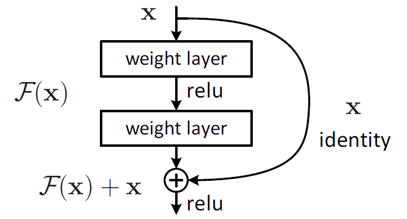
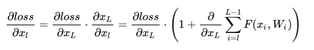
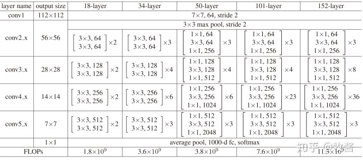
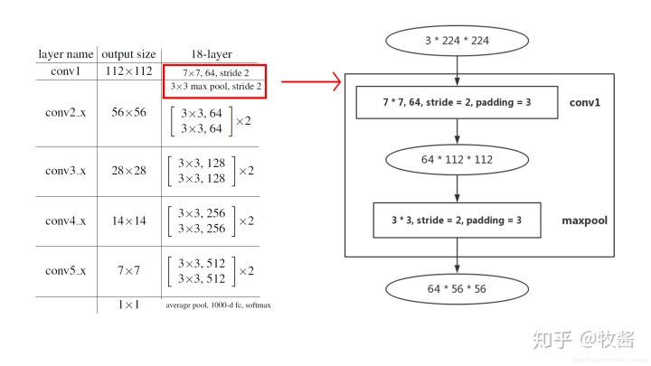
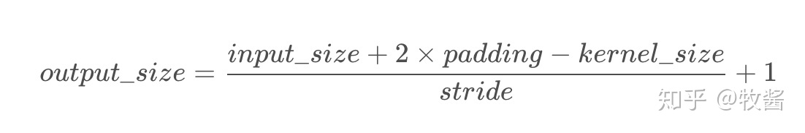
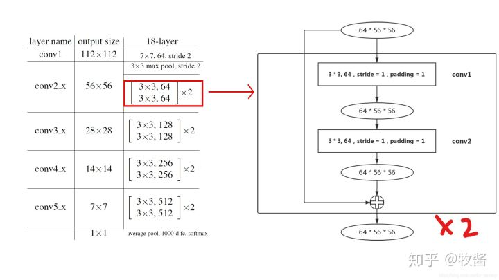
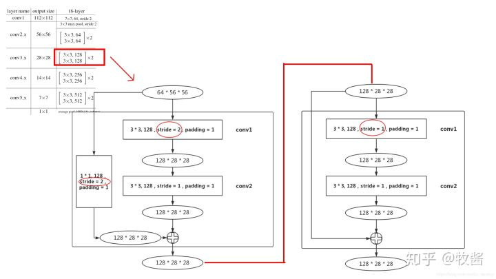
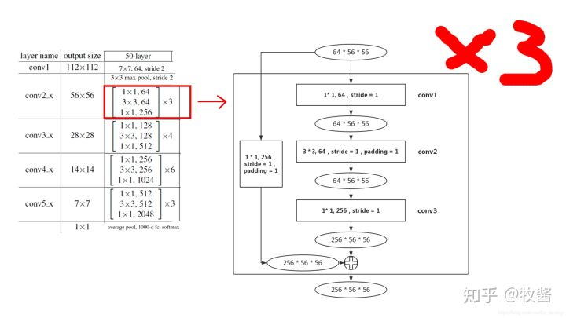
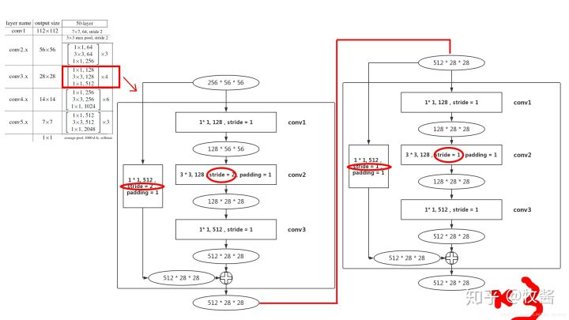
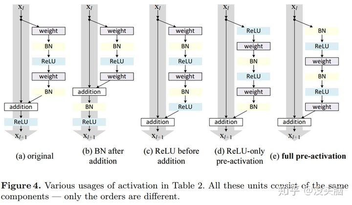

# ResNet

⌚️: 2020年8月7日

📚参考

- [ResNet网络结构分析](https://zhuanlan.zhihu.com/p/79378841)

---

## 1. ResNet介绍

### **1.1 深度网络的退化问题**

从经验来看，网络的深度对模型的性能至关重要，当增加网络层数后，网络可以进行更加复杂的特征模式的提取，所以当模型更深时理论上可以取得更好的结果，从图中也可以看出网络越深而效果越好的一个实践证据。但是更深的网络其性能一定会更好吗？实验发现深度网络出现了退化问题（Degradation problem）：网络深度增加时，网络准确度出现饱和，甚至出现下降。这个现象可以在图中直观看出来：56层的网络比20层网络效果还要差。这不会是过拟合问题，因为56层网络的训练误差同样高。我们知道深层网络存在着梯度消失或者爆炸的问题，这使得深度学习模型很难训练。但是现在已经存在一些技术手段如BatchNorm来缓解这个问题。因此，出现深度网络的退化问题是非常令人诧异的。

 20层与56层网络在CIFAR-10上的误差

### **1.2 残差学习**

深度网络的退化问题至少说明深度网络不容易训练。但是我们考虑这样一个事实：现在你有一个浅层网络，你想通过向上堆积新层来建立深层网络，一个极端情况是这些增加的层什么也不学习，仅仅复制浅层网络的特征，即这样新层是恒等映射（Identity mapping）。在这种情况下，深层网络应该至少和浅层网络性能一样，也不应该出现退化现象。好吧，你不得不承认肯定是目前的训练方法有问题，才使得深层网络很难去找到一个好的参数。

这个有趣的假设让何博士灵感爆发，他提出了残差学习来解决退化问题。对于一个堆积层结构（几层堆积而成）当输入为 ![[公式]](https://www.zhihu.com/equation?tex=x) 时其学习到的特征记为  ，现在我们希望其可以学习到残差  ，这样其实原始的学习特征是  。之所以这样是因为残差学习相比原始特征直接学习更容易。当残差为0时，此时堆积层仅仅做了恒等映射，至少网络性能不会下降，实际上残差不会为0，这也会使得堆积层在输入特征基础上学习到新的特征，从而拥有更好的性能。残差学习的结构如图所示。这有点类似与电路中的“短路”，所以是一种短路连接（shortcut connection）。

图 残差学习单元

为什么残差学习相对更容易，从直观上看残差学习需要学习的内容少，因为残差一般会比较小，学习难度小点。不过我们可以从数学的角度来分析这个问题，首先残差单元可以表示为：

其中  和  分别表示的是第  个残差单元的输入和输出，注意每个残差单元一般包含多层结构。 ![[公式]](https://www.zhihu.com/equation?tex=F) 是残差函数，表示学习到的残差，而  表示恒等映射，  是ReLU激活函数。基于上式，我们求得从浅层  到深层  的学习特征为：

![[公式]](https://www.zhihu.com/equation?tex=%7B%7Bx%7D_%7BL%7D%7D%3D%7B%7Bx%7D_%7Bl%7D%7D%2B%5Csum%5Climits_%7Bi%3Dl%7D%5E%7BL-1%7D%7BF%28%7B%7Bx%7D_%7Bi%7D%7D%7D%2C%7B%7BW%7D_%7Bi%7D%7D%29)

利用链式规则，可以求得反向过程的梯度：

式子的第一个因子 ![[公式]](https://www.zhihu.com/equation?tex=%5Cfrac%7B%5Cpartial+loss%7D%7B%5Cpartial+%7B%7Bx%7D_%7BL%7D%7D%7D) 表示的损失函数到达 ![[公式]](https://www.zhihu.com/equation?tex=L) 的梯度，小括号中的1表明短路机制可以无损地传播梯度，而另外一项残差梯度则需要经过带有weights的层，梯度不是直接传递过来的。残差梯度不会那么巧全为-1，而且就算其比较小，有1的存在也不会导致梯度消失。所以残差学习会更容易。要注意上面的推导并不是严格的证明。

## 2. 网络结构

ResNet共有5种不同深度的结构，深度分别为18、34、50、101、152（各种网络的深度指的是“需要通过训练更新参数”的层数，如卷积层，全连接层等）。

其中，根据Block类型，可以将这五种ResNet分为两类：(1) 一种基于BasicBlock，浅层网络ResNet18, 34都由BasicBlock搭成；(2) 另一种基于Bottleneck，深层网络ResNet50, 101, 152乃至更深的网络，都由Bottleneck搭成。Block相当于积木，每个layer都由若干Block搭建而成，再由layer组成整个网络。每种ResNet都是4个layer（不算一开始的7×7 卷积层和3×3maxpooling层）。如图，conv2_x对应layer1，conv3_x对应layer2，conv4_x对应layer3，conv5_x对应layer4。方框中的“×2 ”、“×3 ”等指的是该layer由几个相同的结构组成。

下面借ResNet18和ResNet50两种结构分别介绍BasicBlock和Bottleneck。

### 2.1 Block前面的层

为了结构的完整性，我们有必要从网络最浅层开始讲起：

首先说明，为了便于理解，本文所有图只包含卷积层和pooling层，而BN层和ReLU层等均未画出。然后说明图中部分符号的含义：输入输出用椭圆形表示，中间是输入输出的尺寸：channel×height×width ；直角矩形框指的是卷积层或pooling层，如“3×3,64,stride=2,padding=3”指该卷积层kernel size为3×3 ，输出channel数为64，步长为2，padding为3。矩形框代表的层种类在方框右侧标注，如“conv1”。

这些都了解之后，图中所示结构就已经很清楚了，顺便提一句，卷积层的输出尺寸(单边)是这么计算的：

以conv1为例，input_size=224,padding=3,kernel_size=7,stride=2 。将它们带入公式，发现除不尽，所以前面的除法准确地说是求商。可以得出output_size=112 。下面的max pooling类似，求得output_size=56, 不再赘述。

### 2.2 ResNet18

#### 2.2.1 layer1

layer1的结构比较简单，没有downsample，各位看图即可理解。图中方框内便是BasicBlock的主要结构——两个3×3卷积层。每个layer都由若干Block组成，又因为layer1的两个block结构完全相同，所以图中以“×2”代替，各位理解就好。

#### 2.2.2 layer2

layer2和layer1就有所不同了，首先64×56×56 的输入进入第1个block的conv1，这个conv1的stride变为2，和layer1不同（图中红圈标注），这是为了降低输入尺寸，减少数据量，输出尺寸为128×28×28。

到第1个block的末尾处，需要在output加上residual，但是输入的尺寸为64×56×56，所以在输入和输出之间加一个 1×1 卷积层，stride=2（图中红圈标注），作用是使输入和输出尺寸统一，（顺带一提，这个部分就是PyTorch ResNet代码中的downsample）

由于已经降低了尺寸，第2个block的conv1的stride就设置为1。由于该block没有降低尺寸，residual和输出尺寸相同，所以也没有downsample部分。

#### 2.2.3 layer3-4

layer3和layer4结构和layer2相同，无非就是通道数变多，输出尺寸变小，就不再赘述。

ResNet18和34都是基于Basicblock，结构非常相似，差别只在于每个layer的block数。

### 2.3 ResNet50

#### 2.3.1 layer 1

和Basicblock不同的一点是，每一个Bottleneck都会在输入和输出之间加上一个卷积层，只不过在layer1中还没有downsample，这点和Basicblock是相同的。至于一定要加上卷积层的原因，就在于Bottleneck的conv3会将输入的通道数扩展成原来的4倍，导致输入一定和输出尺寸不同。

layer1的3个block结构完全相同，所以图中以“×3 ”代替。

#### 2.3.2 layer 2

尺寸为256×56×56 的输入进入layer2的第1个block后，首先要通过conv1将通道数降下来，之后conv2负责将尺寸降低（stride=2，图中从左向右数第2个红圈标注）。到输出处，由于尺寸发生变化，需要将输入downsample，同样是通过stride=2的1×1 卷积层实现。

之后的3个block（layer2有4个block）就不需要进行downsample了（无论是residual还是输入），如图从左向右数第3、4个红圈标注，stride均为1。因为这3个block结构均相同，所以图中用“×3”表示。

#### 2.3.3 layer3-4

layer3和layer4结构和layer2相同，无非就是通道数变多，输出尺寸变小，就不再赘述。

ResNet50、101和152都是基于Bottleneck，结构非常相似，差别只在于每个layer的block数。

## **3. 关于 Residual Network 中 Identity Mapping 的讨论**

> 论文链接：[Identity Mappings in Deep Residual Networks](https://link.zhihu.com/?target=https%3A//arxiv.org/pdf/1603.05027v3.pdf)，发表时间：2016.03

Kaiming 在这篇论文中对 ResNet 中的 Identity Mapping 进行了详细的讨论（前向传导、后向传导的分析），并且设计并尝试了多种不同的 Shortcut Connection 设计（如上图所示），并在最后对激活函数做了讨论，从而提出了新的 Residual Block（为与原版结构区分，Kaiming 称其为 full pre-activateion Residual Block）。

我个人是比较喜欢这篇论文的，不仅对照实验设置的很详细，也对各类实验现象进行了分析，尤其是最后关于激活函数的讨论（到现在为止，这应该都还是开放问题，大家并没有一个统一的观点）。总的来说，Kaiming 在这篇论文中做出了两处改动：移除了 Short Connection 中的 ReLU，并将 Residual Mapping 中的 BN 和 ReLU 提前至对应的神经网络层前。

**PS:** 阅读 PyTorch 所提供的源码，可以发现 PyTorch 中的 [TORCHVISION.MODELS](https://link.zhihu.com/?target=https%3A//pytorch.org/docs/stable/torchvision/models.html) 所提供的 ResNet 模型，都是按照之前文章所述实现的，即 original Residual Block 版本。