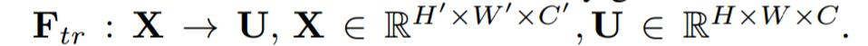
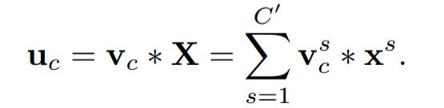
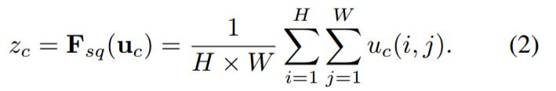
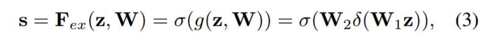
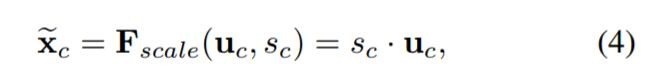
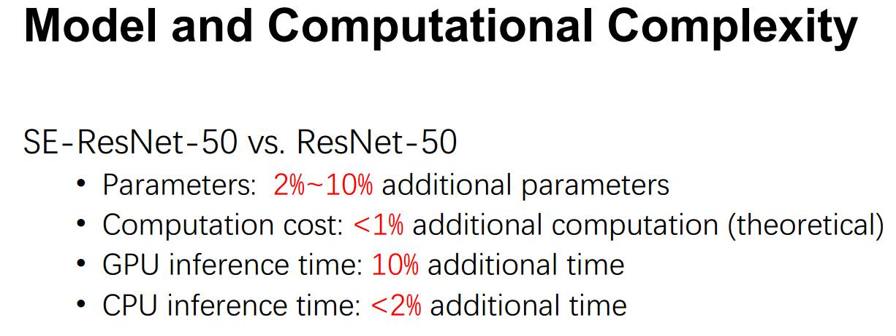
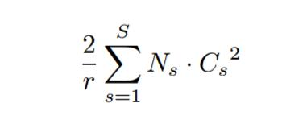

# SENet

⌚️: 2020年8月7日

📚参考

- paper: [Squeeze-and-Excitation Networks](https://paperswithcode.com/paper/squeeze-and-excitation-networks)
- Code:[🐙](https://github.com/moskomule/senet.pytorch)
- [SENet（Squeeze-and-Excitation Networks）网络详解](https://blog.csdn.net/Evan123mg/article/details/80058077)

---

## 一、SENet概述

​     Squeeze-and-Excitation Networks（简称 SENet）是 Momenta 胡杰团队（WMW）提出的新的网络结构，利用SENet，一举取得最后一届 ImageNet 2017 竞赛 Image Classification 任务的冠军，在ImageNet数据集上将top-5 error降低到2.251%，原先的最好成绩是2.991%。

作者在文中将SENet block插入到现有的多种分类网络中，都取得了不错的效果。作者的动机是希望**显式地建模特征通道之间的相互依赖关系**。另外，作者并未引入新的空间维度来进行特征通道间的融合，而是采用了一种全新的「特征重标定」策略。**具体来说，就是通过学习的方式来自动获取到每个特征通道的重要程度，然后依照这个重要程度去提升有用的特征并抑制对当前任务用处不大的特征**。

 通俗的来说SENet的核心思想在于通过网络根据loss去学习特征权重，使得有效的feature map权重大，无效或效果小的feature map权重小的方式训练模型达到更好的结果。**SE block**嵌在原有的一些分类网络中不可避免地增加了一些参数和计算量，但是在效果面前还是可以接受的 。Sequeeze-and-Excitation(SE) block并不是一个完整的网络结构，而是一个子结构，可以嵌到其他分类或检测模型中。

## 二、SENet 结构组成详解

   上述结构中，Squeeze 和 Excitation 是两个非常关键的操作，下面进行详细说明。

> 1. Squeeze部分。即为压缩部分，原始feature map的维度为`H*W*C`，其中H是高度（Height），W是宽度（width），C是通道数（channel）。Squeeze做的事情是把`H*W*C`压缩为`1*1*C`，相当于把`H*W`压缩成一维了，实际中一般是用global average pooling实现的。`H*W`压缩成一维后，相当于这一维参数获得了之前`H*W`全局的视野，感受区域更广。
> 2. Excitation部分。得到Squeeze的`1*1*`C的表示后，加入一个FC全连接层（Fully Connected），对每个通道的重要性进行预测，得到不同channel的重要性大小后再作用（激励）到之前的feature map的对应channel上，再进行后续操作。
> 3. 可以看出，SENet和ResNet很相似，但比ResNet做得更多。ResNet只是增加了一个skip connection，而SENet在相邻两层之间加入了处理，使得channel之间的信息交互成为可能，进一步提高了网络的准确率。

上图是SE 模块的示意图。给定一个输入 x，其特征通道数为 c_1，通过一系列卷积等一般变换后得到一个特征通道数为 c_2 的特征。与传统的 CNN 不一样的是，接下来通过三个操作来重标定前面得到的特征。

首先是 Squeeze 操作，顺着空间维度来进行特征压缩，将每个二维的特征通道变成一个实数，这个实数某种程度上具有全局的感受野，并且输出的维度和输入的特征通道数相匹配。它表征着在特征通道上响应的全局分布，而且使得靠近输入的层也可以获得全局的感受野，这一点在很多任务中都是非常有用的。

其次是 Excitation 操作，它是一个类似于循环神经网络中门的机制。通过参数 w 来为每个特征通道生成权重，其中参数 w 被学习用来显式地建模特征通道间的相关性。

最后是一个 Reweight 的操作，将 Excitation 的输出的权重看做是进过特征选择后的每个特征通道的重要性，然后通过乘法逐通道加权到先前的特征上，完成在通道维度上的对原始特征的重标定。

首先Ftr这一步是转换操作（严格讲并不属于SENet，而是属于原网络，可以看后面SENet和Inception及ResNet网络的结合），在文中就是一个标准的卷积操作而已，输入输出的定义如下表示。

那么这个Ftr的公式就是下面的公式1（卷积操作，vc表示第c个卷积核，xs表示第s个输入）。

 Ftr得到的U就是Figure1中的左边第二个三维矩阵，也叫tensor，或者叫C个大小为H*W的feature map。而uc表示U中第c个二维矩阵，下标c表示channel。

接下来就是 Squeeze操作，公式非常简单，就是一个global average pooling:
         

因此公式2就将`H*W*C`的输入转换成`1*1*C`的输出，对应Figure1中的Fsq操作。 为什么会有这一步呢？这一步的结果相当于表明该层C个feature map的数值分布情况，或者叫全局信息。

再接下来就是Excitation操作，如公式3。直接看最后一个等号，前面squeeze得到的结果是z，这里先用W1乘以z，就是一个全连接层操作， W1的维度是C/r * C，这个r是一个缩放参数，在文中取的是16，这个参数的目的是为了减少channel个数从而降低计算量。又因为z的维度是`1*1*C`，所以W1z的结果就是`1*1*C/r`；然后再经过一个ReLU层，输出的维度不变；然后再和W2相乘，和W2相乘也是一个全连接层的过程， W2的维度是C*C/r，因此输出的维度就是`1*1*C`；最后再经过sigmoid函数，得到s。

也就是说最后得到的这个s的维度是`1*1*C`，C表示channel数目。 这个s其实是本文的核心，它是用来刻画tensor U中C个feature map的权重。而且这个权重是通过前面这些全连接层和非线性层学习得到的，因此可以end-to-end训练。这两个全连接层的作用就是融合各通道的feature map信息，因为前面的squeeze都是在某个channel的feature map里面操作。

在得到s之后，就可以对原来的tensor U操作了，就是下面的公式4。也很简单，就是channel-wise multiplication，什么意思呢？uc是一个二维矩阵，sc是一个数，也就是权重，因此相当于把uc矩阵中的每个值都乘以sc。对应Figure1中的Fscale。

                                        

​                                                  

## 三、SENet 在具体网络中应用

​       介绍完具体的公式实现，下面介绍下SE block怎么运用到具体的网络之中。

上左图是将 SE 模块嵌入到 Inception 结构的一个示例。方框旁边的维度信息代表该层的输出。

这里我们使用 global average pooling 作为 Squeeze 操作。紧接着两个 Fully Connected 层组成一个 Bottleneck 结构去建模通道间的相关性，并输出和输入特征同样数目的权重。我们首先将特征维度降低到输入的 1/16，然后经过 ReLu 激活后再通过一个 Fully Connected 层升回到原来的维度。这样做比直接用一个 Fully Connected 层的好处在于：1）具有更多的非线性，可以更好地拟合通道间复杂的相关性；2）极大地减少了参数量和计算量。然后通过一个 Sigmoid 的门获得 0~1 之间归一化的权重，最后通过一个 Scale 的操作来将归一化后的权重加权到每个通道的特征上。

除此之外，SE 模块还可以嵌入到含有 skip-connections 的模块中。上右图是将 SE 嵌入到 ResNet 模块中的一个例子，操作过程基本和 SE-Inception 一样，只不过是在 Addition 前对分支上 Residual 的特征进行了特征重标定。如果对 Addition 后主支上的特征进行重标定，由于在主干上存在 0~1 的 scale 操作，在网络较深 BP 优化时就会在靠近输入层容易出现梯度消散的情况，导致模型难以优化。

目前大多数的主流网络都是基于这两种类似的单元通过 repeat 方式叠加来构造的。由此可见，SE 模块可以嵌入到现在几乎所有的网络结构中。通过在原始网络结构的 building block 单元中嵌入 SE 模块，我们可以获得不同种类的 SENet。如 SE-BN-Inception、SE-ResNet、SE-ReNeXt、SE-Inception-ResNet-v2 等等。

## 四、SENet 计算量比较

看完结构，再来看添加了SE block后，模型的参数到底增加了多少。其实从前面的介绍可以看出增加的参数主要来自两个全连接层，两个全连接层的维度都是C/r * C，那么这两个全连接层的参数量就是2*C^2/r。以ResNet为例，假设ResNet一共包含S个stage，每个Stage包含N个重复的residual block，那么整个添加了SE block的ResNet增加的参数量就是下面的公式： 

​                                                                   

从上面的介绍中可以发现，SENet 构造非常简单，而且很容易被部署，不需要引入新的函数或者层。除此之外，它还在模型和计算复杂度上具有良好的特性。拿 ResNet-50 和 SE-ResNet-50 对比举例来说，SE-ResNet-50 相对于 ResNet-50 有着 10% 模型参数的增长。额外的模型参数都存在于 Bottleneck 设计的两个 Fully Connected 中，由于 ResNet 结构中最后一个 stage 的特征通道数目为 2048，导致模型参数有着较大的增长，实验发现移除掉最后一个 stage 中 3 个 build block 上的 SE 设定，可以将 10% 参数量的增长减少到 2%。此时模型的精度几乎无损失。

