# 上采样

⌚️: 2020年8月7日

📚参考

- [ref-1](https://blog.csdn.net/zhanly19/article/details/99718242)
- [ref-2](https://blog.csdn.net/u013063099/article/details/100540707)
- [ref-3](https://www.cnblogs.com/wanghui-garcia/p/11399053.html)

---

## 1. 上采样的定义

**上采样实际上是一个统称**。在下采样的过程中，我们把一张图片的特征提取出来，实际上是把图片的关键部分提取出来的，图片的分辨率就降低了，可以说图片缩小了；在上采样过程中，要恢复图片的大小，提高图片的分辨率，就要用到一些方法，**任何可以让图片变成高分辨率的技术都可以称为上采样**。


**上采样的类型：**

**1. 双线性插值**
双线性插值又称为双线性内插
**2. 转置卷积**
转置卷积又称为反卷积，但是这种叫法是不对的。
**3. 上采样—Unsampling**

**4. 上池化—Unpooling**


### 1.1 双线性插值

FCN（全卷机神经网络）中上采样的过程用到的就是双线性插值法，双线性插值不需要学习任何的参数，通过人为的操作的。
实际上，双线性插值还包括：｛**最近邻插值、双线性插值、双立方插值**｝，后面我们会详细的讲解第二种——双线性插值。

### 1.2 转置卷积 

有人称转置卷积为**反卷积**，这种叫法是不对的，以后不要这样叫了。Deconvolution /  convolution with fractional strides /  transpose convolution）
双线性插值不需要学习参数，但是转置卷积最大的特点就是**要学习参数**。


首先，考虑如下一个简单的卷积层运算，其参数为，输出为。

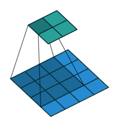

对于上述卷积运算，我们把上图所示的3×3卷积核展成一个如下所示的[4,16]的稀疏矩阵， 其中非0元素表示卷积核的第行和第列。

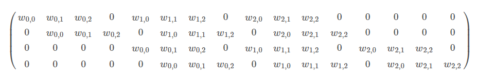

我们再把4×4的输入特征展成[16,1]的矩阵，那么则是一个[4,1]的输出特征矩阵，把它重新排列2×2的输出特征就得到最终的结果，从上述分析可以看出卷积层的计算其实是可以转化成矩阵相乘的。通过上述的分析，我们已经知道卷积层的前向操作可以表示为和矩阵相乘，那么**我们很容易得到卷积层的反向传播就是和****的转置相乘**。

反卷积又被称为Transposed(转置) Convolution，我们可以看出其实卷积层的前向传播过程就是反卷积层的反向传播过程，卷积层的反向传播过程就是反卷积层的前向传播过程。因为卷积层的前向反向计算分别为乘和，而反卷积层的前向反向计算分别为乘和 ，所以它们的前向传播和反向传播刚好交换过来。

下图表示反卷积过程。


### 1.3 上采样（unsampling）

上采样概念：上采样指的是任何可以让图像变成更高分辨率的技术。最简单的方式是重采样和插值：将输入图片进行缩放到一个想要的尺寸，而且计算每个点的像素点，使用如双线性插值等插值方法对其余点进行插值来完成上采样过程。【没有学习过程】


上采样（unsampling）相对来说比较简单，直接填充最临近的数值：

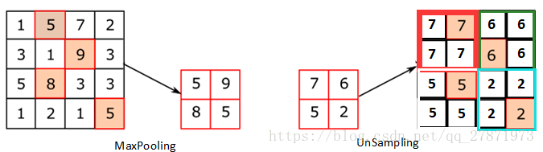

上采样阶段没有使用MaxPooling时的位置信息，而是直接将内容复制来扩充Feature Map。上图中右边4*4矩阵，用了四种颜色的正方形框分割为四个区域，每一个区域内的内容是直接复制上采样前的对应信息。

### 1.4 上池化（unpooling）

上池化是在CNN中常用的来表示MaxPooling的逆操作。这是论文《Visualizing and Understanding Convolutional Networks》中产生的思想。结构如下图所示。【没有学习过程】


上池化，又称为**反池化 **，这个过程中保存了最大池化的位置，应该将上池化和下采样结合起来。

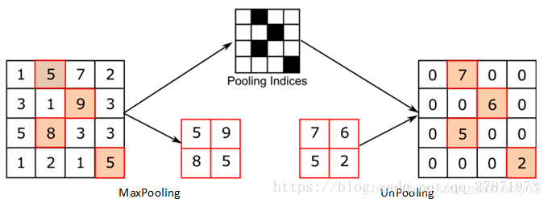

上池化的过程，特点是在MaxPooling的时候保留最大值的位置信息，之后在Unpooling阶段使用该信息扩充Feature Map，除最大值位置以外，其余补0。可以看出上池化和上采样的不同结果。

### 1.5 总结

对比上面两个示意图，可以发现区别：
两者的区别在于UnSampling阶段**没有 **使用MaxPooling时的位置信息，而是直接将内容复制来扩充Feature Map。第一幅图中右边4*4矩阵，用了四种颜色的正方形框分割为四个区域，每一个区域内的内容是直接复制上采样前的对应信息。UnPooling的过程，特点是在Maxpooling的时候保留最大值的位置信息，之后在unPooling阶段使用该信息扩充Feature Map，除最大值位置以外，其余补0。

## 2. 具体的讲解双线性插值

**在讲解双线性插值的时候，先讲解线性插值：**

### 2.1 线性插值

我们想把一个像素为2 * 2的图片放大为一个3 * 3 的图片，如下图所示：

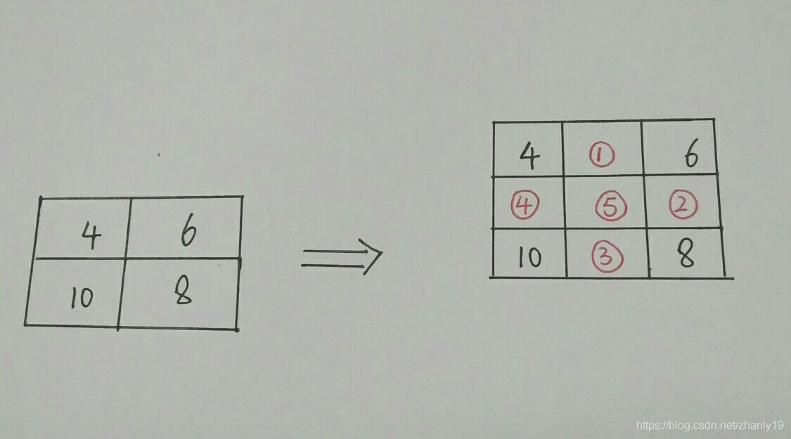

上图中，我们已经知道的是四个值，为了放大图片，我们进行根据已知的像素点填充未知的像素点
特别注意：线性插值是一种针对**一维数据**的插值方法，它根据一维数据序列中需要插值的点的左右邻近两个数据点来进行数值的估计，根据到这两个点的距离来分配它们的比重的。

**具体来说线性插值的过程如下：（如图：）**

**注意，我们插入的是Y值，X是相对的位置：**

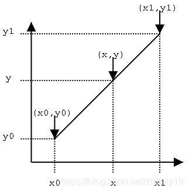

根据图中的假设：已知点(x0,y0)、(x1,y1)，试问在x处插值，y的值是多少？用我们初中学过的知识，已知两个点的坐标可以得到一条线，又已知线上一点的一个坐标可以求得这个点的另一个坐标值。这就是线性插值的原理。x只是表示的相对的位置，y才是我们想要的结果：

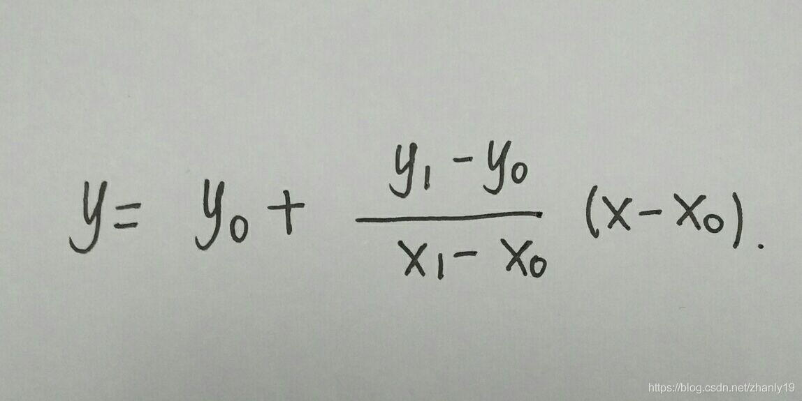

详细过程以及结果:
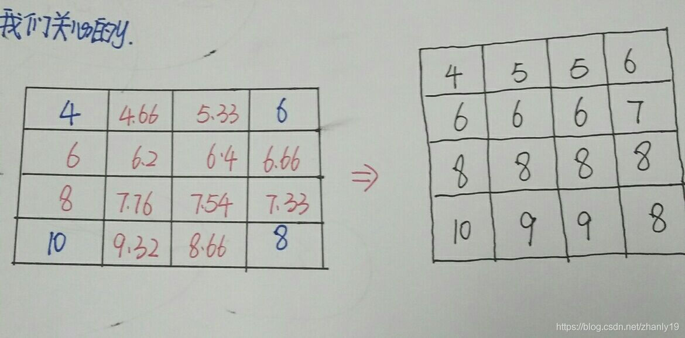

### 2.2 扩展到双线性插值

如图，已知Q12，Q22，Q11，Q21，但是要插值的点为P点，这就要用双线性插值了，首先在x轴方向上，对R1和R2两个点进行插值，这个很简单，然后根据R1和R2对P点进行插值，这就是所谓的双线性插值。


已知的红色数据点和待插值的绿色数据点。我们已知函数f在四个点值，我们想得到未知函数f在点P= (x,y) 的值。 
第一步：X方向的线性插值，在Q12,Q22中插入蓝色点R2，Q11，Q21中插入蓝色点R1。

 
第二步 ：Y方向的线性插值 ,通过第一步计算出的R1与R2在y方向上插值计算出P点。

 
在x与y方向上，z值成单调性特性的应用中，此种方法可以做外插运算，即可以求解Q11~Q22所构成的正方形以外的点的值。

## 3. Python实现

```
import cv2
import numpy as np
import time

def resize(src, new_size):
    dst_w, dst_h = new_size # 目标图像宽高
    src_h, src_w = src.shape[:2] # 源图像宽高
    if src_h == dst_h and src_w == dst_w:
        return src.copy()
    scale_x = float(src_w) / dst_w # x缩放比例
    scale_y = float(src_h) / dst_h # y缩放比例

    # 遍历目标图像，插值
    dst = np.zeros((dst_h, dst_w, 3), dtype=np.uint8)
    for n in range(3): # 对channel循环
        for dst_y in range(dst_h): # 对height循环
            for dst_x in range(dst_w): # 对width循环
                # 目标在源上的坐标
                src_x = (dst_x + 0.5) * scale_x - 0.5
                src_y = (dst_y + 0.5) * scale_y - 0.5
                # 计算在源图上四个近邻点的位置
                src_x_0 = int(np.floor(src_x))
                src_y_0 = int(np.floor(src_y))
                src_x_1 = min(src_x_0 + 1, src_w - 1)
                src_y_1 = min(src_y_0 + 1, src_h - 1)

                # 双线性插值
                value0 = (src_x_1 - src_x) * src[src_y_0, src_x_0, n] + (src_x - src_x_0) * src[src_y_0, src_x_1, n]
                value1 = (src_x_1 - src_x) * src[src_y_1, src_x_0, n] + (src_x - src_x_0) * src[src_y_1, src_x_1, n]
                dst[dst_y, dst_x, n] = int((src_y_1 - src_y) * value0 + (src_y - src_y_0) * value1)
    return dst

if __name__ == '__main__':
    img_in = cv2.imread('../data/picture/timg.jpg')
    start = time.time()
    img_out = cv2.resize(img_in, (600,600))
    #print'cost %f seconds' % (time.time() - start)

    cv2.imshow('src_image', img_in)
    cv2.imshow('dst_image', img_out)
    cv2.waitKey()
```


双线性插值是图像缩放的一种方式，其主要分为两步线性插值，一是在x方向插值，二是用x方向插值结果再在y方向插值，具体步骤如下：

**1.定位像素点**
先找到目标图像像素点(dst_x, dst_y)在源图像上的像素点位置(src_x, src_y)。
一般是使用直接缩放：
src_x=dst_x * scale_x (scale_x为源图像与目标图像宽比例)
而我们这里使用几何中心对称：
src_x = (dst_x + 0.5) * scale_x - 0.5
然后找到上下左右最近邻的四个像素点用于计算插值。


**2. 两步插值（借别人图）**

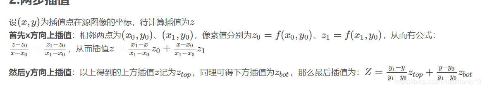
效果图如下：


## 4. Pytorch方法

### 4.1 Upsample

```
CLASS torch.nn.Upsample(size=None, scale_factor=None, mode='nearest', align_corners=None)
```

上采样一个给定的多通道的 1D (temporal,如向量数据), 2D (spatial，如jpg、png等图像数据) or 3D (volumetric，如点云数据)数据 
假设输入数据的格式为minibatch x channels x [optional depth] x [optional height] x width。因此对于一个空间spatial输入，我们期待着4D张量的输入，即minibatch x channels x height x width。而对于体积volumetric输入，我们则期待着5D张量的输入，即minibatch x channels x depth x height x width

对于上采样有效的算法分别有对 3D, 4D和 5D 张量输入起作用的 最近邻、线性,、双线性, 双三次(bicubic)和三线性(trilinear)插值算法

你可以给定scale_factor来指定输出为输入的scale_factor倍或直接使用参数size指定目标输出的大小（但是不能同时制定两个）

**参数：**

- **size** ([*int*](https://docs.python.org/3/library/functions.html#int) *or* *Tuple**[*[*int*](https://docs.python.org/3/library/functions.html#int)*] or* *Tuple**[*[*int*](https://docs.python.org/3/library/functions.html#int)*,* [*int*](https://docs.python.org/3/library/functions.html#int)*] or* *Tuple**[*[*int*](https://docs.python.org/3/library/functions.html#int)*,* [*int*](https://docs.python.org/3/library/functions.html#int)*,* [*int*](https://docs.python.org/3/library/functions.html#int)*]**,* *optional*) – 根据不同的输入类型制定的输出大小
- **scale_factor** ([*float*](https://docs.python.org/3/library/functions.html#float) *or* *Tuple**[*[*float*](https://docs.python.org/3/library/functions.html#float)*] or* *Tuple**[*[*float*](https://docs.python.org/3/library/functions.html#float)*,* [*float*](https://docs.python.org/3/library/functions.html#float)*] or* *Tuple**[*[*float*](https://docs.python.org/3/library/functions.html#float)*,* [*float*](https://docs.python.org/3/library/functions.html#float)*,* [*float*](https://docs.python.org/3/library/functions.html#float)*]**,* *optional*) – 指定输出为输入的多少倍数。如果输入为tuple，其也要制定为tuple类型
- **mode** ([*str*](https://docs.python.org/3/library/stdtypes.html#str)*,* *optional*) – 可使用的上采样算法，有`'nearest'`, `'linear'`, `'bilinear'`, `'bicubic'` and `'trilinear'`. `默认使用``'nearest'`
- **align_corners** ([*bool*](https://docs.python.org/3/library/functions.html#bool)*,* *optional*) – 如果为True，输入的角像素将与输出张量对齐，因此将保存下来这些像素的值。仅当使用的算法为`'linear'`, `'bilinear'`or `'trilinear'时可以使用。``默认设置为``False`

**输入输出形状：**

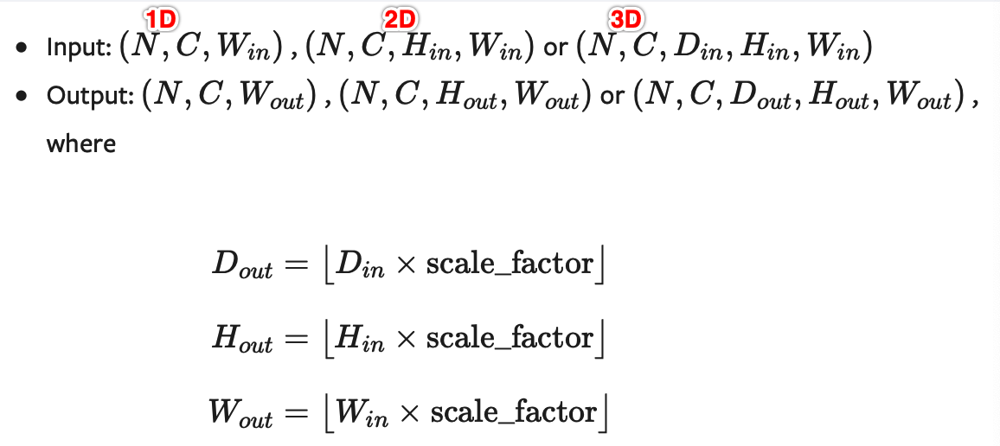

**注意：**

当align_corners = True时，线性插值模式(线性、双线性、双三线性和三线性)不按比例对齐输出和输入像素，因此输出值可以依赖于输入的大小。这是0.3.1版本之前这些模式的默认行为。从那时起，默认行为是align_corners = False,如下图：

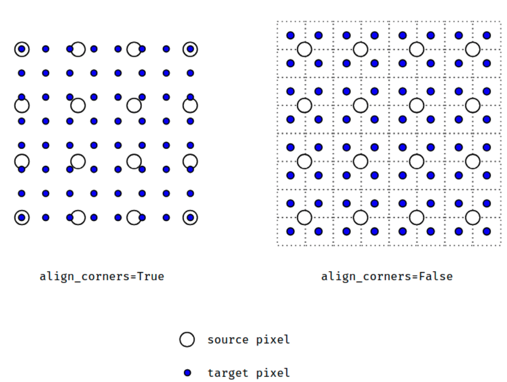

上面的图是source pixel为`4*4`上采样为target pixel为`8*8`的两种情况，这就是对齐和不对齐的差别，会对齐左上角元素，即设置为align_corners = True时输入的左上角元素是一定等于输出的左上角元素。但是有时align_corners = False时左上角元素也会相等，官网上给的例子就不太能说明两者的不同(也没有试出不同的例子，大家理解这个概念就行了)

如果您想下采样/常规调整大小，您应该使用interpolate()方法，这里的上采样方法已经不推荐使用了。

 

举例：

```
import torch
from torch import nn
input = torch.arange(1, 5, dtype=torch.float32).view(1, 1, 2, 2)
input
```

返回：

```
tensor([[[[1., 2.],
          [3., 4.]]]])
```

 

```
m = nn.Upsample(scale_factor=2, mode='nearest')
m(input)
```

返回：

```
tensor([[[[1., 1., 2., 2.],
          [1., 1., 2., 2.],
          [3., 3., 4., 4.],
          [3., 3., 4., 4.]]]])
```

 

```
m = nn.Upsample(scale_factor=2, mode='bilinear',align_corners=False)
m(input)
```

返回：

```
tensor([[[[1.0000, 1.2500, 1.7500, 2.0000],
          [1.5000, 1.7500, 2.2500, 2.5000],
          [2.5000, 2.7500, 3.2500, 3.5000],
          [3.0000, 3.2500, 3.7500, 4.0000]]]])
```

 

```
m = nn.Upsample(scale_factor=2, mode='bilinear',align_corners=True)
m(input)
```

返回：

```
tensor([[[[1.0000, 1.3333, 1.6667, 2.0000],
          [1.6667, 2.0000, 2.3333, 2.6667],
          [2.3333, 2.6667, 3.0000, 3.3333],
          [3.0000, 3.3333, 3.6667, 4.0000]]]])
```

 

```
m = nn.Upsample(size=(3,5), mode='bilinear',align_corners=True)
m(input)
```

返回：

```
tensor([[[[1.0000, 1.2500, 1.5000, 1.7500, 2.0000],
          [2.0000, 2.2500, 2.5000, 2.7500, 3.0000],
          [3.0000, 3.2500, 3.5000, 3.7500, 4.0000]]]])
```

 

如果你使用的数据都是JPG等图像数据，那么你就能够直接使用下面的用于2D数据的方法：

### 4.2 UpsamplingNearest2d

```
CLASS torch.nn.UpsamplingNearest2d(size=None, scale_factor=None)
```

专门用于2D数据的线性插值算法，参数等跟上面的差不多，省略

**形状：**

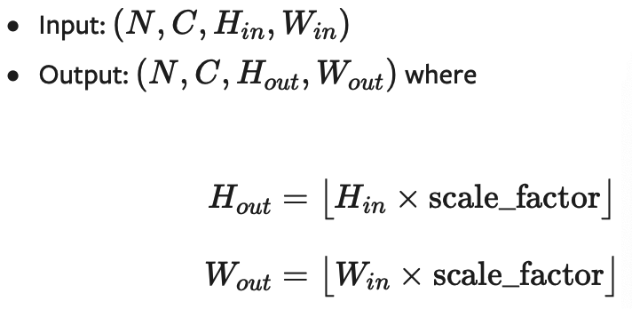

**举例：**

```
m = nn.UpsamplingNearest2d(scale_factor=2)
m(input)
```

input即上面例子的input，返回：

```
tensor([[[[1., 1., 2., 2.],
          [1., 1., 2., 2.],
          [3., 3., 4., 4.],
          [3., 3., 4., 4.]]]])
```

 

```
m = nn.UpsamplingNearest2d(size=(3,5))
m(input)
```

返回：

```
tensor([[[[1., 1., 1., 2., 2.],
          [1., 1., 1., 2., 2.],
          [3., 3., 3., 4., 4.]]]])
```

 

### 4.3 UpsamplingBilinear2d

```
CLASS torch.nn.UpsamplingBilinear2d(size=None, scale_factor=None)
```

专门用于2D数据的双线性插值算法，参数等跟上面的差不多，省略

**形状：**


注意：最好还是使用nn.functional.interpolate(..., mode='bilinear', align_corners=True)

**举例：**

```
m = nn.UpsamplingBilinear2d(scale_factor=2)
m(input)
```

返回：

```
tensor([[[[1.0000, 1.3333, 1.6667, 2.0000],
          [1.6667, 2.0000, 2.3333, 2.6667],
          [2.3333, 2.6667, 3.0000, 3.3333],
          [3.0000, 3.3333, 3.6667, 4.0000]]]])
```

 

```
m = nn.UpsamplingBilinear2d(size=(3,5))
m(input)
```

返回：

```
tensor([[[[1.0000, 1.2500, 1.5000, 1.7500, 2.0000],
          [2.0000, 2.2500, 2.5000, 2.7500, 3.0000],
          [3.0000, 3.2500, 3.5000, 3.7500, 4.0000]]]])
```
