# 物体识别  

⌚️: 2020年8月9日

📚参考

- [1]、目标检测历史：https://nikasa1889.github.io/   
- [2]、RCNNs对比：https://blog.csdn.net/v_JULY_v/article/details/80170182   

- [3]、RCNN介绍：https://blog.csdn.net/xyfengbo/article/details/70227173  
- [4]、SPPNET讲解：https://blog.csdn.net/hjimce/article/details/50187655   

- [5]、Faster RCNN：https://zhuanlan.zhihu.com/p/31426458    

- [6]、Faster RCNN：http://www.telesens.co/2018/03/11/object-detection-and-classification-using-r-cnns/    

- [7]、Faster RCNN：https://github.com/rbgirshick/py-faster-rcnn    

---

最近，物体识别已经成为计算机视觉和 AI 最令人激动的领域之一。即时地识别出场景中所有的物体的能力似乎已经不再是秘密。随着卷积神经网络架构的发展，以及大型训练数据集和高级计算技术的支持，计算机现在可以在某些特定设置（例如人脸识别） 的任务中超越人类的识别能力。   

每当计算机视觉识别方面有什么惊人的突破发生了，都得有人再讲一遍是怎么回事。接下来，试图用最简洁的语言和最有吸引力的方式讲述物体识别的现代史。   

## 一、概念介绍（卷积概念和目标检测概念）    

### 1、计算机视觉 6 大关键技术     

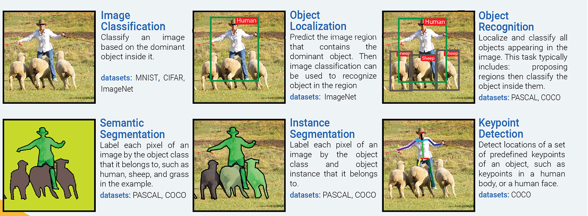   

* 图像分类：根据图像的主要内容进行分类。数据集：MNIST, CIFAR, ImageNet  
* 物体定位：预测包含主要物体的图像区域，以便识别区域中的物体。数据集：ImageNet  
* 物体识别：定位并分类图像中出现的所有物体。这一过程通常包括：划出区域然后对其中的物体进行分类。数据集：PASCAL, COCO
* 语义分割：把图像中的每一个像素分到其所属物体类别，在样例中如人类、绵羊和草地。数据集：PASCAL, COCO
* 实例分割：把图像中的每一个像素分到其物体类别和所属物体实例。数据集：PASCAL, COCO
* 关键点检测：检测物体上一组预定义关键点的位置，例如人体上或者人脸上的关键点。数据集：COCO   

有很多人分不清，物体识别、实例分割等名词的含义。对此，请看下面的例子。   

* 分类：这张图像有气球。  

* 语义分割：这些全是气球像素。  

* 目标检测：这张图像中的这些位置上有 7 个气球。  

* 实例分割：这些位置上有 7 个气球，并且这些像素分别属于每个气球。  

  

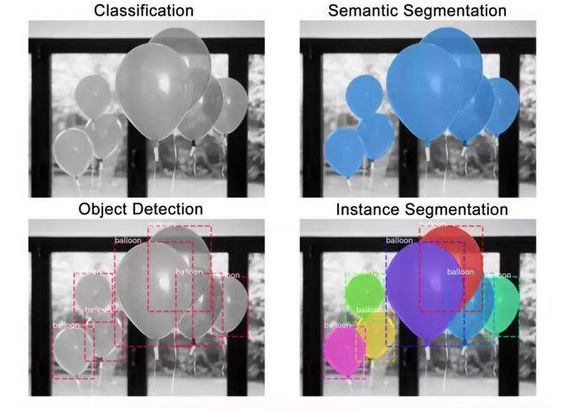  

### 2、特征 （图案，神经元的激活，特征探测）   

当一个特定的图案（特征）被呈现在输入区（接受域）中时，一个隐藏的神经元就被会被激活。神经元识别的图案可以被进行可视化，其方法是：1）优化其输入区，将神经元的激活（deep dream）较大化；2）将梯度（gradient）可视化或者在其输入像素中，引导神经元激活的梯度（反向传播以及经引导的反向传播）3）将训练数据集中，激活神经元最多的图像区域进行可视化。  

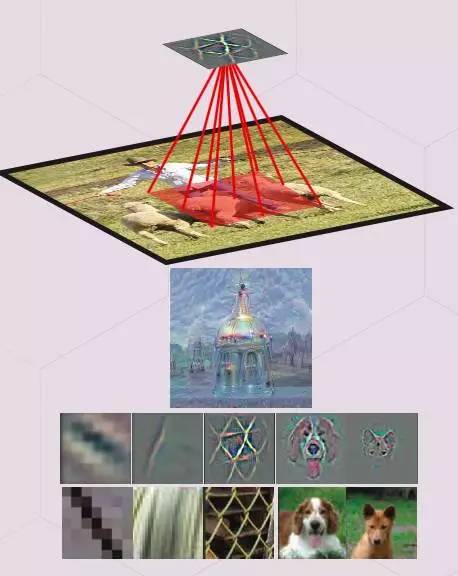  

### 3、感受野（特征的输入区）  

输入图像区会影响特征的激活。换句话说，它就是特征参考的区域。通常，越高层上的特征会的接受域会更宽，这能让它能学会捕捉更多的复杂/抽象图案。ConvNet 的架构决定了感受野是如何随着层数的改变而改变的。   

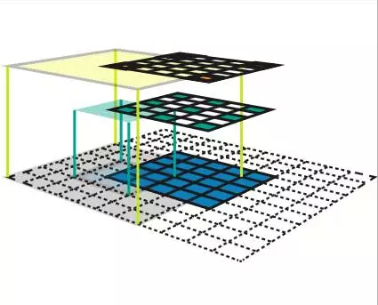   

### 4、特征图（feature map，隐藏层的通道）   

指的是一系列的特征，通过在一个滑动窗口（例如，卷积）的方式，在一个输入地图中的不同位置应用相同的特征探测器来创造。在相同的特征地图上的特征，有着一致的可接收形状，并且会寻找不同位置上的相同图案。这构成了ConvNet的空间不变性。 

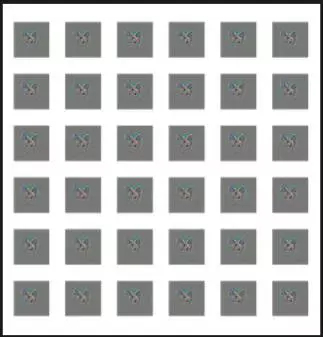  

### 5、特征量（卷积中的隐藏层）

这是一组特征地图，每一张地图会在输入地图中的一些固定位置搜寻特定的特征。所有的特征的接受域大小都是一样的。  

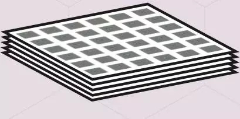   

### 6、作为特征量的全连接层  

全连接层（fc layers，在识别任务中通常粘附在一个ConvNet的尾端），这一特征量在每一张特征图上都有一个特征，其接收域会覆盖整张图像。全连接层中的权重矩阵W可以被转化成一个CNN核。   

将一个核wxhxk 卷积成一个CNN 特征量wxhxd会得到一个1x1xk特征量（=FC layer with k nodes)。通过卷积层替换完全连接的图层可以使ConvNet应用于任意大小的图像。   

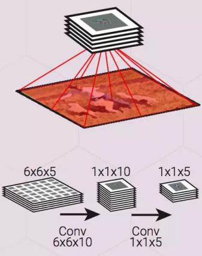  

### 7、反卷积

这一操作对卷积中的梯度进行反向传播。换句话说，它是卷积层的反向传递。反向的卷积可以作为一个正常的卷积部署，并且在输入特征中不需要任何插入。  

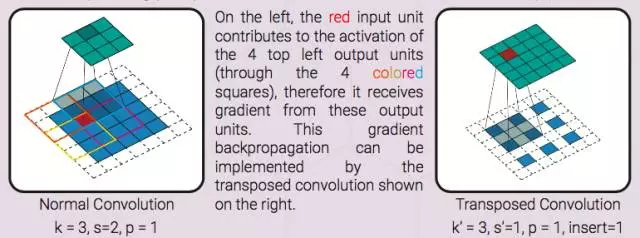   

左图，红色的输入单元负责上方四个单元的激活（四个彩色的框），进而能从这些输出单元中获得梯度。这一梯度反向传播能够通过反卷积（右图）部署。  

### 8、端到端物体识别管道（端到端学习/系统）  

这是一个包含了所有步骤的物体识别管道 （预处理、区域建议生成、建议分类、后处理），可以通过优化单个对象函数来进行整体训练。单个对象函数是一个可差分的函数，包含了所有的处理步骤的变量。这种端到端的管道与传统的物体识别管道的完全相反。在这些系统中，我们还不知道某个步骤的变量是如何影响整体的性能的，所以，么一个步骤都必须要独立的训练，或者进行启发式编程。  

以上介绍的是CNN的相关概念，接下来介绍一下，目标识别的概念。   

### 9、Bounding box proposal建议边界框（又称兴趣区域，提交区域，提交框）

输入图像上的一个长方形区域，内含需要识别的潜在对象。提交由启发式搜索（选择搜索或RPN网络）生成。   

一个边界框可以由4 元素向量表示，或表达为 2 个角坐标（x0,y0,x1,y1），或表达为一个中心坐标和宽与高（x,y,w,h）。边界框通常会配有一个信任指数，表示其包含对象物体的可能性。两个边界框的区别一般由它们的向量表示中的 L2 距离在测量。w 和 h 在计算距离前会先被对数化。   

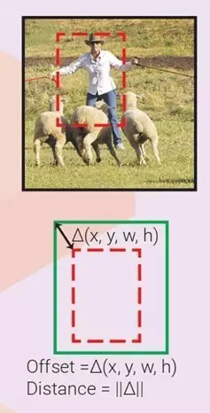   

### 10、Intersection over Union

重叠联合比（Intersection over Union，又称 IoU，Jaccard 相似度）,两个边界框相似度的度量值=它们的重叠区域除以联合区域。  

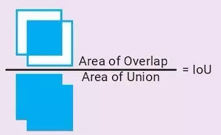   

### 11、非较大抑制（Non Maxium Suppression，又称 NMS）

一个融合重叠边界框的一般性算法。所有明显和高信度边界框重叠的边界框（IoU > IoU_threshold）都会被抑制（去除）。   

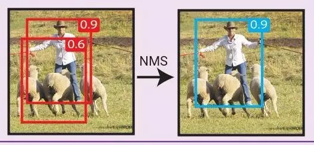   

### 12、边界框回归（边界框微调）

观察一个输入区域，我们可以得到一个更适合隐含对象的边界框，即使该对象仅部分可见。下图显示了在只看到一部分对象时，得出真实边界框（ground truth box）的可能性。因此，可以训练回归量，来观察输入区域，并预测输入区域框和真实框之间的 offset △（x,y,w,h）。如果每个对象类别都有一个回归量，就称为特定类别回归量，否则就称为不可知类别（class-agnostic，一个回归量用于所有类别）。边界框回归量经常伴有边界框分类器（信度评分者），来评估边界框中在对象存在的可信度。分类器既可以是特定类别的，也可以是不可知类别的。如果不定义首要框，输入区域框就扮演首要框的角色。    

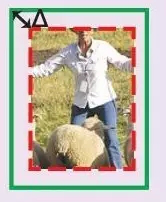   

### 13、首要框（Prior box，又称默认框、锚定框）

如果不使用输入区域作为首要框，我们可以训练多个边界框回归量，每一个观测相同的输入区域，但它们各自的首要框不同。每一个回归量学习预测自己的首要框和真实框之间的 offset。这样，带有不同首要框的回归量可以学习预测带有不同特性（宽高比，尺寸，位置）的边界框。相对于输入区域，首要框可以被预先定义，或者通过群集学习。适当的框匹配策略对于使训练收敛是至关重要的。   

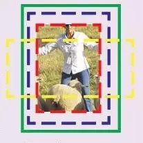   

### 14、框匹配策略  

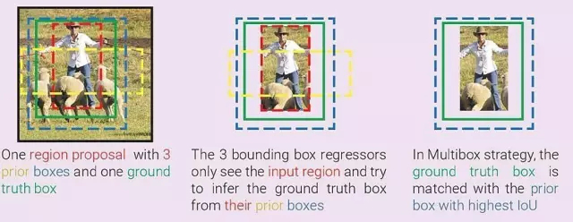   

我们不能指望一个边界框回归量可以预测一个离它输入区域或首要框（更常见）太远的对象边界框。因此，我们需要一个框匹配策略，来判断哪一个首要框与真实框相匹配。每一次匹配对回归来说都是一个训练样本。可能的策略有：（多框）匹配每一个带有较高 IoU 的首要框的真实框；（SSD，FasterRCNN）匹配带有任何 IoU 高于 0.5 的真实框的首要框。  

### 15、负样本挖掘（Hard negative example mining）

对于每个首要框，都有一个边界框分类器来评估其内部含有对象的可能性。框匹配之后，所有其他首要框都为负。如果我们用了所有这些负样本，正负之间本会有明显的不平衡。可能的解决方案是：随机挑选负样本（FasterRCNN），  或挑选那些分类器判断错误最严重的样本， 这样负和正之间的比例大概是3：1 。

接线来，安照下图的顺序来讲解各个神经网络。  

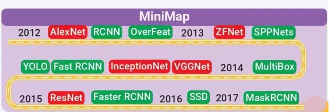   

候选区域/窗 + 深度学习分类：RCNN、SPPNET、FastRCNN、FasterRCNN  

基于深度学习的回归方法：Yolo、SSD   

## 二、RCNN（Regions with CNN features）

参考论文《Rich feature hierarchies for accurate object detection and semantic segmentation》   

Ross Girshick的blog：http://www.rossgirshick.info/   

### 1、概述

在RCNN出现之前，目标检测主要分为三大步骤，首先在图片中选取一部分（可选取无数个部分）；然后，对选取的每个部分进行特征提取；最后，对选取的部分进行分类。即：   

传统目标检测流程：    

1）区域选择（穷举策略：采用滑动窗口，且设置不同的大小，不同的长宽比对图像进行遍历，时间复杂度高）   

2）特征提取（SIFT、HOG等；形态多样性、光照变化多样性、背景多样性使得特征鲁棒性差）   

3）分类器分类（主要有SVM、Adaboost等）   

传统的工作流程就是对候选区域进行图像分类的工 作（特征提取+分类）。CNN成熟后，2014年，RBG（Ross B. Girshick）使用Region Proposal + CNN代替传统目标检测使用的滑动窗口+手工设计特征，设计了R-CNN框架，使得目标检测取得巨大突破，并开启了基于深度学习目标检测的热潮。   

RCNN是从传统目标检测到基于神经网络目标检测的转折期，过渡点，里程碑。只有了解RCNN的基本思想后才能更好的了解FasterRCNN，MaskRCNN等神经网络。   

### 2、RCNN网络结构/算法流程  

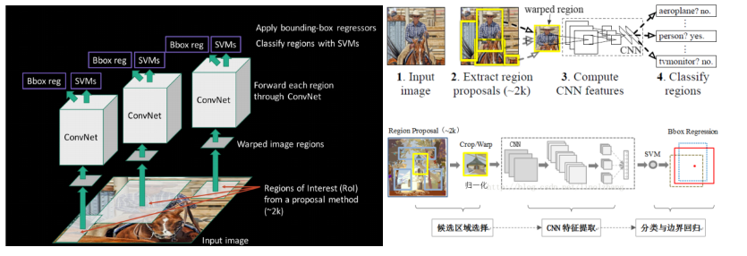   

*上图从3D(左）和2D（右）展示了RCNN算法的流程。其中，右上为论文原图，右下为自己理解的。*     

**RCNN算法分为4个步骤**    

1）候选区域选择：在图像中确定约1000-2000个候选框 (使用选择性搜索)   

2）CNN特征提取：每个候选框内图像块缩放至相同大小，并输入到CNN内进行特征提取   

3）分类：对候选框中提取出的特征，使用分类器判别是否属于一个特定类   

4）边界回归：对于属于某一特征的候选框，用回归器进一步调整其位置    

### 3、RCNN的缺点

* R-CNN网络训练、测试速度都很慢：R-CNN网络中，一张图经由selective search算法提取约2k个建议框【这2k个建议框大量重叠】，而所有建议框变形后都要输入AlexNet CNN网络提取特征【即约2k次特征提取】，会出现上述重叠区域多次重复提取特征，提取特征操作冗余；
* R-CNN网络训练、测试繁琐：R-CNN网络训练过程分为ILSVRC 2012样本下有监督预训练、PASCAL VOC 2007该特定样本下的微调、20类即20个SVM分类器训练、20类即20个Bounding-box 回归器训练，该训练流程繁琐复杂；同理测试过程也包括提取建议框、提取CNN特征、SVM分类和Bounding-box 回归等步骤，过于繁琐；
* R-CNN网络训练需要大量存储空间：20类即20个SVM分类器和20类即20个Bounding-box 回归器在训练过程中需要大量特征作为训练样本，这部分从CNN提取的特征会占用大量存储空间；   

## 三、SPPNET   

参考论文：《Spatial Pyramid Pooling in Deep Convolutional Networks for Visual Recognition》   
何凯明的博客：http://kaiminghe.com/   

### 1、概述   

上一节讲述了RCNN网络的算法流程及其缺点，其中导致RCNN速度慢的主要原因是固定图片尺寸和多次使用CNN进行特征提取。   

智者善于提出疑问，既然CNN的特征提取过程如此耗时（大量的卷积计算），为什么要对每一个候选区域独立计算，而不是提取整体特征，仅在分类之前做一次Region截取呢？智者提出疑问后会立即付诸实践，于是SPP-Net诞生了。    

### 2、SPPNET网络结构（主要内容金字塔池化层）  

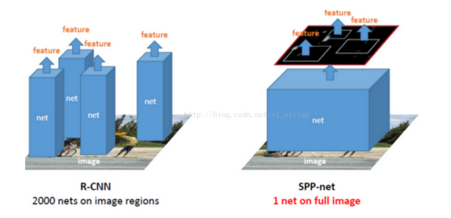   

*SPPNET和RCNN3D对比*    

如上图所示，SPPNET对RCNN做了点修改，将对每个候选框做一次CNN改为对整张图做一次CNN，因此减少了大量的卷积运算，节约时间。   

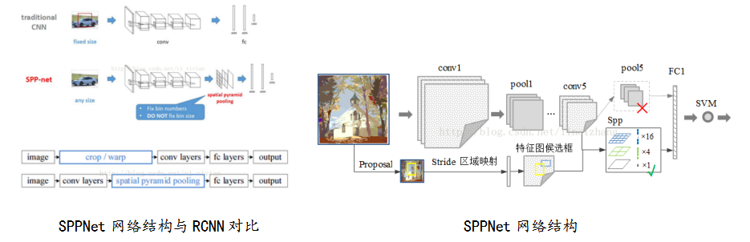   

如图所示，SPP-Net的特点是在最后一个卷积层后，接入了金字塔池化层，使用这种方式，可以让网络输入任意的图片，而且还会生成固定大小的输出。接下来，主要说一下什么是金字塔池化。   

#### 1）金字塔池化   

以下图为例进行解释说明：    

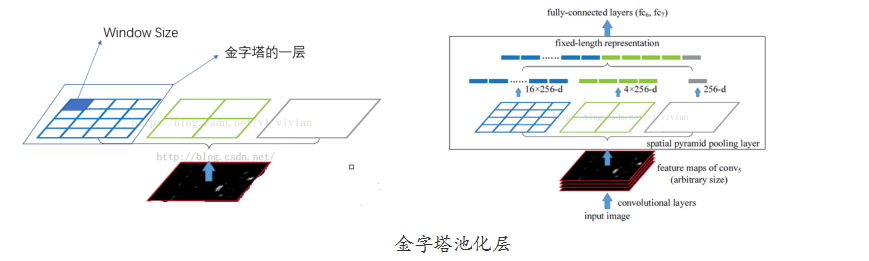   

 黑色图片代表卷积之后的特征图，接着我们以不同大小的块来提取特征，分别是4\*4，2\*2，1\*1，将这三张网格放到下面这张特征图上，就可以得到16+4+1=21种不同的块(Spatial bins)，我们从这21个块中，每个块提取出一个特征，这样刚好就是我们要提取的21维特征向量。这种以不同的大小格子的组合方式来池化的过程就是空间金字塔池化（SPP）。比如，要进行空间金字塔最大池化，其实就是从这21个图片块中，分别计算每个块的最大值，从而得到一个输出单元，最终得到一个21维特征的输出。    

听完上面的叙述，是不是感觉更加蒙了？下面我们举个例子，  

--------------------------举个栗子-_-
我们先从空间金字塔特征提取说起（这边先不考虑“池化”），空间金字塔是很久以前的一种特征提取方法，跟Sift、Hog等特征息息相关。为了简单起见，我们假设一个很简单两层网络：   

输入层：一张任意大小的图片,假设其大小为(w,h)。   

输出层：21个神经元。   

也就是我们输入一张任意大小的特征图的时候，我们希望提取出21个特征。空间金字塔特征提取的过程如下：    

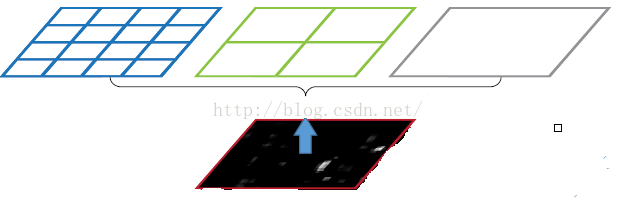   

*图片尺度划分*   

如上图所示，当我们输入一张图片的时候，我们利用不同大小的刻度，对一张图片进行了划分。上面示意图中，利用了三种不同大小的刻度，对一张输入的图片进行了划分，最后总共可以得到16+4+1=21个块，我们即将从这21个块中，每个块提取出一个特征，这样刚好就是我们要提取的21维特征向量。     

第一张图片,我们把一张完整的图片，分成了16个块，也就是每个块的大小就是(w/4,h/4);   

第二张图片，划分了4个块，每个块的大小就是(w/2,h/2);   

第三张图片，把一整张图片作为了一个块，也就是块的大小为(w,h)

空间金字塔最大池化的过程，其实就是从这21个图片块中，分别计算每个块的最大值，从而得到一个输出神经元。最后把一张任意大小的图片转换成了一个固定大小的21维特征（当然你可以设计其它维数的输出，增加金字塔的层数，或者改变划分网格的大小）。上面的三种不同刻度的划分，每一种刻度我们称之为：金字塔的一层，每一个图片块大小我们称之为：windows size了。如果你希望，金字塔的某一层输出n*n个特征，那么你就要用windows size大小为：(w/n,h/n)进行池化了。   

当我们有很多层网络的时候，当网络输入的是一张任意大小的图片，这个时候我们可以一直进行卷积、池化，直到网络的倒数几层的时候，也就是我们即将与全连接层连接的时候，就要使用金字塔池化，使得任意大小的特征图都能够转换成固定大小的特征向量，这就是空间金字塔池化的奥义（多尺度特征提取出固定大小的特征向量）。具体的流程图如下：   

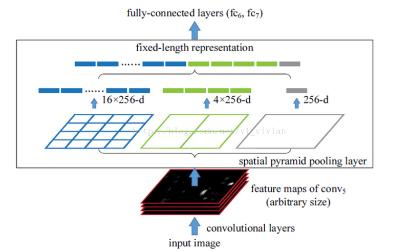   

--------------------- 举个栗子-_- END   

#### 2)金字塔池化的意义

     总结而言，当网络输入的是一张任意大小的图片，这个时候我们可以一直进行卷积、池化，直到网络的倒数几层的时候，也就是我们即将与全连接层连接的时候，就要使用金字塔池化，使得任意大小的特征图都能够转换成固定大小的特征向量，这就是空间金字塔池化的意义（多尺度特征提取出固定大小的特征向量）。
3)SPPNet算法流程   

* 候选区域选择：首先通过选择性搜索，对待检测的图片进行搜索出2000个候选窗口。这一步和R-CNN一样。
* 特征提取阶段：这一步就是和R-CNN最大的区别了，同样是用卷积神经网络进行特征提取，但是SPP-Net用的是金字塔池化。这一步骤的具体操作如下：把整张待检测的图片，输入CNN中，进行一次性特征提取，得到feature maps，然后在feature maps中找到各个候选框的区域，再对各个候选框采用金字塔空间池化，提取出固定长度的特征向量。而R-CNN输入的是每个候选框，然后在进入CNN，因为SPP-Net只需要一次对整张图片进行特征提取，速度是大大地快啊。因为R-CNN就相当于遍历一个CNN两千次，而SPP-Net只需要遍历1次。
* 分类和边界回归：最后一步也是和R-CNN一样，采用SVM算法进行特征向量分类识别。   

算法细节说明：看完上面的步骤二，我们会有一个疑问，那就是如何在feature maps中找到原始图片中候选框的对应区域？因为候选框是通过一整张原图片进行检测得到的，而feature maps的大小和原始图片的大小是不同的，feature maps是经过原始图片卷积、下采样等一系列操作后得到的。那么我们要如何在feature maps中找到对应的区域呢？这个答案可以在文献中的最后面附录中找到答案：APPENDIX A：Mapping a Window to Feature Maps。这个作者直接给出了一个很方便我们计算的公式：假设(x’,y’)表示特征图上的坐标点，坐标点(x,y)表示原输入图片上的点，那么它们之间有如下转换关系：  

(x,y)=(S\*x’,S\*y’)    

其中S的就是CNN中所有的strides的乘积。比如paper所用的ZF-5：   

`S=2*2*2*2=16`   

而对于Overfeat-5/7就是S=12，这个可以看一下下面的表格：  

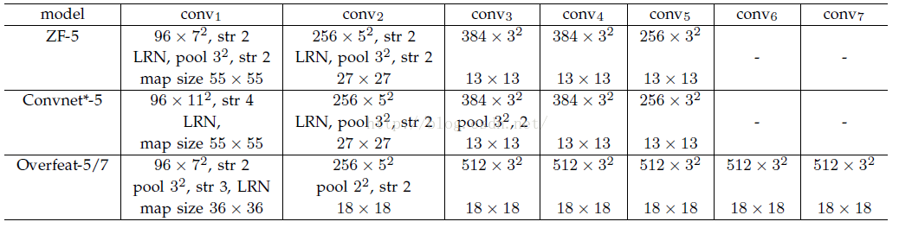     
需要注意的是Strides包含了池化、卷积的stride。自己计算一下Overfeat-5/7(前5层)是不是等于12。   

反过来，我们希望通过(x,y)坐标求解(x’,y’)，那么计算公式如下：   

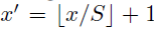   

因此我们输入原图片检测到的windows，可以得到每个矩形候选框的四个角点，然后我们再根据公式：  

Left、Top: 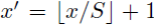  

Right、Bottom：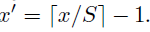   

## 四、Fast RCNN

参考论文：《Fast R-CNN》   

### 1、概述

Fast RCNN是rgb大神借鉴SPPNet思想对RCNN的修改结果，与RCNN相比，优点如下：   

* 借鉴SPP思路，提出简化版的ROI池化层（注意，没用金字塔），同时加入了候选框映射功能，使得网络能够反向传播，解决了SPP的整体网络训练问题；
* 多任务Loss层    
  * A）SoftmaxLoss代替了SVM，证明了softmax比SVM更好的效果；   
  * B）SmoothL1Loss取代Bouding box回归。   
    将分类和边框回归进行合并（又一个开创性的思路），通过多任务Loss层进一步整合深度网络，统一了训练过程，从而提高了算法准确度。
* 全连接层通过SVD加速  
  这个大家可以自己看，有一定的提升但不是革命性的。这里不多作介绍。   

结合上面的改进，模型训练时可对所有层进行更新，除了速度提升外（训练速度是SPP的3倍，测试速度10倍），得到了更好的检测效果（VOC07数据集mAP为70，注：mAP，mean Average Precision）。    

### 2、网络结构  

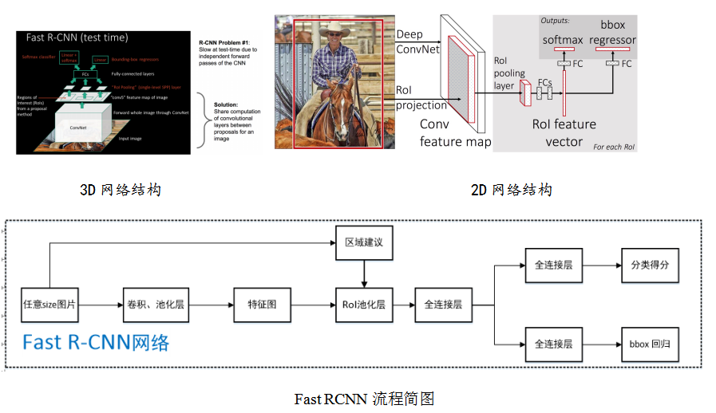  
ROI pooling layer实际上是SPP-NET的一个精简版，SPP-NET对每个proposal使用了不同大小的金字塔映射，而ROI pooling layer只需要下采样到一个7x7的特征图。对于VGG16网络conv5_3有512个特征图，这样所有region proposal对应了一个7\*7\*512维度的特征向量作为全连接层的输入。   

换言之，这个网络层可以把不同大小的输入映射到一个固定尺度的特征向量，而我们知道，conv、pooling、relu等操作都不需要固定size的输入，因此，在原始图片上执行这些操作后，虽然输入图片size不同导致得到的feature map尺寸也不同，不能直接接到一个全连接层进行分类，但是可以加入这个神奇的ROI Pooling层，对每个region都提取一个固定维度的特征表示，再通过正常的softmax进行类型识别。   

R-CNN训练过程分为了三个阶段，而Fast R-CNN直接使用softmax替代SVM分类，同时利用多任务损失函数边框回归也加入到了网络中，这样整个的训练过程是端到端的(除去Region Proposal提取阶段)。   

也就是说，之前R-CNN的处理流程是先提proposal，然后CNN提取特征，之后用SVM分类器，最后再做bbox regression，而在Fast R-CNN中，作者巧妙的把bbox regression放进了神经网络内部，与region分类和并成为了一个multi-task模型，实际实验也证明，这两个任务能够共享卷积特征，并相互促进。    

### 3、Fast RCNN的损失函数

Fast R-CNN网络分类损失和回归损失如下图所示【仅针对一个RoI即一类物体说明】，黄色框表示训练数据，绿色框表示输入目标：  
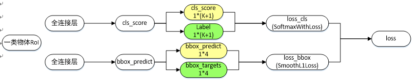   

-cls_score层用于分类，输出K+1维数组p，表示属于K类物体和背景的概率；    

-bbox_predict层用于调整候选区域位置，输出4*K维数组，也就是说对于每个类别都会训练一个单独的回归器；    

-loss_cls层评估分类代价，由真实分类u对应的概率决定：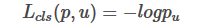   

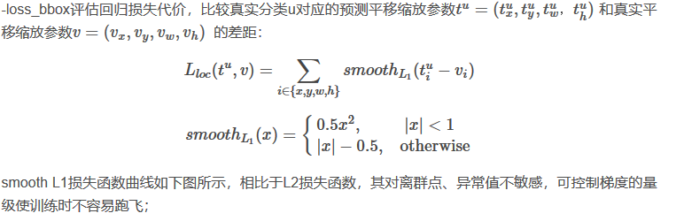   
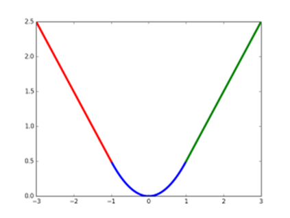  
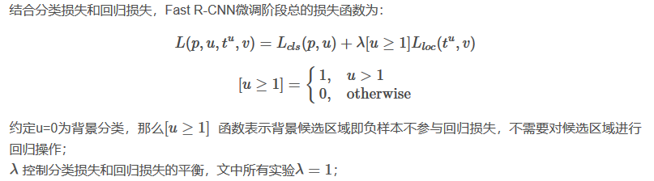   

## 五、Faster RCNN  

参考论文：《Faster R-CNN Towards Real-Time Object》

### 1、概述

经过R-CNN和Fast RCNN的积淀，Ross B. Girshick在2016年提出了新的Faster RCNN，在结构上，Faster RCNN已经将特征抽取(feature extraction)，proposal提取，bounding box regression，classification都整合在了一个网络中，使得综合性能有较大提高，在检测速度方面尤为明显。

### 2、网络结构

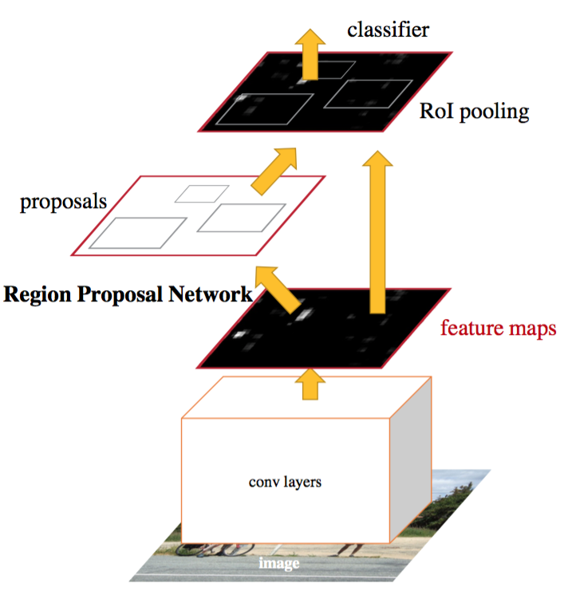   
*3D网络结构*   
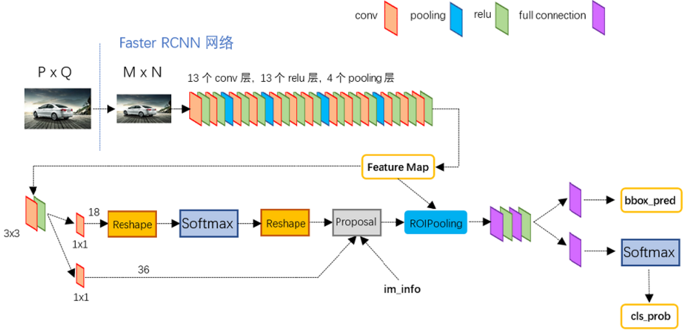  
*2D网络结构*  
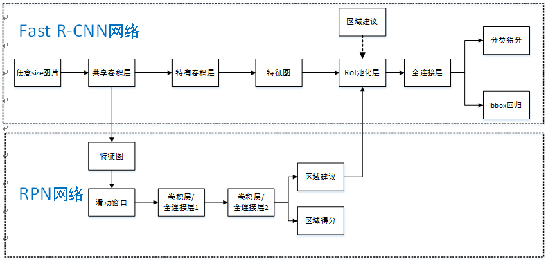  
*2D网络结构简图*  
**Faster RCNN其实可以分为4个主要内容**：   

* Conv layers。作为一种CNN网络目标检测方法，Faster RCNN首先使用一组基础的conv+relu+pooling层提取image的feature maps。该feature maps被共享用于后续RPN层和全连接层。
* Region Proposal Networks。RPN网络用于生成region proposals。该层通过softmax判断anchors属于foreground或者background，再利用bounding box regression修正anchors获得精确的proposals。
* Roi Pooling。该层收集输入的feature maps和proposals，综合这些信息后提取proposal feature maps，送入后续全连接层判定目标类别。
* Classification。利用proposal feature maps计算proposal的类别，同时再次bounding box regression获得检测框最终的精确位置。   

如下图，可以清晰的看到该网络对于一副任意大小PxQ的图像，首先缩放至固定大小MxN，然后将MxN图像送入网络；而Conv layers中包含了13个conv层+13个relu层+4个pooling层；RPN网络首先经过3x3卷积，再分别生成foreground anchors与bounding box regression偏移量，然后计算出proposals；而Roi Pooling层则利用proposals从feature maps中提取proposal feature送入后续全连接和softmax网络作classification（即分类proposal到底是什么object）。   
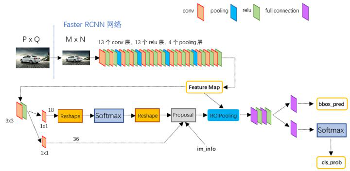   
*Faster RCNN网络结构图*    
（1） Conv layers   
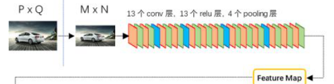  
*CNN提取feature Map*   

Conv layers包含了conv，pooling，relu三种层。以VGG16网络结构为例，Conv layers部分共有13个conv层，13个relu层，4个pooling层。   

数学角度：   

CNN网络正向和反向的数学推导,百度——CNN数学推导   

（2） Region Proposal Networks(RPN)   

经典的检测方法生成检测框都非常耗时，如OpenCV adaboost使用滑动窗口+图像金字塔生成检测框；或如R-CNN使用SS(Selective Search)方法生成检测框。而Faster RCNN则抛弃了传统的滑动窗口和SS方法，直接使用RPN生成检测框，这也是Faster R-CNN的巨大优势，能极大提升检测框的生成速度。   

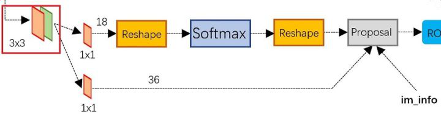   
*RPN网络结构*   

上图展示了RPN网络的具体结构。可以看到RPN网络实际分为2条线，上面一条通过softmax分类anchors获得foreground和background（检测目标是foreground），下面一条用于计算对于anchors的bounding box regression偏移量，以获得精确的proposal。而最后的Proposal层则负责综合foreground anchors和bounding box regression偏移量获取proposals，同时剔除太小和超出边界的proposals。其实整个网络到了Proposal Layer这里，就完成了相当于目标定位的功能。     

----------------上述中的anchors解释 Start----    

提到RPN网络，就不能不说anchors。所谓anchors，就是在feature map中每个像素点产生9个矩形共有3种形状，长宽比为大约为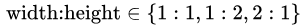三种，如下图。实际上通过anchors就引入了检测中常用到的多尺度方法。   

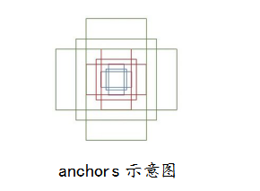   

这9个anchors是做什么的呢？借用Faster RCNN论文中的原图，如下图，遍历Conv layers计算获得的feature maps，为每一个点都配备这9种anchors作为初始的检测框。这样做获得检测框很不准确，不用担心，后面还有2次bounding box regression可以修正检测框位置。   

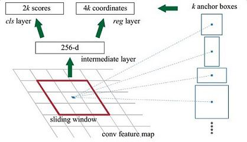  

*单个RPN网络结构图*   

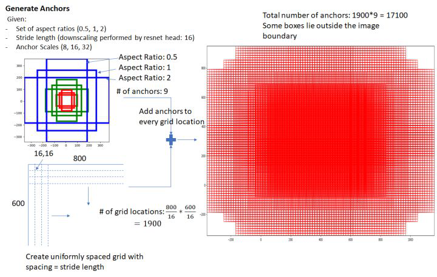   

*整个RPN生成anchors示意图*   

在原文中使用的是ZF model中，其Conv Layers中最后的conv5层num_output=256，对应生成256张特征图，所以相当于feature map每个点都是256-dimensions      

其实RPN最终就是在原图尺度上，设置了密密麻麻的候选Anchor。然后用cnn去判断哪些Anchor是里面有目标的foreground anchor，哪些是没目标的backgroud。所以，仅仅是个二分类而已！     

那么Anchor一共有多少个？原图800x600，VGG下采样16倍，feature map每个点设置9个Anchor，所以：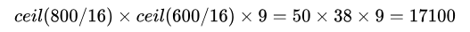 ，其中ceil()表示向上取整，是因为VGG输出的feature map size= 50*38。   

----------------上述中的anchors解释 END----    

RPN相当于Fast RCNN中的SS算法，其功能是选取候选框，RPN是一个CNN网络（网络结构前面的已经给出），作用在feature map上。   

接下来，结合数学角度详细解释下RPN的网络结构和功能。     

①softmax判定foreground与background   

一副MxN（800x600）大小的矩阵送入Faster RCNN网络后，到RPN网络变为(M/16)x(N/16)，不妨设 W=M/16，H=N/16。在进入reshape与softmax之前，先做了1x1卷积，如图：   

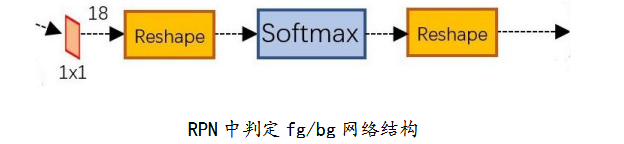   
可以看到其num_output=18，也就是经过该卷积的输出图像为WxHx18大小。这也就刚好对应了feature maps每一个点都有9个anchors，同时每个anchors又有可能是foreground和background，所有这些信息都保存WxHx(9*2)大小的矩阵。为何这样做？后面接softmax分类获得foreground anchors，也就相当于初步提取了检测目标候选区域box（一般认为目标在foreground anchors中）。   
    

那么为何要在softmax前后都接一个reshape layer？其实只是为了便于softmax分类，至于具体原因这就要从caffe的实现形式说起了。在caffe基本数据结构blob中以如下形式保存数据：blob=[batch_size, channel，height，width]   

对应至上面的保存bg/fg anchors的矩阵，其在caffe blob中的存储形式为[1, 2x9, H, W]。而在softmax分类时需要进行fg/bg二分类，所以reshape layer会将其变为[1, 2, 9xH, W]大小，即单独“腾空”出来一个维度以便softmax分类，之后再reshape回复原状。    

综上所述，RPN网络中利用anchors和softmax初步提取出foreground anchors作为候选区域。     

②bounding box regression原理     

如图所示绿色框为飞机的Ground Truth(GT)，红色为提取的foreground anchors，即便红色的框被分类器识别为飞机，但是由于红色的框定位不准，这张图相当于没有正确的检测出飞机。所以我们希望采用一种方法对红色的框进行微调，使得foreground anchors和GT更加接近。   

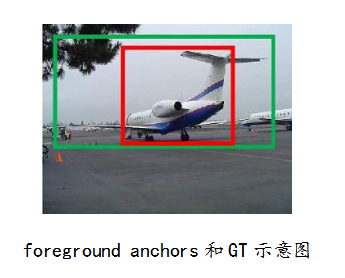   

对于窗口一般使用四维向量  表示，分别表示窗口的中心点坐标和宽高。对于下图，红色的框A代表原始的Foreground Anchors，绿色的框G代表目标的GT，我们的目标是寻找一种关系，使得输入原始的anchor A经过映射得到一个跟真实窗口G更接近的回归窗口G'，即：   

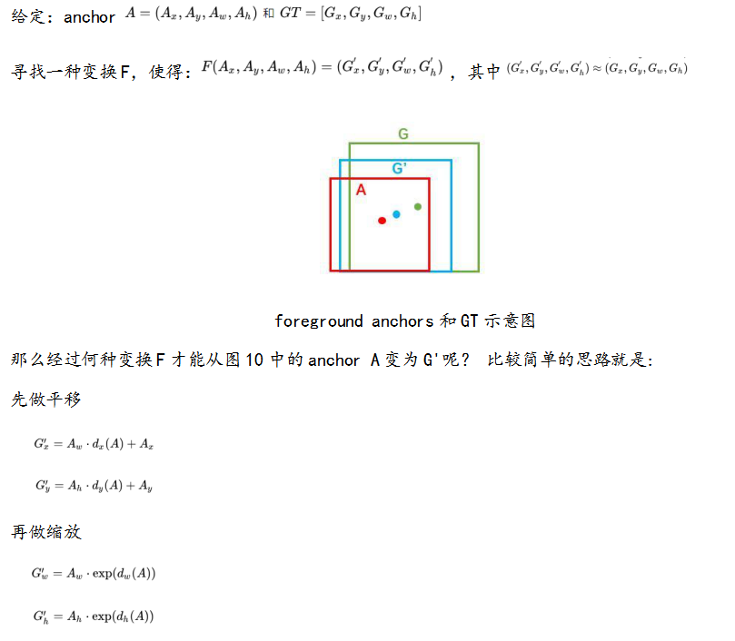   
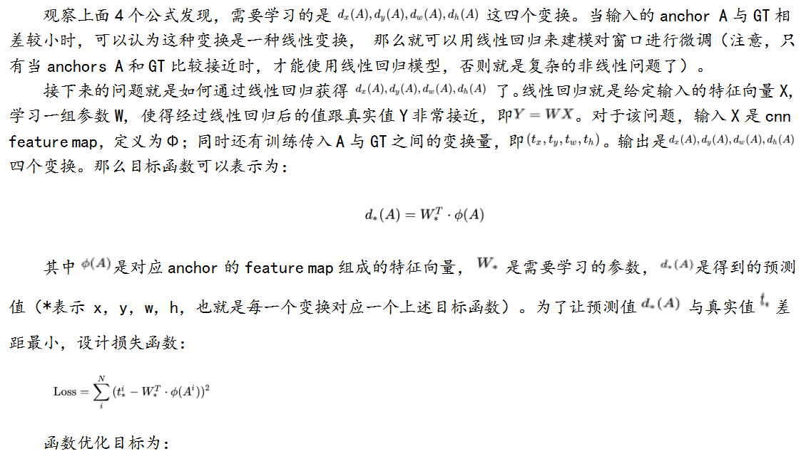   
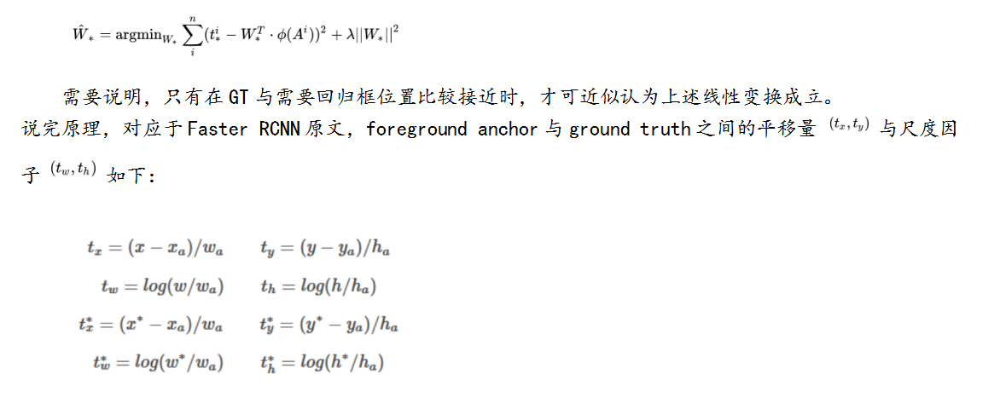   

其中，x,y,w,h表示窗口中心和窗口的宽度和高度，变量分别表示预测窗口、anchor窗口和Ground Truth的坐标【y，w，h同理】，因此这可以被认为是一个从anchor窗口到附近Ground Truth的bounding-box回归；RPN网络中bounding-box回归的实质其实就是计算出预测窗口。这里以anchor窗口为基准，计算Ground Truth对其的平移缩放变化参数，以及预测窗口【可能第一次迭代就是anchor】对其的平移缩放参数，因为是以anchor窗口为基准，所以只要使这两组参数越接近，以此构建目标函数求最小值，那预测窗口就越接近Ground Truth，达到回归的目的；   
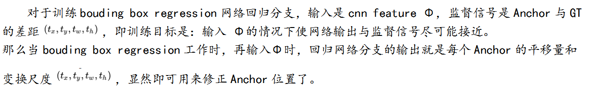   
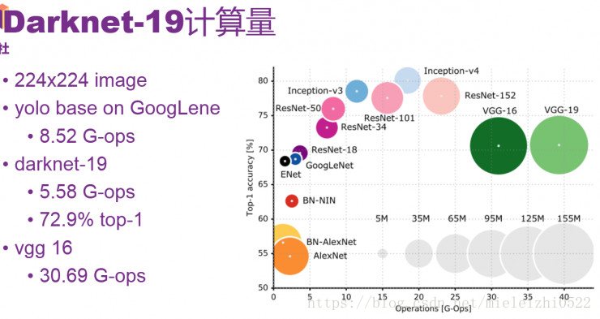   
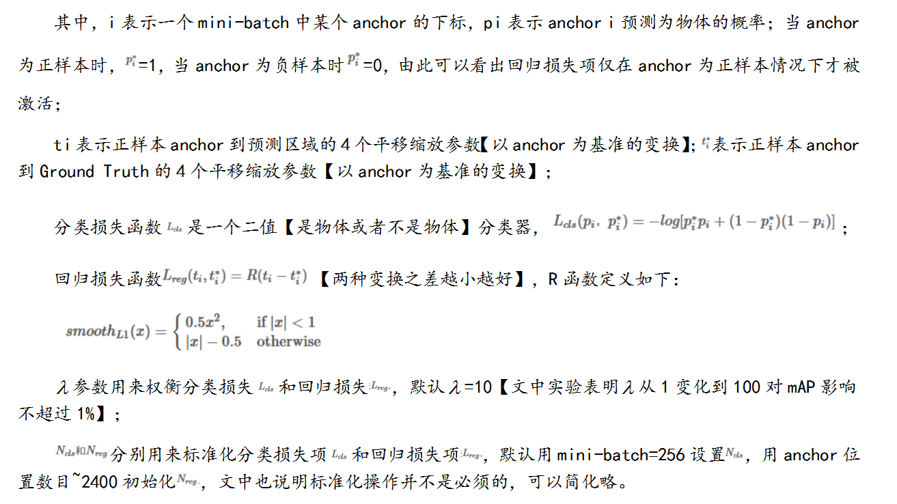   
   
   
   
    
   
   
  
  

### 4、Faster R-CNN算法流程

·特征提取：对整张图片输进CNN，得到feature map   
·选取候选框：卷积特征输入到RPN，得到候选框的特征信息   
·分类：对候选框中提取出的特征，使用分类器判别是否属于一个特定类    
·边界回归：对于属于某一类别的候选框，用回归器进一步调整其位置   

