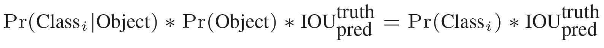

#  YOLO v1

⌚️: 2020年8月9日

📚参考

- **论文下载：**[http://arxiv.org/abs/1506.02640](https://link.zhihu.com/?target=http%3A//arxiv.org/abs/1506.02640)
- **代码下载：**[https://github.com/pjreddie/darknet](https://link.zhihu.com/?target=https%3A//github.com/pjreddie/darknet)

- [【论文解读】Yolo三部曲解读——Yolov1](https://zhuanlan.zhihu.com/p/70387154)

---

**核心思想**：将整张图片作为网络的输入（类似于Faster-RCNN），直接在输出层对BBox的位置和类别进行回归。

## **1. 物体检测算法概述**

物体检测（object detection）是计算机视觉中一个重要的分支，其大致功能是在一张图片中，用最小矩形框框出目标物体位置，并进行分类。先上图，Yolo v1可以识别20个类别：

图一 Yolo检测示例图

物体检测的两个步骤可以概括为：

- 步骤一：检测目标位置（生成矩形框）
- 步骤二：对目标物体进行分类

物体检测主流的算法框架大致分为one-stage与two-stage。two-stage算法代表有R-CNN系列，one-stage算法代表有Yolo系列。按笔者理解，two-stage算法将步骤一与步骤二分开执行，输入图像先经过候选框生成网络（例如faster rcnn中的RPN网络），再经过分类网络；one-stage算法将步骤一与步骤二同时执行，输入图像只经过一个网络，生成的结果中同时包含位置与类别信息。two-stage与one-stage相比，精度高，但是计算量更大，所以运算较慢。

就R-CNN系列算法与Yolo系列算法简单列出发表时间线：

图二 RCNN、Yolo发表时间线

可见，Yolo系列发表日期全部在Faster RCNN之后，Faster RCNN算法的精度是state-of-the-art级别的，Yolo算法的精度没有超越Faster RCNN，而是在速度与精度之间进行权衡。Yolo v3在改进多次之后，既有一定的精度，也保持了较高的运行速度。在很多边缘计算、实时性要求较高的任务中，Yolo v3备受青睐。在RCNN算法日益成熟之后，Yolo算法却能横空出世，离不开其高性能和使用回归思想做物体检测的两个特点。

> First, YOLO is extremely fast. Since we frame detection as a regression problem we don’t need a complex pipeline. 
> Second, YOLO reasons globally about the image when making predictions. Unlike sliding window and region proposal-based techniques, YOLO sees the entire image.
> Third, YOLO learns generalizable representations of objects. When trained on natural images and tested on art- work, YOLO outperforms top detection methods like DPM and R-CNN by a wide margin. 

上述论文中提及的三点：

1. Yolo很快，因为用回归的方法，并且不用复杂的框架。
2. Yolo会基于整张图片信息进行预测，而其他滑窗式的检测框架，只能基于局部图片信息进行推理。
3. Yolo学到的图片特征更为通用。作者尝试了用自然图片数据集进行训练，用艺术画作品进行预测，Yolo的检测效果更佳。

本文重点讲解Yolo v1算法细节。v1相比v2、v3以及其他物体检测算法，思路简单清晰，非常适合物体检测初学者上手。即使没有过任何物体检测相关知识，只需要一点卷积神经网络基础，便可以看懂Yolo v1。

## 2. 前向传播

将一幅图像分成SxS个网格(grid cell)，如果某个object的中心 落在这个网格中，则这个网格就负责预测这个object。

每个网络需要预测B个BBox的位置信息和confidence（置信度）信息，一个BBox对应着四个位置信息和一个confidence信息。confidence代表了所预测的box中含有object的置信度和这个box预测的有多准两重信息：

其中如果有object落在一个grid cell里，第一项取1，否则取0。 第二项是预测的bounding box和实际的groundtruth之间的IoU值。

每个bounding box要预测(x, y, w, h)和confidence共5个值，每个网格还要预测一个类别信息，记为C类。则SxS个网格，每个网格要预测B个bounding box还要预测C个categories。输出就是S x S x (5*B+C)的一个tensor。（**注意：class信息是针对每个网格的，confidence信息是针对每个bounding box的。**）

举例说明: 在PASCAL VOC中，图像输入为448x448，取S=7，B=2，一共有20个类别(C=20)。则输出就是7x7x30的一个tensor。整个网络结构如下图所示：

直接上结构图，输入图像大小为448\*448，经过若干个卷积层与池化层，变为7\*7\*1024张量（图中倒数第三个立方体），最后经过两层全连接层，输出张量维度为7\*7\*30，这就是Yolo v1的整个神经网络结构，和一般的卷积物体分类网络没有太多区别，最大的不同就是：分类网络最后的全连接层，一般连接于一个一维向量，向量的不同位代表不同类别，而这里的输出向量是一个三维的张量（7\*7\*30）。上图中Yolo的backbone网络结构，受启发于GoogLeNet，也是v2、v3中Darknet的先锋。本质上来说没有什么特别，没有使用BN层，用了一层Dropout。除了最后一层的输出使用了线性激活函数，其他层全部使用Leaky Relu激活函数。网络结构没有特别的东西，不再赘述。

### 2.1 7*7的含义

7\*7是指图片被分成了7\*7个格子，如下所示：

图四 初始格点

在Yolo中，如果一个**物体的中心点**，落在了某个格子中，那么这个格子将负责预测这个物体。这句话怎么理解，用上图举例，设左下角格子假设坐标为 ![[公式]](https://www.zhihu.com/equation?tex=%281%2C1%29)，小狗所在的最小包围矩形框的中心，落在了 ![[公式]](https://www.zhihu.com/equation?tex=%282%2C3%29) 这个格子中。那么7\*7个格子中，(2,3)这个格子所对应的物体置信度标签为1，而那些没有物体中心点落进来的格子，对应的物体置信度标签为0。这个设定就好比该网络在一开始，就将整个图片上的预测任务进行了分工，一共设定7\*7个按照方阵列队的检测人员，每个人员负责检测一个物体，大家的分工界线，就是看被检测物体的中心点落在谁的格子里。当然，是7\*7还是9\*9，是上图中的参数S，可以自己修改，精度和性能会随之有些变化。

### 2.2 30的含义

刚才设定了49个检测人员，那么每个人员负责检测的内容，就是这里的30（注意，30是张量最后一维的长度）。在Yolo v1论文中，30是由 ![[公式]](https://www.zhihu.com/equation?tex=%284%2B1%29%2A2+%2B+20) 得到的。其中4+1是矩形框的中心点坐标 ![[公式]](https://www.zhihu.com/equation?tex=x%2C+y) ，长宽 ![[公式]](https://www.zhihu.com/equation?tex=w%2C+h) 以及是否属于被检测物体的置信度 ![[公式]](https://www.zhihu.com/equation?tex=c+) ；2是一个格子共回归两个矩形框，每个矩形框分别产生5个预测值（ ![[公式]](https://www.zhihu.com/equation?tex=x%2Cy%2Cw%2Ch%2Cc) )；20代表预测20个类别。这里有几点需要注意：1. 每个方格（grid） 产生2个预测框，2也是参数，可以调，但是一旦设定为2以后，那么每个方格只产生两个矩形框，最后选定置信度更大的矩形框作为输出，**也就是最终每个方格只输出一个预测矩形框**。2. **每个方格只能预测一个物体。**虽然可以通过调整参数，产生不同的矩形框，但这只能提高矩形框的精度。所以当有很多个物体的中心点落在了同一个格子里，该格子只能预测一个物体。也就是格子数为7*7时，该网络最多预测49个物体。

> YOLO imposes strong spatial constraints on bounding box predictions since each grid cell only predicts two boxes and can only have one class. This spatial constraint limits the number of nearby objects that our model can predict. Our model struggles with small objects that appear in groups, such as flocks of birds. 

如上述原文中提及，在强行施加了格点限制以后，每个格点只能输出一个预测结果，所以该算法最大的不足，就是对一些邻近小物体的识别效果不是太好，例如成群结队的小鸟。

### 2.3 Test

在test的时候，每个网格预测的class信息和bounding box预测的confidence信息相乘，就得到每个bounding box的class-specific confidence score:

等式左边第一项就是每个网格预测的类别信息，第二三项就是每个bounding box预测的confidence。这个乘积即encode了预测的box属于某一类的概率，也有该box准确度的信息。

得到每个box的class-specific confidence score以后，设置阈值，滤掉得分低的boxes，对保留的boxes进行NMS处理，就得到最终的检测结果。

## 3.  损失函数

看到这里读者或许会有疑问，Yolo里的每个格点，是怎么知道该预测哪个物体的？这就是神经网络算法的能力。首先拿到一批标注好的图片数据集，按照规则打好标签，之后让神经网络去拟合训练数据集。训练数据集中的标签是通过人工标注获得，当神经网络对数据集拟合的足够好时，那么就相当于神经网络具备了一定的和人一样的识别能力。

神经网络结构确定之后，**训练效果好坏，由Loss函数和优化器决定**。Yolo v1使用普通的梯度下降法作为优化器。这里重点解读一下Yolo v1使用的Loss函数。

在实现中，最主要的就是怎么设计损失函数，让这个**三个方面**（那三个方面？见损失函数公式）得到很好的平衡。作者简单粗暴的全部采用了**sum-squared error loss**来做这件事。

**这种做法存在以下几个问题：**

- 第一，8维的localization error和20维的classification error同等重要显然是不合理的；
- 第二，如果一个网格中没有object（一幅图中这种网格很多），那么就会将这些网格中的box的confidence push到0，相比于较少的有object的网格，这种做法是overpowering（压倒性的）的，这会导致网络不稳定甚至发散。

**解决办法：**

- 更重视8维的坐标预测，给这些损失前面赋予更大的loss weight。
- 对没有object的box的confidence loss，赋予小的loss weight。
- 有object的box的confidence loss和类别的loss的loss weight正常取1。

对不同大小的box预测中，相比于大box预测偏一点，小box预测偏一点肯定更不能被忍受的。而sum-square error loss中对同样的偏移loss是一样。

为了缓和这个问题，作者用了一个比较取巧的办法，就是将box的width和height取平方根代替原本的height和width。这个参考下面的图很容易理解，小box的横轴值较小，发生偏移时，反应到y轴上相比大box要大。（也是个近似逼近方式）

一个网格预测多个box，希望的是每个box predictor专门负责预测某个object。具体做法就是看当前预测的box与ground truth box中哪个IoU大，就负责哪个。这种做法称作box predictor的specialization。

最后整个的损失函数如下所示：

论文中Loss函数，密密麻麻的公式初看可能比较难懂。其实论文中给出了比较详细的解释。所有的损失都是使用平方和误差公式，暂时先不看公式中的 ![[公式]](https://www.zhihu.com/equation?tex=%5Clambda_%7Bcoord%7D+) 与 ![[公式]](https://www.zhihu.com/equation?tex=%5Clambda_%7Bnoobj%7D+) ，输出的预测数值以及所造成的损失有:

1. **预测框的中心点**![[公式]](https://www.zhihu.com/equation?tex=%28x%2C+y%29) 。造成的损失是图中的第一行。其中 ![[公式]](https://www.zhihu.com/equation?tex=1%5E%7Bobj%7D_%7Bij%7D) 为控制函数，在标签中包含物体的那些格点处，该值为 1 ；若格点不含有物体，该值为 0。也就是只对那些有真实物体所属的格点进行损失计算，若该格点不包含物体，那么预测数值不对损失函数造成影响。![[公式]](https://www.zhihu.com/equation?tex=%28x%2C+y%29) 数值与标签用简单的平方和误差。
2. **预测框的宽高**![[公式]](https://www.zhihu.com/equation?tex=%28w%2C+h%29) 。造成的损失是图的第二行。![[公式]](https://www.zhihu.com/equation?tex=1%5E%7Bobj%7D_%7Bij%7D)的含义一样，也是使得只有真实物体所属的格点才会造成损失。这里对 ![[公式]](https://www.zhihu.com/equation?tex=%28w%2C+h%29) 在损失函数中的处理分别取了**根号**，原因在于，如果不取根号，**损失函数往往更倾向于调整尺寸比较大的预测框**。例如，20个像素点的偏差，对于800\*600的预测框几乎没有影响，此时的IOU数值还是很大，但是对于30\*40的预测框影响就很大。**取根号是为了尽可能的消除大尺寸框与小尺寸框之间的差异**。
3. 第三行与第四行，都是**预测框的置信度**C。当该格点不含有物体时，该置信度的标签为0；若含有物体时，该置信度的标签为预测框与真实物体框的IOU数值（IOU计算公式为：两个框交集的面积除以并集的面积）。
4. 第五行为**物体类别概率**P，对应的类别位置，该标签数值为1，其余位置为0，与分类网络相同。

此时再来看 ![[公式]](https://www.zhihu.com/equation?tex=%5Clambda_%7Bcoord%7D+) 与 ![[公式]](https://www.zhihu.com/equation?tex=%5Clambda_%7Bnoobj%7D+) ，Yolo面临的物体检测问题，是一个典型的类别数目不均衡的问题。其中49个格点，含有物体的格点往往只有3、4个，其余全是不含有物体的格点。此时如果不采取点措施，那么物体检测的mAP不会太高，因为模型更倾向于不含有物体的格点。![[公式]](https://www.zhihu.com/equation?tex=%5Clambda_%7Bcoord%7D+) 与 ![[公式]](https://www.zhihu.com/equation?tex=%5Clambda_%7Bnoobj%7D+)的作用，就是让含有物体的格点，在损失函数中的权重更大，**让模型更加“重视”含有物体的格点所造成的损失**。在论文中， ![[公式]](https://www.zhihu.com/equation?tex=%5Clambda_%7Bcoord%7D+) 与 ![[公式]](https://www.zhihu.com/equation?tex=%5Clambda_%7Bnoobj%7D+) 的取值分别为5与0.5。

### **一些技巧**

1. 回归offset代替直接回归坐标

> We parametrize the bounding box x and y coordinates to be offsets of a particular grid cell location so they are also bounded between 0 and 1 

![[公式]](https://www.zhihu.com/equation?tex=%28x%2C+y%29) **不直接回归中心点坐标数值，而是回归相对于格点左上角坐标的位移值**。例如，第一个格点中物体坐标为 ![[公式]](https://www.zhihu.com/equation?tex=%282.3%2C+3.6%29) ，另一个格点中的物体坐标为![[公式]](https://www.zhihu.com/equation?tex=%285.4%2C+6.3%29)，这四个数值让神经网络暴力回归，有一定难度。所以这里的offset是指，既然格点已知，那么物体中心点的坐标一定在格点正方形里，相对于格点左上角的位移值一定在区间\[0, 1)中。让神经网络去预测 ![[公式]](https://www.zhihu.com/equation?tex=%280.3%2C+0.6%29) 与 ![[公式]](https://www.zhihu.com/equation?tex=%280.4%2C+0.3%29) 会更加容易，在使用时，加上格点左上角坐标![[公式]](https://www.zhihu.com/equation?tex=%282%2C+3%29)、![[公式]](https://www.zhihu.com/equation?tex=%285%2C+6%29)即可。

2. 同一格点的不同预测框有不同作用

> At training time we only want one bounding box predictor to be responsible for each object. We assign one predictor to be “responsible” for predicting an object based on which prediction has the highest current IOU with the ground truth. This leads to specialization between the bounding box predictors. Each predictor gets better at predicting certain sizes, aspect ratios, or classes of object, improving overall recall. 

前文中提到，每个格点预测两个或多个矩形框。此时假设每个格点预测两个矩形框。那么在训练时，见到一个真实物体，我们是希望两个框都去逼近这个物体的真实矩形框，还是只用一个去逼近？或许通常来想，让两个人一起去做同一件事，比一个人做一件事成功率要高，所以可能会让两个框都去逼近这个真实物体。但是作者没有这样做，**在损失函数计算中，只对和真实物体最接近的框计算损失，其余框不进行修正**。这样操作之后作者发现，一个格点的两个框在尺寸、长宽比、或者某些类别上逐渐有所分工，总体的召回率有所提升。

3. 使用非极大抑制生成预测框

> However, some large objects or objects near the border of multiple cells can be well localized by multiple cells. Non-maximal suppression can be used to fix these multiple detections. While not critical to performance as it is for R-CNN or DPM, non-maximal suppression adds 2 - 3% in mAP. 

通常来说，在预测的时候，格点与格点并不会冲突，但是在预测一些大物体或者邻近物体时，会有多个格点预测了同一个物体。此时采用非极大抑制技巧，过滤掉一些重叠的矩形框。但是mAP提升并没有显著提升。（非极大抑制，物体检测的老套路，这里不再赘述）

4. 推理时将 ![[公式]](https://www.zhihu.com/equation?tex=p%2Ac) 作为输出置信度

> ![[公式]](https://www.zhihu.com/equation?tex=Pr%28Class_i%7CObject%29+%E2%88%97+Pr%28Object%29+%E2%88%97+IOU%5E%7Btruth%7D_%7Bpred%7D+%3D+Pr%28Class_i%29+%E2%88%97+IOU%5E%7Btruth%7D_%7Bpred%7D+)

在推理时，**使用物体的类别预测最大值 ![[公式]](https://www.zhihu.com/equation?tex=p) 乘以 预测框的最大值 ![[公式]](https://www.zhihu.com/equation?tex=c) ，作为输出预测物体的置信度**。这样也可以过滤掉一些大部分重叠的矩形框。输出检测物体的置信度，同时考虑了矩形框与类别，满足阈值的输出更加可信。

## 3. 缺点

- 由于输出层为全连接层，因此在检测时，YOLO训练模型只支持与训练图像相同的输入分辨率。
- 虽然每个格子可以预测B个bounding box，但是最终只选择只选择IOU最高的bounding box作为物体检测输出，即每个格子最多只预测出一个物体。当物体占画面比例较小，如图像中包含畜群或鸟群时，每个格子包含多个物体，但却只能检测出其中一个。这是YOLO方法的一个缺陷。
- YOLO loss函数中，大物体IOU误差和小物体IOU误差对网络训练中loss贡献值接近（虽然采用求平方根方式，但没有根本解决问题）。因此，对于小物体，小的IOU误差也会对网络优化过程造成很大的影响，从而降低了物体检测的定位准确性。

