# YOLOv2（YOLO9000）

⌚️: 2020年8月9日

📚参考

- **论文地址：**[https://arxiv.org/abs/1612.08242](https://link.zhihu.com/?target=https%3A//arxiv.org/abs/1612.08242)
- [【论文解读】Yolo三部曲解读——Yolov2](https://zhuanlan.zhihu.com/p/74540100)
- [object detection. YOLOv2](https://www.cnblogs.com/shouhuxianjian/p/7411593.html)
- [YOLOv2目标检测详解](https://blog.csdn.net/mieleizhi0522/article/details/79887066)

---


## 1. Yolov2/Yolo900概述

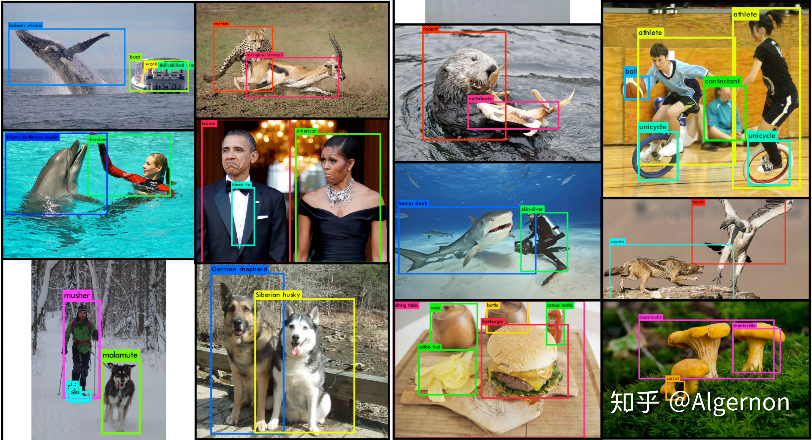


图一 Yolo9000检测效果图

先解释概念：Yolov2和Yolo9000算法内核相同，区别是训练方式不同：Yolov2用coco数据集训练后，可以识别80个种类。而Yolo9000可以使用coco数据集 + ImageNet数据集联合训练，可以识别9000多个种类。图一为Yolo9000的检测效果图，可以看到图片中的人，被分为了leader、American、skin-diver、athlete。

本文首先介绍Yolov2，列举出基于v1所做的改进；之后解读Yolo9000的训练方法。


YOLOv2相对v1版本，在继续保持处理速度的基础上，从预测**更准确（Better）**，**速度更快（Faster）**，**识别对象更多（Stronger）**这三个方面进行了改进。其中识别更多对象也就是扩展到能够检测9000种不同对象，称之为**YOLO9000**。

文章提出了一种新的**训练方法–联合训练算法**，这种算法可以把这两种的数据集混合到一起。使用一种分层的观点对物体进行分类，用巨量的**分类数据集数据来扩充检测数据集**，从而把两种不同的数据集混合起来。

联合训练算法的基本思路就是：同时在检测数据集和分类数据集上训练物体检测器（Object Detectors ），**用检测数据集的数据学习物体的准确位置，用分类数据集的数据来增加分类的类别量、提升健壮性。**

YOLO9000就是使用联合训练算法训练出来的，他拥有9000类的分类信息，这些分类信息学习自ImageNet分类数据集，而物体位置检测则学习自COCO检测数据集


## 2. Yolov2（Better，Faster）

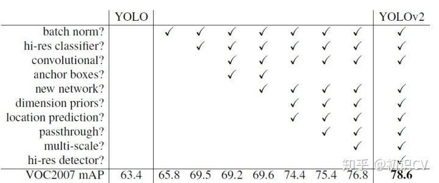

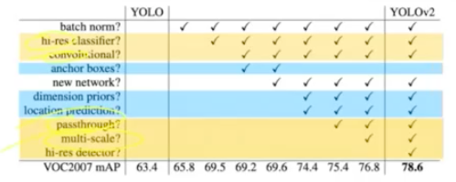

YOLOv2相比YOLOv1的改进策略

**---------------Better---------------**

### 2.1 **Batch Normalization（批量归一化）**

> By adding batch normalization on all of the convolutional layers in YOLO we get more than 2% improvement in mAP.

mAP提升2.4%。

批归一化有助于解决反向传播过程中的梯度消失和梯度爆炸问题，降低对一些超参数（比如学习率、网络参数的大小范围、激活函数的选择）的敏感性，并且每个batch分别进行归一化的时候，起到了一定的正则化效果（YOLO2不再使用dropout），从而能够获得更好的收敛速度和收敛效果。

通常，一次训练会输入一批样本（batch）进入神经网络。批规一化在神经网络的每一层，在网络（线性变换）输出后和激活函数（非线性变换）之前增加一个批归一化层（BN），BN层进行如下变换：①对该批样本的各特征量（对于中间层来说，就是每一个神经元）分别进行归一化处理，分别使每个特征的数据分布变换为均值0，方差1。从而使得每一批训练样本在每一层都有类似的分布。这一变换不需要引入额外的参数。②对上一步的输出再做一次线性变换，假设上一步的输出为Z，则Z1=γZ + β。这里γ、β是可以训练的参数。增加这一变换是因为上一步骤中强制改变了特征数据的分布，可能影响了原有数据的信息表达能力。增加的线性变换使其有机会恢复其原本的信息。


### **2.2 High resolution classifier（高分辨率图像分类器）**

> 分类网络高分辨率预训练

mAP提升了3.7%。

图像分类的训练样本很多，而标注了边框的用于训练对象检测的样本相比而言就比较少了，因为标注边框的人工成本比较高。所以对象检测模型通常都先用图像分类样本训练卷积层，提取图像特征。但这引出的另一个问题是，图像分类样本的分辨率不是很高。所以YOLO v1使用ImageNet的图像分类样本采用 224\*224 作为输入，来训练CNN卷积层。然后在训练对象检测时，检测用的图像样本采用更高分辨率的 448\*448 的图像作为输入。但这样切换对模型性能有一定影响。

**所以YOLO2在采用 224\*224 图像进行分类模型预训练后，再采用 448\*448 的高分辨率样本对分类模型进行微调（10个epoch）**，使网络特征逐渐适应 448\*448 的分辨率。然后再使用 448\*448 的检测样本进行训练，缓解了分辨率突然切换造成的影响。

### **2.3 Convolution with anchor boxes（使用先验框）**

> Anchor Box替换全连接层

召回率大幅提升到88%，同时mAP轻微下降了0.2。

YOLOV1包含有全连接层，从而能直接预测Bounding Boxes的坐标值。 Faster R-CNN的方法只用卷积层与Region Proposal Network来预测Anchor Box的偏移值与置信度，而不是直接预测坐标值。作者发现通过预测偏移量而不是坐标值能够简化问题，让神经网络学习起来更容易。

借鉴Faster RCNN的做法，**YOLO2也尝试采用先验框（anchor）。在每个grid预先设定一组不同大小和宽高比的边框，来覆盖整个图像的不同位置和多种尺度**，这些先验框作为预定义的候选区在神经网络中将检测其中是否存在对象，以及微调边框的位置。

之前YOLO1并没有采用先验框，并且每个grid只预测两个bounding box，整个图像98个。YOLO2如果每个grid采用9个先验框，总共有13\*13\*9=1521个先验框。所以最终YOLO去掉了全连接层，使用Anchor Boxes来预测 Bounding Boxes。作者去掉了网络中一个Pooling层，这让卷积层的输出能有更高的分辨率。收缩网络让其运行在416\*416而不是448\*448。

由于图片中的物体都倾向于出现在图片的中心位置，特别是那种比较大的物体，所以有一个单独位于物体中心的位置用于预测这些物体。YOLO的卷积层采用32这个值来下采样图片，所以通过选择416\*416用作输入尺寸最终能输出一个13\*13的Feature Map。 使用Anchor Box会让精确度稍微下降，但用了它能让YOLO能预测出大于一千个框，同时recall达到88%，mAP达到69.2%。

> 第一篇解读v1时提到，每个格点预测两个矩形框，在计算loss时，只让与ground truth最接近的框产生loss数值，而另一个框不做修正。这样规定之后，作者发现两个框在物体的大小、长宽比、类别上逐渐有了分工。在v2中，神经网络不对预测矩形框的宽高的绝对值进行预测，而是预测与Anchor框的偏差（offset），每个格点指定n个Anchor框。在训练时，最接近ground truth的框产生loss，其余框不产生loss。在引入Anchor Box操作后，mAP由69.5下降至69.2，原因在于，每个格点预测的物体变多之后，召回率大幅上升，准确率有所下降，总体mAP略有下降。
>
> v2中移除了v1最后的两层全连接层，全连接层计算量大，耗时久。文中没有详细描述全连接层的替换方案，这里笔者猜测是利用1*1的卷积层代替（欢迎指正），具体的网络结构原文中没有提及，官方代码也被yolo v3替代了。v2主要是各种trick引入后的效果验证，建议不必纠结于v2的网络结构。

### **2.4 Dimension clusters（聚类提取先验框的尺度信息）**

> Anchor Box的宽高由聚类产生

之前Anchor Box的尺寸是手动选择的，所以尺寸还有优化的余地。 YOLO2尝试统计出更符合样本中对象尺寸的先验框，这样就可以减少网络微调先验框到实际位置的难度。YOLO2的做法是对训练集中标注的边框进行K-mean聚类分析，以寻找尽可能匹配样本的边框尺寸。

如果我们用标准的欧式距离的k-means，尺寸大的框比小框产生更多的错误。因为我们的目的是提高IOU分数，这依赖于Box的大小，所以距离度量的使用：


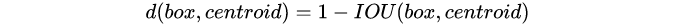


centroid是聚类时被选作中心的边框，box就是其它边框，d就是两者间的“距离”。IOU越大，“距离”越近。YOLO2给出的聚类分析结果如下图所示：

通过分析实验结果（Figure 2），左图：在model复杂性与high recall之间权衡之后，选择聚类分类数K=5。右图：是聚类的中心，大多数是高瘦的Box。

Table1是说明用K-means选择Anchor Boxes时，当Cluster IOU选择值为5时，AVG IOU的值是61，这个值要比不用聚类的方法的60.9要高。选择值为9的时候，AVG IOU更有显著提高。总之就是说明用聚类的方法是有效果的。

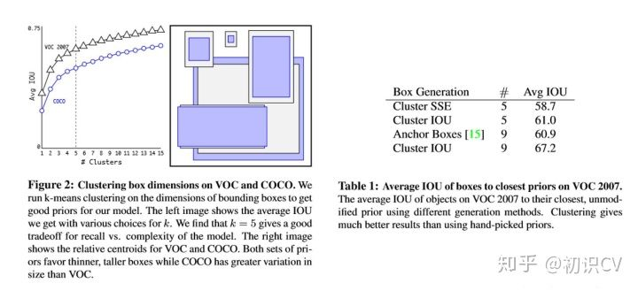

> 这里算是作者的一个创新点。Faster R-CNN中的九个Anchor Box的宽高是事先设定好的比例大小，一共设定三个面积大小的矩形框，每个矩形框有三个宽高比：1:1，2:1，1:2，总共九个框。而在v2中，Anchor Box的宽高不经过人为获得，而是将训练数据集中的矩形框全部拿出来，用kmeans聚类得到先验框的宽和高。例如使用5个Anchor Box，那么kmeans聚类的类别中心个数设置为5。加入了聚类操作之后，引入Anchor Box之后，mAP上升。
>
> 需要强调的是，聚类必须要定义聚类点（矩形框 ![[公式]](https://www.zhihu.com/equation?tex=%28w%2Ch%29)）之间的距离函数，文中使用如下函数：
>
> 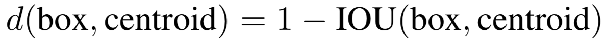
>
> 使用（1-IOU）数值作为两个矩形框的的距离函数，这里的运用也是非常的巧妙。

### 2.5 Direct location prediction（**约束预测边框的位置**）

> 绝对位置预测

借鉴于Faster RCNN的先验框方法，在训练的早期阶段，其位置预测容易不稳定。其位置预测公式为：

 ![[公式]](https://www.zhihu.com/equation?tex=%5C%5C+x%3D%28t_x%E2%88%97w_a%29%2Bx_a+%5C%5C+y%3D%28t_y%E2%88%97h_a%29%2By_a+)


其中， ![[公式]](https://www.zhihu.com/equation?tex=x%2Cy) 是预测边框的中心， ![[公式]](https://www.zhihu.com/equation?tex=x_a%2Cy_a) 是先验框（anchor）的中心点坐标， ![[公式]](https://www.zhihu.com/equation?tex=w_a%2Ch_a) 是先验框（anchor）的宽和高， ![[公式]](https://www.zhihu.com/equation?tex=t_x%2Ct_y) 是要学习的参数。 注意，YOLO论文中写的是 ![[公式]](https://www.zhihu.com/equation?tex=x%3D%28t_x%E2%88%97w_a%29-x_a)，根据Faster RCNN，应该是"+"。


由于 ![[公式]](https://www.zhihu.com/equation?tex=t_x%2Ct_y) 的取值没有任何约束，因此预测边框的中心可能出现在任何位置，训练早期阶段不容易稳定。YOLO调整了预测公式，将预测边框的中心约束在特定gird网格内。

 ![[公式]](https://www.zhihu.com/equation?tex=%5C%5C+b_x%3D%CF%83%28t_x%29%2Bc_x++%5C%5C+b_y%3D%CF%83%28t_y%29%2Bc_y++%5C%5C+b_w%3Dp_we%5E%7Bt_w%7D++%5C%5C+b_h%3Dp_he%5E%7Bt_h%7D++%5C%5C+Pr%28object%29%E2%88%97IOU%28b%2Cobject%29%3D%CF%83%28t_o%29+)

其中， ![[公式]](https://www.zhihu.com/equation?tex=b_x%2Cb_y%2Cb_w%2Cb_h) 是预测边框的中心和宽高。 ![[公式]](https://www.zhihu.com/equation?tex=Pr%28object%29%E2%88%97IOU%28b%2Cobject%29) 是预测边框的置信度，YOLO1是直接预测置信度的值，这里对预测参数 ![[公式]](https://www.zhihu.com/equation?tex=t_o) 进行σ变换后作为置信度的值。 ![[公式]](https://www.zhihu.com/equation?tex=c_x%2Cc_y)是当前网格左上角到图像左上角的距离，要先将网格大小归一化，即令一个网格的宽=1，高=1。 ![[公式]](https://www.zhihu.com/equation?tex=p_w%2Cp_h) 是先验框的宽和高。 σ是sigmoid函数。 ![[公式]](https://www.zhihu.com/equation?tex=t_x%2Ct_y%2Ct_w%2Ct_h%2Ct_o) 是要学习的参数，分别用于预测边框的中心和宽高，以及置信度。

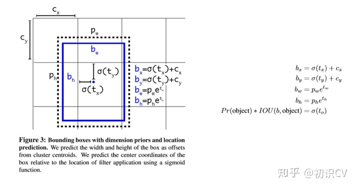

因为使用了限制让数值变得参数化，也让网络更容易学习、更稳定。

> Yolo中的位置预测方法很清晰，就是相对于左上角的格点坐标预测偏移量。这里的Direct具体含义，应该是和其他算法框架对比后得到的。比如其他流行的位置预测公式如下（原文中是减号，应该是加号，无伤大雅）：
>
> 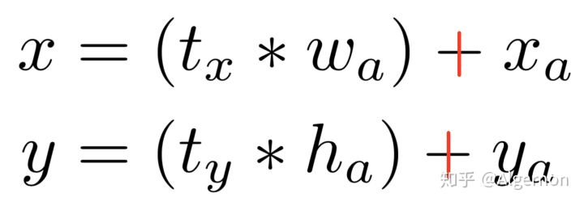
>
> 神经网络预测 ![[公式]](https://www.zhihu.com/equation?tex=t_x+%2Ct_y) ，而![[公式]](https://www.zhihu.com/equation?tex=t_x+%2Ct_y)又需要与先验框的宽高相乘才能得到相较于 ![[公式]](https://www.zhihu.com/equation?tex=x_a%2C+y_a) 的位置偏移值，在v2中，位置预测公式如下：
>
> 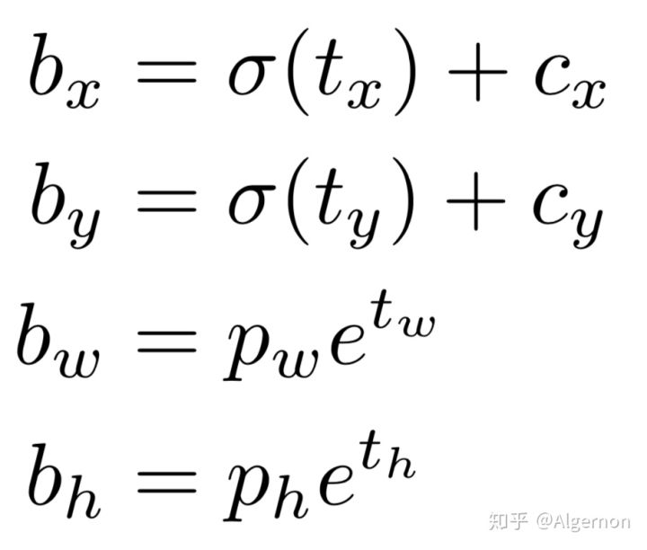
>
> Yolo的天然优势，就是格点的坐标可以作为参照点。此时![[公式]](https://www.zhihu.com/equation?tex=t_x+%2Ct_y)通过一个激活函数，直接产生偏移位置数值，与矩形框的宽高独立开，变得更加直接。

### **2.6 Fine-Grained Features（passthrough层检测细粒度特征）**

> 细粒度特征

passthrough层检测细粒度特征使mAP提升1。

对象检测面临的一个问题是图像中对象会有大有小，输入图像经过多层网络提取特征，最后输出的特征图中（比如YOLO2中输入416\*416经过卷积网络下采样最后输出是13\*13），较小的对象可能特征已经不明显甚至被忽略掉了。为了更好的检测出一些比较小的对象，最后输出的特征图需要保留一些更细节的信息。

YOLO2引入一种称为passthrough层的方法在特征图中保留一些细节信息。具体来说，就是在最后一个pooling之前，特征图的大小是26\*26\*512，将其1拆4，直接传递（passthrough）到pooling后（并且又经过一组卷积）的特征图，两者叠加到一起作为输出的特征图。

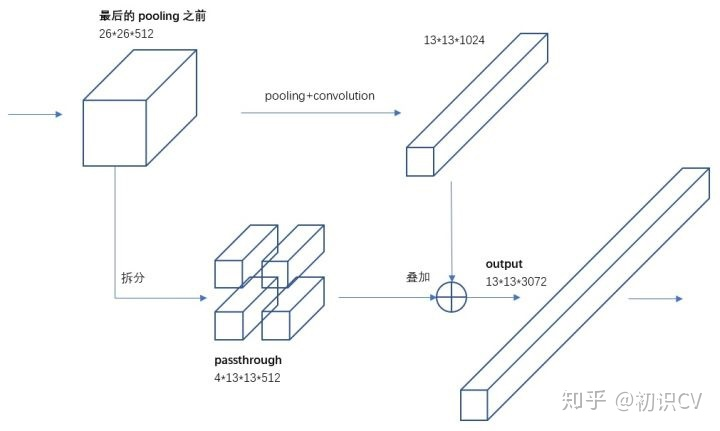


具体怎样1拆4，下面借用一副图看的很清楚。图中示例的是1个4\*4拆成4个2\*2。因为深度不变，所以没有画出来。

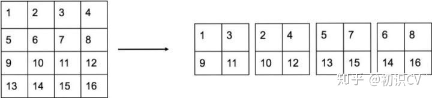


另外，根据YOLO2的代码，特征图先用1\*1卷积从 26\*26\*512 降维到 26\*26\*64，再做1拆4并passthrough。下面图6有更详细的网络输入输出结构。

> 在26*26的特征图，经过卷积层等，变为13*13的特征图后，作者认为损失了很多细粒度的特征，导致小尺寸物体的识别效果不佳，所以在此加入了passthrough层。
>
> 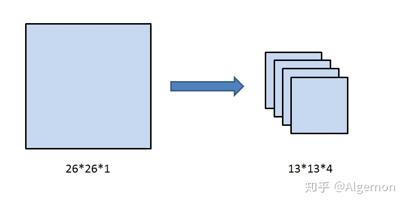
>
> 图二 passthrough层
>
> 如上图所示，passthrough层就是将26*26*1的特征图，变成13*13*4的特征图，在这一次操作中不损失细粒度特征。有人说passthrough层分成四份的具体细节，并不是两刀切成4块，而是在每个2*2的小区域上都选择左上角块。其实这里怎么切都一样，在之后1*1卷积层中，不过是加法交换律的事。


### 2.7 **Multi-ScaleTraining（多尺度图像训练）**

作者希望YOLO v2能健壮的运行于不同尺寸的图片之上，所以把这一想法用于训练model中。

区别于之前的补全图片的尺寸的方法，YOLO v2每迭代几次都会改变网络参数。每10个Batch，网络会随机地选择一个新的图片尺寸，由于使用了下采样参数是32，所以不同的尺寸大小也选择为32的倍数{320，352…..608}，最小320\*320，最大608\*608，网络会自动改变尺寸，并继续训练的过程。

这一政策让网络在不同的输入尺寸上都能达到一个很好的预测效果，同一网络能在不同分辨率上进行检测。当输入图片尺寸比较小的时候跑的比较快，输入图片尺寸比较大的时候精度高，所以你可以在YOLO v2的速度和精度上进行权衡。

Figure4，Table 3：在voc2007上的速度与精度

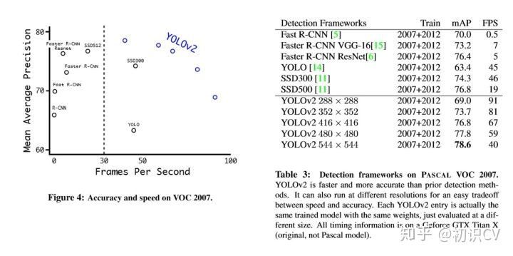

> 很关键的一点是，Yolo v2中只有卷积层与池化层，所以对于网络的输入大小，并没有限制，整个网络的降采样倍数为32，只要输入的特征图尺寸为32的倍数即可，如果网络中有全连接层，就不是这样了。所以Yolo v2可以使用不同尺寸的输入图片训练。
>
> 作者使用的训练方法是，在每10个batch之后，就将图片resize成{320, 352, ..., 608}中的一种。不同的输入，最后产生的格点数不同，比如输入图片是320*320，那么输出格点是10*10，如果每个格点的先验框个数设置为5，那么总共输出500个预测结果；如果输入图片大小是608*608，输出格点就是19*19，共1805个预测结果。
>
> 在引入了多尺寸训练方法后，迫使卷积核学习不同比例大小尺寸的特征。当输入设置为544*544甚至更大，Yolo v2的mAP已经超过了其他的物体检测算法。

### 2.8 **hi-res detector（高分辨率图像的对象检测）**

图1表格中最后一行有个hi-res detector，使mAP提高了1.8。因为YOLO2调整网络结构后能够支持多种尺寸的输入图像。通常是使用416\*416的输入图像，如果用较高分辨率的输入图像，比如544\*544，则mAP可以达到78.6，有1.8的提升。


### 2.9 其他

**----------------Faster--------------**   

Darknet-19 

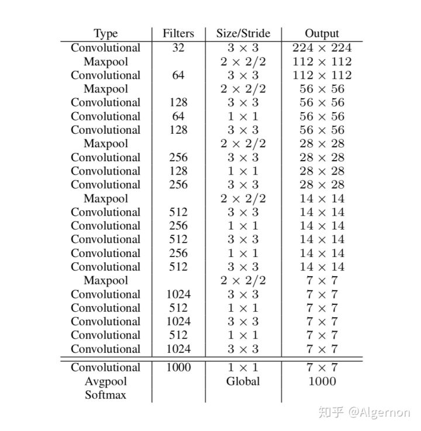

图三 Darknet-19网络结构

v2中作者提出了新的分类网络架构——Darknet-19，该架构的网络参数较VGG-16更少，在ImageNet上，仍然可以达到top-1 72.9%以及top-5 91.2%的精度。


- Yolo v2精度与性能

全部的trick效果如下，除了直接引入人为指定宽高的Anchor Boxes，其他技巧都带来了一定的增益。

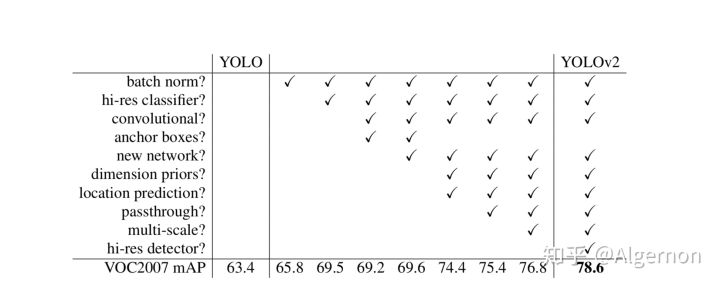

图四 Yolo v2提升效果

附一下Yolo v2与其他算法的对比图：

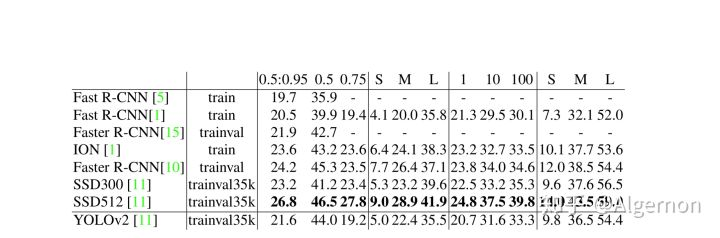

图五 Yolo v2精度对比(on COCO test-dev2015)

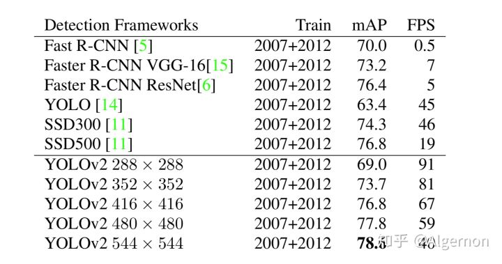

图六 Yolo v2精度与速率对比（on PASCAL VOC）

Yolo v2的精度可以比肩业界前沿算法，同时仍然保持着大幅度速率领先。


## 3. Yolo9000: Stronger

#### Joint classification and detection

如果说整个Yolo v2的Better部分，都没有什么大的创新点，这里的分类与检测联合训练，就是Yolo v2的一大亮点，因为这一个技巧，Yolo v2才成为了Yolo9000。

如之前所说，物体分类，是对整张图片打标签，比如这张图片中含有人，另一张图片中的物体为狗；而物体检测不仅对物体的类别进行预测，同时需要框出物体在图片中的位置。物体分类的数据集，最著名的ImageNet，物体类别有上万个，而物体检测数据集，例如coco，只有80个类别，因为物体检测、分割的打标签成本比物体分类打标签成本要高很多。所以在这里，作者提出了分类、检测训练集联合训练的方案。

联合训练方法思路简单清晰，Yolo v2中物体矩形框生成，不依赖于物理类别预测，二者同时独立进行。当输入是检测数据集时，标注信息有类别、有位置，那么对整个loss函数计算loss，进行反向传播；当输入图片只包含分类信息时，loss函数只计算分类loss，其余部分loss为零。当然，一般的训练策略为，先在检测数据集上训练一定的epoch，待预测框的loss基本稳定后，再联合分类数据集、检测数据集进行交替训练，同时为了分类、检测数据量平衡，作者对coco数据集进行了上采样，使得coco数据总数和ImageNet大致相同。

联合分类与检测数据集，这里不同于将网络的backbone在ImageNet上进行预训练，预训练只能提高卷积核的鲁棒性，而分类检测数据集联合，可以扩充识别物体种类。例如，在检测物体数据集中，有类别人，当网络有了一定的找出人的位置的能力后，可以通过分类数据集，添加细分类别：男人、女人、小孩、成人、运动员等等。这里会遇到一个问题，类别之间并不一定是互斥关系，可能是包含（例如人与男人）、相交（运动员与男人），那么在网络中，该怎么对类别进行预测和训练呢？

#### Dataset combination with WordTree

在文中，作者使用WordTree，解决了ImageNet与coco之间的类别问题。

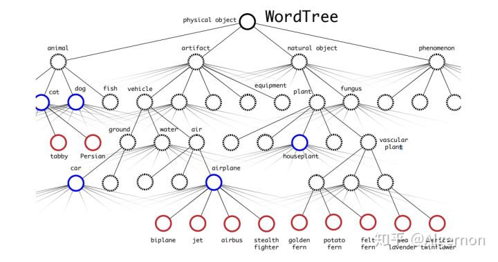

图七 WordTree for COCO and ImageNet

树结构表示物体之间的从属关系非常合适，第一个大类，物体，物体之下有动物、人工制品、自然物体等，动物中又有更具体的分类。此时，在类别中，不对所有的类别进行softmax操作，而对同一层级的类别进行softmax：

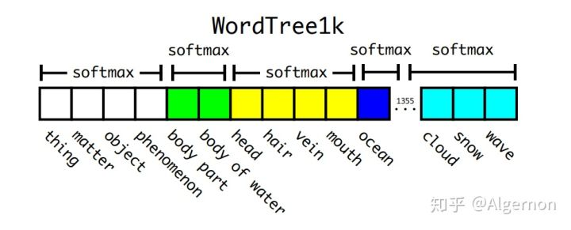

图八 类别softmax

如图中所示，同一颜色的位置，进行softmax操作，使得同一颜色中只有一个类别预测分值最大。在预测时，从树的根节点开始向下检索，每次选取预测分值最高的子节点，直到所有选择的节点预测分值连乘后小于某一阈值时停止。在训练时，如果标签为人，那么只对人这个节点以及其所有的父节点进行loss计算，而其子节点，男人、女人、小孩等，不进行loss计算。

最后的结果是，Yolo v2可以识别超过9000个物体，作者美其名曰Yolo9000。当然原文中也提到，只有当父节点在检测集中出现过，子节点的预测才会有效。如果子节点是裤子、T恤、裙子等，而父节点衣服在检测集中没有出现过，那么整条预测类别支路几乎都是检测失效的状态。这也合理，给神经网络看的都是狗，让它去预测猫，目前神经网络还没有这么智能。


#### Hierarchical classification（分层分类）

作者提出了一种在分类数据集和检测数据集上联合训练的机制。使用检测数据集的图片去学习检测相关的信息，例如bounding box 坐标预测，是否包含物体以及属于各个物体的概率。使用仅有类别标签的分类数据集图片去扩展可以检测的种类。

作者通过ImageNet训练分类、COCO和VOC数据集来训练检测，这是一个很有价值的思路，可以让我们达到比较优的效果。 通过将两个数据集混合训练，**如果遇到来自分类集的图片则只计算分类的Loss，遇到来自检测集的图片则计算完整的Loss。**

但是ImageNet对应分类有9000种，而COCO则只提供80种目标检测，作者使用multi-label模型，即假定一张图片可以有多个label，并且不要求label间独立。通过作者Paper里的图来说明，由于ImageNet的类别是从WordNet选取的，作者采用以下策略重建了一个树形结构（称为分层树）：

1. 遍历Imagenet的label，然后在WordNet中寻找该label到根节点(指向一个物理对象)的路径；
2. 如果路径直有一条，那么就将该路径直接加入到分层树结构中；
3. 否则，从剩余的路径中选择一条最短路径，加入到分层树。

这个分层树我们称之为 WordTree，作用就在于将两种数据集按照层级进行结合。

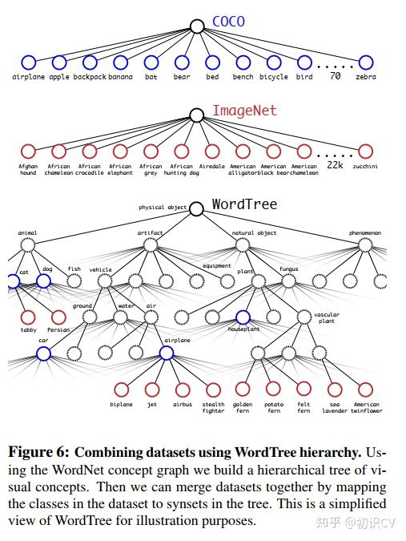

分类时的概率计算借用了决策树思想，**某个节点的概率值等于该节点到根节点的所有条件概率之积**。最终结果是一颗 WordTree （视觉名词组成的层次结构模型）。用WordTree执行分类时，预测每个节点的条件概率。如果想求得特定节点的绝对概率，只需要沿着路径做连续乘积。例如，如果想知道一张图片是不是“Norfolk terrier ”需要计算：

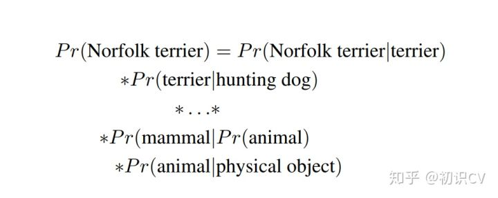

另外，为了验证这种方法作者在WordTree（用1000类别的ImageNet创建）上训练了Darknet-19模型。为了创建WordTree1k，作者添加了很多中间节点，把标签由1000扩展到1369。训练过程中ground truth标签要顺着向根节点的路径传播。例如，如果一张图片被标记为“Norfolk terrier”，它也被标记为“dog” 和“mammal”等。为了计算条件概率，模型预测了一个包含1369个元素的向量，而且基于所有“同义词集”计算softmax，其中“同义词集”是同一概念的下位词。

softmax操作也同时应该采用分组操作，下图上半部分为ImageNet对应的原生Softmax，下半部分对应基于WordTree的Softmax：

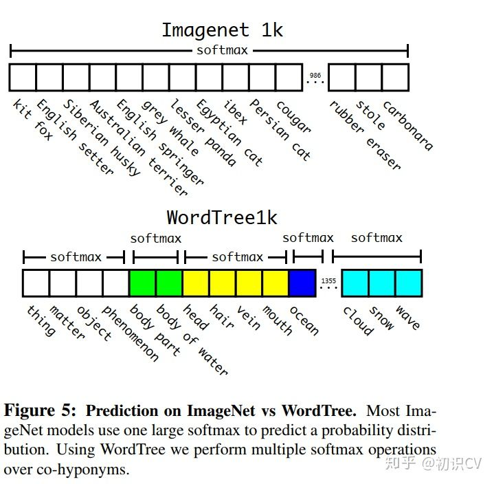

通过上述方案构造WordTree，得到对应9418个分类，通过重采样保证Imagenet和COCO的样本数据比例为4:1。

## 4.  Yolov2的网络结构

相比较于YOLO v1，作者在之前模型上，先修修补补了一番，提出了YOLO v2模型。并基于imagenet的分类数据集和coco的对象检测数据集，提出了wordnet模型，并成功的提出了YOLO9000模型。这里暂时只讲YOLO v2.
作者说yolo v1相比较其他基于区域的模型比如faster r-cnn还是有些不足的，比如更多定位错误，更低召回率，所以第二个版本开始主要解决这两个问题。

### 4.1 作者对yolo v1的补丁

1 - 在所有卷积层上用BN，并扔掉dropout

2 - yolo 的训练过程（两个版本都是）为：分类模型的预训练和检测模型的微调。作者觉得yolo v1的预训练不够好，所以这里直接拿imagenet的分辨率为448∗448的图片微调10个epoch，然后在将前面的卷积层留待检测模型用。

3 - 使用anchor box（而这几个anchor box是基于训练集数据的标签中𝑤,ℎ聚类出来的），加快模型收敛

4 - 去掉全连接层，扔掉最后一层池化层，并且将网络的输入端resize为416∗416，从而输出的是一个13∗13∗𝑐ℎ𝑎𝑛𝑛𝑒𝑙的卷积层

5 - 在预测𝑥,𝑦,𝑤,ℎ的时候是基于anchor box,且与RPN略有不同的方法去预测。

6 - 加了一个passthrough层

### 4.2 基础网络

YOLOv2用的是Darknet-19网络用于特征提取的。作者在论文中这样说到：**其实很多检测框架都是依赖于VGG-16网络来提取特征的**，VGG-16是一个强大的，准确率高的分类网络，但是它很复杂。看没看到，作者用了一个“但是”就把这个网络否定了，然后自己牛逼的提出了一个比它优秀的网络。作者继续补刀：仅一张分辨率为224\*224的图片在单次传递的时候,VGG-16的卷积层就需要30.69 billion次浮点运算操作。看一张网络运算浮点操作的图就知道了，反正你知道VGG-16运算量很大就行了。


​          


我解释一下，目标检测网络在训练之前都要用单独的网络来与提取特征，进行预训练，然后特征提取之后再在后面加上自己的创造的目标检测网络（一系列卷积层等），完成目标检测。之前的YOLOv1用的特征提取网络是GoogLeNed的改进版本，图上可以看到，计算量是8.52G-ops,top-5准确率是88.0%，VGG-16网络top-5准确率是90.0%（30.69G-ops），注意啦！Darknet-19网络计算量是**5.58G-ops,top-5准确率高达91.2%。看一下Darknet-19的结构：**

为了结合Googlenet和VGG的优势，作者提出了图1这样一种网络结构，将其作为yolo分类模型的基础模型。

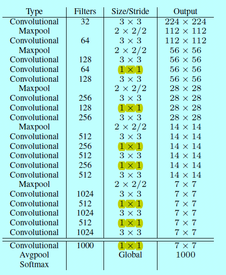

图1.darknet-19

上图就是darknet-19，作者先在imagenet上以224∗224先初始化训练，然后用448∗448的分辨率图片跑10个epoch。跑完之后，丢弃最后的卷积层和全局池化层，换上3个3∗3∗1024的卷积层，然后跟一层1*1的卷积层，最后输出13∗13∗125,如下图所示

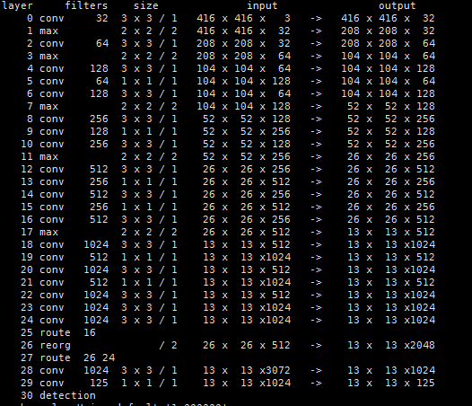

图2.yolov2网络结构图

再详细看一下在Darknet-19的基础上的YOLOv2网络结构：


​       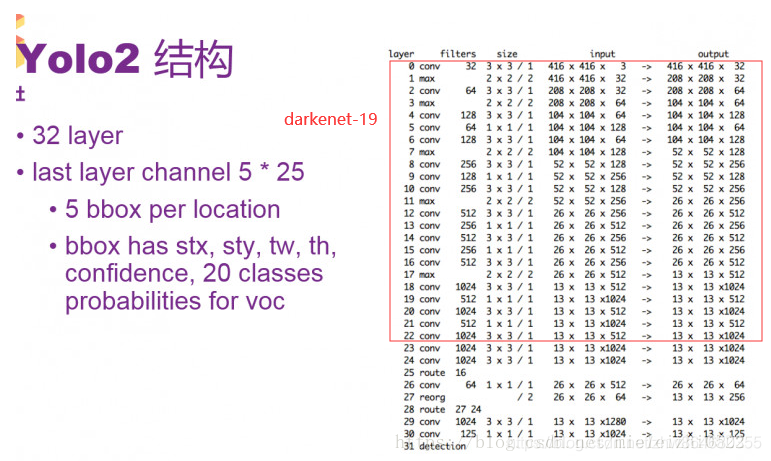

​                       

YOLO2网络中第23层上面是Darknet-19网络，后面是添加的检测网络。

YOLO 2采用神经网络结构，有32层。结构比较常规，包含一些卷积和最大池化，其中有一些1\*1卷积，采用GoogLeNet一些**微观**的结构。其中要留意的是，第25层和28层有一个route。例如第28层的route是27和24，即把27层和24层合并到一起输出到下一层，route层的作用是进行层的合并。30层输出的大小是13\*13，是指把图片通过卷积或池化，最后缩小到一个13\*13大小的格。每一个格子的output参数是125。所以最后输出的参数一共是13\*13\*125

上图是通过官网darknet命令生成的网络结构，从中可以发现有几点疑惑，比如论文中的passthrough到底是什么操作？

图2中layer0-layer22层就是darknet-19的前面部分，，具体对照如下图：

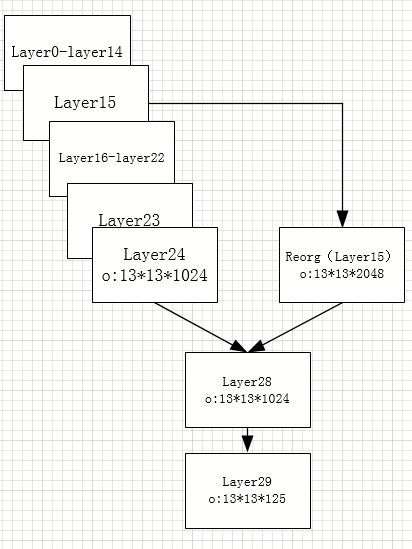

图3.darknet19到yolov2结构的示意图

### 4.3 训练

yolov2模型的训练基本就分下面三步：

i）首先拿darknet19在imagenet上以分辨率224∗224跑160回，然后以分辨率448∗448跑10回;

ii）然后如上面所示，将darknet19网络变成yolov2网络结构，并resize输入为416∗416

iii）对增加的层随机初始化，并接着在对象检测数据集上训练160回，且在【60，90】的时候降低学习率

而第三步中，因为v2的目标函数和增加的anchor box，而与v1在概念上有所不同。

### 4.4  v2中较难理解的补丁

如图2所示，最后会输出一个13∗13∗125的张量,其中的13∗13如yolo v1一样，是表示网格划分的意思，后面的125就是当前网格的操作所在。之前yolov1时，作者拿了B=2，而这里B=5，且这里的5个预测候选框是事先得到的（下面待续），也就是给定了5个框的𝑤,ℎ，预测得到的是5\*(4+1+20)，分别为𝑥,𝑦,𝑤,ℎ;𝑐𝑜𝑛𝑓𝑖𝑑𝑒𝑛𝑐𝑒;𝑐𝑙𝑎𝑠𝑠。

没错，在yolo1的时候是出现2个候选框，然后只有一条20维度表示类别，这里是每个anchor box都会有预测类别，所以相对的目标函数会略有改动，作者说了在v2还是预测𝐼𝑂𝑈𝑡𝑟𝑢𝑡ℎ𝑝𝑟𝑒𝑑和基于当前有对象基础上预测类别𝑃(𝑐𝑙𝑎𝑠𝑠|𝑜𝑏𝑗𝑒𝑐𝑡)。

#### 4.4.1 anchor box的生成 & 坐标预测

**关于YOLOv2 边框预测计算：**  

上面说了最后输出参数是13\*13\*125,  是因为一共有13\*13个格子，每个格子预测出5个bounding box，每个bounding box预测25个数，其中20个是class的probability，其余5个参数中有四个表示stx、sty、tw、th，这4个来识别边框的位置和大小，还有1个数是confidence，表示边框预测里有真正的对象的概率，所以一共是13\*13\*125个数。**接下来看一下四个参数stx、sty、tw、th，是如何预测框的位置的。**

这里先介绍一个**anchor boxes** 概念，这个悲伤的故事来源于Faster RCNN,因为faster RCNN为了不让算法**漫无目的**的去猜测那些目标的边框大小，于是就自己预先在每个位置上产生一定长宽比例的方框，以减少搜索量，这个方框就叫做anchor boxes，anchor的意思是“锚”，“固定”的意思，大多数人是把这个解释为“锚”，不过我觉得解释成“固定”比较好，其实也有锚的意思，因为这个是相对于中心点来说的，就是在中心点的周围产生几个固定比例的边框，所以这个“中心点”就把这几个框给锚住了，他们共用一个中心点，（当然在YOLOv2中这个中心点是一个格子的大小，所以会在格子里微小移动）。

  faster rcnn在每个位置上产生了9个不同长宽比例的anchor boxes ，这几种比例以及比例的种数作者认为不合理，是手动选出来的，虽然网络最终可以学出来，但如果我们可以给出更好的anchor，那么网络肯定更加容易训练而且效果更好。

于是作者灵光一闪，通过K-Means聚类的方式在训练集中聚出了好的anchor模板。经过分析，确定了anchor boxes的个数以及比例。如下图

​          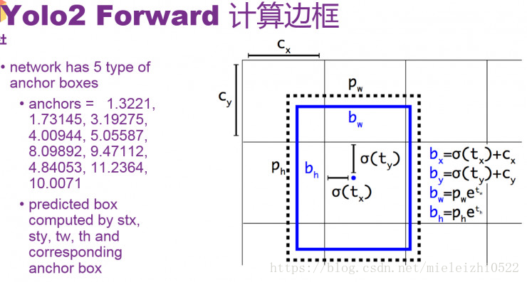

 

上图的左边可以看出，有5中类型的长宽比例。后面预测出stx、sty、tw、th，四个参数，再根据上图右边的计算就可以计算出预测出的box大小了，注意！上图右边里面的σ(tx)可以理解为stx，σ(ty)可以理解为sty。**每一个输出的bbox是针对于一个特定的anchor，anchor其实是bbox的width及height的一个参考**。**pw和ph是某个**anchor box的宽和高，一个格子的Cx和Cy单位都是1，**σ(tx)**，**σ(ty)**是相对于某个格子左上角的偏移量。

 这个地方不是很好理解，我举个例子，比如说我预测出了stx、sty、tw、th四个参数分别是0.2，0.1，0.2，0.32，row：1，col:1假如anchor比例取：w:3.19275，h:4.00944，这其中row和col就是锚点相对于整个网格的偏移的格子数，在这个偏移量的基础上计算格子中心位置,

 计算出:

​                                    bx=0.2+1=1.2

​                                    by=0.1+1=1.1

​                                    bw=3.19275*exp(0.2)=3.89963

​                                    bh=4.00944*exp(0.32)=5.52151

然后分别将这些归一化（同除以13），得:bx=0.09,by=0.08,bw=0.30,bh=0.42.具体是否要输出当前的边框，它的概率，还有生成的物体的类别，这个取决于后面的probability和confidence。


​            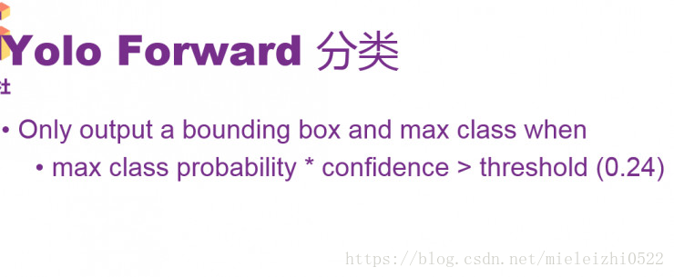

 Confidence表示有没有物体，假设有物体之后，probability表示物体的概率。

通过将confidence和最大可能输出的类的probability相乘之后，要是得出的结果大于门限0.24，就会输出当前计算出的bbox的大小和位置，同时会输出是哪一个类，probability大小是多少。一共会生成13\*13\*5个bbox，然后根据probability，通过filter，产生出最后预测的物体和其边框。

​                   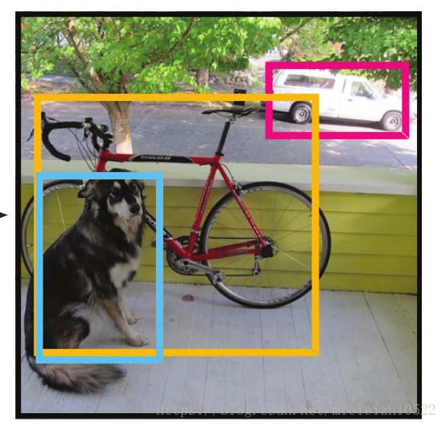

​         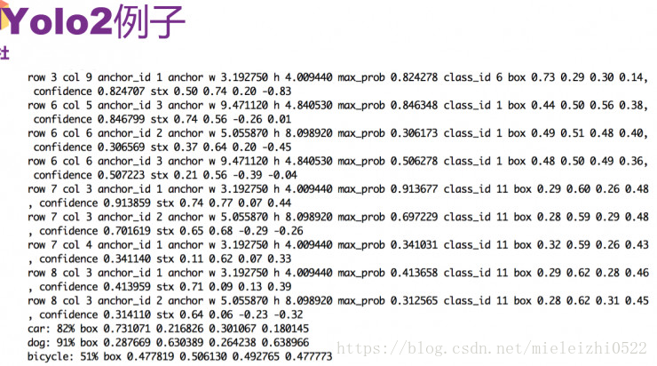

举一个例子，就是最前面那个有狗，有轿车，有自行车的图像，比较图中最后的三行就可以看出来，里面有轿车，狗和自行车，也能看到probability和bbox分别是什么，它们分别表示概率、大小和位置。具体来讲，从第一行，可以看出轿车的class_id为6，通过row和col可以看出大概的位置，还给出了anchor_id。第二行可以看到轿车的confidence和stx。**你可以按照上面的计算公式计算一下是否正确（后面输出的时候会有一点点小的resize）。**

其实这些通过stx、sty、tw、th计算box的位置是检测的时候才计算的，训练的时候是用stx、sty、tw、th进行损失计算的。

> 如论文中所说，相对其他rpn网络，yolo v2的事先准备的几个预测候选框（也叫做anchor box）大小是基于训练集算出来的。如[作者代码](https://github.com/pjreddie/darknet/blob/master/cfg/yolo-voc.2.0.cfg)
> 中：
>
> ```
> [region]
> anchors = 1.08,1.19,  3.42,4.41,  6.63,11.38,  9.42,5.11,  16.62,10.52
> bias_match=1
> classes=20
> coords=4
> num=5
> ```
>
> 上述代码中anchors保存的就是各自的width和height，也就是论文中的符号𝑝𝑤,𝑝ℎ。
>
> 原理就是基于所有训练集的标签中，先计算得出所有的width和对应的height，将其作为样本，采用kmean的方法，只不过距离函数换成了𝑑(𝑏𝑜𝑥,𝑐𝑒𝑛𝑡𝑒𝑟)=1−𝐼𝑂𝑈(𝑏𝑜𝑥,𝑐𝑒𝑛𝑡𝑒𝑟)
>
> 这里需要5个anchor，那么就会得到5个不同样本中心，记得乘以（32/416）；假设锚点值为x，则$\frac{𝑥}{𝑐𝑒𝑛𝑡𝑒𝑟𝑖𝑑𝑠}=\frac{32}{416}$
>
> 如5个样本中心：
>
> ```
> [[ 103.84071465   29.09785553]
> [  40.14028782   21.66632026]
> [ 224.79420059  102.18148749]
> [  61.79184575   39.21399017]
> [ 126.37797981   60.03186796]]
> ```
>
> 对应的锚点：
>
> ```
> 7.98774728074, 2.23829657922,      3.08771444772, 1.66664002,     17.2918615841, 7.86011442226,     4.75321890422, 3.01646078194,     9.72138306269, 4.61783599681
> ```


#### 4.4.3  passthrough操作

通过github找到star最多的[yolo 2-pytorch](https://github.com/longcw/yolo2-pytorch)，研读了部分代码，找到如下部分：

```darknet.py
#darknet.py
        self.reorg = ReorgLayer(stride=2)   # stride*stride times the channels of conv1s
#reorg_layer.py
    def forward(self, x): 
        stride = self.stride

        bsize, c, h, w = x.size()
        out_w, out_h, out_c = int(w / stride), int(h / stride), c * (stride * stride)
        out = torch.FloatTensor(bsize, out_c, out_h, out_w)

        if x.is_cuda:
            out = out.cuda()
            reorg_layer.reorg_cuda(x, out_w, out_h, out_c, bsize, stride, 0, out)
        else:
            reorg_layer.reorg_cpu(x, out_w, out_h, out_c, bsize, stride, 0, out)

        return out 
//reorg_cpu.c
int reorg_cpu(THFloatTensor *x_tensor, int w, int h, int c, int batch, int stride, int forward, THFloatTensor *out_tensor)
{
    // Grab the tensor
    float * x = THFloatTensor_data(x_tensor);
    float * out = THFloatTensor_data(out_tensor);

    // https://github.com/pjreddie/darknet/blob/master/src/blas.c
    int b,i,j,k;
    int out_c = c/(stride*stride);

    for(b = 0; b < batch; ++b){
        //batch_size
        for(k = 0; k < c; ++k){
           //channel
            for(j = 0; j < h; ++j){
                //height
                for(i = 0; i < w; ++i){
                    //width
                    int in_index  = i + w*(j + h*(k + c*b));
                    int c2 = k % out_c;
                    int offset = k / out_c;
                    int w2 = i*stride + offset % stride;
                    int h2 = j*stride + offset / stride;
                    int out_index = w2 + w*stride*(h2 + h*stride*(c2 + out_c*b));
                    if(forward) out[out_index] = x[in_index];
                    else out[in_index] = x[out_index];
                }
            }
        }
    }

    return 1;
}
```

从上述c代码可以看出，这里ReorgLayer层就是将26∗26∗51226∗26∗512的张量中26∗2626∗26切割成4个13∗1313∗13然后连接起来，使得原来的512通道变成了2048。

#### 4.4.5 目标函数计算

**关于损失函数：**

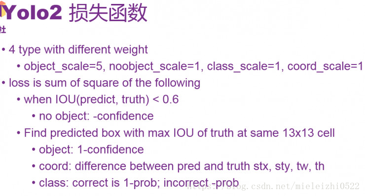


前面讲的是forward的过程，即给了一个图像和神经网络，怎么得到识别的物体概率和位置。那么具体的训练过程是如何的呢，怎么去进行训练？论文了中给了一个损失函数。要是给予一个合适的损失函数，给一定的数据去训练，那么神经网络就会得到好的表现。

进行训练的一共有四类loss，他们weight不同，分别是object、noobject、class、coord。总体loss是四个部分的平方和。

同样通过github上现有的最多stars的那份代码，找到对应的损失计算部分

```darknet.py
#darknet.py
    def loss(self):
        #可以看出，损失值也是基于预测框bbox，预测的iou，分类三个不同的误差和
        return self.bbox_loss + self.iou_loss + self.cls_loss

    def forward(self, im_data, gt_boxes=None, gt_classes=None, dontcare=None):
        conv1s = self.conv1s(im_data)
        conv2 = self.conv2(conv1s)
        conv3 = self.conv3(conv2)
        conv1s_reorg = self.reorg(conv1s)
        cat_1_3 = torch.cat([conv1s_reorg, conv3], 1)
        conv4 = self.conv4(cat_1_3)
        conv5 = self.conv5(conv4)   # batch_size, out_channels, h, w
        ……
        ……
        # tx, ty, tw, th, to -> sig(tx), sig(ty), exp(tw), exp(th), sig(to)
        '''预测tx ty'''
        xy_pred = F.sigmoid(conv5_reshaped[:, :, :, 0:2])
        '''预测tw th '''
        wh_pred = torch.exp(conv5_reshaped[:, :, :, 2:4])
        bbox_pred = torch.cat([xy_pred, wh_pred], 3)
        '''预测置信度to '''
        iou_pred = F.sigmoid(conv5_reshaped[:, :, :, 4:5])
        '''预测分类class  '''
        score_pred = conv5_reshaped[:, :, :, 5:].contiguous()
        prob_pred = F.softmax(score_pred.view(-1, score_pred.size()[-1])).view_as(score_pred)

        # for training
        if self.training:
            bbox_pred_np = bbox_pred.data.cpu().numpy()
            iou_pred_np = iou_pred.data.cpu().numpy()
            _boxes, _ious, _classes, _box_mask, _iou_mask, _class_mask = self._build_target(
                                         bbox_pred_np, gt_boxes, gt_classes, dontcare, iou_pred_np)
            _boxes = net_utils.np_to_variable(_boxes)
            _ious = net_utils.np_to_variable(_ious)
            _classes = net_utils.np_to_variable(_classes)
            box_mask = net_utils.np_to_variable(_box_mask, dtype=torch.FloatTensor)
            iou_mask = net_utils.np_to_variable(_iou_mask, dtype=torch.FloatTensor)
            class_mask = net_utils.np_to_variable(_class_mask, dtype=torch.FloatTensor)

            num_boxes = sum((len(boxes) for boxes in gt_boxes))

            # _boxes[:, :, :, 2:4] = torch.log(_boxes[:, :, :, 2:4])
            box_mask = box_mask.expand_as(_boxes)
            #计算预测的平均bbox损失值
            self.bbox_loss = nn.MSELoss(size_average=False)(bbox_pred * box_mask, _boxes * box_mask) / num_boxes
           #计算预测的平均iou损失值
            self.iou_loss = nn.MSELoss(size_average=False)(iou_pred * iou_mask, _ious * iou_mask) / num_boxes
           #计算预测的平均分类损失值
            class_mask = class_mask.expand_as(prob_pred)
            self.cls_loss = nn.MSELoss(size_average=False)(prob_pred * class_mask, _classes * class_mask) / num_boxes

        return bbox_pred, iou_pred, prob_pred
```

可以从上述代码窥见一斑，yolo v2的目标函数和yolo v1在概念及结构上相差无几。


​            

​                       Confidence表示有没有物体，假设有物体之后，probability表示物体的概率。

​     通过将confidence和最大可能输出的类的probability相乘之后，要是得出的结果大于门限0.24，就会输出当前计算出的bbox的大小和位置，同时会输出是哪一个类，probability大小是多少。一共会生成13*13*5个bbox，然后根据probability，通过filter，产生出最后预测的物体和其边框。

​                   

​         

​     举一个例子，就是最前面那个有狗，有轿车，有自行车的图像，比较图中最后的三行就可以看出来，里面有轿车，狗和自行车，也能看到probability和bbox分别是什么，它们分别表示概率、大小和位置。具体来讲，从第一行，可以看出轿车的class_id为6，通过row和col可以看出大概的位置，还给出了anchor_id。第二行可以看到轿车的confidence和stx。**你可以按照上面的计算公式计算一下是否正确（后面输出的时候会有一点点小的resize）。**

其实这些通过stx、sty、tw、th计算box的位置是检测的时候才计算的，训练的时候是用stx、sty、tw、th进行损失计算的。
