# Yolov3

⌚️: 2020年8月9日

📚参考

- Yolov3论文名：《Yolov3: An Incremental Improvement》
- [【论文解读】Yolo三部曲解读——Yolov3](https://zhuanlan.zhihu.com/p/76802514)
- https://github.com/ultralytics/yolov3
- https://github.com/eriklindernoren/PyTorch-YOLOv3
- https://mp.weixin.qq.com/s/uzj7X89zKHBk6PI46xrRiw

---

Yolov3是2018年发明提出的，这成为了目标检测one-stage中非常经典的算法，包含Darknet-53网络结构、anchor锚框、FPN等非常优秀的结构。

## 1. 网络结构

### 1.1 主干网络

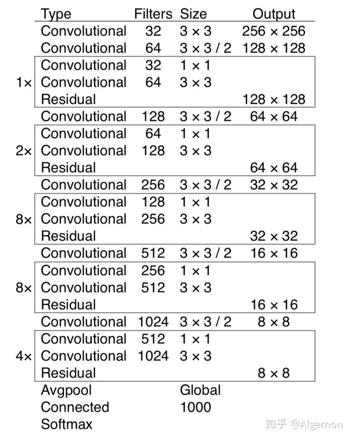

图一 Darknet-53

backbone部分由Yolov2时期的Darknet-19进化至Darknet-53，加深了网络层数，引入了Resnet中的跨层加和操作。原文列举了Darknet-53与其他网络的对比：

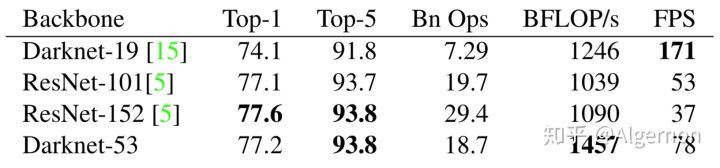

图二 Darknet精度性能对比

Darknet-53处理速度每秒78张图，比Darknet-19慢不少，但是比同精度的ResNet快很多。Yolov3依然保持了高性能。

（这里解释一下Top1和Top5：模型在ImageNet数据集上进行推理，按照置信度排序总共生成5个标签。按照第一个标签预测计算正确率，即为Top1正确率；前五个标签中只要有一个是正确的标签，则视为正确预测，称为Top5正确率）

在论文中虽然有给网络的图，但我还是简单说一下。这个网络主要是由一系列的1x1和3x3的卷积层组成（每个卷积层后都会跟一个BN层和一个LeakyReLU)层，作者说因为网络中有53个convolutional layers，所以叫做Darknet-53（2 + 1\*2 + 1 + 2\*2 + 1 + 8\*2 + 1 + 8\*2 + 1 + 4\*2 + 1 = 53 按照顺序数，最后的Connected是全连接层也算卷积层，一共53个）。下图就是Darknet-53的结构图，在右侧标注了一些信息方便理解。（卷积的strides默认为（1，1），padding默认为same，当strides为（2，2）时padding为valid）


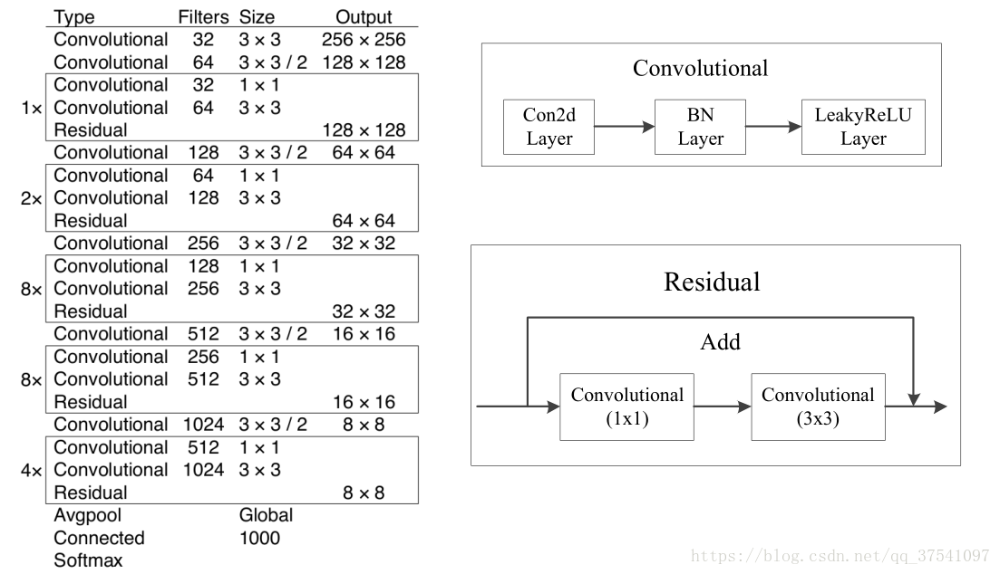

 

看完上图应该就能自己搭建出Darknet-53的网络结构了，上图是以输入图像256 x 256进行预训练来进行介绍的，常用的尺寸是416 x 416，都是32的倍数。下面我们再来分析下YOLOv3的特征提取器，看看究竟是在哪几层Features上做的预测。

### 1.2 网络结构全貌

Yolov3使用Darknet-53作为整个网络的分类骨干部分。在Yolov3论文中并未给出全部网络结构。根据代码，整理数据流图如下（参考多份Yolov3代码，正确性可以保证）：

**注意：原Darknet53中的尺寸是在图片分类训练集上训练的，所以输入的图像尺寸是256x256，下图是以YOLO v3 416模型进行绘制的，所以输入的尺寸是416x416，预测的三个特征层大小分别是52，26，13。**

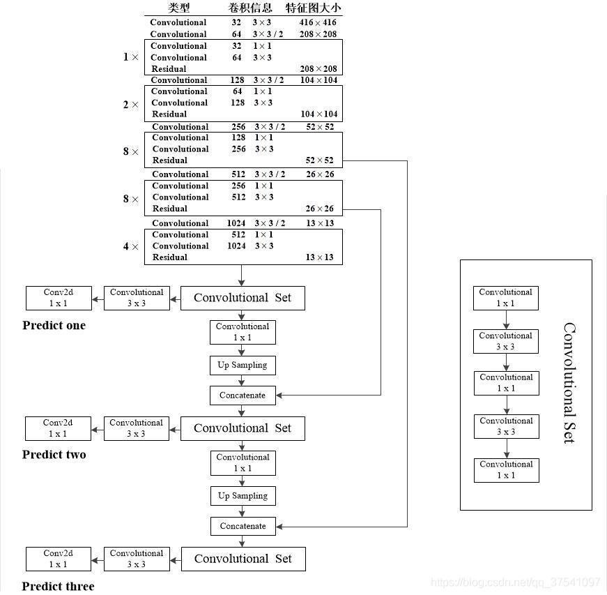

图三 Yolov3数据流程图


**网络结构解析**：

1. Yolov3中，只有卷积层，通过**调节卷积步长控制输出特征图的尺寸**。所以对于输入图片尺寸没有特别限制。流程图中，输入图片以416\*416作为样例。

2. Yolov3借鉴了**金字塔特征图**思想，**小尺寸特征图用于检测大尺寸物体**，而**大尺寸特征图检测小尺寸物体**。特征图的输出维度为 ![N * N * [3 * (4+1+80)]](https://www.zhihu.com/equation?tex=N%5Ctimes+N+%5Ctimes+%5B3+%5Ctimes+%284+%2B+1+%2B+80%29%5D) ， ![[公式]](https://www.zhihu.com/equation?tex=N%5Ctimes+N) 为输出特征图格点数，一共3个Anchor框，每个框有4维预测框数值  ，1维预测框置信度，80维物体类别数。所以第一层特征图的输出维度为  。

3. Yolov3总共输出3个特征图，第一个特征图下采样32倍，第二个特征图下采样16倍，第三个下采样8倍。输入图像经过Darknet-53（无全连接层），再经过Yoloblock生成的特征图被当作两用，第一用为经过3\*3卷积层、1\*1卷积之后生成特征图一，第二用为经过1\*1卷积层加上采样层，与Darnet-53网络的中间层输出结果进行拼接，产生特征图二。同样的循环之后产生特征图三。

4. concat操作与加和操作的区别：加和操作来源于ResNet思想，将输入的特征图，与输出特征图对应维度进行相加，即 ![[公式]](https://www.zhihu.com/equation?tex=y+%3D+f%28x%29%2Bx) ；而concat操作源于DenseNet网络的设计思路，将特征图按照通道维度直接进行拼接，例如8\*8\*16的特征图与8\*8\*16的特征图拼接后生成8\*8\*32的特征图。

5. 上采样层(upsample)：作用是将小尺寸特征图通过插值等方法，生成大尺寸图像。例如使用最近邻插值算法，将8\*8的图像变换为16\*16。上采样层不改变特征图的通道数。

6. 在上图中我们能够很清晰的看到三个预测层分别来自的什么地方，以及Concatenate层与哪个层进行拼接。**注意Convolutional是指Conv2d+BN+LeakyReLU，和Darknet53图中的一样，而生成预测结果的最后三层都只是Conv2d。**通过上图小伙伴们就能更加容易地搭建出YOLOv3的网络框架了。


Yolo的整个网络，吸取了Resnet、Densenet、FPN的精髓，可以说是融合了目标检测当前业界最有效的全部技巧。


**YOLO输出时的显示**：

```
layer     filters    size              input                output

   0 conv     32  3 x 3 / 1   416 x 416 x   3   ->   416 x 416 x  32 0.299 BF
   1 conv     64  3 x 3 / 2   416 x 416 x  32   ->   208 x 208 x  64 1.595 BF
   
   
   # layer1
   2 conv     32  1 x 1 / 1   208 x 208 x  64   ->   208 x 208 x  32 0.177 BF
   3 conv     64  3 x 3 / 1   208 x 208 x  32   ->   208 x 208 x  64 1.595 BF
   4 Shortcut Layer: 1
   
   
   5 conv    128  3 x 3 / 2   208 x 208 x  64   ->   104 x 104 x 128 1.595 BF
   
   
   # layer2
   6 conv     64  1 x 1 / 1   104 x 104 x 128   ->   104 x 104 x  64 0.177 BF
   7 conv    128  3 x 3 / 1   104 x 104 x  64   ->   104 x 104 x 128 1.595 BF
   8 Shortcut Layer: 5
   9 conv     64  1 x 1 / 1   104 x 104 x 128   ->   104 x 104 x  64 0.177 BF
  10 conv    128  3 x 3 / 1   104 x 104 x  64   ->   104 x 104 x 128 1.595 BF
  11 Shortcut Layer: 8
  
  
  12 conv    256  3 x 3 / 2   104 x 104 x 128   ->    52 x  52 x 256 1.595 BF
  
  
  # layer3
  13 conv    128  1 x 1 / 1    52 x  52 x 256   ->    52 x  52 x 128 0.177 BF
  14 conv    256  3 x 3 / 1    52 x  52 x 128   ->    52 x  52 x 256 1.595 BF
  15 Shortcut Layer: 12
  16 conv    128  1 x 1 / 1    52 x  52 x 256   ->    52 x  52 x 128 0.177 BF
  17 conv    256  3 x 3 / 1    52 x  52 x 128   ->    52 x  52 x 256 1.595 BF
  18 Shortcut Layer: 15
  19 conv    128  1 x 1 / 1    52 x  52 x 256   ->    52 x  52 x 128 0.177 BF
  20 conv    256  3 x 3 / 1    52 x  52 x 128   ->    52 x  52 x 256 1.595 BF
  21 Shortcut Layer: 18
  22 conv    128  1 x 1 / 1    52 x  52 x 256   ->    52 x  52 x 128 0.177 BF
  23 conv    256  3 x 3 / 1    52 x  52 x 128   ->    52 x  52 x 256 1.595 BF
  24 Shortcut Layer: 21
  25 conv    128  1 x 1 / 1    52 x  52 x 256   ->    52 x  52 x 128 0.177 BF
  26 conv    256  3 x 3 / 1    52 x  52 x 128   ->    52 x  52 x 256 1.595 BF
  27 Shortcut Layer: 24
  28 conv    128  1 x 1 / 1    52 x  52 x 256   ->    52 x  52 x 128 0.177 BF
  29 conv    256  3 x 3 / 1    52 x  52 x 128   ->    52 x  52 x 256 1.595 BF
  30 Shortcut Layer: 27
  31 conv    128  1 x 1 / 1    52 x  52 x 256   ->    52 x  52 x 128 0.177 BF
  32 conv    256  3 x 3 / 1    52 x  52 x 128   ->    52 x  52 x 256 1.595 BF
  33 Shortcut Layer: 30
  34 conv    128  1 x 1 / 1    52 x  52 x 256   ->    52 x  52 x 128 0.177 BF
  35 conv    256  3 x 3 / 1    52 x  52 x 128   ->    52 x  52 x 256 1.595 BF
  36 Shortcut Layer: 33
  
  
  37 conv    512  3 x 3 / 2    52 x  52 x 256   ->    26 x  26 x 512 1.595 BF
  
  # layer4
  38 conv    256  1 x 1 / 1    26 x  26 x 512   ->    26 x  26 x 256 0.177 BF
  39 conv    512  3 x 3 / 1    26 x  26 x 256   ->    26 x  26 x 512 1.595 BF
  40 Shortcut Layer: 37
  41 conv    256  1 x 1 / 1    26 x  26 x 512   ->    26 x  26 x 256 0.177 BF
  42 conv    512  3 x 3 / 1    26 x  26 x 256   ->    26 x  26 x 512 1.595 BF
  43 Shortcut Layer: 40
  44 conv    256  1 x 1 / 1    26 x  26 x 512   ->    26 x  26 x 256 0.177 BF
  45 conv    512  3 x 3 / 1    26 x  26 x 256   ->    26 x  26 x 512 1.595 BF
  46 Shortcut Layer: 43
  47 conv    256  1 x 1 / 1    26 x  26 x 512   ->    26 x  26 x 256 0.177 BF
  48 conv    512  3 x 3 / 1    26 x  26 x 256   ->    26 x  26 x 512 1.595 BF
  49 Shortcut Layer: 46
  50 conv    256  1 x 1 / 1    26 x  26 x 512   ->    26 x  26 x 256 0.177 BF
  51 conv    512  3 x 3 / 1    26 x  26 x 256   ->    26 x  26 x 512 1.595 BF
  52 Shortcut Layer: 49
  53 conv    256  1 x 1 / 1    26 x  26 x 512   ->    26 x  26 x 256 0.177 BF
  54 conv    512  3 x 3 / 1    26 x  26 x 256   ->    26 x  26 x 512 1.595 BF
  55 Shortcut Layer: 52
  56 conv    256  1 x 1 / 1    26 x  26 x 512   ->    26 x  26 x 256 0.177 BF
  57 conv    512  3 x 3 / 1    26 x  26 x 256   ->    26 x  26 x 512 1.595 BF
  58 Shortcut Layer: 55
  59 conv    256  1 x 1 / 1    26 x  26 x 512   ->    26 x  26 x 256 0.177 BF
  60 conv    512  3 x 3 / 1    26 x  26 x 256   ->    26 x  26 x 512 1.595 BF
  61 Shortcut Layer: 58
  
  
  62 conv   1024  3 x 3 / 2    26 x  26 x 512   ->    13 x  13 x1024 1.595 BF
  
  
  # layer5
  63 conv    512  1 x 1 / 1    13 x  13 x1024   ->    13 x  13 x 512 0.177 BF
  64 conv   1024  3 x 3 / 1    13 x  13 x 512   ->    13 x  13 x1024 1.595 BF
  65 Shortcut Layer: 62
  66 conv    512  1 x 1 / 1    13 x  13 x1024   ->    13 x  13 x 512 0.177 BF
  67 conv   1024  3 x 3 / 1    13 x  13 x 512   ->    13 x  13 x1024 1.595 BF
  68 Shortcut Layer: 65
  69 conv    512  1 x 1 / 1    13 x  13 x1024   ->    13 x  13 x 512 0.177 BF
  70 conv   1024  3 x 3 / 1    13 x  13 x 512   ->    13 x  13 x1024 1.595 BF
  71 Shortcut Layer: 68
  72 conv    512  1 x 1 / 1    13 x  13 x1024   ->    13 x  13 x 512 0.177 BF
  73 conv   1024  3 x 3 / 1    13 x  13 x 512   ->    13 x  13 x1024 1.595 BF
  74 Shortcut Layer: 71
  
  
  # convolutional set
  75 conv    512  1 x 1 / 1    13 x  13 x1024   ->    13 x  13 x 512 0.177 BF
  76 conv   1024  3 x 3 / 1    13 x  13 x 512   ->    13 x  13 x1024 1.595 BF
  77 conv    512  1 x 1 / 1    13 x  13 x1024   ->    13 x  13 x 512 0.177 BF
  78 conv   1024  3 x 3 / 1    13 x  13 x 512   ->    13 x  13 x1024 1.595 BF
  79 conv    512  1 x 1 / 1    13 x  13 x1024   ->    13 x  13 x 512 0.177 BF
  
  
  # predict one
  80 conv   1024  3 x 3 / 1    13 x  13 x 512   ->    13 x  13 x1024 1.595 BF
  81 conv     18  1 x 1 / 1    13 x  13 x1024   ->    13 x  13 x  18 0.006 BF
  82 yolo
  
  
  
  83 route  79
  84 conv    256  1 x 1 / 1    13 x  13 x 512   ->    13 x  13 x 256 0.044 BF
  85 upsample            2x    13 x  13 x 256   ->    26 x  26 x 256
  86 route  85 61
  
  
  # convolutional
  87 conv    256  1 x 1 / 1    26 x  26 x 768   ->    26 x  26 x 256 0.266 BF
  88 conv    512  3 x 3 / 1    26 x  26 x 256   ->    26 x  26 x 512 1.595 BF
  89 conv    256  1 x 1 / 1    26 x  26 x 512   ->    26 x  26 x 256 0.177 BF
  90 conv    512  3 x 3 / 1    26 x  26 x 256   ->    26 x  26 x 512 1.595 BF
  91 conv    256  1 x 1 / 1    26 x  26 x 512   ->    26 x  26 x 256 0.177 BF
  
  
  # predict two
  92 conv    512  3 x 3 / 1    26 x  26 x 256   ->    26 x  26 x 512 1.595 BF
  93 conv     18  1 x 1 / 1    26 x  26 x 512   ->    26 x  26 x  18 0.012 BF
  94 yolo
  
  
  95 route  91
  96 conv    128  1 x 1 / 1    26 x  26 x 256   ->    26 x  26 x 128 0.044 BF
  97 upsample            2x    26 x  26 x 128   ->    52 x  52 x 128
  98 route  97 36
  
  
  # convolutional
  99 conv    128  1 x 1 / 1    52 x  52 x 384   ->    52 x  52 x 128 0.266 BF
 100 conv    256  3 x 3 / 1    52 x  52 x 128   ->    52 x  52 x 256 1.595 BF
 101 conv    128  1 x 1 / 1    52 x  52 x 256   ->    52 x  52 x 128 0.177 BF
 102 conv    256  3 x 3 / 1    52 x  52 x 128   ->    52 x  52 x 256 1.595 BF
 103 conv    128  1 x 1 / 1    52 x  52 x 256   ->    52 x  52 x 128 0.177 BF
 
 
 # predict three
 104 conv    256  3 x 3 / 1    52 x  52 x 128   ->    52 x  52 x 256 1.595 BF
 105 conv     18  1 x 1 / 1    52 x  52 x 256   ->    52 x  52 x  18 0.025 BF
 106 yolo
```

## 2. 前向过程

**Yolo输出特征图解码**

三张特征图就是整个Yolo输出的检测结果，检测框位置（4维）、检测置信度（1维）、类别（80维）都在其中，加起来正好是85维。特征图最后的维度85，代表的就是这些信息，而特征图其他维度N × N × 3，N × N代表了检测框的参考位置信息，3是3个不同尺度的先验框。

**下面详细描述怎么将检测信息解码出来**：

### 2.1 先验框

在Yolov1中，网络直接回归检测框的宽、高，这样效果有限。所以在Yolov2中，改为了回归基于先验框的变化值，这样网络的学习**难度降低，整体精度提升不小**。Yolov3沿用了Yolov2中关于先验框的技巧，并且使用k-means对数据集中的标签框进行聚类，得到类别中心点的9个框，作为先验框。在COCO数据集中（原始图片全部resize为416 × 416），九个框分别是 (10×13)，(16×30)，(33×23)，(30×61)，(62×45)，(59× 119)， (116 × 90)， (156 × 198)，(373 × 326) ，顺序为w × h。

注：**先验框只与检测框的w、h有关，与x、y无关**。

### 2.2 检测框解码

有了**先验框与输出特征图**，就可以**解码检测框** x，y，w，h。

![[公式]](https://www.zhihu.com/equation?tex=b_x%3D%5Csigma+%28t_x%29+%2B+c_x+%5C%5C+b_y%3D%5Csigma+%28t_y%29+%2B+c_y+%5C%5C+b_w%3Dp_we%5E%7Bt_w%7D++%5C%5C+b_h%3Dp_he%5E%7Bt_h%7D+%5C%5C)

如下图所示， ![[公式]](https://www.zhihu.com/equation?tex=%5Csigma%28t_x%29%2C+%5Csigma%28t_y%29) 是基于矩形框中心点左上角格点坐标的偏移量， ![[公式]](https://www.zhihu.com/equation?tex=%5Csigma) 是**激活函数**，论文中作者使用**sigmoid**。 ![[公式]](https://www.zhihu.com/equation?tex=p_w%2C+p_h) 是先验框的宽、高，通过上述公式，计算出实际预测框的宽高 ![[公式]](https://www.zhihu.com/equation?tex=%28b_w%2C+b_h%29) 。

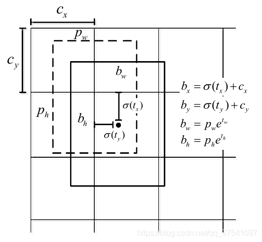

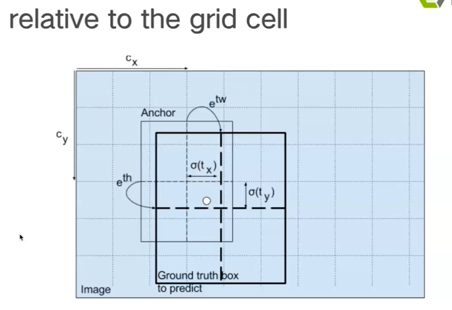

图四  检测框解码

举个具体的例子，假设对于第二个特征图16 × 16 × 3 × 85中的第[5，4，2]维，上图中的 ![[公式]](https://www.zhihu.com/equation?tex=c_y) 为5， ![[公式]](https://www.zhihu.com/equation?tex=+c_x) 为4，第二个特征图对应的先验框为(30×61)，(62×45)，(59× 119)，prior_box的index为2，那么取最后一个59，119作为先验w、先验h。这样计算之后的 ![[公式]](https://www.zhihu.com/equation?tex=b_x%2Cb_y) 还需要乘以特征图二的采样率16，得到真实的检测框x，y。

### 2.3 目标边界框的预测

YOLOv3网络在三个特征图中分别通过(4+1+c) k个大小为11的卷积核进行卷积预测，k为预设边界框（bounding box prior）的个数（k默认取3），c为预测目标的类别数，其中4k个参数负责预测目标边界框的偏移量，k个参数负责预测目标边界框内包含目标的概率，ck个参数负责预测这k个预设边界框对应c个目标类别的概率。

下图展示了目标边界框的预测过程（该图是本人重新绘制的，与论文中的示意图有些不同，个人感觉自己绘制的更便于理解）。图中**虚线矩形框为预设边界框**，**实线矩形框为通过网络预测的偏移量计算得到的预测边界框**。其中为预设边界框在特征图上的中心坐标，为预设边界框在特征图上的宽和高，分别为网络预测的边界框中心偏移量以及宽高缩放比，为最终预测的目标边界框，从预设边界框到最终预测边界框的转换过程如图右侧公式所示，其中函数是sigmoid函数其目的是将预测偏移量缩放到0到1之间（这样能够将预设边界框的中心坐标固定在一个cell当中，作者说这样能够加快网络收敛）。


下图给出了三个预测层的特征图大小以及每个特征图上预设边界框的尺寸（这些预设边界框尺寸都是作者根据COCO数据集聚类得到的）：

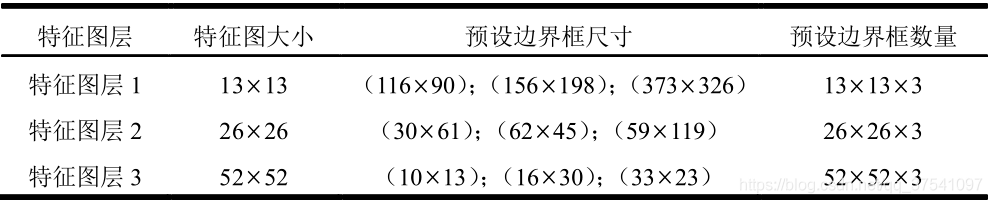


### 2.4 检测置信度解码

物体的检测置信度，在Yolo设计中非常重要，关系到算法的检测正确率与召回率。

置信度在输出85维中占固定一位，由sigmoid函数解码即可，解码之后数值区间在[0，1]中。


### 2.5 类别解码

COCO数据集有80个类别，所以类别数在85维输出中占了80维，每一维独立代表一个类别的置信度。使用sigmoid激活函数替代了Yolov2中的softmax，取消了类别之间的互斥，可以使网络更加灵活。

三个特征图一共可以解码出 8 × 8 × 3 + 16 × 16 × 3 + 32 × 32 × 3 = 4032 个box以及相应的类别、置信度。这4032个box，在训练和推理时，使用方法不一样：

1. 训练时4032个box全部送入打标签函数，进行后一步的标签以及损失函数的计算。
2. 推理时，选取一个置信度阈值，过滤掉低阈值box，再经过nms（非极大值抑制），就可以输出整个网络的预测结果了。


## 3. 反向过程

**训练策略与损失函数**

Yolov3的训练策略尤为重要，笔者也是在亲手复现代码之后，才算领悟了八九成。

### 3.1 训练策略

> YOLOv3 predicts an objectness score for each bounding box using logistic regression. This should be 1 if the bounding box prior overlaps a ground truth object by more than any other bounding box prior. If the bounding box prior is not the best but does overlap a ground truth object by more than some threshold we ignore the prediction, following [17]. We use the threshold of .5. Unlike [17] our system only assigns one bounding box prior for each ground truth object. If a bounding box prior is not assigned to a ground truth object it incurs no loss for coordinate or class predictions, only objectness. 

以上是Yolov3论文中的训练策略。说实话，最后一句“一个没有被分配ground truth的预测框，只产生置信度loss“，有一定的歧义。深刻理解Yolov3之后，训练策略总结如下：

1. 预测框一共分为三种情况：正例（positive）、负例（negative）、忽略样例（ignore）。
2. 正例：任取一个ground truth，与4032个框全部计算IOU，IOU最大的预测框，即为正例。并且一个预测框，只能分配给一个ground truth。例如第一个ground truth已经匹配了一个正例检测框，那么下一个ground truth，就在余下的4031个检测框中，寻找IOU最大的检测框作为正例。ground truth的先后顺序可忽略。**正例产生置信度loss、检测框loss、类别loss**。预测框为对应的ground truth box标签（需要反向编码，使用真实的x、y、w、h计算出 ![[公式]](https://www.zhihu.com/equation?tex=t_x+%2Ct_y+%2Ct_w%2C+t_h)）；类别标签对应类别为1，其余为0；置信度标签为1。
3. 忽略样例：正例除外，与任意一个ground truth的IOU大于阈值（论文中使用0.5），则为忽略样例。忽略样例不产生任何loss。
4. 负例：正例除外（与ground truth计算后IOU最大的检测框，但是IOU小于阈值，仍为正例），与全部ground truth的IOU都小于阈值（0.5），则为负例。负例**只有置信度产生loss，置信度标签为0**。

### 3.2 Loss函数

特征图1的Yolov3的损失函数抽象表达式如下：

![[公式]](imgs/1234.png)

Yolov3 Loss为三个特征图Loss之和：

![[公式]](https://www.zhihu.com/equation?tex=Loss%3Dloss_%7BN_1%7D++%2Bloss_%7BN_2%7D+%2Bloss_%7BN_3%7D++%5C%5C)

1. ![[公式]](https://www.zhihu.com/equation?tex=%5Clambda) 为权重常数，控制**检测框Loss、obj置信度Loss、noobj置信度Loss**之间的比例，通常负例的个数是正例的几十倍以上，可以通过权重超参控制检测效果。
2. ![[公式]](https://www.zhihu.com/equation?tex=1_%7Bij%7D%5E%7Bobj%7D) 若是正例则输出1，否则为0； ![[公式]](https://www.zhihu.com/equation?tex=1_%7Bij%7D%5E%7Bnoobj%7D) 若是负例则输出1，否则为0；忽略样例都输出0。
3. **x、y、w、h使用MSE作为损失函数**，也可以使用smooth L1 loss（出自Faster R-CNN）作为损失函数。smooth L1可以使训练更加平滑。**置信度、类别标签由于是0，1二分类，所以使用交叉熵作为损失函数**。

### 3.3 损失函数

关于YOLOv3的损失函数文章中写的很粗略，比如坐标损失采用的是误差的平方和，类别损失采用的是二值交叉熵，本人在github上也找了很多YOLO v3的公开代码，有的采用的是YOLOv1或者YOLOv2的损失函数，下面给出本人认为正确的损失函数（这里偷个懒，公式都是从本人之前写的论文中截图的）。

YOLOv3的损失函数主要分为三个部分：目标定位偏移量损失，目标置信度损失以及目标分类损失,其中是平衡系数。

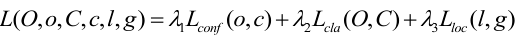

#### 3.3.1目标置信度损失

目标置信度可以理解为**预测目标矩形框内存在目标的概率**，目标置信度损失采用的是二值交叉熵损失(Binary Cross Entropy)，其中,表示预测目标边界框i中是否真实存在目标，0表示不存在，1表示存在。表示预测目标矩形框i内是否存在目标的Sigmoid概率（将预测值通过sigmoid函数得到）。

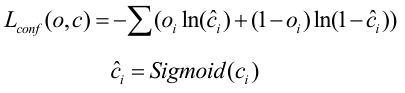

#### 3.3.2 目标类别损失

目标类别损失同样采用的是二值交叉熵损失（采用二值交叉熵损失的原因是，作者认为同一目标可同时归为多类，比如猫可归为猫类以及动物类，这样能够应对更加复杂的场景。但在本人实践过程中发现使用原始的多类别交叉熵损失函数效果会更好一点，原因是本人针对识别的目标都是固定归于哪一类的，并没有可同时归于多类的情况），其中,表示预测目标边界框i中是否真实存在第j类目标，0表示不存在，1表示存在。表示网络预测目标边界框i内存在第j类目标的Sigmoid概率（将预测值通过sigmoid函数得到）。

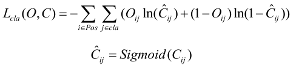

#### 3.3.3目标定位损失

目标定位损失采用的是真实偏差值与预测偏差值差的平方和，

其中表示预测矩形框坐标偏移量（注意网络预测的是偏移量，不是直接预测坐标），

表示与之匹配的GTbox与默认框之间的坐标偏移量，

为预测的目标矩形框参数,

为默认矩形框参数,

为与之匹配的真实目标矩形框参数，

这些参数都是映射在预测特征图上的。

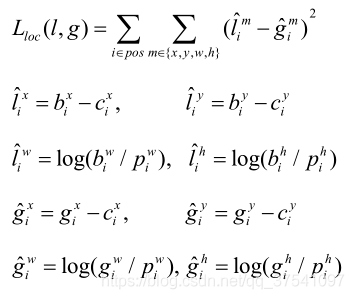

### 3.3 训练策略解释

#### 3.3.1 ground truth为什么不按照中心点分配对应的预测box？

（1）在Yolov3的训练策略中，不再像Yolov1那样，每个cell负责中心落在该cell中的ground truth。原因是Yolov3一共产生3个特征图，3个特征图上的cell，中心是有重合的。训练时，可能最契合的是特征图1的第3个box，但是推理的时候特征图2的第1个box置信度最高。所以Yolov3的训练，不再按照ground truth中心点，严格分配指定cell，而是根据预测值寻找IOU最大的预测框作为正例。

（2）笔者实验结果：第一种，ground truth先从9个先验框中确定最接近的先验框，这样可以确定ground truth所属第几个特征图以及第几个box位置，之后根据中心点进一步分配。第二种，全部4032个输出框直接和ground truth计算IOU，取IOU最高的cell分配ground truth。第二种计算方式的IOU数值，往往都比第一种要高，这样wh与xy的loss较小，网络可以更加关注类别和置信度的学习；其次，在推理时，是按照置信度排序，再进行nms筛选，第二种训练方式，每次给ground truth分配的box都是最契合的box，给这样的box置信度打1的标签，更加合理，最接近的box，在推理时更容易被发现。

#### 3.3.2 Yolov1中的置信度标签，就是预测框与真实框的IOU，Yolov3为什么是1？

（1）置信度意味着该预测框是或者不是一个真实物体，是一个二分类，所以标签是1、0更加合理。

（2）笔者实验结果：第一种：置信度标签取预测框与真实框的IOU；第二种：置信度标签取1。第一种的结果是，在训练时，有些预测框与真实框的IOU极限值就是0.7左右，置信度以0.7作为标签，置信度学习有一些偏差，最后学到的数值是0.5，0.6，那么假设推理时的激活阈值为0.7，这个检测框就被过滤掉了。但是IOU为0.7的预测框，其实已经是比较好的学习样例了。尤其是coco中的小像素物体，几个像素就可能很大程度影响IOU，所以第一种训练方法中，置信度的标签始终很小，无法有效学习，导致检测召回率不高。而检测框趋于收敛，IOU收敛至1，置信度就可以学习到1，这样的设想太过理想化。而使用第二种方法，召回率明显提升了很高。

#### 3.3.3 为什么有忽略样例？

（1）忽略样例是Yolov3中的点睛之笔。由于Yolov3使用了多尺度特征图，不同尺度的特征图之间会有重合检测部分。比如有一个真实物体，在训练时被分配到的检测框是特征图1的第三个box，IOU达0.98，此时恰好特征图2的第一个box与该ground truth的IOU达0.95，也检测到了该ground truth，如果此时给其置信度强行打0的标签，网络学习效果会不理想。

（2）笔者实验结果：如果给全部的忽略样例置信度标签打0，那么最终的loss函数会变成 ![[公式]](https://www.zhihu.com/equation?tex=Loss_%7Bobj%7D) 与 ![[公式]](https://www.zhihu.com/equation?tex=Loss_%7Bnoobj%7D) 的拉扯，不管两个loss数值的权重怎么调整，或者网络预测趋向于大多数预测为负例，或者趋向于大多数预测为正例。而加入了忽略样例之后，网络才可以学习区分正负例。


### 3.4 优化器

作者在文中没有提及优化器，Adam，SGD等都可以用，github上Yolov3项目中，大多使用Adam优化器。


## 4. 精度与性能

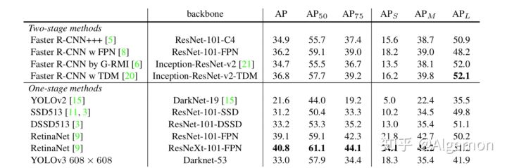

图五 精度对比图(on coco)


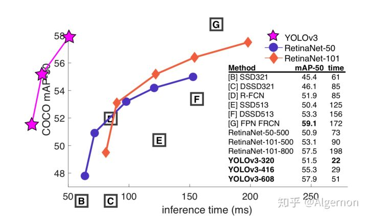

图六 性能对比图(on coco)


直接说结论：Yolov3精度与SSD相比略有小优，与Faster R-CNN相比略有逊色，几乎持平，比RetinaNet差。但是速度是SSD、RetinaNet、Faster R-CNN至少2倍以上。输入尺寸为320*320的Yolov3，单张图片处理仅需22ms，简化后的Yolov3 tiny可以更快。
