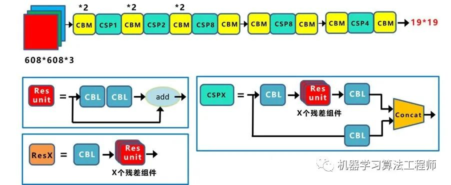

# YoloV4

⌚️: 2020年09月22日

📚参考

---


----

> Yolov4论文名：《Yolov4: Optimal Speed and Accuracy of Object Detection》
>
> Yolov4论文地址：arxiv.org/pdf/2004.1093


## 1 网络结构[🔗](arch_yolov4.md)


Yolov4的结构图和Yolov3相比，因为多了CSP结构，PAN结构，如果单纯看可视化流程图，会觉得很绕，不过在绘制出上面的图形后，会觉得豁然开朗，其实整体架构和Yolov3是相同的，不过使用各种新的算法思想对各个子结构都进行了改进。


先整理下Yolov4的**五个基本组件**：

1. CBM：Yolov4网络结构中的最小组件，由Conv+Bn+Mish激活函数三者组成。
2. CBL：由Conv+Bn+Leaky_relu激活函数三者组成。
3. Res unit：借鉴Resnet网络中的残差结构，让网络可以构建的更深。
4. CSPX：借鉴CSPNet网络结构，由三个卷积层和X个Res unint模块Concate组成。
5. SPP：采用1×1，5×5，9×9，13×13的最大池化的方式，进行多尺度融合。

其他基础操作：

1. Concat：张量拼接，维度会扩充，和Yolov3中的解释一样，对应于cfg文件中的route操作。
2. add：张量相加，不会扩充维度，对应于cfg文件中的shortcut操作。


Backbone中卷积层的数量：

和Yolov3一样，再来数一下Backbone里面的卷积层数量。

每个CSPX中包含3+2*X个卷积层，因此整个主干网络Backbone中一共包含

```
2+（3+2*1）+2+（3+2*2）+2+（3+2*8）+2+（3+2*8）+2+（3+2*4）+1=72
```

这里大白有些疑惑，按照Yolov3设计的传统，这么多卷积层，主干网络不应该叫CSPDaeknet73吗？？？？


Yolov4本质上和Yolov3相差不大，可能有些人会觉得失望。

但我觉得算法创新分为三种方式：

1. 第一种：面目一新的创新，比如Yolov1、Faster-RCNN、Centernet等，开创出新的算法领域，不过这种也是最难的
2. 第二种：守正出奇的创新，比如将图像金字塔改进为特征金字塔
3. 第三种：各种先进算法集成的创新，比如不同领域发表的最新论文的tricks，集成到自己的算法中，却发现有出乎意料的改进


Yolov4既有第二种也有第三种创新，组合尝试了大量深度学习领域最新论文的20多项研究成果，而且不得不佩服的是作者Alexey在github代码库维护的频繁程度。

目前Yolov4代码的star数量已经1万多，据我所了解，目前超过这个数量的，目标检测领域只有Facebook的Detectron(v1-v2)、和Yolo(v1-v3)官方代码库（已停止更新）。

所以Yolov4中的各种创新方式，大白觉得还是很值得仔细研究的。

为了便于分析，将Yolov4的整体结构拆分成四大板块：


大白主要从以上4个部分对YoloV4的创新之处进行讲解，让大家一目了然。

1. 输入端：这里指的创新主要是训练时对输入端的改进，主要包括Mosaic数据增强、cmBN、SAT自对抗训练
2. BackBone主干网络：将各种新的方式结合起来，包括：CSPDarknet53、Mish激活函数、Dropblock
3. Neck：目标检测网络在BackBone和最后的输出层之间往往会插入一些层，比如Yolov4中的SPP模块、FPN+PAN结构
4. Prediction：输出层的锚框机制和Yolov3相同，主要改进的是训练时的损失函数CIOU_Loss，以及预测框筛选的nms变为DIOU_nms


总体来说，Yolov4对Yolov3的各个部分都进行了改进优化，下面丢上作者的算法对比图。


仅对比Yolov3和Yolov4，在COCO数据集上，同样的FPS等于83左右时，Yolov4的AP是43，而Yolov3是33，直接上涨了10个百分点。

不得不服，当然可能针对具体不同的数据集效果也不一样，但总体来说，改进效果是很优秀的，下面大白对Yolov4的各个创新点继续进行深挖。

### 1.1 输入端创新

考虑到很多同学GPU显卡数量并不是很多，Yolov4对训练时的输入端进行改进，使得训练在单张GPU上也能有不错的成绩。比如数据增强Mosaic、cmBN、SAT自对抗训练。

但感觉cmBN和SAT影响并不是很大，所以这里主要讲解Mosaic数据增强。

#### 1.1.1 Mosaic数据增强

Yolov4中使用的Mosaic是参考2019年底提出的CutMix数据增强的方式，但CutMix只使用了两张图片进行拼接，而Mosaic数据增强则采用了4张图片，随机缩放、随机裁剪、随机排布的方式进行拼接。


这里首先要了解为什么要进行Mosaic数据增强呢？

在平时项目训练时，小目标的AP一般比中目标和大目标低很多。而Coco数据集中也包含大量的小目标，但比较麻烦的是小目标的分布并不均匀。

首先看下小、中、大目标的定义：
2019年发布的论文《Augmentation for small object detection》对此进行了区分：


可以看到小目标的定义是目标框的长宽0×0~32×32之间的物体。


但在整体的数据集中，小、中、大目标的占比并不均衡。
如上表所示，Coco数据集中小目标占比达到41.4%，数量比中目标和大目标都要多。

但在所有的训练集图片中，只有52.3%的图片有小目标，而中目标和大目标的分布相对来说更加均匀一些。

针对这种状况，Yolov4的作者采用了Mosaic数据增强的方式。

主要有几个优点：

1. 丰富数据集：随机使用4张图片，随机缩放，再随机分布进行拼接，大大丰富了检测数据集，特别是随机缩放增加了很多小目标，让网络的鲁棒性更好。
2. 减少GPU：可能会有人说，随机缩放，普通的数据增强也可以做，但作者考虑到很多人可能只有一个GPU，因此Mosaic增强训练时，可以直接计算4张图片的数据，使得Mini-batch大小并不需要很大，一个GPU就可以达到比较好的效果。

此外，发现另一研究者的训练方式也值得借鉴，采用的数据增强和Mosaic比较类似，也是使用4张图片（不是随机分布），但训练计算loss时，采用“缺啥补啥”的思路：如果上一个iteration中，小物体产生的loss不足（比如小于某一个阈值），则下一个iteration就用拼接图；否则就用正常图片训练，也很有意思。

参考链接：https://www.zhihu.com/question/390191723?rf=390194081


### 1.2 BackBone创新


#### 1.2.1 CSPDarknet53

CSPDarknet53是在Yolov3主干网络Darknet53的基础上，借鉴2019年CSPNet的经验，产生的Backbone结构，其中包含了5个CSP模块。



这里因为CSP模块比较长，不放到本处，大家也可以点击Yolov4的[netron网络结构图](yolov4-arch.md)，对比查看，一目了然。

每个CSP模块前面的卷积核的大小都是3*3，因此可以起到下采样的作用。

因为Backbone有5个CSP模块，输入图像是608*608，所以特征图变化的规律是：608->304->152->76->38->19

经过5次CSP模块后得到19*19大小的特征图。

而且作者只在Backbone中采用了Mish激活函数，网络后面仍然采用Leaky_relu激活函数。

我们再看看下作者为啥要参考2019年的CSPNet，采用CSP模块？

CSPNet论文地址：arxiv.org/pdf/1911.1192

CSPNet全称是Cross Stage Paritial Network，主要从**网络结构设计的角度解决推理中从计算量很大的问题**。

CSPNet的作者认为**推理计算过高**的问题是由于网络优化中的梯度信息重复导致的。

因此采用CSP模块先将基础层的特征映射划分为两部分，然后通过跨阶段层次结构将它们合并，在减少了计算量的同时可以保证准确率。

因此Yolov4在主干网络Backbone采用CSPDarknet53网络结构，主要有三个方面的优点：

**优点一：增强CNN的学习能力，使得在轻量化的同时保持准确性。**

**优点二：降低计算瓶颈**

**优点三：降低内存成本**

#### 1.2.2 Mish激活函数

Mish激活函数是2019年下半年提出的激活函数

论文地址：arxiv.org/abs/1908.0868

和Leaky_relu激活函数的图形对比如下：


Yolov4的Backbone中都使用了Mish激活函数，而后面的网络则还是使用leaky_relu函数。


Yolov4作者实验测试时，使用CSPDarknet53网络在ImageNet数据集上做图像分类任务，发现使用了Mish激活函数的TOP-1和TOP-5的精度比没有使用时都略高一些。

因此在设计Yolov4目标检测任务时，主干网络Backbone还是使用Mish激活函数。

#### 1.2.3 Dropblock

Yolov4中使用的Dropblock，其实和常见网络中的Dropout功能类似，也是缓解过拟合的一种正则化方式。

Dropblock在2018年提出，论文地址：arxiv.org/pdf/1810.1289

传统的Dropout很简单，一句话就可以说的清：随机删除减少神经元的数量，使网络变得更简单。


而Dropblock和Dropout相似，比如下图：


中间Dropout的方式会随机的删减丢弃一些信息，但Dropblock的研究者认为，卷积层对于这种随机丢弃并不敏感，因为卷积层通常是三层连用：卷积+激活+池化层，池化层本身就是对相邻单元起作用。而且即使随机丢弃，卷积层仍然可以从相邻的激活单元学习到相同的信息。

因此，在全连接层上效果很好的Dropout在卷积层上效果并不好。

所以右图Dropblock的研究者则干脆整个局部区域进行删减丢弃。

这种方式其实是借鉴2017年的cutout数据增强的方式，cutout是将输入图像的部分区域清零，而Dropblock则是将Cutout应用到每一个特征图。而且并不是用固定的归零比率，而是在训练时以一个小的比率开始，随着训练过程线性的增加这个比率。


Dropblock的研究者与Cutout进行对比验证时，发现有几个特点：

优点一：Dropblock的效果优于Cutout

优点二：Cutout只能作用于输入层，而Dropblock则是将Cutout应用到网络中的每一个特征图上

优点三：Dropblock可以定制各种组合，在训练的不同阶段可以修改删减的概率，从空间层面和时间层面，和Cutout相比都有更精细的改进。

Yolov4中直接采用了更优的Dropblock，对网络的正则化过程进行了全面的升级改进。

### 1.3 Neck创新

在目标检测领域，为了更好的提取融合特征，通常在Backbone和输出层，会插入一些层，这个部分称为Neck。相当于目标检测网络的颈部，也是非常关键的。

Yolov4的Neck结构主要采用了SPP模块、FPN+PAN的方式。


#### 1.3.1 SPP模块

SPP模块，其实在Yolov3中已经存在了，在Yolov4的C++代码文件夹中有一个Yolov3_spp版本，但有的同学估计从来没有使用过，在Yolov4中，SPP模块仍然是在Backbone主干网络之后：


作者在SPP模块中，使用k=`{1*1,5*5,9*9,13*13}`的最大池化的方式，再将不同尺度的特征图进行Concat操作。


在《DC-SPP-Yolo》文章：

也对Yolo目标检测的SPP模块进行了对比测试。

和Yolov4作者的研究相同，采用SPP模块的方式，比单纯的使用k*k最大池化的方式，更有效的增加主干特征的接收范围，显著的分离了最重要的上下文特征。

Yolov4的作者在使用608*608大小的图像进行测试时发现，在COCO目标检测任务中，以0.5%的额外计算代价将AP50增加了2.7%，因此Yolov4中也采用了SPP模块。

#### 1.3.2 FPN+PAN

PAN结构比较有意思，看了网上Yolov4关于这个部分的讲解，大多都是讲的比较笼统的，而PAN是借鉴图像分割领域PANet的创新点，有些同学可能不是很清楚。

下面大白将这个部分拆解开来，看下Yolov4中是如何设计的。

Yolov3结构：

我们先来看下Yolov3中Neck的FPN结构


可以看到经过几次下采样，三个紫色箭头指向的地方，输出分别是`76*76、38*38、19*19`。

以及最后的Prediction中用于预测的三个特征图①`19*19*255`、②`38*38*255`、③`76*76*255`。

我们将Neck部分用立体图画出来，更直观的看下两部分之间是如何通过FPN结构融合的。


如图所示，FPN是自顶向下的，将高层的特征信息通过上采样的方式进行传递融合，得到进行预测的特征图。

Yolov4结构：

而Yolov4中Neck这部分除了使用FPN外，还在此基础上使用了PAN结构：


前面CSPDarknet53中讲到，每个CSP模块前面的卷积核都是3*3大小，相当于下采样操作。

因此可以看到三个紫色箭头处的特征图是`76*76、38*38、19*19`。

以及最后Prediction中用于预测的三个特征图：`①76*76*255，②38*38*255，③19*19*255`。

我们也看下Neck部分的立体图像，看下两部分是如何通过FPN+PAN结构进行融合的。


和Yolov3的FPN层不同，Yolov4在FPN层的后面还添加了一个自底向上的特征金字塔。

其中包含两个PAN结构。

这样结合操作，FPN层自顶向下传达强语义特征，而特征金字塔则自底向上传达强定位特征，两两联手，从不同的主干层对不同的检测层进行参数聚合,这样的操作确实很皮。

FPN+PAN借鉴的是18年CVPR的PANet，当时主要应用于图像分割领域，但Alexey将其拆分应用到Yolov4中，进一步提高特征提取的能力。

不过这里需要注意几点：

注意一：

Yolov3的FPN层输出的三个大小不一的特征图①②③直接进行预测

但Yolov4的FPN层，只使用最后的一个76*76特征图①，而经过两次PAN结构，输出预测的特征图②和③。

这里的不同也体现在cfg文件中，这一点有很多同学之前不太明白，

比如Yolov3.cfg最后的三个Yolo层，

第一个Yolo层是最小的特征图19*19，mask=6,7,8，对应最大的anchor box。

第二个Yolo层是中等的特征图38*38，mask=3,4,5，对应中等的anchor box。

第三个Yolo层是最大的特征图76*76，mask=0,1,2，对应最小的anchor box。

而Yolov4.cfg则恰恰相反

第一个Yolo层是最大的特征图76*76，mask=0,1,2，对应最小的anchor box。

第二个Yolo层是中等的特征图38*38，mask=3,4,5，对应中等的anchor box。

第三个Yolo层是最小的特征图19*19，mask=6,7,8，对应最大的anchor box。

注意点二：

原本的PANet网络的PAN结构中，两个特征图结合是采用shortcut操作，而Yolov4中则采用concat（route）操作，特征图融合后的尺寸发生了变化。


这里也可以对应Yolov4的netron网络图查看，很有意思。

### 1.4 Prediction创新

#### 1.4.1 CIOU_Loss

目标检测任务的损失函数一般由Classificition Loss（分类损失函数）和Bounding Box Regeression Loss（回归损失函数）两部分构成。

Bounding Box Regeression的Loss近些年的发展过程是：Smooth L1 Loss-> IoU Loss（2016）-> GIoU Loss（2019）-> DIoU Loss（2020）->CIoU Loss（2020）

我们从最常用的IOU_Loss开始，进行对比拆解分析，看下Yolov4为啥要选择CIOU_Loss。

##### a.IOU_Loss


可以看到IOU的loss其实很简单，主要是交集/并集，但其实也存在两个问题。


问题1：即状态1的情况，当预测框和目标框不想交时，IOU=0，无法反应两个框距离的远近，此时损失函数不可导，IOU_Loss无法优化两个框不相交的情况。

问题2：即状态2和状态3的情况，当两个预测框大小相同，两个IOU也相同，IOU_Loss无法区分两者相交情况的不同。

因此2019年出现了GIOU来进行改进。


##### b.GIOU_Loss


可以看到右图

GIOU_Loss中，增加了相交尺度的衡量方式，缓解了单纯IOU时的尴尬。

但为什么仅仅说缓解呢？

因为还存在一种不足：


问题：状态1、2、3都是预测框在目标框内部且预测框大小一致的情况，这时预测框和目标框的差集都是相同的，因此这三种状态的GIOU值也都是相同的，这时GIOU退化成了IOU，无法区分相对位置关系。
基于这个问题，2020年的AAAI又提出了DIOU_Loss。

##### c.DIOU_Loss

好的目标框回归函数应该考虑三个重要几何因素：重叠面积、中心点距离，长宽比。

针对IOU和GIOU存在的问题，作者从两个方面进行考虑

一：如何最小化预测框和目标框之间的归一化距离？

二：如何在预测框和目标框重叠时，回归的更准确？

针对第一个问题，提出了DIOU_Loss（Distance_IOU_Loss）


DIOU_Loss考虑了重叠面积和中心点距离，当目标框包裹预测框的时候，直接度量2个框的距离，因此DIOU_Loss收敛的更快。

但就像前面好的目标框回归函数所说的，没有考虑到长宽比。


比如上面三种情况，目标框包裹预测框，本来DIOU_Loss可以起作用。

但预测框的中心点的位置都是一样的，因此按照DIOU_Loss的计算公式，三者的值都是相同的。

针对这个问题，又提出了CIOU_Loss，不对不说，科学总是在解决问题中，不断进步！！

##### d.CIOU_Loss

CIOU_Loss和DIOU_Loss前面的公式都是一样的，不过在此基础上还增加了一个影响因子，将预测框和目标框的长宽比都考虑了进去。


其中v是衡量长宽比一致性的参数，我们也可以定义为：


这样CIOU_Loss就将目标框回归函数应该考虑三个重要几何因素：重叠面积、中心点距离，长宽比全都考虑进去了。

再来综合的看下各个Loss函数的不同点：

IOU_Loss：主要考虑检测框和目标框重叠面积。

GIOU_Loss：在IOU的基础上，解决边界框不重合时的问题。

DIOU_Loss：在IOU和GIOU的基础上，考虑边界框中心点距离的信息。

CIOU_Loss：在DIOU的基础上，考虑边界框宽高比的尺度信息。

Yolov4中采用了CIOU_Loss的回归方式，使得预测框回归的速度和精度更高一些。

| 名称 | 重叠面积 | 中心点距离（相对位置） | 长宽比 | 备注           |
| ---- | -------- | ---------------------- | ------ | -------------- |
| IOU  | ✅        |                        |        |                |
| GIOU | ✅        |                        |        | 解决不重合象限 |
| DIOU | ✅        | ✅                      |        |                |
| CIOU | ✅        | ✅                      | ✅      |                |
|      |          |                        |        |                |


#### 1.4.2 DIOU_nms

Nms主要用于预测框的筛选，常用的目标检测算法中，一般采用普通的nms的方式，Yolov4则借鉴上面D/CIOU loss的论文：arxiv.org/pdf/1911.0828

将其中计算IOU的部分替换成DIOU的方式：

再来看下实际的案例


在上图重叠的摩托车检测中，中间的摩托车因为考虑边界框中心点的位置信息，也可以回归出来。

因此在重叠目标的检测中，DIOU_nms的效果优于传统的nms。

总体来说，YOLOv4的论文称的上良心之作，将近几年关于深度学习领域最新研究的tricks移植到Yolov4中做验证测试，将Yolov3的精度提高了不少。

虽然没有全新的创新，但很多改进之处都值得借鉴，借用Yolov4作者的总结。

Yolov4 主要带来了 3 点新贡献：

（1）提出了一种高效而强大的目标检测模型，使用 1080Ti 或 2080Ti 就能训练出超快、准确的目标检测器。

（2）在检测器训练过程中，验证了最先进的一些研究成果对目标检测器的影响。

（3）改进了 SOTA 方法，使其更有效、更适合单 GPU 训练。

## 2 损失函数


## 3 详解各种trick


> https://www.bilibili.com/video/BV1aK4y1k73n?from=search&seid=3447559638296242139
>
> **《YOLOv4: Optimal Speed and Accuracy of Object Detection》**
>
> 背景。贡献。解决什么问题。有待改进之处。
>
> **如何构建这个模型！**
>
> **一、引言**
>
> ​	1、V3 回顾
>
> ​		backbone：darknet53;  anchor boxes;   batch normalization;  multi-scale  (test544);	取消了pooling层，改用卷积核步长进行降采样;  logistics代替softmax	
>
> ​	2、V4 中，作者做了很多实验，把近几年的一些方法加入yolo中，最终取得了	效果和速度的提升。通过了解yolov4，我们可以很好的知道近几年有哪些方法	被提出来，整篇论文更像是一篇综述，但是和绝大多数综述不同的是，作者是有做实验提炼出一个优秀的模型的！
>
> ​		*Weighted-Residual-Connections*;  *Cross-Stage-Partial-connections*(CSP);  Cross mini-Batch Normalization(CBM); *Self-adversarial-training*(SAT); *Mish activation*(mish);  *Mosaic data augmentation*(mosaic);	*DropBlock regularization*(dropblock); *CIoU loss*(ciou loss);
>
> **二、Bag of freebies**
>
> ​	改变培训策略，或者只会增加培训成本的方法，对测试不影响。
>
> ​	**数据扩充：**
>
> ​		1、光度畸变：调整图像的亮度、对比度、色调、饱和度和噪声
>
> ​		2、几何畸变：加入随机缩放、剪切、翻转和反旋转
>
> ​	**模拟对象遮挡：**
>
> ​		1、random erase，CutOut：可以随机选择图像中的矩形区域，并填充一个随机的或互补的零值
>
> ​		2、hide-and-seek、grid mask：随机或均匀地选择图像中的多个矩形区域，并将其全部替换为0
>
> ​	**feature map：**
>
> ​		DropOut、DropConnect和DropBlock。
>
> ​	**结合多幅图像进行数据扩充：**
>
> ​		MixUp、CutMix
>
> ​	**Style Transfer GAN**
>
> ​	**解决类别不平衡：**
>
> ​		hard negative example mining (只适用两阶段)
>
> ​		online hard example mining (只适用两阶段)
>
> ​		focal loss
>
> ​	**label smoothing**
>
> ​	**bbox：**
>
> ​		1、IoU_loss
>
> ​		2、GIoU_loss
>
> ​		3、DIoU_loss
>
> ​		4、CIoU_loss
>
> ​	**YOLOv4 - use：**
>
> ​		*CutMix and Mosaic data augmentation*、DropBlock regularization、	Class label smoothing、CIoU-loss、*CmBN*、*Self-Adversarial Training*、	 	*Eliminate grid sensitivity*、Using multiple anchors for a single ground 	  	truth、Cosine annealing scheduler、Optimal hyperparameters、Random    	training shapes。
>
> 
>
> **三、Bag of specials**
>
> ​	只会增加少量推理成本但却能显著提高对象检测精度的plugin modules和post-processing methods
>
> ​	**enhance receptive field**：SPP，ASPP，RFB
>
> ​	**attention module:**
>
> ​		1、Squeeze-and-Excitation (SE)：可以改善resnet50在分类任务上提高	1%精度，但是会增加GPU推理时间10%。
>
> ​		2、Spatial Attention Module (SAM)：可以改善resnet50在分类任务上提	高0.5%精度，并且不增加GPU推理时间。
>
> ​	**feature integration：**
>
> ​		早期使用skip connection、hyper-column。随着FPN等多尺度方法的流	行，提出了许多融合不同特征金字塔的轻量级模型。SFAM、ASFF、BiFPN。	SFAM的主要思想是利用SE模块对多尺度拼接的特征图进行信道级配重权。  	ASFF使用softmax作为点向水平重加权，然后添加不同尺度的特征映射。	  	BiFPN提出了多输入加权剩余连接来执行按比例加权的水平重加权，然后加入不	同比例的特征映射。
>
> ​	**activation function：**
>
> ​		ReLU解决了tanh和sigmoid的梯度消失问题。 					  		LReLU ， PReLU ， ReLU6 ，SELU， Swish ， hard-Swish ， Mish 其中	Swish和Mish都是连续可微的函数。
>
> ​	**post-processing method**
>
> ​		nms：c·p
>
> ​		soft-nms：解决对象的遮挡问题
>
> ​		DIoU nms：将中心点分布信息添加到BBox筛选过程中
>
> ​	**YOLOv4 - use：**
>
> ​		Mish activation、CSP、MiWRC、SPP-block、SAM、PAN、DIoU-NMS
>
> ​			
>
> **四、Selection of architecture**
>
> ​	在ILSVRC2012 (ImageNet)数据集上的分类任务，CSPResNext50要比CSPDarknet53好得多。然而，在COCO数据集上的检测任务，CSP+Darknet53比CSPResNext50更好。
>
> ​	backbone：CSP+Darknet53
>
> ​	additional module：SPP
>
> ​	neck：PANet	
>
> ​	head：YOLOv3 (anchor based)
>
> 
>
> **五、Additional improvements**
>
> ​	为了使检测器更适合于单GPU上的训练，做了如下补充设计和改进:
>
> ​	1、引入了一种新的数据增强方法Mosaic和自对抗训练(SAT)
>
> ​	2、在应用遗传算法的同时选择最优超参数
>
> ​	3、修改了一些现有的方法，如：SAM，PAN，CmBN
>
> 
>
> **六、细节**
>
> 1、*CutMix and Mosaic data augmentation*
>
> *2、DropBlock regularization*
>
> 3、Class label smoothing
>
> 4、CIoU-loss
>
> 
>
> 5、*CmBN*
>
> 
>
> 6、*Self-Adversarial Training*
>
> 
>
> 7、*Eliminate grid sensitivity*
>
> 
>
> 8、Using multiple anchors for a single ground truth
>
> 
>
> 9、Cosine annealing scheduler
>
> 
>
> 10、Optimal hyperparameters
>
> 
>
> 11、Random    	training shapes。

> 12、	Mish activation
>
> 
>
> 13、CSP
>
> 
>
> 14、MiWRC
>
> 15、SPP-block
>
> 
>
> 16、SAM
>
> 
>
> 17、PAN
>
> 
>
> 18、DIoU-NMS

> 


前段时间大名鼎鼎的yolov4终于面世了，可是看过以后确实大失所望。不是说yolov4不好，只不过没有什么革命性的创新，相当于作者尝试了计算机视觉领域的各种花里胡哨的trick，然后给了一个最佳方案的trick组合。而且，这些东西对于实际的工业生产并没有什么用。。。。也就是落地基本不可能。

下面来仔细看一下文章中提到的各种trick。

文中将前人的工作主要分为Bag of freebies和Bag of specials，前者是指不会显著影响模型测试速度和模型复杂度的技巧，主要就是数据增强操作，对应的Bag of specials就是会稍微增加模型复杂度和速度的技巧，但是如果不大幅增加复杂度且精度有明显提升，那也是不错的技巧。本文按照论文讲的顺序进行分析。由于每篇论文其实内容非常多，我主要是分析思想和一些核心细节。

本篇文章分析如下技术：random erasing、cutout、hide-and-seek、grid mask、Adversarial Erasing、mixup、cutmix、mosaic、Stylized-ImageNet、label smooth、dropout和dropblock。 下一篇分析网络结构、各种层归一化技术、以及其他相关技术。


### 3.1 数据增强相关

#### 3.1.1 Random erasing data augmentation

论文名称：Random erasing data augmentation

[github](https://link.zhihu.com/?target=https://github.com/zhunzhong07/Random-Erasing)
随机擦除增强，非常容易理解。作者提出的目的主要是模拟遮挡，从而提高模型泛化能力，这种操作其实非常make sense，因为我把物体遮挡一部分后依然能够分类正确，那么肯定会迫使网络利用局部未遮挡的数据进行识别，加大了训练难度，一定程度会提高泛化能力。其也可以被视为add noise的一种，并且与随机裁剪、随机水平翻转具有一定的互补性，综合应用他们，可以取得更好的模型表现，尤其是对噪声和遮挡具有更好的鲁棒性。具体操作就是：随机选择一个区域，然后采用随机值进行覆盖，模拟遮挡场景。


在细节上，可以通过参数控制擦除的面积比例和宽高比，如果随机到指定数目还无法满足设置条件，则强制返回。 一些可视化效果如下：


对于目标检测，作者还实现了3种做法，如下图所示(然而我打开开源代码，发现只实现了分类的随机擦除而已，尴尬)。


当然随机擦除可以和其他数据增强联合使用，如下所示。


torchvision已经实现

注意：torchvision的实现仅仅针对分类而言，如果想用于检测，还需要自己改造。调用如下所示：

```python
torchvision.transforms.RandomErasing(p=0.5, scale=(0.02, 0.33), ratio=(0.3, 3.3), value=0, inplace=False)
```

#### 3.1.2 Cutout

论文名称：Improved Regularization of Convolutional Neural Networks with Cutout
[论文地址](https://arxiv.org/abs/1708.04552v2)
[github](https://link.zhihu.com/?target=https://github.com/uoguelph-mlrg/Cutout)
出发点和随机擦除一样，也是模拟遮挡，目的是提高泛化能力，实现上比random erasing简单，随机选择一个固定大小的正方形区域，然后采用全0填充就OK了，当然为了避免填充0值对训练的影响，应该要对数据进行中心归一化操作，norm到0。

本文和随机擦除几乎同时发表，难分高下(不同场景下谁好难说)，区别在于在cutout中，擦除矩形区域存在一定概率不完全在原图像中的。而在Random Erasing中，擦除矩形区域一定在原图像内。Cutout变相的实现了任意大小的擦除，以及保留更多重要区域。

需要注意的是作者发现cutout区域的大小比形状重要，所以cutout只要是正方形就行，非常简单。具体操作是利用固定大小的矩形对图像进行遮挡，在矩形范围内，所有的值都被设置为0，或者其他纯色值。而且擦除矩形区域存在一定概率不完全在原图像中的（文中设置为50%）

论文中有一个细节可以看看：作者其实开发了一个早期做法，具体是：在训练的每个epoch过程中，保存每张图片对应的最大激活特征图(以resnet为例，可以是layer4层特征图)，在下一个训练回合，对每张图片的最大激活图进行上采样到和原图一样大，然后使用阈值切分为二值图，盖在原图上再输入到cnn中进行训练，有点自适应的意味。但是有个小疑问：训练的时候不是有数据增强吗？下一个回合再用前一次增强后的数据有啥用？我不太清楚作者的实现细节。如果是验证模式下进行到是可以。 这种做法效果蛮好的，但是最后发现这种方法和随机选一个区域遮挡效果差别不大，而且带来了额外的计算量，得不偿失，便舍去。就变成了现在的cutout了。

可能和任务有关吧，按照我的理解，早期做法非常make sense，效果居然和cutout一样，比较奇怪。并且实际上考虑目标检测和语义分割，应该还需要具体考虑，不能照搬实现。

学习这类论文我觉得最重要的是思想，能不能推广到不同领域上面？是否可以在训练中自适应改变？是否可以结合特征图联合操作？


#### 3.1.3 Hide-and-Seek

论文名称：Hide-and-Seek: A Data Augmentation Technique for Weakly-Supervised Localization and Beyond
[论文地址](https://arxiv.org/abs/1811.02545)
[github](https://link.zhihu.com/?target=https://github.com/kkanshul/Hide-and-Seek)
可以认为是random earsing的推广。核心思想就是去掉一些区域，使得其他区域也可以识别出物体，增加特征可判别能力。和大部分细粒度论文思想类型，如下所示：


数据增强仅仅用于训练阶段，测试还是整图，不遮挡，如下所示。


做法是将图片切分为sxs个网格，每个网格采用一定概率进行遮挡，可以模拟出随机擦除和cutout效果。

至于隐藏值设置为何值，作者认为比较关键，因为可能会改变训练数据的分布。如果暴力填黑，认为会出现训练和测试数据分布不一致问题，可能不好，特别是对于第一层卷积而言。作者采用了一些理论计算，最后得到采用整个数据集的均值来填充造成的影响最小(如果采用均值，那么输入网络前，数据预处理减掉均值，那其实还是接近0)。

#### 3.1.4 GridMask Data Augmentation

论文名称：GridMask Data Augmentation
[论文地址](https://arxiv.org/abs/2001.04086v2)

本文可以认为是前面3篇文章的改进版本。本文的出发点是：删除信息和保留信息之间要做一个平衡，而随机擦除、cutout和hide-seek方法都可能会出现可判别区域全部删除或者全部保留，引入噪声，可能不好。如下所示：


要实现上述平衡，作者发现非常简单，只需要结构化drop操作，例如均匀分布似的删除正方形区域即可。并且可以通过密度和size参数控制，达到平衡。如下所示：


其包括4个超参，如下所示：


首先定义k，即图像信息的保留比例，其中H和W分别是原图的高和宽，M是保留下来的像素数，保留比例k如下，该参数k和上述的4个参数无直接关系，但是该参数间接定义了r：


d决定了一个dropped square的大小， 参数 x和 y的取值有一定随机性.


其实看起来，就是两个参数: r和d，r通过k计算而来，用于计算保留比例(核心参数)，d用了控制每个块的大小。d越大，每个黑色块面积就越大，黑色块的个数就越少，d越小，黑色块越小，个数就越多。xy仅仅用于控制第一个黑色块的偏移而已。

对于应用概率的选择，可以采用固定值或者线性增加操作，作者表示线性增加会更好，例如首先选择r = 0.6，然后随着训练epoch的增加，概率从0增加到0.8，达到240th epoch后固定，这种操作也是非常make sense，为了模拟更多场景，在应用于图片前，还可以对mask进行旋转。这种策略当然也可以应用于前3种数据增强策略上。

#### 3.1.5 object Region Mining with Adversarial Erasing

[论文地址](https://arxiv.org/pdf/1703.08448.pdf)

本文在yolov4中仅仅是提了一下，不是重点，但是我觉得思想不错，所以还是写一下。

本文要解决的问题是使用分类做法来做分割任务(弱监督分割)，思想比较有趣。如下所示：


通过迭代训练的方式不断挖掘不同的可判别区域，最终组合得到完整的分割结果。第t次训练迭代(一次迭代就是指的一次完整的训练过程)，对于每张图片都可以得到cam图(类别激活图)，将cam图二值化然后盖在原图上，进行下一次迭代训练，每次迭代都是学习一个不同的可判别区域，迭代结束条件就是分类性能不行了，因为可判别区域全部被盖住了(由于该参数其实很难设置，故实验直接取3)。最后的分割结果就是多次迭代的cam图叠加起来即可。

本文是cvpr2017的论文，放在现在来看，做法其实超级麻烦，现在而言我肯定直接采用细粒度方法，采用特征擦除技术，端到端训练，学习出所有可判别区域。应该不会比这种做法效果差，但是在当时还是不错的思想。

但是其也提供了一种思路：是否可以采用分类预测出来的cam，结合弱监督做法，把cam的输出也引入某种监督，在提升分类性能的同时，提升可判别学习能力。

#### 3.1.6 mixup

论文题目：mixup: BEYOND EMPIRICAL RISK MINIMIZATION

[论文地址](https://arxiv.org/abs/1710.09412)

mixup由于非常有名，我想大家都应该知道，而且网上各种解答非常多，故这里就不重点说了。

其核心操作是：两张图片采用比例混合，label也需要混合。


论文中提到的一些关键的Insight：

1 也考虑过三个或者三个以上的标签做混合，但是效果几乎和两个一样，而且增加了mixup过程的时间。

2 当前的mixup使用了一个单一的loader获取minibatch，对其随机打乱后，mixup对同一个minibatch内的数据做混合。这样的策略和在整个数据集随机打乱效果是一样的，而且还减少了IO的开销。

3 在同种标签的数据中使用mixup不会造成结果的显著增强

#### 3.1.7 cutmix和Mosaic

论文名称：CutMix: Regularization Strategy to Train Strong Classifiers with Localizable Features
[论文地址](https://arxiv.org/abs/1905.04899)
[github](https://link.zhihu.com/?target=https://github.com/clovaai/CutMix-PyTorch)
简单来说cutmix相当于cutout+mixup的结合，可以应用于各种任务中。


mixup相当于是全图融合，cutout仅仅对图片进行增强，不改变label，而cutmix则是采用了cutout的局部融合思想，并且采用了mixup的混合label策略，看起来比较make sense。

cutmix和mixup的区别是，其混合位置是采用hard 0-1掩码，而不是soft操作,相当于新合成的两张图是来自两张图片的hard结合，而不是Mixup的线性组合。但是其label还是和mixup一样是线性组合。作者认为mixup的缺点是：Mixup samples suffer from the fact that they are locally ambiguous and unnatural, and therefore confuses the model, especially for localization。


M是和原图大小一样的矩阵，只有0-1值，λ \lambda*λ* 用于控制线性混合度，通过λ \lambda*λ* 参数可以控制裁剪矩形大小，


伪代码如下：


而Mosaic增强是本文提出的，属于cutmix的扩展，cutmix是两张图混合，而马赛克增强是4张图混合，好处非常明显是一张图相当于4张图，等价于batch增加了，可以显著减少训练需要的batch size大小。


#### 3.1.8 Stylized-ImageNet

论文名称：ImageNet-trained cnns are biased towards texture; increasing shape bias improves accuracy and robustness

本文非常有意思，得到的结论非常有意义，可以指导我们对于某些场景测试失败的分析。本质上本文属于数据增强论文，做的唯一一件事就是：对ImageNet数据集进行风格化。

本文结论是：CNN训练学习到的实际是纹理特征(texture bias)而不是形状特征，这和人类的认知方式有所区别，如论文题目所言，存在纹理偏置。而本文引入风格化imagenet数据集，平衡纹理和形状偏置，提高泛化能力。

本文指出在ImageNet上训练的CNN强烈的偏向于识别纹理而不是形状，这和人的行为是极为不同的，存在纹理偏差，所以提出了Stylized-ImageNet数据，混合原始数据训练就可以实现既关注纹理，也关注形状（也就是论文标题提到的减少纹理偏向，增加形状偏向）。从而不仅更适合人类的行为，更惊讶的是提升了目标检测的精度，以及鲁棒性，更加体现了基于形状表示的优势。

文章从一只披着象皮的猫究竟会被识别为大象还是猫这个问题入手，揭示了神经网络根据物体的texture进行识别而非我们以为的根据物体的形状。

作者准备了6份数据，分别是正常的图片，灰色图，只包含轮廓的，只包含边缘的，只有纹理没有形状，纹理和形状相互矛盾（大象的纹理，猫的形状），对于第六份数据（纹理和形状冲突的数据），作者采用Stylized-ImageNet随机地将物体的纹理替换掉(也就是本文创新点)，如下（c）所示：


采用了4个主流网络，加上人类直观评估。原图其实是作者除了物体外，其余都是白色背景的数据集，目的是去除干扰。 对于前面5份数据，采用原图和灰度图，神经网络都可以取得非常高的准确率，而对于只包含轮廓和只包含边缘的图片，神经网络的预测准确率则显著降低。更有意思的是，对于只包含纹理的图片，神经网络取得特别高的准确率。因而不难推断出，神经网络在识别中，主要是参考纹理信息而不是形状信息。

作者先构造数据集，然后再进行后面的深入实验，IN就是指的ImageNet,SIN是指的风格化的ImageNet，如下所示


SIN的特点是保留shape，但是故意混淆掉纹理信息。


从上表的第一行可以看出，在原始图片IN上训练的模型不能适应去除纹理SIN的图片(IN-SIN)，而使用去除纹理的图片进行训练和测试效果会差于使用原始图片进行训练和测试(SIN-SIN)，这说明纹理信息在图像识别中确实起到了一定的作用，去除了纹理信息会提高模型识别的难度。最后，当我们使用去除纹理的图片进行训练而在原图进行测试的时候(SIN-IN)，效果比在去除纹理的图片上面效果好(SIN-SIN)。

后面三行的实验采用的是第一行resnet的网络结构，其主要特征是限制模型的感受野，从而让模型无法学习到空间的信息，其对应的感受野分别是33*33, 17 \* 17，9*9，对于训练原始的图片，其结果测试误差跟没有加上感受野限制的误差差别不大，从而说明纹理信息起到主导作用(IN-IN)，而对应去除掉纹理信息的图片，其测试结果下降十分明显(SIN-SIN)，说明形状信息起到主要的作用，证明了SIN的模型确实在学习形状的信息而不是纹理的信息。这个实验是要说明提出的SIN数据集由于强制抹掉了固定纹理，网络训练难度增大，在没有限制感受野情况下可以学的蛮好，但是一旦限制了感受野就不行了，说明SIN模型学习到的不仅仅是纹理(因为纹理是局部的，如果依靠纹理来分类，那么准确率应该下降不了这么多)，更多的是依靠shape分类，因为感受野外限制了，导致无法看到整个shape，并且通过更加限制感受野，SIN-SIN准确率下降更多可以发现。 也就是说SIN数据集由于替换掉了纹理，迫使网络学习shape和纹理，达到了本文目的。SIN上训练的ResNet50展示出更强的形状偏向，符合人类常理。

增强形状偏向也改变了表示，那么影响了CNN的性能和鲁棒性了吗？我们设置了两个训练方案：

1 同时在SIN和IN上训练

2 同时在SIN和IN上训练，在IN上微调。称为Shape-ResNet。

作者把去掉纹理的数据和原图一起放进去模型中进行训练，最后用原图进行finetune，发现这种方法可以提高模型的性能。Shape-ResNet超过了原始ResNet的准确率，说明SIN是有用的图像增强。

总结：CNN识别强烈依赖于纹理，而不是全局的形状，但是这是不好的，为了突出形状bias，可以采用本文的SIN做法进行数据增强，SIN混合原始数据训练就可以实现既关注纹理，也关注形状，不仅符合人类直观，也可以提高各种任务的准确率和鲁邦性。所以本文其实是提出了一种新的数据增强策略。是不是很有意思的结论？

#### 3.1.9 label smooth

论文题目：Rethinking the inception architecture for computer vision

label smooth是一个非常有名的正则化手段，防止过拟合，我想基本上没有人不知道，故不详说了，核心就是对label进行soft操作，不要给0或者1的标签，而是有一个偏移，相当于在原label上增加噪声，让模型的预测值不要过度集中于概率较高的类别，把一些概率放在概率较低的类别。

### 3.2 特征增强相关

#### 3.2.1 DropBlock

论文题目：DropBlock: A regularization method for convolutional networks

[论文地址](https://link.zhihu.com/?target=https://arxiv.org/abs/1810.12890)
[github](https://link.zhihu.com/?target=https://github.com/miguelvr/dropblock)
由于dropBlock其实是dropout在卷积层上的推广，故很有必须先说明下dropout操作。

dropout，训练阶段在每个mini-batch中，依概率P随机屏蔽掉一部分神经元，只训练保留下来的神经元对应的参数，屏蔽掉的神经元梯度为0，参数不参数与更新。而测试阶段则又让所有神经元都参与计算。

dropout操作流程：参数是丢弃率p

1）在训练阶段，每个mini-batch中，按照伯努利概率分布(采样得到0或者1的向量，0表示丢弃)随机的丢弃一部分神经元（即神经元置零）。用一个mask向量与该层神经元对应元素相乘，mask向量维度与输入神经一致，元素为0或1。

2）然后对神经元rescale操作，即每个神经元除以保留概率1-P,也即乘上1/(1-P)。

3）反向传播只对保留下来的神经元对应参数进行更新。

4）测试阶段，Dropout层不对神经元进行丢弃，保留所有神经元直接进行前向过程。

为啥要rescale呢？是为了保证训练和测试分布尽量一致，或者输出能量一致。可以试想，如果训练阶段随机丢弃，那么其实dropout输出的向量，有部分被屏蔽掉了，可以等下认为输出变了，如果dropout大量应用，那么其实可以等价为进行模拟遮挡的数据增强，如果增强过度，导致训练分布都改变了，那么测试时候肯定不好，引入rescale可以有效的缓解，保证训练和测试时候，经过dropout后数据分布能量相似。


dropout方法多是作用在全连接层上，在卷积层应用dropout方法意义不大。文章认为是因为每个feature map的位置都有一个感受野范围，仅仅对单个像素位置进行dropout并不能降低feature map学习的特征范围，也就是说网络仍可以通过该位置的相邻位置元素去学习对应的语义信息，也就不会促使网络去学习更加鲁邦的特征。

既然单独的对每个位置进行dropout并不能提高网络的泛化能力，那么很自然的，如果我们按照一块一块的去dropout，就自然可以促使网络去学习更加鲁邦的特征。思路很简单，就是在feature map上去一块一块的找，进行归零操作，类似于dropout，叫做dropblock。（小声哔哔一句，这跟上面数据增强的方法不是一个道理呢。。。不过就是操作方式上有点区别而已。）


绿色阴影区域是语义特征，b图是模拟dropout的做法，随机丢弃一些位置的特征，但是作者指出这中做法没啥用，因为网络还是可以推断出来，©是本文做法。


dropblock有三个比较重要的参数，一个是block_size，用来控制进行归零的block大小；一个是γ，用来控制每个卷积结果中，到底有多少个channel要进行dropblock；最后一个是keep_prob，作用和dropout里的参数一样。


M大小和输出特征图大小一致，非0即1，为了保证训练和测试能量一致，需要和dropout一样，进行rescale。

上述是理论分析，在做实验时候发现，block_size控制为7*7效果最好，对于所有的feature map都一样，γ通过一个公式来控制，keep_prob则是一个线性衰减过程，从最初的1到设定的阈值(具体实现是dropout率从0增加到指定值为止)，论文通过实验表明这种方法效果最好。如果固定prob效果好像不好。

实践中，并没有显式的设置 γ 的值，而是根据keep_prob(具体实现是反的，是丢弃概率)来调整。

DropBlock in ResNet-50 DropBlock加在哪？最佳的DropBlock配置是block_size=7，在group3和group4上都用。将DropBlock用在skip connection比直接用在卷积层后要好，具体咋用，可以看代码。

```python
class DropBlock2D(nn.Module):
    r"""Randomly zeroes 2D spatial blocks of the input tensor.

    As described in the paper
    `DropBlock: A regularization method for convolutional networks`_ ,
    dropping whole blocks of feature map allows to remove semantic
    information as compared to regular dropout.

    Args:
        drop_prob (float): probability of an element to be dropped.
        block_size (int): size of the block to drop

    Shape:
        - Input: `(N, C, H, W)`
        - Output: `(N, C, H, W)`

    .. _DropBlock: A regularization method for convolutional networks:
       https://arxiv.org/abs/1810.12890

    """

    def __init__(self, drop_prob, block_size):
        super(DropBlock2D, self).__init__()

        self.drop_prob = drop_prob
        self.block_size = block_size

    def forward(self, x):
        # shape: (bsize, channels, height, width)

        assert x.dim() == 4, \
            "Expected input with 4 dimensions (bsize, channels, height, width)"

        if not self.training or self.drop_prob == 0.:
            return x
        else:
            # get gamma value
            gamma = self._compute_gamma(x)

            # sample mask
            mask = (torch.rand(x.shape[0], *x.shape[2:]) < gamma).float()

            # place mask on input device
            mask = mask.to(x.device)

            # compute block mask
            block_mask = self._compute_block_mask(mask)

            # apply block mask
            out = x * block_mask[:, None, :, :]

            # scale output
            out = out * block_mask.numel() / block_mask.sum()

            return out

    def _compute_block_mask(self, mask):
        # 比较巧妙的实现，用max pool来实现基于一点来得到全0区域
        block_mask = F.max_pool2d(input=mask[:, None, :, :],
                                  kernel_size=(self.block_size, self.block_size),
                                  stride=(1, 1),
                                  padding=self.block_size // 2)

        if self.block_size % 2 == 0:
            block_mask = block_mask[:, :, :-1, :-1]

        block_mask = 1 - block_mask.squeeze(1)

        return block_mask

    def _compute_gamma(self, x):
        return self.drop_prob / (self.block_size ** 2)
```

#### 3.2.2 BN、GN、IN和LN

这4种归一化技术非常有名，网上分析文章非常多，故本文不打算从头到尾详细分析一遍，而是从计算角度分析4种归一化手段的计算区别。


假设输入维度是(N,C,H,W),不管哪一层归一化手段，都不会改变输出大小，即输出维度也是(N,C,H,W)。

(1) BN

对于BN，其归一化维度是N、HxW维度，故其可学习权重维度是(C,)，其实就是BN的weight和bias维度，也就是论文中的 α，β 。


BN本质意思就是在Batch和HxW维度进行归一化，可以看出和batch相关，如果batch比较小，那么可能统计就不准确。并且由于测试时候batch可能和训练不同，导致分布不一致，故还多了两个参数：全局统计的均值和方差值，从而eval模式是必须开的，其调用实例如下所示：


上述中C=100 其流程是：对batch输入计算均值和方差(N、H和W维度求均值)，得到维度为(C,)，然后对输入(N,C,H,W)采用计算出来的(C,)个值进行广播归一化操作，最后再乘上可学习的(C,)个权重参数即可

(2) LN

对于LN，其归一化维度是C、HxW维度或者HxW维度或者W维度，但是不可以归一化维度为H，可以设置，比较灵活，其对每个batch单独进行各自的归一化操作，归一化操作时候不考虑batch，所以可以保证训练和测试一样。 例如：

```python
m = nn.LayerNorm(normalized_shape=[100 ,35 ,45])
input = torch.randn(20, 100, 35, 45)
```

如上所示，其可学习权重维度是(100,35,45)：对batch输入计算均值和方差(C、H和W维度求均值)，输出维度为(N,)，然后对输入(N,C,H,W)采用计算出来的(N,)个值进行广播归一化操作，最后再乘上可学习的(C,H,W)个权重参数即可。当然也可以设置为(35,45)，意思同样理解。

可以看出其归一化是在指定输入shape情况下的归一化，和batch无关。故可以保证训练和测试一致，不需要强制开启eval模式。

通过设置输入参数shape为(H,W),其实就是IN归一化了，比较灵活。


(3) IN

对于IN，其归一化维度最简单，就是HxW，如下所示：


输入参数必须且只能是C，其内部计算是：对batch输入计算均值和方差(H,W维度求均值方差)，输出维度为(N,C),然后对输入(N,C,H,W)采用计算出来的(N,C)个值进行广播归一化操作，最后再乘上可学习的(C,)个权重参数即可。

由于其计算均值和方差和batch没有关系，故也不需要强制开启eval模式。

(4) GN

GN是介于LN和IN之间的操作，多了一个group操作，例子如下：


注意第一个参数分组数必须能够将输入通道整除，否则会报错，因为无法均匀分组。其内部计算是：对batch输入计算均值和方差(C/组数、H,W维度求均值方差)，输出维度为(N,组数),然后对输入(N,C,H,W)采用计算出来的(N,组数)个值进行广播归一化操作，最后再乘上可学习的(C,)个权重参数即可。不需要强制开启eval模式。

#### 3.2.3 FRN

论文名称：Filter response normalization layer: Eliminating batch dependence in the training of deep neural networks

[论文地址](https://arxiv.org/abs/1911.09737)

虽然GN解决了小batch size时的问题，但在正常的batch size时，其精度依然比不上BN层。有什么办法能解决归一化既不依赖于batch，又能使精度高于BN呢？FRN就是为了解决这个问题。


要解决batch依赖问题，则不能对batch维度进行归一化。FRN层由两部分组成，Filtere Response Normalization (FRN)和Thresholded Linear Unit (TLU)。


(1) FRN

N是HxW,表面看起来计算方式非常类似IN，计算过程是：对输入的batch个样本在HxW维度上计算方差，不计算均值，得到输出维度(batch,c)，然后对(batch,c,h,w)进行除方差操作，并且引入可学习参数，权重维度是(C,),最后对上述输出乘以可学习参数即可输出。

其中，ϵ是一个很小的正常数，防止除以零。


(2) TLU

由于在FRN操作中没有减去均值，会导致“归一化”后的特征值不是关于零对称，可能会以任意的方式偏移零值。如果使用ReLU作为激活函数的话，会引起误差，产生很多零值，性能下降。所以需要对ReLU进行增强，即TLU，引入一个可学习的阈值τ


从上面来看，FRN层引入了γ、β和τ三个可学习的参数，分别学习变换重构的尺度、偏移和阈值，他们都具有C个值，对应每一个通道。

一般情况下，特征图的大小N=H×W都比较大，但也有N=1的情况（全连接或者特征图为1×1）。在N=1的情况下，若ϵ很小，则会变成一个sign函数，梯度值变得很小，不利于优化；若ϵ相对较大，则曲线会平滑一点，容易优化。


故在实现方面，在N=1的情况下，将ϵ变成一个可学习的参数（初始化为10−4）；而对于N≠1时，将其固定为10−6。为了保证可学习参数ϵ>0，对其进行一定限制


其tf实现如下所示：


另外在实验上，存在几个细节：

1 由于FRN层没有均值中心化，所以会有一些模型对初始学习率的选择十分敏感，特别是那些使用了多个最大池化层的网络。为了缓解这个问题，作者建议使用warm-up来对学习率进行调整。

2 一般而言，FC层后一般都不会接归一化层，这是因为均值和方差计算的数量太少，难以正确估计。但如果FC层后接FRN层，性能不会下降，反而会有上升。

3 作者对BN+TLU或者GN+TLU或者FRN+ReLU等都做过实验对比，还是发现FRN+TLU的搭配是最好。

在一些大佬实践中表明warm-up策略比较关键，如果不用效果可能不太稳定。同时整片论文都是实验性质的，没有啥原理性解释，不太好理解。而且本文看起来也蛮麻烦的，对目前的代码结构还是有蛮大的侵入性，还需要配合warm-up，用到的地方好像没有很多。

#### 3.2.4 CBN

论文名称：Cross-Iiteration Batch Normalization
[github](https://link.zhihu.com/?target=https://github.com/Howal/Cross-iterationBatchNorm)
大家都知道当batch比较小时候，BN在batch维度统计不准确，导致准确率下降，前面的FRN也是为了解决该问题，而本文从另一个角度解决问题，思想比较make sense。在无法扩大batch训练的前提下，是否可以通过收集最近几次迭代信息来更新当前迭代时刻的均值和方差，这样就变向实现了扩大batch目的？ 但是我们知道在当前迭代时刻，参数已经更新了N次，存储的前几个迭代的参数肯定无法直接和当前迭代次数进行合并计算，也就是由于网络权重的变化，不同迭代产生的网络激活无法相互比较。故需要找到一种解决办法。所幸作者指出：由于梯度下降机制，模型训练过程中相近的几个iter所对应的模型参数的变化是平滑的（smoothly），其权重变化可以用泰勒级数拟合出来，因此通过基于泰勒多项式的拟合来补偿网络权重的变化，从而可以准确地估计统计量，并可以有效地应用批次归一化。

在训练yolo中，常用的一个技巧是设置mini batch和batch，即网络前向batch/ mini batch次，然后再进行一次梯度更新，也是为了变相扩大batch size，但是其缺点是bn操作无法实现等价的扩大N倍，本文就相当于可以解决这个问题。通常在多卡情况下一般采用SyncBN，其也叫作Cross-GPU Batch Normalization ，主要是解决batch特别小的场景，例如语义分割中batch通常都是1的情况训练效果不够好的问题，其在多个gpu上计算BN，实现了跨GPU上计算，使用多卡构造了大batch训练，属于技术改进。而本文想在单卡下实现同样效果，因为不是每个人都有多张卡。


上述图表是基于ResNet-18在ImageNet上面训练得到的top 准确率，可以看出当batch大于16后，BN的精度就蛮好了，随着batch减少，精度快速下降，GN虽然性能还可以，但是batch大的时候精度不如BN，而Naive版本的CAN效果其实和BN差不多，Naive版本是指收集最近K个迭代信息，然后用于计算当前迭代时刻的统计量，可以发现由于梯度更新原因，直接计算统计量其实没有效果，而本文的CBN可以比较好的克服。

假设当前迭代时刻为t，则 t-τ 时刻中的统计量在t时刻的值，可以用泰勒级数近似：


对于上述式子，代码就比较好写了，只要存储前k个时刻的统计量及其梯度即可。最后进行汇总就行：


注意求方差时候，采用了max操作，作者指出这样可以保留有用的统计信息(不太好理解)。得到统计量后，后面直接进行归一化即可，和标准BN计算方式一样。


上图可以很好的反映出计算过程，BN就是仅仅利用当前迭代时刻信息进行norm，而CBN在计算当前时刻统计量时候会考虑前k个时刻统计量，从而实现扩大batch size操作。同时作者指出CBN操作不会引入比较大的内存开销，训练速度不会影响很多，但是训练时候会慢一些，比GN还慢。


论文做的实验比较多，这里不详细说了，有兴趣的可以下载原文查看。有一个细节是：CBN多了一个window size，实验中设定为8。并且需要在网络训练初期要用较小的窗大小，随着网络的训练，模型参数也会越来越稳定，再用较大的窗大小可以获得更好的结果。

#### 3.2.5 CmBN

CmBN是yolov4中提出的，属于CBN的小改动，但是作者论文图绘制的比较隐晦，不太好理解，本文详细说下流程。


注意此时 [公式] 是没有进行更新的，使用的是前面时刻梯度更新得到的值。橙色流程的意思其实就是前面提到的yolo中常用的变相扩大batch size做法，其网络前向batch/ mini batch次，然后再第N-1迭代时刻进行统一的梯度更新，包括更新权重W以及BN可学习参数[公式]，可以看出其无法变相扩大batch大小，实现更加精确的batch维度统计，但是实际上用起来还是有点效果的，不然大家训练时候也就不会用了。最好的办法其实应该还是同步BN好用，跨卡统计batch参数，但是不是人人都有多卡的，所以CBN还是有用武之地的。

在理解了BN流程基础上，理解CBN就非常容易了，CBN由于在计算每个迭代时刻统计量时候会考虑前3个时刻的统计量，故变相实现了大batch，然后在每个mini batch内部，都是标准的BN操作即:1 计算BN统计量;2 应用BN;3 更新可学习参数和网络权重

而CmBN的做法和前面两个都不一样，其把大batch内部的4个mini batch当做一个整体，对外隔离，主要改变在于BN层的统计量计算方面，具体流程是：假设当前是第t次迭代时刻，也是mini-batch的起点，

(1) 在第t时刻开始进行梯度累加操作

(2) 在第t时刻开始进行BN统计量汇合操作，这个就是和CBN的区别，CBN在第t时刻，也会考虑前3个时刻的统计量进行汇合，而CmBN操作不会，其仅仅在mini batch内部进行汇合操作

(3) 就是正常的应用BN，对输入进行变换输出即可

(4) 在mini batch的最后一个时刻，进行参数更新和可学习参数更新

可以明显发现CmBN是CBN的简化版本，其唯一差别就是在计算第t时刻的BN统计量时候，CBN会考虑前一个mini batch内部的统计量，而CmBN版本，所有计算都是在mini batch内部。我怀疑是为了减少内存消耗，提高训练速度，既然大家都是近似，差距应该不大，而且本身yolo训练时候，batch也不会特别小，不至于是1-2，所以CmBN的做法应该是为了yolov4专门设计的，属于实践性改进。

### 3.3 网络改进

#### 3.3.1 增加感受野技巧

论文中主要是提到了三种结构：SPP层、ASPP和RFB。

(1) SPP层


其结构如上所示，内部采用不同大小的kernel size和strdie实现不同感受野特征输出，然后concat即可，在yolov3-spp里面有具体结构：

```python
---- START SPP -----
[maxpool]
stride=1
size=5

[route]
layers=-2

[maxpool]
stride=1
size=9

[route]
layers=-4

[maxpool]
stride=1
size=13

[route]
layers=-1,-3,-5,-6

----End SPP ----
```

即上一层的特征图输入是13x13x512，然后三个分支分别是stride=1，kernel size为5,9,13,然后三个图拼接，得到13x13x2048的图，然后

```python
[convolutional]
batch_normalize=1
filters=512
size=1
stride=1
pad=1
activation=leaky
```

接一个1x1卷积，得到13x13x512的特征图，然后进行后续操作。


(2) ASPP


ASPP和SPP的差别是，并不是采用max pool得到不同感受野的特征图，而是采用卷积实现，且其kernel size全部是3，但是引入了不同的空洞率来变相扩大感受野。其余操作和SPP一致，ASPP来自DeepLab论文。


(3) RFB


RFB结构来自RFBNet，效果不错，计算量也不大，可以看出RFB是ASPP的推广，其采用了不同大小的kernel和不同的空洞率，相比ASPP，计算量减少不少，效果应该差不多。RFB在推理阶段引入的计算量非常小，但是在ssd中AP提高蛮多，是个不错的选择。


#### 3.3.2 注意力机制技巧

论文中主要是提到了SE和SAM模块


SE模块比较简单，目的是对特征通道进行重新加权，如上图所示。


SAM是CBAM论文中的空间注意力模块。其流程是：将Channel attention模块输出特征图作为本模块的输入特征图。首先做一个基于channel的global max pooling 和global average pooling，然后将这2个结果基于channel 做concat操作。然后经过一个卷积操作，降维为1个channel。再经过sigmoid生成spatial attention feature。最后将该feature和该模块的输入feature做乘法，得到最终生成的特征。

SE模块可以提升大概1%的ImageNet top-1精度，增加2%计算量，但推理时有10%的速度损失，对GPU不太友好，而SAM模块仅仅增加0.1%计算量，提升0.5%的top-1准确率，故本文选择的其实是SAM模块。

yolov4对SAM进行简单修改，如下所示：


修改spatial-wise attention 为 pointwise attention，简化了流程，目的应该也是为了提高训练速度。

#### 3.3.3 特征融合技巧

特征融合，主要是指不同输出层直接的特征融合，主要包括FPN、PAN、SFAM、ASFF和BiFPN。

(1) FPN

FPN是目前最主流的不同层融合方案，应用非常广泛，其结构为：


FPN仅仅融合相邻层的特征图，采用上采样或者下采样操作得到尺度一致的特征图，然后采用add操作得到融合后特征图。


(2) PAN

PAN来自论文：Path Aggregation Network for Instance Segmentation。其结构如下所示：


FPN加入top-down的旁路连接，能给feature增加high-level语义,有利于分类。但是PAN论文作者觉得low-level的feature很有利于定位，虽然FPN中P5也间接融合了low-level的特征，但是信息流动路线太长了如红色虚线所示，其中会经过超多conv操作，本文在FPN的P2-P5又加了low-level的特征，最底层的特征流动到N2-N5只需要经过很少的层如绿色需要所示，主要目的是加速信息融合,缩短底层特征和高层特征之间的信息路径。down-top的融合做法是：


其实不管作者如何解释motivation，这种top-down和donw-top的做法，看起来也比较make sense，后面的很多FPN改进都用到了这个思想。


(3) SFAM

SFAM来自M2det: A single-shot object detector based on multi-level feature pyramid network


其中SFAM结构如下所示：


SFAM全称是Scale-wise Feature Aggregation Module，不同尺度的特征进行重组和融合，基本原理是对不同TUM的输出（每个TUM有6个不同尺度的输出），将其中相同尺度的特征进行concat，然后经过一个SE模块（对通道进行reweighting）输出，然后进行检测。其实就是把相同尺度的各层金字塔特征提取出来，然后concat，经过se模块，进行通道加权，再进行后续的预测，实现对不同通道进行不同加权功能。看起来开销有点大呀，因为要多个stage。

和FPN及其改进版本的不同是SFAM的融合是尺度感知的，只融合相同尺度的特征，而不是像FPN那样，强制上下采样然后进行融合。


(4) ASFF

ASFF来自论文：Learning Spatial Fusion for Single-Shot Object Detection，也就是著名的yolov3-asff


FPN操作是一个非常常用的用于对付大小尺寸物体检测的办法，作者指出FPN的缺点是不同尺度之间存在语义gap，举例来说基于iou准则，某个gt bbox只会分配到某一个特定层，而其余层级对应区域会认为是背景(但是其余层学习出来的语义特征其实也是连续相似的，并不是完全不能用的)，如果图像中包含大小对象，则不同级别的特征之间的冲突往往会占据要素金字塔的主要部分，这种不一致会干扰训练期间的梯度计算，并降低特征金字塔的有效性。一句话就是：目前这种concat或者add的融合方式不够科学。本文觉得应该自适应融合，自动找出最合适的融合特征, 简要思想就是：原来的FPN add方式现在变成了add基础上多了一个可学习系数，该参数是自动学习的，可以实现自适应融合效果，类似于全连接参数。 ASFF具体操作包括 identically rescaling和adaptively fusing。

定义FPN层级为l，为了进行融合，对于不同层级的特征都要进行上采样或者下采样操作，用于得到同等空间大小的特征图，上采样操作是1x1卷积进行通道压缩，然后双线性插值得到；下采样操作是对于1/2特征图是采样3 × 3 convolution layer with a stride of 2，对于1/4特征图是add a 2-stride max pooling layer然后引用stride 卷积。其自适应融合过程如下：


具体操作为：

(1) 首先对于第l级特征图输出cxhxw，对其余特征图进行上下采样操作，得到同样大小和channel的特征图，方便后续融合

(2) 对处理后的3个层级特征图输出，输入到1x1xn的卷积中(n是预先设定的)，得到3个空间权重向量，每个大小是nxhxw

(3) 然后通道方向拼接得到3nxhxw的权重融合图

(4) 为了得到通道为3的权重图，对上述特征图采用1x1x3的卷积，得到3xhxw的权重向量

(5) 在通道方向softmax操作，进行归一化，将3个向量乘加到3个特征图上面，得到融合后的cxhxw特征图

(6) 采用3x3卷积得到输出通道为256的预测输出层


(5) BIFPN

BiFPN来自论文：EfficientDet: Scalable and efficient object detection 。ASFF思想和BiFPN非常类似，也是可学习参数的自适应加权融合，但是比ASFF更加复杂。


思想都差不多，多尺度融合不仅仅是从下到上，也要从上到下，并且融合的参数都是学习出来的，不是简单的add或者concat就Ok的。由于BiFPN操作非常有名，这里就不详细说了，大家可以参考知乎文章。

### 3.4 总结

读了这篇文章以后，给人留下深刻印象的不是创新点，而是Bag of freebies和Bag of specials。所以有人多人都说YOLOv4是拼凑trick得到的。YOLOv4中Bag of freebies和Bag of Specials两部分总结的确实不错，对研究目标检测有很大的参考价值，涵盖的trick非常广泛。但是感觉AB大神并没有将注意力花在创新点上，没有花更多篇幅讲解这创新性，这有些可惜。（ASFF中就比较有侧重，先提出一个由多个Trick组成的baseline,然后在此基础上提出ASFF结构等创新性试验，安排比较合理）

此外，笔者梳理了yolov4.cfg并没有发现在论文中提到的创新点比如modified SAM, 并且通过笔者整理的YOLOv4结构可以看出，整体架构方面，可以与yolov3-spp进行对比，有几个不同点：

换上了更好的backbone: CSDarknet53
将原来的FPN换成了PANet中的FPN
结构方面就这些不同，不过训练过程确实引入了很多特性比如：

Weighted Residual Connections(论文中没有详细讲)
CmBN
Self-adversarial-training
Mosaic data augmentation
DropBlock
CIOU loss
总体来讲，这篇文章工作量还是非常足的，涉及到非常非常多的trick, 最终的结果也很不错，要比YOLOv3高10个百分点。文章提到的Bag of freebies和Bag of specials需要好好整理，系统学习一下。

但是缺点也很明显，创新之处描述的不够，没能有力地证明这些创新点的有效性。此外，yolov4.cfg可能并没有用到以上提到的创新点，比如SAM。

## 4 推理

### 4.1 NMS


## 参考

> 1 [Yolov3 & Yolov4](https://mp.weixin.qq.com/s/uzj7X89zKHBk6PI46xrRiw)
>
> 2 [YOLOv4---（详解各种trick）](https://blog.csdn.net/justsolow/article/details/106401065?utm_medium=distribute.pc_relevant_t0.none-task-blog-BlogCommendFromMachineLearnPai2-1.add_param_isCf&depth_1-utm_source=distribute.pc_relevant_t0.none-task-blog-BlogCommendFromMachineLearnPai2-1.add_param_isCf)


## 一些notes

- Yolov1:直接回归出位置
- Yolov2:全流程多尺度方法
- Yolov3:多尺度检测头，resblock darknet53
  - 将直接拟合改为偏移量预测：anchor机制
  - 多尺度训练、多尺度提特征、多尺度检测头
- Yolov4:各种trick集合


### YoloV2～3


