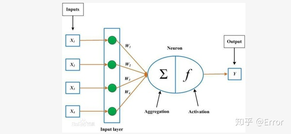
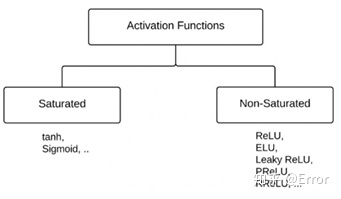
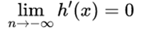
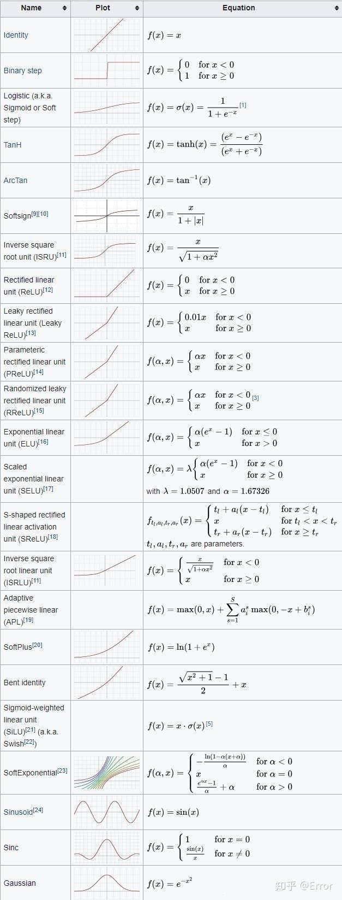
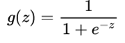
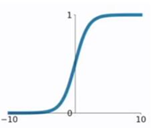
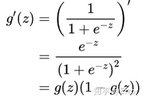
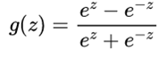
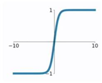
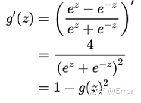

# 激活函数

⌚️: 2020年8月9日

📚参考

- [原文1](https://zhuanlan.zhihu.com/p/139696588)
- [原文2](https://zhuanlan.zhihu.com/p/84418420)

---

**什么是激活函数？**

简单的说，**激活函数**就是在神经网络的神经元上运行的函数，负责将神经元的输入映射到输出端，它的作用是**为了增加神经网络模型的非线性变化**。




神经元(Neuron)内右侧的函数，就是激活函数(Activation)

## 1. DL中的激活函数

### **1.1 饱和激活函数问题**



假设h(x)是一个激活函数。

1. 当我们的n趋近于正无穷，激活函数的导数趋近于0，那么我们称之为**右饱和**。


2. 当我们的n趋近于负无穷，激活函数的导数趋近于0，那么我们称之为**左饱和**。



当一个函数既满足左饱和又满足右饱和的时候我们称之为**饱和**。

不满足上述两个条件的，称为**不饱和激活函数**。

### **2.常用的激活函数**

在深度学习中，目前常用的激活函数主要有：***sigmoid、tanh、ReLU、PReLU、Swish、Mish，***下面一一简要介绍：



## 2. Sigmoid

**该函数是将取值为 (−∞,+∞) 的数映射到（0，1）之间。**




sigmiod函数公式




函数图像


对于sigmoid函数的求导推导为：



> 可以看出当Z值非常大或者非常小的时候，会导致其导数趋近于零，也就是权重的梯度趋近于零，即**梯度消失**。

```python
from matplotlib import pyplot as plt
import numpy as np
import math
def sigmoid_function(z):
    fz = []
    for num in z:
        fz.append(1/(1 + math.exp(-num)))
    return fz

if __name__ == '__main__':
    z = np.arange(-10, 10, 0.01)
    fz = sigmoid_function(z)
    plt.title('Sigmoid Function')
    plt.xlabel('z')
    plt.ylabel('σ(z)')
    plt.plot(z, fz)
    plt.show()
```

## 3. tanh

**相较于sigmoid函数要常见一些，该函数是将取值为 (−∞,+∞) 的数映射到 (−1,1) 之间。**




tanh函数公式




tanh函数图像：在 0 附近很短一段区域内可看做线性的。由于tanh函数均值为 0 ，因此弥补了sigmoid函数均值为 0.5 的缺点。

对于tanh函数的求导推导为：



> tanh函数的缺点同sigmoid函数的第一个缺点一样，当 z 很大或很小时，g′(z) 接近于 0 ，会导致梯度很小，权重更新非常缓慢，即**梯度消失**问题。

## 4. ReLU

**又称为修正线性单元（Rectified Linear Unit），是一种分段线性函数，其弥补了sigmoid函数以及tanh函数的梯度消失问题。**


Relu函数公式


Relu函数图像

对于ReLU函数的求导为：


> **ReLU函数的优点：**
>
> - 在输入为正数的时候（对于大多数输入 z 空间来说），不存在梯度消失问题。
> - 计算速度要快很多。ReLU函数只有线性关系，不管是前向传播还是反向传播，都比sigmod和tanh要快很多。（sigmod和tanh要计算指数，计算速度会比较慢）
>
> 
>
> **ReLU函数的缺点：**
>
> - 当输入为负时，梯度为0，会产生**梯度消失**问题。

## 5. Leaky ReLU

**它是一种对ReLU函数改进的函数，又称为PReLU函数。**


PReLU函数公式，其中 a 取值在 (0,1) 之间。


PReLU函数图像

Leaky ReLU函数的导数为：


> Leaky ReLU函数解决了ReLU函数在**输入为负的情况下产生的梯度消失问题**。

## 6. Swish

Swish 在深层模型上的效果优于 ReLU。可以看做是**介于线性函数与ReLU函数之间的平滑函数**.例如，仅仅使用 Swish 单元替换 ReLU 就能把 Mobile NASNetA 在 ImageNet 上的 top-1 分类准确率提高 0.9%，Inception-ResNet-v 的分类准确率提高 0.6%。

函数公式： 

β是个常数或可训练的参数，Swish 具备**无上界有下界、平滑、非单调**的特性。


Swish函数图像

## 7. Mish

一种自正则的非单调神经激活函数，平滑的激活函数允许更好的信息深入神经网络，从而得到更好的准确性和泛化。根据论文实验，该函数在最终准确度上比Swish(+0.494%)和ReLU(+ 1.671%)都有提高。

[Mish: A Self Regularized Non-Monotonic Neural Activation Functionarxiv.org](https://link.zhihu.com/?target=https%3A//arxiv.org/vc/arxiv/papers/1908/1908.08681v1.pdf)

函数公式： ![[公式]](https://www.zhihu.com/equation?tex=f%28x%29+%3D+x+%2A+tanh%28log%281%2Be%5E%7Bx%7D+%29%29)

函数图像：


Mish函数图像

```python
# torch中代码实现
class Mish(nn.Module):
    def __init__(self):
        super().__init__()
        print("Mish avtivation loaded...")

    def forward(self,x):
        x = x * (torch.tanh(F.softplus(x)))
        return x
```

**为什么Mish表现这么好？**

以上无边界(即正值可以达到任何高度)避免了由于封顶而导致的饱和。理论上对负值的轻微允许允许更好的梯度流，而不是像ReLU中那样的硬零边界。

最后，可能也是最重要的，目前的想法是，**平滑的激活函数允许更好的信息深入神经网络，从而得到更好的准确性和泛化**。

尽管如此，我测试了许多激活函数，它们也满足了其中的许多想法，但大多数都无法执行。这里的主要区别可能是Mish函数在曲线上几乎所有点上的平滑度。

这种通过Mish激活曲线平滑性来推送信息的能力如下图所示，在本文的一个简单测试中，越来越多的层被添加到一个测试神经网络中，而没有一个统一的函数。随着层深的增加，ReLU精度迅速下降，其次是Swish。相比之下，Mish能更好地保持准确性，这可能是因为它能更好地传播信息：


更平滑的激活功能允许信息更深入地流动……注意，随着层数的增加，ReLU快速下降。

