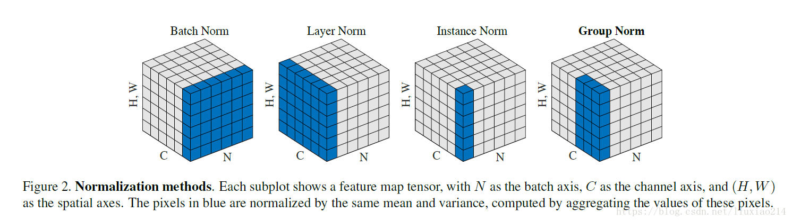
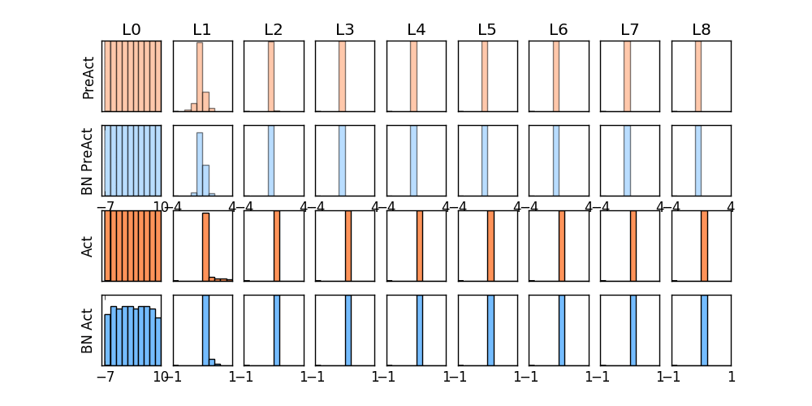
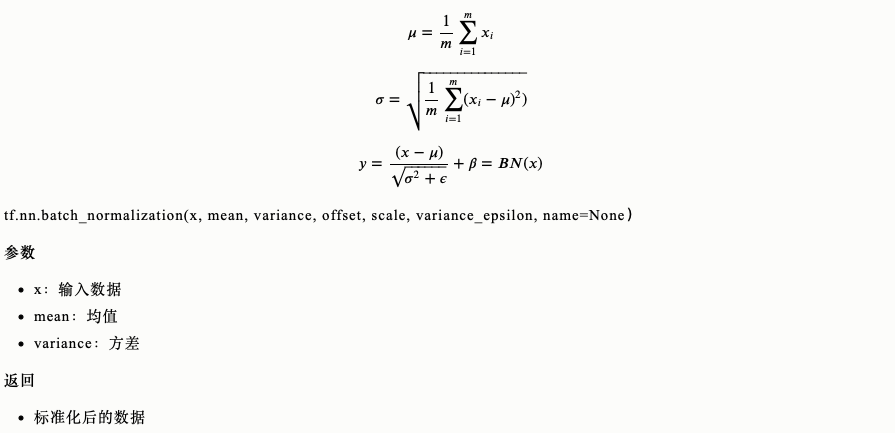
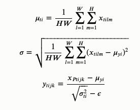
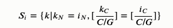
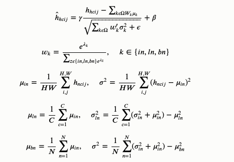
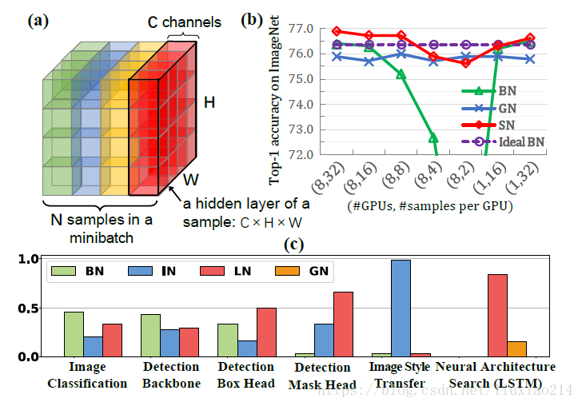
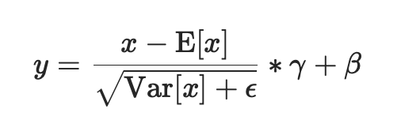
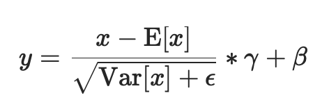
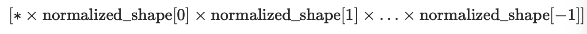

# BN/LN/IN/GN/SN

Batch Normalization、Layer Normalization、Instance Normalization、Group Normalization、Switchable Normalization比较

⌚️: 2020年10月22日

📚参考

- [原文-1](https://www.cnblogs.com/wanghui-garcia/p/10877700.html)

- [原文-2](https://www.cnblogs.com/LXP-Never/p/11566064.html)

---

深度神经网络难训练一个重要的原因就是深度神经网络涉及很多层的叠加，每一层的参数变化都会导致下一层输入数据分布的变化，随着层数的增加，高层输入数据分布变化会非常剧烈，这就使得高层需要不断适应低层的参数更新。为了训练好模型，我们需要谨慎初始化网络权重，调整学习率等。

本篇博客总结几种归一化办法，并给出相应计算公式和代码。

归一化层，目前主要有这几个方法，[Batch Normalization](https://arxiv.org/pdf/1502.03167.pdf)（2015年）、[Layer Normalization](https://arxiv.org/pdf/1607.06450v1.pdf)（2016年）、[Instance Normalization](https://arxiv.org/pdf/1607.08022.pdf)（2017年）、[Group Normalization](https://arxiv.org/pdf/1803.08494.pdf)（2018年）、[Switchable Normalization](https://arxiv.org/pdf/1806.10779.pdf)（2018年）；

将输入的图像shape记为[**N**, **C**hannel, **H**eight, **W**idth]，这几个方法主要的区别就是在，

- **batch Norm**：在batch上，对NHW做归一化，对小batchsize效果不好；
- **layer Norm**：在通道方向上，对CHW归一化，主要对RNN作用明显；
- **instance Norm**：在图像像素上，对HW做归一化，用在风格化迁移；
- **Group Norm**：将channel分组，然后再做归一化；
- **Switchable Norm**：将BN、LN、IN结合，赋予权重，让网络自己去学习归一化层应该使用什么方法。



那我们就看看下面的两个动图, 这就是在每层神经网络有无 batch normalization 的区别




没有normalization 的输出数据很多都等于0，导致后面的神经元“死掉”，起不到任何作用。

## 1. Batch Normalization

　　首先，在进行训练之前，一般要对数据做归一化，使其分布一致，但是在深度神经网络训练过程中，通常以送入网络的每一个batch训练，这样每个batch具有不同的分布；而且在训练过程中，数据分布会发生变化，对下一层网络的学习带来困难。

　　batch normalization就是强行**将数据拉回到均值为0，方差为1的正太分布上，这样不仅数据分布一致，而且避免发生梯度消失**。保证每一次数据经过归一化后还保留原有学习来的特征，同时又能完成归一化操作，加速训练。 



## 2. Layer Normalizaiton

batch normalization存在以下缺点：

- 对batch size的大小比较敏感，由于每次计算均值和方差是在一个batch上，所以如果batch size太小，则计算的均值、方差不足以代表整个数据分布；
- BN实际使用时需要计算并且保存某一层神经网络batch的均值和方差等统计信息，对于对一个固定深度的前向神经网络（DNN，CNN）使用BN，很方便；但对于RNN来说，sequence的长度是不一致的，换句话说RNN的深度不是固定的，不同的time-step需要保存不同的statics特征，可能存在一个特殊sequence比其他sequence长很多，这样training时，计算很麻烦。

LN是针对深度网络的某一层的所有神经元的输入按以下公式进行normalize操作。


**BN与LN的区别在于**：

- LN中同层神经元输入拥有相同的均值和方差，不同的输入样本有不同的均值和方差；
- BN中则针对不同神经元输入计算均值和方差，同一个batch中的输入拥有相同的均值和方差。

所以，LN不依赖于batch的大小和输入sequence的深度，因此可以用于batchsize为1和RNN中对边长的输入sequence的normalize操作。

LN用于RNN效果比较明显，但是在CNN上，不如BN。

tf.keras.layers.LayerNormalization(axis=-1, epsilon=0.001, center=True, scale=True)

参数

- axis：想要规范化的轴（通常是特征轴）
- epsilon：将较小的浮点数添加到方差以避免被零除。
- center：如果为True，则将的偏移`beta`量添加到标准化张量。
- `scale`：如果为True，则乘以`gamma`

返回

- shape与输入形状相同的值

## 3. Instance Normalization

　　BN注重对每个batch进行归一化，保证数据分布一致，因为判别模型中结果取决于数据整体分布。

　　但是图像风格化中，生成结果主要依赖于某个图像实例，所以对整个batch归一化不适合图像风格化中，因而对HW做归一化。可以加速模型收敛，并且保持每个图像实例之间的独立。



[`tfa.layers.normalizations.InstanceNormalization`](https://www.tensorflow.org/addons/api_docs/python/tfa/layers/InstanceNormalization)

输入：仅在该层只有一个输入（即，它连接到一个传入层）时适用。

返回：输入张量或输入张量列表。

```
def Instancenorm(x, gamma, beta):

    # x_shape:[B, C, H, W]
    results = 0.
    eps = 1e-5

    x_mean = np.mean(x, axis=(2, 3), keepdims=True)
    x_var = np.var(x, axis=(2, 3), keepdims=True0)
    x_normalized = (x - x_mean) / np.sqrt(x_var + eps)
    results = gamma * x_normalized + beta
    return results
```

## 4. Group Normalization

主要是针对Batch Normalization对小batchsize效果差，GN将channel方向分group，然后每个group内做归一化，算`(C//G)*H*W`的均值，这样与batchsize无关，不受其约束。



```
def GroupNorm(x, gamma, beta, G=16):

    # x_shape:[B, C, H, W]
    results = 0.
    eps = 1e-5
    x = np.reshape(x, (x.shape[0], G, x.shape[1]/16, x.shape[2], x.shape[3]))

    x_mean = np.mean(x, axis=(2, 3, 4), keepdims=True)
    x_var = np.var(x, axis=(2, 3, 4), keepdims=True0)
    x_normalized = (x - x_mean) / np.sqrt(x_var + eps)
    results = gamma * x_normalized + beta
    return results
```

## 5. Switchable Normalization

本篇论文作者认为，

- 第一，归一化虽然提高模型泛化能力，然而归一化层的操作是人工设计的。在实际应用中，解决不同的问题原则上需要设计不同的归一化操作，并没有一个通用的归一化方法能够解决所有应用问题；
- 第二，一个深度神经网络往往包含几十个归一化层，通常这些归一化层都使用同样的归一化操作，因为手工为每一个归一化层设计操作需要进行大量的实验。

因此作者提出自适配归一化方法——Switchable Normalization（SN）来解决上述问题。与强化学习不同，SN使用可微分学习，为一个深度网络中的每一个归一化层确定合适的归一化操作。



```
def SwitchableNorm(x, gamma, beta, w_mean, w_var):
    # x_shape:[B, C, H, W]
    results = 0.
    eps = 1e-5

    mean_in = np.mean(x, axis=(2, 3), keepdims=True)
    var_in = np.var(x, axis=(2, 3), keepdims=True)

    mean_ln = np.mean(x, axis=(1, 2, 3), keepdims=True)
    var_ln = np.var(x, axis=(1, 2, 3), keepdims=True)

    mean_bn = np.mean(x, axis=(0, 2, 3), keepdims=True)
    var_bn = np.var(x, axis=(0, 2, 3), keepdims=True)

    mean = w_mean[0] * mean_in + w_mean[1] * mean_ln + w_mean[2] * mean_bn
    var = w_var[0] * var_in + w_var[1] * var_ln + w_var[2] * var_bn

    x_normalized = (x - mean) / np.sqrt(var + eps)
    results = gamma * x_normalized + beta
    return results
```

结果比较



## 6.Pytorch常用normalization函数 

### 1.BN

batchNorm是在batch上，对NHW做归一化;即是将同一个batch中的所有样本的同一层特征图抽出来一起求mean和variance

加快收敛速度，允许网络使用更高的学习率。可作为一个正则化器，减少对dropout的需求

但是当batch size较小时(小于16时)，效果会变差，这时使用group norm可能得到的效果会更好

 

**class torch.nn.BatchNorm2d(num_features, eps=1e-05, momentum=0.1, affine=True)**

对小批量(mini-batch)3d数据组成的4d输入进行批标准化(Batch Normalization)操作



进行了两步操作：可见Batch Normalization的解释

- 先对输入进行归一化，E(x)为计算的均值，Var(x)为计算的方差
- 然后对归一化的结果进行缩放和平移，设置affine=True，即意味着weight(γ)和bias(β)将被使用

在每一个小批量（mini-batch）数据中，计算输入各个维度的均值和标准差。γ与β是可学习的大小为C的参数向量（C为输入大小)。默认γ取值为U(0,1)，β设置为0

同样，默认情况下，在训练期间，该层将运行其计算的平均值和方差的估计值，然后在验证期间使用这些估计值（即训练求得的均值/方差）进行标准化。运行估计(running statistics)时保持默认momentum为0.1。

如果track_running_stats被设置为False，那么这个层就不会继续运行验证，并且在验证期间也会使用批处理统计信息。

 

⚠️这个momentum参数不同于优化器optimizer类中使用的momentum参数和momentum的传统概念。从数学上讲，这里运行统计数据的更新规则是 :

- x是估计的数据
- xt是新的观察到的数据

xnew = (1-momentum) * x + momentum * xt

 

因为批处理规范化是在C维(channel通道维度)上完成的，计算(N,H,W)片上的统计信息，所以通常将其称为空间批处理规范化。

**参数：**

- **num_features：** C来自期待的输入大小(N,C,H,W)
- **eps：** 即上面式子中分母的ε ，为保证数值稳定性（分母不能趋近或取0）,给分母加上的值。默认为1e-5。
- **momentum：** 动态均值和动态方差所使用的动量。默认为0.1。
- **affine：** 一个布尔值，当设为true，给该层添加可学习的仿射变换参数，即γ与β。
- **track_running_stats**：一个布尔值，当设置为True时，该模块跟踪运行的平均值和方差，当设置为False时，该模块不跟踪此类统计数据，并且始终在train和eval模式中使用批处理统计数据。默认值:True

**Shape：** 

输入：（N, C，H, W) 

输出：（N, C, H, W）（输入输出相同）

 

举例：

当affine=True时

```
import torch
from torch import nn

m = nn.BatchNorm2d(2,affine=True)
print(m.weight)
print(m.bias)

input = torch.randn(1,2,3,4)
print(input)
output = m(input)
print(output)
print(output.size())
```

返回：

```
Parameter containing:
tensor([0.5247, 0.4397], requires_grad=True)
Parameter containing:
tensor([0., 0.], requires_grad=True)
tensor([[[[ 0.8316, -1.6250,  0.9072,  0.2746],
          [ 0.4579, -0.2228,  0.4685,  1.2020],
          [ 0.8648, -1.2116,  1.0224,  0.7295]],

         [[ 0.4387, -0.8889, -0.8999, -0.2775],
          [ 2.4837, -0.4111, -0.6032, -2.3912],
          [ 0.5622, -0.0770, -0.0107, -0.6245]]]])
tensor([[[[ 0.3205, -1.1840,  0.3668, -0.0206],
          [ 0.0916, -0.3252,  0.0982,  0.5474],
          [ 0.3409, -0.9308,  0.4373,  0.2580]],

         [[ 0.2664, -0.2666, -0.2710, -0.0211],
          [ 1.0874, -0.0747, -0.1518, -0.8697],
          [ 0.3160,  0.0594,  0.0860, -0.1604]]]],
       grad_fn=<NativeBatchNormBackward>)
torch.Size([1, 2, 3, 4])
```


当affine=False时

```
import torch
from torch import nn

m = nn.BatchNorm2d(2,affine=False)
print(m.weight)
print(m.bias)

input = torch.randn(1,2,3,4)
print(input)
output = m(input)
print(output)
print(output.size())
```

返回：

```
None
None
tensor([[[[-1.5365,  0.2642,  1.0482,  2.0938],
          [-0.0906,  1.8446,  0.7762,  1.2987],
          [-2.4138, -0.5368, -1.2173,  0.2574]],

         [[ 0.2518, -1.9633, -0.0487, -0.0317],
          [-0.9511,  0.2488,  0.3887,  1.4182],
          [-0.1422,  0.4096,  1.4740,  0.5241]]]])
tensor([[[[-1.2739,  0.0870,  0.6795,  1.4698],
          [-0.1811,  1.2814,  0.4740,  0.8689],
          [-1.9368, -0.5183, -1.0326,  0.0819]],

         [[ 0.1353, -2.3571, -0.2028, -0.1837],
          [-1.2182,  0.1320,  0.2894,  1.4478],
          [-0.3080,  0.3129,  1.5106,  0.4417]]]])
torch.Size([1, 2, 3, 4])
```

 

###  2.InstanceNorm2d（当mini-batch时使用）

instanceNorm在图像像素上，对HW做归一化；即是对batch中的单个样本的每一层特征图抽出来一层层求mean和variance，与batch size无关。若特征层为1，即C=1，准则instance norm的值为输入本身

```
CLASS torch.nn.InstanceNorm2d(num_features, eps=1e-05, momentum=0.1, affine=False, track_running_stats=False)
```

在4D输入上应用instance Normalization(带有额外channel维度的mini-batch 2D输入),即shape为[N,C,H,W]



在mini-batch中的对象的均值和标准差是每个维度分开计算的。如果affine=True,则γ和β这两个可学习的参数向量，大小为C，C为输入大小。

这一层使用从训练和评估模式的输入数据计算得到的instace数据。

 

如果track_running_stats被设置为True，那么在训练期间，该层将继续运行计算均值和方差的估计，得到的均值和方差将使用到评估(eval)时的normalization中。运行估计时保持默认momentum为0.1。

 

⚠️这个momentum参数不同于优化器optimizer类中使用的momentum参数和momentum的传统概念。从数学上讲，这里运行统计数据的更新规则是 :

- x是估计的数据
- xt是新的观察到的数据

xnew = (1-momentum) * x + momentum * xt

 

⚠️

InstanceNorm2d和LayerNorm非常相似，但是有一些细微的差别。InstanceNorm2d应用于RGB图像等信道数据的每个信道，而LayerNorm通常应用于整个样本，并且通常用于NLP任务。此外，LayerNorm应用元素仿射变换，而InstanceNorm2d通常不应用仿射变换。

**参数：**

- **num_features：** C来自期待的输入大小(N,C,H,W)
- **eps：** 即上面式子中分母的ε ，为保证数值稳定性（分母不能趋近或取0）,给分母加上的值。默认为1e-5。
- **momentum：** 动态均值和动态方差所使用的动量。默认为0.1。
- **affine：** 一个布尔值，当设为true，给该层添加可学习的仿射变换参数，即γ与β。
- **track_running_stats**：一个布尔值，当设置为True时，该模块跟踪运行的平均值和方差，当设置为False时，该模块不跟踪此类统计数据，并且始终在train和eval模式中使用批处理统计数据。默认值:False

**Shape：** 

输入：（N, C，H, W) 

输出：（N, C, H, W）（输入输出相同）

 

举例：

```
import torch
input = torch.randn(2,3,2,2)
input
```

返回：

```
tensor([[[[-0.9262,  0.1619],
          [ 2.3522,  1.2739]],

         [[-2.1725,  1.3967],
          [ 1.4407,  1.3133]],

         [[-0.8386, -1.1728],
          [-3.0443, -0.3651]]],


        [[[ 0.9468, -0.9257],
          [ 0.5376,  0.4858]],

         [[ 1.1766,  0.4704],
          [ 0.8294, -0.3892]],

         [[ 0.2836,  0.5864],
          [-0.3070,  0.3229]]]])
```


```
import torch.nn as nn
#声明仿射变换要写成
#m = nn.InstanceNorm2d(3, affine=True)
m = nn.InstanceNorm2d(3)#feature数量，即channel number = 3
output = m(input)
output
```

返回：

```
tensor([[[[-1.3413, -0.4523],
          [ 1.3373,  0.4563]],

         [[-1.7313,  0.5856],
          [ 0.6141,  0.5315]],

         [[ 0.5082,  0.1794],
          [-1.6616,  0.9740]]],


        [[[ 0.9683, -1.6761],
          [ 0.3904,  0.3173]],

         [[ 1.1246, -0.0883],
          [ 0.5283, -1.5646]],

         [[ 0.1903,  1.1173],
          [-1.6182,  0.3106]]]])
```


### 3.LayerNorm（当mini-batch时使用）

layerNorm在通道方向上，对CHW归一化；即是将batch中的单个样本的每一层特征图抽出来一起求一个mean和variance，与batch size无关，不同通道有着相同的均值和方差

```
CLASS torch.nn.LayerNorm(normalized_shape, eps=1e-05, elementwise_affine=True)
```

平均值和标准偏差分别计算在最后几个维数上，这些维数必须是normalized_shape指定的形状。如果elementwise_affine=True,则γ和β为两个可学习的仿射变换参数向量，大小为normalized_shape

⚠️与batch normalization和instance normalization不同，batch normalization使用affine选项为每个通道/平面应用标量尺度γ和偏差β，而layer normalization使用elementwise_affine参数为每个元素应用尺度和偏差。

 

这一层使用从训练和评估模式的输入数据计算得到的统计数据。

**参数：**

- **normalized_shape** ([*int*](https://docs.python.org/3/library/functions.html#int) *or* [*list*](https://docs.python.org/3/library/stdtypes.html#list) *or* *torch.Size*)：

  来自期待输入大小的输入形状

  如果使用单个整数，则将其视为一个单例列表，并且此模块将在最后一个维度上进行规范化，而最后一个维度应该具有特定的大小。

- **eps：** 即上面式子中分母的ε ，为保证数值稳定性（分母不能趋近或取0）,给分母加上的值。默认为1e-5。

- ***\*elementwise_affine\**：** 一个布尔值，当设置为True时，此模块具有可学习的元素仿射参数，γ初始化为1(表示权重)和β初始化为0(表示偏差)。默认值:True。

**Shape：** 

输入：（N, *)

输出：（N, *）（输入输出相同）

 

举例：

```
import torch
input = torch.randn(2,3,2,2)
input
```

返回：

```
tensor([[[[-0.9262,  0.1619],
          [ 2.3522,  1.2739]],

         [[-2.1725,  1.3967],
          [ 1.4407,  1.3133]],

         [[-0.8386, -1.1728],
          [-3.0443, -0.3651]]],


        [[[ 0.9468, -0.9257],
          [ 0.5376,  0.4858]],

         [[ 1.1766,  0.4704],
          [ 0.8294, -0.3892]],

         [[ 0.2836,  0.5864],
          [-0.3070,  0.3229]]]])
```

 

```
import torch.nn as nn
#取消仿射变换要写成
#m = nn.LayerNorm(input.size()[1:], elementwise_affine=False)
m1 = nn.LayerNorm(input.size()[1:])#input.size()[1:]为torch.Size([3, 2, 2])
output1 = m1(input)
output1
```

返回：

```
tensor([[[[-0.5555,  0.1331],
          [ 1.5192,  0.8368]],

         [[-1.3442,  0.9146],
          [ 0.9423,  0.8618]],

         [[-0.5001, -0.7116],
          [-1.8959, -0.2004]]],


        [[[ 1.0599, -2.1829],
          [ 0.3512,  0.2616]],

         [[ 1.4578,  0.2348],
          [ 0.8565, -1.2537]],

         [[-0.0887,  0.4357],
          [-1.1115, -0.0206]]]], grad_fn=<AddcmulBackward>)
```

 

```
#只normalize后两个维度
m2 = nn.LayerNorm([2,2])
output2 = m2(input)
output2
```

返回：

```
tensor([[[[-1.3413, -0.4523],
          [ 1.3373,  0.4563]],

         [[-1.7313,  0.5856],
          [ 0.6141,  0.5315]],

         [[ 0.5082,  0.1794],
          [-1.6616,  0.9740]]],


        [[[ 0.9683, -1.6761],
          [ 0.3904,  0.3173]],

         [[ 1.1246, -0.0883],
          [ 0.5283, -1.5646]],

         [[ 0.1903,  1.1173],
          [-1.6182,  0.3106]]]], grad_fn=<AddcmulBackward>)
```

 

```
#只normalize最后一个维度
m3 = nn.LayerNorm(2)
output3 = m3(input)
output3
```

返回：

```
tensor([[[[-1.0000,  1.0000],
          [ 1.0000, -1.0000]],

         [[-1.0000,  1.0000],
          [ 0.9988, -0.9988]],

         [[ 0.9998, -0.9998],
          [-1.0000,  1.0000]]],


        [[[ 1.0000, -1.0000],
          [ 0.9926, -0.9926]],

         [[ 1.0000, -1.0000],
          [ 1.0000, -1.0000]],

         [[-0.9998,  0.9998],
          [-0.9999,  0.9999]]]], grad_fn=<AddcmulBackward>)
```


### 4.GroupNorm（当mini-batch时使用）

GroupNorm将channel分组；即是将batch中的单个样本的G层特征图抽出来一起求mean和variance，与batch size无关

当batch size较小时(小于16时)，使用该normalization方法效果更好

```
CLASS torch.nn.GroupNorm(num_groups, num_channels, eps=1e-05, affine=True)
```


输入通道被分成num_groups组，每个组包含num_channels / num_groups个通道。每组的均值和标准差分开计算。如果affine=True,则γ和β这两个可学习的通道仿射变换参数向量的大小为num_channels。

这一层使用从训练和评估模式的输入数据计算得到的统计数据。

 

**参数：**

- **num_features(int)：** 将通道分成的组的数量
- **num_channels(int)：输入期待的通道数**
- **eps：** 即上面式子中分母的ε ，为保证数值稳定性（分母不能趋近或取0）,给分母加上的值。默认为1e-5。
- **affine：** 一个布尔值，当设为true，给该层添加可学习的仿射变换参数，即γ与β。

**Shape：** 

输入：（N, C，*) ，C = ***\*num_channels\****

输出：（N, C, *）（输入输出相同）

 

 举例：

```
import torch
input = torch.randn(2,4,3,3)
input
```

返回：

```
tensor([[[[-0.9154,  0.7312,  1.0657],
          [ 0.1783,  1.4014,  1.3043],
          [-0.7661, -0.6346,  0.7620]],

         [[ 0.9533,  2.1763,  0.4636],
          [ 0.0624, -0.0880,  1.2591],
          [ 0.5080,  0.2156,  0.0312]],

         [[ 0.2077, -0.2373,  0.2203],
          [-0.0628, -0.4680, -0.0094],
          [ 0.8615,  0.8549,  0.4138]],

         [[ 1.2188, -0.6487,  1.9315],
          [-1.0211, -0.1721,  0.6426],
          [-0.8192,  1.1049,  0.3663]]],


        [[[ 1.7522, -0.5378, -0.6105],
          [ 0.0658, -0.5731,  0.8737],
          [-0.2006,  0.3185,  0.6959]],

         [[ 0.5581, -1.5815,  0.3467],
          [-1.7975,  1.1900, -0.0935],
          [-0.7640, -0.7520, -1.2672]],

         [[-0.3703,  1.8731, -0.4689],
          [ 0.3615,  1.7101,  0.7305],
          [-0.0244, -0.5019,  0.3259]],

         [[-0.1413, -0.7416, -0.0747],
          [-0.6557,  0.5025, -0.0574],
          [ 0.2727,  2.2837,  1.6237]]]])
```


 

```
import torch.nn as nn
#将4个通道分为2组
m1 = nn.GroupNorm(2,4)
output1 = m1(input)
output1
```

返回：

```
tensor([[[[-1.7640,  0.3119,  0.7336],
          [-0.3852,  1.1568,  1.0344],
          [-1.5757, -1.4099,  0.3508]],

         [[ 0.5919,  2.1338, -0.0254],
          [-0.5312, -0.7208,  0.9774],
          [ 0.0305, -0.3381, -0.5706]],

         [[-0.0478, -0.6420, -0.0310],
          [-0.4090, -0.9500, -0.3377],
          [ 0.8251,  0.8163,  0.2273]],

         [[ 1.3022, -1.1914,  2.2539],
          [-1.6886, -0.5550,  0.5328],
          [-1.4190,  1.1501,  0.1639]]],


        [[[ 2.0315, -0.4375, -0.5158],
          [ 0.2133, -0.4755,  1.0844],
          [-0.0739,  0.4858,  0.8927]],

         [[ 0.7441, -1.5628,  0.5162],
          [-1.7956,  1.4254,  0.0415],
          [-0.6814, -0.6685, -1.2239]],

         [[-0.8227,  1.6729, -0.9325],
          [-0.0087,  1.4915,  0.4018],
          [-0.4380, -0.9692, -0.0482]],

         [[-0.5680, -1.2358, -0.4939],
          [-1.1402,  0.1482, -0.4747],
          [-0.1075,  2.1296,  1.3954]]]], grad_fn=<AddcmulBackward>)
```


 

```
#将4个通道分为4组,等价于Instance Norm
m2 = nn.GroupNorm(4,4)
output2 = m2(input)
output2
```

返回：

```
tensor([[[[-1.4648,  0.4451,  0.8332],
          [-0.1962,  1.2226,  1.1099],
          [-1.2916, -1.1390,  0.4809]],

         [[ 0.4819,  2.2510, -0.2265],
          [-0.8068, -1.0243,  0.9242],
          [-0.1623, -0.5852, -0.8520]],

         [[ 0.0230, -1.0124,  0.0523],
          [-0.6064, -1.5490, -0.4821],
          [ 1.5439,  1.5284,  0.5023]],

         [[ 0.9624, -0.9711,  1.7004],
          [-1.3567, -0.4777,  0.3659],
          [-1.1476,  0.8445,  0.0798]]],


        [[[ 2.0642, -0.9777, -1.0742],
          [-0.1760, -1.0246,  0.8973],
          [-0.5298,  0.1598,  0.6611]],

         [[ 1.0550, -1.1571,  0.8364],
          [-1.3803,  1.7083,  0.3813],
          [-0.3119, -0.2995, -0.8321]],

         [[-0.9221,  1.7498, -1.0396],
          [-0.0506,  1.5556,  0.3889],
          [-0.5102, -1.0789, -0.0929]],

         [[-0.4993, -1.1290, -0.4294],
          [-1.0388,  0.1761, -0.4113],
          [-0.0650,  2.0445,  1.3521]]]], grad_fn=<AddcmulBackward>)
```


 

```
#将4个通道分为4组,等价于layer Norm
m3 = nn.GroupNorm(4,4)
output3 = m3(input)
output3
```

返回：

```
tensor([[[[-1.4648,  0.4451,  0.8332],
          [-0.1962,  1.2226,  1.1099],
          [-1.2916, -1.1390,  0.4809]],

         [[ 0.4819,  2.2510, -0.2265],
          [-0.8068, -1.0243,  0.9242],
          [-0.1623, -0.5852, -0.8520]],

         [[ 0.0230, -1.0124,  0.0523],
          [-0.6064, -1.5490, -0.4821],
          [ 1.5439,  1.5284,  0.5023]],

         [[ 0.9624, -0.9711,  1.7004],
          [-1.3567, -0.4777,  0.3659],
          [-1.1476,  0.8445,  0.0798]]],


        [[[ 2.0642, -0.9777, -1.0742],
          [-0.1760, -1.0246,  0.8973],
          [-0.5298,  0.1598,  0.6611]],

         [[ 1.0550, -1.1571,  0.8364],
          [-1.3803,  1.7083,  0.3813],
          [-0.3119, -0.2995, -0.8321]],

         [[-0.9221,  1.7498, -1.0396],
          [-0.0506,  1.5556,  0.3889],
          [-0.5102, -1.0789, -0.0929]],

         [[-0.4993, -1.1290, -0.4294],
          [-1.0388,  0.1761, -0.4113],
          [-0.0650,  2.0445,  1.3521]]]], grad_fn=<AddcmulBackward>)
```

 

pix2pix代码中该部分的使用：

```
class Identity(nn.Module):
    def forward(self, x):
        return x


def get_norm_layer(norm_type='instance'):
    """返回标准化层

    Parameters:
        norm_type (str) -- 标准化层的名字，有: batch | instance | none

    对于BatchNorm，我们使用可学习的仿射参数并追踪运行数据(mean/stddev)
    对于InstanceNorm，我们不使用可学习的仿射参数也不追踪运行数据
    """
    if norm_type == 'batch':
        norm_layer = functools.partial(nn.BatchNorm2d, affine=True, track_running_stats=True)
    elif norm_type == 'instance':
        norm_layer = functools.partial(nn.InstanceNorm2d, affine=False, track_running_stats=False)
    elif norm_type == 'none':
        norm_layer = lambda x: Identity()
    else:
        raise NotImplementedError('normalization layer [%s] is not found' % norm_type)
    return norm_layer
```


 