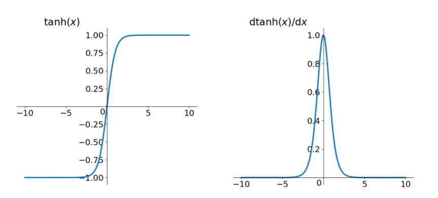
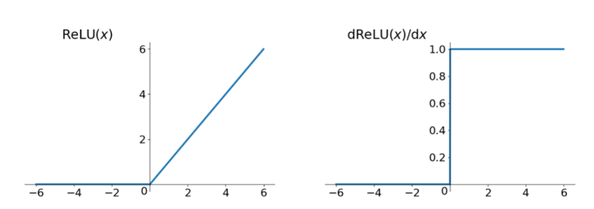

# 梯度消失、爆炸原因及其解决方法

⌚️: 2020年8月9日

📚参考

---

**前言**

本文主要深入介绍深度学习中的梯度消失和梯度爆炸的问题以及解决方案。本文分为三部分，第一部分主要直观的介绍深度学习中为什么使用梯度更新，第二部分主要介绍深度学习中梯度消失及爆炸的原因，第三部分对提出梯度消失及爆炸的解决方案。有基础的同鞋可以跳着阅读。

其中，梯度消失爆炸的解决方案主要包括以下几个部分。

```linux
- 预训练加微调
- 梯度剪切、权重正则（针对梯度爆炸）
- 使用不同的激活函数
- 使用batchnorm
- 使用残差结构
- 使用LSTM网络
```

## 1. 为什么要使用梯度更新规则

在介绍梯度消失以及爆炸之前，先简单说一说梯度消失的根源—–深度神经网络和反向传播。目前深度学习方法中，深度神经网络的发展造就了我们可以构建更深层的网络完成更复杂的任务，深层网络比如深度卷积网络，LSTM等等，而且最终结果表明，在处理复杂任务上，深度网络比浅层的网络具有更好的效果。但是，目前优化神经网络的方法都是基于反向传播的思想，即根据损失函数计算的误差通过梯度反向传播的方式，指导深度网络权值的更新优化。这样做是有一定原因的，首先，深层网络由许多非线性层堆叠而来，每一层非线性层都可以视为是一个非线性函数 *f*(*x*)(非线性来自于非线性激活函数），因此整个深度网络可以视为是一个复合的非线性多元函数 `$F(x)=f_n (...f_3 (f_2 ( f_1 (x) ∗ θ_1 + b) ∗ θ_2 + b )...)$`

我们最终的目的是希望这个多元函数可以很好的完成输入到输出之间的映射，假设不同的输入，输出的最优解是g(x) ，那么，优化深度网络就是为了寻找到合适的权值，满足$Loss=L(g(x),F(x))$取得极小值点，比如最简单的损失函数


,假设损失函数的数据空间是下图这样的，我们最优的权值就是为了寻找下图中的最小值点，对于这种数学寻找最小值问题，采用梯度下降的方法再适合不过了。


## 2. 梯度消失、爆炸

梯度消失与梯度爆炸其实是一种情况，看接下来的文章就知道了。两种情况下梯度消失经常出现，一是在**深层网络**中，二是采用了**不合适的激活函数**，比如sigmoid。梯度爆炸一般出现在深层网络和**权值初始化值太大**的情况下，下面分别从这两个角度分析梯度消失和爆炸的原因。

### 2.1 深层网络角度

比较简单的深层网络如下：


图中是一个四层的全连接网络，假设每一层网络激活后的输出为$f_i (x)$,其中*i*为第*i*层, *x*代表第*i*层的输入，也就是第i− 1层的输出，f是激活函数，那么，得出`$f_{i+1}=f(f_i ∗ w_{i + 1} +b_{i+1})$`，简单记为`$f_{i+1}=f(f_i ∗ w_{i+1})$`。

BP算法基于梯度下降策略，以目标的负梯度方向对参数进行调整，参数的更新为w*←*w*+Δ*w，给定学习率*α*，得出$Δw=−α\frac{∂Loss}{∂w}$​。如果要更新第二隐藏层的权值信息，根据链式求导法则，更新梯度信息：`$Δw2=\frac{∂Loss}{∂w_2}=\frac{∂Loss}{∂f_4}\frac{∂f_4}{∂f_3}\frac{∂f_3}{∂f_2}\frac{∂f_2}{∂w_2}$`，很容易看出来`$\frac{∂f2}{∂w2}=\frac{∂f}{∂(f1∗w2)}f1$`，即第二隐藏层的输入。

所以说，`$\frac{∂f4}{∂f3} × w4$`就是对激活函数进行求导，如果此部分大于1，那么层数增多的时候，最终的求出的梯度更新将以指数形式增加，即发生**梯度爆炸**，如果此部分小于1，那么随着层数增多，求出的梯度更新信息将会以指数形式衰减，即发生了**梯度消失**。如果说从数学上看不够直观的话，下面几个图可以很直观的说明深层网络的梯度问题：

**注：下图中的隐层标号和第一张全连接图隐层标号刚好相反。**
图中的曲线表示权值更新的速度，对于下图两个隐层的网络来说，已经可以发现隐藏层2的权值更新速度要比隐藏层1更新的速度慢


那么对于四个隐层的网络来说，就更明显了，第四隐藏层比第一隐藏层的更新速度慢了两个数量级：


**总结：从深层网络角度来讲，不同的层学习的速度差异很大，表现为网络中靠近输出的层学习的情况很好，靠近输入的层学习的很慢，有时甚至训练了很久，前几层的权值和刚开始随机初始化的值差不多。因此，梯度消失、爆炸，其根本原因**在于反向传播训练法则，属于先天不足，另外多说一句，Hinton提出capsule的原因就是为了彻底抛弃反向传播，如果真能大范围普及，那真是一个革命。

### 2.2 激活函数角度

其实也注意到了，上文中提到计算权值更新信息的时候需要计算前层偏导信息，因此如果激活函数选择不合适，比如使用sigmoid，梯度消失就会很明显了，原因看下图，左图是sigmoid的损失函数图，右边是其导数的图像，如果使用sigmoid作为损失函数，其梯度是不可能超过0.25的，这样经过链式求导之后，很容易发生梯度消失，sigmoid函数数学表达式为：$sigmoid(x)=\frac{1}{1+e^{−x}}$


同理，tanh作为激活函数，它的导数图如下，可以看出，tanh比sigmoid要好一些，但是它的导数仍然是小于1的。tanh数学表达为：$tanh(x)=\frac{e^x − e^{−x}}{e^x + e{−x}}$




## 3. 梯度消失、爆炸的解决方案

### 3.1 方案1-预训练加微调

此方法来自Hinton在2006年发表的一篇论文，Hinton为了解决梯度的问题，提出采取无监督逐层训练方法，其基本思想是每次训练一层隐节点，训练时将上一层隐节点的输出作为输入，而本层隐节点的输出作为下一层隐节点的输入，此过程就是逐层“预训练”（pre-training）；在预训练完成后，再对整个网络进行“微调”（fine-tunning）。Hinton在训练深度信念网络（Deep Belief Networks中，使用了这个方法，在各层预训练完成后，再利用BP算法对整个网络进行训练。此思想相当于是先寻找局部最优，然后整合起来寻找全局最优，此方法有一定的好处，但是目前应用的不是很多了。

 [权重初始化](init.md)


### 3.2 方案2-梯度剪切、正则

**梯度剪切**这个方案主要是针对梯度爆炸提出的，其思想是设置一个梯度剪切阈值，然后更新梯度的时候，如果梯度超过这个阈值，那么就将其强制限制在这个范围之内。这可以防止梯度爆炸。

> 注：在WGAN中也有梯度剪切限制操作，但是和这个是不一样的，WGAN限制梯度更新信息是为了保证lipchitz条件。

另外一种解决梯度爆炸的手段是采用**权重正则化**（weithts regularization）比较常见的是l1正则，和l2正则，在各个深度框架中都有相应的API可以使用正则化，若搭建网络的时候已经设置了正则化参数，则调用以下代码可以直接计算出正则损失：

```
regularization_loss = tf.add_n(tf.losses.get_regularization_losses(scope='my_resnet_50'))
```

如果没有设置初始化参数，也可以使用以下代码计算*l*2正则损失：

```
l2_loss = tf.add_n([tf.nn.l2_loss(var) for var in tf.trainable_variables() if 'weights' in var.name])
```

正则化是通过对网络权重做正则限制过拟合，仔细看正则项在损失函数的形式：


其中，*α*是指正则项系数，因此，如果发生梯度爆炸，权值的范数就会变的非常大，通过正则化项，可以部分限制梯度爆炸的发生。

> 注：事实上，在深度神经网络中，往往是梯度消失出现的更多一些。

### 3.3 方案3-relu、leakrelu、elu等[激活函数](activation.md)

#### 3.3.1 Relu

思想也很简单，如果激活函数的导数为1，那么就不存在梯度消失爆炸的问题了，每层的网络都可以得到相同的更新速度，relu就这样应运而生。先看一下relu的数学表达式：


其函数图像：




从上图中，我们可以很容易看出，relu函数的导数在正数部分是恒等于1的，因此在深层网络中使用relu激活函数就不会导致梯度消失和爆炸的问题。

**relu**的主要贡献在于：

```
 -- 解决了梯度消失、爆炸的问题
 -- 计算方便，计算速度快
 -- 加速了网络的训练
```

同时也存在一些**缺点**：

```
-- 由于负数部分恒为0，会导致一些神经元无法激活（可通过设置小学习率部分解决）
-- 输出不是以0为中心的
```

尽管relu也有缺点，但是仍然是目前使用最多的激活函数

#### **3.3.2 leakrelu**

leakrelu就是为了解决relu的0区间带来的影响，其数学表达为：$leakrelu=max(k∗x,x)$其中k是leak系数，一般选择0.01或者0.02，或者通过学习而来


leakrelu解决了0区间带来的影响，而且包含了relu的所有优点

#### **3.3.3 elu**

elu激活函数也是为了解决relu的0区间带来的影响，其数学表达为：
其函数及其导数数学形式为：


但是elu相对于leakrelu来说，计算要更耗时间一些

### 3.4 解决方案4-[batchnorm](batchnorm.md)

**Batchnorm**是深度学习发展以来提出的最重要的成果之一了，目前已经被广泛的应用到了各大网络中，具有加速网络收敛速度，提升训练稳定性的效果，Batchnorm本质上是解决反向传播过程中的梯度问题。batchnorm全名是batch normalization，简称BN，即批规范化，通过规范化操作将输出信号x规范化保证网络的稳定性。

具体的batchnorm原理非常复杂，在这里不做详细展开，此部分大概讲一下batchnorm解决梯度的问题上。具体来说就是反向传播中，经过每一层的梯度会乘以该层的权重，举个简单例子：

正向传播中$f_2 = f_1 ( w^T ∗ x + b ) $，那么反向传播中，$\frac{∂f2}{∂w}=\frac{∂f2}{∂f1}x$，反向传播式子中有*x*的存在，所以*x*的大小影响了梯度的消失和爆炸，batchnorm就是通过对每一层的输出规范为均值和方差一致的方法，消除了*x*带来的放大缩小的影响，进而解决梯度消失和爆炸的问题，或者可以理解为**BN将输出从饱和区拉倒了非饱和区**。

### 2.5 解决方案5-残差结构

**残差结构**说起残差的话，不得不提这篇论文了：Deep Residual Learning for Image Recognition，这里只简单介绍残差如何解决梯度的问题。

事实上，就是残差网络的出现导致了image net比赛的终结，自从残差提出后，几乎所有的深度网络都离不开残差的身影，相比较之前的几层，几十层的深度网络，在残差网络面前都不值一提，残差可以很轻松的构建几百层，一千多层的网络而不用担心梯度消失过快的问题，原因就在于残差的捷径（shortcut）部分，其中残差单元如下图所示：


相比较于以前网络的直来直去结构，残差中有很多这样的跨层连接结构，这样的结构在反向传播中具有很大的好处，见下式：


式子的第一个因子表示的损失函数到达 L 的梯度，小括号中的1表明短路机制可以无损地传播梯度，而另外一项残差梯度则需要经过带有weights的层，梯度不是直接传递过来的。残差梯度不会那么巧全为-1，而且就算其比较小，有1的存在也不会导致梯度消失。所以残差学习会更容易。

> 注：上面的推导并不是严格的证明。

### 3.6 解决方案6-LSTM

**LSTM**全称是长短期记忆网络（long-short term memory networks），是不那么容易发生梯度消失的，主要原因在于LSTM内部复杂的“门”(gates)，如下图，LSTM通过它内部的“门”可以接下来更新的时候“记住”前几次训练的”残留记忆“，因此，经常用于生成文本中。目前也有基于CNN的LSTM，感兴趣的可以尝试一下。


